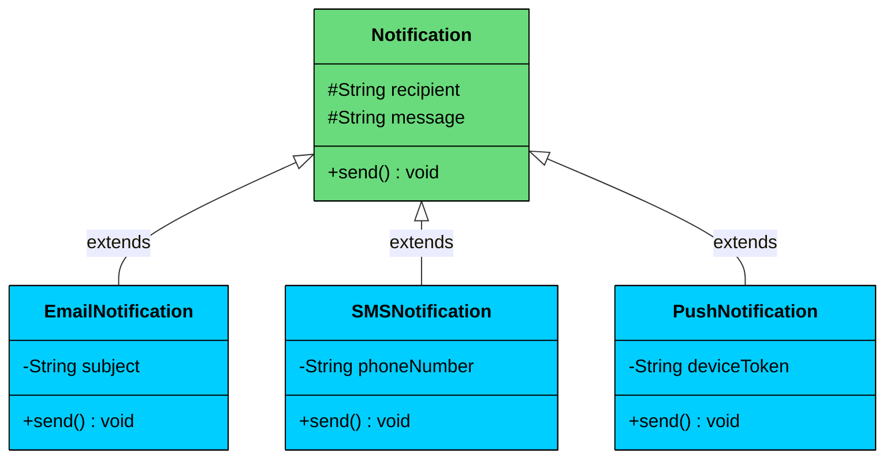

Polymorphism allows **the same method name or interface** to exhibit **different behaviors depending on the object that is invoking it**.

The term "polymorphism" comes from Greek and means *"many forms."* In programming, it allows us to write code that is **generic, extensible, and reusable**, while the specific behavior is determined **at runtime or compile-time** based on the object’s actual type.

> Polymorphism lets you 
>
> **call the same method on different objects**
>
> , and have each object respond in its own way.

You write code that targets a **common type**, but the actual behavior is determined by the **concrete implementation**.

---

> 💡 **Key Insight:**

> **Real-World Analogy**
>
> Think of a **universal** **remote control**.
>
> - The buttons are the same: `powerOn()`, `volumeUp()`, `mute()`.
> - But depending on the device: a **TV**, **Air Conditioner**, or **Projector** each button performs a different action.
>
> For the user, the interface (remote) never changes. But internally, each device interprets the same signal differently.
>
> That’s **polymorphism in action.** The same interface triggers **different behaviors** depending on the receiver (device type).

---

# Why Polymorphism Matters

 Here are four concrete benefits that polymorphism provides.

- **Encourages loose coupling:** You interact with abstractions (interfaces or base classes), not specific implementations.
- **Enhances flexibility:** You can introduce new behaviors without modifying existing code, supporting the **Open/Closed Principle**.
- **Promotes scalability:** Systems can grow to support more features with minimal impact on existing code.
- **Enables extensibility:** You can “plug in” new implementations without touching the core business logic.

---

# How Polymorphism Works

Polymorphism in OOP comes in two forms: compile-time (decided before the program runs) and runtime (decided while the program runs). Both allow the same method name to behave differently, but the mechanism is fundamentally different.

## 1. Compile-time Polymorphism (Method Overloading)

Compile-time polymorphism, also called **method overloading**, happens when you have multiple methods with the same name in the same class but with different parameter lists. 

The compiler determines which version to call based on the number, types, or order of arguments at the call site. The decision is made before the program runs.

##### Example

```java
class Calculator {
    // Two ints
    int add(int a, int b) {
        return a + b;
    }

    // Two doubles
    double add(double a, double b) {
        return a + b;
    }

    // Three ints
    int add(int a, int b, int c) {
        return a + b + c;
    }
}

public class Main {
    public static void main(String[] args) {
        Calculator calc = new Calculator();
        System.out.println(calc.add(2, 3));        // Calls add(int, int) -> 5
        System.out.println(calc.add(2.5, 3.5));    // Calls add(double, double) -> 6.0
        System.out.println(calc.add(1, 2, 3));     // Calls add(int, int, int) -> 6
    }
}
```

The compiler resolves which `add()` to call based on the arguments. Pass two ints, you get `add(int, int)`. Pass two doubles, you get `add(double, double)`. Pass three ints, you get `add(int, int, int)`. No runtime decision needed.

---

## 2. Runtime Polymorphism (Method Overriding / Dynamic Dispatch)

Runtime polymorphism is the more powerful and more important form. It happens when a child class **overrides** a method defined in its parent class, and the decision of which version to call is made **at runtime** based on the actual type of the object, not the declared type of the reference.

#### Example

Suppose you’re designing a system that sends notifications. You want to support email, SMS, push notifications, etc.



```java
$66
```

The key thing to notice: every element in the list is stored as a `Notification` reference, but the runtime calls the correct child class's `send()`. The variable type says `Notification`. The behavior says `EmailNotification`, `SMSNotification`, or `PushNotification`. That's runtime polymorphism.

---

# 3. Polymorphism with Interfaces vs Abstract Classes

Both interfaces and abstract classes enable polymorphism. In the notification example, you could define `Notification` as either an abstract class or an interface. The polymorphic behavior, calling `send()` on a base reference and having the child's version execute, works the same either way. So when should you use which"

| Aspect | Interface | Abstract Class |
|--------|-----------|----------------|
| **Relationship** | "can do" (capability) | "is a" (family) |
| **Shared behavior** | None (contract only) | Yes (concrete methods + fields) |
| **Multiple** | A class can implement many | A class can extend only one |
| **When to use** | Unrelated classes share a capability | Related classes share logic |
| **Example** | `Sendable` implemented by `Email`, `Invoice`, `Report` | `Notification` extended by `Email`, `SMS`, `Push` |

Use an **interface** when the implementing classes are fundamentally different but share a capability. `Email`, `Invoice`, and `Report` have nothing in common structurally, but they can all `send()`. An interface defines that contract without forcing a shared hierarchy.

Use an **abstract class** when the implementing classes are a family with shared logic. All notifications need the same `formatHeader()` method, the same `recipient` and `message` fields, and the same constructor pattern. An abstract class provides all of that, plus the abstract `send()` that each child implements differently.

In practice, many designs use both. An abstract `Notification` class provides shared fields and formatting, while a `Sendable` interface marks anything that can be sent (notifications, reports, alerts).
