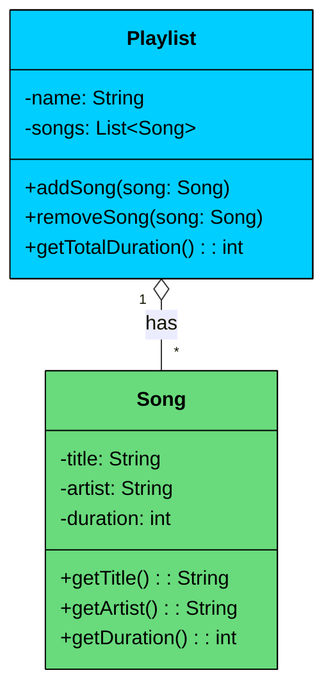
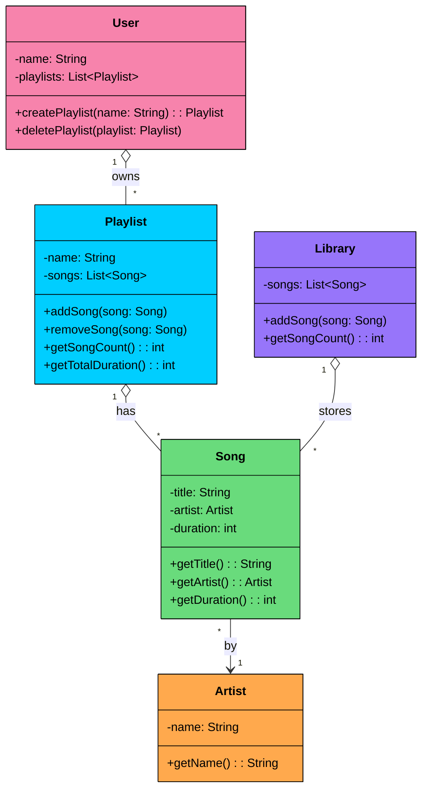

In the last chapter, we explored **Association**, the fundamental "uses-a" relationship that connects independent objects. We learned that in an association, objects have their own lifecycles.

But what happens when the relationship is a bit tighter" What if one class represents a "whole" and another represents a "part" of that whole"

Think of a university department and its professors, a team and its players, or a playlist and its songs.

This is where **Aggregation** comes in. It’s a specialized, stronger form of association that models a **"whole-part" relationship**.

---

# 1. What is Aggregation"

Aggregation is a specialized form of association that models a **whole-part relationship** with **loose ownership**. One class (the "whole") contains references to other class objects (the "parts"), but the parts can exist independently of the whole.

It's often described as a **"has-a"** relationship where the whole does not control the part's lifecycle. The key distinction from plain association is the structural hierarchy: there's a clear container and contained, not just two objects that know about each other.

### Key Characteristics of Aggregation:

- The **whole** and the **part** are logically connected through a container-contained hierarchy.
- The **part can exist independently** of the whole.
- The **whole does not create or destroy** the part.
- The **part can be shared** among multiple wholes.
- Both the whole and the part can be **created and destroyed independently**.

> If a class contains other classes 
>
> **for logical grouping only **
>
> without lifecycle ownership, it is an aggregation.

> 💡 **Key Insight:**

> **Real-World Analogy**
>
> Let’s consider a university context:
>
> - A **Department** has many **Professors**.
> - Professors may **belong to a department**, but they are **not owned** by it.
> - If a department is dissolved, the professors still **continue to exist**, possibly getting reassigned to other departments.
> - A professor can even **belong to multiple departments** in some universities.
>
> This relationship models **Aggregation:**the department and professors are linked, but their lifecycles are **not tightly coupled**.

---

# 2. UML Representation

In UML class diagrams, **aggregation** is represented by a **hollow diamond (◊)** on the "whole" side of the relationship. The diamond connects to the class that contains or references the other objects.



The diagram shows two classes connected by aggregation:

- **Playlist** holds references to multiple `Song` objects. The `1` to `*` multiplicity means one playlist can group many songs.
- **Song** is an independent entity with its own data (title, artist, duration). It doesn't know which playlists reference it.
- The **hollow diamond** (`o--`) on the `Playlist` side is the UML notation for aggregation. It signals that `Playlist` is the "whole" and `Song` is the "part," but the songs are not owned by the playlist.

---

# 3. Code Example

Let’s model a real-world aggregation: The relationship between a university **Department** and its **Professors**.

A department "has" professors, but the professors are independent entities. If the department is restructured or closed, the professors (as university employees) still exist and can be assigned to other departments. The department does not own the lifecycle of the professors.

```java
$6c
```

Pay attention to three things in this code:

- `Department` **groups** `Professor` objects, but it does not create them. The professors are created externally and passed into the department's constructor.
- The **professors exist before** the department is created and **survive after** the department is deleted. Their lifecycle is independent.
- The same professor objects could be passed to another `Department` constructor. A professor can belong to multiple departments.

If you delete the `csDept` object, the professors still exist in memory and could be reassigned to another department. That's aggregation in action.

---

# 4. Why Aggregation Matters in OOP

Choosing aggregation in your design has significant benefits for software architecture:

- **Promotes Reusability:** "Part" components (like a `Developer` or a `Microservice`) are independent and can be reused across multiple "whole" objects (`Team` or `ApiGateway`).
- **Improves Flexibility:** The relationship is loose, which **reduces coupling** between classes. You can modify the `Team` class without affecting the `Developer` class, and vice versa.
- **Reflects Real-World Relationships:** Many real-world systems (teams, projects, organizations) naturally exhibit aggregation, making your software model more intuitive and accurate.

> 💡 **Key Insight:**

> **Bad → Good → Great Example**
>
> - **Bad:** A `Team` class has a method `createNewDeveloper()`, creating and destroying `Developer` objects internally. This creates tight coupling, making it behave like composition.
> - **Good:** A `Team` class holds a reference to `Developer` instances that are created elsewhere and passed to it. This is standard aggregation.
> - **Great:** A `Team`'s dependencies (the list of `Developer`s) are provided via its constructor or a setter method (**Dependency Injection**). This is the most flexible approach, promoting high modularity and making the `Team` class easy to test with mock `Developer` objects.

---

# 5. Practical Example: Music Library System

Let's build a system that demonstrates aggregation across multiple classes. A music library manages artists, songs, playlists, and users. The relationships between these entities show how parts (songs) can be shared across multiple wholes (playlists), and how deleting a whole leaves its parts intact.

Here's how the classes connect:

- `Artist` is an independent entity that creates songs.
- `Song` belongs to an `Artist` but exists independently of any playlist.
- `Playlist` aggregates multiple `Song` objects. The same song can appear in different playlists.
- `User` aggregates multiple `Playlist` objects. Deleting a user's playlist doesn't destroy the songs.
- `Library` holds the master collection of all songs, independent of any playlist or user.



Notice the hollow diamonds on `Playlist`, `User`, and `Library`. All three aggregate their parts without owning their lifecycles. A song can exist in the library, in multiple playlists, and survive the deletion of any playlist or user.

```java
$70
```

#### Why This Design Works

- **Songs are shared across playlists.** "Hello" appears in both "Workout Mix" and "Chill Vibes." Both playlists reference the same `Song` object. If Adele updates the song metadata, both playlists see the change automatically.
- **Deleting a playlist doesn't destroy songs.** When "Workout Mix" is deleted, the library still has all 4 songs and "Chill Vibes" is unaffected. The playlist was just a container of references.
- **The library is the authoritative source.** Songs exist in the `Library` independently of any playlist. Playlists are views over the library's data, not owners of it.
- **Users own playlists, but playlists don't own songs.** This is aggregation at two levels: `User` aggregates `Playlist`, and `Playlist` aggregates `Song`. At each level, the parts survive the deletion of the whole.
