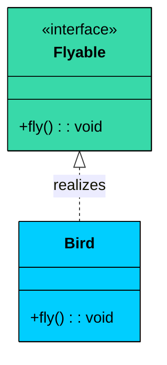
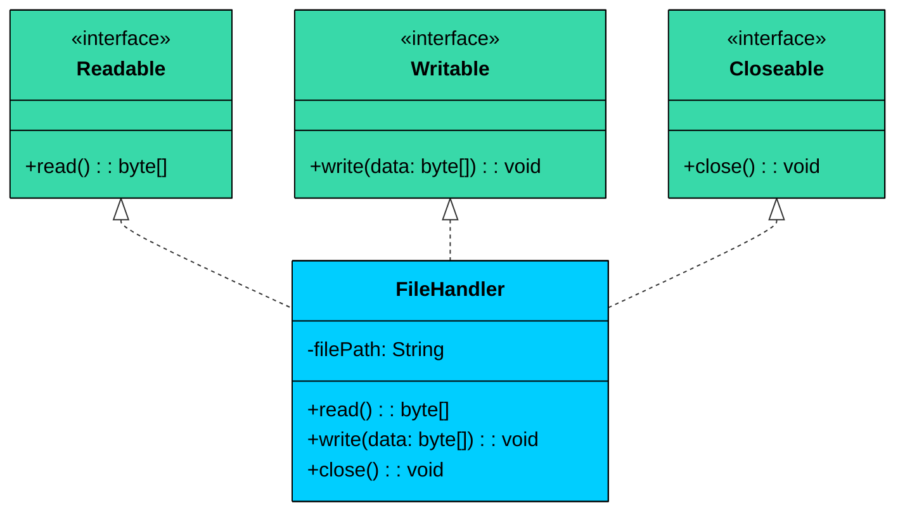
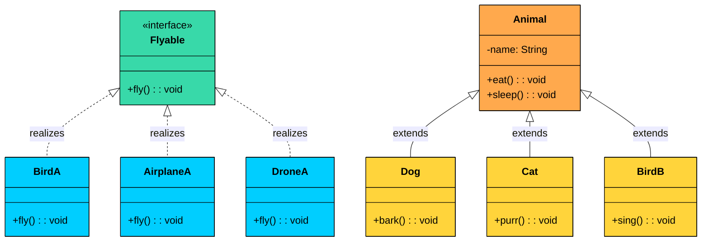

Imagine you're designing a payment system. You have different payment methods: credit card, PayPal, bank transfer, and cryptocurrency. Each method processes payments differently, but they all share the same contract: accept an amount and return a result.

How do you model this "implements a contract" relationship"

This is where **Realization** comes in. It represents the relationship between an interface (or abstract class) and the class that implements it.

> Realization is an "implements" relationship where a class fulfills a contract defined by an interface.

---

# 1. What is Realization"

Realization represents a **contract fulfillment relationship**. Think of it as a promise: the interface declares "these methods must exist," and the implementing class promises to provide them.

The relationship works like this:

- An **interface** defines what must be done (the contract)
- A **class** implements how it's done (the fulfillment)
- The implementing class must provide all methods declared in the interface
- Multiple classes can realize the same interface differently

> 💡 **Key Insight:**

> **Real-world analogy**
>
> Think of a job description. The job description (interface) defines what skills and responsibilities are required. Different employees (classes) can fulfill that job description in their own way, but they all meet the requirements.

---

# 2. UML Representation

In UML class diagrams, realization is represented by a **dashed line** with a **hollow (unfilled) triangle** pointing to the interface. This notation is intentionally similar to inheritance (which uses a solid line with a hollow triangle) but visually distinct, the dashed line signals "contract fulfillment" rather than "direct descent."

### Basic Realization



Compare this to inheritance, which uses a **solid line** with a hollow triangle. The dashed line visually suggests a "promise" or "contract" rather than direct descent.

### Multiple Interfaces

A class can implement multiple interfaces, gaining multiple capabilities. This is one of realization's biggest advantages over single inheritance.



`FileHandler` can read, write, and be closed. Each interface represents a single, focused capability. A method that only needs to read can accept `Readable`, a method that needs to close resources can accept `Closeable`. The caller doesn't need to know it's working with a `FileHandler` at all.

---

# 3. Code Example

Let's implement the `Flyable` scenario from the class diagram. Three completely unrelated classes, `Bird`, `Airplane`, and `Drone`, all realize the same `Flyable` interface. Each has different internal state and different behavior, but they all fulfill the same contract.

```java
$6a
```

Pay attention to four things that make this realization:

- **The interface defines the contract, not the implementation.** `Flyable` declares `fly()` and `getFlightInfo()`, but provides zero code. Each class writes its own version from scratch. This is fundamentally different from inheritance, where the child gets the parent's code for free.
- **The three classes are completely unrelated.** `Bird`, `Airplane`, and `Drone` share no parent class, no common fields, no shared behavior. A bird has a wingspan and species. An airplane has a model and altitude. A drone has a battery and range. They have nothing in common except the `Flyable` contract.
- **Calling code depends only on the interface.** The `main` method works with a `List<Flyable>`. It doesn't know or care what's in the list. It could be three birds, three airplanes, or a mix. The code is the same either way.
- **Adding a new flying thing requires zero changes to existing code.** Want to add a `Helicopter`" Write one new class that implements `Flyable`, add it to the list, and everything works. No existing class needs to be modified.

---

# 4. Realization vs Inheritance

Both realization and inheritance create hierarchical relationships, but they serve different purposes.



Notice the key difference: `Flyable` connects unrelated things (Bird, Airplane, Drone) that share a capability. `Animal` connects related things (Dog, Cat, Bird) that share an identity.

### **Inheritance** models identity

"A Dog IS an Animal." 

The child inherits everything from the parent, including state (fields) and behavior (methods). You use it when there's a true taxonomic relationship.

##### **Use Inheritance when:**

- There's a true "is-a" relationship (Dog is an Animal)
- You want to share implementation code across related classes
- Child classes are specializations of the parent
- State (fields) needs to be inherited

### **Realization** models capability

"A Bird CAN fly, and so can an Airplane." 

The implementing classes share what they can do, not what they are. A Bird and an Airplane have nothing else in common.

##### **Use Realization (Interfaces) when:**

- Unrelated classes share a capability (Flyable, Serializable, Comparable)
- Multiple inheritance of behavior is needed
- You want maximum flexibility and loose coupling
- The contract matters more than shared implementation

**Often you'll use both together.** A `Car` might extend `Vehicle` (sharing common vehicle behavior) while implementing `Drivable`, `Insurable`, and `Parkable` interfaces (different capabilities).
