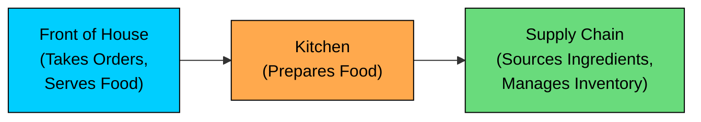
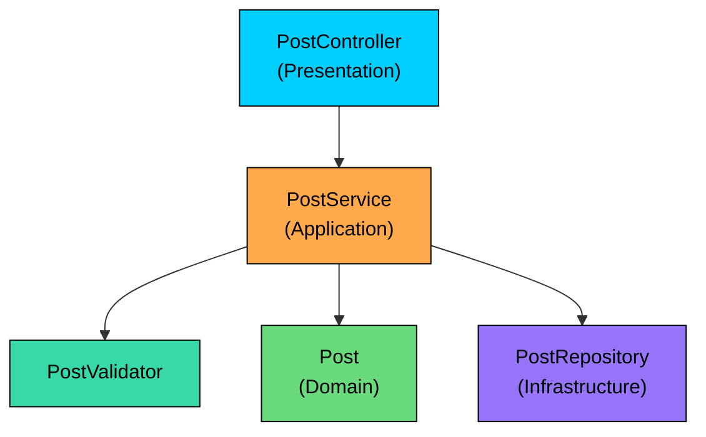

Have you ever seen a class that fetches data from the database, formats it for the UI, logs the result, and also sends a notification"

Or worked with a function that handles validation, business logic, database access, and exception handling, all in one place"

If so, you’ve witnessed a violation of **Separation of Concerns (SoC), **one of the most important architectural principles in software engineering.

In this chapter, we’ll explore what SoC really means, why it matters, how to apply it, and how it leads to cleaner, more testable, and maintainable code.

---

# 1. What Is Separation of Concerns"

> [!PAYWALL] This content is for premium members only.

> **“Separation of concerns is the process of organizing a software system so that each part addresses a distinct concern.”**

The idea was introduced by Edsger W. Dijkstra in his 1974 paper "On the role of scientific thought." He argued that the only way to deal with complex systems is to break them into manageable, independent pieces that can be reasoned about one at a time.

But what, exactly, is a "concern""

A **concern** is a piece of information or a set of behaviors that affects the system. It’s a particular aspect of the system’s functionality or requirements. Concerns can be broad or granular:

- **User Interface (UI) Logic:** How information is displayed to the user and how user input is captured.
- **Business Logic:** The core rules and processes that define the application's purpose (e.g., calculating interest, validating an order, booking a flight).
- **Data Access:** The mechanics of retrieving data from and saving data to a database, file, or API.
- **Authentication:** Verifying a user's identity.
- **Logging:** Recording events and errors for debugging and monitoring.
- **Caching:** Storing data temporarily to improve performance.

The core idea of SoC is simple:

> **Each part of your system should do one thing and do it well.**

When concerns are properly separated:

- Each part becomes easier to understand in isolation
- Changes in one part have minimal impact on others
- Teams can work on different layers without stepping on each other's toes
- Individual pieces can be tested, replaced, or reused independently

This naturally leads to two related qualities that we will explore in depth in the next chapter:

- **High Cohesion:** All the elements within a single module are closely related and work together toward a single, well-defined purpose. A highly cohesive module is a specialist. A `DatabaseConnection` class manages connections. It should not also format user-facing error messages.
- **Low Coupling:** Different modules are independent of each other. A change in one module has little to no impact on another. Low coupling is like building with LEGO bricks: you can swap out a red brick for a blue one without rebuilding the entire structure. High coupling is like a model glued together, where changing one part requires breaking everything around it.

In practice, Separation of Concerns is the principle that guides you toward high cohesion and low coupling. It is the "why" behind many design decisions you will encounter throughout this course.

---

# 2. The Restaurant Analogy

A restaurant is a great real-world example of Separation of Concerns in action. Think about how a well-run restaurant operates.

The **front of house** staff takes orders from guests and serves finished plates. They handle all customer-facing interactions, but they never cook the food themselves.

The **kitchen** receives order tickets, prepares the dishes, and sends them back to the front. The chefs focus entirely on cooking. They do not interact with customers or worry about sourcing ingredients.

The **supply chain** team sources fresh ingredients, manages inventory, and ensures the kitchen always has what it needs. They never cook or serve.



Each layer has a clear responsibility, and they communicate through well-defined boundaries (order tickets, ingredient requests). A change in how the supply chain sources tomatoes does not affect how waiters greet guests. A new menu layout at the front desk does not require the chefs to learn new cooking techniques.

This is exactly how well-designed software should work. Your presentation layer is the front of house. Your business logic is the kitchen. Your data access layer is the supply chain. Each layer does its job, communicates through clean interfaces, and remains blissfully unaware of the other layers' internal details.

Now let's see what happens when a codebase does not follow this principle.

---

# 3. A Real-World Problem

Imagine you are building a blog platform. You create a class called `PostManager` to handle the "create post" feature. Over time, one method ends up doing everything:

```java
class PostManager {
    public void createPost(HttpServletRequest request, HttpServletResponse response) {
        // Concern 1: HTTP parsing
        String title = request.getParameter("title");
        String content = request.getParameter("content");

        // Concern 2: Validation
        if (title == null || content == null) {
            response.setStatus(400);
            return;
        }

        // Concern 3: Business logic
        Post post = new Post(title, content);

        // Concern 4: Persistence
        Database.save(post);

        // Concern 5: Logging
        Logger.log("Post created: " + title);

        // Concern 6: HTTP response
        response.setStatus(200);
        response.getWriter().write("Success");
    }
}
```

Look at what this single method is responsible for. It parses HTTP parameters, validates input, creates domain objects, saves to a database, writes logs, and formats the HTTP response. That is six distinct concerns packed into one place.

On a surface read, this might seem fine. It is only about 15 lines of code. But the problems become serious as the system grows.

---

# 4. Why Mixing Concerns Is Harmful

#### **1. Harder to Read**

The more responsibilities a method has, the more mental effort it takes to understand what it does. A new developer looking at `PostManager.createPost()` needs to understand HTTP handling, validation rules, persistence mechanics, and logging conventions all at once, just to follow a single code path.

#### **2. Difficult to Maintain**

Changing one concern risks breaking another. Suppose you switch from a relational database to a document store. In the monolithic version, you are editing the same method that handles HTTP responses. A mistake in the persistence code could accidentally corrupt how you format responses.

#### **3. Poor Testability**

To unit test the business logic (creating a post), you need to set up an HTTP request object, a response object, a database connection, and a logger. You cannot test the business rule in isolation because it is tangled with infrastructure concerns.

#### **4. Code Duplication**

When concerns are not isolated, similar logic tends to get copied. If another endpoint also needs to validate that a title is present, the validation logic gets duplicated. If you later decide to add a title length check, you need to remember to update every copy.

The solution is to pull these concerns apart into their own layers. Let's do exactly that.

---

# 5. Refactoring with SoC in Mind

Let’s refactor the `PostManager` class to separate concerns into layers, each addressing a single concern:

- **Presentation Layer:** Reads HTTP input, writes HTTP responses.
- **Application Layer:** Orchestrates the use case, coordinates validation, persistence, and events.
- **Domain Layer:** Models posts and the rules that give them meaning.
- **Infrastructure Layer:** Handles persistence, logging, and any external I/O.

Here is how these layers relate to each other:



The controller talks to the service. The service coordinates everything: it validates input, creates domain objects, and delegates persistence to the repository. Each class has one job.

Let's build this step by step.

### Step 1: Input DTO and Validator

First, we create a simple data transfer object (DTO) to carry the input, and a validator that knows nothing about HTTP or databases.

```java
final class PostRequest {
    private final String title;
    private final String content;

    public PostRequest(String title, String content) {
        this.title = title;
        this.content = content;
    }
    public String title()   { return title; }
    public String content() { return content; }
}

final class PostValidator {
    public void validate(PostRequest req) {
        if (req.title() == null || req.title().isBlank()) {
            throw new ValidationException("Title is required");
        }
        if (req.content() == null || req.content().isBlank()) {
            throw new ValidationException("Content is required");
        }
        if (req.title().length() > 120) {
            throw new ValidationException("Title must be at most 120 characters");
        }
    }
}

final class ValidationException extends RuntimeException {
    public ValidationException(String message) { super(message); }
}
```

The validator is now a standalone class with no dependencies on HTTP, databases, or anything else. You can test it by simply passing in a `PostRequest` and checking whether it throws. No mocks required.

### Step 2: Domain Model

The `Post` class is a lean domain object. It holds the data that represents a blog post. No infrastructure code, no HTTP awareness, no logging. Just the entity itself.

```java
final class Post {
    private final String id;
    private final String title;
    private final String content;
    private final Instant createdAt;

    public Post(String id, String title, String content, Instant createdAt) {
        this.id = id;
        this.title = title;
        this.content = content;
        this.createdAt = createdAt;
    }

    public String id()        { return id; }
    public String title()     { return title; }
    public String content()   { return content; }
    public Instant createdAt(){ return createdAt; }
}
```

### Step 3: Ports (Interfaces) for Infrastructure

These are interfaces (or abstract classes) that the application service depends on. The actual implementations, whether they talk to PostgreSQL, MongoDB, or an in-memory store, live in the infrastructure layer. This separation means your business logic never depends on a specific technology.

```java
interface PostRepository {
    void save(Post post);
    Optional<Post> findByTitle(String title);
}

interface IdGenerator {
    String newId();
}
```

By depending on interfaces rather than concrete implementations, the service layer can work with any storage mechanism. You could swap PostgreSQL for DynamoDB without changing a single line of business logic.

### Step 4: Business Logic Layer (PostService)

This is the heart of the use case. The `PostService` coordinates validation, enforces business rules, persists the post, and returns the result. Notice it depends only on interfaces, not on specific infrastructure.

```java
$94
```

The business rules live in one place. You can swap the repository implementation or change how IDs are generated without touching any business logic.

### Step 5: Controller Layer

The controller has one job: translate HTTP into application input and map exceptions to HTTP status codes. It does not validate, does not persist, and does not contain business rules.

```java
final class PostController {
    private final PostService service;

    public PostController(PostService service) {
        this.service = service;
    }

    public void handleCreate(HttpServletRequest req, HttpServletResponse res) throws IOException {
        PostRequest input = new PostRequest(
                req.getParameter("title"),
                req.getParameter("content")
        );

        try {
            String id = service.create(input);
            res.setStatus(201);
            res.setHeader("Location", "/posts/" + id);
            res.getWriter().write("Created");
        } catch (ValidationException e) {
            res.setStatus(400);
            res.getWriter().write(e.getMessage());
        } catch (DuplicatePostException e) {
            res.setStatus(409);
            res.getWriter().write(e.getMessage());
        } catch (Exception e) {
            res.setStatus(500);
            res.getWriter().write("Unexpected error");
        }
    }
}
```

Now each layer has one job:

- **Controller** handles HTTP translation.
- **Service** coordinates the use case and enforces business rules.
- **Validator** checks input constraints.
- **Repository** (interface) defines how data is persisted.
- **Post** models the domain entity.

Each class has a clear, separate responsibility. When you need to change how posts are stored, you only touch the repository implementation. When validation rules change, you only modify the validator. When the API response format changes, you only update the controller.

---

# 6. Benefits of Separation of Concerns

Now that we have seen SoC applied, let's summarize the concrete benefits:

- **Better readability:** Each class or method focuses on one thing. A developer can understand the controller without knowing anything about database queries. They can read the validator without understanding HTTP status codes.
- **Easier to test:** You can test each component in isolation. The validator gets a plain `PostRequest`, no need to mock HTTP or databases. The service gets a mock repository, no need for a real database.
- **Improved maintainability:** Changes in one area do not ripple across others. Switching from MySQL to PostgreSQL means updating the repository implementation. The controller, service, and validator remain untouched.
- **Better collaboration:** Teams can work on different layers independently. The frontend team can work on the controller while the backend team refines the business logic. They only need to agree on the interface between the layers.
- **Easier to reuse:** Well-separated logic can be reused in different contexts. The same `PostValidator` could serve both a REST API and a command-line tool. The same `PostService` could handle requests from a web controller and a message queue consumer.

While SoC is powerful, it should not lead to fragmentation.

Avoid creating too many layers or abstractions for small applications or simple features. If a feature only needs one or two simple classes, keep it simple.

The goal is clarity, not ceremony.
