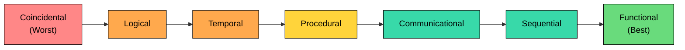
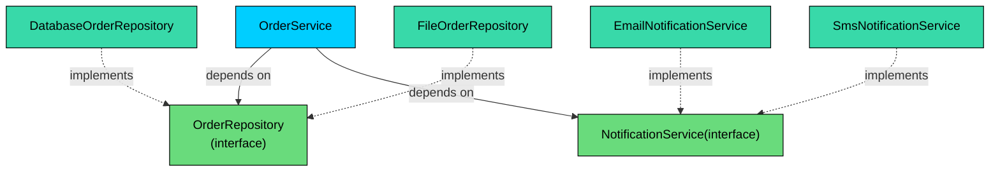
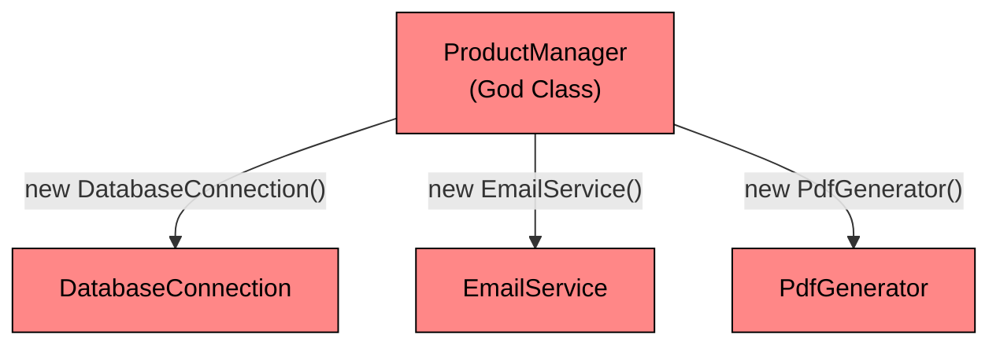
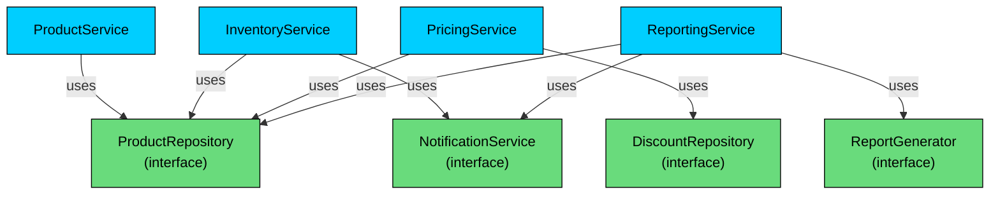

When you design a system at the low-level, you are not just deciding what classes exist. You are deciding **how those classes depend on each other** and **how responsibilities are distributed** across them.

These two decisions shape everything that follows.

- How easy the code is to change
- How safely you can extend features
- How quickly bugs spread
- How testable and maintainable the system becomes

Two fundamental design principles help you make these decisions well:** Coupling** and **Cohesion**.

---

# 1. What is Cohesion"

> [!PAYWALL] This content is for premium members only.

> **Cohesion**
>
>  measures how closely related and focused the responsibilities of a single module (like a class or a package) are. It is an internal quality of a module.

#### **High cohesion is the goal**

A highly cohesive module does one thing and does it exceptionally well. Think of a well-designed LocalDate class. Its entire existence revolves around representing and manipulating a date. It doesn't concern itself with file I/O, network requests, or user interface rendering. Its purpose is clear, focused, and unified.

#### **Low cohesion is a major code smell**

A module with low cohesion is a generalist "junk drawer" or a "God Class." It does many unrelated things. Imagine a class called Manager that handles user authentication, connects to the database, parses XML, formats reports, and sends emails. This class is a tangled mess of unrelated responsibilities.

A simple way to gauge the cohesion of a class is to try to describe what it does in a single, concise sentence.

#### Example

- **High Cohesion:** "The UserRepository class persists and retrieves User objects from the database." (Clear and focused)
- **Low Cohesion:** "The Utilities class validates emails, calculates mortgage payments, formats strings, and also handles application startup tasks." (Unfocused and sprawling)

## The Cohesion Spectrum

Cohesion isn't a binary "good or bad." Computer scientists have identified a spectrum of cohesion types, ranging from the worst (coincidental) to the best (functional).

Understanding this spectrum helps you recognize where your classes fall and how to improve them.



- **Coincidental:** Elements are grouped arbitrarily with no meaningful relationship. Example: a `Utils` class with `formatDate()`, `sendEmail()`, and `calculateTax()`.
- **Logical:** Elements perform similar categories of operations but are otherwise unrelated. Example: a class that groups all "input" operations, whether from files, keyboards, or network sockets.
- **Temporal:** Elements are grouped because they happen at the same time. Example: a `Startup` class with `initializeDatabase()`, `loadConfig()`, and `startLogger()`.
- **Procedural:** Elements are grouped because they follow a particular sequence of steps. The relationship is order, not purpose.
- **Communicational:** Elements operate on the same data. Example: a class that reads a customer record and then formats it for display.
- **Sequential:** The output of one element becomes the input of the next. Example: a pipeline where `readFile()` feeds into `parseData()` which feeds into `validateData()`.
- **Functional:** Every element contributes to a single, well-defined task. Example: a `PasswordHasher` class whose only job is hashing and verifying passwords.

You should always aim for **functional cohesion**. When a class has functional cohesion, every field and every method exists to support one clear purpose.

---

## Example

Let's look at a common example of a low-cohesion class and how we can refactor it.

### **Before: A Low-Cohesion** **OrderManager**

This `OrderManager` does everything related to an order: business logic, database persistence, and notifying the user.

```java
class OrderManager {
    public void processOrder(Order order) {
        // Concern 1: Business Logic - Validation
        if (order.getItems().isEmpty()) {
            System.err.println("Order must have at least one item.");
            return;
        }

        // Concern 2: Persistence - Database Interaction
        try (Connection conn = DriverManager.getConnection("...")) {
            // ... JDBC code to save the order to the 'orders' table ...
            System.out.println("Order saved to database.");
        } catch (SQLException e) {
            // ... handle exception ...
        }

        // Concern 3: Notification - Emailing
        String recipient = order.getCustomerEmail();
        String subject = "Your order is confirmed!";
        // ... JavaMail API code to send an email ...
        System.out.println("Confirmation email sent to " + recipient);
    }
}
```

This `OrderManager` is doing three distinct jobs. A change to the email logic requires modifying the same class that handles database connections. It's hard to test. You cannot unit test the validation logic without also dealing with a database connection and an email server. And it's impossible to reuse just the validation part or just the persistence part independently.

### **After: Refactoring into High-Cohesion Classes**

We can separate these concerns into three specialized, highly cohesive classes. Each one has a single, well-defined purpose.

#### **1. OrderService (Business Logic)**

Its only concern is enforcing the rules of the business.

```java
class OrderService {
    // Dependencies will be injected for low coupling (more on this later)
    private final OrderRepository orderRepository;
    private final NotificationService notificationService;

    public OrderService(OrderRepository repo, NotificationService notifier) {
        this.orderRepository = repo;
        this.notificationService = notifier;
    }

    public void processOrder(Order order) {
        // Pure business logic
        if (order.getItems().isEmpty()) {
            throw new IllegalArgumentException("Order must have at least one item.");
        }

        // Delegate to the specialists
        orderRepository.save(order);
        notificationService.sendOrderConfirmation(order);
    }
}
```

#### **2. OrderRepository (Persistence)**

Its only concern is data access.

```java
class OrderRepository {
    public void save(Order order) {
        // ... JDBC or JPA code to save the order ...
        System.out.println("Saving order " + order.getId() + " to the database.");
    }
}
```

#### **3. EmailNotificationService (Notification)**

Its only concern is sending notifications.

```java
class EmailNotificationService implements NotificationService { // Implements an interface
    @Override
    public void sendOrderConfirmation(Order order) {
        // ... JavaMail code to send an email ...
        System.out.println("Confirmation email sent to " + order.getCustomerEmail());
    }
}
```

Now each class has a single, well-defined purpose. Each one can be described in one sentence without any "ands":

- `OrderService` orchestrates the order processing workflow.
- `OrderRepository` persists orders to the database.
- `EmailNotificationService` sends email notifications.

They are easy to understand, test in isolation, and maintain independently. This is the essence of high cohesion.

---

# 2. What is Coupling"

> **Coupling**
>
>  measures the degree to which one module depends on the inner workings of another module. It is an external quality that describes the relationship between modules.

#### **Low coupling is the goal**

In a low-coupled system, modules interact through stable, simple, and well-defined interfaces. They don't need to know about each other's implementation details. 

Think of a USB port. Your computer doesn't need to know if you're plugging in a keyboard, a mouse, or a flash drive. It only needs to know how to communicate over the standard USB interface. This allows you to change the peripherals without changing the computer.

#### **High coupling is a recipe for disaster**

When modules are tightly coupled, a change in one module often forces a cascade of changes in other modules. The system becomes rigid, fragile, and difficult to maintain. This is the super glue model—touch one piece, and the whole thing cracks.

## Example

Let's build on our previous example. The OrderService needs to use a repository and a notification service. A naive implementation would create high coupling by directly creating and depending on concrete classes.

Here, `OrderService` directly creates and depends on the concrete classes `OrderRepository` and `EmailNotificationService`.

```java
class OrderService {
    // Direct dependency on concrete classes
    private final OrderRepository orderRepository;
    private final EmailNotificationService notificationService;

    public OrderService() {
        // The service is responsible for creating its own dependencies.
        // This is a major red flag for high coupling!
        this.orderRepository = new OrderRepository();
        this.notificationService = new EmailNotificationService();
    }

    public void processOrder(Order order) {
        if (order.getItems().isEmpty()) {
            throw new IllegalArgumentException("Order must have at least one item.");
        }
        orderRepository.save(order);
        notificationService.sendOrderConfirmation(order);
    }
}
```

#### **What's wrong with this"**

- **Rigidity:** What if we want to save orders to a file instead of a database" We have to change the `OrderService` class itself.
- **Testability:** How can we unit test `OrderService` without actually connecting to a database and sending a real email" It's nearly impossible. We can't swap in a fake repository or a mock notification service.
- **Reusability:** We cannot reuse this `OrderService` in a context where we want to send SMS notifications instead of emails. The concrete dependency is hardcoded.

The root problem is that `OrderService` knows too much. It knows not just *what* it needs (a way to save orders, a way to send notifications) but *exactly how* those things are implemented. That's the definition of high coupling.

### **After: Low Coupling via Interfaces and Dependency Injection**

The solution is to "program to an interface, not an implementation."

#### **Step 1: Define Interfaces (Contracts)**

```java
// The contract for any persistence mechanism
public interface OrderRepository {
    void save(Order order);
}

// The contract for any notification mechanism
public interface NotificationService {
    void sendOrderConfirmation(Order order);
}
```

#### **Step 2: Implement the Interfaces**

The concrete classes remain, but now they fulfill the contract.

```java
public class DatabaseOrderRepository implements OrderRepository {
    @Override
    public void save(Order order) {
        // ... JDBC or JPA code to save the order ...
        System.out.println("Saving order " + order.getId() + " to the database.");
    }
}

public class EmailNotificationService implements NotificationService {
    @Override
    public void sendOrderConfirmation(Order order) {
        // ... JavaMail code to send an email ...
        System.out.println("Email sent to " + order.getCustomerEmail());
    }
}

// A new option that didn't exist before!
public class SmsNotificationService implements NotificationService {
    @Override
    public void sendOrderConfirmation(Order order) {
        // ... Twilio code to send an SMS ...
        System.out.println("SMS sent to " + order.getCustomerPhone());
    }
}
```

#### **Step 3: Refactor OrderService to Depend on Interfaces**

The service no longer knows or cares about the concrete implementation. It only cares about the contract. Dependencies are "injected" from the outside using constructor injection.

```java
class OrderService {
    // Dependencies are now interfaces, not concrete classes.
    private final OrderRepository orderRepository;
    private final NotificationService notificationService;

    // Dependencies are "injected" from the outside.
    public OrderService(OrderRepository repository, NotificationService notifier) {
        this.orderRepository = repository;
        this.notificationService = notifier;
    }

    public void processOrder(Order order) {
        if (order.getItems().isEmpty()) {
            throw new IllegalArgumentException("Order must have at least one item.");
        }
        orderRepository.save(order);
        notificationService.sendOrderConfirmation(order);
    }
}
```

Now the architecture looks like this:



`OrderService` depends on interfaces (stable contracts), not on concrete classes (volatile implementations). Concrete implementations sit below the interfaces, and new ones can be added at any time without touching `OrderService`. Want to save orders to a file" Create `FileOrderRepository`. Want to send push notifications" Create `PushNotificationService`. The service doesn't change.

This is what low coupling looks like. Each module knows only what it needs to know, and nothing more.

---

# 3. Relationship between Coupling and Cohesion

Coupling and cohesion are not independent forces. They are two sides of the same design coin. In practice, improving one almost always improves the other.

**Striving for high cohesion is the best way to achieve low coupling.**

- When a class has **low cohesion** (a "God Class"), it does many things. Therefore, many other classes will need to depend on it for various reasons, creating a web of **high coupling**. A change to any of its many responsibilities will have a ripple effect across the entire system.
- When a class has **high cohesion**, it does one thing. Other classes only depend on it for that single, well-defined purpose. This naturally limits the surface area for dependencies, leading to **low coupling**.

Think about it this way. If `OrderManager` handles validation, persistence, email, PDF generation, and logging, then the `ReportingService` depends on it for PDF generation, the `AuditService` depends on it for logging, and the `CustomerPortal` depends on it for email. All three are coupled to the same bloated class. 

When you split `OrderManager` into focused classes, each dependent only couples to the specific class it actually needs.

---

# 4. Practical Example: Inventory Management System

Let's bring everything together with a larger, more realistic example. We'll start with a God Class and refactor it into a well-designed system with high cohesion and low coupling.

### Before: The God Class

Here's a `ProductManager` that handles product CRUD, stock management, reorder alerts, pricing, discounts, and reporting. It directly instantiates every dependency it uses.



```java
$a5
```

This class has at least five distinct responsibilities: product CRUD, stock management, pricing logic, report generation, and sending emails. Try describing it in one sentence. You can't do it without a long list of "ands." That's the hallmark of a God Class.

It's also tightly coupled to three concrete dependencies (`DatabaseConnection`, `EmailService`, `PdfGenerator`) that it creates internally. You can't test any single responsibility without dragging along all the others.

---

### After: Refactored with High Cohesion and Low Coupling

We split the God Class into focused services, each with a single responsibility, all wired together through interfaces.



First, we define the interfaces (contracts) that our services will depend on.

```java
public interface ProductRepository {
    void save(Product product);
    Product findById(String id);
    List<Product> findAll();
}

public interface DiscountRepository {
    double findRateByCode(String code);
}

public interface NotificationService {
    void send(String recipient, String message);
    void sendWithAttachment(String recipient, String message, byte[] attachment);
}

public interface ReportGenerator {
    byte[] generate(String title, List<Product> products);
}
```

Now we build the focused services. Each one handles exactly one area of responsibility.

#### **ProductService: CRUD operations only**

```java
class ProductService {
    private final ProductRepository productRepository;

    public ProductService(ProductRepository productRepository) {
        this.productRepository = productRepository;
    }

    public void createProduct(String name, double price, int stock) {
        Product product = new Product(name, price, stock);
        productRepository.save(product);
    }

    public Product getProduct(String id) {
        return productRepository.findById(id);
    }
}
```

#### **InventoryService: Stock management and reorder alerts**

```java
class InventoryService {
    private static final int LOW_STOCK_THRESHOLD = 10;
    private final ProductRepository productRepository;
    private final NotificationService notificationService;

    public InventoryService(ProductRepository productRepository,
                            NotificationService notificationService) {
        this.productRepository = productRepository;
        this.notificationService = notificationService;
    }

    public void updateStock(String productId, int quantity) {
        Product product = productRepository.findById(productId);
        product.setStock(quantity);
        productRepository.save(product);

        if (quantity < LOW_STOCK_THRESHOLD) {
            notificationService.send("warehouse@company.com",
                "Low stock alert: " + productId + " has only " + quantity + " units left.");
        }
    }
}
```

#### **PricingService: Pricing and discount calculations**

```java
class PricingService {
    private final ProductRepository productRepository;
    private final DiscountRepository discountRepository;

    public PricingService(ProductRepository productRepository,
                          DiscountRepository discountRepository) {
        this.productRepository = productRepository;
        this.discountRepository = discountRepository;
    }

    public double calculateDiscountedPrice(String productId, String discountCode) {
        Product product = productRepository.findById(productId);
        double discountRate = discountRepository.findRateByCode(discountCode);
        return product.getPrice() * (1 - discountRate);
    }
}
```

#### **ReportingService: Report generation and distribution**

```java
class ReportingService {
    private final ProductRepository productRepository;
    private final ReportGenerator reportGenerator;
    private final NotificationService notificationService;

    public ReportingService(ProductRepository productRepository,
                            ReportGenerator reportGenerator,
                            NotificationService notificationService) {
        this.productRepository = productRepository;
        this.reportGenerator = reportGenerator;
        this.notificationService = notificationService;
    }

    public byte[] generateInventoryReport() {
        List<Product> products = productRepository.findAll();
        return reportGenerator.generate("Inventory Report", products);
    }

    public void emailInventoryReport(String recipient) {
        byte[] report = generateInventoryReport();
        notificationService.sendWithAttachment(recipient, "Monthly Inventory Report", report);
    }
}
```

#### **Why this design works:**

- **Each class can be described in one sentence.** `ProductService` manages product CRUD. `InventoryService` tracks stock levels. `PricingService` calculates prices with discounts. `ReportingService` generates and distributes reports.
- **Each class depends only on interfaces.** You can swap `DatabaseProductRepository` for `InMemoryProductRepository` in tests without changing any service code.
- **Changes are isolated.** If the discount calculation formula changes, only `PricingService` needs to be updated. `InventoryService` and `ReportingService` are completely unaffected.
- **Testing is straightforward.** To test `PricingService`, you mock `ProductRepository` and `DiscountRepository`. No database, no email server, no PDF library needed.
- **New features don't require modifying existing code.** Want to add a CSV report generator" Implement the `ReportGenerator` interface. Want to send Slack notifications" Implement the `NotificationService` interface. None of the existing services change.
