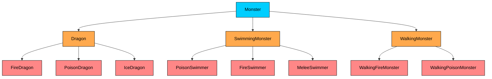
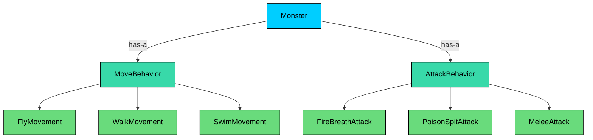

Imagine you are tasked with designing a car in a software system. Your first instinct, guided by early lessons in object-oriented programming, might be to think about what a car "is." A car needs an engine to work. An engine has `start()` and `stop()` methods. So why not just have the Car class inherit from Engine"

```java
// This is the WRONG way to think about it!
class Engine {
    public void start() { /* ... */ }
    public void stop() { /* ... */ }
}

class Car extends Engine { // A Car "is-an" Engine" No!
    // ... other car properties
}
```

This model immediately feels wrong. A car **is not** an engine. A car **has** an engine. This simple distinction in language is the key to understanding one of the most powerful principles in object-oriented design: **Favor Composition over Inheritance**.

Inheritance creates an "is-a" relationship. Composition creates a "has-a" relationship. While inheritance is a powerful tool for creating subtypes, its misuse leads to rigid, fragile, and tangled systems.

Composition, on the other hand, allows you to build complex objects by assembling smaller, independent, and interchangeable parts. Much like building with LEGO blocks, you snap components together, and you can swap any piece without rebuilding the entire structure.

This chapter will explore the classic debate between these two forms of code reuse, revealing why the simple act of "having" is often far more flexible and powerful than the act of "being."

---

# 1. The Lure of Inheritance (The "Is-A" Relationship)

> [!PAYWALL] This content is for premium members only.

Inheritance is often the first pillar of OOP that developers learn. It's an intuitive way to model the world and reuse code. We see hierarchies everywhere: a Dog is an Animal, a CheckingAccount is a BankAccount, a Button is a UIComponent.

The primary benefit of inheritance is polymorphism. You can treat a collection of different Animal subtypes (Dog, Cat, Bird) as a single list of Animal objects and call a common method like `makeSound()` on each one.

Let's model a simple character system for a video game using inheritance.

#### **The Initial Hierarchy**

We start with a base Monster class that holds common state and a default attack behavior.

```java
abstract class Monster {
    private int health;

    public void attack() {
        System.out.println("The monster attacks with its base melee attack!");
    }
    // ... other common monster methods ...
}
```

Now we want different types of monsters. Some can fly. Some can breathe fire. So we extend the hierarchy.

```java
class Dragon extends Monster {
    public void fly() {
        System.out.println("The dragon flaps its wings and takes to the sky!");
    }
}

class FireDragon extends Dragon {
    @Override
    public void attack() {
        System.out.println("The fire dragon breathes a gout of flame!");
    }
}
```

This seems logical. A Dragon is a Monster. A FireDragon is a more specific type of Dragon. We have code reuse, and the hierarchy makes sense. **For now.**

---

# 2. The Cracks in the Inheritance Hierarchy

The inheritance model works well for simple, stable hierarchies. But as soon as requirements change or grow, deep inheritance chains become a liability. Let's look at the three major problems that show up as a system evolves.

### **Problem 1: Rigidity and the Combinatorial Explosion**

Your game designer walks into the room with a list of new monsters:

- A monster that can **swim** and **spit poison**
- A monster that can **fly** and **spit poison**
- A monster that can **walk** and **breathe fire**
- A monster that can **fly** and **use melee attacks**
- A monster that can **swim** and **breathe fire**

Do we create a `SwimmingPoisonMonster`" A `FlyingPoisonMonster`" A `WalkingFireMonster`" Every combination of movement and attack style needs its own class. This is the **combinatorial explosion**, and it is one of the most common symptoms of inheritance misuse.

Here is what that hierarchy starts to look like:



Notice how the leaf classes (shown in red) multiply rapidly. We have 8 leaf classes and we have not even covered all the combinations yet. Adding a single new movement type (say, teleportation) means creating a new subclass for every existing attack type. Adding a new attack type means creating a new subclass for every existing movement type. The number of classes grows as the **product** of movement types and attack types.

Worse, Java and many other languages do not support multiple inheritance from classes, so if you need a monster that can both fly and swim, you hit a wall. Your rigid "is-a" taxonomy has failed you.

### **Problem 2: The Fragile Base Class Problem**

Inheritance creates the tightest form of coupling in OOP. A subclass is intimately tied to the **implementation** of its superclass. If a change is made to the base class, it can unexpectedly break all of its descendants.

For example, imagine we modify the `attack()` method in the Monster base class to take a `Target` parameter:

```java
// Before
public void attack() { ... }

// After
public void attack(Target target) { ... }
```

Every single Monster subclass that overrides `attack()` will instantly fail to compile. A seemingly safe change in one place shatters the entire hierarchy. The base class is "fragile" because any modification to its public or protected interface ripples downward through every descendant.

This problem gets worse as the hierarchy gets deeper. A change at level 1 can break classes at level 2, which can break classes at level 3, and so on. The deeper the hierarchy, the more fragile the system becomes.

### **Problem 3: The "Gorilla/Banana" Problem**

This famous quote from Joe Armstrong, creator of Erlang, perfectly describes a common inheritance issue:

> "You wanted a banana but what you got was a gorilla holding the banana and the entire jungle."

When you inherit from a class, you get **everything**: all of its public and protected methods and fields, whether you need them or not. If Monster has 50 methods, but your Dragon subclass only needs 10 of them, it still inherits all 50, creating a bloated and confusing object. You cannot pick and choose which parts to inherit. It is all or nothing.

This leads to classes that expose capabilities they should not have, making the API confusing and error-prone. It also means that a subclass is coupled to implementation details it never asked for and does not use.

These three problems, the combinatorial explosion, the fragile base class, and the gorilla/banana issue, all stem from the same root cause: inheritance is a mechanism for **defining what an object IS**, but it gets misused as a mechanism for **sharing what an object DOES**. That distinction is exactly where composition steps in.

---

# 3. The Composition Alternative (The "Has-A" Relationship)

Instead of forcing objects into a rigid family tree, composition lets us build them by **assembling behaviors**. The core idea is to encapsulate behaviors into their own objects and then give these "behavior objects" to the main object.

Let's solve our monster problem using composition, step by step.

### **Step 1: Identify the Behaviors and Create Interfaces**

The things that vary are movement and attack types. Instead of encoding them into a class hierarchy, we model them as **interfaces** (contracts). Any class that implements the interface can serve as that behavior, and we can swap implementations freely.

```java
public interface MoveBehavior {
    void move();
}

public interface AttackBehavior {
    void attack();
}
```

### **Step 2: Create Concrete Implementations of Those Behaviors**

These are our "LEGO blocks." Each one is small, focused, and interchangeable. Notice that they know nothing about Monster. They are standalone, reusable units of behavior.

```java
// Movement Implementations
public class FlyMovement implements MoveBehavior {
    @Override
    public void move() { System.out.println("Soaring through the sky!"); }
}

public class WalkMovement implements MoveBehavior {
    @Override
    public void move() { System.out.println("Walking on the ground."); }
}

public class SwimMovement implements MoveBehavior {
    @Override
    public void move() { System.out.println("Gliding through the water."); }
}

// Attack Implementations
public class FireBreathAttack implements AttackBehavior {
    @Override
    public void attack() { System.out.println("Breathing a gout of flame!"); }
}

public class PoisonSpitAttack implements AttackBehavior {
    @Override
    public void attack() { System.out.println("Spitting deadly poison!"); }
}

public class MeleeAttack implements AttackBehavior {
    @Override
    public void attack() { System.out.println("Attacking with claws and teeth!"); }
}
```

Here is how the composition model looks visually. Instead of a deep class tree, we have a flat structure where Monster holds references to behavior interfaces, and each interface has multiple interchangeable implementations.



Compare this to the inheritance explosion diagram from earlier. With 3 movement types and 3 attack types, composition needs 6 behavior classes plus 1 Monster class (7 total). Inheritance would need up to 9 leaf classes (3 x 3) plus the intermediate classes (easily 12+ total). And as new behaviors are added, composition scales linearly while inheritance scales multiplicatively.

### **Step 3: Compose the Main Object**

Our Monster class no longer has concrete `fly()` or `attack()` methods baked in. Instead, it **has-a** `MoveBehavior` and **has-a** `AttackBehavior`. It **delegates** the work to these behavior objects.

```java
public class Monster {
    private int health;
    private MoveBehavior moveBehavior;
    private AttackBehavior attackBehavior;

    // We "inject" the behaviors via the constructor
    public Monster(MoveBehavior moveBehavior, AttackBehavior attackBehavior) {
        this.moveBehavior = moveBehavior;
        this.attackBehavior = attackBehavior;
    }

    // The monster delegates the action to its behavior objects
    public void performMove() {
        moveBehavior.move();
    }

    public void performAttack() {
        attackBehavior.attack();
    }

    // We can even change behavior at runtime!
    public void setMoveBehavior(MoveBehavior newMoveBehavior) {
        this.moveBehavior = newMoveBehavior;
    }

    public void setAttackBehavior(AttackBehavior newAttackBehavior) {
        this.attackBehavior = newAttackBehavior;
    }
}
```

The Monster class is now simple and stable. It does not care about specific movement or attack types. It just knows it **has** something that can move and something that can attack, and it delegates to those objects.

### Step 4: Create Any Monster

Now, creating any kind of monster we can imagine is trivial and flexible. We simply pass the desired behaviors into the constructor. And if those behaviors need to change mid-game, we can swap them at runtime.

```java
public static void main(String[] args) {
    // A fire-breathing, flying monster (a dragon)
    Monster dragon = new Monster(new FlyMovement(), new FireBreathAttack());
    System.out.print("Dragon: ");
    dragon.performMove();
    System.out.print("Dragon: ");
    dragon.performAttack();

    // A poison-spitting, swimming monster (a sea serpent)
    Monster seaSerpent = new Monster(new SwimMovement(), new PoisonSpitAttack());
    System.out.print("Sea Serpent: ");
    seaSerpent.performMove();
    System.out.print("Sea Serpent: ");
    seaSerpent.performAttack();

    // What if our dragon gets its wings magically clipped"
    // We can change its behavior AT RUNTIME.
    System.out.println("\nThe dragon's wings are clipped!");
    dragon.setMoveBehavior(new WalkMovement());
    System.out.print("Dragon: ");
    dragon.performMove();
}
```

This is the **Strategy Pattern** in action, one of the most classic examples of composition. We have achieved real flexibility. There is no combinatorial explosion of classes, our base Monster class is simple and stable, and we can even change a monster's abilities during its lifetime. Want a swimming, poison-spitting monster" Just pass `new SwimMovement()` and `new PoisonSpitAttack()`. No new class needed.

---

# 4. Head-to-Head: Inheritance vs. Composition

Now that we have seen both approaches in action, let's compare them directly across the dimensions that matter most in software design.

| Aspect | Inheritance | Composition |
|--------|------------|-------------|
| **Relationship** | "is-a" (Car is a Vehicle) | "has-a" (Car has an Engine) |
| **Coupling** | Tight (subclass tied to parent's implementation) | Loose (depends on interface, not implementation) |
| **Flexibility** | Fixed at compile time | Changeable at runtime |
| **Code Reuse** | Through class hierarchy | Through object delegation |
| **Adding Behavior** | New subclass for each combination | Mix and match existing components |
| **Testing** | Hard to test in isolation (depends on parent) | Easy to mock individual dependencies |
| **Hierarchy Depth** | Can grow deep and fragile | Stays flat and stable |
| **When to Use** | True subtypes that pass the LSP test | Shared or varying behavior across unrelated objects |

Let's unpack each row.

**Relationship.** Inheritance models identity ("a Dog IS an Animal"), while composition models capability ("a Car HAS an Engine"). The critical question to ask is whether your relationship is truly about what the object *is*, or just about what it *can do*.

**Coupling.** With inheritance, the subclass knows about the parent's protected fields, constructor behavior, method signatures, and sometimes even the order of method calls. Change any of those and the subclass breaks. With composition, the main object only knows about the interface. It does not care what concrete class is behind it. You can swap `FlyMovement` for `TeleportMovement` without touching the Monster class.

**Flexibility.** Inheritance relationships are baked in at compile time. Once you write `class Dragon extends Monster`, Dragon is a Monster forever. With composition, you can call `dragon.setMoveBehavior(new WalkMovement())` in the middle of a game and the dragon's movement changes instantly. This runtime flexibility is a major advantage in real-world applications.

**Code Reuse.** Inheritance reuses code by putting shared logic in a parent class and letting children inherit it. This works until you need to reuse that logic in a class that already extends something else. Composition reuses code by creating small, self-contained behavior objects that can be plugged into any class that needs them. `FlyMovement` can be used by a Monster, a Vehicle, or a Superhero, without any of them being related by inheritance.

**Adding Behavior.** This is where the combinatorial explosion shows up. With inheritance, a new combination of existing behaviors requires a new subclass. With composition, it just requires a different constructor call. Adding a new behavior type (say, a `DefenseBehavior` interface) means creating a few implementations and adding one field to Monster. With inheritance, it would mean creating an entirely new dimension of subclasses.

**Testing.** When testing a subclass, you often need the parent class to be in a specific state, which means setting up a complex inheritance chain. With composition, you can mock each behavior independently. Testing a Monster's attack logic" Just inject a mock `AttackBehavior` and verify it gets called correctly.

**When to Use.** Inheritance shines when you have a genuine type hierarchy where every subclass truly IS a subtype of the parent, and the relationship is stable. Composition shines everywhere else, which is the vast majority of real-world code.

---

# 5. When Is Inheritance Still the Right Tool"

The principle is "**Favor** Composition," not "**Never Use** Inheritance." Inheritance is the right tool when the subclass truly **is a subtype** of the superclass, and this relationship is validated by the **Liskov Substitution Principle (LSP)**, which states that an object of the parent class should be replaceable with an object of any subclass without breaking the application.

Good examples of inheritance include:

- `ArrayList` **is-a** `List`
- `CheckingAccount` **is-a** `BankAccount`
- `IllegalArgumentException` **is-a** `RuntimeException`
- `FileInputStream` **is-a** `InputStream`

In these cases, the subclass is not just reusing code. It is genuinely specializing a concept and fully adhering to the public contract of its parent. You can pass an `ArrayList` anywhere a `List` is expected, and everything works correctly.

The key distinction is using inheritance for **subtyping** versus using it for **code sharing**. If your primary goal is just to share code between two classes that are not conceptually related, composition is almost always the better choice.

Here is a simple example of inheritance used correctly. A savings account genuinely IS a bank account. It supports all the same operations (deposit, withdraw, get balance) and adds specialized behavior on top.

```java
class BankAccount {
    protected double balance;

    public BankAccount(double initialBalance) {
        this.balance = initialBalance;
    }

    public void deposit(double amount) {
        balance += amount;
    }

    public void withdraw(double amount) {
        if (amount > balance) {
            throw new IllegalArgumentException("Insufficient funds");
        }
        balance -= amount;
    }

    public double getBalance() {
        return balance;
    }
}

// SavingsAccount IS a BankAccount: it supports all the same operations,
// and adds interest calculation on top.
class SavingsAccount extends BankAccount {
    private double interestRate;

    public SavingsAccount(double initialBalance, double interestRate) {
        super(initialBalance);
        this.interestRate = interestRate;
    }

    public void applyInterest() {
        double interest = balance * interestRate;
        deposit(interest);
    }
}
```

This inheritance is appropriate because `SavingsAccount` passes the LSP test. Anywhere your code expects a `BankAccount`, you can substitute a `SavingsAccount` and everything works correctly. The subclass only adds behavior; it does not contradict or weaken the parent's contract.

**A simple litmus test before using inheritance:**

1. Can I say "X is a Y" and have it make sense" (SavingsAccount is a BankAccount. Yes.)
2. Can I substitute X everywhere Y is expected without breaking anything" (Pass a SavingsAccount to any method taking BankAccount. Yes.)
3. Is this relationship stable and unlikely to change" (Bank accounts are a well-understood domain. Yes.)

If any answer is "no" or "maybe," reach for composition instead.
