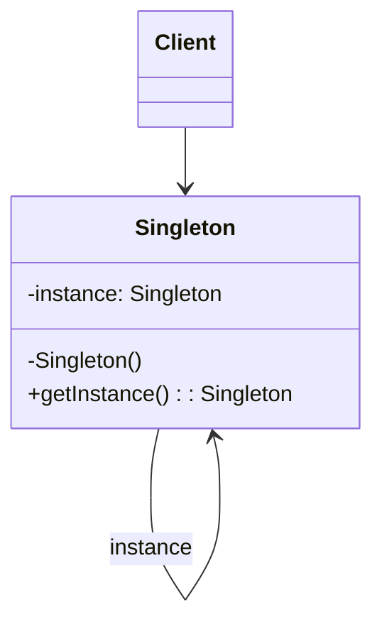
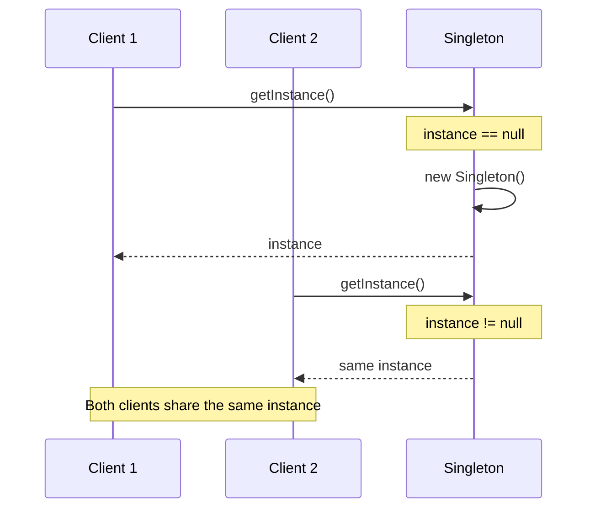
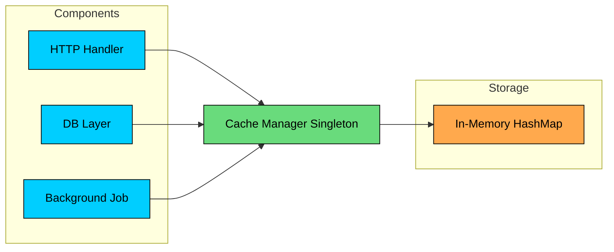

In software development, we often require classes that can only have **one object**. 

> **Example:**
>
>  thread pools, caches, loggers etc.

Creating more than one objects of these could lead to issues such as incorrect program behavior, overuse of resources, or inconsistent results.

This is where **Singleton Design Pattern** comes into play.

It is one of the simplest design patterns, yet **challenging** **to implement** correctly.

In this chapter, we will explore what Singleton pattern is, how it works, different ways you can implement it, real-world examples where it’s used and it’s pros and cons.

---

# 1. What is Singleton Pattern"

> 💡 **Key Insight:**

> **DEFINITION**
>
> **Singleton Pattern** is a **creational design pattern** that guarantees a class has only one instance and provides a global point of access to it.

Two requirements define the pattern:

1. **Single instance:** No matter how many times any part of the code requests it, the same object is returned.
2. **Global access:** Any component can reach the instance without needing it passed through constructors or method parameters.

> 💡 **Key Insight:**

> **Real-World Analogy**
>
> Think of a print spooler in an operating system. There is one spooler managing all print jobs. Applications do not create their own spoolers. They submit jobs to the one that exists. If each application ran its own spooler, print jobs would conflict, pages would interleave, and the printer would produce garbage. 
>
> The single spooler coordinates everything.

Singleton is useful in scenarios like:

- **Managing Shared Resources** (database connections, thread pools, caches, configuration settings)
- **Coordinating System-Wide Actions** (logging, print spoolers, file managers)
- **Managing State (**user session, application state**)**

#### Specific Examples:

- **Logger Classes**: Many logging frameworks use the Singleton pattern to provide a global logging object. This ensures that log messages are consistently handled and written to the same output stream.
- **Database Connection Pools**: Connection pools help manage and reuse database connections efficiently. A Singleton can ensure that only one pool is created and used throughout the application.
- **Cache Objects**: In-memory caches are often implemented as Singletons to provide a single point of access for cached data across the application.
- **Thread Pools: **Thread pools manage a collection of worker threads. A Singleton ensures that the same pool is used throughout the application, preventing resource overuse.
- **File System**: File systems often use Singleton objects to represent the file system and provide a unified interface for file operations.

---

# 2. Class Diagram

To implement the singleton pattern, we must prevent external objects from creating instances of the singleton class. Only the singleton class should be permitted to create its own objects.

Additionally, we need to provide a method for external objects to access the singleton object.

 Singleton\n    Singleton --> Singleton : instance"} -->


- An `instance` field stores the one and only Singleton object.
- The constructor is **private or otherwise restricted**, so other code cannot create new instances directly.
- A `getInstance()` (or similar) **class-level method** returns the shared instance and is accessible from anywhere.

> 💡 **Key Insight:**

> **Why not just use global variables"**
>
> Global variables in languages that support them have similar accessibility but no initialization control. A Singleton can control when and how the instance is created, perform lazy initialization, enforce thread safety during construction, and validate that only one instance ever exists.

---

# 3. How It Works

The Singleton workflow is straightforward:



#### **Step 1: First Request**

A client calls `Singleton.getInstance()`. The method checks if an instance already exists.

#### **Step 2: Instance Creation**

If no instance exists, the method creates one using the private constructor and stores it in the static field.

#### **Step 3: Return Instance**

The method returns the newly created instance.

#### **Step 4: Subsequent Requests**

Later calls to `getInstance()` find the instance already exists and return it immediately, skipping creation entirely.

The sequence diagram above shows two clients requesting the instance. The first triggers creation; the second returns the existing one. Both end up with references to the same object.

---

# 4. Implementation

Singleton implementation varies across languages. The central challenge is thread safety: if two threads call `getInstance()` simultaneously when the instance has not been created yet, both might create separate instances.

We will start with the simplest (but broken) approach and progressively improve it. After the shared implementations, we cover language-specific idioms that are recommended for production use.

## 1. Lazy Initialization (Not Thread-Safe)

This approach creates the singleton instance only when it is needed, saving resources if the singleton is never used in the application.

#### **How it works**

- `getInstance()` method checks if an instance already exists.
- If not, it creates a new instance.
- If an instance already exists, it skips the creation step.

> 💡 **Key Insight:**

> **Not Thread-Safe**
>
> This implementation is not thread-safe. If multiple threads call `getInstance()` simultaneously when `instance` is null, it's possible to create multiple instances.

---

## 2. Thread-Safe Singleton

This approach extends **lazy initialization** by ensuring the Singleton is safe to use in **multi-threaded environments**.

When multiple threads try to access the instance at the same time, synchronization (or locking) ensures that **only one thread can create the object**, while others wait.

```java
class ThreadSafeSingleton {
    private static ThreadSafeSingleton instance;

    private ThreadSafeSingleton() {}

    public static synchronized ThreadSafeSingleton getInstance() {
        if (instance == null) {
            instance = new ThreadSafeSingleton();
        }

        return instance;
    }
}
```

#### **How it works**

- The instance is created only when first requested (lazy initialization).
- The method that returns the instance uses a **lock / mutex / synchronization mechanism**.
- When a thread enters the protected section, it acquires the lock. Other threads must wait until the lock is released.
- This guarantees that only one instance is created, even under concurrent access.

> 💡 **Key Insight:**

> **Performance Consideration**
>
> This approach is correct but has a performance cost: every call to `getInstance()` acquires a lock, even after the instance has been created. Once the instance exists, there is no reason to synchronize. The next approach fixes this.

---

## 3. Double-Checked Locking

Double-checked locking reduces the performance overhead by only synchronizing during the first object creation. After the instance exists, threads skip the lock entirely.

```java
$99
```

- If the first check passes, we synchronize/lock and check the same condition one more time because multiple threads may have passed the first check.
- The instance is created only if both checks pass.

> 💡 **Key Insight:**

> **Good Performance**
>
> Although this approach is more complex to implement, it can drastically reduce performance overhead, especially when the singleton is accessed frequently.

---

## 4. Eager Initialization

In eager initialization, the Singleton instance is created **as soon as the class/module is loaded**, before any thread can access it. That makes it **inherently thread-safe** without explicit locks, because initialization happens once during load/initialization.

This approach is suitable if your application always creates and uses the singleton instance, or the overhead of creating it is minimal.

```java
class EagerSingleton {
    // Holds the single shared instance (created immediately at class load time)
    private static final EagerSingleton instance = new EagerSingleton();

    // Private constructor prevents creating objects from outside the class
    private EagerSingleton() {}

    // Global access point to get the Singleton instance
    public static EagerSingleton getInstance() {
        // Return the already-created shared instance
        return instance;
    }
}
```

- A **class-level/static** variable holds the single shared instance.
- The instance is created **during class/module initialization**, not on first use.
- No locks are needed because the runtime initializes static/class state once.

> 💡 **Key Insight:**

> **TRADEOFF**
>
> While it is inherently thread-safe, it could potentially waste resources if the singleton instance is never used by the client application.

---

## 5. Language Specific Implementations

#### Java

### Bill Pugh / Initialization-on-Demand Holder

This approach uses a static inner class to defer instance creation until `getInstance()` is first called. The JVM guarantees that inner classes are not loaded until they are referenced, giving us lazy initialization without synchronization:

```java
public class BillPughSingleton {
    private BillPughSingleton() { }

    // Inner class is not loaded until getInstance() is called
    private static class Holder {
        private static final BillPughSingleton INSTANCE = new BillPughSingleton();
    }

    public static BillPughSingleton getInstance() {
        return Holder.INSTANCE;
    }
}
```

The JVM's class loading mechanism does the heavy lifting here. `Holder` is not loaded when `Singleton` is loaded. It is only loaded when `getInstance()` is called for the first time, which triggers the initialization of `INSTANCE`. 

Class initialization in Java is guaranteed to be thread-safe by the JLS (Java Language Specification), so no explicit synchronization is needed.

> 💡 **Key Insight:**

> **SUCCESS**
>
> The Bill Pugh Singleton implementation, while more complex than Eager Initialization provides a perfect balance of lazy initialization, thread safety, and performance, without the complexities of some other patterns like double-checked locking.

---

### Enum Singleton (Recommended)

This is the simplest and safest approach in Java. [Joshua Bloch](https://en.wikipedia.org/wiki/Joshua_Bloch) recommends it in **Effective Java** as the best way to implement a Singleton:

```java
enum EnumSingleton {
    INSTANCE;

    // Public method
    public void doSomething() {
        // Add any singleton logic here
    }
}
```

The JVM provides four guarantees that no other approach offers:

1. **Thread-safe initialization:** Enum constants are initialized exactly once when the enum class is loaded, and class loading is thread-safe.
2. **Serialization safety:** Serializing and deserializing an enum returns the same instance.
3. **Reflection safety:** The JVM prevents creating enum instances via reflection. `Constructor.newInstance()` throws an `IllegalArgumentException`.
4. **Single instance guarantee:** Enforced at the JVM level, not by your code.

The only limitation is that enums cannot extend other classes (they implicitly extend `java.lang.Enum`), so if your Singleton needs a base class, you cannot use this approach.

---

### Static Block Initialization

Similar to eager initialization, but uses a static initializer block. The advantage is the ability to handle exceptions during instance creation:

```java
class StaticBlockSingleton {
    private static StaticBlockSingleton instance;

    private StaticBlockSingleton() {}

    // Static block for initialization
    static {
        try {
            instance = new StaticBlockSingleton();
        } catch (Exception e) {
            throw new RuntimeException("Exception occurred in creating singleton instance");
        }
    }

    // Public method to get the instance
    public static StaticBlockSingleton getInstance() {
        return instance;
    }
}
```

- The static block is executed when the class is loaded by the JVM.
- If an exception occurs, it's wrapped in a RuntimeException.

Use this when the constructor might throw checked exceptions and you want to handle them gracefully during class loading rather than propagating them as unhandled errors.

> 💡 **Key Insight:**

> **Performance Overhead**
>
> It is thread safe but not lazy-loaded, which might be a drawback if the initialization is resource-intensive or time-consuming.

---

# 5. Practical Example: In-Memory Cache Manager

Lets say you are building an application where multiple components (HTTP handlers, database layer, background jobs) all need to cache expensive data like user profiles, configuration, and query results. 

You want one shared cache so that any component's writes are immediately visible to all others, without duplicate maps, stale reads, or wasted memory.

#### **Without Singleton:**

```plaintext
CacheManager cacheA = new CacheManager();
cacheA.put("user:42", userData);

CacheManager cacheB = new CacheManager();
cacheB.get("user:42"); // null! Different instance, different map

// Problems:
// - Duplicate HashMaps wasting memory
// - Writes in one component invisible to others
// - TTL cleanup duplicated across instances
```

#### **With Singleton:**



All components access the single CacheManager instance, which manages one shared map, handles TTL expiry on reads, and synchronizes access internally.

```java
$9b
```

#### **Benefits Achieved:**

- Single shared cache, no duplicate data or wasted memory
- Any component's `put()` is immediately visible to all others
- Thread-safe with internal synchronization
- TTL expiry handled in one place with lazy cleanup
- No need to pass cache references through constructors

---

# 6. Pros and Cons of Singleton Pattern

### Pros

- Ensures a single instance of a class and provides a global point of access to it.
- Only one object is created, which can be particularly beneficial for resource-heavy classes.
- Provides a way to maintain global state within an application.
- Supports lazy loading, where the instance is only created when it's first needed.
- Guarantees that every object in the application uses the same global resource.

### Cons

- Violates the Single Responsibility Principle: The pattern solves two problems at the same time.
- In multithreaded environments, special care must be taken to implement Singletons correctly to avoid race conditions.
- Introduces global state into an application, which might be difficult to manage.
- Classes using the singleton can become tightly coupled to the singleton class.
- Singleton patterns can make unit testing difficult due to the global state it introduces.

It's important to note that the Singleton pattern should be used judiciously, as it introduces global state and can make testing and maintenance more challenging.

Consider alternative approaches like **dependency injection** when possible to promote loose coupling and testability.
