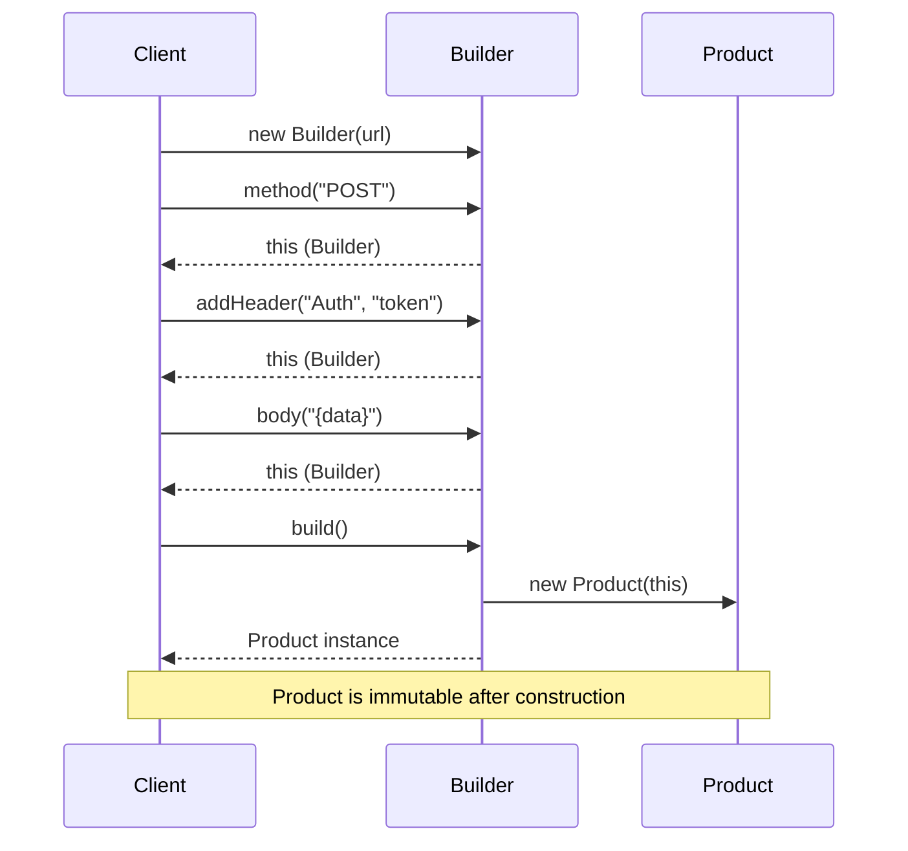
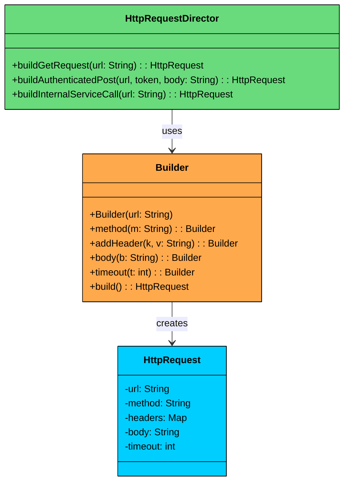

> 💡 **Key Insight:**

> **DEFINITION**
>
> The **Builder Design Pattern** is a **creational pattern** that lets you construct complex objects step-by-step, separating the construction logic from the final representation.

The Builder Design Pattern is a creational pattern that lets you construct complex objects step-by-step, separating the construction logic from the final representation.

It’s particularly useful in situations where:

- An object has **many optional fields**, and most callers only need a subset.
- You want to **avoid telescoping constructors** or long parameter lists.
- The object must be assembled through **multiple steps**, possibly in a specific order.

Without a builder, developers often end up with overloaded constructors or a wide set of setters. For example, a `User` object might include fields like name, email, phone, address, and preferences. As the number of fields grows, the API becomes harder to use correctly, easier to misuse, and more difficult to maintain. 

The **Builder Pattern** addresses this by introducing a **dedicated builder** that owns the creation logic. Clients configure the builder step by step and then build the final object, which can remain immutable, validated, and consistently constructed.

Let’s walk through a real-world example to see how we can apply the Builder Pattern to make complex object creation **cleaner, safer, and more maintainable**.

---

# 1. The Problem: Building Complex HttpRequest Objects

Imagine you're building a system that needs to **configure and create HTTP requests**. 

Each `HttpRequest` can contain a mix of required and optional fields:

- **URL** (required)
- **HTTP Method** (e.g., GET, POST, PUT, defaults to GET)
- **Headers** (optional, multiple key-value pairs)
- **Query Parameters** (optional, multiple key-value pairs)
- **Request Body** (optional, typically for POST/PUT)
- **Timeout** (optional, default to 30 seconds)

At first glance, it seems manageable. But as the number of optional fields increases, so does the complexity of object construction.

### The Naive Approach: Telescoping Constructors

A common approach is constructor overloading, often called the **telescoping constructor anti-pattern**. You define multiple constructors with increasing numbers of parameters:

```java
$a1
```

#### Example Client Code

```java
public class HttpAppTelescoping {
    public static void main(String[] args) {
        HttpRequestTelescoping req1 = new HttpRequestTelescoping("https://api.example.com/data");

        HttpRequestTelescoping req2 = new HttpRequestTelescoping(
            "https://api.example.com/submit",
            "POST",
            null,
            null,
            "{\"key\":\"value\"}"
        );

        HttpRequestTelescoping req3 = new HttpRequestTelescoping(
            "https://api.example.com/config",
            "PUT",
            Map.of("X-API-Key", "secret"),
            null,
            "config_data",
            5000
        );
    }
}
```

### What’s Wrong with This Approach"

While it works functionally, this design quickly becomes **unwieldy and error-prone** as the object becomes more complex.

#### 1. Hard to Read and Write

Multiple parameters of the same type (e.g., `String`, `Map`) make it easy to accidentally swap arguments. Code is difficult to understand at a glance, especially when most parameters are `null`.

#### 2. Error-Prone

Clients must pass `null` for optional parameters they do not want to set, increasing the risk of bugs. One wrong position and you silently assign a value to the wrong field.

#### 3. Inflexible and Fragile

If you want to set parameter 5 but not 3 and 4, you are forced to pass `null` for 3 and 4. You must follow the exact parameter order, which hurts both readability and usability.

#### 4. Poor Scalability

Adding a new optional parameter requires adding or changing constructors, which may break existing code. Testing and documentation become increasingly difficult to maintain.

We need a more flexible, readable, and maintainable way to construct `HttpRequest` objects. This is exactly where the **Builder pattern** comes in.

---

# 2. What is the Builder Pattern

The Builder pattern separates the construction of a complex object from its representation, allowing the same construction process to create different configurations.

Two ideas define the pattern:

1. **Step-by-step construction:** Instead of passing everything to a constructor at once, you set each field through individual method calls. You only call the methods for the fields you need.
2. **Fluent interface:** Each setter method returns the builder itself, allowing you to chain calls into a single readable expression that ends with `build()`.

### **Before: Telescoping Constructor**

```java
HttpRequest req = new HttpRequest(
    url,                 // url
    method,              // method
    headers,             // headers
    null,                // body
    null,                // queryParams
    30000                // timeoutMs
);
```

### **After: Builder Pattern**

```java
HttpRequest req = new HttpRequest.Builder(url)
    .method("POST")
    .addHeader("key", "val")
    .build();
```

---

## Class Diagram

The Builder pattern involves four participants. In many real-world implementations, the **Director is optional** and is often skipped when using fluent builders.

#### Builder (e.g., `HttpRequestBuilder`)

- Exposes methods to configure the product step by step.
- Typically returns the builder itself from each method to enable fluent chaining.
- Often implemented as a static nested class inside the product class.

#### ConcreteBuilder (e.g., `StandardHttpRequestBuilder`)

- Implements the builder API (either via an interface or directly through fluent methods).
- Stores intermediate state for the object being constructed.
- Implements `build()` to validate inputs and produce the final product instance.

#### Product (e.g., `HttpRequest`)

- The complex object being constructed.
- Often immutable and created only through the builder.
- Commonly has a private constructor that copies state from the builder.

#### Director (Optional) (e.g., `HttpRequestDirector`)

- Coordinates the construction process by calling builder steps in a specific sequence.
- Useful when you want to encapsulate **standard configurations** or reusable construction sequences.
- Often omitted in fluent builder style, where the client effectively plays this role by chaining builder calls.

---

# 3. How It Works

The Builder workflow follows a simple four-step process:



#### **Step 1: Create the Builder**

The client creates a Builder, passing any required parameters to its constructor.

#### **Step 2: Configure Optional Fields**

The client calls setter methods on the Builder for each optional field it needs. Each method returns the Builder itself, enabling chaining. The order of these calls does not matter.

#### **Step 3: Build the Product**

The client calls `build()`. The Builder passes itself to the Product's private constructor, which copies the configured state into immutable fields.

#### **Step 4: Use the Product**

The client receives a fully constructed, immutable Product. The Builder can be discarded or reused to create a different configuration.

---

# 4. Implementing Builder

Now let's implement the Builder pattern for our HttpRequest example. We create the Product class with a private constructor and a static nested Builder class.

### 1. Create the Product (HttpRequest) and Builder

We start by creating the `HttpRequest` class, the **product** we want to build. It has multiple fields (some required, some optional), and its constructor will be **private**, forcing clients to construct it via the builder.

The `builder` class will be defined as a **static nested class** within `HttpRequest`, and the constructor will accept an instance of that builder to initialize the fields.

```java
$a7
```

### 2. Using the Builder from Client Code

Here is how clients construct different types of HTTP requests:

```java
$ad
```

Compare this to the telescoping constructor version. Every field is named. No nulls. No positional guessing. You can set fields in any order, and it is immediately obvious what each request looks like.

### What We Achieved

- **No telescoping constructors or **`null`** arguments.** Each field is set by name through a dedicated method.
- **Readable, self-documenting code.** The chain of method calls reads like a specification of the request.
- **Immutable products.** Once built, the HttpRequest cannot be modified. Thread-safe by design.
- **Easy to extend.** Adding a new optional field means adding one method to the Builder. No existing code breaks.
- **Flexible ordering.** Clients can call builder methods in any order. No positional coupling.

---

# 5. The Director Pattern

So far, the client has been calling builder methods directly. But what happens when multiple parts of your codebase need to create the same type of request" 

For example, every API call to your payment service needs the same authorization header, content type, and timeout. Duplicating that configuration across 20 call sites is a maintenance problem waiting to happen.

The Director solves this by encapsulating common construction sequences into named methods. Instead of every client knowing how to configure a builder, the Director provides pre-built recipes.



### Director Implementation

```java
$af
```

### When to Use a Director

The Director is optional, and in many codebases you will not need one. Here is when each approach makes sense:

| Approach | When to Use |
|----------|-------------|
| **Client uses Builder directly** | One-off configurations, simple cases, or when each call site has unique requirements |
| **Director** | Multiple call sites need the same configuration, you want named presets, or construction logic is complex enough to warrant encapsulation |

Think of the Director as a factory for common configurations. If you find yourself copy-pasting the same builder chain in three places, that is a signal to introduce a Director.

---

# 6. Practical Example: SQL QueryBuilder

A query builder that constructs SQL SELECT statements step-by-step. This is a common pattern in ORMs and database libraries.

```java
$b5
```

The SQL QueryBuilder shows how Builder naturally fits domain-specific languages. Each method call adds a clause, and `build()` (or `toSql()`) assembles everything into a valid SQL string.
