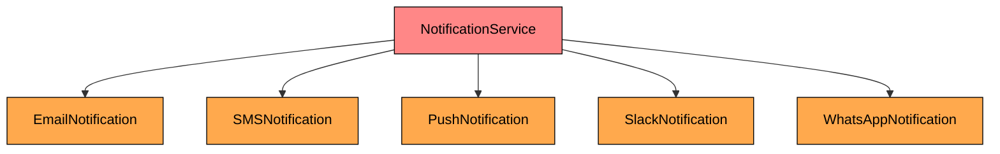
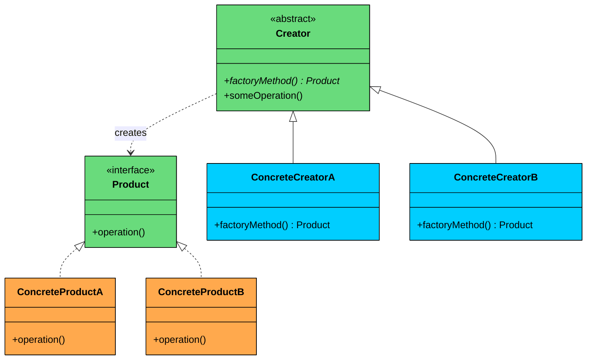
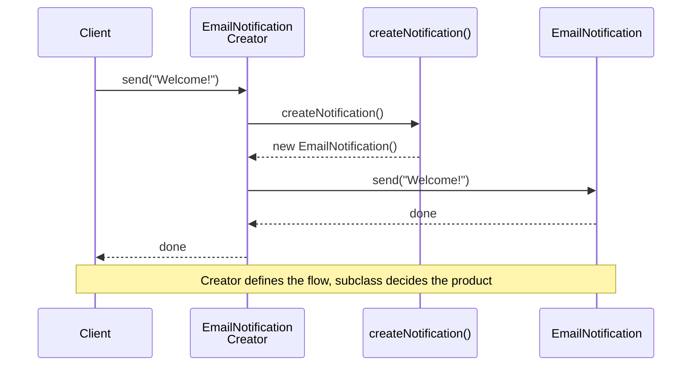
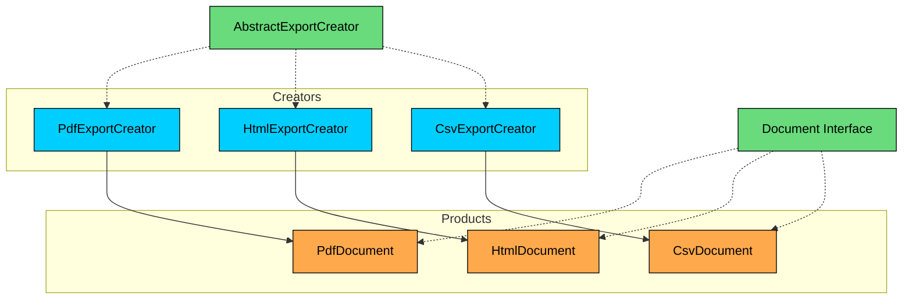

> 💡 **Key Insight:**

> **DEFINITION**
>
> The **Factory Method Design Pattern** is a **creational pattern** that provides an interface for creating objects in a **superclass**, but allows **subclasses** to alter the type of objects that will be created.

It’s particularly useful in situations where:

- The exact type of object to be created isn't known until runtime.
- Object creation logic is **complex**, **repetitive**, or needs **encapsulation**.
- You want to follow the **Open/Closed Principle, **open for extension, closed for modification.

When you have multiple objects of similar type, you might start with basic conditional logic (like `if-else` or `switch` statements) to decide which object to create.

But as your application grows, this approach becomes rigid, harder to test, and tightly couples your code to specific classes, violating key design principles.

Factory method lets you create different objects without tightly coupling your code to specific classes.

Let’s walk through a **real-world example** to see how we can apply the Factory Method Pattern to build a more **scalable** and **maintainable** object creation workflow.

---

# 1. The Problem: Sending Notifications

Imagine you're building a web application that sends notifications to users. At first, it’s simple. You're only sending **email notifications**.

A single class takes care of that.

```java
class EmailNotification {
    public void send() {
        System.out.println("Sending an Email notification...");
    }
}
```

To use it in our service, we create the email notification object and call the **send()** method.

```java
class NotificationService {
    public void sendNotification(String message) {
        EmailNotification email = new EmailNotification();
        email.send(message);
    }
}
```

All good. But then comes a new requirement: support **SMS notifications**.

So, you add a new class and update your NotificationService class by adding a new `if` block to create an SMS notification object, and send that too.

```java
class NotificationService {
    public void sendNotification(String type, String message) {
        if (type.equals("EMAIL")) {
            EmailNotification email = new EmailNotification();
            email.send(message);
        } else if (type.equals("SMS")) {
            SMSNotification sms = new SMSNotification();
            sms.send(message);
        }
    }
}
```

Slightly more complex, but still manageable. A few weeks later, product wants to send **push notifications** to mobile devices. Then marketing wants **Slack** alerts. Then **WhatsApp**.

Each one adds another branch:

```java
class NotificationService {
    public void sendNotification(String type, String message) {
        if (type.equals("EMAIL")) {
            EmailNotification email = new EmailNotification();
            email.send(message);
        } else if (type.equals("SMS")) {
            SMSNotification sms = new SMSNotification();
            sms.send(message);
        } else if (type.equals("Push")) {
            PushNotification sms = new PushNotification();
            sms.send(message);
        } else if (type.equals("Slack")) {
            SlackNotification sms = new SlackNotification();
            sms.send(message);
        } else if (type.equals("WhatsApp")) {
            WhatsAppNotification sms = new WhatsAppNotification();
            sms.send(message);
        }
    }
}
```

Now, your notification code is starting to look like a giant control tower. It’s responsible for **creating every kind of notification**, **knowing how each one works**, and **deciding which to send based on the type**.

Here is what the dependency structure looks like:



Adding a sixth notification type means modifying `NotificationService` yet again. 

This becomes a nightmare to maintain:

- Every time you add a new notification channel, you must **modify the same core logic**.
- Testing becomes cumbersome because the logic is intertwined with object creation.
- It violates the **Open/Closed Principle**: the class is not open for extension without modification.

---

# 2. Simple Factory: A First Attempt

Before jumping to the full Factory Method pattern, there is a common intermediate step: extract the creation logic into a separate class. 

This is called the **Simple Factory**. It is not a formal Gang of Four (GoF) pattern, but it is one of the most practical refactoring techniques in real-world codebases.

The idea is straightforward: create a separate class whose only job is to centralize and encapsulate object creation. The notification service no longer needs to know which concrete class to instantiate. It asks the factory.

```java
class SimpleNotificationFactory {
    public static Notification createNotification(String type) {
        return switch (type) {
            case "EMAIL" -> new EmailNotification();
            case "SMS" -> new SMSNotification();
            case "PUSH" -> new PushNotification();
            default -> throw new IllegalArgumentException("Unknown type");
        };
    }
}
```

All creation logic is now in one place. Now `NotificationService` is cleaner:

```java
class NotificationService {
    public void sendNotification(String type, String message) {
        Notification notification = SimpleNotificationFactory.createNotification(type);
        notification.send(message);
    }
}
```

This is better. The service only *uses* the notification, it does not *construct* it. Adding new types is easier since you only modify the factory, not every service that uses notifications.

But as your product grows and you keep adding new notification types, something starts to feel off again. Your `SimpleNotificationFactory` is beginning to look eerily similar to the bloated code you just refactored away from. 

Every time you introduce a new type, you are right back to modifying the factory's **switch** or **if-else** statements.

That is not very Open/Closed, is it"

Your system is better, but it is still not open to extension without modification. You are still hardcoding the decision logic and centralizing creation in one place. You need to give each type of notification its own responsibility for knowing how to create itself.

And that’s exactly the type of problems **Factory Method Design Pattern** solves.

---

# 3. What is Factory Method

The **Factory Method Pattern** takes the idea of object creation and hands it off to **subclasses**. Instead of one central factory deciding what to create, you **delegate the responsibility to specialized classes** that know exactly what they need to produce.

In simpler terms:

- Each subclass defines its **own way** of instantiating an object.
- The base class defines a **common interface** for creating that object, but doesn’t know what the object is.
- The base class also often defines common behavior, using the created object in some way.

So now, instead of having:

```java
if type == "EMAIL" → return new EmailNotification()
if type == "SMS" → return new SMSNotification()
```

You have:

```java
// EmailNotificationCreator knows it should return new EmailNotification
// SMSNotificationCreator knows it should return new SMSNotification
```

Your **creation logic is decentralized**.

> 💡 **Key Insight:**

> **Real-World Analogy**
>
> Think of a **food delivery platform**. You place an order. If the system is designed like a Simple Factory, there’s one centralized kitchen deciding whether to cook pizza, sushi, or burgers.
>
> But with the Factory Method, each restaurant (Pizza Place, Sushi Bar, Burger Joint) has **its own kitchen** and knows how to prepare its food. The platform just asks the appropriate kitchen to handle it.

---

## Class Diagram



#### **1. Product (e.g., Notification)**

The interface or abstract class that defines the contract for all objects the factory method creates. Every concrete product implements this interface, which means the rest of the system can work with any product without knowing its concrete type.

In our notification example, this is the `Notification` interface with its `send()` method. The creator and client code only ever reference this interface, never `EmailNotification` or `SMSNotification` directly.

#### **2. ConcreteProduct (e.g., EmailNotification)**

The actual classes that implement the Product interface. Each one provides its own behavior.` EmailNotification` connects to an SMTP server. `SMSNotification` calls a telephony API. `PushNotification` talks to Firebase or APNs. 

They all share the same `send()` method signature but do completely different things internally.

#### **3. Creator (e.g., NotificationCreator)**

An abstract class (or an interface) that declares the factory method, which returns an object of type Product.

The Creator does two things:

1. **Declares the factory method** (`createNotification()`) that subclasses must implement.
2. **Contains shared logic** that uses the product. For example, the `send()` method in our `NotificationCreator` calls `createNotification()` to get a product, then uses it. The Creator defines the *workflow*, the subclasses fill in the *details*.

#### **4. ConcreteCreator (e.g., EmailNotificationCreator)**

Subclasses of Creator that override the factory method to return a specific ConcreteProduct. Each creator is paired with exactly one product type.

- `EmailNotificationCreator` returns `new EmailNotification()`.
- `SMSNotificationCreator` returns `new SMSNotification()`

---

# 4. How It Works

Here is the Factory Method workflow, step by step:



#### **Step 1: Client selects a Creator**

The client code decides which ConcreteCreator to use based on configuration, user input, or business logic. For example, if the user wants an email notification, the client instantiates `EmailNotificationCreator`.

#### **Step 2: Client calls a method on the Creator**

The client calls `send()` (or whatever the high-level operation is). This method lives in the abstract Creator class.

#### **Step 3: Creator calls the factory method**

Inside `send()`, the Creator calls `createNotification()`. Since the Creator is abstract, this call is dispatched to the ConcreteCreator's override.

**Step 4: ConcreteCreator returns a ConcreteProduct**

`EmailNotificationCreator.createNotification()` returns a `new EmailNotification()`. The Creator receives it as the `Notification` interface type.

#### **Step 5: Creator uses the product**

The Creator calls `notification.send(message)` on the product it just received. The correct concrete behavior executes.

---

# 5. Implementing Factory Method

By now, you have seen the shortcomings of bloated `if-else` chains and central factories. 

With the Factory Method pattern, we flip that around. Instead of putting the burden of decision-making in a single place, we distribute object creation responsibilities across the system in a clean, organized way.

Let's implement it step by step.

### 1. Define the Product Interface

This is the contract that all notification types must follow. Any code that works with notifications only depends on this interface.

```java
interface Notification {
    public void send(String message);
}
```

### 2. Define Concrete Products

Each notification type implements the interface with its own behavior.

```java
class EmailNotification implements Notification {
    @Override
    public void send(String message) {
        System.out.println("Sending email: " + message);
    }
}

class SMSNotification implements Notification {
    @Override
    public void send(String message) {
        System.out.println("Sending SMS: " + message);
    }
}

class PushNotification implements Notification {
    @Override
    public void send(String message) {
        System.out.println("Sending push notification: " + message);
    }
}

class SlackNotification implements Notification {
    @Override
    public void send(String message) {
        System.out.println("Sending Slack message: " + message);
    }
}
```

### 3. Define an Abstract Creator

We create an **abstract class** that declares the factory method `createNotification()`, and optionally includes shared behavior like `send()`that defines the high-level logic of sending a notification by using whatever object `createNotification()` provides.

The Creator defines the flow, subclasses fill in the details.

```java
abstract class NotificationCreator {
    // Factory Method - subclasses decide what to create
    public abstract Notification createNotification();

    // Shared logic that uses the factory method
    public void send(String message) {
        Notification notification = createNotification();
        notification.send(message);
    }
}
```

Think of this class as a template: it does not know what notification it is sending, but it knows *how* to send it. It defers the choice of notification type to its subclasses.

> T
>
> **he abstract creator defines the flow, not the details.**

### 4. Define Concrete Creators

Now for the part that makes the pattern work. Each concrete creator extends the abstract creator and overrides the factory method to return its specific product.

```java
class EmailNotificationCreator extends NotificationCreator {
    @Override
    public Notification createNotification() {
        return new EmailNotification();
    }
}

class SMSNotificationCreator extends NotificationCreator {
    @Override
    public Notification createNotification() {
        return new SMSNotification();
    }
}

class PushNotificationCreator extends NotificationCreator {
    @Override
    public Notification createNotification() {
        return new PushNotification();
    }
}

class SlackNotificationCreator extends NotificationCreator {
    @Override
    public Notification createNotification() {
        return new SlackNotification();
    }
}
```

No more conditionals. Each class knows what it needs to create, and the core system does not need to care.

- `EmailNotificationCreator` returns `new EmailNotification()`
- `SMSNotificationCreator` returns `new SMSNotification()`

The mapping is one-to-one and explicit.

### 5. Client Code

Here's how your application might use this architecture:

```java
public class FactoryMethodDemo {
    public static void main(String[] args) {
        NotificationCreator creator;

        // Send Email
        creator = new EmailNotificationCreator();
        creator.send("Welcome to our platform!");

        // Send SMS
        creator = new SMSNotificationCreator();
        creator.send("Your OTP is 123456");

        // Send Push Notification
        creator = new PushNotificationCreator();
        creator.send("You have a new follower!");

        // Send Slack Message
        creator = new SlackNotificationCreator();
        creator.send("Standup in 10 minutes!");
    }
}
```

Each line creates the appropriate creator, calls the shared `send()` method, and the right notification type is created and used internally. The client never touches concrete product classes directly.

### 6. Adding a New Type

This is where the pattern pays off. Say you want to add WhatsApp notifications. With the old approach, you would modify an existing factory or service class, add a new `if-else` branch, and risk breaking existing logic.

With Factory Method, you simply create two new classes:

```java
class WhatsAppNotification implements Notification {
    @Override
    public void send(String message) {
        System.out.println("Sending WhatsApp message: " + message);
    }
}

class WhatsAppNotificationCreator extends NotificationCreator {
    @Override
    public Notification createNotification() {
        return new WhatsAppNotification();
    }
}
```

Done. No modification to existing code. No regression risk. No coupling. You just add new files and use the new creator wherever needed:

```java
creator = new WhatsAppNotificationCreator();
creator.send("Standup in 10 minutes!");
```

---

# 6. Practical Example: Document Export System

Let's build a complete example in a different domain to show the pattern's versatility. We will create a document export system that generates reports in multiple formats: PDF, HTML, and CSV.

### Problem

A reporting service needs to export data in different formats. Each format has its own rendering logic, headers, and file structure. New formats (Markdown, XML, Excel) might be added in the future.

### Architecture



### Full Implementation

```java
$c4
```

#### **What we achieved:**

- **Open/Closed Principle:** Adding a new format (Markdown, XML) means creating two new classes. Nothing else changes.
- **Single Responsibility:** Each document type handles only its own formatting logic.
- **Shared workflow:** The `export()` method in the Creator defines the common sequence (header, rows, footer) once.
- **Easy testing:** Each document type can be tested independently.
