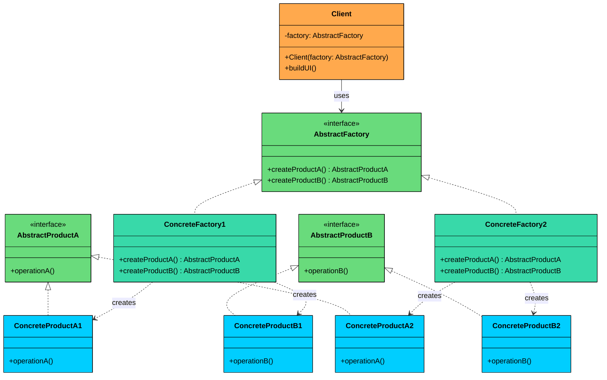
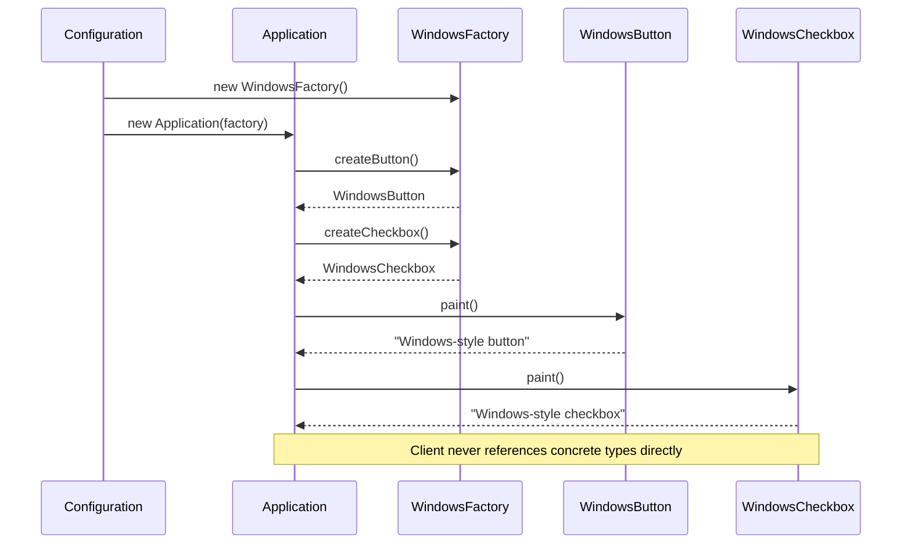
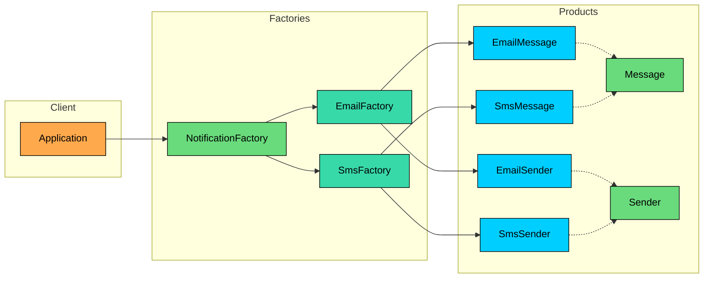

> 💡 **Key Insight:**

> **DEFINITION**
>
> The **Abstract Factory Design Pattern** is a **creational pattern** that provides an interface for creating families of related or dependent objects without specifying their concrete classes.

It’s particularly useful in situations where:

- You need to create objects that must be **used together** and are part of a consistent family (e.g., GUI elements like buttons, checkboxes, and menus).
- Your system must support **multiple configurations**, environments, or product variants (e.g., light vs. dark themes, Windows vs. macOS look-and-feel).
- You want to **enforce consistency** across related objects, ensuring that they are all created from the same factory.

The **Abstract Factory Pattern** encapsulates object creation into **factory interfaces**.

Each concrete factory implements the interface and produces a complete set of related objects. This ensures that your code remains **extensible, consistent, and loosely coupled** to specific product implementations.

Let’s walk through a real-world example to see how we can apply the Abstract Factory Pattern to build a system that’s flexible, maintainable, and able to support multiple interchangeable product families without conditional logic.

---

# 1. The Problem: Platform-Specific UI

Imagine you're building a **cross-platform desktop application** that must support both **Windows** and **macOS**.

To provide a good user experience, your application should render **native-looking UI components** for each operating system like: Buttons, Checkboxes, Text fields, and Menus.

### Naive Implementation: Conditional UI Component Instantiation

In your first attempt, you might implement platform-specific UI components like this:

#### Windows UI Elements

```java
class WindowsButton {
    public void paint() {
        System.out.println("Painting a Windows-style button.");
    }

    public void onClick() {
        System.out.println("Windows button clicked.");
    }
}

class WindowsCheckbox {
    public void paint() {
        System.out.println("Painting a Windows-style checkbox.");
    }

    public void onSelect() {
        System.out.println("Windows checkbox selected.");
    }
}
```

#### MacOS UI Elements

```java
class MacOSButton {
    public void paint() {
        System.out.println("Painting a macOS-style button.");
    }

    public void onClick() {
        System.out.println("macOS button clicked.");
    }
}

class MacOSCheckbox {
    public void paint() {
        System.out.println("Painting a macOS-style checkbox.");
    }

    public void onSelect() {
        System.out.println("macOS checkbox selected.");
    }
}
```

### Conditional Client Code

Now, in your application logic, you check the operating system and manually instantiate the correct classes:

```java
public class App {
    public static void main(String[] args) {
        String os = System.getProperty("os.name");

        if (os.contains("Windows")) {
            WindowsButton button = new WindowsButton();
            WindowsCheckbox checkbox = new WindowsCheckbox();
            button.paint();
            checkbox.paint();
        } else if (os.contains("Mac")) {
            MacOSButton button = new MacOSButton();
            MacOSCheckbox checkbox = new MacOSCheckbox();
            button.paint();
            checkbox.paint();
        }
    }
}
```

### Why This Approach Breaks Down

This setup works when you have two components on two platforms. But it quickly becomes unmanageable.

#### **1. No family consistency enforcement**

Nothing stops a developer from writing `new WindowsButton()` alongside `new MacOSCheckbox()`. The code compiles, the tests might even pass, and the bug only surfaces when a user sees a visually broken screen.

#### **2. Tight coupling to concrete classes**

The client code directly references `WindowsButton`, `MacOSCheckbox`, and every other platform-specific class. Every file that creates UI components needs platform-checking logic.

#### **3. No shared interface**

You cannot treat all buttons polymorphically. There is no `Button` type that `WindowsButton` and `MacOSButton` both implement. You cannot write a method that accepts "any button."

#### **4. Explosive growth with new platforms or components**

Adding Linux means creating `LinuxButton`, `LinuxCheckbox`, and updating every conditional block in the codebase. Adding a `TextField` component means creating `WindowsTextField`, `MacOSTextField`, `LinuxTextField`, and adding more branches everywhere.

#### **5. Violation of Open/Closed Principle**

Every new platform or component forces you to modify existing code. You cannot extend the system without editing files that already work.

### What We Really Need

- A way to **group related components** by family (all Windows components together, all macOS components together)
- **Encapsulated creation logic** so platform checks happen in exactly one place
- **Polymorphic products** so the client works with `Button` and `Checkbox` interfaces, not concrete classes
- **Structural guarantees** that mixing families is impossible, not just discouraged

This is exactly what the **Abstract Factory pattern** provides.

---

# 2. What is Abstract Factory

> The 
>
> **Abstract Factory Pattern**
>
>  provides an interface for creating 
>
> **families of related or dependent objects**
>
>  without specifying their concrete classes.

The key word is **families**. Factory Method deals with creating one product at a time. Abstract Factory deals with creating multiple products that must work together. A GUI factory does not just create buttons. It creates buttons, checkboxes, text fields, and menus that all share the same visual style.

---

## Class Diagram

<!-- payload:themeImageBlock:SELF {"id":"699999ed73ca638c40fec13e","alt":"Abstract Factory","settings":{"width":"100","alignment":"center","isZoomable":true},"blockName":"","darkImage":264,"lightImage":265,"mermaidCode":"classDiagram\n    class Client {\n        -factory: AbstractFactory\n        +Client(factory: AbstractFactory)\n        +buildUI()\n    }\n\n    class AbstractFactory {\n        <<interface>>\n        +createProductA() AbstractProductA\n        +createProductB() AbstractProductB\n    }\n\n    class AbstractProductA {\n        <<interface>>\n        +operationA()\n    }\n\n    class AbstractProductB {\n        <<interface>>\n        +operationB()\n    }\n\n    class ConcreteFactory1 {\n        +createProductA() AbstractProductA\n        +createProductB() AbstractProductB\n    }\n\n    class ConcreteFactory2 {\n        +createProductA() AbstractProductA\n        +createProductB() AbstractProductB\n    }\n\n    class ConcreteProductA1 {\n        +operationA()\n    }\n\n    class ConcreteProductB1 {\n        +operationB()\n    }\n\n    class ConcreteProductA2 {\n        +operationA()\n    }\n\n    class ConcreteProductB2 {\n        +operationB()\n    }\n\n    Client --> AbstractFactory : uses\n\n    AbstractFactory <|.. ConcreteFactory1\n    AbstractFactory <|.. ConcreteFactory2\n\n    AbstractProductA <|.. ConcreteProductA1\n    AbstractProductA <|.. ConcreteProductA2\n    AbstractProductB <|.. ConcreteProductB1\n    AbstractProductB <|.. ConcreteProductB2\n\n    ConcreteFactory1 ..> ConcreteProductA1 : creates\n    ConcreteFactory1 ..> ConcreteProductB1 : creates\n    ConcreteFactory2 ..> ConcreteProductA2 : creates\n    ConcreteFactory2 ..> ConcreteProductB2 : creates\n\n    style AbstractFactory fill:#69db7c,stroke:#000,color:#000\n    style AbstractProductA fill:#69db7c,stroke:#000,color:#000\n    style AbstractProductB fill:#69db7c,stroke:#000,color:#000\n    style ConcreteFactory1 fill:#38d9a9,stroke:#000,color:#000\n    style ConcreteFactory2 fill:#38d9a9,stroke:#000,color:#000\n    style ConcreteProductA1 fill:#00ceff,stroke:#000,color:#000\n    style ConcreteProductA2 fill:#00ceff,stroke:#000,color:#000\n    style ConcreteProductB1 fill:#00ceff,stroke:#000,color:#000\n    style ConcreteProductB2 fill:#00ceff,stroke:#000,color:#000\n    style Client fill:#ffa94d,stroke:#000,color:#000"} -->


The structure involves five participants:

#### 1. Abstract Factory (`GUIFactory`)

- Defines a **common interface** for creating a family of related products.
- Typically includes factory methods like `createButton()`, `createCheckbox()`, `createTextField()`, etc.
- Clients rely on this interface to create objects without knowing their concrete types.

#### 2. Concrete Factory (`WindowsFactory`, `MacOSFactory`)

- Implement the abstract factory interface.
- Create **concrete product variants** that belong to a specific family or platform.
- Each factory ensures that all components it produces are compatible (i.e., belong to the same platform/theme).

#### 3. Abstract Product (`Button`, `Checkbox`)

- Define the **interfaces or abstract classes** for a set of related components.
- All product variants for a given type (e.g., `WindowsButton`, `MacOSButton`) will implement these interfaces.

#### 4. Concrete Product (`WindowsButton`, `MacOSCheckbox`)

- Implement the abstract product interfaces.
- Contain **platform-specific logic and appearance** for the components.

#### 5. Client (`Application`)

- Uses the abstract factory and abstract product interfaces.
- Is **completely unaware** of the concrete classes it is using — it only interacts with the factory and product interfaces.
- Can switch entire product families (e.g., from Windows to macOS) by changing the factory without touching UI logic.

---

# 3. How It Works

Here is the Abstract Factory workflow, step by step:



#### **Step 1: Configuration determines the factory**

At application startup, a configuration value, environment variable, or runtime check determines which concrete factory to instantiate. This is the only place in the codebase that references concrete factory classes.

#### **Step 2: The factory is injected into the client**

The client receives the factory through its constructor. It stores the factory as the abstract type, not a concrete one.

#### **Step 3: The client calls factory methods to create products**

When the client needs a button, it calls `factory.createButton()`. When it needs a checkbox, it calls `factory.createCheckbox()`. The client has no idea which concrete classes are being instantiated.

#### **Step 4: The factory returns compatible products**

Because the factory is a `WindowsFactory`, both `createButton()` and `createCheckbox()` return Windows-specific components. There is no possibility of getting a macOS checkbox from a Windows factory.

#### **Step 5: The client uses products through abstract interfaces**

The client calls `button.paint()` and `checkbox.paint()`. It does not know or care whether these are Windows or macOS components. The behavior is determined by the factory that was injected in Step 2.

---

# 4. Implementing Abstract Factory

Let's implement the Abstract Factory pattern step by step. We will define abstract product interfaces, create concrete products for two platforms, build an abstract factory with concrete implementations, and wire everything together through a client that never touches a concrete class.

### Step 1: Define Abstract Product Interfaces

We start with the contracts that all product variants must fulfill. These interfaces are what the client will work with.

#### Button

```java
interface Button {
    void paint();
    void onClick();
}
```

#### Checkbox

```java
interface Checkbox {
    void paint();
    void onSelect();
}
```

### Step 2: Create Concrete Products

Each platform provides its own implementation of every product interface.

#### Windows Products

```java
class WindowsButton implements Button {
    @Override
    public void paint() {
        System.out.println("Painting a Windows-style button.");
    }

    @Override
    public void onClick() {
        System.out.println("Windows button clicked.");
    }
}

class WindowsCheckbox implements Checkbox {
    @Override
    public void paint() {
        System.out.println("Painting a Windows-style checkbox.");
    }

    @Override
    public void onSelect() {
        System.out.println("Windows checkbox selected.");
    }
}
```

#### macOS Products

```java
class MacOSButton implements Button {
    @Override
    public void paint() {
        System.out.println("Painting a macOS-style button.");
    }

    @Override
    public void onClick() {
        System.out.println("macOS button clicked.");
    }
}

class MacOSCheckbox implements Checkbox {
    @Override
    public void paint() {
        System.out.println("Painting a macOS-style checkbox.");
    }

    @Override
    public void onSelect() {
        System.out.println("macOS checkbox selected.");
    }
}
```

### Step 3: Define the Abstract Factory

The abstract factory declares one creation method per product type. Any concrete factory must implement all of them.

```java
interface GUIFactory {
    Button createButton();
    Checkbox createCheckbox();
}
```

### Step 4: Implement Concrete Factories

Each concrete factory produces a complete, compatible set of products for its platform.

#### WindowsFactory

```java
class WindowsFactory implements GUIFactory {
    @Override
    public Button createButton() {
        return new WindowsButton();
    }

    @Override
    public Checkbox createCheckbox() {
        return new WindowsCheckbox();
    }
}
```

#### MacOSFactory

```java
class MacOSFactory implements GUIFactory {
    @Override
    public Button createButton() {
        return new MacOSButton();
    }

    @Override
    public Checkbox createCheckbox() {
        return new MacOSCheckbox();
    }
}
```

### Step 5: Client Code

The client receives a factory through its constructor and uses only abstract interfaces.

```java
class Application {
    private final Button button;
    private final Checkbox checkbox;

    public Application(GUIFactory factory) {
        this.button = factory.createButton();
        this.checkbox = factory.createCheckbox();
    }

    public void renderUI() {
        button.paint();
        checkbox.paint();
    }
}
```

### Step 6: Wire Everything Together

The entry point is the only place that references concrete factories. It reads the platform, picks the right factory, and injects it into the client.

```java
public class AppLauncher {
    public static void main(String[] args) {
        // Simulate platform detection
        String os = System.getProperty("os.name");
        GUIFactory factory;

        if (os.contains("Windows")) {
            factory = new WindowsFactory();
        } else {
            factory = new MacOSFactory();
        }

        Application app = new Application(factory);
        app.renderUI();
    }
}
```

#### Output (on macOS)

```shell
Painting a macOS-style button.
Painting a macOS-style checkbox.
```

#### Output (on Windows)

```shell
Painting a Windows-style button.
Painting a Windows-style checkbox.
```

### What We Achieved

- **Platform independence: **Application code never references platform-specific classes
- **Consistency: **Buttons and checkboxes always match the selected OS style
- **Open/Closed Principle: **Add support for Linux or Android without modifying existing factories or components
- **Testability & Flexibility: **Factories can be swapped easily for testing or theming

---

# 5. Practical Example: Notification System

Let's build a notification system that supports Email and SMS channels. Each channel produces two related objects: a Message and a Sender. Mixing an email message with an SMS sender would produce garbled output, so family consistency matters.

### Architecture



### Full Implementation

```java
$b7
```

#### **What we achieved:**

- **Two product types** (Message and Sender) that must stay consistent within a notification channel
- **Zero mixing risk:** An `EmailFactory` can only produce email objects. There is no code path that creates an email message paired with an SMS sender
- **Easy to extend:** Adding push notification support means creating `PushFactory`, `PushMessage`, and `PushSender`. Nothing existing changes
- **Simple and focused:** Each product has a clear, single responsibility, making the pattern easy to understand and test
