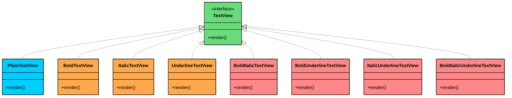
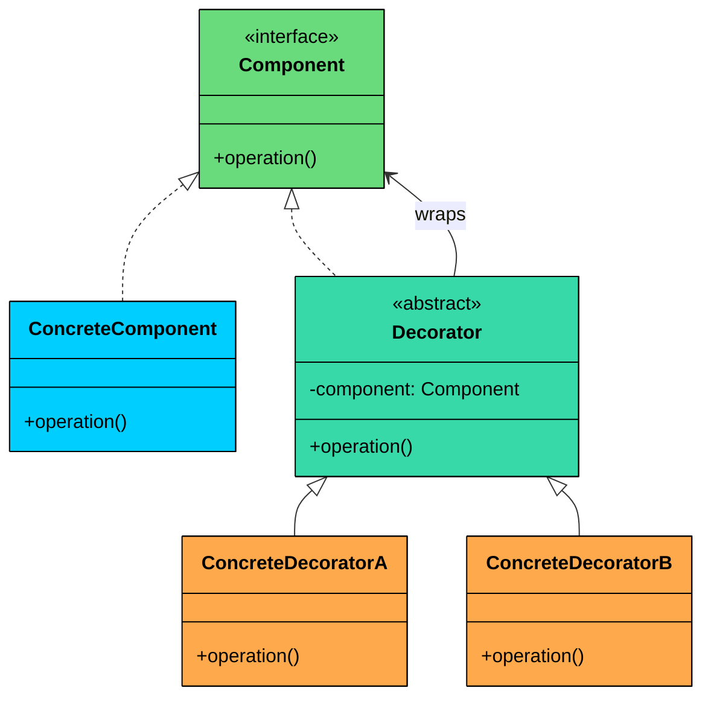
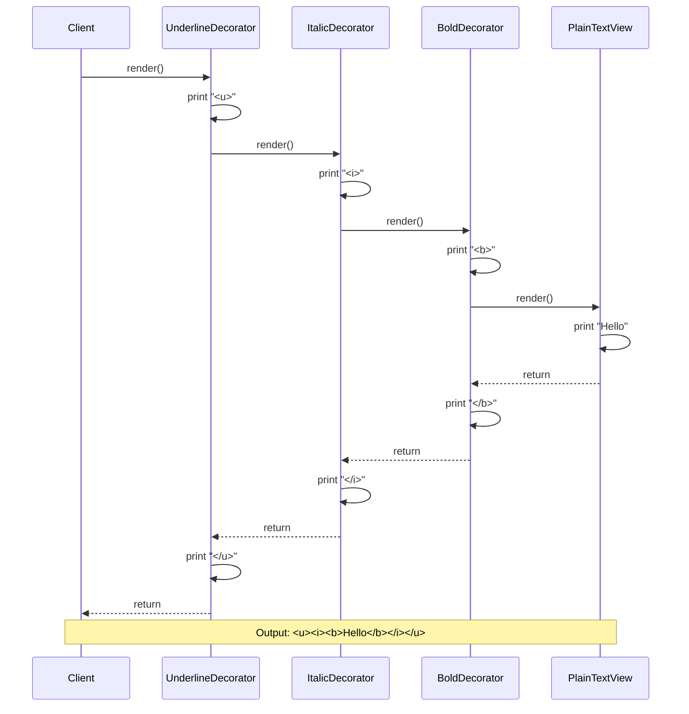
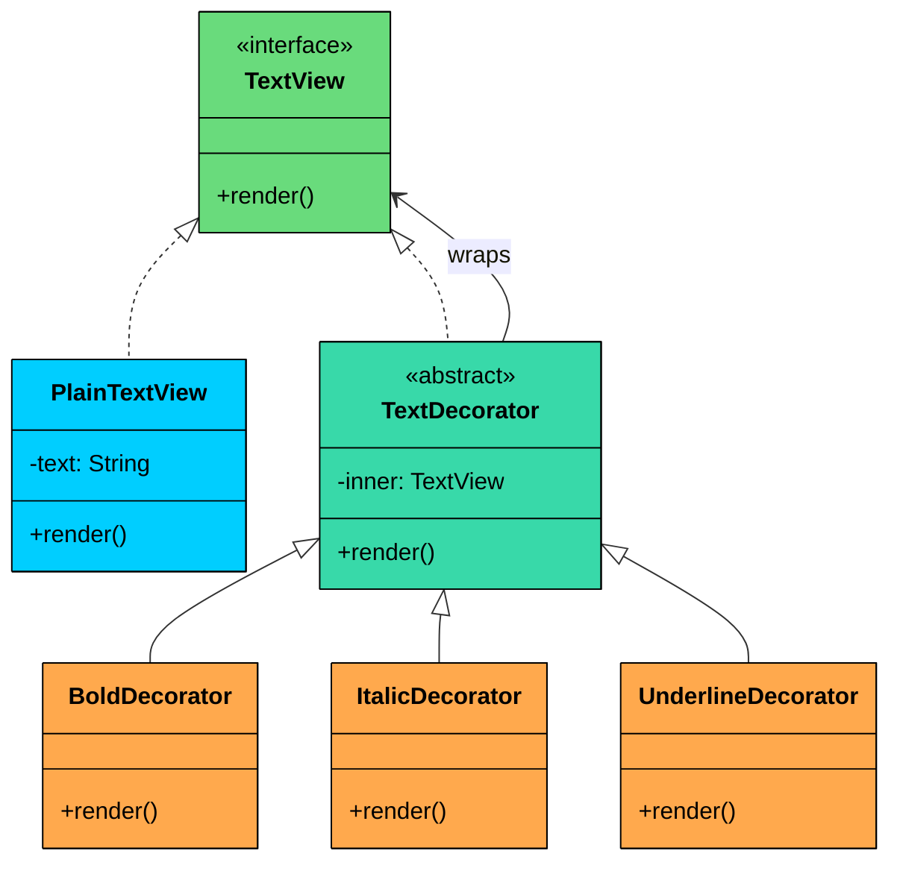
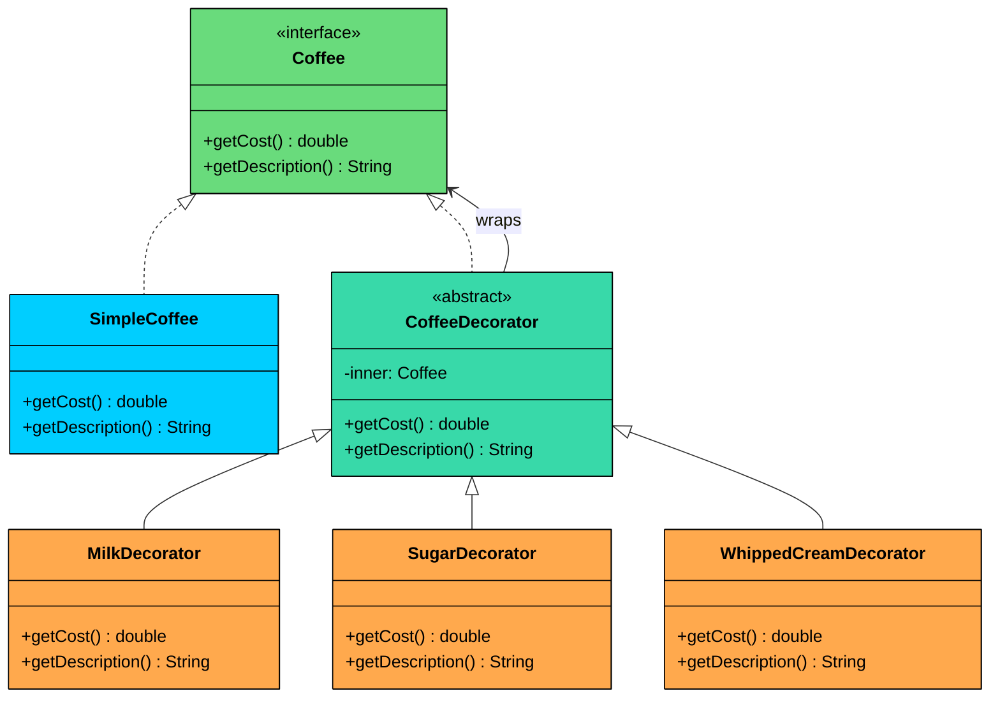

> 💡 **Key Insight:**

> **DEFINITION**
>
> The **Decorator Design Pattern** is a **structural pattern** that lets you **dynamically add new behavior or responsibilities to objects** without modifying their underlying code.

It’s particularly useful in situations where:

- You want to **extend the functionality** of a class without subclassing it.
- You need to **compose behaviors at runtime**, in various combinations.
- You want to avoid bloated classes filled with `if-else` logic for optional features.

Let’s walk through a real-world example to see how we can apply the Decorator Pattern to build a **modular, flexible, and easily composable system** for enhancing object functionality.

---

# 1. The Problem: Adding Features to a Text Renderer

Imagine you are building a rich text rendering system, something like a simplified word processor or a markdown preview tool. At the core of your system is a `TextView` component that renders plain text on screen.

The first version works great. Then the requirements start growing:

- Support **bold** text
- Support **italic** text
- Support **underlined** text
- Support any **combination** of the above (bold + italic, bold + underline, italic + underline, all three together)

### The Naive Approach: Subclassing for Every Combination

Your first instinct might be to create a subclass for each variation:



The red nodes are combination subclasses that only exist because inheritance cannot mix and match behaviors.

With just 3 features (bold, italic, underline), you already need 7 subclasses to cover every possible combination. Add a 4th feature like highlight, and that jumps to 15. A 5th feature (strikethrough) brings it to 31. The formula is **2^n - 1**, where n is the number of features.

Here is what the naive code looks like:

```java
interface TextView {
    void render();
}

class PlainTextView implements TextView {
    private final String text;

    public PlainTextView(String text) {
        this.text = text;
    }

    @Override
    public void render() {
        System.out.print(text);
    }
}

// One subclass per feature...
class BoldTextView implements TextView {
    private final String text;

    public BoldTextView(String text) {
        this.text = text;
    }

    @Override
    public void render() {
        System.out.print("<b>" + text + "</b>");
    }
}

// One subclass per combination...
class BoldItalicTextView implements TextView {
    private final String text;

    public BoldItalicTextView(String text) {
        this.text = text;
    }

    @Override
    public void render() {
        System.out.print("<i><b>" + text + "</b></i>");
    }
}

// BoldUnderlineTextView, ItalicUnderlineTextView,
// BoldItalicUnderlineTextView... it keeps going.
```

### What's Wrong with This Approach"

While this code works for a small number of features, it collapses under its own weight as the system grows:

#### 1. Class Explosion

For every new combination of features, you need a new subclass. The number of subclasses grows exponentially: n features produce 2^n - 1 combinations. With 5 formatting options (bold, italic, underline, highlight, strikethrough), that is 31 subclasses, most of which are just recombinations of the same logic.

#### 2. Rigid Design

You cannot change features at runtime. Want to let the user toggle bold on and off based on a preference" You need to swap the entire object with a different subclass. There is no way to add or remove a single behavior dynamically.

#### 3. Violates the Open/Closed Principle

Every time a new feature like `highlight` or `shadow` is introduced, you need to create new subclasses for every existing combination that includes the new feature. Existing classes stay untouched, but the number of new classes you must add grows with every feature.

#### 4. Code Duplication

The bold logic is duplicated across `BoldTextView`, `BoldItalicTextView`, `BoldUnderlineTextView`, and every other class that includes bold. If you change how bold rendering works, you must update every class that includes it.

### What We Really Need

We need a way to:

- Add features like bold, italic, underline **dynamically and independently**
- **Compose features** in flexible combinations (e.g., bold + underline, or italic + highlight + underline)
- Avoid creating dozens of subclasses for every possible variation
- Follow the **Open/Closed Principle**: add new features by writing new code, not changing existing code

This is exactly where the **Decorator pattern** fits in.

---

# 2. The Decorator Pattern

The Decorator pattern is a structural pattern that attaches additional responsibilities to an object dynamically. Instead of extending a class through inheritance, it wraps the original object inside another object that adds the new behavior.

Two characteristics define the pattern:

1. **Same interface preservation:** Every decorator implements the same interface as the object it wraps. The client cannot tell whether it is talking to a plain object or a decorated one.
2. **Dynamic composition:** Decorators can be stacked at runtime in any combination and any order. You choose what to add and when, not at compile time.

This creates a **layered effect**, where decorators can be **stacked** to apply multiple enhancements without creating a complex inheritance tree.

> 💡 **Key Insight:**

> **Real-World Analogy**
>
> Think of a plain coffee. Now add milk. Now add sugar. Each addition enhances the original but doesn’t change the base. 
>
> The Decorator Pattern works the same way: stacking behaviors while keeping the core intact.

---

## Class Diagram



Decorator has four participants.

#### **Component (e.g.,** `TextView`)

Declares the common interface that both the core object and all decorators implement.

In our text rendering example, `TextView` is the Component. It declares a single `render()` method that every participant implements.

#### **ConcreteComponent (e.g.,** `PlainTextView`)

The base object that can be wrapped with decorators. It provides the default behavior.

In our example, `PlainTextView` renders raw text with no formatting. It is the starting point that decorators build upon.

#### Decorator (e.g, `TextDecorator`)

An abstract class that implements the Component interface and holds a reference to another Component. It forwards calls to the wrapped object.

In our example, `TextDecorator` is the abstract base for all formatting decorators. It accepts any `TextView` in its constructor and delegates `render()` to it.

#### ConcreteDecorator (`BoldDecorator`, `ItalicDecorator`, etc.)

Extend the base decorator to add new functionality before/after calling the wrapped component’s method.

In our example, `BoldDecorator` wraps the output in `<b>` tags, `ItalicDecorator` in `<i>` tags, and `UnderlineDecorator` in `<u>` tags.

---

# 3. How It Works

Here is the Decorator workflow, step by step:



#### **Step 1: Create the base component**

The client creates a `PlainTextView` with the text "Hello". This is the core object.

#### **Step 2: Wrap it in a decorator**

The client wraps the plain text view inside a `BoldDecorator`. The decorator stores a reference to the plain text view.

#### **Step 3: Stack more decorators**

The client wraps the bold decorator inside an `ItalicDecorator`, then wraps that inside an `UnderlineDecorator`. Each decorator stores a reference to the previous one.

#### **Step 4: Call the operation**

The client calls `render()` on the outermost decorator (UnderlineDecorator).

#### **Step 5: Decorators add behavior and delegate inward**

UnderlineDecorator prints `<u>`, then calls `render()` on its inner object (ItalicDecorator). ItalicDecorator prints `<i>`, then calls `render()` on its inner object (BoldDecorator). BoldDecorator prints `<b>`, then calls `render()` on its inner object (PlainTextView).

#### **Step 6: Results propagate outward**

PlainTextView prints "Hello". BoldDecorator prints `</b>`. ItalicDecorator prints `</i>`. UnderlineDecorator prints `</u>`. The final output is `<u><i><b>Hello</b></i></u>`.

---

# 4. Implementing Decorator Pattern

Let’s implement the **Decorator Pattern** to enable flexible styling of text elements such as bold, italic, underline, and combinations of these.

Instead of creating a subclass for every combination, we create one class per feature and wrap them around each other. Each decorator adds its behavior and delegates the rest to the next object in the chain.



### Step 1: Define the Component Interface

This is the shared contract. Both the base component and all decorators implement it. The `render()` method outputs the formatted text.

```java
interface TextView {
    void render();
}
```

### Step 2: Implement the Concrete Component

This is the base object that renders plain text. It implements `TextView` and holds the raw text content. No formatting, no decoration, just the core data.

```java
class PlainTextView implements TextView {
    private final String text;

    public PlainTextView(String text) {
        this.text = text;
    }

    @Override
    public void render() {
        System.out.print(text);
    }
}
```

### Step 3: Create the Abstract Decorator

This class implements `TextView` and holds a reference to another `TextView`. It is the bridge between the interface and the concrete decorators. Every decorator extends this class, inheriting the reference and the delegation pattern.

```java
abstract class TextDecorator implements TextView {
    protected final TextView inner;

    public TextDecorator(TextView inner) {
        this.inner = inner;
    }
}
```

### Step 4: Implement Concrete Decorators

Each decorator adds one specific formatting layer. It prints its tag, delegates to the wrapped component, then closes its tag.

#### Bold Decorator

```java
class BoldDecorator extends TextDecorator {
    public BoldDecorator(TextView inner) {
        super(inner);
    }

    @Override
    public void render() {
        System.out.print("<b>");
        inner.render();
        System.out.print("</b>");
    }
}
```

#### Italic Decorator

```java
class ItalicDecorator extends TextDecorator {
    public ItalicDecorator(TextView inner) {
        super(inner);
    }

    @Override
    public void render() {
        System.out.print("<i>");
        inner.render();
        System.out.print("</i>");
    }
}
```

#### Underline Decorator

```java
class UnderlineDecorator extends TextDecorator {
    public UnderlineDecorator(TextView inner) {
        super(inner);
    }

    @Override
    public void render() {
        System.out.print("<u>");
        inner.render();
        System.out.print("</u>");
    }
}
```

### Step 5: Using the Decorator from the Client

The client creates the base component and wraps it with any combination of decorators at runtime. No subclass explosion. No hardcoded combinations.

```java
public class TextRendererApp {
    public static void main(String[] args) {
        TextView text = new PlainTextView("Hello, World!");

        // Plain text
        System.out.print("Plain:                   ");
        text.render();
        System.out.println();

        // Single decorator: Bold
        System.out.print("Bold:                    ");
        TextView boldText = new BoldDecorator(text);
        boldText.render();
        System.out.println();

        // Two decorators: Italic + Underline
        System.out.print("Italic + Underline:      ");
        TextView italicUnderline = new UnderlineDecorator(new ItalicDecorator(text));
        italicUnderline.render();
        System.out.println();

        // Three decorators: Bold + Italic + Underline
        System.out.print("Bold + Italic + Underline: ");
        TextView allStyles = new UnderlineDecorator(
            new ItalicDecorator(new BoldDecorator(text)));
        allStyles.render();
        System.out.println();
    }
}
```

#### Output:

```shell
Plain:                   Hello, World!
Bold:                    <b>Hello, World!</b>
Italic + Underline:      <u><i>Hello, World!</i></u>
Bold + Italic + Underline: <u><i><b>Hello, World!</b></i></u>
```

### What We Achieved

- **Dynamic layering:** We can add, remove, or combine decorators at runtime
- **Modular design:** Each decorator is focused on one formatting feature
- **No class explosion:** 3 features require 5 classes (interface + component + decorator base + 3 decorators), not 8
- **Open/Closed Principle:** New formatting options can be added without modifying existing classes
- **Flexible ordering:** Any combination and ordering of features is possible

---

# 5. Practical Example: Coffee Shop Order System

To show the Decorator pattern in a completely different domain, let's build a coffee ordering system. The interface tracks both the cost and the description of a coffee order. Decorators add condiments, each with its own price.



### Implementation

```java
$b0
```

Notice how `MilkDecorator` is applied twice in Order 3. This is perfectly valid. Each decorator is independent, and stacking the same one multiple times adds its cost again. With inheritance, you would need a separate `DoubleMilkSugarWhippedCreamCoffee` class. With Decorator, you just wrap it twice.
