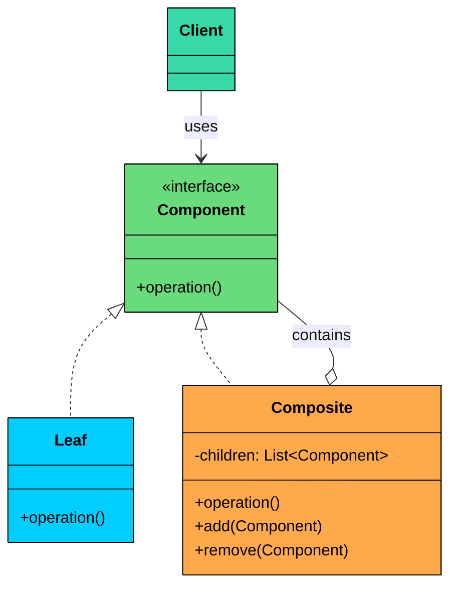
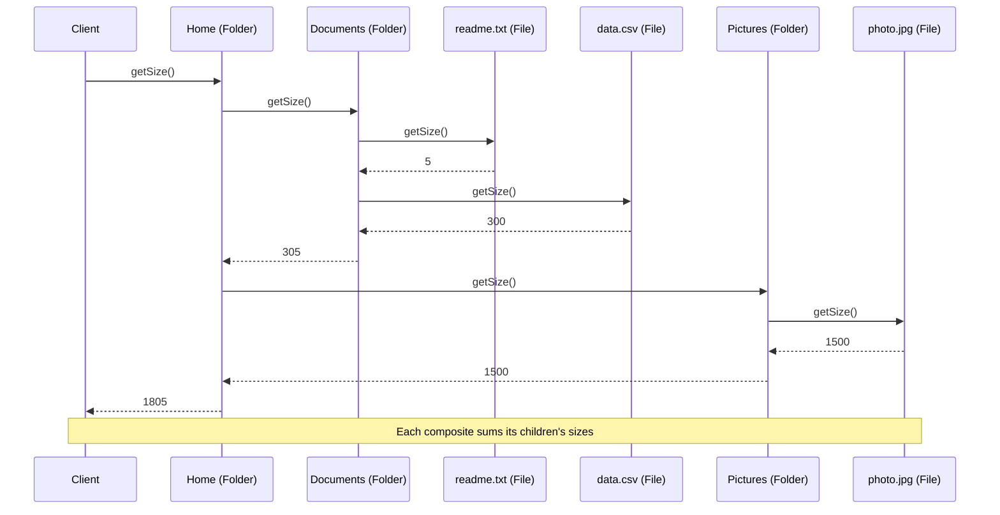
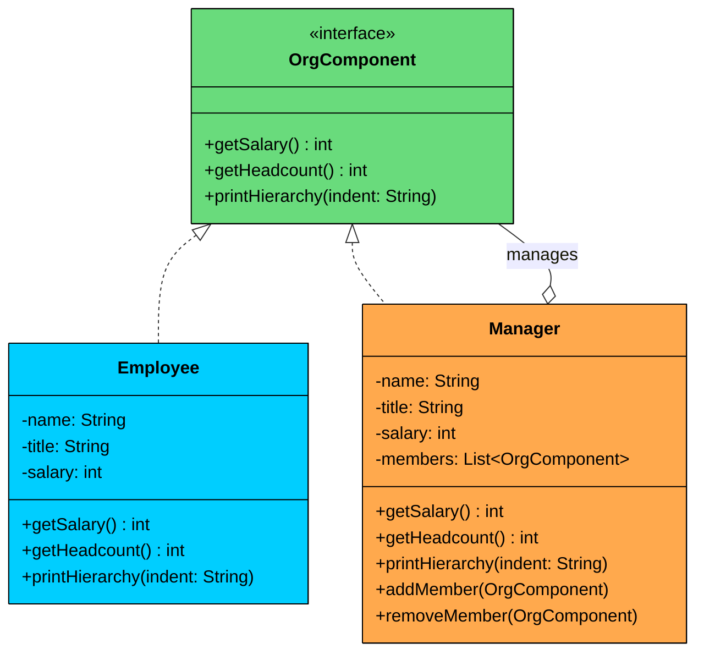

> 💡 **Key Insight:**

> **DEFINITION**
>
> The **Composite Design Pattern** is a **structural pattern** that lets you **treat individual objects and compositions of objects uniformly**.

It allows you to build tree-like structures (e.g., file systems, UI hierarchies, organizational charts) where **clients can work with both single elements and groups of elements using the same interface.**

It’s particularly useful in situations where:

- You need to represent **part-whole hierarchies**.
- You want to **perform operations on both leaf nodes and composite nodes** in a consistent way.
- You want to avoid writing special-case logic to distinguish between "single" and "grouped" objects.

Let’s walk through a real-world example to see how we can apply the Composite Pattern to model a flexible, hierarchical system that’s both clean and extensible.

---

# 1. The Problem: Modeling a File Explorer

Imagine you are building a file explorer application (like Finder on macOS or File Explorer on Windows). The system needs to represent:

- **Files** that have a name and a size.
- **Folders** that can hold files and other folders, nested to any depth.

Your goal is to support operations such as:

- `getSize()`: returns the total size of a file or folder (sum of all contents for folders).
- `printStructure()`: prints the name of the item with indentation to show hierarchy.
- `delete()`: deletes a file or a folder and everything inside it.

### The Naive Approach

A straightforward solution uses two separate classes `File` and `Folder` with no shared interface. The folder stores its contents as generic objects and checks the type of each item before operating on it.

#### File class

```java
class File {
    private String name;
    private int size;

    public File(String name, int size) {
        this.name = name;
        this.size = size;
    }

    public int getSize() {
        return size;
    }

    public void printStructure(String indent) {
        System.out.println(indent + name);
    }

    public void delete() {
        System.out.println("Deleting file: " + name);
    }
}
```

#### Folder **class (with type checks):**

```java
$a6
```

### What’s Wrong With This Approach"

As the structure grows more complex, this solution introduces several critical problems:

#### 1. Repetitive Type Checks

Every operation (`getSize()`, `printStructure()`, `delete()`) requires `instanceof` checks and downcasting. This logic is duplicated across every method that touches the tree.

#### 2. No Shared Abstraction

 There is no common interface for `File` and `Folder`, so you cannot write generic code like:

```java
List<FileSystemItem> items = List.of(file, folder);
for (FileSystemItem item : items) {
    item.delete();
}
```

#### 3. Violation of Open/Closed Principle

To add new item types (say, `Shortcut` or `CompressedFolder`), you must modify the type-checking logic in every existing method. Each new type means touching every operation in the Folder class.

#### 4. **Fragile recursive logic**

Computing sizes or deleting deeply nested structures becomes a tangled mess of nested conditionals and type-specific recursive calls. One missed type check and an item silently disappears from the total.

### What We Really Need

We need a solution that:

- Introduces a **common interface** (e.g., `FileSystemItem`) for all components.
- Allows **files and folders to be treated uniformly** via polymorphism.
- Enables folders to **contain a list of the same interface**, supporting arbitrary nesting.
- Supports **recursive operations without type checks**.
- Makes the system **easy to extend** with new item types.

This is exactly the kind of problem the **Composite Design Pattern** is made for.

---

# 2. What is the Composite Pattern

The Composite pattern is a structural pattern that composes objects into tree structures and lets clients treat individual objects and compositions uniformly.

Two characteristics define the pattern:

1. **Uniform interface:** Both leaf objects (no children) and composite objects (contain children) implement the same interface. The client calls the same methods regardless of which type it is working with.
2. **Recursive composition:** A composite holds a collection of components, which can themselves be composites. This creates tree structures of arbitrary depth without any special handling.

---

## Class Diagram



The structure involves four participants:

#### **Component Interface (e.g., **`FileSystemItem`**)**

The shared interface that declares operations common to both leaves and composites.

In our file system example, `FileSystemItem` declares `getSize()`, `printStructure()`, and `delete()`. Every file and folder implements these methods.

#### **Leaf (e.g., **`File`**)**

An end object in the tree that has no children. It implements the Component interface directly.

In our example, `File` is a leaf. It returns its own size, prints its own name, and deletes itself. No delegation, no children.

#### **Composite (e.g., **`Folder`**)**

A container that holds child Components and implements the Component interface by delegating to its children.

In our example, `Folder` stores a list of `FileSystemItem` objects. Its `getSize()` sums the sizes of all children. Its `printStructure()` prints its own name then asks each child to print. Its `delete()` deletes all children then itself.

#### **Client (e.g., **`FileExplorerApp`**)**

Works with the tree through the Component interface, without knowing whether it holds a leaf or a composite.

---

# 3. How It Works

Here is the Composite workflow, step by step, using our file system example.



#### **Step 1: Build the tree**

The client creates leaf objects (files) and composite objects (folders), then adds leaves and composites to the appropriate parents.

#### **Step 2: Call an operation on the root**

The client calls `getSize()` on the root folder. It does not need to know the internal structure.

#### **Step 3: The composite delegates to its children**

The root folder iterates over its children, calling `getSize()` on each one.

#### **Step 4: Leaves return their values directly**

When `getSize()` reaches a file, the file returns its size. No delegation, no recursion.

#### **Step 5: Nested composites recurse**

When `getSize()` reaches a subfolder, that folder iterates over its own children, calling `getSize()` on each. This continues until every leaf is reached.

#### **Step 6: Results aggregate up the tree**

Each composite sums the values returned by its children and returns the total. The root folder returns the sum of all files in the entire tree.

---

# 4. Implementing the Composite Pattern

We’ll start by defining a **common interface** for all items in our file system, allowing **both files and folders** to be treated uniformly.

### Step 1: Define the Component Interface

This is the shared contract. Both files (leaves) and folders (composites) implement it. Every operation that can be performed on the tree is declared here.

```java
interface FileSystemItem {
    int getSize();
    void printStructure(String indent);
    void delete();
}
```

This interface ensures that all file system items, whether files or folders, expose the same behavior to the client. No type checks needed.

### Step 2: Create the Leaf Class (File)

A file is a leaf node. It implements the Component interface directly, returning its own values without delegating to children.

```java
class File implements FileSystemItem {
    private final String name;
    private final int size;

    public File(String name, int size) {
        this.name = name;
        this.size = size;
    }

    @Override
    public int getSize() {
        return size;
    }

    @Override
    public void printStructure(String indent) {
        System.out.println(indent + "- " + name + " (" + size + " KB)");
    }

    @Override
    public void delete() {
        System.out.println("Deleting file: " + name);
    }
}
```

Each `File` is a leaf node. It has no children and no delegation. It just returns its own data.

### 3. Create the Composite Class (Folder)

A folder is a composite. It holds a list of `FileSystemItem` children and implements each operation by delegating to them. It also provides `addItem()` and `removeItem()` methods for managing children.

```java
class Folder implements FileSystemItem {
    private final String name;
    private final List<FileSystemItem> children = new ArrayList<>();

    public Folder(String name) {
        this.name = name;
    }

    public void addItem(FileSystemItem item) {
        children.add(item);
    }

    public void removeItem(FileSystemItem item) {
        children.remove(item);
    }

    @Override
    public int getSize() {
        int total = 0;
        for (FileSystemItem item : children) {
            total += item.getSize();
        }
        return total;
    }

    @Override
    public void printStructure(String indent) {
        System.out.println(indent + "+ " + name + "/");
        for (FileSystemItem item : children) {
            item.printStructure(indent + "  ");
        }
    }

    @Override
    public void delete() {
        for (FileSystemItem item : children) {
            item.delete();
        }
        System.out.println("Deleting folder: " + name);
    }
}
```

Notice the difference from the naive approach. There are no `instanceof` checks anywhere. The `Folder` simply calls `getSize()` on each child. Polymorphism handles the rest. Whether a child is a `File` or another `Folder`, the correct implementation runs automatically.

### Step 4: Client Code

```java
public class FileExplorerApp {
    public static void main(String[] args) {
        FileSystemItem file1 = new File("readme.txt", 5);
        FileSystemItem file2 = new File("photo.jpg", 1500);
        FileSystemItem file3 = new File("data.csv", 300);

        Folder documents = new Folder("Documents");
        documents.addItem(file1);
        documents.addItem(file3);

        Folder pictures = new Folder("Pictures");
        pictures.addItem(file2);

        Folder home = new Folder("Home");
        home.addItem(documents);
        home.addItem(pictures);

        System.out.println("---- File Structure ----");
        home.printStructure("");

        System.out.println("\nTotal Size: " + home.getSize() + " KB");

        System.out.println("\n---- Deleting All ----");
        home.delete();
    }
}
```

#### Output:

```shell
---- File Structure ----
+ Home/
  + Documents/
    - readme.txt (5 KB)
    - data.csv (300 KB)
  + Pictures/
    - photo.jpg (1500 KB)

Total Size: 1805 KB

---- Deleting All ----
Deleting file: readme.txt
Deleting file: data.csv
Deleting folder: Documents
Deleting file: photo.jpg
Deleting folder: Pictures
Deleting folder: Home
```

With the Composite pattern, we have modeled the file system the way it naturally works, as a tree of items where some are leaves and others are containers. Each operation (`getSize()`, `printStructure()`, `delete()`) is modular, recursive, and extensible. No type checks, no casting, no special-case logic.

### What We Achieved with Composite"

- **Unified treatment: **Files and folders share a common interface, allowing polymorphism
- **Clean recursion: **No `instanceof`, no casting — just delegation
- **Scalability: **Easily supports deeply nested structures
- **Maintainability: **Adding new file types (e.g., Shortcut, CompressedFolder) is easy
- **Extensibility: **New operations can be added via interface extension or visitor pattern

---

# 5. Practical Example: Organization Hierarchy

To show the Composite pattern in a completely different domain, let's build an organization hierarchy system. An `OrgComponent` interface is shared by `Employee` (leaf) and `Manager` (composite). Managers can contain employees and other managers, forming a tree that represents the company structure.

The system supports three operations: `getSalary()` computes the total salary for a node and everything below it, `getHeadcount()` counts all people in the subtree, and `printHierarchy()` displays the org chart with indentation.



Here is the full implementation:

```java
$ac
```

Notice how the same `getSalary()` call works at any level. Calling it on the CEO gives the entire company's payroll. Calling it on a tech lead gives just that team's cost. The client code does not change. This is the power of Composite: the same operation scales from a single leaf to an entire tree.
