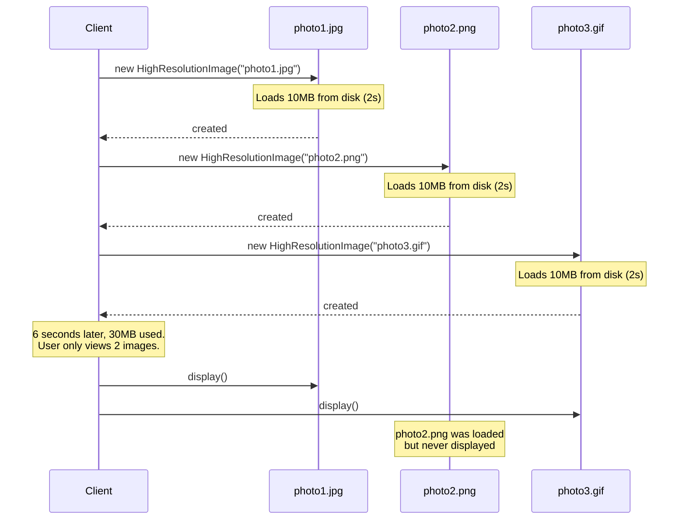
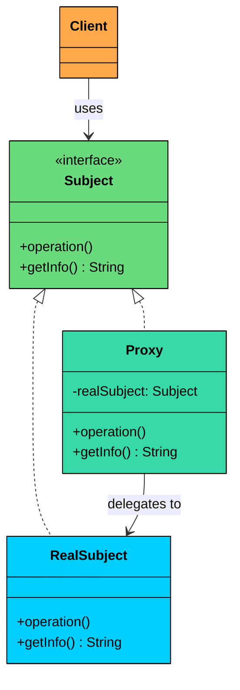
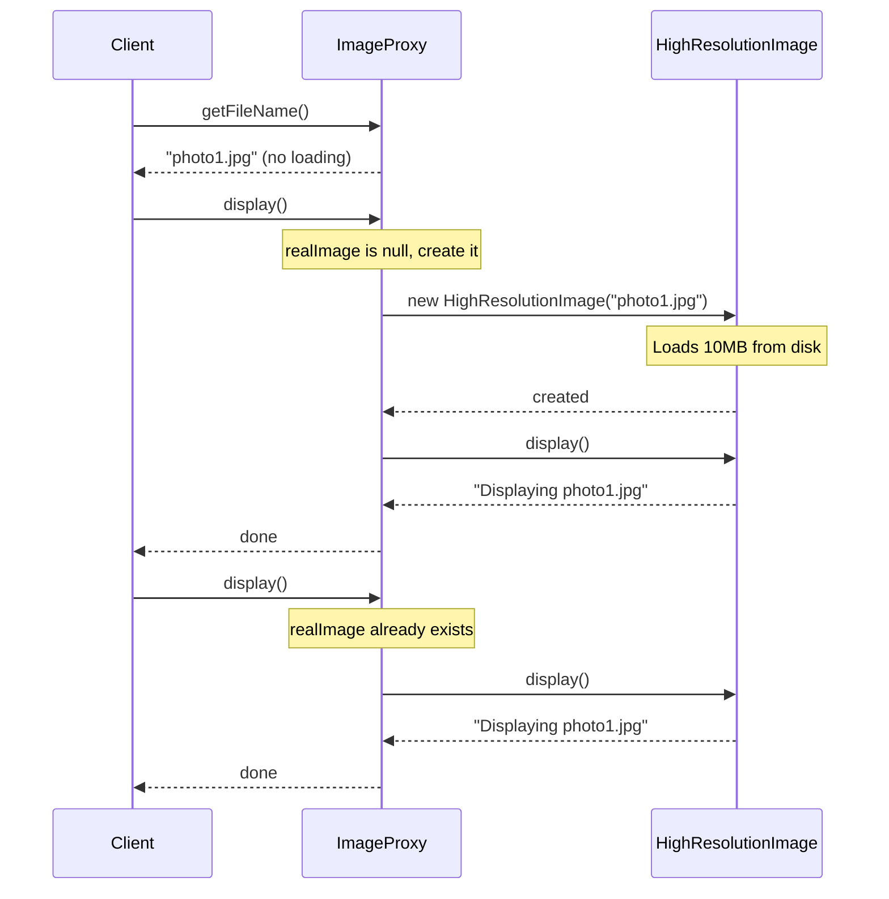
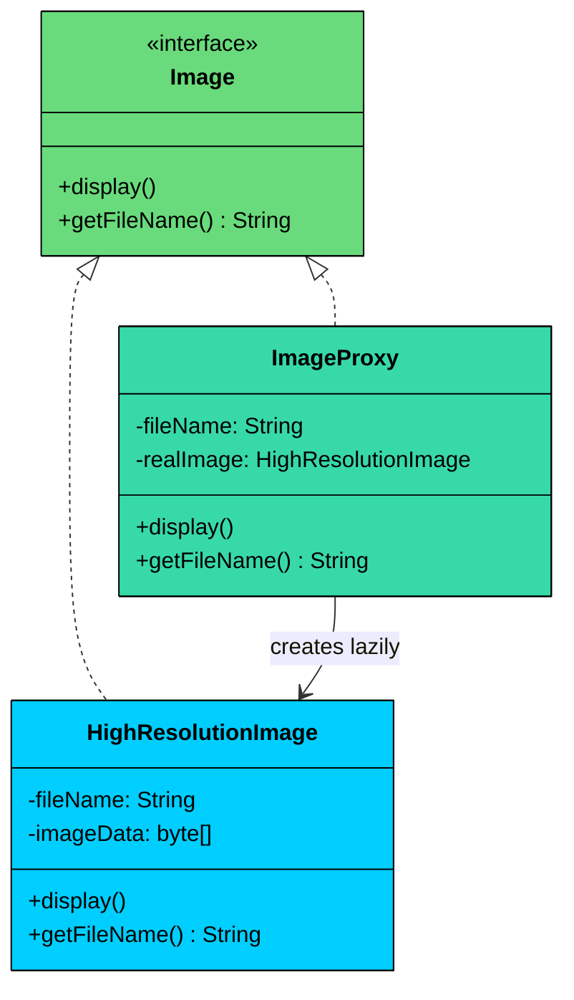
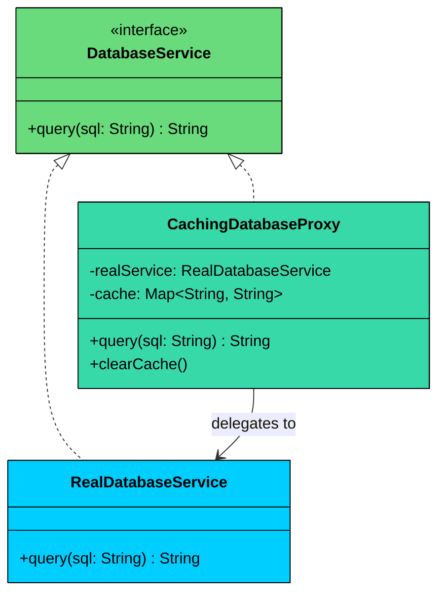

> 💡 **Key Insight:**

> **DEFINITION**
>
> The **Proxy Design Pattern** is a **structural pattern** that provides a **placeholder or surrogate** for another object, allowing you to **control access** to it.

In real-world systems, the objects you interact with are often resource-heavy, remote, or sensitive. Think of database connections, third-party APIs, file systems, or large in-memory datasets. Direct access to these objects is not always ideal.

A proxy helps when you want to:

- Delay creation or loading until it’s actually needed (lazy access).
- Restrict or control access (authentication, authorization, rate limiting).
- Add cross-cutting behavior like logging, caching, retries, or monitoring without changing the original class.

The proxy sits between the client and the real object, intercepting calls and deciding whether to forward them as-is, block them, or wrap them with extra behavior.

Let’s walk through a real-world example and see how we can apply the Proxy Pattern to build safer, smarter, and more controlled interactions with expensive or sensitive resources.

---

# 1. The Problem: Eager Loading

Imagine you're building an **image gallery application**. Users scroll through a list of thumbnails, and when they click on one, the full high-resolution image is displayed.

The straightforward approach creates all images upfront. Here is what the code looks like without any proxy:

```java
$a6
```

Every image gets loaded during construction. Here is the sequence of what happens when the gallery starts:



### What's Wrong With This Approach"

#### 1. Resource-Intensive Initialization

Every `HighResolutionImage` loads its image data at the time of construction, even if the user never views the image. This leads to slow application startup, unnecessary memory consumption, and wasted I/O bandwidth. If your gallery displays dozens or hundreds of thumbnails, this approach quickly becomes a bottleneck.

#### 2. No Control Over Access

What if you want to log every time an image is actually displayed" Add permission checks before loading a sensitive image" Cache previously loaded images for reuse" 

Right now, you would have to modify the `HighResolutionImage` class directly, mixing responsibilities and breaking the Single Responsibility Principle.

#### 3. Violates Single Responsibility Principle

The `HighResolutionImage` class does two things: it manages image data and it controls when that data is loaded. These are separate concerns. Loading policy (eager vs lazy, cached vs fresh, permitted vs denied) should not be baked into the data class itself.

### What We Really Need

We need a solution that allows us to:

- **Defer the expensive loading** of image data until it's actually needed.
- **Add extra behaviors** like logging, access control, or caching **without changing** the existing `HighResolutionImage` class.
- Maintain the same interface so that the client code doesn’t need to change.

This is where the **Proxy Design Pattern** comes into play.

---

# 2. What is the Proxy Pattern

The Proxy pattern is a structural pattern that provides a surrogate or placeholder for another object to control access to it. Instead of the client interacting directly with the real object, it interacts with a proxy that implements the same interface. The proxy decides when and how to forward requests to the real object.

Two characteristics define the pattern:

1. **Same interface preservation:** The proxy implements the same interface as the real object. The client cannot tell whether it is talking to the real object or a stand-in.
2. **Controlled access:** The proxy intercepts requests and adds behavior before, after, or instead of forwarding them. This might mean deferring creation, checking permissions, logging calls, or caching results.

---

## Class Diagram



Proxy has four participants.

#### Subject (e.g., `Image`)

The common interface that both the real object and the proxy implement.

In our image gallery example, `Image` is the Subject. It declares `display()` and `getFileName()` methods that every participant implements.

#### RealSubject (e.g., `HighResolutionImage`)

The actual object that performs the real, expensive work.

In our example, `HighResolutionImage` loads a 10MB image from disk during construction. It is the object we want to defer creating until absolutely necessary.

#### Proxy (e.g., `ImageProxy`)

A lightweight stand-in that implements the Subject interface and controls access to the RealSubject.

In our example, `ImageProxy` stores the filename but does not create a `HighResolutionImage` until `display()` is called. It can answer `getFileName()` without loading anything.

#### Client (e.g., `ImageGalleryApp`)

The consumer that works with objects through the Subject interface.

In our example, the gallery app creates `Image` references and calls `display()` on whichever images the user clicks. It does not know or care whether those references point to proxies or real images.

> 💡 **Key Insight:**

> **Types of Proxies**
>
> Depending on the use case, the Proxy may take different forms:
>
> - **Virtual Proxy: **Defers creation of the real object until it’s actually needed (lazy loading).
> - **Protection Proxy: **Performs permission checks before allowing access to certain operations.
> - **Remote Proxy: **Handles communication between local and remote objects over a network.
> - **Caching Proxy: **Caches expensive results and avoids repeated calls to the real subject.
> - **Smart Proxy: **Adds logging, reference counting, or monitoring before/after method calls.

---

# 3. How It Works

Here is the Proxy workflow for our image gallery, step by step:



#### **Step 1: Create the proxy**

The client creates an `ImageProxy` with the filename "photo1.jpg". The proxy stores the filename but does not load the image. Construction is instant and uses almost no memory.

#### **Step 2: No loading happens**

The real `HighResolutionImage` does not exist yet. No disk I/O, no memory allocation. The proxy is a lightweight placeholder.

#### **Step 3: Call a cheap operation**

The client calls `getFileName()` on the proxy. The proxy returns the stored filename directly, without creating the real image. Some operations do not need the real object at all.

#### **Step 4: Call an expensive operation**

The client calls `display()`. The proxy checks if the real image has been created. It has not, so the proxy creates a `HighResolutionImage`, which loads the file from disk and allocates memory.

#### **Step 5: Delegate to the real object**

After creating the real image, the proxy calls `display()` on it. The real image renders itself.

#### **Step 6: Subsequent calls skip creation**

The client calls `display()` again. The proxy sees that the real image already exists and delegates directly, with no loading delay.

---

# 4. Implementing Proxy

Now let's refactor our image gallery to use the Proxy pattern. Instead of eagerly loading every `HighResolutionImage`, we will use a proxy that wraps it and defers loading until the image is actually needed.



### 1. Create the Proxy Class

The `ImageProxy` implements the same `Image` interface as `HighResolutionImage`, so the client can use it interchangeably. Internally, it stores the filename and only creates the real image when `display()` is called.

```java
class ImageProxy implements Image {
    private String fileName;
    private HighResolutionImage realImage;

    public ImageProxy(String fileName) {
        this.fileName = fileName;
        System.out.println("ImageProxy: Created for " + fileName + ". Real image not loaded yet.");
    }

    @Override
    public String getFileName() {
        return fileName;
    }

    @Override
    public void display() {
        if (realImage == null) {
            System.out.println("ImageProxy: display() requested for " + fileName + ". Loading high-resolution image...");
            realImage = new HighResolutionImage(fileName);
        } else {
            System.out.println("ImageProxy: Using cached high-resolution image for " + fileName);
        }
        realImage.display();
    }
}
```

### 2. Using the Proxy from the Client

From the client's perspective, nothing changes. It still interacts with `Image` references. But now, instead of dealing with heavyweight objects upfront, it gets lightweight proxies that only load the real object on demand.

```java
public class ImageGalleryAppV2 {
    public static void main(String[] args) {
        System.out.println("Application Started. Initializing image proxies for gallery...");

        Image image1 = new ImageProxy("photo1.jpg");
        Image image2 = new ImageProxy("photo2.png");
        Image image3 = new ImageProxy("photo3.gif");

        System.out.println("\nGallery initialized. No images actually loaded yet.");
        System.out.println("Image 1 Filename: " + image1.getFileName());

        System.out.println("\nUser requests to display " + image1.getFileName());
        image1.display();

        System.out.println("\nUser requests to display " + image1.getFileName() + " again.");
        image1.display();

        System.out.println("\nUser requests to display " + image3.getFileName());
        image3.display();

        System.out.println("\nApplication finished. Note: photo2.png was never loaded.");
    }
}
```

#### **Output:**

```plaintext
Application Started. Initializing image proxies for gallery...
ImageProxy: Created for photo1.jpg. Real image not loaded yet.
ImageProxy: Created for photo2.png. Real image not loaded yet.
ImageProxy: Created for photo3.gif. Real image not loaded yet.

Gallery initialized. No images actually loaded yet.
Image 1 Filename: photo1.jpg

User requests to display photo1.jpg
ImageProxy: display() requested for photo1.jpg. Loading high-resolution image...
Loading image: photo1.jpg from disk (Expensive Operation)...
Image photo1.jpg loaded successfully.
Displaying image: photo1.jpg

User requests to display photo1.jpg again.
ImageProxy: Using cached high-resolution image for photo1.jpg
Displaying image: photo1.jpg

User requests to display photo3.gif
ImageProxy: display() requested for photo3.gif. Loading high-resolution image...
Loading image: photo3.gif from disk (Expensive Operation)...
Image photo3.gif loaded successfully.
Displaying image: photo3.gif

Application finished. Note: photo2.png was never loaded.
```

### **What We Achieved:**

- **Lazy loading:** Images are only loaded when the user actually views them, cutting startup time from 6 seconds to near-instant
- **Memory savings:** photo2.png was never loaded, saving 10MB of memory
- **Same interface:** The client code uses `Image` references throughout, unaware of the proxy
- **No changes to the real object:** `HighResolutionImage` was not modified at all
- **Cached access:** The second `display()` call on photo1.jpg reuses the already-loaded image with no delay

---

# 5. Extending the Design: Other Proxy Types

One of the most powerful aspects of the Proxy pattern is how easily it extends to support different concerns. The virtual proxy we just built defers creation. But the same structure supports access control, logging, caching, and more, all without modifying the real object or changing the client code significantly.

### 1. Adding a Protection Proxy

A protection proxy controls access based on authorization rules. For example, only users with an `ADMIN` role should be able to view confidential images.

The key design decision here is how to pass user context. You might be tempted to change the `display()` method signature to accept a user role, but that would break the `Image` interface contract. Instead, the user context is passed through the proxy's constructor. The proxy knows who the user is, and the interface stays clean.

```java
class SecureImageProxy implements Image {
    private String fileName;
    private String userRole;
    private HighResolutionImage realImage;

    public SecureImageProxy(String fileName, String userRole) {
        this.fileName = fileName;
        this.userRole = userRole;
    }

    @Override
    public String getFileName() {
        return fileName;
    }

    @Override
    public void display() {
        if (!checkAccess()) {
            System.out.println("SecureImageProxy: ACCESS DENIED for " + fileName + " (role: " + userRole + ")");
            return;
        }
        if (realImage == null) {
            realImage = new HighResolutionImage(fileName);
        }
        realImage.display();
    }

    private boolean checkAccess() {
        System.out.println("SecureImageProxy: Checking access for role '" + userRole + "' on " + fileName);
        return "ADMIN".equals(userRole) || !fileName.contains("secret");
    }
}
```

Notice that the `Image` interface is unchanged. The proxy constructor takes the user role as extra context, and `display()` checks access before creating or delegating to the real object. An admin can view anything. A regular user gets blocked from files containing "secret" in the name.

### 2. Adding a Logging Proxy

A logging proxy intercepts method calls and records them for auditing, debugging, or usage analytics. It wraps an existing `Image` and logs timestamps before and after each operation.

```java
class LoggingImageProxy implements Image {
    private Image wrappedImage;

    public LoggingImageProxy(Image wrappedImage) {
        this.wrappedImage = wrappedImage;
    }

    @Override
    public String getFileName() {
        return wrappedImage.getFileName();
    }

    @Override
    public void display() {
        System.out.println("[LOG " + new java.util.Date() + "] display() called for " + getFileName());
        wrappedImage.display();
        System.out.println("[LOG " + new java.util.Date() + "] display() completed for " + getFileName());
    }
}
```

Notice that the logging proxy wraps any `Image`, not just `HighResolutionImage`. You could stack it on top of the virtual proxy: `new LoggingImageProxy(new ImageProxy("photo1.jpg"))`. The logging proxy logs the call, then delegates to the virtual proxy, which handles lazy loading. Each proxy handles one concern.

---

# 6. Practical Example: Database Query Caching Proxy

To show the Proxy pattern in a completely different domain, let's build a database query caching system. The interface defines a simple query operation. The real implementation simulates a slow database. The caching proxy stores results and returns cached values for repeated queries.



### Implementation

```java
$ad
```

The first query takes a full 100 milliseconds (simulated database latency). The identical second query returns instantly from cache. After clearing the cache, the same query hits the database again. The client code uses the same `DatabaseService` interface throughout, unaware that caching is happening behind the scenes.
