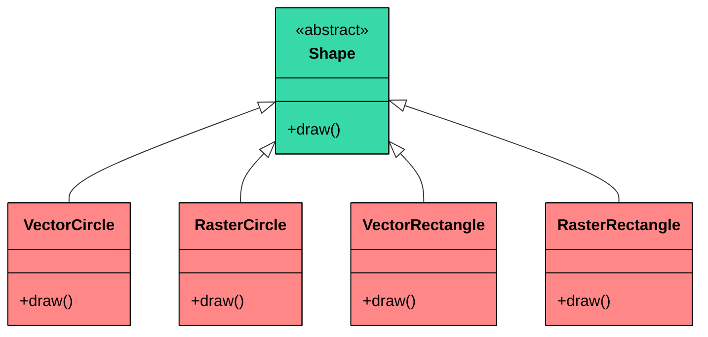
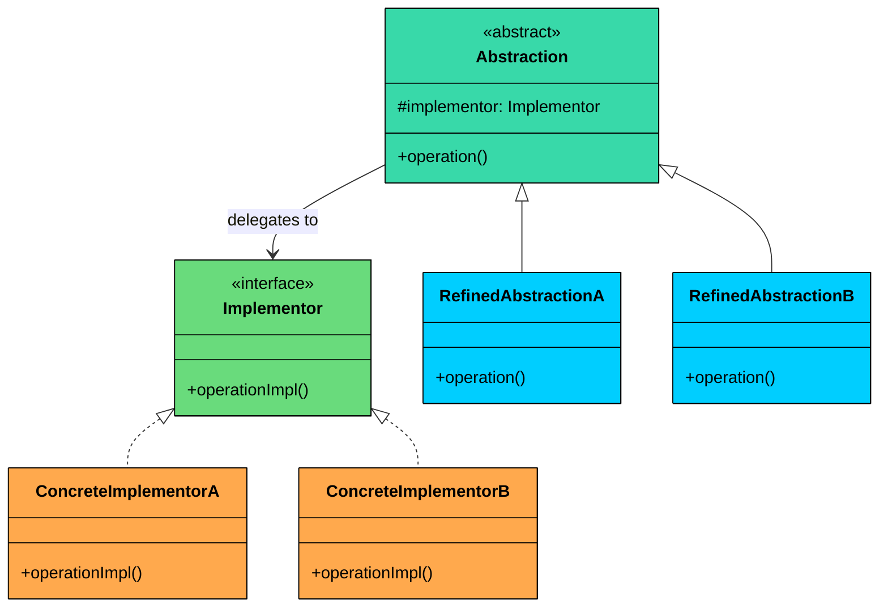
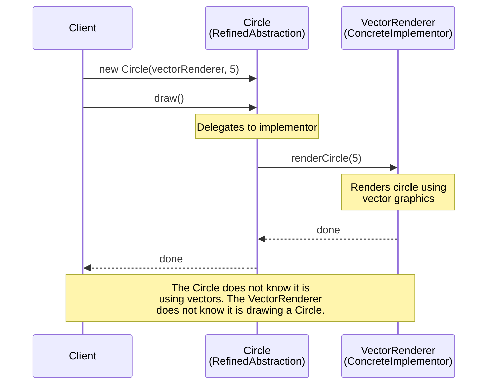
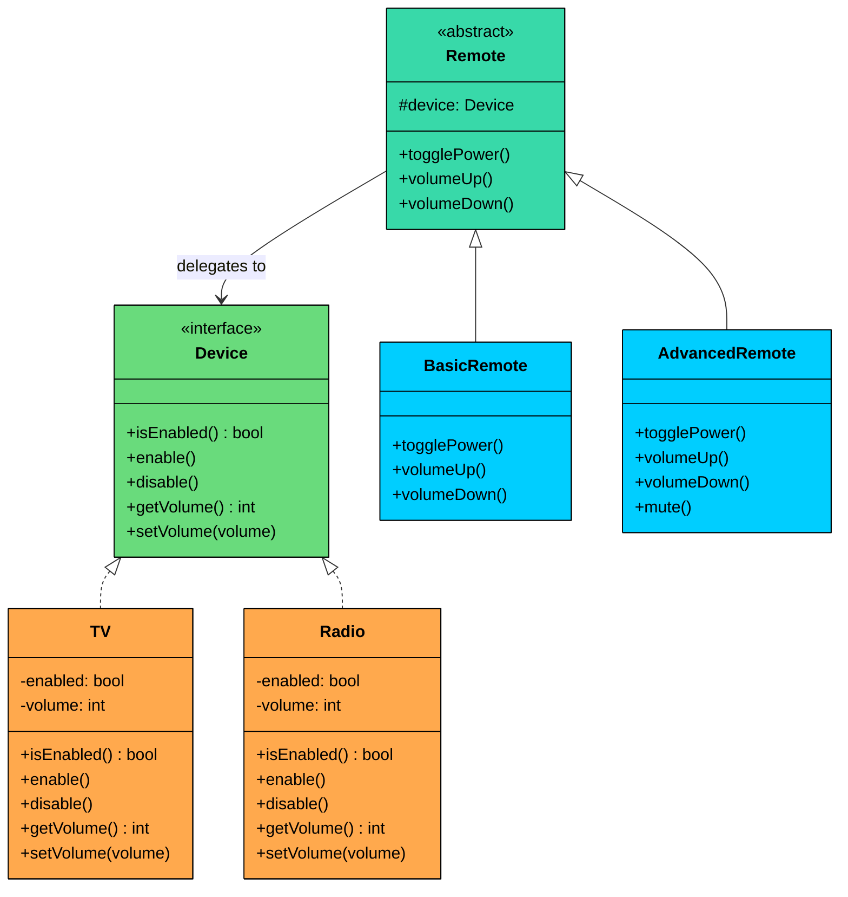

> 💡 **Key Insight:**

> **DEFINITION**
>
> The **Bridge Design Pattern** is a **structural pattern** that lets you **decouple an abstraction from its implementation**, allowing the two to vary **independently**.

It’s particularly useful in situations where:

- You have classes that can be extended in **multiple orthogonal dimensions** (e.g., shape vs. rendering technology, UI control vs. platform).
- You want to avoid a deep inheritance hierarchy that **multiplies combinations** of features.
- You need to **combine multiple variations of behavior or implementation at runtime**.

The **Bridge Pattern** splits a class into two separate hierarchies:

- One for the **abstraction** (e.g., shape, UI control)
- One for the **implementation** (e.g., rendering engine, platform)

These two hierarchies are **"bridged"** via composition (not inheritance) allowing you to mix and match independently.

Let’s walk through a real-world example to see how we can apply the Bridge Pattern to build a system that is both **flexible and scalable**, without being buried under layers of rigid subclasses.

---

# 1. The Problem: Drawing Shapes

Imagine you're building a **cross-platform graphics library**. It supports rendering **shapes** like circles and rectangles using different rendering approaches:

- 🟢 **Vector rendering:** for scalable, resolution-independent output
- 🔵 **Raster rendering:** for pixel-based output

Now, you need to support:

- Drawing **different shapes** (e.g., `Circle`, `Rectangle`)
- Using **different renderers** (e.g., `VectorRenderer`, `RasterRenderer`)

### Naive Implementation: Subclass for Every Combination

You might start by creating a class hierarchy that looks like this:

```java
abstract class Shape {
    public abstract void draw();
}

// Circle variants
class VectorCircle extends Shape {
    public void draw() {
        System.out.println("Drawing Circle as VECTORS");
    }
}

class RasterCircle extends Shape {
    public void draw() {
        System.out.println("Drawing Circle as PIXELS");
    }
}

// Rectangle variants
class VectorRectangle extends Shape {
    public void draw() {
        System.out.println("Drawing Rectangle as VECTORS");
    }
}

class RasterRectangle extends Shape {
    public void draw() {
        System.out.println("Drawing Rectangle as PIXELS");
    }
}
```

Here is what this class hierarchy looks like:



Every red node is a class that fuses two concerns: shape identity and rendering strategy. This is only 2 shapes and 2 renderers. The problem compounds quickly.

### Why This Quickly Breaks Down

#### 1. Class Explosion

Every new combination of shape and rendering method requires a **new subclass**:

- 2 shapes × 2 renderers = 4 classes
- Add a third renderer (e.g., OpenGL)" Now you need 6 classes
- Add more shapes (e.g., triangle, ellipse)" The combinations multiply

This makes the class hierarchy **bloated and rigid**.

#### 2. Tight Coupling

Each class ties together shape logic and rendering logic. You cannot reuse rendering behavior independently of the shape. They are intertwined in every subclass.

#### 3. Violates Open/Closed Principle

If you want to support a **new rendering engine**, you must modify or recreate every shape for that renderer.

### What We Really Need

We need a solution that:

- Separates the **abstraction** (`Shape`) from its **implementation** (`Renderer`)
- Allows new renderers to be added without touching shape classes
- Enables new shapes to be added without modifying or duplicating renderer logic
- Keeps the system scalable, extensible, and composable

This is exactly where the **Bridge Pattern** comes in.

---

# 2. What is the Bridge Pattern

The **Bridge Design Pattern** lets you **split a class into two separate hierarchies: **one for the **abstraction** and another for the **implementation,** so that they can evolve independently.

Two characteristics define the pattern:

1. **Independent variation:** The abstraction hierarchy (shapes) and the implementation hierarchy (renderers) can grow without affecting each other. Adding a new shape does not require touching any renderer. Adding a new renderer does not require touching any shape.
2. **Composition over inheritance:** The abstraction holds a reference to an implementor object and delegates work to it at runtime, rather than inheriting implementation behavior. This keeps both hierarchies shallow and flexible.

> 💡 **Key Insight:**

> **Real-World Analogy**
>
> Think of a TV remote control and the TV itself. The remote is the abstraction: it has buttons for power, volume, and channel. The TV is the implementation: it contains the circuits that actually change volume, switch channels, and toggle power. You can swap remotes without changing the TV, and you can swap TVs without changing the remote. 
>
> A basic remote works with a Samsung TV. The same Samsung TV works with a universal remote that has extra buttons. The remote hierarchy and the TV hierarchy vary independently, connected only by the infrared signal between them. That signal is the bridge.

---

## Class Diagram



The structure involves four participants:

#### 1. Abstraction (e.g., `Shape)`

The high-level interface that clients interact with. It defines operations in terms that make sense to the domain (e.g., "draw a shape") and delegates the low-level work to an implementor.

In our shapes example, `Shape` is the Abstraction. It holds a reference to a `Renderer` and declares a `draw()` method. The Shape knows what to draw, the Renderer knows how to draw it.

#### 2. RefinedAbstraction (e.g., `Circle`, `Rectangle)`

A concrete subclass of Abstraction that adds domain-specific state or behavior. It still delegates to the implementor for low-level operations.

In our example, `Circle` adds a `radius` field and passes it to the renderer when drawing. `Rectangle` adds `width` and `height`. Neither knows or cares whether the renderer uses vectors or pixels.

#### 3. Implementor (e.g., `Renderer)`

The interface that defines the low-level operations that concrete implementations must provide. This is the "other side" of the bridge.

In our example, `Renderer` declares methods like `renderCircle(radius)` and `renderRectangle(width, height)`. These are primitive rendering operations that different engines implement differently.

#### 4. ConcreteImplementors (e.g., `VectorRenderer,RasterRenderer)`

A concrete class that implements the Implementor interface with a specific technology or strategy.

In our example, `VectorRenderer` outputs vector-based instructions and `RasterRenderer` outputs pixel-based instructions. Neither knows whether it is being called by a Circle or a Rectangle.

---

# 3. How It Works

Here is the Bridge workflow, step by step:



#### **Step 1: Create a concrete implementor**

The client (or a factory) instantiates a specific implementation, for example `VectorRenderer`. This object knows how to perform low-level rendering operations using vector graphics.

#### **Step 2: Pass it to the abstraction**

The client creates a `Circle` and passes the `VectorRenderer` into its constructor. The Circle stores this reference internally. It does not know or care what kind of renderer it received.

#### **Step 3: Call the high-level operation**

The client calls `circle.draw()`. This is a domain-level operation: "draw this shape." The client does not think about rendering engines.

#### **Step 4: Abstraction delegates to implementor**

Inside `draw()`, the Circle calls `renderer.renderCircle(radius)`. It translates the high-level operation ("draw me") into a low-level operation ("render a circle with this radius") and delegates to the implementor.

#### **Step 5: Implementor executes**

The `VectorRenderer` runs its own rendering logic, producing vector output. It has no idea it was called by a Circle. It just received a radius and did its job.

---

# 4. Implementing Bridge

Let us now implement the Bridge pattern to decouple our Shape abstraction from the Renderer implementation. This allows us to mix and match shapes and rendering engines freely, without subclass explosion.

### Step 1: Define the Implementor Interface (`Renderer`)

This interface declares rendering operations for shapes. Concrete implementations will define how to render shapes using a particular technique (vector, raster, etc.).

```java
interface Renderer {
    void renderCircle(float radius);
    void renderRectangle(float width, float height);
}
```

### Step 2: Create Concrete Implementations of the Renderer

These classes provide the actual rendering logic for each engine.

#### 🟢 VectorRenderer

```java
class VectorRenderer implements Renderer {
    @Override
    public void renderCircle(float radius) {
        System.out.println("Drawing a circle of radius " + radius + " using VECTOR rendering.");
    }

    @Override
    public void renderRectangle(float width, float height) {
        System.out.println("Drawing a rectangle " + width + "x" + height + " using VECTOR rendering.");
    }
}
```

#### 🔵 RasterRenderer

```java
class RasterRenderer implements Renderer {
    @Override
    public void renderCircle(float radius) {
        System.out.println("Drawing pixels for a circle of radius " + radius + " (RASTER).");
    }

    @Override
    public void renderRectangle(float width, float height) {
        System.out.println("Drawing pixels for a rectangle " + width + "x" + height + " (RASTER).");
    }
}
```

### Step 3: Define the Abstraction (`Shape`)

This class holds a reference to the renderer and declares a general `draw()` method. Each concrete shape will implement `draw()` by delegating to the renderer.

```java
abstract class Shape {
    protected Renderer renderer;

    public Shape(Renderer renderer) {
        this.renderer = renderer;
    }

    public abstract void draw();
}
```

### Step 4: Create Concrete Shapes

Each shape delegates rendering to the renderer passed into it. The shape knows its own properties (radius, width, height), and the renderer knows how to draw primitives. Neither knows about the other's internals.

#### Circle

```java
class Circle extends Shape {
    private final float radius;

    public Circle(Renderer renderer, float radius) {
        super(renderer);
        this.radius = radius;
    }

    @Override
    public void draw() {
        renderer.renderCircle(radius);
    }
}
```

#### Rectangle

```java
class Rectangle extends Shape {
    private final float width;
    private final float height;

    public Rectangle(Renderer renderer, float width, float height) {
        super(renderer);
        this.width = width;
        this.height = height;
    }

    @Override
    public void draw() {
        renderer.renderRectangle(width, height);
    }
}
```

### Step 5: Client Code

Now we can freely combine shapes and rendering strategies at runtime, without creating a new class for each combination.

```java
public class BridgeDemo {
    public static void main(String[] args) {
        Renderer vector = new VectorRenderer();
        Renderer raster = new RasterRenderer();

        Shape circle1 = new Circle(vector, 5);
        Shape circle2 = new Circle(raster, 5);

        Shape rectangle1 = new Rectangle(vector, 10, 4);
        Shape rectangle2 = new Rectangle(raster, 10, 4);

        circle1.draw();     // Vector
        circle2.draw();     // Raster
        rectangle1.draw();  // Vector
        rectangle2.draw();  // Raster
    }
}
```

#### **Expected Output:**

```plaintext
Drawing a circle of radius 5.0 using VECTOR rendering.
Drawing pixels for a circle of radius 5.0 (RASTER).
Drawing a rectangle 10.0x4.0 using VECTOR rendering.
Drawing pixels for a rectangle 10.0x4.0 (RASTER).
```

### What We Achieved

- **Decoupled abstractions from implementations: **Shapes and renderers evolve independently
- **Open/Closed compliance: **You can add new renderers or shapes without modifying existing ones
- **No class explosion: **Avoided the need for every shape-renderer subclass
- **Runtime flexibility: **Dynamically switch renderers based on user/device context
- **Clean, extensible design: **Each class has a single responsibility and can be composed as needed

---

# 5. Practical Example: Remote Control and Devices

To make sure Bridge clicks beyond the shapes example, let us build a completely different system: remote controls and electronic devices. The abstraction is the remote (basic remote, advanced remote), and the implementation is the device (TV, radio).

A basic remote can toggle power and adjust volume. An advanced remote adds a mute button. Both remotes work with any device.



The Device interface is the Implementor. TV and Radio are ConcreteImplementors. Remote is the Abstraction. BasicRemote and AdvancedRemote are RefinedAbstractions. The bridge is the reference from Remote to Device.

### Implementation

```java
$b3
```

Notice how the same TV object is used with both the basic remote and the advanced remote. The remote hierarchy and the device hierarchy vary independently. Adding a Speaker device means writing one new class. Adding a VoiceRemote means writing one new class. Neither side knows about the other.
