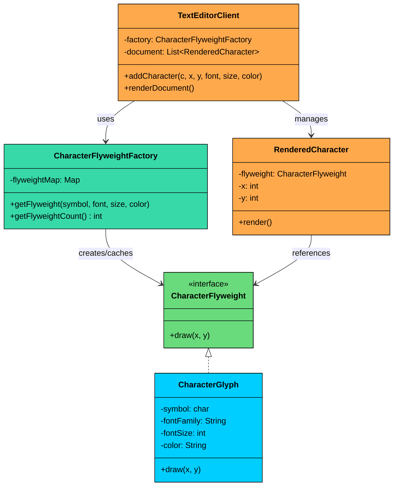
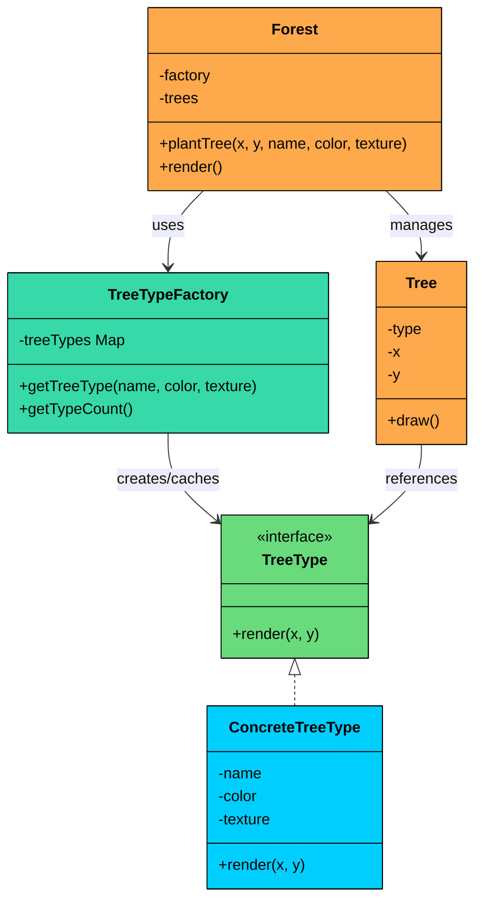

> 💡 **Key Insight:**

> **DEFINITION**
>
> The **Flyweight Design Pattern** is a **structural pattern** that focuses on **efficiently sharing common parts of object state** across many objects to **reduce memory usage** and **boost performance**.

It’s particularly useful in situations where:

- You need to create a **large number of similar objects**, but most of their data is **shared or repeated**.
- Storing all object data individually would result in high memory consumption.
- You want to **separate intrinsic state** (shared, reusable data) from **extrinsic state** (context-specific, passed in at runtime).

Let’s walk through a real-world example to see how we can apply the Flyweight Pattern to drastically reduce memory usage and create scalable object-heavy systems.

---

# 1. The Problem: Rendering Characters

Imagine you're building a **rich text editor** that needs to render characters on screen, something like Google Docs or MS Word.

Every single character (`a`, `b`, `c`, `...`, `z`, punctuation, etc.) on screen needs to be rendered with formatting properties such as: font family, font size, color.

On top of that, each character has a position on the page (its x and y coordinates).

The straightforward approach is to create a full object for every character, bundling all this data together. Here is what the naive code looks like:

```java
class CharacterGlyph {
    private char symbol;          // e.g., 'a', 'b', etc.
    private String fontFamily;    // e.g., "Arial"
    private int fontSize;         // e.g., 12
    private String color;         // e.g., "#000000"
    private int x;                // position X
    private int y;                // position Y

    public CharacterGlyph(char symbol, String fontFamily, int fontSize, String color, int x, int y) {
        this.symbol = symbol;
        this.fontFamily = fontFamily;
        this.fontSize = fontSize;
        this.color = color;
        this.x = x;
        this.y = y;
    }

    public void draw() {
        System.out.println("Drawing '" + symbol + "' in " + fontFamily +
            ", size " + fontSize + ", color " + color + " at (" + x + "," + y + ")");
    }
}
```

Now imagine rendering a 10-page document with 500,000 characters. Even if the vast majority of those characters share the same font, size, and color, you are still allocating half a million objects, each carrying its own copy of the formatting data. That is a lot of redundant memory.

### Why This Is a Problem"

The naive design works for small documents. But as the character count grows, several serious problems surface.

#### 1. High Memory Usage

Every character object stores its own copy of font family, font size, and color. In a typical document, most characters share identical formatting. If each object consumes roughly 100 bytes of formatting data, a 500,000-character document wastes approximately 50MB on duplicated information. 

The actual character symbol and position might only need 12 bytes per instance. The rest is pure redundancy.

#### 2. Performance Bottleneck

Creating and managing 500,000 individual objects puts enormous pressure on the garbage collector (or memory allocator in non-GC languages). Each object occupies space on the heap. The GC has to track, scan, and potentially collect all of them. 

CPU cache performance also degrades because the working set is far larger than it needs to be. On lower-end devices, this can cause visible lag during scrolling and rendering.

#### 3. Poor Scalability

A single 10-page document is just the beginning. What about a user who opens five documents simultaneously" Or an e-book reader rendering a 600-page novel" 

Memory usage multiplies with every additional document, and the system runs out of headroom fast. What seemed acceptable for a small prototype becomes unworkable at real-world scale.

#### 4. No State Separation

The core issue is that intrinsic state and extrinsic state are tangled together in every object. Intrinsic state (font family, font size, color) is shared across many characters. Extrinsic state (x and y position) is unique to each character. 

By lumping them into the same object, we make every character instance unique even when only the position differs. There is no mechanism to share what can be shared.

### What We Really Need

We need a way to:

- Share formatting data (font, size, color) among all characters that use the same style
- Store only truly unique data (position) for each character instance
- Avoid duplicating redundant data while still rendering every character accurately
- Use a central factory to manage and cache shared instances

This is exactly what the **Flyweight pattern** solves.

---

# 2. What is the Flyweight Pattern

The Flyweight pattern is a structural design pattern that minimizes memory usage by sharing common state across a large number of similar objects instead of storing that state in each object individually.

Two characteristics define the Flyweight pattern and set it apart from other structural patterns:

1. **Intrinsic/extrinsic state separation.** The pattern divides object state into two parts. Intrinsic state is shared and immutable, stored inside the flyweight. Extrinsic state is context-dependent and unique, stored outside the flyweight and passed in when needed. This separation is what makes sharing possible.
2. **Factory-managed caching.** A dedicated factory object controls the creation and reuse of flyweights. Clients never instantiate flyweights directly. They go through the factory, which maintains a cache and ensures that identical flyweights are shared rather than duplicated.

---

## Class Diagram

#### **Flyweight Interface**

Declares a method like `draw(x, y)` that takes extrinsic state (position)

#### **ConcreteFlyweight**

Implements the flyweight and stores **intrinsic state** like font and symbol

#### **FlyweightFactory**

Caches and reuses flyweights to avoid duplication

#### **Client**

Maintains extrinsic state and uses shared flyweights to perform operations

---

# 3. Implementing Flyweight Pattern

Let’s implement the **Flyweight Pattern** to optimize how we render text in a document editor. Our goal is to **share common formatting properties** (font, size, color) across characters and store only unique data (like position) at the instance level.

The fix is to split each character into two parts: the formatting data that can be shared (intrinsic state) and the position that is unique to each occurrence (extrinsic state). A factory manages the shared objects, and the client combines them with position data at render time.



### Step 1: Define the Flyweight Interface

The flyweight interface declares a single method, `draw(x, y)`, where x and y represent extrinsic state. The flyweight itself does not store position. Instead, the caller passes position in at render time. This is the key design decision that makes sharing possible.

```java
interface CharacterFlyweight {
    void draw(int x, int y);
}
```

Every flyweight object will implement this interface. The client can call `draw` with any position, and the flyweight combines that position with its own stored formatting data to produce the output. This clean separation is what enables a single flyweight instance to serve thousands of characters.

### Step 2: Implement the Concrete Flyweight

The concrete flyweight stores intrinsic state only: the character symbol, font family, font size, and color. These fields are immutable. Once a flyweight is created, its internal state never changes. The `draw` method combines the stored intrinsic state with the extrinsic position parameters to render the character.

```java
class CharacterGlyph implements CharacterFlyweight {
    private final char symbol;
    private final String fontFamily;
    private final int fontSize;
    private final String color;

    public CharacterGlyph(char symbol, String fontFamily, int fontSize, String color) {
        this.symbol = symbol;
        this.fontFamily = fontFamily;
        this.fontSize = fontSize;
        this.color = color;
    }

    @Override
    public void draw(int x, int y) {
        System.out.println("Drawing '" + symbol + "' [Font: " + fontFamily +
            ", Size: " + fontSize + ", Color: " + color + "] at (" + x + "," + y + ")");
    }
}
```

Notice that the constructor takes only four parameters, not six. Position is gone from the object's state entirely. The `final` (or `readonly`) modifiers reinforce that these fields are set once at creation and never change. 

This immutability is what makes sharing safe: no matter how many clients reference the same flyweight, none of them can corrupt it.

### Step 3: Create the Flyweight Factory

The factory is the heart of the pattern. It maintains a map of already-created flyweights, keyed by a string that concatenates all intrinsic fields. 

When a client requests a flyweight, the factory checks the map first. If a matching flyweight exists, it returns the cached instance. If not, it creates a new one, stores it, and returns it. This guarantees that identical combinations of intrinsic state are never duplicated.

```java
class CharacterFlyweightFactory {
    private final Map<String, CharacterFlyweight> flyweightMap = new HashMap<>();

    public CharacterFlyweight getFlyweight(char symbol, String fontFamily, int fontSize, String color) {
        String key = symbol + fontFamily + fontSize + color;
        flyweightMap.putIfAbsent(key, new CharacterGlyph(symbol, fontFamily, fontSize, color));
        return flyweightMap.get(key);
    }

    public int getFlyweightCount() {
        return flyweightMap.size();
    }
}
```

The factory guarantees that if two characters share the same symbol, font, size, and color, they will point to the exact same object in memory. The `getFlyweightCount` method is useful for verifying how much sharing actually occurred, which is especially helpful during testing and debugging.

### Step 4: Create the Client

The client side consists of two parts. `RenderedCharacter` is a lightweight wrapper that pairs a shared flyweight with a specific position. `TextEditorClient` is the main orchestrator: it uses the factory to obtain flyweights, wraps them with position data, and renders the entire document.

```java
class TextEditorClient {
    private final CharacterFlyweightFactory factory = new CharacterFlyweightFactory();
    private final List<RenderedCharacter> document = new ArrayList<>();

    public void addCharacter(char c, int x, int y, String font, int size, String color) {
        CharacterFlyweight glyph = factory.getFlyweight(c, font, size, color);
        document.add(new RenderedCharacter(glyph, x, y));
    }

    public void renderDocument() {
        for (RenderedCharacter rc : document) {
            rc.render();
        }
        System.out.println("Total flyweight objects used: " + factory.getFlyweightCount());
    }

    private static class RenderedCharacter {
        private final CharacterFlyweight glyph;
        private final int x, y;

        public RenderedCharacter(CharacterFlyweight glyph, int x, int y) {
            this.glyph = glyph;
            this.x = x;
            this.y = y;
        }

        public void render() {
            glyph.draw(x, y);
        }
    }
}
```

Each `RenderedCharacter` is extremely lightweight. It holds just a reference to a shared flyweight and two integers for position. The heavy formatting data lives in the flyweight, and many `RenderedCharacter` instances can point to the same one. This is where the memory savings come from.

### Using the Flyweight from the Client

Let's put everything together. The demo renders two words with different formatting and shows how many flyweight objects were actually created versus how many characters were rendered.

```java
public class FlyweightDemo {
    public static void main(String[] args) {
        TextEditorClient editor = new TextEditorClient();

        // Render "Hello" with same style
        String word = "Hello";
        for (int i = 0; i < word.length(); i++) {
            editor.addCharacter(word.charAt(i), 10 + i * 15, 50, "Arial", 14, "#000000");
        }

        // Render "World" with different font and color
        String word2 = "World";
        for (int i = 0; i < word2.length(); i++) {
            editor.addCharacter(word2.charAt(i), 10 + i * 15, 100, "Times New Roman", 14, "#3333FF");
        }

        editor.renderDocument();
    }
}
```

#### Sample Output:

```plaintext
Drawing 'H' [Font: Arial, Size: 14, Color: #000000] at (10,50)
Drawing 'e' [Font: Arial, Size: 14, Color: #000000] at (25,50)
Drawing 'l' [Font: Arial, Size: 14, Color: #000000] at (40,50)
Drawing 'l' [Font: Arial, Size: 14, Color: #000000] at (55,50)
Drawing 'o' [Font: Arial, Size: 14, Color: #000000] at (70,50)
Drawing 'W' [Font: Times New Roman, Size: 14, Color: #3333FF] at (10,100)
Drawing 'o' [Font: Times New Roman, Size: 14, Color: #3333FF] at (25,100)
Drawing 'r' [Font: Times New Roman, Size: 14, Color: #3333FF] at (40,100)
Drawing 'l' [Font: Times New Roman, Size: 14, Color: #3333FF] at (55,100)
Drawing 'd' [Font: Times New Roman, Size: 14, Color: #3333FF] at (70,100)
Total flyweight objects used: 9
```

We rendered 10 characters, but only 9 flyweight objects were created. Why 9 and not 10" Look at the word "Hello": the letter `l` appears twice at positions (40,50) and (55,50), but both occurrences use the same font, size, and color. The factory returns the same flyweight instance for both. That is one flyweight serving two rendered characters.

You might wonder why `o` in "Hello" and `o` in "World" did not share a flyweight. The reason is that they use different formatting: "Hello" is rendered in Arial with color `#000000`, while "World" uses Times New Roman with color `#3333FF`. The intrinsic state is different, so the factory correctly creates separate flyweight instances for each.

### What We Achieved

- **Memory efficiency:** Shared formatting eliminates duplication. Instead of storing font, size, and color in every character object, that data lives in a handful of flyweights.
- **Improved performance:** Fewer objects means lower GC pressure and better cache utilization. The runtime spends less time allocating and collecting objects.
- **Separation of concerns:** Formatting (intrinsic) and position (extrinsic) are cleanly separated. Changes to how position works do not affect the flyweight objects at all.
- **Reusability:** Glyphs for common characters are reused across the entire document. The letter `e` in Arial 14 black is the same flyweight whether it appears on page 1 or page 50.
- **Scalability:** A document with 500,000 characters might only need a few hundred flyweight objects (one per unique combination of character and formatting). Memory usage stays flat as document size grows.

---

# 4. Practical Example: Game Forest Rendering

Let's apply the Flyweight pattern to a completely different domain. Imagine you are building a 2D game that renders a forest scene. The forest contains thousands of trees, but there are only a handful of distinct species. Each species has its own name, color, and texture, but every tree also has a unique position on the map.

This gives us a clean separation between the two types of state:

- **Intrinsic state (shared):** species name, color, and texture. These properties are identical for every tree of the same species, so we can share them across all instances.
- **Extrinsic state (unique):** the x and y coordinates on the map. Every tree placement has its own position, so this data stays outside the flyweight.

### Class Diagram



The `TreeType` interface defines the flyweight contract with a single `render` method that accepts extrinsic coordinates. `ConcreteTreeType` stores the heavy intrinsic data (name, color, texture) and implements rendering. The `TreeTypeFactory` maintains a cache of flyweights, creating new ones only when a species combination has not been seen before.

Each `Tree` object is lightweight, holding just a reference to its shared `TreeType` plus its own x and y position. Finally, the `Forest` class ties everything together, using the factory to plant trees and delegating rendering to each tree.

### Implementation

```java
$a6
```

Five trees in the forest, but only three TreeType flyweight objects in memory. The two Oak trees share one flyweight, and the two Pine trees share another. In a real game with 10,000 trees and 15 species, you would have 10,000 Tree objects (each holding just a reference and two coordinates) but only 15 ConcreteTreeType objects storing the heavy texture and color data.

That is the power of Flyweight in a domain where memory directly impacts frame rate.
