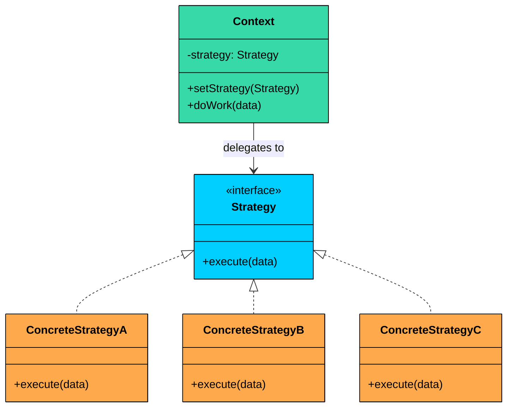
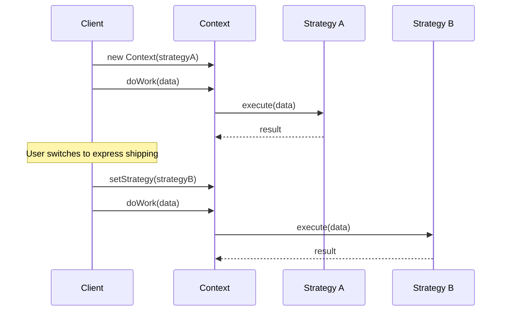
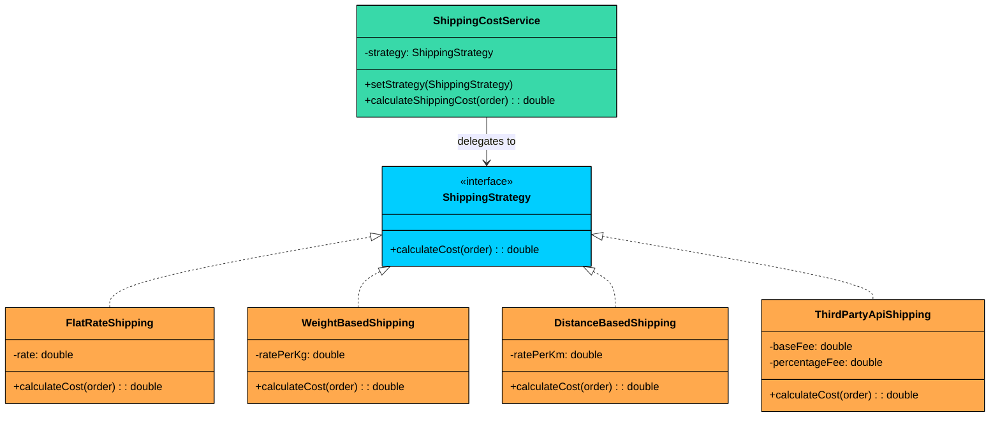
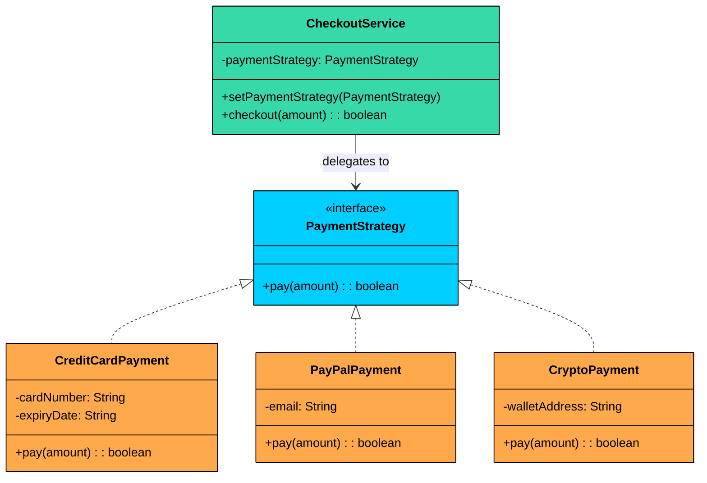

> 💡 **Key Insight:**

> **DEFINITION**
>
> The **Strategy Design Pattern** is a behavioral pattern that lets you define a family of algorithms, encapsulate each one in its own class, and make them interchangeable at runtime.

At its core, the Strategy pattern is about separating "what varies" from "what stays the same." 

Instead of embedding multiple algorithms inside a single class with conditional logic, you extract each algorithm into its own strategy class. The main class (context) delegates the work to whichever strategy is currently plugged in.

This pattern becomes valuable when:

- You have multiple ways to perform the same operation, and the choice might change at runtime
- You want to avoid bloated conditional statements that select between different behaviors
- You need to isolate algorithm-specific data and logic from the code that uses it
- Different clients might need different algorithms for the same task

Let us walk through a real-world example to see how the Strategy Pattern transforms messy conditional code into a clean, extensible design.

---

# 1. The Problem: Shipping Cost Calculation

Imagine you are building an e-commerce platform. One of the features you need is a shipping cost calculator. Sounds simple enough, but shipping costs can be calculated in many different ways depending on business rules:

- **Flat Rate**: A fixed fee regardless of weight or distance
- **Weight-Based**: Cost increases with package weight
- **Distance-Based**: Different rates for different delivery zones
- **Express Delivery**: Premium pricing for faster service
- **Third-Party API**: Dynamic rates from carriers like FedEx or UPS

Your first implementation might look like this:

```java
$ad
```

#### Client Code Using It

```java
public class ECommerceAppV1 {
    public static void main(String[] args) {
        ShippingCostCalculatorNaive calculator = new ShippingCostCalculatorNaive();
        Order order1 = new Order();

        System.out.println("--- Order 1 ---");
        calculator.calculateShippingCost(order1, "FLAT_RATE");
        calculator.calculateShippingCost(order1, "WEIGHT_BASED");
        calculator.calculateShippingCost(order1, "DISTANCE_BASED");
        calculator.calculateShippingCost(order1, "THIRD_PARTY_API");

        // What if we want to try a new "PremiumZone" strategy"
        // We have to go modify this calculator class again...
    }
}
```

This works. The client passes a method name, and the calculator returns the appropriate cost. But watch what happens as the business evolves.

### What's Wrong with This Approach"

While it may seem fine initially, this design quickly becomes brittle and problematic as your system evolves:

#### **Violates the Open/Closed Principle**

Every new shipping method requires modifying the `ShippingCalculator` class. You are constantly opening a class that should be stable. Each modification risks breaking existing functionality.

#### **Bloated Conditional Logic**

The `if-else` chain becomes increasingly large and unreadable as more strategies are introduced. It clutters your code and makes debugging harder.

#### **Difficult to Test in Isolation**

Each strategy is tangled inside one method, making it harder to test individual behaviors independently. You must set up entire `Order` objects and manually select the strategy type just to test one case.

#### **Risk of Code Duplication**

What if another part of your application needs shipping calculations" You might copy this logic, and now you have two places to maintain.

#### **Low Cohesion**

The calculator class is doing too much. It knows how to handle **every possible algorithm** for shipping cost, rather than focusing on **orchestrating the calculation**.

### What We Really Need

We need an approach where:

- Each shipping algorithm lives in its own class
- Adding a new algorithm does not require modifying existing classes
- The calculator does not need to know which algorithm it is using
- Algorithms can be swapped at runtime based on user preferences or business rules
- Each algorithm can be tested independently

This is exactly what the **Strategy Pattern** provides.

---

# 2. Understanding the Strategy Pattern

> The Strategy Pattern defines a family of algorithms, encapsulates each one, and makes them interchangeable. Strategy lets the algorithm vary independently from clients that use it.

Two characteristics define the pattern:

1. **Encapsulation of algorithms:** Each algorithm lives in its own class, implementing a common interface. The algorithm's logic is isolated from everything else.
2. **Runtime interchangeability:** The context holds a reference to a strategy interface, not a concrete class. You can swap the strategy at any time, even mid-execution, without modifying the context.

> 💡 **Key Insight:**

> **Real-World Analogy**
>
> Think about how you might travel from your home to the airport. You have several options:
>
> - **Drive yourself**: Flexible timing, but you pay for parking
> - **Taxi/Uber**: Door-to-door service, variable pricing
> - **Public transit**: Cheapest option, but takes longer
> - **Airport shuttle**: Fixed schedule, moderate cost
>
> Each of these is a "travel strategy." You (the traveler) decide which strategy to use based on factors like cost, time, and convenience. The important point is that you do not change how you "travel" as a concept. You just swap out the method. 
>
> The Strategy pattern works the same way.

---

## Class Diagram

The Strategy Pattern involves three key components:



#### **Strategy Interface (e.g., **`ShippingStrategy`**)**

Declares the interface common to all supported algorithms. The Context uses this interface to call the algorithm defined by a ConcreteStrategy.

#### **Concrete Strategies (e.g., **`FlatRateShipping`**, **`WeightBasedShipping`**)**

Implements the algorithm using the Strategy interface. Each concrete strategy encapsulates a specific algorithm.

#### **Context Class** (e.g., `ShippingCostService`)

This is the main class that **uses a strategy** to perform a task. It holds a reference to a `Strategy` object and delegates the calculation to it. The context doesn’t know or care which specific strategy is being used. It just knows that it has a strategy that can calculate a shipping cost.

---

# 3. How It Works

The Strategy workflow is straightforward:



**Step 1:** The client creates a concrete strategy object (e.g., `FlatRateShipping`).

**Step 2:** The client passes the strategy to the context, either through the constructor or a setter.

**Step 3:** The context stores the strategy reference in a field typed to the Strategy interface.

**Step 4:** When the context needs to run the algorithm, it calls the strategy's method. The context does not know or care which concrete strategy is behind the interface.

**Step 5:** To change behavior, the client swaps in a different strategy. The context code does not change at all.

---

# 4. Implementing the Strategy Pattern

Let us refactor our shipping calculator using the Strategy pattern. Here is the class diagram for the refactored design:



The `ShippingStrategy` interface defines the contract. Four concrete strategies (orange) each encapsulate a different shipping algorithm. The `ShippingCostService` context holds a strategy reference and delegates all calculations to it.

### Step 1: Define the Strategy Interface (`ShippingStrategy`)

First, we define a common interface that all shipping strategies must implement:

```java
interface ShippingStrategy {
    double calculateCost(Order order);
}
```

This interface is simple and focused. Every strategy takes an order and returns a cost. The interface says nothing about how the cost is calculated, and that is the whole point.

> 💡 **Key Insight:**

> **Design Decision**
>
> We use an interface rather than an abstract class because shipping strategies have no shared implementation. If they did (say, logging before calculation), an abstract class with a template method might be appropriate.

### Step 2: Implement Concrete Strategies

Each shipping algorithm becomes its own class.

#### **FlatRateShipping**

```java
class FlatRateShipping implements ShippingStrategy {
    private double rate;

    public FlatRateShipping(double rate) {
        this.rate = rate;
    }

    @Override
    public double calculateCost(Order order) {
        System.out.println("Calculating with Flat Rate strategy ($" + rate + ")");
        return rate;
    }
}
```

#### **WeightBasedShipping**

```java
class WeightBasedShipping implements ShippingStrategy {
    private final double ratePerKg;

    public WeightBasedShipping(double ratePerKg) {
        this.ratePerKg = ratePerKg;
    }

    @Override
    public double calculateCost(Order order) {
        System.out.println("Calculating with Weight-Based strategy ($" + ratePerKg + "/kg)");
        return order.getTotalWeight() * ratePerKg;
    }
}
```

#### **DistanceBasedShipping**

```java
class DistanceBasedShipping implements ShippingStrategy {
    private double ratePerKm;

    public DistanceBasedShipping(double ratePerKm) {
        this.ratePerKm = ratePerKm;
    }

    @Override
    public double calculateCost(Order order) {
        System.out.println("Calculating with Distance-Based strategy for zone: " + order.getDestinationZone());
        return switch (order.getDestinationZone()) {
            case "ZoneA" -> ratePerKm * 5.0;
            case "ZoneB" -> ratePerKm * 7.0;
            default -> ratePerKm * 10.0;
        };
    }
}
```

#### **ThirdPartyApiShipping**

```java
class ThirdPartyApiShipping implements ShippingStrategy {
    private final double baseFee;
    private final double percentageFee;

    public ThirdPartyApiShipping(double baseFee, double percentageFee) {
        this.baseFee = baseFee;
        this.percentageFee = percentageFee;
    }

    @Override
    public double calculateCost(Order order) {
        System.out.println("Calculating with Third-Party API strategy.");
        // Simulate API call
        return baseFee + (order.getOrderValue() * percentageFee);
    }
}
```

Notice how each class is focused on a single responsibility. The `DistanceBasedShipping` class knows about zones. The `WeightBasedShipping` class knows about weight calculations. Neither knows about the other.

### Step 3: Create the Context Class

The context class holds a reference to a strategy and delegates calculations to it:

```java
class ShippingCostService {
    private ShippingStrategy strategy;

    // Constructor to set initial strategy
    public ShippingCostService(ShippingStrategy strategy) {
        this.strategy = strategy;
    }

    // Method to change strategy at runtime
    public void setStrategy(ShippingStrategy strategy) {
        System.out.println("ShippingCostService: Strategy changed to " + strategy.getClass().getSimpleName());
        this.strategy = strategy;
    }

    public double calculateShippingCost(Order order) {
        if (strategy == null) {
            throw new IllegalStateException("Shipping strategy not set.");
        }
        double cost = strategy.calculateCost(order);
        System.out.println("ShippingCostService: Final Calculated Shipping Cost: $" + cost +
                           " (using " + strategy.getClass().getSimpleName() + ")");
        return cost;
    }
}
```

The context is deliberately simple. It stores a strategy, provides a way to change it, and delegates calculations. It does not know or care which concrete strategy is being used.

### Step 4: Client Code

Here is how the client uses the pattern:

```java
$b5
```

Notice how clean this is. No conditional logic inside `ShippingCostService`. Strategies are encapsulated, reusable, and easy to test. Adding a new strategy (say, `FreeShippingForPrimeMembers`) only requires creating a new class that implements `ShippingStrategy`. No changes to the service or existing strategies. You can switch strategies at runtime without breaking any existing functionality.

### What We Gained

Let us evaluate what the Strategy Pattern has given us:

#### **Open/Closed Principle**

The `ShippingCostCalculator` is now closed for modification. To add a new shipping method, you create a new strategy class. The existing code remains untouched.

#### **Single Responsibility**

Each strategy class has one job: calculate shipping cost using a specific algorithm. The calculator has one job: orchestrate the calculation by delegating to a strategy.

#### **Testability**

Each strategy can be unit tested in isolation. You do not need to set up complex scenarios to reach a specific branch. Just create the strategy and call `calculateCost()`.

#### **Runtime flexibility**

Strategies can be swapped at any time. A user might start with standard shipping and upgrade to express during checkout. The system handles this seamlessly.

#### **No string-based dispatch**

We use type-safe strategy objects instead of fragile string comparisons. The compiler catches mistakes.

#### **Composition over inheritance**

The calculator and strategies are separate objects. Changes to one do not ripple through the others.

---

# 5. Practical Example: Payment Processing

Let us work through a second example to reinforce the pattern. This time, we are building a payment processing system that supports multiple payment methods: credit card, PayPal, and cryptocurrency. Each method has a different processing flow, but the checkout service should not care which one is being used.



### Implementation

```java
$bc
```

The same pattern, different domain. The `CheckoutService` has no idea whether it is charging a credit card, sending a PayPal request, or initiating a crypto transfer. It just calls `pay()` on whatever strategy is plugged in. Adding a new payment method (bank transfer, Apple Pay, buy-now-pay-later) means creating one new class. Nothing else changes.
