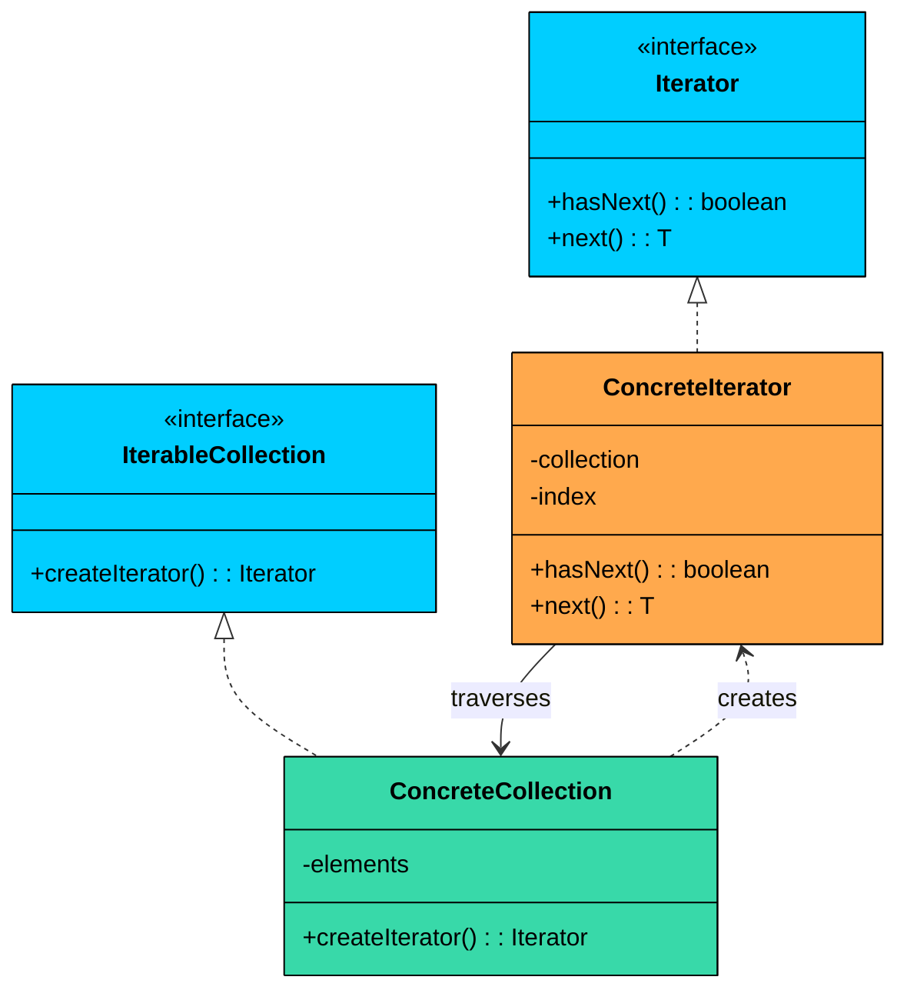
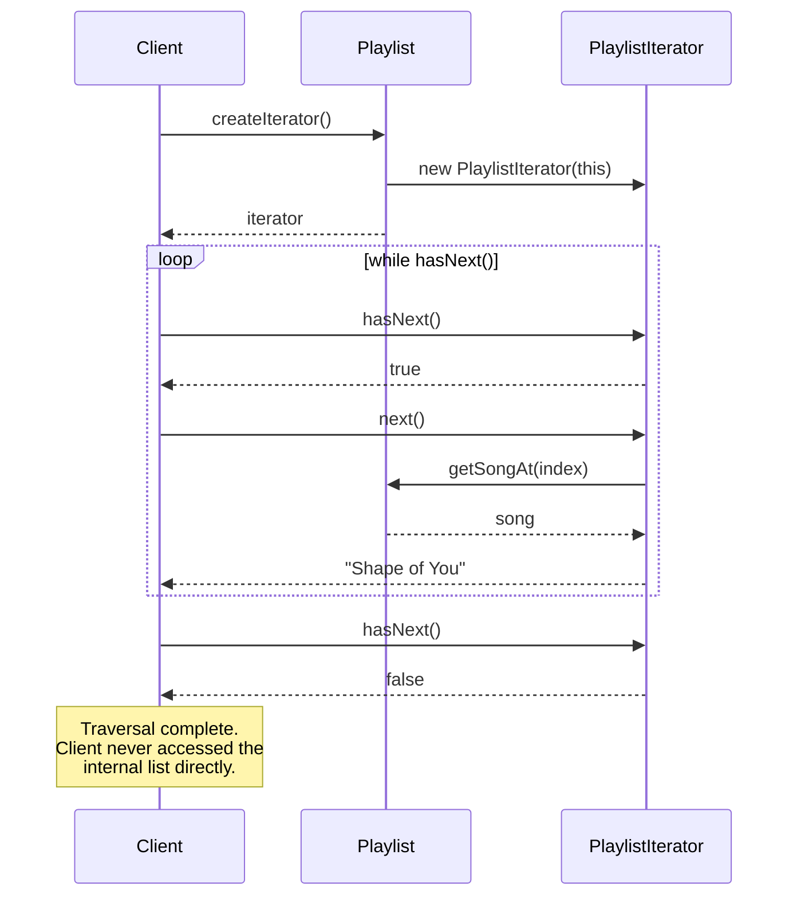
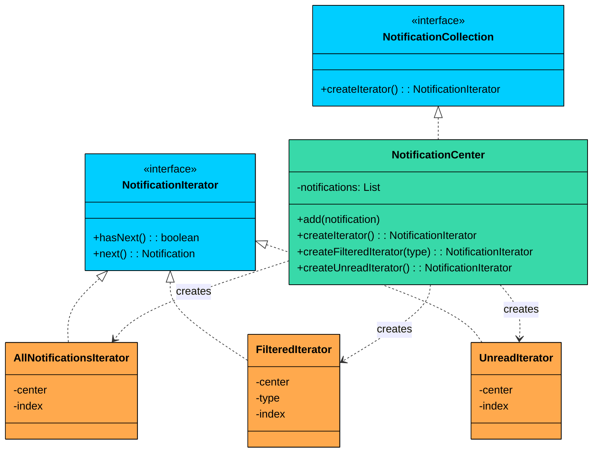

> 💡 **Key Insight:**

> **DEFINITION**
>
> The **Iterator Design Pattern** is a **behavioral pattern** that provides a standard way to **access elements of a collection sequentially without exposing its internal structure**.

At its core, the Iterator pattern is about separating the logic of how you move through a collection from the collection itself. Instead of letting clients directly access internal arrays, lists, or other data structures, the collection provides an iterator object that handles traversal.

It’s particularly useful in situations where:

- You need to **traverse a collection** (like a list, tree, or graph) in a consistent and flexible way.
- You want to support **multiple ways to iterate** (e.g., forward, backward, filtering, or skipping elements).
- You want to **decouple traversal logic from collection structure**, so the client doesn't depend on the internal representation.

Let’s walk through a real-world example to see how we can apply the Iterator Pattern to build a more maintainable, extensible, and standardized approach to traversing collections.

---

# 1. The Problem: Traversing a Playlist

Imagine you are building a **music streaming application**. Users can create playlists, add songs, and play them in various ways. A playlist might contain hundreds of songs, and the player needs to iterate through them one by one.

Your first implementation might look like this:

```java
class Playlist {
    private List<String> songs = new ArrayList<>();

    public void addSong(String song) {
        songs.add(song);
    }

    public List<String> getSongs() {
        return songs;
    }
}
```

And your music player might use it like this:

```java
class MusicPlayer {
    public void playAll(Playlist playlist) {
        for (String song : playlist.getSongs()) {
            System.out.println("Playing: " + song);
        }
    }
}
```

This looks clean enough. The player gets the list of songs and iterates through them. What could go wrong"

### Why This Becomes a Problem

As the application grows, several issues emerge:

#### 1. Breaks Encapsulation

By returning the internal list, you allow clients to do more than just read. They can add songs, remove songs, clear the list, or even replace it entirely. Nothing prevents a client from calling `playlist.getSongs().clear()` and wiping out the entire playlist.

#### 2. Tightly Couples Client to I**mplementation**

Your player assumes the playlist uses a `List`. What if you decide to change the internal structure" Perhaps you want to store songs in a database and load them lazily. Or maybe you want to use a `Set` to prevent duplicates. 

Every change to the internal structure ripples through all client code.

#### 3. Limited Traversal Options

What if you need to play songs in reverse order" Or shuffle them" Or skip songs that the user has marked as disliked" 

Each of these requires writing new loop logic in the client. The playlist has no control over how its contents are accessed.

#### 4. **Testing becomes difficult**

If your player directly accesses the list, testing the player in isolation becomes harder. You cannot easily mock or stub the playlist's behavior.

### What We Really Need

We need a way for clients to traverse the playlist that:

- Does not expose the internal data structure
- Provides a consistent interface regardless of how songs are stored
- Allows the playlist to control how iteration happens
- Supports different traversal strategies without modifying client code

This is exactly what the **Iterator Pattern** provides.

---

# 2. Understanding the Iterator Pattern

> The 
>
> **Iterator Pattern**
>
>  defines a separate object, the 
>
> **iterator**
>
> , that encapsulates the details of traversing a collection. Instead of exposing its internal structure, the collection provides an iterator that clients use to access elements sequentially.

Two characteristics define the pattern:

1. **Separation of traversal from storage.** The collection knows how to store elements. The iterator knows how to walk through them. These two concerns live in separate classes, so you can change one without affecting the other.
2. **Multiple independent traversals.** Each call to `createIterator()` returns a new, independent iterator with its own position. Multiple clients can traverse the same collection simultaneously without interfering with each other.

This separation means you can change how elements are stored without affecting how they are traversed, and vice versa.

> 💡 **Key Insight:**

> **Real-World Analogy**
>
> Consider a TV remote control. When you press the "next channel" button, you do not need to know how the TV internally organizes its channel list. Maybe it is stored as an array, a linked list, or fetched from a satellite signal. 
>
> The remote provides a simple interface: next channel, previous channel. The complexity of channel management is hidden behind that interface.
>
> The Iterator pattern works the same way. The iterator is like the remote control, providing a simple interface to move through a collection without exposing how that collection is structured internally.

---

## Class Diagram

The Iterator pattern involves four key components:



#### 1. Iterator (interface)

Declares the operations required to traverse a collection. At minimum, this includes `hasNext()` to check if more elements exist, and `next()` to retrieve the next element.

#### 2. ConcreteIterator

Implements the Iterator interface for a specific collection. It maintains the current position within the collection and knows how to move to the next element.

#### 3. IterableCollection (interface)

Declares a method for creating an iterator. Any class implementing this interface promises it can be iterated.

#### 4. ConcreteCollection

Implements the IterableCollection interface. It stores elements and returns an appropriate iterator when asked.

> 💡 **Key Insight:**

> **Why a Separate Iterator Object"**
>
> You might wonder why we need a separate iterator object. Why not just add `hasNext()` and `next()` methods directly to the collection"
>
> The answer lies in supporting multiple simultaneous traversals. If the collection itself tracks the current position, you can only have one traversal at a time. But with separate iterator objects, you can have multiple iterators traversing the same collection independently.
>
> This becomes important in multi-threaded applications or when you need to compare elements at different positions in the same collection.

---

# 3. How It Works

The Iterator workflow has five steps:



**Step 1:** The client asks the collection for an iterator by calling `createIterator()`.

**Step 2:** The collection creates a new iterator object, passing itself (or its data) to the iterator's constructor.

**Step 3:** The iterator initializes its internal position to the beginning of the collection.

**Step 4:** The client uses the iterator in a loop: call `hasNext()` to check for more elements, then `next()` to get the current element and advance.

**Step 5:** When `hasNext()` returns false, traversal is complete. The client can discard the iterator, or the collection can create a new one for another traversal.

---

# 4. Implementing the Iterator Pattern

Let us refactor our music playlist using the Iterator pattern. We will build the implementation step by step: define the interfaces, implement the collection, implement the iterator, and wire them together.

### Step 1: Define the Iterator Interface

This interface declares the standard operations for traversing any collection:

```java
interface Iterator<T> {
    boolean hasNext();
    T next();
}
```

The interface is generic (where the language supports it), allowing it to work with any element type. Two methods are sufficient for basic iteration: 

- `hasNext()` returns true if there are more elements to iterate
- `next()` returns the current element and advances to the next position

> 💡 **Key Insight:**

> **NOTE**
>
> Some iterator interfaces include additional methods like `remove()`, `reset()`, or `current()`. We are keeping it minimal here. You can always extend the interface based on your needs, but starting simple reduces complexity.

### Step 2: Define the IterableCollection Interface

This interface ensures that any collection can provide an iterator:

```java
interface IterableCollection<T> {
    Iterator<T> createIterator();
}
```

Any class implementing this interface promises to provide an iterator for traversing its elements.

### Step 3: Implement the Concrete Collection

Now we implement the Playlist class. Notice that it no longer exposes its internal list. Instead, it provides controlled access methods that the iterator will use:

```java
class Playlist implements IterableCollection<String> {
    private final List<String> songs = new ArrayList<>();

    public void addSong(String song) {
        songs.add(song);
    }

    public String getSongAt(int index) {
        return songs.get(index);
    }

    public int getSize() {
        return songs.size();
    }

    @Override
    public Iterator<String> createIterator() {
        return new PlaylistIterator(this);
    }
}
```

The key change: `getSongs()` is gone. Clients cannot get the raw list anymore. Instead, `getSongAt()` and `getSize()` provide the minimum access the iterator needs, while keeping the internal structure private.

### Step 4: Implement the Concrete Iterator

The iterator maintains its position and knows how to traverse the playlist:

```java
class PlaylistIterator implements Iterator<String> {
    private final Playlist playlist;
    private int index = 0;

    public PlaylistIterator(Playlist playlist) {
        this.playlist = playlist;
    }

    @Override
    public boolean hasNext() {
        return index < playlist.getSize();
    }

    @Override
    public String next() {
        return playlist.getSongAt(index++);
    }
}
```

The iterator is simple by design. It holds a reference to the playlist and an index that starts at zero. Each call to `next()` returns the current song and advances the index. Each call to `hasNext()` checks whether the index has reached the end.

### Step 5: Using the Iterator (Client Code)

The client can now iterate through a playlist without knowing how it's implemented internally.

```java
public class MusicPlayer {
    public static void main(String[] args) {
        Playlist playlist = new Playlist();
        playlist.addSong("Shape of You");
        playlist.addSong("Bohemian Rhapsody");
        playlist.addSong("Blinding Lights");

        Iterator<String> iterator = playlist.createIterator();

        System.out.println("Now Playing:");
        while (iterator.hasNext()) {
            System.out.println(" 🎵 " + iterator.next());
        }
    }
}
```

#### Expected Output:

```shell
Now Playing:
🎵 Shape of You
🎵 Bohemian Rhapsody
🎵 Blinding Lights
```

The client code is clean and focused. It does not know or care whether the playlist uses an ArrayList, LinkedList, or any other structure internally.

### What We Gained

Let us evaluate what the Iterator Pattern has given us:

#### **Encapsulation is preserved**

The internal list is no longer exposed. Clients cannot accidentally (or intentionally) modify the playlist's contents through the iterator. The playlist maintains full control over its data.

#### **Implementation independence**

The client code works with the Iterator interface. If we later change the playlist to use a LinkedList, a database, or a streaming buffer, the client code remains unchanged. We only need to update the iterator implementation.

#### **Single Responsibility Principle**

The Playlist class focuses on managing songs. The PlaylistIterator class focuses on traversal logic. Each class has one reason to change.

#### **Multiple simultaneous traversals**

Each call to `createIterator()` returns a new, independent iterator. Multiple parts of your application can traverse the same playlist simultaneously without interfering with each other.

#### **Foundation for extensions**

We can now easily add new types of iterators (reverse, shuffled, filtered) without modifying the Playlist class or existing client code.

---

# 5. Extending the Design

One of the most powerful aspects of the Iterator pattern is how easily you can add new traversal behaviors without modifying the collection or client code.

Suppose tomorrow the product team wants two new features: play songs in reverse order, and play songs in a random shuffle. Without the Iterator pattern, you would add methods like `playReverse()` and `playShuffle()` to the player, each with its own loop logic. With the pattern, you just create new iterator classes.

### ReversePlaylistIterator

```java
class ReversePlaylistIterator implements Iterator<String> {
    private final Playlist playlist;
    private int index;

    public ReversePlaylistIterator(Playlist playlist) {
        this.playlist = playlist;
        this.index = playlist.getSize() - 1;
    }

    @Override
    public boolean hasNext() {
        return index >= 0;
    }

    @Override
    public String next() {
        return playlist.getSongAt(index--);
    }
}
```

### ShufflePlaylistIterator

```java
class ShufflePlaylistIterator implements Iterator<String> {
    private final Playlist playlist;
    private final List<Integer> shuffledIndices;
    private int position = 0;

    public ShufflePlaylistIterator(Playlist playlist) {
        this.playlist = playlist;
        this.shuffledIndices = new ArrayList<>();
        for (int i = 0; i < playlist.getSize(); i++) {
            shuffledIndices.add(i);
        }
        Collections.shuffle(shuffledIndices);
    }

    @Override
    public boolean hasNext() {
        return position < shuffledIndices.size();
    }

    @Override
    public String next() {
        int index = shuffledIndices.get(position++);
        return playlist.getSongAt(index);
    }
}
```

---

# 6. Practical Example: Notification System

Let us work through a second example to reinforce the pattern in a different domain. We are building a notification system where a `NotificationCenter` stores notifications of different types: email, SMS, and push. We need iterators that can traverse all notifications, filter by type, and show only unread notifications.



This is where the pattern really shines: three different ways to traverse the same collection, all behind the same interface. The client code is identical for each traversal mode, only the iterator creation changes.

```java
$b8
```

The important thing to notice: the client loop is identical for all three iterators. `while (hasNext()) { next() }`. The filtering, skipping, and type-checking logic lives entirely inside the iterator classes. Adding a new traversal mode (say, "only push notifications from the last hour") means creating one new iterator class. The `NotificationCenter` and existing iterators remain unchanged.
