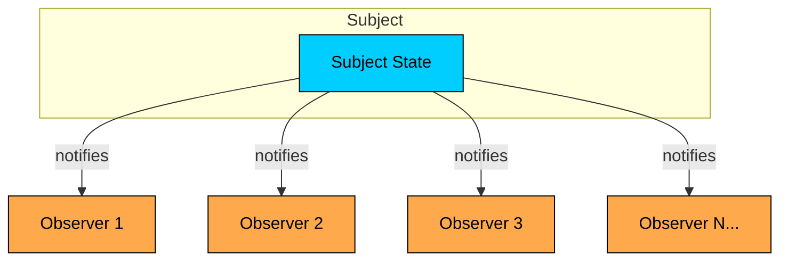
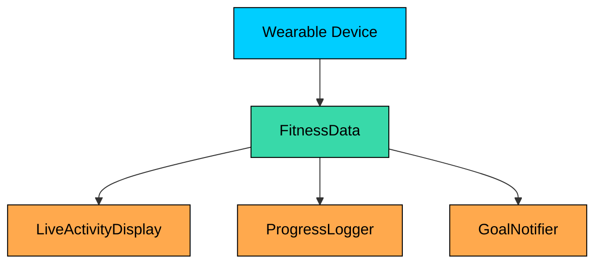
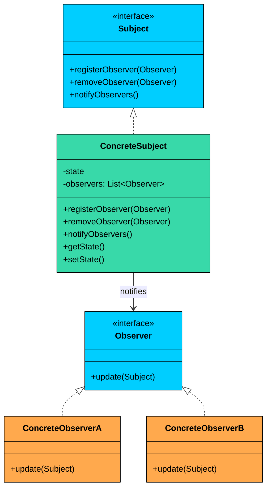
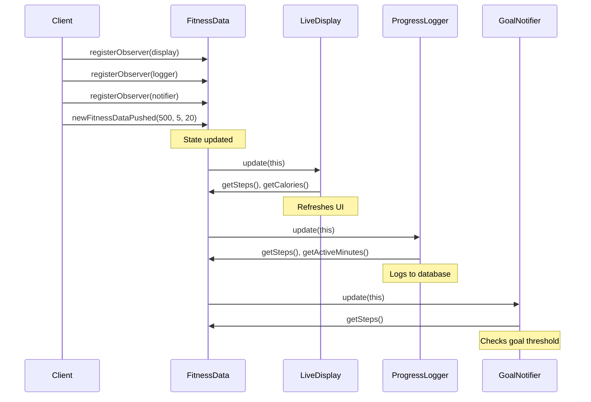
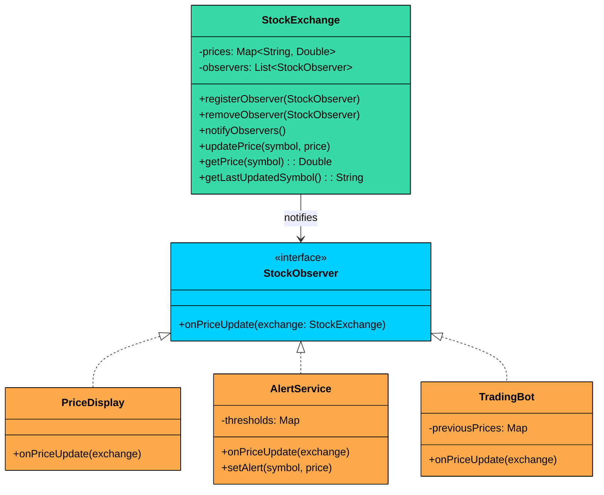

> 💡 **Key Insight:**

> **DEFINITION**
>
> The **Observer Design Pattern** is a **behavioral pattern** that defines a **one-to-many dependency** between objects  so that when one object (the subject) changes its state, **all its dependents (observers) are automatically notified and updated**.

This pattern shines in scenarios where:

- You have multiple parts of the system that need to react to a change in one central component.
- You want to decouple the publisher of data from the subscribers who react to it.
- You need a dynamic, event-driven communication model without hardcoding who is listening to whom.

Let’s walk through a real-world example to see how we can apply the Observer Pattern to build a flexible, extensible, and loosely coupled notification system.

---

# 1. The Problem: Broadcasting Fitness Data

Imagine you are building a **Fitness Tracker App** that connects to a wearable device. The device continuously streams real-time fitness data: steps taken, active minutes, and calories burned. This data flows into a central `FitnessData` object.

Now, multiple modules within your app need to react to these updates:



| Module | Responsibility |
|--------|----------------|
| **LiveActivityDisplay** | Shows real-time stats on the dashboard |
| **ProgressLogger** | Persists data to a database for trend analysis |
| **GoalNotifier** | Sends alerts when the user hits milestones |

### The Naive Approach

In a straightforward implementation, `FitnessData` directly holds and manages references to all dependent modules. It knows about each one, creates them, and calls their specific methods whenever data changes.

### FitnessDataNaive

```java
$b8
```

#### FitnessAppNaiveClient

Here is how the client uses the naive approach:

```java
public class FitnessAppNaiveClient {
    public static void main(String[] args) {
        FitnessDataNaive fitnessData = new FitnessDataNaive();

        fitnessData.newFitnessDataPushed(500, 5, 20);
        fitnessData.newFitnessDataPushed(9800, 85, 350);
        fitnessData.newFitnessDataPushed(10100, 90, 380);
        fitnessData.dailyReset();
    }
}
```

This works initially, but let us think about what happens as the application grows.

### Problems with This Approach

#### 1. Tight Coupling

`FitnessData` holds direct references to `LiveActivityDisplay`, `ProgressLogger`, and `NotificationService`. It knows their concrete types, their method signatures, and their construction logic.

If any of these classes change their interface, or if you want to replace one with a different implementation, you must modify `FitnessData`.

#### 2. Violates the Open/Closed Principle

What happens when you want to add a `WeeklySummaryGenerator`" Or a `SocialSharingService` that posts achievements to social media" 

Each new feature requires you to:

- Add a new field to `FitnessData`
- Modify the `newFitnessDataPushed()` method
- Potentially update the constructor

The class is open for modification when it should be closed.

#### 3. Inflexible and Static Design

Modules like the `NotificationService` or `ProgressLogger` can’t be **added or removed at runtime**. What if the user disables notifications in their settings"

You will need to add conditionals to manually enable/disable parts of the code, making things fragile and error-prone.

#### 4. Responsibility Bloat

`FitnessData` should have one job: managing fitness metrics. Instead, it is now responsible for UI updates, database logging, and notification logic. This violates the Single Responsibility Principle and makes the class difficult to test in isolation.

#### 5. Scalability Bottlenecks

As the number of dependents grows, `newFitnessDataPushed()` becomes a lengthy sequence of method calls, each with different parameters and error handling requirements. Every developer who adds a feature must understand and modify this method.

### What We Really Need

We need a better, scalable way to solve this problem,  something that allows:

- `FitnessData` to **broadcast changes to multiple listeners**, without knowing who they are
- Each module to **subscribe or unsubscribe dynamically**
- Loose coupling between the subject and observers
- Each module to **decide for itself how to respond** to changes

This is exactly what the **Observer pattern** provides.

---

# 2. Understanding the Observer Pattern

> The 
>
> **Observer Design Pattern**
>
>  provides a clean and flexible solution to the problem of broadcasting changes from one central object (the 
>
> **Subject**
>
> ) to many dependent objects (the 
>
> **Observers**
>
> ) all while keeping them 
>
> **loosely coupled**
>
> .

Two characteristics define the pattern:

1. **One-to-many notification.** A single subject can have any number of observers. When the subject's state changes, it iterates through its list of observers and calls an update method on each one. The subject does not know what the observers do with the information. It just sends the signal.
2. **Loose coupling between subject and observers.** The subject depends only on the observer interface, not on any concrete observer class. Observers can be added, removed, or replaced at runtime without modifying the subject. This means the subject and observers can vary independently.

> 💡 **Key Insight:**

> **Real-World Analogy**
>
> Think about a newspaper subscription. You subscribe to a newspaper publisher. Every morning, the publisher prints the paper and delivers a copy to every subscriber on its list. The publisher does not know whether you read the sports section, clip coupons, or just check the headlines. It does not care. It delivers the paper, and each subscriber decides what to do with it. 
>
> When you cancel your subscription, the deliveries stop. When a new neighbor subscribes, they start getting the paper. The publisher's printing logic never changes. 
>
> The Observer pattern works the same way: the subject (publisher) broadcasts updates, and observers (subscribers) react however they choose.

---

## Class Diagram



#### 1. Subject Interface

Declares the interface for managing observers, registering, removing, and notifying them. Defines `registerObserver()`, `removeObserver()`, and `notifyObservers()` methods.

The subject holds a list of observers typed to the Observer interface, not to concrete classes. This means any class that implements the Observer interface can register, and the subject never needs to know what it is.

#### 2. Observer Interface

Declares the `update()` method that the subject calls when its state changes. All modules that want to **listen to fitness data changes** will implement this interface.

#### 3. ConcreteSubject (e.g., `FitnessData`)

Implements the Subject interface. Holds the actual state and notifies observers when that state changes.

Maintain a list of registered observers and calls `notifyObservers()` whenever its state changes.

#### 4. ConcreteObservers (e.g., `LiveActivityDisplay`)

Implements the Observer interface. Defines what happens when the subject's state changes. When `update()` is called, each observer **pulls relevant data** from the subject and performs its own logic (e.g., update UI, log progress, send alerts).

---

# 3. How It Works

The Observer workflow follows these steps:



**Step 1:** The client creates a concrete subject and one or more concrete observers.

**Step 2:** Each observer registers itself with the subject by calling `registerObserver()`.

**Step 3:** The subject adds the observer to its internal list.

**Step 4:** When the subject's state changes, it calls `notifyObservers()`, which iterates through the list and calls `update()` on each observer.

**Step 5:** Each observer receives the notification and pulls the data it needs from the subject via getter methods.

**Step 6:** To stop receiving updates, an observer calls `removeObserver()`. The subject removes it from the list. Future notifications skip this observer.

---

# 4. Implementing Observer Pattern

Let us refactor the fitness tracker using the Observer pattern, step by step.

### Step 1: Define the Observer Interface

```java
interface FitnessDataObserver {
    void update(FitnessData data);
}
```

Each observer receives a reference to the subject and can pull whatever data it needs. This keeps the interface stable even as `FitnessData` gains new fields.

### Step 2: Define the Subject Interface

The subject interface provides methods for managing observers: registering, removing, and notifying them.

```java
interface FitnessDataSubject {
    void registerObserver(FitnessDataObserver observer);
    void removeObserver(FitnessDataObserver observer);
    void notifyObservers();
}
```

### Step 3: Implement the ConcreteSubject

`FitnessData` implements the subject interface. It manages the observer list and calls `notifyObservers()` automatically whenever new data arrives.

```java
$bf
```

Notice that `FitnessData` no longer imports, creates, or references any concrete observer. It just maintains a list of `FitnessDataObserver` references and iterates through them. The class has gone from knowing about three specific modules to knowing about zero.

### Step 4: Implement Concrete Observers

Each observer implements `FitnessDataObserver` and defines its own `update()` logic.

#### **LiveActivityDisplay**

```java
class LiveActivityDisplay implements FitnessDataObserver {
    @Override
    public void update(FitnessData data) {
        System.out.println("Live Display → Steps: " + data.getSteps() +
            " | Active Minutes: " + data.getActiveMinutes() +
            " | Calories: " + data.getCalories());
    }
}
```

#### **ProgressLogger**

```java
class ProgressLogger implements FitnessDataObserver {
    @Override
    public void update(FitnessData data) {
        System.out.println("Logger → Saving to DB: Steps=" + data.getSteps() +
            ", ActiveMinutes=" + data.getActiveMinutes() +
            ", Calories=" + data.getCalories());
        // Simulated DB/file write...
    }
}
```

#### **GoalNotifier**

```java
class GoalNotifier implements FitnessDataObserver {
    private final int stepGoal = 10000;
    private boolean goalReached = false;

    @Override
    public void update(FitnessData data) {
        if (data.getSteps() >= stepGoal && !goalReached) {
            System.out.println("Notifier → 🎉 Goal Reached! You've hit " + stepGoal + " steps!");
            goalReached = true;
        }
    }

    public void reset() {
        goalReached = false;
    }
}
```

### Step 5: Client Code

Now we wire everything together. The client creates the subject and observers, registers the observers, and simulates fitness updates.

```java
public class FitnessAppObserverDemo {
    public static void main(String[] args) {
        FitnessData fitnessData = new FitnessData();

        LiveActivityDisplay display = new LiveActivityDisplay();
        ProgressLogger logger = new ProgressLogger();
        GoalNotifier notifier = new GoalNotifier();

        // Register observers
        fitnessData.registerObserver(display);
        fitnessData.registerObserver(logger);
        fitnessData.registerObserver(notifier);

        // Simulate updates
        fitnessData.newFitnessDataPushed(500, 5, 20);
        fitnessData.newFitnessDataPushed(9800, 85, 350);
        fitnessData.newFitnessDataPushed(10100, 90, 380);

        // Remove logger and reset notifier
        fitnessData.removeObserver(logger);
        notifier.reset();
        fitnessData.dailyReset();
    }
}
```

Compare this with the naive approach. `FitnessData` no longer creates or holds references to any specific module. Observers register themselves, receive updates through a common interface, and can be added or removed at any time. The daily reset notification reaches only the currently registered observers, so removing the logger means it stops getting updates immediately.

### What We Achieved

- **Loose coupling.** `FitnessData` does not know who is listening. It just broadcasts to a list of interfaces.
- **Open/Closed compliance.** Adding a new module (like `WeeklySummaryGenerator`) only requires implementing `FitnessDataObserver` and calling `registerObserver()`. Zero changes to `FitnessData`.
- **Runtime flexibility.** Observers can be added or removed dynamically based on user settings, feature flags, or application state.
- **Clean separation of concerns.** Each observer handles its own logic. `FitnessData` manages fitness metrics and nothing else.
- **Independent testability.** Each observer can be unit tested by creating a mock `FitnessData` and calling `update()` directly.

---

# 5. Evolving the System: Adding a Weekly Summary Generator

The real test of any design pattern is what happens when requirements change. The product team wants a new feature: a weekly summary generator that accumulates fitness data throughout the week and produces a summary report every Sunday.

With the Observer pattern, we do not touch `FitnessData` at all. We just create a new observer and register it.

```java
$c5
```

To use it, just register it:

```java
WeeklySummaryGenerator summary = new WeeklySummaryGenerator();
fitnessData.registerObserver(summary);

// ... after a week of updates ...
summary.generateReport();
summary.reset();
```

The key point: we added a completely new feature to the fitness tracker without modifying a single line in `FitnessData`, `LiveActivityDisplay`, `ProgressLogger`, or `GoalNotifier`. This is the Open/Closed Principle in action.

---

# 6. Practical Example: Stock Price Ticker

Let us work through a second example to reinforce the pattern. This time, we are building a stock price notification system. A `StockExchange` subject publishes price updates for stocks.

Multiple observers react to these updates: a `PriceDisplay` shows current prices, an `AlertService` notifies traders when prices cross thresholds, and a `TradingBot` executes trades based on price movements.



### Implementation

```java
$cb
```

The same pattern, different domain. `StockExchange` has no idea whether it is feeding a display, an alert system, or a trading bot. It just calls `onPriceUpdate()` on whatever observers are registered.

Adding a new consumer, say a `PortfolioTracker` that recalculates portfolio value on every price change, means creating one new class that implements `StockObserver`. Nothing else changes.
