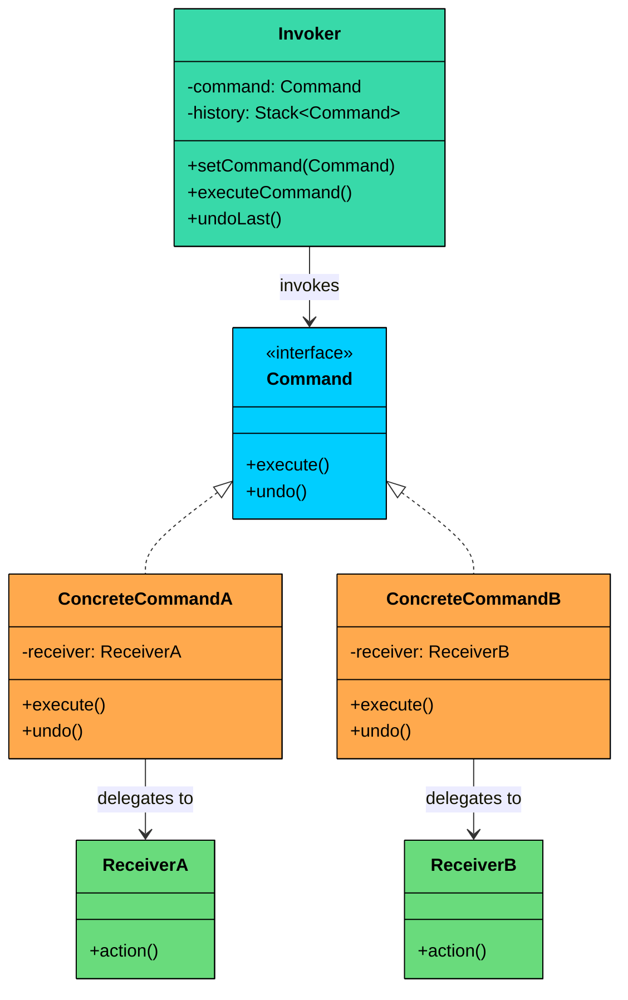
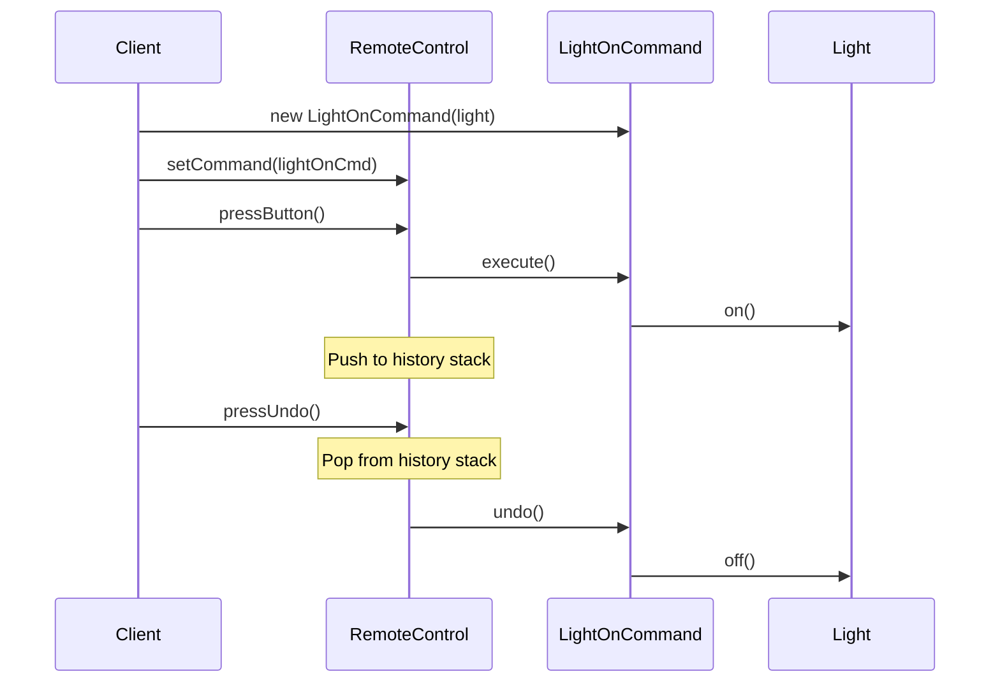
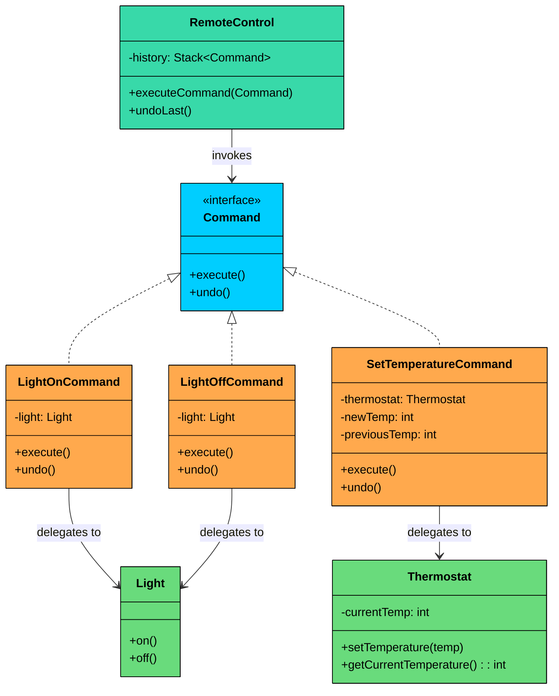
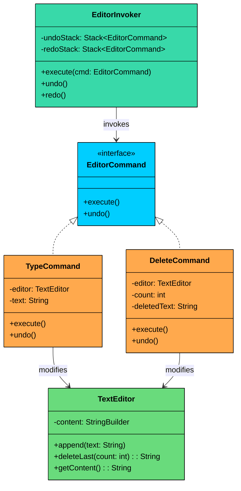

> 💡 **Key Insight:**

> **DEFINITION**
>
> The **Command Design Pattern** is a **behavioral pattern** that turns a request into a **standalone object**, allowing you to **parameterize actions**, queue them, log them, or support undoable operations all while decoupling the sender from the receiver.

It’s particularly useful in situations where:

- You want to **encapsulate operations** as objects.
- You need to **queue, delay, or log requests**.
- You want to **support undo/redo functionality**.
- You want to **decouple the object that invokes an operation from the one that knows how to perform it**.

Let’s walk through a real-world example to see how we can apply the Command Pattern to decouple invokers from executors, and build a more flexible, extensible, and testable command execution framework.

---

# 1. The Problem: The Tightly Coupled Smart Home Controller

Imagine you are building a smart home hub. The hub needs to control various devices: lights, thermostats, and more. You need a controller that can send commands to these devices.

### Naive Implementation: One Controller to Rule Them All

The straightforward approach is to give the controller direct references to every device and write a specific method for each action. Let's see what this looks like.

```java
$a5
```

### Why This Design Fails as the System Grows"

This simple controller **works for now**, but quickly falls apart as complexity increases.

#### 1. Tight Coupling

The `SmartHomeControllerNaive` is directly tied to every device and their specific method names. You cannot reuse or generalize actions. Every new device requires adding new fields and new methods to the controller.

#### 2. Poor Scalability

Adding a new device (sprinkler, garage door, speaker) means adding new fields to the controller, writing more methods for each action, and growing a single class into a bloated monolith. The controller knows about every device in the house.

#### 3. No Undo/Redo Support

There is no way to reverse a command. Want to implement "undo last action"" You would need to track device states manually, write custom undo logic for every method, and add a large switch/if-else block to figure out what action to reverse. Fragile, repetitive, and error-prone.

#### 4. No Scheduling or Queuing

If a user wants to set a rule like "turn on the lights at 7 PM," you cannot queue up what to do because actions are hardcoded into method calls, not represented as standalone objects you can store and execute later.

#### 5. No Reusable Actions

If the same "turn on light" action needs to be triggered from a physical button, a voice assistant, a mobile app, and a timer, each trigger point needs its own coupling to the Light class. The action cannot be passed around as a first-class object.

### What We Really Need

We need to treat each command ("turn on light", "set thermostat to 22C") as a standalone object that encapsulates what to do, which device it affects, how to execute it, and how to undo it. The controller, remote, or scheduler should not care how a command works. It should just know which command to execute.

This is exactly what the **Command Design Pattern** enables.

---

# 2. What is the Command Pattern

The Command pattern is a behavioral design pattern that turns a request into a standalone object containing all the information needed to perform that request. This lets you parameterize methods with different requests, delay or queue a request's execution, and support undoable operations.

Two characteristics define the pattern:

1. **Encapsulation of requests as objects.** Each action (turn on light, set temperature, play music) becomes its own object implementing a common interface. The object holds a reference to the receiver and knows exactly how to execute (and optionally undo) the action.
2. **Decoupling of invoker and receiver.** The invoker (a button, scheduler, or voice assistant) does not know which receiver it is talking to or what the action does. It simply holds a Command reference and calls `execute()`. This means the same invoker can trigger any command without modification.

> 💡 **Key Insight:**

> **Real-World Analogy**
>
> Think about ordering at a restaurant. You tell the waiter what you want (your request), and the waiter writes it on an order slip. The waiter does not cook the food. They carry the slip to the kitchen and hand it to the chef. The chef reads the slip and prepares the dish. 
>
> The order slip is the command object. The waiter is the invoker, carrying and delivering the request. The chef is the receiver, doing the actual work. The customer is the client, creating the request. 
>
> The waiter does not need to know how to cook, and the chef does not need to know who ordered. The slip decouples them completely. If you want to cancel, the waiter pulls the slip from the queue, the same slip that started the process can undo it.

---

### Class Diagram



#### Command (Interface)

Declares the common interface that all commands must implement. At minimum, this is an `execute()` method. Most practical implementations also include an `undo()` method.

> 💡 **Key Insight:**

> **Should undo() be part of the interface"**
>
> If every command in your system needs to be reversible, yes. If only some do, consider a separate `UndoableCommand` interface or a no-op default implementation. For this chapter, we include `undo()` in the base interface because undo is one of Command's primary strengths.

#### ConcreteCommand (e.g., `LightOnCommand`, `SetTemperatureCommand`)

Implements the Command interface and bridges the gap between the invoker and a specific receiver.

Stores a reference to the receiver that will perform the actual work. Implement `execute()` by delegating to the receiver's method(s).

#### Receiver (e.g., `Light`, `Thermostat`)

The object that performs the actual business logic. It knows how to carry out the operation but has no knowledge of commands or the invoker. The receiver does not depend on the command infrastructure at all. It is a plain domain object.

#### Invoker (e.g., `RemoteControl`, `Scheduler`)

Triggers command execution. It does not know what the command does or which receiver is involved. It only knows how to call `execute()` and optionally maintain a command history for undo.

---

# 3. How It Works

Here is the Command workflow step by step:



#### **Step 1: Client creates receivers and commands**

The client instantiates the receiver objects (Light, Thermostat) and creates concrete command objects, passing each command a reference to the appropriate receiver.

#### **Step 2: Client configures the invoker**

The client assigns command objects to the invoker (e.g., assigning a command to a button slot on a remote control).

#### **Step 3: User triggers the invoker**

When the user presses a button, the invoker calls `execute()` on the assigned command. The invoker does not know what will happen, it just calls the interface method.

#### **Step 4: Command delegates to the receiver**

The concrete command's `execute()` method calls the appropriate method on the receiver. If undo is needed, the command first captures the receiver's current state.

#### **Step 5: Invoker records the command in history**

After successful execution, the invoker pushes the command onto a history stack for potential undo.

#### **Step 6: User triggers undo**

The invoker pops the most recent command from the history stack and calls its `undo()` method. The command reverses its effect on the receiver.

---

# 4. Implementing Command Pattern

Let’s refactor our Smart Home Controller to use the **Command Pattern** with support for **undoable actions**. We'll encapsulate each action as a command, decouple the invoker from the logic, and allow undoing previous actions.



### Step 1: Define the Command Interface

All commands must implement `execute()` and `undo()`.

```java
interface Command {
    void execute();
    void undo();
}
```

### Step 2: Define the Receivers

These are the actual smart home devices that perform the work. They have no knowledge of commands or the invoker.

```java
class Light {
    public void on() {
        System.out.println("Light turned ON");
    }

    public void off() {
        System.out.println("Light turned OFF");
    }
}

class Thermostat {
    private int currentTemperature = 20;

    public void setTemperature(int temp) {
        System.out.println("Thermostat set to " + temp + "C");
        currentTemperature = temp;
    }

    public int getCurrentTemperature() {
        return currentTemperature;
    }
}
```

### Step 3: Implement Concrete Commands

Each command wraps a specific receiver action. For simple on/off commands, undo calls the inverse method. For commands that change state (like temperature), the command saves the previous state before executing so it can restore it during undo.

```java
$ab
```

Notice the key difference between `LightOnCommand` and `SetTemperatureCommand`. The light commands have a trivial undo: just call the opposite method. The temperature command needs to save the previous temperature before changing it, because there is no single "reverse" of setting a temperature, you need to know what it was before.

### Step 4: Create the Invoker with Undo Support

The `RemoteControl` is the invoker. It accepts any command, executes it, and maintains a history stack for undo. It never knows what the commands do or which devices they affect.

```java
import java.util.Stack;

class RemoteControl {
    private final Stack<Command> history = new Stack<>();

    public void executeCommand(Command command) {
        command.execute();
        history.push(command);
    }

    public void undoLast() {
        if (!history.isEmpty()) {
            Command lastCommand = history.pop();
            lastCommand.undo();
        } else {
            System.out.println("Nothing to undo.");
        }
    }
}
```

The `RemoteControl` is clean and focused. It does not import Light, Thermostat, or any device class. It only depends on the Command interface. Adding a hundred new device types does not require changing a single line in this class.

### Step 5: Client Code

The client wires everything together: creates receivers, wraps them in commands, and hands the commands to the invoker.

```java
public class SmartHomeApp {
    public static void main(String[] args) {
        Light light = new Light();
        Thermostat thermostat = new Thermostat();

        Command lightOn = new LightOnCommand(light);
        Command lightOff = new LightOffCommand(light);
        Command setTemp = new SetTemperatureCommand(thermostat, 25);

        RemoteControl remote = new RemoteControl();

        System.out.println("--- Executing Commands ---");
        remote.executeCommand(lightOn);
        remote.executeCommand(setTemp);
        remote.executeCommand(lightOff);

        System.out.println("\n--- Undoing Commands ---");
        remote.undoLast();
        remote.undoLast();
        remote.undoLast();
        remote.undoLast();
    }
}
```

#### Expected Output:

```shell
--- Executing Commands ---
Light turned ON
Thermostat set to 25C
Light turned OFF

--- Undoing Commands ---
Light turned ON
Thermostat set to 20C
Light turned OFF
Nothing to undo.
```

The undo sequence reverses the commands in the exact opposite order. The light comes back on (undoing the off), the thermostat returns to 20C (its original value, saved before executing), and the light turns off (undoing the original on). The fourth undo correctly reports that there is nothing left to undo.

### What We Achieved

Lets compare this with the naive approach:

| Aspect | Naive Controller | Command Pattern |
|--------|-----------------|-----------------|
| Coupling | Controller directly references every device class | Controller only knows the Command interface |
| Adding devices | New fields, new methods in controller | New command class, zero changes to controller |
| Undo support | Would require custom reverse logic per method | Built-in, each command handles its own undo |
| Queuing/scheduling | Not possible, actions are method calls | Commands are objects, store them in any data structure |
| Reuse | Each trigger point needs device-specific code | Same command object works from any invoker |

---

# 5. Practical Example: Text Editor with Undo/Redo

Let's apply the Command pattern to a different domain: a text editor. This reinforces the concept and shows how Command handles a richer state-tracking scenario.

The editor supports typing text and deleting the last N characters. Both operations are undoable. We use a two-stack approach for full undo/redo.

### Class Diagram



### Implementation

```java
$af
```

A few things to notice. First, redo works correctly: after undoing " World" and "!", redoing brings back " World" by re-executing the same TypeCommand. Second, performing a new operation (delete) after undoing clears the redo stack, which is why "Nothing to redo" appears. This is standard undo/redo behavior, a new action creates a new timeline.

Third, the DeleteCommand saves the deleted text during execute so it can restore it during undo. This is the same "save state before modifying" pattern we saw with SetTemperatureCommand.
