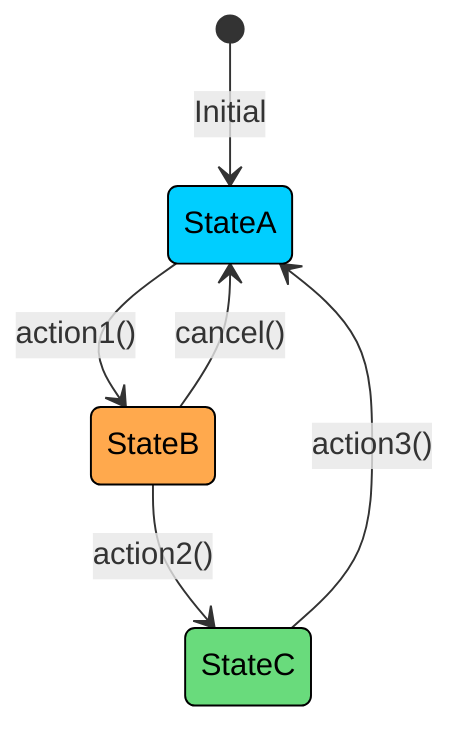
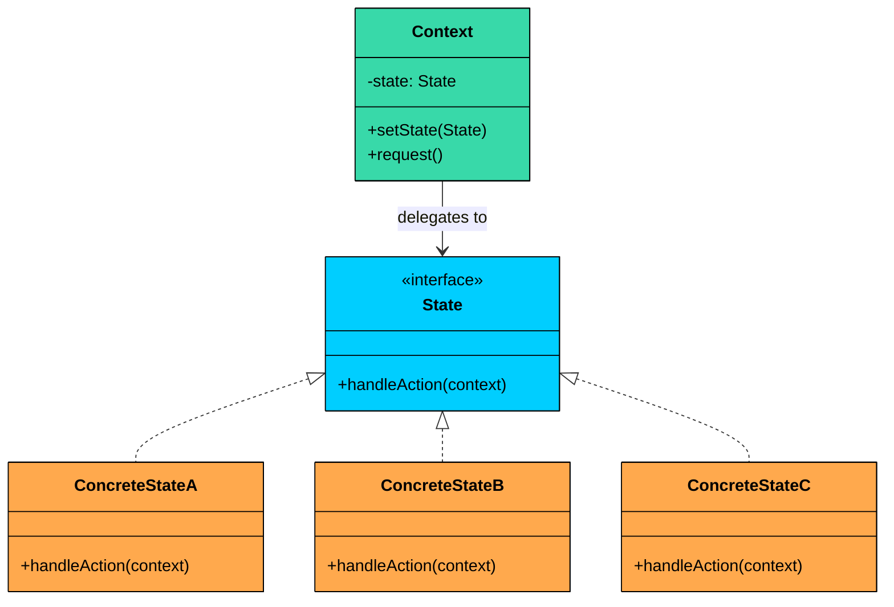
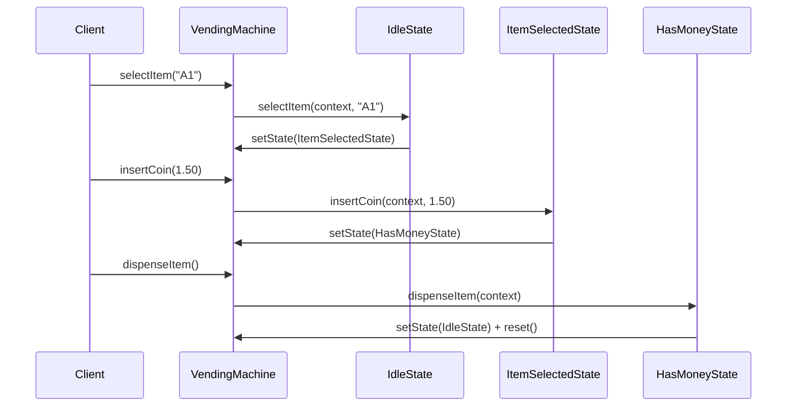
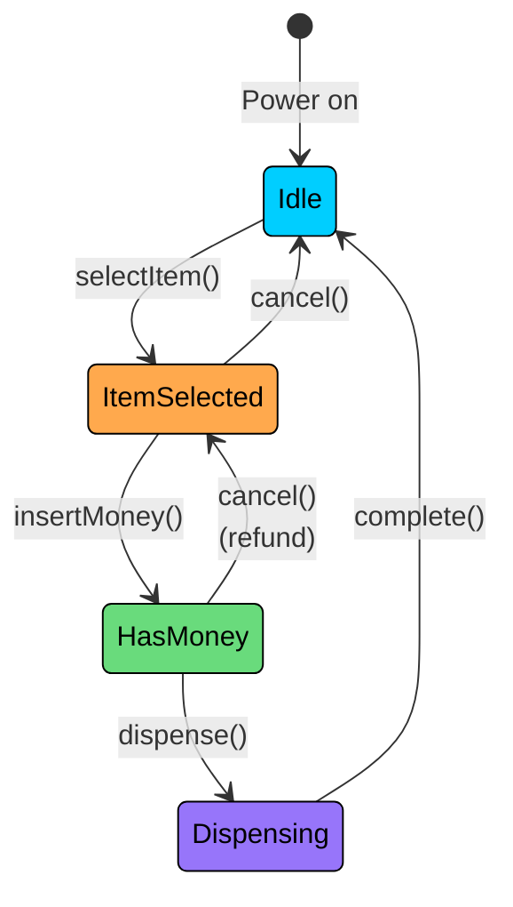
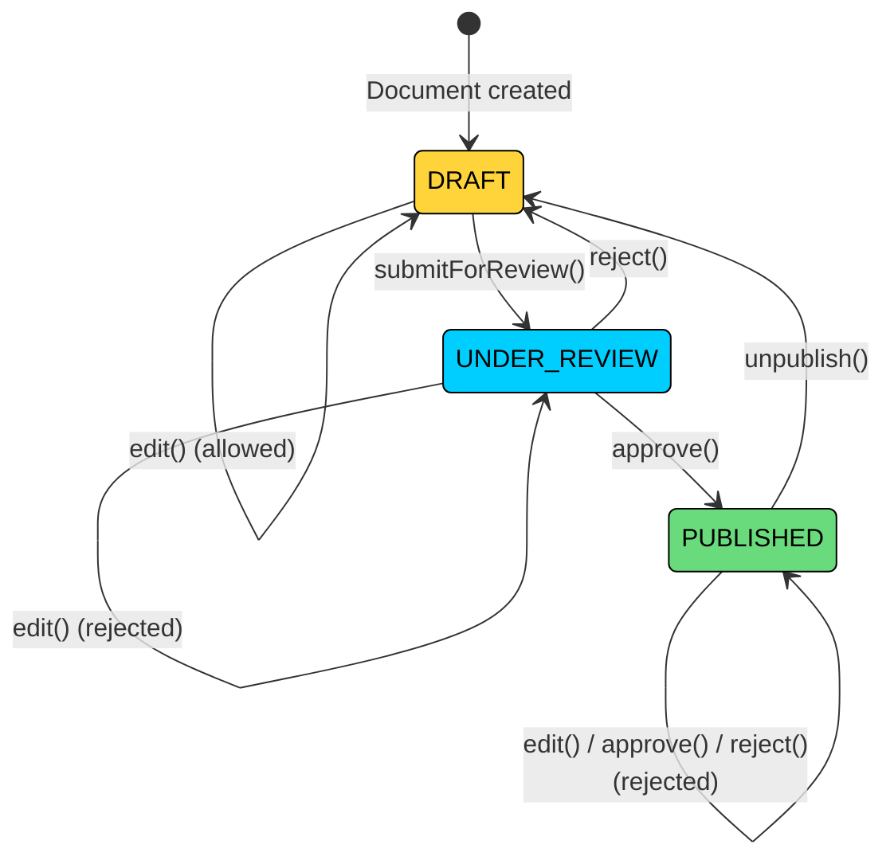

> 💡 **Key Insight:**

> **DEFINITION**
>
> The **State Design Pattern** is a **behavioral design pattern** that lets an object **change its behavior when its internal state changes**, as if it were switching to a different class at runtime.

It’s particularly useful in situations where:

- An object can be in one of **many distinct states**, each with different behavior.
- The object’s behavior depends on **current context**, and that context **changes over time**.
- You want to avoid large, monolithic `if-else` or `switch` statements that check for every possible state.

Let’s walk through a real-world example to see how we can apply the State Pattern to manage dynamic behavior in a clean, scalable, and object-oriented way.

---

# 

# 1. The Problem: Managing Vending Machine States

Imagine you're building a simple [**vending machine system**](https://en.wikipedia.org/wiki/Vending_machine). On the surface, it seems straightforward: accept money, dispense products, and go back to idle.

<!-- Simulation: vending-machine -->

But the tricky part is that the machine’s behavior must change depending on what’s happening right now. A vending machine can be in only one state at a time, for example:

- **IdleState:** Waiting for user input (nothing selected, no money inserted).
- **ItemSelectedState:** An item has been selected, waiting for payment.
- **HasMoneyState:** Money has been inserted, waiting to dispense the selected item.
- **DispensingState:** The machine is actively dispensing the item.

The machine supports a few user-facing operations:

- `selectItem(String itemCode)` – Select an item to purchase
- `insertCoin(double amount)` – Insert payment for the selected item
- `dispenseItem()` – Trigger the item dispensing process

Each of these methods should behave differently based on the machine's current state.

For example, calling `dispenseItem()` while the machine is in `IdleState` should do nothing or show an error. Calling `insertCoin()` before selecting an item should be disallowed. Calling `selectItem()` during `DispensingState` should be ignored until the item is dispensed.

---

### The Naive Approach

A common but flawed approach is to manage state transitions manually inside a monolithic `VendingMachine` class using `if-else` or `switch` statements.

```java
$a2
```

### What's Wrong with This Approach"

While using an `enum` with `switch` statements can work for small, predictable systems, this approach **doesn't scale well**.

#### 1. Cluttered Code

All state-related logic is stuffed into a single class (`VendingMachine`), resulting in large and repetitive `switch` or `if-else` blocks across every method. This leads to code that is hard to read and reason about, duplicate checks for state across multiple methods, and fragile logic when multiple developers touch the same file.

#### 2. Hard to Extend

Suppose you want to introduce new states like `OutOfStockState` (when the selected item is sold out) or `MaintenanceState` (when the machine is undergoing service). To support these, you would need to update every switch block in every method, add logic in multiple places, and risk breaking existing functionality. This violates the Open/Closed Principle.

This violates the **Open/Closed Principle:** the system is open to modification when it should be open to extension.

#### 3. Violates the Single Responsibility Principle

The `VendingMachine` class is now responsible for managing state transitions, implementing business rules, and executing state-specific logic. This tight coupling makes the class monolithic, hard to test, and resistant to change.

### What We Really Need

We need to encapsulate the behavior associated with each state into its own class, so the vending machine can delegate work to the current state object instead of managing it all internally. This would allow us to avoid switch-case madness, add or remove states without modifying the core class, and keep each state's logic isolated and testable.

This is exactly what the **State Design Pattern** enables.

---

# 2. The State Pattern

> The State pattern allows an object (the Context) to alter its behavior when its internal state changes. The object appears to change its class because its behavior is now delegated to a different state object.

Two characteristics define the pattern:

1. **Encapsulation of state-specific behavior:** Each state gets its own class. All the logic for "what happens when the machine is idle and someone inserts a coin" lives in the `IdleState` class, not buried in a switch statement somewhere.
2. **State-driven transitions:** State objects themselves decide when and how to transition to another state. The context does not manage transitions through conditionals. It just delegates to the current state, and the state handles the rest.

> 💡 **Key Insight:**

> **Real-World Analogy**
>
> Think about a traffic light. It has three states: red, yellow, and green. The behavior at each state is different: cars stop, cars prepare to stop, or cars go.
>
> Each state knows what it does and when to transition to the next one. Red knows it should eventually become green. Green knows it should eventually become yellow. The traffic light itself just follows whichever state is active. 
>
> That is exactly how the State pattern works: the context (traffic light) delegates to the current state, and each state manages its own transitions.

---

## Class Diagram



#### 1. State Interface (e.g., `MachineState`)

Declares the methods that correspond to the actions the context supports. Every concrete state must implement these methods, even if some are no-ops in certain states.

The State interface usually passes the context as a parameter to each method. This lets concrete states call `context.setState(new SomeOtherState())` to trigger transitions.

#### 2. Concrete States (e.g., `IdleState`, `ItemSelectedState`)

Each concrete state implements the State interface with behavior specific to that state.

When an action in one state should move the context to a different state, the concrete state creates the next state object and sets it on the context.

#### 3. Context (e.g., `VendingMachine`)

The class that clients interact with. It maintains a reference to the current State object and delegates all operations to it.

---

# 3. How it Works

The State workflow follows a delegation-and-transition cycle:



**Step 1:** The context starts with an initial state (e.g., `IdleState`).

**Step 2:** The client calls an action on the context (e.g., `selectItem("A1")`).

**Step 3:** The context delegates the call to the current state: `currentState.selectItem(this, "A1")`.

**Step 4:** The state performs its logic. If the action triggers a transition, the state creates a new state object and calls `context.setState(newState)`.

**Step 5:** The next time the client calls an action, the context delegates to the new state, which may behave completely differently.

---

# 4. Implementing State Pattern

Instead of hardcoding state transitions and behaviors into a single monolithic class using `if-else` or `switch` statements, we’ll apply the **State Pattern** to separate concerns and make the vending machine easier to manage and extend.

### State Diagram



### Step 1: Define the State Interface

The first step is to define a `MachineState` interface that declares all the operations the vending machine supports. Each state will implement this interface, defining how the vending machine should behave when in that state.

```java
interface MachineState {
    void selectItem(VendingMachine context, String itemCode);
    void insertCoin(VendingMachine context, double amount);
    void dispenseItem(VendingMachine context);
}
```

Notice how every method takes the context as a parameter. This allows each state to read context data (like the selected item) and trigger transitions by calling `context.setState(...)`.

### Step 2: Implement Concrete State Classes

Each state class implements the `MachineState` interface and defines its behavior for each operation.

#### IdleState

The machine is waiting for user input. The only valid action is selecting an item. Inserting coins or dispensing without selecting first should be rejected.

```java
class IdleState implements MachineState {
    @Override
    public void selectItem(VendingMachine context, String itemCode) {
        System.out.println("Item selected: " + itemCode);
        context.setSelectedItem(itemCode);
        context.setState(new ItemSelectedState());
    }

    @Override
    public void insertCoin(VendingMachine context, double amount) {
        System.out.println("Please select an item before inserting coins.");
    }

    @Override
    public void dispenseItem(VendingMachine context) {
        System.out.println("No item selected. Nothing to dispense.");
    }
}
```

#### ItemSelectedState

An item has been selected, and the machine is waiting for payment. The only valid action here is inserting a coin.

```java
class ItemSelectedState implements MachineState {
    @Override
    public void selectItem(VendingMachine context, String itemCode) {
        System.out.println("Item already selected: " + context.getSelectedItem());
    }

    @Override
    public void insertCoin(VendingMachine context, double amount) {
        System.out.println("Inserted $" + amount + " for item: " + context.getSelectedItem());
        context.setInsertedAmount(amount);
        context.setState(new HasMoneyState());
    }

    @Override
    public void dispenseItem(VendingMachine context) {
        System.out.println("Insert coin before dispensing.");
    }
}
```

#### HasMoneyState

Money has been inserted. The machine is ready to dispense. Selecting a new item or inserting more money should be rejected.

```java
class HasMoneyState implements MachineState {
    @Override
    public void selectItem(VendingMachine context, String itemCode) {
        System.out.println("Cannot change item after inserting money.");
    }

    @Override
    public void insertCoin(VendingMachine context, double amount) {
        System.out.println("Money already inserted.");
    }

    @Override
    public void dispenseItem(VendingMachine context) {
        System.out.println("Dispensing item: " + context.getSelectedItem());
        context.setState(new DispensingState());
        System.out.println("Item dispensed successfully.");
        context.reset();
    }
}
```

#### DispensingState

The machine is actively dispensing. All actions should be rejected until dispensing completes.

```java
class DispensingState implements MachineState {
    @Override
    public void selectItem(VendingMachine context, String itemCode) {
        System.out.println("Please wait, dispensing in progress.");
    }

    @Override
    public void insertCoin(VendingMachine context, double amount) {
        System.out.println("Please wait, dispensing in progress.");
    }

    @Override
    public void dispenseItem(VendingMachine context) {
        System.out.println("Already dispensing. Please wait.");
    }
}
```

### Step 3: Implement the Context (VendingMachine)

The `VendingMachine` class (our context) maintains a reference to the current state and delegates all actions to it. It also holds the shared data that states need access to.

```java
class VendingMachine {
    private MachineState currentState;
    private String selectedItem;
    private double insertedAmount;

    public VendingMachine() {
        this.currentState = new IdleState();
    }

    public void setState(MachineState newState) {
        this.currentState = newState;
    }

    public void setSelectedItem(String itemCode) {
        this.selectedItem = itemCode;
    }

    public void setInsertedAmount(double amount) {
        this.insertedAmount = amount;
    }

    public String getSelectedItem() {
        return selectedItem;
    }

    public void selectItem(String itemCode) {
        currentState.selectItem(this, itemCode);
    }

    public void insertCoin(double amount) {
        currentState.insertCoin(this, amount);
    }

    public void dispenseItem() {
        currentState.dispenseItem(this);
    }

    public void reset() {
        this.selectedItem = "";
        this.insertedAmount = 0.0;
        this.currentState = new IdleState();
    }
}
```

### Client code

```java
public class VendingMachineApp {
    public static void main(String[] args) {
        VendingMachine vm = new VendingMachine();

        vm.insertCoin(1.0);   // Rejected: no item selected
        vm.selectItem("A1");  // Transitions to ItemSelectedState
        vm.insertCoin(1.5);   // Transitions to HasMoneyState
        vm.dispenseItem();    // Dispenses, resets to IdleState

        System.out.println("\n--- Second Transaction ---");
        vm.selectItem("B2");
        vm.insertCoin(2.0);
        vm.dispenseItem();
    }
}
```

By using the State pattern, we have transformed a rigid, condition-heavy implementation into a clean, flexible architecture where behaviors and transitions are clearly defined, decoupled, and easy to maintain. Adding a new state like `OutOfStockState` means creating one new class that implements `MachineState`. No existing state classes or the context need to change.

---

# 5. Practical Example: Document Workflow

Let us work through a second example to reinforce the pattern. This time, we are building a document management system where documents move through a workflow: Draft, Under Review, and Published. Each state has different rules for what operations are allowed.

In Draft state, authors can edit the document and submit it for review. In Review state, reviewers can approve or reject it. In Published state, the document is read-only and can only be unpublished to go back to Draft.



### Implementation

```java
$a8
```

This example reinforces the same principles as the vending machine but in a different domain. Notice how each state cleanly defines what is allowed and what is not, and how transitions are handled by the states themselves. Adding a new state like `ArchivedState` would mean creating one new class without touching any existing code.
