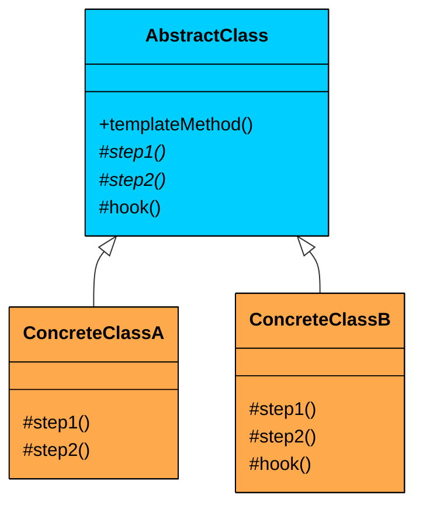
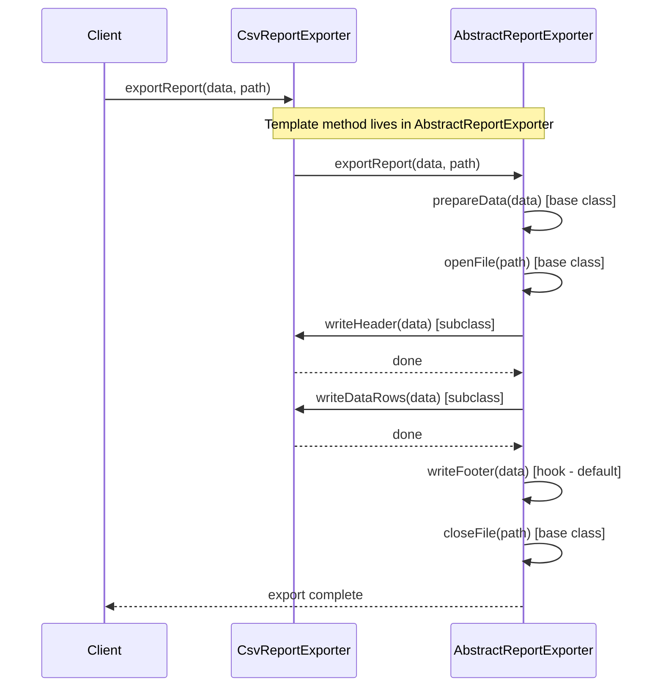
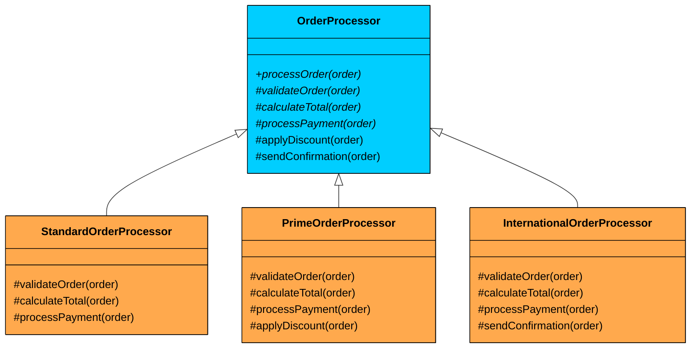

> 💡 **Key Insight:**

> **DEFINITION**
>
> The **Template Method Design Pattern** is a **behavioral design pattern** that defines the **skeleton of an algorithm** in a base class, but allows **subclasses to override specific steps** of the algorithm without changing its overall structure.

It’s particularly useful in situations where:

- You have a well-defined sequence of steps to perform a task.
- Some parts of the process are shared across all implementations.
- You want to allow subclasses to customize specific steps without rewriting the whole algorithm.

Let’s walk through a real-world example and see how we can apply the Template Method Pattern to build flexible, extensible, and reusable workflows.

---

# 1. The Problem: Exporting Reports

Let’s say you’re building an analytics platform that lets users export reports in different formats. Right now, the product needs CSV and PDF support, with Excel coming soon.

Each exporter follows the same high-level workflow:

1. **Prepare Data:** Gather and organize the report data.
2. **Open File:** Create the output file in the target format.
3. **Write Header:** Output column headers or metadata (format-specific).
4. **Write Data Rows:** Iterate through the dataset and write each row (format-specific).
5. **Write Footer:** Add optional summary or footer information.
6. **Close File:** Finalize and close the output file.

The workflow is the same across formats. Only the header writing and data row formatting differ. But if you implement each exporter independently, you end up duplicating the shared logic in every class.

### Naive Approach

Here is what the code looks like when each exporter handles the entire workflow on its own:

#### ReportData

```java
class ReportData {
    public List<String> getHeaders() {
        return Arrays.asList("ID", "Name", "Value");
    }

    public List<Map<String, Object>> getRows() {
        return Arrays.asList(
            Map.of("ID", 1, "Name", "Item A", "Value", 100.0),
            Map.of("ID", 2, "Name", "Item B", "Value", 150.5),
            Map.of("ID", 3, "Name", "Item C", "Value", 75.25)
        );
    }
}
```

#### CsvReportExporterNaive

```java
class CsvReportExporterNaive {
    public void export(ReportData data, String filePath) {
        System.out.println("CSV Exporter: Preparing data (common)...");
        // ... data preparation logic ...

        System.out.println("CSV Exporter: Opening file '" + filePath + ".csv' (common)...");
        // ... file opening logic ...

        System.out.println("CSV Exporter: Writing CSV header (specific)...");
        // String.join(",", data.getHeaders());
        // ... write header to file ...

        System.out.println("CSV Exporter: Writing CSV data rows (specific)...");
        // for (Map<String, Object> row : data.getRows()) { ... format and write row ... }

        System.out.println("CSV Exporter: Writing CSV footer (if any) (common)...");

        System.out.println("CSV Exporter: Closing file '" + filePath + ".csv' (common)...");
        // ... file closing logic ...
        System.out.println("CSV Report exported to " + filePath + ".csv");
    }
}
```

#### PdfReportExporterNaive

```java
class PdfReportExporterNaive {
    public void export(ReportData data, String filePath) {
        System.out.println("PDF Exporter: Preparing data (common)...");
        // ... data preparation logic ...

        System.out.println("PDF Exporter: Opening file '" + filePath + ".pdf' (common)...");
        // ... PDF library specific file opening ...

        System.out.println("PDF Exporter: Writing PDF header (specific)...");
        // ... PDF library specific header writing ...

        System.out.println("PDF Exporter: Writing PDF data rows (specific)...");
        // ... PDF library specific data row writing ...

        System.out.println("PDF Exporter: Writing PDF footer (if any) (common)...");

        System.out.println("PDF Exporter: Closing file '" + filePath + ".pdf' (common)...");
        // ... PDF library specific file closing ...
        System.out.println("PDF Report exported to " + filePath + ".pdf");
    }
}
```

#### Client Code

```java
public class ReportAppNaive {
    public static void main(String[] args) {
        ReportData reportData = new ReportData();

        CsvReportExporterNaive csvExporter = new CsvReportExporterNaive();
        csvExporter.export(reportData, "sales_report");

        System.out.println();

        PdfReportExporterNaive pdfExporter = new PdfReportExporterNaive();
        pdfExporter.export(reportData, "financial_summary");
    }
}
```

### What’s Wrong with This Design"

While this approach works for two exporters, it introduces several design problems that compound as the system grows:

#### Code Duplication

The same steps, preparing data, opening the file, closing the file, are repeated verbatim in every exporter class. Add an Excel exporter and you are copying the same boilerplate for the third time. Every line of duplicated code is a future bug waiting to happen.

#### Maintenance Overhead

If you need to add logging after each export, or change how files are opened (say, to add error handling or buffering), you have to make the same change in every exporter class. Miss one, and that format silently behaves differently. The more formats you add, the worse this gets.

#### Inconsistent Behavior

Since each exporter manages its own workflow, there is nothing stopping a developer from accidentally reordering steps, skipping the footer, or adding a step in one exporter but not another. The system drifts toward inconsistency over time.

#### Poor Extensibility

Adding a new export format means copying an entire class and modifying a few lines. This violates the DRY (Don't Repeat Yourself) principle and makes it unclear which parts of the code are shared logic and which parts are format-specific customization.

### What We Really Need

- Define the common report export workflow **once**, in a single base class
- Allow subclasses to override **only** the format-specific steps (header writing, data formatting)
- **Enforce** a consistent step ordering so no exporter can accidentally skip or reorder steps
- Make adding a new format as simple as creating one new subclass with two or three method overrides

This is exactly what the **Template Method pattern** provides.

---

# 2. What is the Template Method Pattern

> The Template Method pattern defines the skeleton of an algorithm in a method, deferring some steps to subclasses. It allows you to keep the 
>
> **overall structure of the process consistent**
>
> , while giving subclasses the flexibility to customize specific parts of the algorithm.

Two characteristics define the pattern:

1. **Algorithm skeleton in the base class:** The base class contains a method (the template method) that defines the sequence of steps. This method is typically marked `final` (Java/C#) or non-virtual (C++) so subclasses cannot alter the order or skip steps.
2. **Subclasses override specific steps:** The base class declares abstract methods for the steps that vary. Subclasses implement these methods to provide format-specific or context-specific behavior, but they never control when those methods are called.

> 💡 **Key Insight:**

> **Real-World Analogy**
>
> Think of a base cake recipe as the *Template Method*.
>
> The recipe defines the overall flow, step by step:
>
> 1. **Preheat the oven** (common step)
> 2. **Prepare the batter** (varies by cake type, such as chocolate or vanilla; abstract step)
> 3. **Pour the batter into a pan** (common step)
> 4. **Bake for X minutes** (common step; X can be a hook or configurable value)
> 5. **Let the cake cool** (common step)
> 6. **Frost the cake** (optional step; hook method)
>
> The key idea is that the **sequence is fixed** by the general recipe. Specific cake types (subclasses) only implement what differs, mainly how the batter is prepared, and they can optionally override the frosting step if they want a custom finish.

---

## Class Diagram



#### **AbstractClass (e.g., **`AbstractReportExporter`**)**

Contains the template method and defines the algorithm's skeleton. Declares abstract methods for the steps that must vary and provides default implementations for steps that can optionally vary.

> 💡 **Key Insight:**

> **Key Design Decision**
>
> We use an abstract class rather than an interface because the base class needs to provide a concrete template method with real logic (the step ordering). An interface cannot contain a method that calls other methods in sequence while enforcing that sequence.
>
> This is one of the few patterns where inheritance is the right tool, not composition.

#### **Concrete Classes** (e.g., `CsvReportExporter`, `PdfReportExporter`)

Each concrete class extends the abstract class and provides implementations for the abstract steps. Optionally overrides hook methods to customize optional behavior.

### Template Method

The method in the abstract class that defines the algorithm's skeleton. Mixes abstract method calls (subclass-provided) with concrete method calls (base-class-provided) and hook calls (optionally overridden).

### Hooks

Concrete methods in the abstract class with a default implementation (often empty or trivial) that subclasses can optionally override. Provides extension points without forcing subclasses to implement them.

---

# 3. How It Works

The Template Method workflow follows a clear sequence:



**Step 1:** The client creates an instance of a concrete class (e.g., `CsvReportExporter`).

**Step 2:** The client calls the template method (e.g., `exportReport()`) on the concrete instance.

**Step 3:** The template method, defined in the abstract base class, begins executing. It calls the steps in the fixed order defined by the skeleton.

**Step 4:** For each abstract step, the call is dispatched to the concrete subclass's implementation (e.g., `writeHeader()` calls the CSV-specific version).

**Step 5:** For each hook, the base class's default runs unless the subclass has overridden it.

**Step 6:** The template method completes. The client gets a consistent result regardless of which concrete class was used.

---

# 4. Implementing Template Method

Let us refactor the report export system using the Template Method pattern. The goal is to extract the common workflow into a single base class and let each format-specific exporter override only the steps that differ.

### Step 1: Create the Abstract Base Class

The abstract class contains the template method `exportReport()`, which defines the fixed sequence of steps. It provides default implementations for shared steps and declares abstract methods for format-specific steps. Hook methods (like `writeFooter()`) have a default that subclasses can optionally override.

```java
$a8
```

### Step 2: Implement Concrete Exporters

Each concrete class will extend `AbstractReportExporter` and implement the format-specific steps.

#### **CSV Exporter**

The CSV exporter extends the abstract class and provides CSV-specific implementations for the two abstract methods. It does not override the hook because CSV reports do not need a footer.

```java
class CsvReportExporter extends AbstractReportExporter {
    @Override
    protected void writeHeader(ReportData data) {
        System.out.println("CSV: " + String.join(",", data.getHeaders()));
    }

    @Override
    protected void writeDataRows(ReportData data) {
        for (Map<String, Object> row : data.getRows()) {
            StringBuilder sb = new StringBuilder();
            for (String header : data.getHeaders()) {
                if (sb.length() > 0) sb.append(",");
                sb.append(row.get(header));
            }
            System.out.println("CSV: " + sb);
        }
    }
}
```

The CSV exporter is clean and focused. It only implements the two methods that are specific to CSV formatting. Everything else, the workflow, the data preparation, the file handling, is inherited from the base class.

#### **Pdf Exporter**

The PDF exporter also extends the abstract class but provides different formatting. It overrides the `writeFooter` hook to add page numbers, something CSV does not need.

```java
class PdfReportExporter extends AbstractReportExporter {
    @Override
    protected void writeHeader(ReportData data) {
        System.out.println("PDF: | " + String.join(" | ", data.getHeaders()) + " |");
        System.out.println("PDF: " + "-".repeat(40));
    }

    @Override
    protected void writeDataRows(ReportData data) {
        for (Map<String, Object> row : data.getRows()) {
            StringBuilder sb = new StringBuilder("PDF: | ");
            for (String header : data.getHeaders()) {
                sb.append(row.get(header)).append(" | ");
            }
            System.out.println(sb);
        }
    }

    @Override
    protected void writeFooter(ReportData data) {
        System.out.println("PDF: --- Page 1 of 1 ---");
    }
}
```

Notice how the PDF exporter overrides the `writeFooter` hook to add page numbering. The CSV exporter did not override it, so it gets the empty default. This is the power of hooks: they let subclasses opt into additional behavior without forcing every subclass to deal with it.

### Step 3: Client Code

The client creates the appropriate exporter and calls `exportReport()`. It does not know or care about the internal steps.

```java
public class ReportApp {
    public static void main(String[] args) {
        ReportData data = new ReportData();

        AbstractReportExporter csvExporter = new CsvReportExporter();
        csvExporter.exportReport(data, "sales_report.csv");

        System.out.println();

        AbstractReportExporter pdfExporter = new PdfReportExporter();
        pdfExporter.exportReport(data, "sales_report.pdf");
    }
}
```

#### Expected Output:

```plaintext
Preparing report data...
Opening file: sales_report.csv
CSV: ID,Name,Value
CSV: 1,Item A,100.0
CSV: 2,Item B,150.5
CSV: 3,Item C,75.25
Closing file: sales_report.csv
Export complete: sales_report.csv

Preparing report data...
Opening file: sales_report.pdf
PDF: | ID | Name | Value |
PDF: ----------------------------------------
PDF: | 1 | Item A | 100.0 |
PDF: | 2 | Item B | 150.5 |
PDF: | 3 | Item C | 75.25 |
PDF: --- Page 1 of 1 ---
Closing file: sales_report.pdf
Export complete: sales_report.pdf
```

By applying the Template Method pattern, we have:

- **Eliminated code duplication** by moving the shared workflow into a single base class
- **Enforced consistency** across all exporters by locking the step order in the template method
- **Made the system extensible**, adding a new format only requires creating a new subclass
- **Improved maintainability**, changes to shared logic happen in one place
- **Provided clear extension points** through abstract methods (required) and hooks (optional)

---

# 5. Evolving the System: Adding an Excel Exporter

The real test of any design pattern is what happens when requirements change. The PM now wants Excel export support. With the Template Method pattern in place, this means creating one new subclass. No changes to the base class, no changes to the existing CSV or PDF exporters.

```java
class ExcelReportExporter extends AbstractReportExporter {
    @Override
    protected void writeHeader(ReportData data) {
        System.out.println("Excel: [Sheet1] Row 1: " + data.getHeaders());
    }

    @Override
    protected void writeDataRows(ReportData data) {
        int rowNum = 2;
        for (Map<String, Object> row : data.getRows()) {
            System.out.println("Excel: [Sheet1] Row " + rowNum + ": " + row.values());
            rowNum++;
        }
    }

    @Override
    protected void writeFooter(ReportData data) {
        System.out.println("Excel: [Sheet1] Auto-fit columns, apply borders");
    }
}
```

That is the entire change. One new class, three method overrides, zero modifications to existing code. The `AbstractReportExporter` base class is untouched. The `CsvReportExporter` and `PdfReportExporter` are untouched. This is the Open/Closed Principle at work: open for extension (new subclasses), closed for modification (existing code does not change).

---

# 6. Practical Example: Online Order Processing

Let us work through a second example to reinforce the pattern. This time, we are building an order processing pipeline for an e-commerce platform. Every order goes through the same sequence of steps: validate the order, calculate the total, process the payment, and send a confirmation. 

But the details differ based on the order type: standard orders, Prime orders (free shipping, priority processing), and international orders (customs handling, currency conversion).



### Implementation

```java
$af
```

The `OrderProcessor` base class controls the pipeline: validate, calculate, discount, pay, confirm. Each order type customizes only what it needs. `StandardOrderProcessor` uses defaults for discount and confirmation. `PrimeOrderProcessor` overrides the discount hook to apply member savings. `InternationalOrderProcessor` overrides the confirmation hook to add multi-language support and tracking.

Adding a new order type (wholesale, subscription, gift) means creating one new subclass. Nothing else changes.
