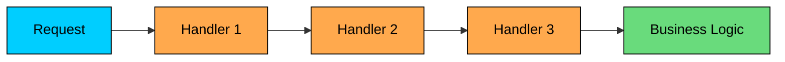
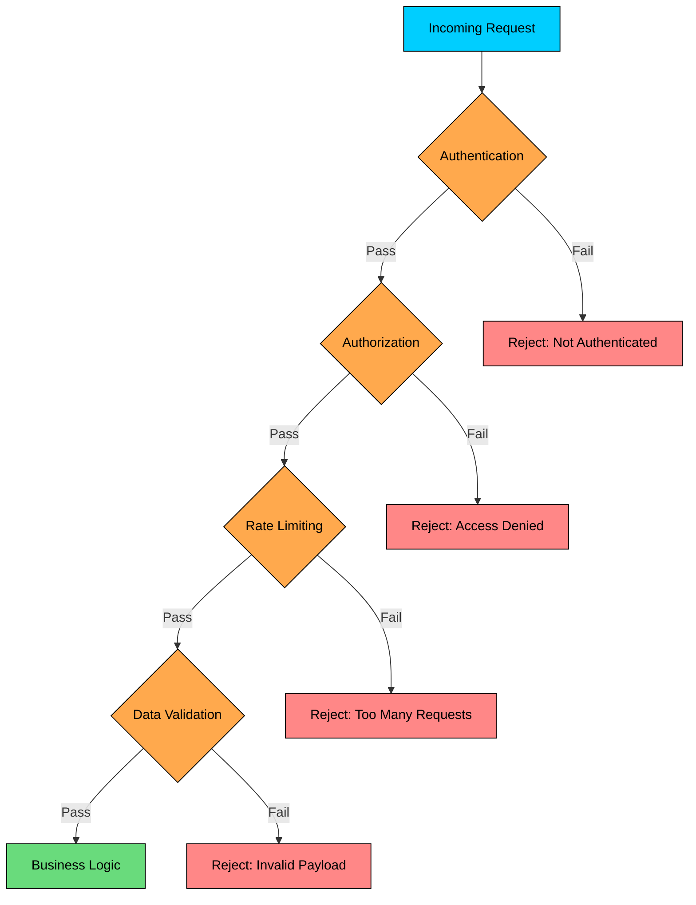
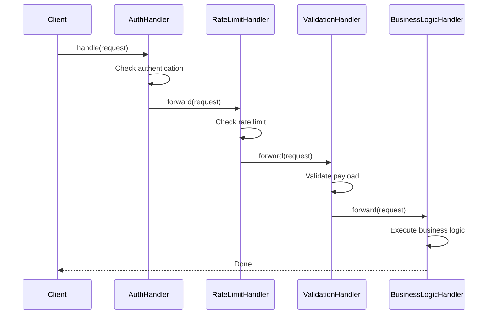

> 💡 **Key Insight:**

> **DEFINITION**
>
> The **Chain of Responsibility Design Pattern** is a **behavioral pattern** that lets you **pass requests along a chain of handlers**, allowing each handler to decide whether to process the request or pass it to the next handler in the chain.

This pattern is useful when:

- A request must be handled by **one of many possible handlers**, and you don’t want the sender to be tightly coupled to any specific one.
- You want to **decouple request logic** from the code that processes it.
- You want to **flexibly add, remove, or reorder handlers** without changing the client code.

Let’s walk through a real-world example to see how we can apply the Chain of Responsibility Pattern to build a **clean, modular, and extensible pipeline for request processing.**

---

# 1. The Problem: Handling HTTP Requests

Let us say you are building a backend server that processes incoming HTTP requests for a web application. Each request carries some information about the user, their role, how many requests they have made, and some payload data.

```java
class Request {
    public String user;
    public String userRole;
    public int requestCount;
    public String payload;

    public Request(String user, String role, int requestCount, String payload) {
        this.user = user;
        this.userRole = role;
        this.requestCount = requestCount;
        this.payload = payload;
    }
}
```

Before the request reaches the actual business logic, it must pass through several processing steps:

1. **Authentication**: Is the user properly authenticated via a token or session"
2. **Authorization**: Is the authenticated user allowed to perform this action"
3. **Rate Limiting**: Has the user exceeded their allowed number of requests"
4. **Data Validation**: Is the request payload well-formed and valid"



Only after all these checks pass should the request reach the actual business logic.

### The Naive Approach

A typical first attempt might look like this: implement all logic inside a single class using a long chain of `if-else` statements.

#### RequestHandler

```java
$a5
```

#### Client Code

```java
public class App {
    public static void main(String[] args) {
        Request req = new Request("john_doe", "ADMIN", 42, "{ \"data\": 123 }");
        RequestProcessor processor = new RequestProcessor();
        processor.handle(req);
    }
}
```

This works fine for a simple case, but there are several problems hiding beneath the surface.

### Why This Approach Breaks Down"

#### 1. **Violates the Open/Closed Principle**

Every time you need to add a new check, say logging, caching, or metrics collection, you must modify the existing `RequestProcessor` class. The class is open for modification when it should be closed for changes and open for extension.

#### 2. Poor Separation of Concerns

All validation and control logic is tightly coupled inside a single method. This violates the Single Responsibility Principle. The class is doing too many things: authentication, authorization, rate limiting, validation, and business logic coordination.

#### 3. No Reusability

What if another service needs the same authentication logic" You would have to copy the code or create awkward shared methods. Neither option is clean.

#### 4. Inflexible Configuration

What if you want to skip authorization for public APIs" Or make validation optional in development mode" You would need more if statements, and the code would become even more tangled.

### What We Really Need

We need a way to:

- Break each processing step into its own isolated unit
- Let each step decide whether to continue, pass, or stop the chain
- Allow new handlers to be added, removed, or reordered without touching existing code
- Keep our logic clean, testable, and extensible

This is exactly what the **Chain of Responsibility Pattern** provides.

---

# 2. Understanding Chain of Responsibility Pattern

The Chain of Responsibility Pattern allows a request to be passed along a chain of handlers. Each handler in the chain can either:

- **Handle** the request and stop the chain
- **Pass** it to the next handler in the chain
- **Handle** the request and then pass it along

This pattern decouples the sender of the request from the receivers, giving you the flexibility to compose chains dynamically, reuse logic, and avoid rigid conditional blocks.

> 💡 **Key Insight:**

> **Real-World Analogy**
>
> Think about calling customer support. You explain your issue to the first-level agent. If they can solve it, great. If not, they escalate to a second-level specialist. That specialist might handle it or escalate further to a manager, who might escalate to engineering. 
>
> You, the caller, do not decide who handles your issue. You just start at the beginning, and the request moves through the chain until someone resolves it.
>
> The Chain of Responsibility pattern works the same way: the client sends a request to the first handler, and it flows through the chain until one handler processes it or the chain ends.

---

## Class Diagram

The pattern consists of three main components:

#### 1. Handler (Interface)

Declares the common interface for all handlers in the chain. It defines how to set the next handler and how to process a request.

The interface defines the chaining contract. Every handler in the chain can be treated uniformly, whether it is an authentication check, a rate limiter, or the final business logic handler.

#### 2. ConcreteHandlers (e.g., `AuthHandler`, `RateLimitHandler`)

Each concrete handler implements one processing step. It decides whether to handle the request, reject it, or pass it to the next handler.

#### 3. Client

Builds the chain by linking handlers together and sends the initial request to the first handler. The client is unaware of which handler ultimately processes the request

---

# 3. How It Works

The Chain of Responsibility workflow follows a clear sequence:



**Step 1:** The client creates concrete handler objects (e.g., `AuthHandler`, `RateLimitHandler`, `ValidationHandler`).

**Step 2:** The client links them together using `setNext()`, forming the chain in the desired processing order.

**Step 3:** The client sends a request to the first handler in the chain.

**Step 4:** The first handler processes the request. If the request passes its check, the handler calls `forward()` to pass the request to the next handler. If the check fails, the handler stops the chain.

**Step 5:** This continues until a handler stops the chain or the request reaches the end.

---

# 4. Implementing Chain of Responsibility

Let us refactor our monolithic `RequestProcessor` into a clean, extensible chain of modular handlers using the Chain of Responsibility Pattern.

### Step 1: Define the Handler Interface

Every handler will implement this interface. Each handler should perform its specific check and decide whether to stop the chain or pass the request to the next handler.

```java
interface RequestHandler {
    void setNext(RequestHandler next);
    void handle(Request request);
}
```

### Step 2: Create the Abstract Base Handler

To avoid duplicating the `setNext()` and forwarding logic in every handler, we define an abstract base class with reusable functionality. This way, concrete handlers only need to implement their specific check.

```java
abstract class BaseHandler implements RequestHandler {
    protected RequestHandler next;

    @Override
    public void setNext(RequestHandler next) {
        this.next = next;
    }

    protected void forward(Request request) {
        if (next != null) {
            next.handle(request);
        }
    }
}
```

Now every concrete handler can focus solely on its logic and delegate to `forward(request)` when needed.

### Step 3: Create Concrete Handlers

Each handler implements one responsibility. They extend `BaseHandler`, implement `handle(Request)`, and determine whether to continue the chain or short-circuit it.

#### Authentication Handler

```java
class AuthHandler extends BaseHandler {
    @Override
    public void handle(Request request) {
        if (request.user == null) {
            System.out.println("AuthHandler: User not authenticated.");
            return;
        }
        System.out.println("AuthHandler: Authenticated.");
        forward(request);
    }
}
```

#### Authorization Handler

```java
class AuthorizationHandler extends BaseHandler {
    @Override
    public void handle(Request request) {
        if (!"ADMIN".equals(request.userRole)) {
            System.out.println("AuthorizationHandler: Access denied.");
            return;
        }
        System.out.println("AuthorizationHandler: Authorized.");
        forward(request);
    }
}
```

#### Rate Limiting Handler

```java
class RateLimitHandler extends BaseHandler {
    @Override
    public void handle(Request request) {
        if (request.requestCount >= 100) {
            System.out.println("RateLimitHandler: Rate limit exceeded.");
            return;
        }
        System.out.println("RateLimitHandler: Within rate limit.");
        forward(request);
    }
}
```

#### Data Validation Handler

```java
class ValidationHandler extends BaseHandler {
    @Override
    public void handle(Request request) {
        if (request.payload == null || request.payload.trim().isEmpty()) {
            System.out.println("ValidationHandler: Invalid payload.");
            return;
        }
        System.out.println("ValidationHandler: Payload valid.");
        forward(request);
    }
}
```

#### Final Business Logic Handler

This is the last handler in the chain. It assumes the request has passed all previous checks.

```java
class BusinessLogicHandler extends BaseHandler {
    @Override
    public void handle(Request request) {
        System.out.println("BusinessLogicHandler: Processing request for " + request.user + "...");
    }
}
```

### Step 4: Assemble the Chain in Client Code

Now that our handlers are modular, we can connect them in any order depending on the requirements.

```java
public class App {
    public static void main(String[] args) {
        // Create handlers
        BaseHandler auth = new AuthHandler();
        BaseHandler authorization = new AuthorizationHandler();
        BaseHandler rateLimit = new RateLimitHandler();
        BaseHandler validation = new ValidationHandler();
        BaseHandler businessLogic = new BusinessLogicHandler();

        // Build the chain
        auth.setNext(authorization);
        authorization.setNext(rateLimit);
        rateLimit.setNext(validation);
        validation.setNext(businessLogic);

        // Send a valid request through the chain
        Request request = new Request("john", "ADMIN", 10, "{ \"data\": \"valid\" }");
        auth.handle(request);

        System.out.println("\n--- Trying an invalid request ---");
        Request badRequest = new Request(null, "USER", 150, "");
        auth.handle(badRequest);
    }
}
```

#### Expected Output:

```shell
AuthHandler: Authenticated.
AuthorizationHandler: Authorized.
RateLimitHandler: Within rate limit.
ValidationHandler: Payload valid.
BusinessLogicHandler: Processing request for john...

--- Trying an invalid request ---
AuthHandler: User not authenticated.
```

### What We Achieved

Notice how clean this is. No conditional logic orchestrating the processing steps. Each handler is isolated and focused on one concern. Adding a new handler (say, `LoggingHandler` or `CorsHandler`) only requires creating a new class and plugging it into the chain. No changes to existing handlers or the client code structure.

- **Modularity:** Each handler is isolated and easy to test independently
- **Loose Coupling:** Handlers do not need to know who comes next in the chain
- **Extensibility:** Easily insert, remove, or reorder handlers without touching existing code
- **Clean Client Code:** Only responsible for building the chain and sending the request
- **Open/Closed Compliant:** You can add new functionality without modifying existing handlers

This is the power of the Chain of Responsibility pattern: it turns a rigid, monolithic processing method into a flexible, composable pipeline.

---

# 5. Practical Example: ATM Cash Dispenser

Let us work through a second example to reinforce the pattern. This time, we are building an ATM cash dispenser where a withdrawal request passes through a chain of denomination handlers. Each handler dispenses as many notes as it can of its denomination, then forwards the remaining amount to the next handler in the chain.

The key difference from our HTTP middleware example: here, every handler modifies the request before forwarding it. The HTTP middleware either passes or rejects. The ATM handlers always process and always forward, each one reducing the remaining amount. This is the "process and forward" variant of the pattern, where every handler does its part and hands off the rest.

### Implementation

```java
$ab
```

The first withdrawal ($380) divides cleanly across the denominations, so the remaining amount hits zero. The second withdrawal ($275) leaves $5 unhandled because none of our handlers deal in denominations smaller than $10. In a real ATM, the system would check this remainder and warn the user before dispensing.

This is a great example of how Chain of Responsibility is not just about filtering. It works equally well when handlers need to collaborate on a shared task, each contributing its piece.
