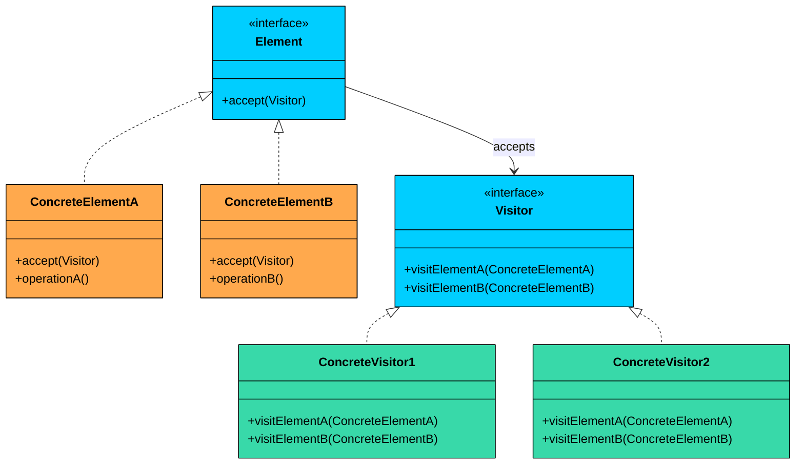
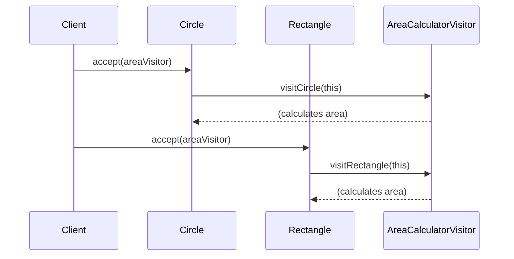
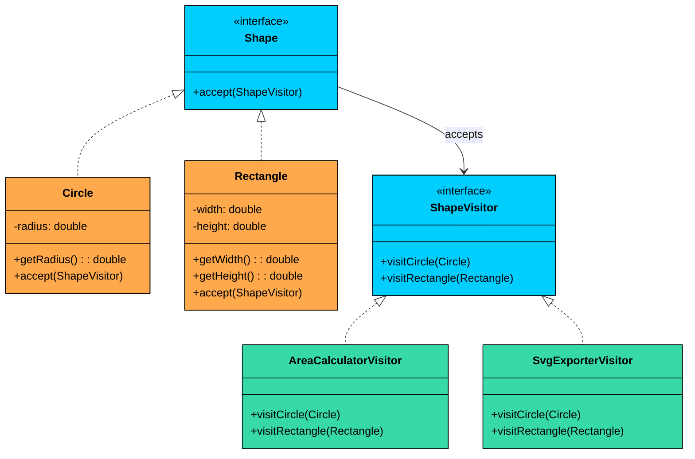

> 💡 **Key Insight:**

> **DEFINITION**
>
> The **Visitor Design Pattern** is a **behavioral pattern** that lets you **add new operations to existing object structures** without modifying their classes.

It achieves this by allowing you to separate the algorithm from the objects it operates on.

It’s particularly useful in situations where:

- You have a **complex object structure** (like ASTs, documents, or UI elements) that you want to **perform multiple unrelated operations** on.
- You want to **add new behaviors** to classes without changing their source code.
- You need to **perform different actions depending on an object’s concrete type**, without resorting to a long chain of `if-else` or `instanceof` checks.

Let’s walk through a real-world example to see how we can apply the Visitor Pattern to cleanly separate behavior from structure and make our system easier to extend without touching existing classes.

---

# 1. The Problem: Adding Operations to a Shape Hierarchy

Imagine you are building a vector graphics editor that supports multiple shape types:

- `Circle`
- `Rectangle`

Each shape is part of a common hierarchy and must support a variety of operations, such as:

- **Rendering** on screen
- **Calculating area**
- **Exporting to SVG**
- **Serializing to JSON**

The simplest approach is to add all of these methods to each shape class:

```java
interface Shape {
    void draw();
    double calculateArea();
    String exportAsSvg();
    String toJson();
}
```

```java
class Circle implements Shape {
    private double radius;

    public Circle(double radius) {
        this.radius = radius;
    }

    public void draw() {
        System.out.println("Drawing a circle");
    }

    public double calculateArea() {
        return Math.PI * radius * radius;
    }

    public String exportAsSvg() {
        return "<circle r=\"" + radius + "\" />";
    }

    public String toJson() {
        return "{ \"type\": \"circle\", \"radius\": " + radius + " }";
    }
}
```

### Why This Breaks Down

This solution seems fine for a couple of operations, but quickly becomes problematic as new operations or shape types are added.

#### 1. Violates the Single Responsibility Principle

Each shape class now contains multiple unrelated responsibilities: geometry calculations, drawing, serialization, and format exporting. This bloats the class and makes it harder to maintain.

#### 2. Hard to Extend

If you need to add a new operation (e.g., `generatePdf()`), you must modify every class in the hierarchy, recompile everything, and risk breaking existing logic. This violates the Open/Closed Principle.

#### 3. You Don’t Always Control the Classes

What if the shape classes are part of a third-party library or generated code" You cannot easily add new behavior directly.

### What We Really Need

We need a solution that lets us:

- **Separate operations** from the shape classes
- Add new behaviors **without modifying existing classes**
- Avoid duplicating `instanceof` checks or using type switches to handle different shapes

This is exactly what the Visitor pattern is designed to solve.

---

# 2. What is the Visitor Pattern

> The 
>
> **Visitor Design Pattern**
>
>  lets you 
>
> **separate algorithms from the objects on which they operate**
>
> . It enables you to 
>
> **add new operations**
>
>  to a class hierarchy 
>
> **without modifying the classes themselves**
>
> .

Two characteristics define the pattern:

1. **Separation of algorithm and structure:** The data classes (elements) stay clean. All operational logic lives in visitor classes that are entirely separate from the element hierarchy.
2. **Double dispatch:** The correct method to call is determined by both the type of the element and the type of the visitor. The element calls back the visitor with `this`, which resolves the element's concrete type at compile time. This two-step dispatch is what makes the pattern work without `instanceof` checks.

> 💡 **Key Insight:**

> **Real-World Analogy**
>
> Think about a home inspection. You have a house with different components: plumbing, electrical wiring, structural framing, and HVAC. Each specialist (a plumber, an electrician, a structural engineer, an HVAC technician) "visits" the house and inspects only what they understand. 
>
> The house does not need to know how to evaluate its own plumbing or wiring. It just opens the door and lets each inspector do their job. Adding a new type of inspection (say, a fire safety audit) does not require remodeling the house. You just bring in a new inspector. 
>
> The Visitor pattern works the same way: the elements (house components) accept visitors (inspectors), and new operations are new visitors.

---

## Class Diagram



### 1. Element (Interface)

Declares the `accept(Visitor)` method that every element in the object structure must implement. This is the entry point for the double dispatch mechanism.

The `accept()` method exists purely to enable double dispatch. Without it, the visitor would need `instanceof` checks to figure out the element's concrete type. With it, the element tells the visitor "I am a Circle" by calling `visitor.visitCircle(this)`, and the correct overloaded method is invoked at compile time.

### 2. Concrete Elements (e.g., `Circle`, `Rectangle`)

Each concrete element implements the `accept()` method by calling the visitor's corresponding visit method, passing `this`.

### 3. Visitor (Interface)

Declares a `visit` method for each concrete element type. This is the interface that all operations implement.

### 4. Concrete Visitors (e.g., `AreaCalculatorVisitor`)

Each concrete visitor implements the Visitor interface with a specific operation. One visitor might calculate areas, another might export to SVG, a third might validate constraints.

---

# 3. How It Works

The Visitor workflow involves a two-step dispatch that routes execution to the right method based on both the element type and the visitor type.



**Step 1:** The client creates a concrete visitor (e.g., `AreaCalculatorVisitor`).

**Step 2:** The client iterates over the element collection and calls `element.accept(visitor)` on each one.

**Step 3:** Inside `accept()`, the element calls back the visitor's specific method: `visitor.visitCircle(this)` for a Circle, `visitor.visitRectangle(this)` for a Rectangle. This is the double dispatch: the element resolves its own type.

**Step 4:** The visitor's `visitCircle()` or `visitRectangle()` method runs, performing the operation using the element's data.

**Step 5:** To add a new operation, you create a new visitor class. No element classes change.

---

# 4. Implementing Visitor Pattern

Let us refactor the graphics system using the Visitor pattern to perform two operations (area calculation and SVG export) without putting any operational logic inside the shape classes.

Here is the class diagram for the solution:



### Step 1: Define the Shape Interface (Element)

All shapes must accept a visitor.

```java
interface Shape {
    void accept(ShapeVisitor visitor);
}
```

### Step 2: Create Concrete Shape Classes (Elements)

Each shape class implements `accept()` and delegates to the visitor.

#### Circle

```java
class Circle implements Shape {
    private final double radius;

    public Circle(double radius) {
        this.radius = radius;
    }

    public double getRadius() {
        return radius;
    }

    @Override
    public void accept(ShapeVisitor visitor) {
        visitor.visitCircle(this);
    }
}
```

#### Rectangle

```java
class Rectangle implements Shape {
    private final double width;
    private final double height;

    public Rectangle(double width, double height) {
        this.width = width;
        this.height = height;
    }

    public double getWidth() {
        return width;
    }

    public double getHeight() {
        return height;
    }

    @Override
    public void accept(ShapeVisitor visitor) {
        visitor.visitRectangle(this);
    }
}
```

### Step 3: Define the Visitor Interface

Each method corresponds to a shape type.

```java
interface ShapeVisitor {
    void visitCircle(Circle circle);
    void visitRectangle(Rectangle rectangle);
}
```

### Step 4: Implement Concrete Visitors

#### Area Calculator Visitor

```java
class AreaCalculatorVisitor implements ShapeVisitor {
    @Override
    public void visitCircle(Circle circle) {
        double area = Math.PI * circle.getRadius() * circle.getRadius();
        System.out.println("Area of Circle: " + area);
    }

    @Override
    public void visitRectangle(Rectangle rectangle) {
        double area = rectangle.getWidth() * rectangle.getHeight();
        System.out.println("Area of Rectangle: " + area);
    }
}
```

#### SVG Exporter Visitor

```java
class SvgExporterVisitor implements ShapeVisitor {
    @Override
    public void visitCircle(Circle circle) {
        System.out.println("<circle r=\"" + circle.getRadius() + "\" />");
    }

    @Override
    public void visitRectangle(Rectangle rectangle) {
        System.out.println("<rect width=\"" + rectangle.getWidth() + 
            "\" height=\"" + rectangle.getHeight() + "\" />");
    }
}
```

### 5. Client Code

Now you can operate on the shape structure using any visitor.

```java
public class VisitorPatternDemo {
    public static void main(String[] args) {
        List<Shape> shapes = List.of(
            new Circle(5),
            new Rectangle(10, 4),
            new Circle(2.5)
        );

        System.out.println("=== Calculating Areas ===");
        ShapeVisitor areaCalculator = new AreaCalculatorVisitor();
        for (Shape shape : shapes) {
            shape.accept(areaCalculator);
        }

        System.out.println("\n=== Exporting to SVG ===");
        ShapeVisitor svgExporter = new SvgExporterVisitor();
        for (Shape shape : shapes) {
            shape.accept(svgExporter);
        }
    }
}
```

#### Expected Output:

```shell
=== Calculating Areas ===
Area of Circle: 78.53981633974483
Area of Rectangle: 40.0
Area of Circle: 19.634954084936208

=== Exporting to SVG ===
<circle r="5.0" />
<rect width="10.0" height="4.0" />
<circle r="2.5" />
```

### What We Achieved

- **Decoupled logic: **Shape classes are clean; logic lives in visitors
- **Open/Closed Principle: **Easily add new visitors (e.g., `JsonExporterVisitor`) without touching shapes
- **Double dispatch: **Eliminated need for `instanceof` or type-checking
- **Reusability & maintainability: **Each visitor focuses on one operation and is testable in isolation
