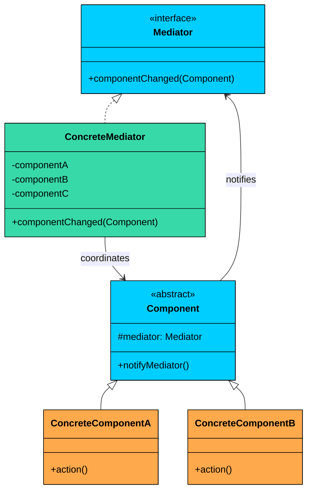
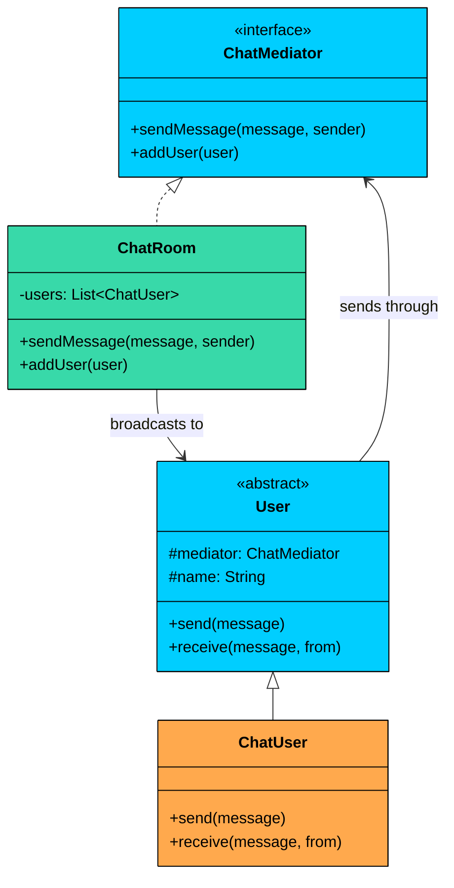

> 💡 **Key Insight:**

> **DEFINITION**
>
> The **Mediator Design Pattern** is a **behavioral pattern** that defines an object (the **Mediator**) to **encapsulate how a set of objects interact**.

It promotes **loose coupling** by preventing objects from referring to each other directly, and lets you vary their interactions independently.

It’s particularly useful in situations where:

- You have a group of tightly coupled classes or UI components that need to communicate.
- Changes in one component require updates in multiple others.
- You want to centralize communication logic to simplify maintenance and testing.

Let’s walk through a real-world example to see how we can apply the Mediator Pattern to build a more modular, loosely coupled system where components communicate cleanly and consistently.

---

# 1. The Problem: Tightly Coupled UI Components

Imagine you're building a **login form** with the following UI components:

- A **username field**
- A **password field**
- A **login button**
- A **status label**

The logic of the form is simple:

- The **login button** should be enabled only when both username and password fields are non-empty.
- When the button is clicked, it should attempt login and display the result in the **status label**.

Sounds simple, right" Let’s try implementing this with each component talking directly to the others.

### The Naive Approach

In a straightforward implementation, each component holds direct references to the components it needs to interact with. The text fields know about the button, and the button knows about the text fields and the label.

#### TextField

```java
class TextField {
    private String text = "";
    private Button loginButton;

    public void setLoginButton(Button button) {
        this.loginButton = button;
    }

    public void setText(String newText) {
        this.text = newText;
        System.out.println("TextField updated: " + text);
        if (loginButton != null) {
            loginButton.checkEnabled();
        }
    }

    public String getText() {
        return text;
    }
}
```

#### Button

```java
class Button {
    private TextField usernameField;
    private TextField passwordField;
    private Label statusLabel;

    public void setDependencies(TextField username, TextField password, Label status) {
        this.usernameField = username;
        this.passwordField = password;
        this.statusLabel = status;
    }

    public void checkEnabled() {
        boolean enable = !usernameField.getText().isEmpty() &&
            !passwordField.getText().isEmpty();
        System.out.println("Login Button is now " + (enable " "ENABLED" : "DISABLED"));
    }

    public void click() {
        if (!usernameField.getText().isEmpty() && !passwordField.getText().isEmpty()) {
            System.out.println("Login successful!");
            statusLabel.setText("Logged in!");
        } else {
            System.out.println("Login failed.");
            statusLabel.setText("Please enter username and password.");
        }
    }
}
```

#### Label

```java
class Label {
    public void setText(String message) {
        System.out.println("Status: " + message);
    }
}
```

### What’s Wrong with this Design"

At first glance, this seems fine. But as soon as you add a few more components (e.g., a "remember me" checkbox, a "forgot password" link), the logic starts to spiral out of control.

#### 1. Tight Coupling

Every component **knows about others**: the `TextField` knows the `Button`, the `Button` knows the `TextField` and the `Label`. A change in one component's logic often requires updates in others, creating a fragile system.

#### 2. Lack of Reusability

You cannot easily reuse these components elsewhere. They are hard-wired to interact with specific peers, making them **context-dependent**.

#### 3. Poor Maintainability

Adding or modifying interactions requires changing the logic of multiple classes. This violates the **Open/Closed Principle** and makes the system harder to test and evolve.

#### 4. Hidden Logic Sprawled Across Components

Each component contains not only its own logic but also **coordinating behavior**, making it harder to isolate responsibilities.

### What We Really Need

We need a way to:

- **Decouple UI components** from each other
- Centralize the coordination logic so that each component **focuses only on its own role**
- Make it easier to **add, remove, or change components or interactions** without breaking everything else

This is exactly what the **Mediator Pattern** is designed to solve.

---

# 2. The Mediator Pattern

> The 
>
> **Mediator Pattern**
>
>  promotes loose coupling by 
>
> **centralizing communication**
>
>  between objects. Instead of having components refer to and interact with each other directly, they communicate 
>
> **through a mediator**
>
> .

Two characteristics of the pattern:

1. **Centralized communication.** All interaction logic lives in one place: the mediator. Components do not call methods on each other. When a component's state changes, it notifies the mediator, and the mediator coordinates the response. This means the complex web of many-to-many relationships gets replaced by a simple star topology with the mediator at the center.
2. **Loose coupling between components.** Each component depends only on the mediator interface, not on any other component. Components can be added, removed, or replaced without modifying other components. The mediator is the only class that knows about the full set of participants and how they interact.

This leads to a **cleaner separation of concerns** and makes components easier to reuse in different contexts.

> 💡 **Key Insight:**

> **Real-World Analogy**
>
> Think about an air traffic control tower. Planes approaching an airport do not communicate with each other to negotiate landing order, runway assignments, or holding patterns. That would be chaos, especially with dozens of planes in the air simultaneously. Instead, every pilot talks only to the control tower. 
>
> The tower knows the position, speed, and fuel status of every plane and coordinates them accordingly: "Flight 237, hold at 5,000 feet. Flight 412, you are cleared for runway 28L." 
>
> The tower is the mediator. Planes are the components. If a new plane enters the airspace, the tower handles it. If a plane diverts, the tower adjusts. The other planes never need to know.

---

## Class Diagram



#### **Mediator (Interface)**

Declares the interface for communication between components. Typically has a single method like `componentChanged()`, `notify()`, or `send()`.

The mediator interface should be narrow. A single `componentChanged(component)` method is almost always sufficient. The mediator identifies the sender and decides what to do based on the sender's identity and state.

#### **ConcreteMediator**

Implements the mediator interface. Contains all the coordination logic and holds references to every component it manages.

The concrete mediator is allowed to know about concrete component types. This is intentional. The mediator absorbs the coupling that would otherwise be spread across all components. One class knowing about everyone is better than everyone knowing about everyone.

#### **Component (Abstract Base)**

Holds a reference to the mediator and provides a `notifyMediator()` convenience method.

#### **ConcreteComponents**

These are the actual components (e.g., `TextField`, `Button`, `Label`) that perform actions and notify the mediator when changes occur. They never talk directly to each other.

---

# 3. Implementing Mediator

Let us refactor the tightly coupled login form using the Mediator pattern. Each UI component will interact **only with the mediator**, which will handle all coordination and logic.

We will do this in five steps.

### Step 1: Define the UIMediator Interface

This interface defines how components will notify the mediator when their state changes. It provides a method like `componentChanged()` to centralize communication.

```java
interface UIMediator {
    void componentChanged(UIComponent component);
}
```

### Step 2: Define the Abstract Component (UIComponent)

This abstract base class holds a reference to the mediator and provides a method to notify it when something changes. All UI elements will extend this class.

```java
abstract class UIComponent {
    protected UIMediator mediator;

    public UIComponent(UIMediator mediator) {
        this.mediator = mediator;
    }

    public void notifyMediator() {
        mediator.componentChanged(this);
    }
}
```

This ensures a consistent way for all components to communicate with the mediator.

### Step 3: Implement the Components

Each component (TextField, Button, Label) extends UIComponent and defines its own local behavior. These components no longer interact with each other directly. They only notify the mediator.

#### TextField

```java
class TextField extends UIComponent {
    private String text = "";

    public TextField(UIMediator mediator) {
        super(mediator);
    }

    public void setText(String newText) {
        this.text = newText;
        System.out.println("TextField updated: " + newText);
        notifyMediator();
    }

    public String getText() {
        return text;
    }
}
```

#### Button

```java
class Button extends UIComponent {
    private boolean enabled = false;

    public Button(UIMediator mediator) {
        super(mediator);
    }

    public void click() {
        if (enabled) {
            System.out.println("Login Button clicked!");
            notifyMediator(); // Will trigger login attempt
        } else {
            System.out.println("Login Button is disabled.");
        }
    }

    public void setEnabled(boolean value) {
        this.enabled = value;
        System.out.println("Login Button is now " + (enabled " "ENABLED" : "DISABLED"));
    }
}
```

#### Label

```java
class Label extends UIComponent {
    private String text;

    public Label(UIMediator mediator) {
        super(mediator);
    }

    public void setText(String message) {
        this.text = message;
        System.out.println("Status: " + text);
    }
}
```

### Step 4: Implement the Concrete Mediator (FormMediator)

This class knows about all components and defines the rules for how they should behave in response to one another. When a component changes, the mediator coordinates the appropriate actions.

```java
$a1
```

### Step 5: Connect Everything in the Client

Now, the client wires everything together. Components are instantiated, linked to the mediator, and can be used without knowing about each other.

```java
public class MediatorApp {
    public static void main(String[] args) {
        FormMediator mediator = new FormMediator();

        TextField usernameField = new TextField(mediator);
        TextField passwordField = new TextField(mediator);
        Button loginButton = new Button(mediator);
        Label statusLabel = new Label(mediator);

        mediator.setUsernameField(usernameField);
        mediator.setPasswordField(passwordField);
        mediator.setLoginButton(loginButton);
        mediator.setStatusLabel(statusLabel);

        // Simulate user interaction
        usernameField.setText("admin");
        passwordField.setText("1234");
        loginButton.click(); // Should succeed

        System.out.println("\n--- New Attempt with Wrong Password ---");
        passwordField.setText("wrong");
        loginButton.click(); // Should fail
    }
}
```

#### Expected Output:

```plaintext
TextField updated: admin
Login Button is now DISABLED
TextField updated: 1234
Login Button is now ENABLED
Login Button clicked!
Status: Login successful!

--- New Attempt with Wrong Password ---
TextField updated: wrong
Login Button is now ENABLED
Login Button clicked!
Status: Invalid credentials.
```

### What We Achieved

- **Loose coupling: **Components no longer know about each other
- **Separation of concerns: **Coordination logic lives in the mediator, not in the components
- **Ease of extension: **Add new components or behaviors without modifying existing ones
- **Reusability: **Components like `TextField`, `Button`, and `Label` can be reused in other contexts

---

# 4. Practical Example: Chat Room

Let us work through a second example to reinforce the pattern. This time, we are building a simple chat room. Users send messages to the chat room, and the chat room broadcasts them to all other connected users. No user holds a direct reference to any other user.



`ChatMediator` declares the message-sending contract, and `User` is the abstract base that holds a reference to the mediator. `ChatRoom` is the concrete mediator that manages users and routes messages. `ChatUser` sends and receives messages without knowing about any other user.

### Implementation

```java
$a7
```

Notice how no user knows about any other user. Alice calls `send()`, which delegates to the chat room. The chat room iterates through its user list and calls `receive()` on everyone except Alice. If we add a fourth user, we register them with the chat room. Alice, Bob, and Charlie are completely unaffected.

This example also illustrates the difference between Mediator and Observer. In Observer, the subject broadcasts identical data to all observers, and each observer decides what to do with it. Here, the mediator actively decides who gets the message (everyone except the sender) and what format the message takes. The mediator is not just broadcasting; it is coordinating.
