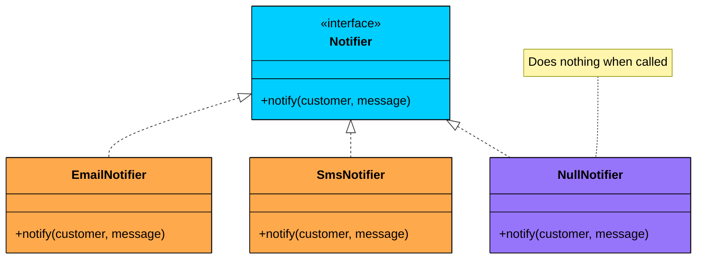
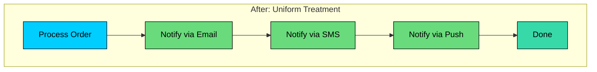
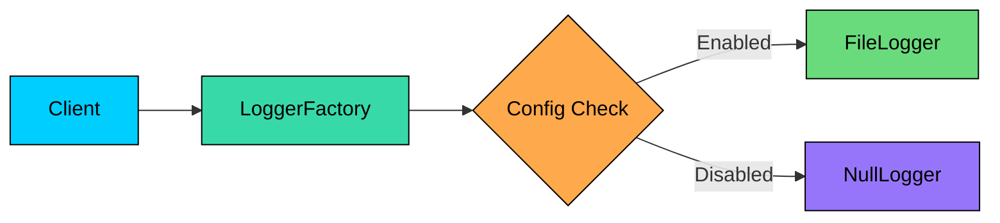

Imagine you're building a logging system. Different parts of your application need to log events, but some deployments need logging disabled entirely. You start sprinkling null checks everywhere:

One file becomes ten. Ten becomes fifty. Now your codebase is littered with defensive null checks. Miss one, and you get a `NullPointerException` in production.

The **Null Object Pattern** solves this by replacing null references with objects that do nothing. Instead of checking for null, you call methods that silently succeed.

---

# 1. What is the Null Object Pattern"

The **Null Object Pattern** is a behavioral design pattern that uses an object with default "do nothing" behavior instead of using null references. This eliminates the need for null checks throughout your code.

The key insight is that "absence of behavior" is still a behavior. By encapsulating it in an object, you treat present and absent cases uniformly.

```mermaid
flowchart TB

    subgraph With Pattern
        direction TB
        E[Client Code]:::primary --> F[Call method]:::green
        F --> G[Real Object OR Null Object]:::secondary
    end	

    subgraph Without Pattern
        direction TB
        A[Client Code]:::primary --> B{Is object null"}:::orange
        B -->|Yes| C[Skip operation]:::red
        B -->|No| D[Call method]:::green
    end

    classDef primary fill:#00ceff,stroke:#000,color:#000
	classDef secondary fill:#38d9a9,stroke:#000,color:#000
    classDef orange fill:#ffa94d,stroke:#000,color:#000
    classDef green fill:#69db7c,stroke:#000,color:#000
    classDef red fill:#ff8787,stroke:#000,color:#000
```

The pattern was described by Bobby Woolf in the "Pattern Languages of Program Design" series. It's a special case of the Strategy pattern where one strategy is to "do nothing."

**But why not just check for null"**

---

# 2. The Problem: Null Checks Everywhere

Let's look at a notification system without the Null Object pattern:

This approach has several problems:

### Problem 1: Defensive Code Everywhere

Every method that uses an optional dependency needs null checks. Forget one, and your application crashes with a `NullPointerException`.

### Problem 2: Violates Open/Closed Principle

Adding a new notifier type means adding another null check in every place notifications are sent.

### Problem 3: Scattered Logic

The decision about whether to notify is spread across every call site instead of being centralized.

### Problem 4: Harder to Test

Tests need to account for null cases. You cannot simply mock all dependencies; you must also test the null branches.

### Problem 5: Reduced Readability

Business logic gets buried under defensive checks. The "happy path" becomes hard to follow.

---

# 3. How the Null Object Pattern Works

The pattern has three main components:



### 3.1 The Abstract Interface

Define the contract that all implementations must follow:

### 3.2 Real Implementations

Concrete classes that do actual work:

### 3.3 The Null Object

A class that implements the interface but does nothing:

Now the client code becomes simple:

---

# 4. The Pattern in Action

Let's visualize how the pattern eliminates branching:

```mermaid
flowchart TD
    subgraph Before["Before: Multiple Null Checks"]
        A1[Process Order]:::primary --> B1{Email null"}:::orange
        B1 -->|No| C1[Send Email]:::green
        B1 -->|Yes| D1{SMS null"}:::orange
        C1 --> D1
        D1 -->|No| E1[Send SMS]:::green
        D1 -->|Yes| F1{Push null"}:::orange
        E1 --> F1
        F1 -->|No| G1[Send Push]:::green
        F1 -->|Yes| H1[Done]:::secondary
        G1 --> H1
    end

    classDef primary fill:#00ceff,stroke:#000,color:#000
    classDef secondary fill:#38d9a9,stroke:#000,color:#000
    classDef orange fill:#ffa94d,stroke:#000,color:#000
    classDef green fill:#69db7c,stroke:#000,color:#000
```



Each notifier is either a real implementation or a `NullNotifier`. The client code treats them identically.

---

# 5. Common Use Cases

### 5.1 Logging Systems

One of the most common applications. You want logging in development but might disable it in production for performance:

### 5.2 Optional Features

When features can be toggled on or off:

### 5.3 Default Values in Collections

When retrieving items that might not exist:

```mermaid
flowchart LR
    A[User Request]:::primary --> B[Find Customer]:::secondary
    B --> C{Customer exists"}:::orange
    C -->|Yes| D[RealCustomer]:::green
    C -->|No| E[NullCustomer]:::purple
    D --> F[Process Request]:::secondary
    E --> F

    classDef primary fill:#00ceff,stroke:#000,color:#000
    classDef secondary fill:#38d9a9,stroke:#000,color:#000
    classDef orange fill:#ffa94d,stroke:#000,color:#000
    classDef green fill:#69db7c,stroke:#000,color:#000
    classDef purple fill:#9775fa,stroke:#000,color:#000
```

### 5.4 Strategy Pattern with "No Strategy"

When one valid strategy is to do nothing:

---

# 6. Implementation Patterns

### 6.1 Singleton Null Objects

Since null objects are stateless, use a single instance:

### 6.2 Null Object with Default Values

Sometimes "doing nothing" means returning sensible defaults:

### 6.3 Factory Method Pattern

Hide the null object decision in a factory:



---

# 7. Null Object vs Other Approaches

| ##### Approach | ##### Pros | ##### Cons |
| --- | --- | --- |
| **Null checks** | Simple, explicit | Repetitive, error-prone |
| **Optional/Maybe** | Type-safe, functional | Adds wrapping overhead |
| **Null Object** | Clean client code, polymorphic | Requires interface, can hide bugs |
| **Exceptions** | Fails fast, explicit | Disruptive, performance cost |

#### When to Use Null Object

- The null case is a valid, expected scenario
- You want polymorphic behavior (treat null and real the same)
- Multiple call sites would need the same null check
- The "do nothing" behavior is meaningful

#### When NOT to Use Null Object

- Null indicates a bug that should fail fast
- The caller needs to know if the object is absent
- Different callers need different null handling
- It would hide programming errors
