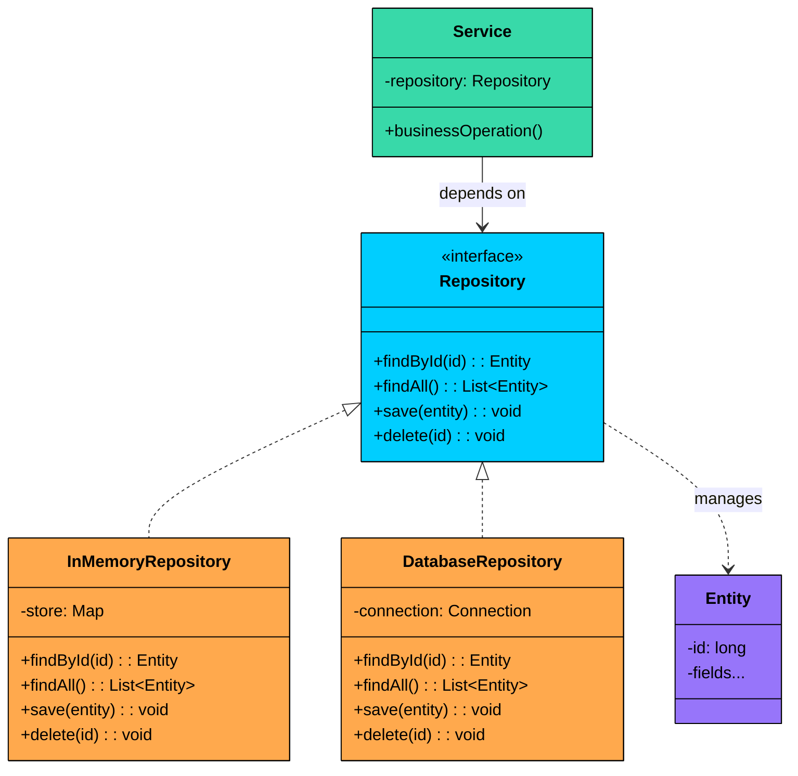
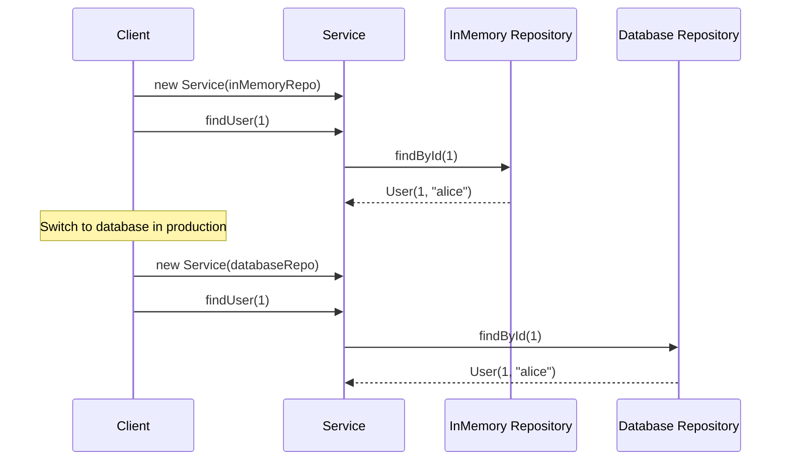
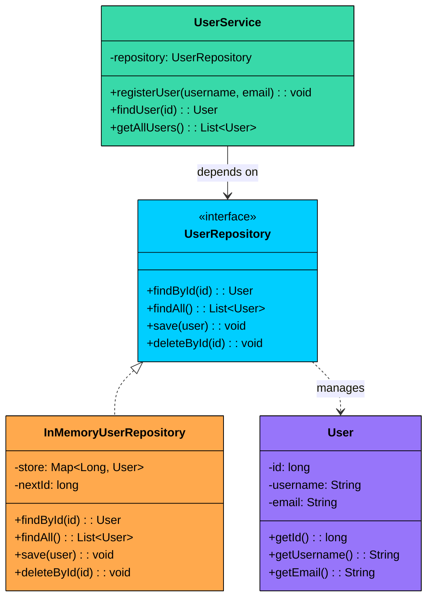
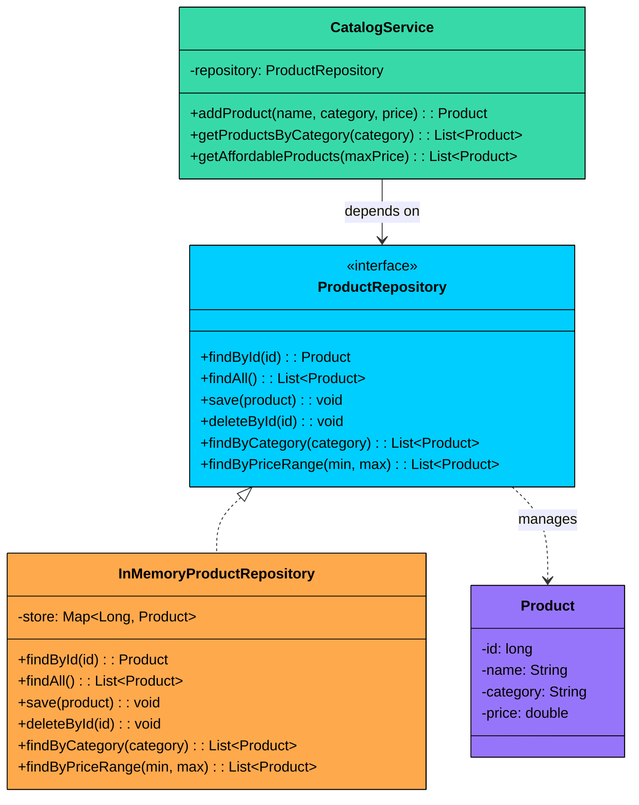

Imagine you’re building an order management system. Your service layer fetches orders, saves new ones, and runs queries like “orders placed today.” At first, you write SQL directly inside service classes. It works.

Then requirements change: add caching, swap PostgreSQL for MongoDB in one microservice, run unit tests without a real database. Suddenly every change forces a rewrite, because data access is tangled with business logic. The service now knows too much: connection details, query syntax, and transaction handling. Testing becomes painful.

That’s what the **Repository pattern** solves. It puts a clean abstraction between domain logic and persistence, so services depend on an interface, not a database. You can switch storage, add caching, or test with an in-memory implementation without touching business code.

---

# 1. What is the Repository Pattern"

> [!PAYWALL] This content is for premium members only.

The Repository pattern mediates between the domain layer and the data mapping layer, acting like an in-memory collection of domain objects. The business logic asks the repository for entities, and the repository handles all the details of how those entities are stored, retrieved, and persisted.

Two characteristics of the pattern:

1. **Collection-like interface:** The repository exposes methods like `findById`, `findAll`, `save`, and `delete`. From the client's perspective, it looks and feels like working with a simple in-memory collection, even though the actual storage might be a relational database, a document store, or a remote API.
2. **Abstraction of data access:** The client depends on a repository interface, not on any specific storage technology. This means you can swap implementations (in-memory, JDBC, MongoDB, REST) without changing the client code.



### Why Use the Repository Pattern"

The primary goal of the Repository Pattern is to create a clean separation of concerns. By abstracting the data access logic, you gain several significant advantages:

- **Decoupling**: Your business logic (the "domain") is completely isolated from the data access technology (the "data mapping layer"). Your services don't need to know if you're using JPA, JDBC, a NoSQL database, or even a simple in-memory list. This means you can switch out your database or ORM framework with minimal changes to your core application logic.
- **Centralized Data Access Logic**: All the logic for querying and persisting data is located in one place—the repository. This avoids scattering database queries all over your application, making it easier to manage, optimize, and debug. If you need to change how data is fetched, you only have to do it in one class.
- **Improved Testability**: This is one of the biggest wins. Since your business logic depends on a repository *interface*, you can easily create a "mock" or "fake" repository for your unit tests. This mock repository can simulate the database using a simple in-memory collection, making your tests incredibly fast, reliable, and free from external dependencies like a running database.
- **Enhanced Readability**: Your business logic becomes much cleaner. Instead of being cluttered with SQL queries or `EntityManager` calls, it reads more like a clear set of instructions, for example: `userRepository.findById(1)` or `productRepository.save(newProduct)`.

---

# 2. The Core Components

The pattern is built around a few key components that work together to create this powerful abstraction.

1. **Domain Model (or Entity)**: This is the object that represents the data you are working with (e.g., a `User`, `Product`, or `Order` class). It's a plain Java object (POJO) that holds the state of your business entity.
2. **Repository Interface**: This is the contract. It defines the set of operations that can be performed on the domain model, such as `findById`, `save`, `findAll`, and `delete`. The business logic will code against this interface, not the concrete implementation.
3. **Concrete Repository**: This is the actual implementation of the repository interface. This class contains the specific data access logic. You might have a `JdbcUserRepository` for a SQL database, a `MongoUserRepository` for MongoDB, or an `InMemoryUserRepository` for testing.
4. **The Client (Business Logic)**: This is the part of your application that needs the data, such as a `UserService`. It holds a reference to the repository interface and uses it to fetch and store domain objects.

### How It Works

The Repository workflow follows these steps:



**Step 1:** The application creates a concrete repository instance (e.g., `InMemoryUserRepository` or `DatabaseUserRepository`).

**Step 2:** The concrete repository is injected into the service via its constructor. The service's constructor parameter is typed to the repository interface, not the concrete class.

**Step 3:** When the service needs data, it calls a method on the repository interface (e.g., `repository.findById(42)`).

**Step 4:** The concrete repository translates the call into the appropriate storage operation and returns the result.

**Step 5:** To switch storage backends, you swap the concrete repository at the injection point. The service code does not change at all.

---

# 3. Code Example

Let's build a simple system to manage `User` entities. We'll create a repository to handle the persistence and retrieval of `User` objects.



### Step 1: Define the Entity

The `User` entity is a simple domain object. It holds the data and has no knowledge of how it is stored.

```java
public class User {
    private long id;
    private String username;
    private String email;

    public User(long id, String username, String email) {
        this.id = id;
        this.username = username;
        this.email = email;
    }

    public long getId() { return id; }
    public void setId(long id) { this.id = id; }
    public String getUsername() { return username; }
    public String getEmail() { return email; }

    @Override
    public String toString() {
        return "User{id=" + id + ", username='" + username + "', email='" + email + "'}";
    }
}
```

### Step 2: Define the Repository Interface

This is the contract. The service layer depends on this interface, not on any concrete implementation. It defines standard CRUD operations using domain language.

```java
import java.util.List;
import java.util.Optional;

public interface UserRepository {
    Optional<User> findById(long id);
    List<User> findAll();
    void save(User user);
    void deleteById(long id);
}
```

Notice how the interface uses domain language (`findById`, `save`) rather than storage language (`executeQuery`, `insertRow`). This keeps the abstraction clean and meaningful to the business logic layer.

### Step 3: Implement the In-Memory Repository

This concrete implementation stores users in a hash map. It is perfect for unit testing and prototyping, since it has no external dependencies and runs fast.

```java
import java.util.*;
import java.util.concurrent.atomic.AtomicLong;

public class InMemoryUserRepository implements UserRepository {
    private final Map<Long, User> store = new HashMap<>();
    private final AtomicLong nextId = new AtomicLong(1);

    @Override
    public Optional<User> findById(long id) {
        return Optional.ofNullable(store.get(id));
    }

    @Override
    public List<User> findAll() {
        return new ArrayList<>(store.values());
    }

    @Override
    public void save(User user) {
        if (user.getId() == 0) {
            user.setId(nextId.getAndIncrement());
        }
        store.put(user.getId(), user);
    }

    @Override
    public void deleteById(long id) {
        store.remove(id);
    }
}
```

The key point: this class handles all the storage details. The service layer never sees a `HashMap` or `Map`. It only sees the `UserRepository` interface.

### Step 4: Create the Service

The service contains business logic and depends on the repository interface. It receives the concrete repository through constructor injection.

```java
public class UserService {
    private final UserRepository repository;

    public UserService(UserRepository repository) {
        this.repository = repository;
    }

    public User registerUser(String username, String email) {
        User user = new User(0, username, email);
        repository.save(user);
        System.out.println("Registered: " + user);
        return user;
    }

    public User findUser(long id) {
        return repository.findById(id)
            .orElseThrow(() -> new RuntimeException("User not found: " + id));
    }

    public List<User> getAllUsers() {
        return repository.findAll();
    }

    public void removeUser(long id) {
        repository.deleteById(id);
        System.out.println("Removed user with ID: " + id);
    }
}
```

Look at how clean the service is. No `HashMap`, no SQL, no connection handling. Just domain operations on the repository interface. If you want to swap the storage layer tomorrow, you change the repository implementation, not the service.

### Step 5: Wire It Up

The main method creates the concrete repository and injects it into the service. In a production application, this wiring is typically handled by a dependency injection framework (Spring, .NET DI, etc.).

```java
public class Main {
    public static void main(String[] args) {
        // Create the in-memory repository
        UserRepository repository = new InMemoryUserRepository();

        // Inject it into the service
        UserService service = new UserService(repository);

        // Use the service
        service.registerUser("alice", "alice@example.com");
        service.registerUser("bob", "bob@example.com");
        service.registerUser("charlie", "charlie@example.com");

        System.out.println("All users: " + service.getAllUsers());
        System.out.println("Found: " + service.findUser(2));

        service.removeUser(1);
        System.out.println("After removal: " + service.getAllUsers());

        // To switch to a database repository in production:
        // UserRepository repository = new JdbcUserRepository(dataSource);
        // UserService service = new UserService(repository);
        // Everything else stays the same
    }
}
```

The power of the pattern is visible in the commented-out lines at the bottom. Switching from in-memory to a database is a one-line change at the wiring point. The service, the entity, and all business logic remain untouched.

---

# 4. Practical Example: Product Catalog

To see the pattern in a different domain, let us build a product catalog. This example introduces domain-specific query methods beyond basic CRUD: `findByCategory` and `findByPriceRange`.



### Implementation

```java
$7b
```

The key difference from the first example is the domain-specific query methods (`findByCategory`, `findByPriceRange`). These methods express queries in domain language. A SQL-backed implementation would translate `findByCategory("Electronics")` into `SELECT * FROM products WHERE category = 'Electronics'`, while the in-memory version filters a map. The service does not know or care which approach is used.
