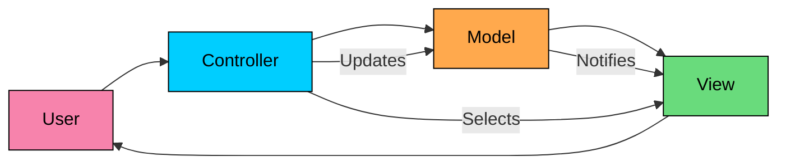
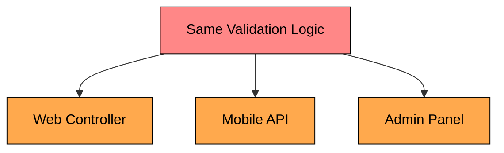
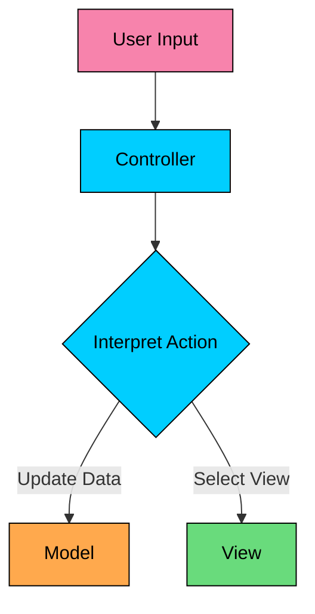
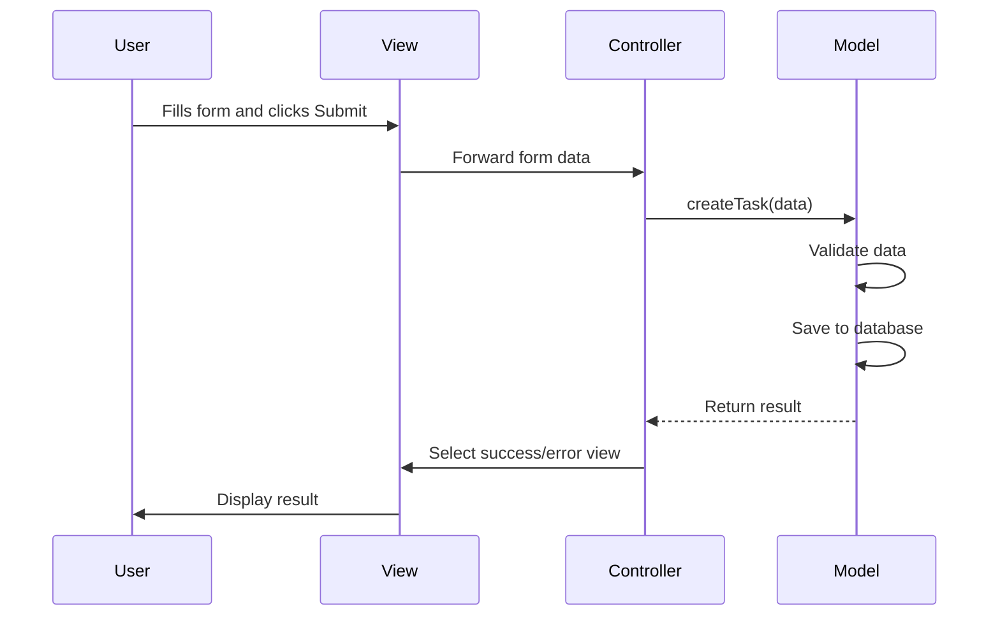

Imagine you're building an issue tracking system like Jira. You start with a single class that handles everything: fetching tasks from the database, formatting them as HTML, and processing form submissions. 

It works, until the product team wants a mobile app with JSON responses. Then they want a Kanban board with a different layout. Now you're duplicating business logic across three places, and a simple validation rule change requires editing multiple files.

Your presentation logic is tangled with business rules. Your database queries are scattered across UI code. Testing anything requires spinning up the entire application.

The **MVC (Model-View-Controller) Pattern** solves this by separating your application into three distinct components, each with a single responsibility.

---

# 1. What is the MVC Pattern"

> [!PAYWALL] This content is for premium members only.

**MVC (Model-View-Controller)** is an architectural pattern that divides an application into three interconnected components:

- **Model:** Manages data and business logic
- **View:** Handles the display and user interface
- **Controller:** Processes user input and coordinates between Model and View

> The key insight: Separate what your application does (Model) from how it looks (View) and how users interact with it (Controller).



The pattern was introduced in Smalltalk-80 in the 1970s and has since become the foundation for most UI frameworks and web applications.

**But why not just put everything in one place"**

---

# 2. The Problem: Monolithic UI Code

Without MVC, applications become tangled messes where UI, business logic, and data access are intertwined. This approach has several problems:

### Problem 1: Code Duplication

When you need a mobile app, you duplicate the validation logic. When you add an admin panel, you duplicate it again. Now you have the same business rules in three places.



### Problem 2: Hard to Test

How do you test if the salary calculation is correct without rendering HTML" You cannot, because the calculation is buried inside presentation code.

### Problem 3: Parallel Development Blocked

The frontend developer cannot work on the UI while the backend developer works on business logic. They're constantly stepping on each other's code.

### Problem 4: Change Ripples Everywhere

Changing the database schema requires editing UI code. Changing the UI requires touching business logic. Everything is connected to everything.

### Problem 5: No Reusability

The employee validation logic cannot be reused for a batch import feature because it's embedded in the web form handler.

---

# 3. The Three Components

MVC separates concerns into three distinct components, each with clear responsibilities.

[Embed: https://link.excalidraw.com/readonly/mZ0yhj4Jly9qhhx3AvTT](https://link.excalidraw.com/readonly/mZ0yhj4Jly9qhhx3AvTT)

### 3.1 Model

The Model is the heart of your application. It manages data, business rules, and application state.

#### **Responsibilities:**

- Encapsulates application data
- Implements business logic and validation
- Notifies observers when data changes
- Persists data (or delegates to a repository)

```java
$78
```

**The Model knows nothing about how it will be displayed.** It does not know if it's being shown in a web page, mobile app, or command line. This is what makes it reusable.

### 3.2 View

The View is responsible for presenting data to the user. It renders the Model's data in a format suitable for the user interface.

#### **Responsibilities:**

- Displays data from the Model
- Contains no business logic
- Updates when the Model changes
- Sends user actions to the Controller

```java
$7f
```

**The View should be "dumb."** It displays what the Model tells it to display and forwards user actions to the Controller. It does not decide what to do with those actions.

### 3.3 Controller

The Controller is the coordinator. It receives user input, decides what to do with it, and orchestrates the response.

#### **Responsibilities:**

- Receives and interprets user input
- Calls appropriate Model methods
- Selects the View to render
- Does not contain business logic



```java
$86
```

**The Controller is thin.** It delegates business logic to the Model and presentation to the View. If your Controller is getting large, you're probably putting business logic in the wrong place.

---

# 4. How MVC Handles User Interactions

Let's trace a typical user interaction through the MVC pattern.

### Example: User creates a new task



#### **Step-by-step flow:**

1. **User interacts with View:** The user fills out a task form and clicks submit
2. **View forwards to Controller:** The View captures the input and sends it to the Controller
3. **Controller calls Model:** The Controller asks the Model to create a task
4. **Model processes request:** The Model validates data and saves to the database
5. **Model returns result:** Success or failure is returned to the Controller
6. **Controller selects View:** Based on the result, the Controller chooses which View to render
7. **View displays result:** The user sees a success message or error form
