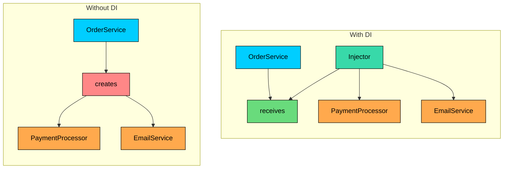
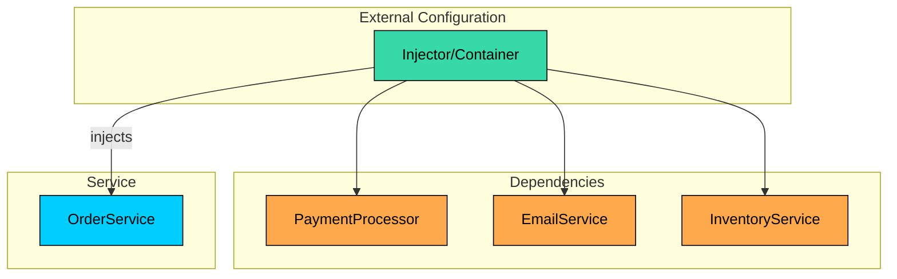
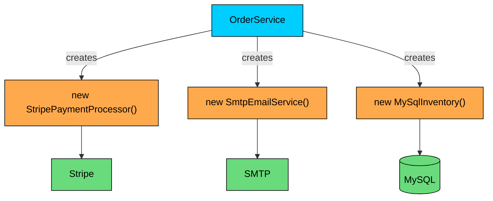
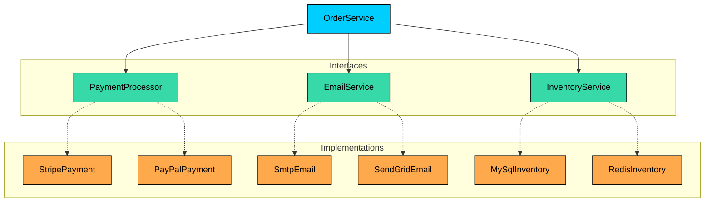
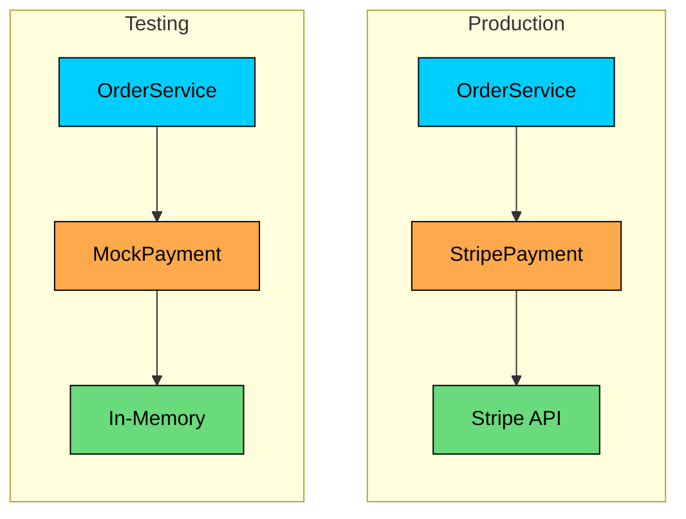
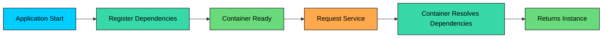

Most codebases start clean, then slowly get messy in the same place: **object creation inside business classes**.

You write:

```java
class OrderService {
    private final PaymentGateway gateway = new StripeGateway();
    private final Notifier notifier = new EmailNotifier();
}
```

It works, until requirements change: mock the gateway for tests, switch notifier per user, add retries/logging, support a new provider. Now `OrderService` is doing two jobs: **business logic** and **wiring dependencies**. That tight coupling makes changes risky and testing painful.

The **Dependency Injection (DI) Pattern** fixes this by flipping control: instead of creating collaborators, a class **receives** them (usually via constructor). Your class depends on *interfaces*, and composition happens outside.

---

# 1. What is Dependency Injection"

> [!PAYWALL] This content is for premium members only.

**Dependency Injection** is a design pattern where an object receives its dependencies from an external source rather than creating them itself.

**The key insight:** Don't call us, we'll call you. A class should not instantiate its collaborators. Instead, collaborators should be provided (injected) by someone else.



The pattern is part of a broader principle called **Inversion of Control (IoC)**, where the control of object creation is inverted from the class itself to an external entity.

---

# 2. The Problem: Tight Coupling

Without dependency injection, classes directly instantiate their dependencies. This creates tight coupling that ripples through your codebase.

This approach has several problems:

### Problem 1: Impossible to Test in Isolation

When `OrderService` creates a `StripePaymentProcessor` internally, every test actually hits the Stripe API. You cannot test order logic without making real payment calls.

### Problem 2: Cannot Swap Implementations

Switching from Stripe to PayPal means finding every place that creates `StripePaymentProcessor` and changing it. If you have 50 services using payments, that's 50 files to modify.

### Problem 3: Hidden Dependencies

Looking at the class signature tells you nothing about what it needs:

### Problem 4: Violates Single Responsibility

The class now has two jobs: its actual business logic AND managing the lifecycle of its dependencies.

### Problem 5: Hard to Configure

What if `EmailService` needs different SMTP settings in development vs production" The configuration is buried inside the class that uses it.

---

# 3. The Solution: Inject Dependencies

With dependency injection, classes declare what they need and receive it from outside:



Now `OrderService`:

- Declares its dependencies explicitly
- Receives them through its constructor
- Works with any implementation that satisfies the interface
- Can be tested with mock implementations

---

# 4. Three Types of Dependency Injection

There are three ways to inject dependencies into a class. Each has its use cases.

### 4.1 Constructor Injection (Recommended)

Dependencies are provided through the class constructor.

#### **Advantages:**

- Dependencies are explicit and visible in the constructor signature
- Object is fully initialized after construction
- Dependencies can be made `final` (immutable)
- Easy to see if a class has too many dependencies

**When to Use:** This should be your default choice for required dependencies.

### 4.2 Setter Injection

Dependencies are provided through setter methods after construction.

#### **Advantages:**

- Allows optional dependencies
- Dependencies can be changed at runtime
- Useful for circular dependency scenarios

#### **Disadvantages:**

- Object may be in an invalid state if setters aren't called
- Dependencies are mutable (can be changed unexpectedly)
- Harder to ensure all dependencies are provided

**When to Use:** For optional dependencies or when you need to change dependencies at runtime.

### 4.3 Interface Injection

The dependency provides an injector method that clients must implement.

**When to Use:** Rarely. This is the least common form. You might see it in plugin architectures or frameworks.

### Comparison

| Type        | Best For                 | Dependencies                 |
| Constructor | Required dependencies    | Immutable, explicit          |
| Setter      | Optional dependencies    | Mutable, can be null         |
| Interface   | Framework integration    | Defined by contract          |

---

# 5. Dependency Injection in Action

Let's visualize how DI transforms our order processing system:

### Before: Tight Coupling



### After: Loose Coupling



The `OrderService` depends on interfaces, not implementations. Any class implementing those interfaces can be injected.

---

# 6. Testing with Dependency Injection

The biggest benefit is testability. With DI, you can inject test doubles:



No Stripe API calls. No emails sent. No database connections. Fast, reliable, isolated tests.

---

# 7. DI Containers and Frameworks

While you can do dependency injection manually (as shown above), DI containers automate the process.

#### Popular DI frameworks:

| ##### Language | ##### Framework |
| --- | --- |
| **Java** | Spring, Guice, Dagger |
| **C#** | ASP.NET Core DI, Autofac |
| **Python** | dependency-injector |
| **TypeScript** | InversifyJS, tsyringe |

### How Containers Work



1. **Registration:** You tell the container which implementation to use for each interface
2. **Resolution:** When you request a service, the container creates it with all dependencies
3. **Lifecycle Management:** The container manages singleton vs transient instances
