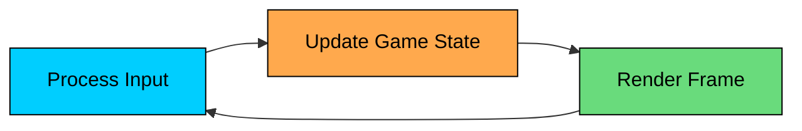

Imagine you’re building a simple game. Your character moves across the screen, enemies spawn, and the score updates. So you write code that waits for user input and then updates the game.

But something feels off: the character only moves when you press a key. Enemies stop between inputs. Everything “pauses” the moment the player does. The game feels broken.

That’s because traditional programs are often event-driven. They wait for something to happen, respond, and then wait again. Games can’t afford that. Enemies must keep moving even when the player is idle. Physics has to run continuously. Animations should stay smooth.

The **Game Loop Pattern** fixes this by running a continuous loop that, on every frame, processes input, updates the game state, and renders the result whether or not the player does anything.

---

# 1. What is the Game Loop Pattern"

The **Game Loop Pattern** continuously cycles through three phases: processing input, updating the game world, and rendering the current state to the screen.

The key insight is that real-time applications must progress even without external events. Unlike web servers that respond to requests, games must actively drive their own simulation forward.



This pattern was first formalized in game development but has spread to simulations, real-time visualizations, animation frameworks, and any system that needs continuous, time-based updates.

**But why not just use event handlers and timers"**

---

# 2. Why Event-Driven Doesn't Work for Real-Time

Consider building a simple game with traditional event-driven programming:

```mermaid
flowchart TD
    A[Wait for Event]:::primary --> B{Event Type"}:::orange
    B -->|Key Press| C[Move Player]:::green
    B -->|Mouse Click| D[Fire Weapon]:::green
    B -->|Timer| E[Update Enemy]:::green
    C --> A
    D --> A
    E --> A

    classDef primary fill:#00ceff,stroke:#000,color:#000
    classDef orange fill:#ffa94d,stroke:#000,color:#000
    classDef green fill:#69db7c,stroke:#000,color:#000
```

This approach has several problems:

#### Problem 1: World Freezes Between Events

The game only advances when something happens. If the player stops pressing keys, everything pauses. Enemies stop moving. Projectiles hang mid-air.

#### Problem 2: Inconsistent Timing

Timer-based updates fire at intervals, but the actual execution time varies. Heavy processing can cause timers to back up or skip entirely.

#### Problem 3: Unpredictable Frame Rate

The time between renders depends on event frequency. Fast input means fast updates. Slow input means choppy visuals. The experience varies wildly.

#### Problem 4: Tangled Logic

Game logic gets scattered across different event handlers. Coordinating updates between player movement, enemy AI, physics, and rendering becomes a nightmare.

#### Problem 5: Platform Dependency

Different platforms handle events and timers differently. A game that runs smoothly on one machine stutters on another.

---

# 3. How the Game Loop Works

The pattern centralizes all updates into a single, continuously running loop:

```mermaid
flowchart TD
    A[Start Game]:::secondary --> B[Initialize]:::primary
    B --> C{Game Running"}:::orange
    C -->|Yes| D[Process Input]:::primary
    D --> E[Update World]:::primary
    E --> F[Render Frame]:::green
    F --> C
    C -->|No| G[Cleanup]:::red
    G --> H[Exit]:::secondary

    classDef primary fill:#00ceff,stroke:#000,color:#000
    classDef secondary fill:#38d9a9,stroke:#000,color:#000
    classDef orange fill:#ffa94d,stroke:#000,color:#000
    classDef green fill:#69db7c,stroke:#000,color:#000
    classDef red fill:#ff8787,stroke:#000,color:#000
```

### 3.1 Process Input

Read all pending input from keyboard, mouse, network, or other sources. Store it for processing but don't act on it yet.

Input handling is **non-blocking**. The loop checks what input is available right now, stores it, and moves on. It never waits for the user to do something.

This decouples game progress from user action. The world keeps moving even when the player is idle.

### 3.2 Update Game State

Apply the input. Run AI. Simulate physics. Update positions, health, scores. This is where the game world advances by one "tick."

This is the "simulation" step. Every game entity advances by one time step:

- Player position updates based on input
- Enemies execute their AI behavior
- Projectiles move along their trajectories
- Physics simulates gravity, collisions, forces
- Game rules check win/lose conditions

The update phase should be **deterministic**. Given the same state and input, it produces the same result. This enables features like replays and network synchronization.

### 3.3 Render

Draw the current state of the world to the screen. This happens after the world is fully updated, ensuring a consistent frame.

The loop then repeats. Fast machines run more iterations per second. Slow machines run fewer. But the structure remains the same.

Transform the game state into pixels on screen. This phase is **read-only**. It does not modify game state, only visualizes it.

Separating render from update means you can skip frames if the machine is too slow. The game simulation stays accurate even if the visuals drop frames.

### Basic Game Loop Structure

---

# 4. Real-World Applications Beyond Games

The Game Loop Pattern is not just for games. Any system that needs continuous, real-time updates can benefit:

#### 4.1 Simulation Systems

Scientific simulations, traffic modeling, and weather prediction all run continuous update loops. They advance simulated time regardless of wall-clock time.

#### 4.2 Animation Frameworks

CSS animations, motion design tools, and video editors use game loops to preview animations in real-time.

#### 4.3 Real-Time Dashboards

Stock tickers, server monitoring dashboards, and live analytics tools continuously fetch data, process it, and render updates.

#### 4.4 Music and Audio Software

Digital audio workstations and synthesizers run tight loops to generate audio samples in real-time. Missing a deadline means audible glitches.

#### 4.5 Robotics and Control Systems

Autonomous vehicles, drones, and industrial robots run control loops that read sensors, compute actions, and send commands to actuators.
