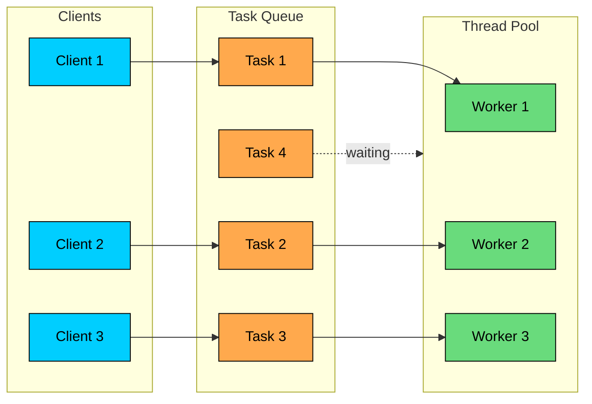
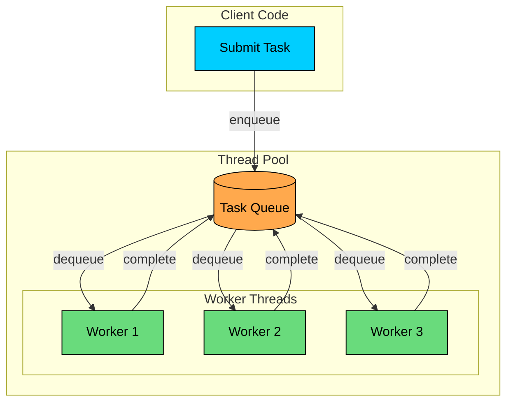
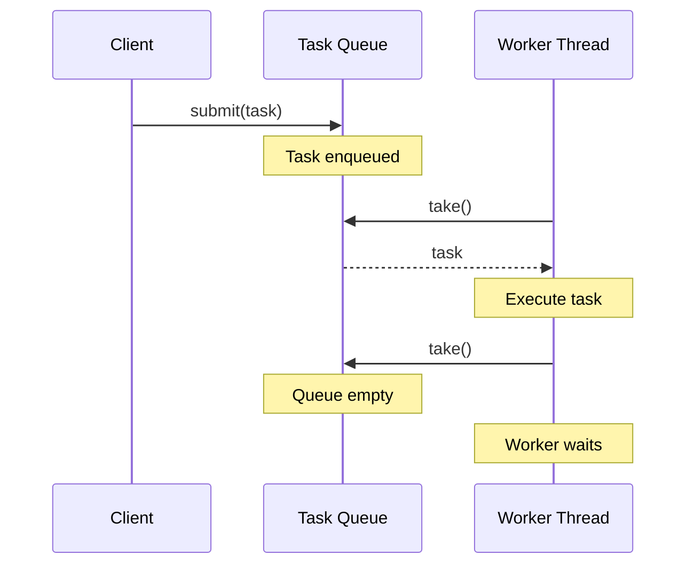
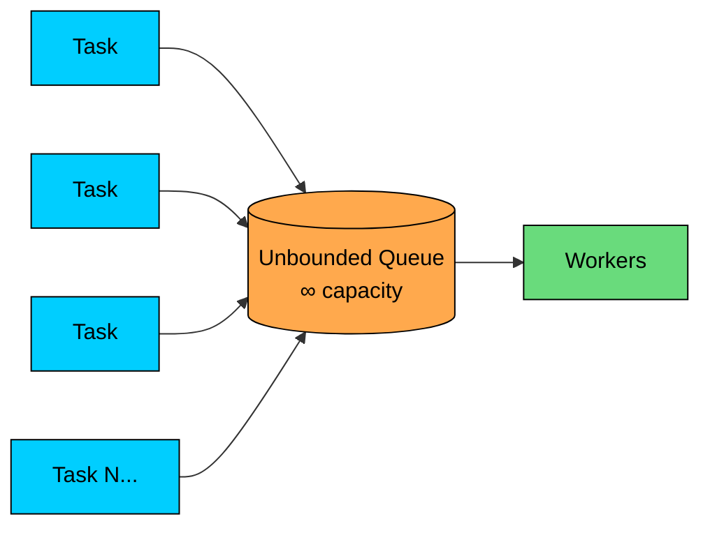
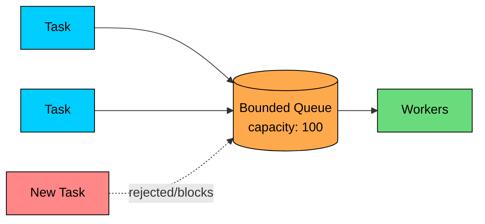
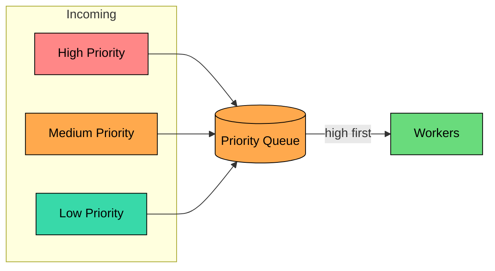
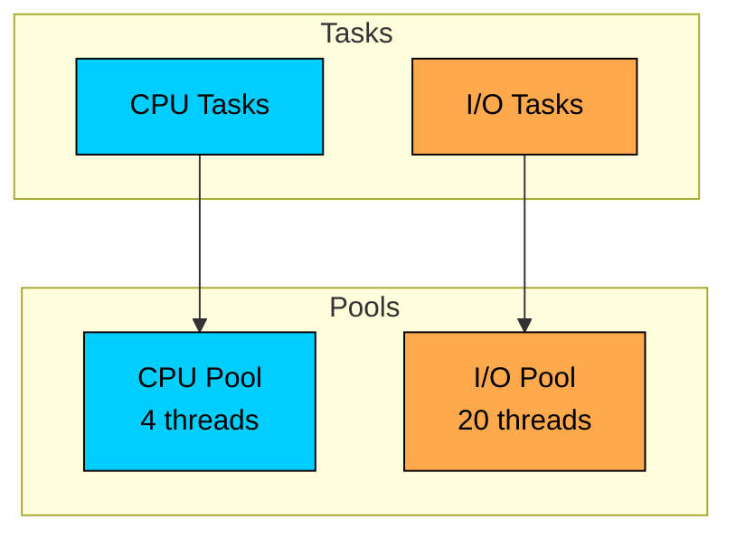

Imagine you are running a web server. It creates a new thread to handle each request. The thread processes the request, sends the response, and terminates. Simple enough.

Now imagine 10,000 users hitting your server simultaneously. That's 10,000 threads. Each thread consumes about 1MB of stack memory, so you're looking at 10GB just for thread stacks. 

The operating system is now spending more time switching between threads than actually running your code.

This is a common problem in concurrent systems. Thread creation is expensive, context switching has overhead, and unlimited threads exhaust system resources.

The **Thread Pool Pattern** solves this by reusing a fixed set of threads to execute many tasks. Instead of creating a new thread for every task, tasks are submitted to a pool where idle workers pick them up.

---

# 1. What is the Thread Pool Pattern"

> [!PAYWALL] This content is for premium members only.

The **Thread Pool Pattern** is a concurrency design pattern that maintains a collection of reusable worker threads. Tasks are submitted to a queue, and available workers pick them up for execution. When a worker finishes a task, it returns to the pool to pick up the next one.



The key insight is that thread creation and destruction are expensive operations. By reusing threads, we amortize the cost of thread creation across many tasks.

---

# 2. Why Not Create Threads On-Demand"

Creating a new thread for every task seems straightforward but has several problems.

### Problem 1: Thread Creation Overhead

Creating a thread involves:

- Allocating memory for the thread's stack (typically 1MB)
- Setting up OS-level data structures
- Registering the thread with the scheduler
- Initializing thread-local storage

For a short-lived task, this setup time may exceed the actual work time.

### Problem 2: Memory Exhaustion

Each thread consumes memory. With unbounded thread creation:

| Concurrent Tasks | Memory (Stack Only) |
|------------------|---------------------|
| 100              | 100 MB              |
| 1,000            | 1 GB                |
| 10,000           | 10 GB               |
| 100,000          | 100 GB              |

Most systems will crash long before reaching 100,000 threads.

### Problem 3: Context Switching Overhead

When you have more threads than CPU cores, the OS must constantly switch between them. Each context switch:

- Saves the current thread's state
- Loads the next thread's state
- Invalidates CPU caches

With too many threads, your CPU spends more time switching than executing.

### Problem 4: Resource Starvation

Unbounded thread creation can starve the system of resources needed for actual work. Database connections, file handles, and network sockets are all limited. Too many threads competing for these resources leads to contention and failures.

---

# 3. How the Thread Pool Works

The pattern consists of three main components:



1. **Task Queue**: A thread-safe queue holding tasks waiting for execution
2. **Worker Threads**: A fixed number of threads that process tasks
3. **Pool Manager**: Coordinates task submission and worker lifecycle

### The Execution Flow



1. Client submits a task to the pool
2. Task is added to the queue
3. An idle worker picks the task from the queue
4. Worker executes the task
5. Worker returns to pick the next task (or waits if queue is empty)

---

# 4. Implementation

Let's build a thread pool from scratch to understand its internals. The implementation has three parts: the worker, the task queue, and the pool itself.

### Basic Thread Pool

```java
$8e
```

### Worker Thread Lifecycle

```mermaid
flowchart TD
    A[Start]:::secondary --> B{Pool Shutdown"}:::orange
    B -->|No| C[Take Task from Queue]:::primary
    C --> D{Task Available"}:::orange
    D -->|No| E[Wait/Block]:::secondary
    E --> B
    D -->|Yes| F[Execute Task]:::green
    F --> B
    B -->|Yes| G[Exit]:::red

    classDef primary fill:#00ceff,stroke:#000,color:#000
    classDef secondary fill:#38d9a9,stroke:#000,color:#000
    classDef orange fill:#ffa94d,stroke:#000,color:#000
    classDef green fill:#69db7c,stroke:#000,color:#000
    classDef red fill:#ff8787,stroke:#000,color:#000
```

The key insight is that workers never terminate after completing a task. They return to the queue and wait for more work. This is what makes the pattern efficient.

---

# 5. Task Queue Strategies

The task queue determines how work is distributed. Different queue types have different behaviors.

### 5.1 Unbounded Queue

Tasks are always accepted, queue grows indefinitely.



**Pros:** Never rejects tasks.

**Cons:** Can cause memory exhaustion if tasks arrive faster than they're processed.

### 5.2 Bounded Queue

Queue has a maximum size. When full, new tasks are rejected or the caller blocks.



**Pros:** Provides back-pressure, prevents memory exhaustion.

**Cons:** Must handle task rejection.

### 5.3 Priority Queue

Tasks with higher priority are executed first.



**Pros:** Important tasks get processed first.

**Cons:** Low-priority tasks may starve.

---

# 6. Pool Sizing Strategies

Choosing the right pool size is critical. Too few threads underutilize your hardware. Too many cause excessive context switching.

### 6.1 For CPU-Bound Tasks

Tasks that primarily compute (no waiting for I/O).

Adding more threads than cores just adds context-switching overhead without improving throughput.

### 6.2 For I/O-Bound Tasks

Tasks that spend time waiting for I/O (network, disk, database).

```shell
Pool Size = Number of CPU Cores × (1 + Wait Time / Compute Time)
```

If tasks spend 80% of their time waiting and 20% computing:

```shell
Pool Size = 4 cores × (1 + 0.8/0.2) = 4 × 5 = 20 threads
```

### 6.3 Mixed Workloads

For applications with both CPU and I/O-bound tasks, consider separate pools:



This prevents I/O tasks from consuming all threads and starving CPU tasks.
