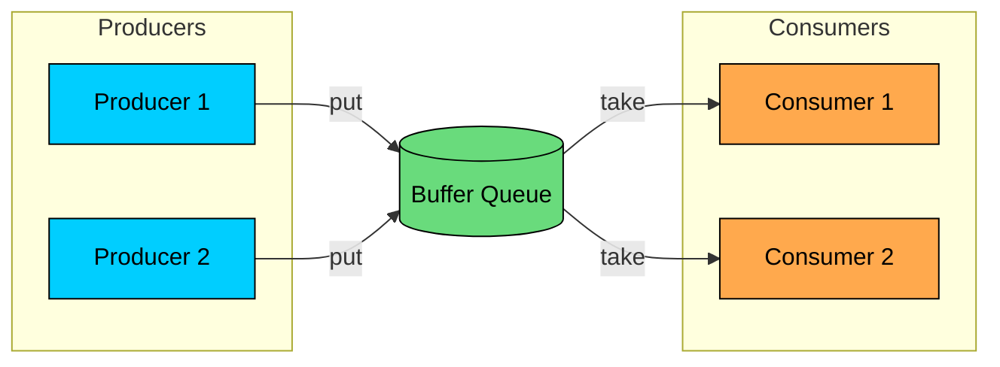
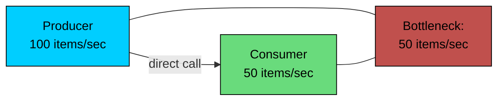
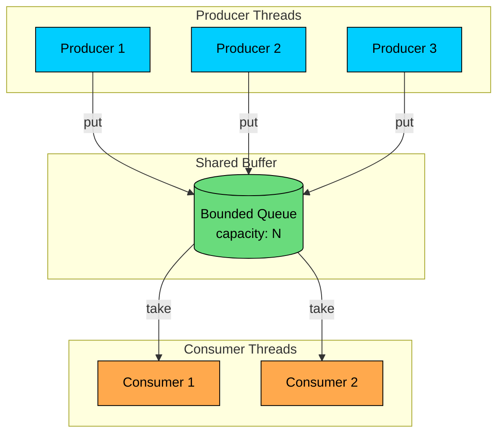
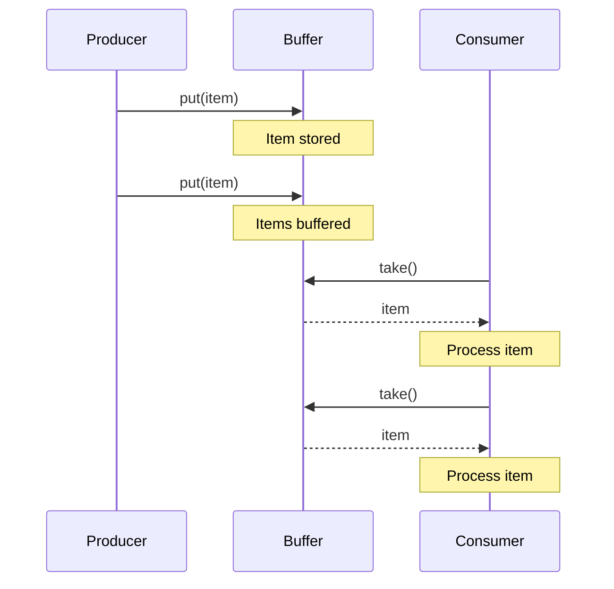
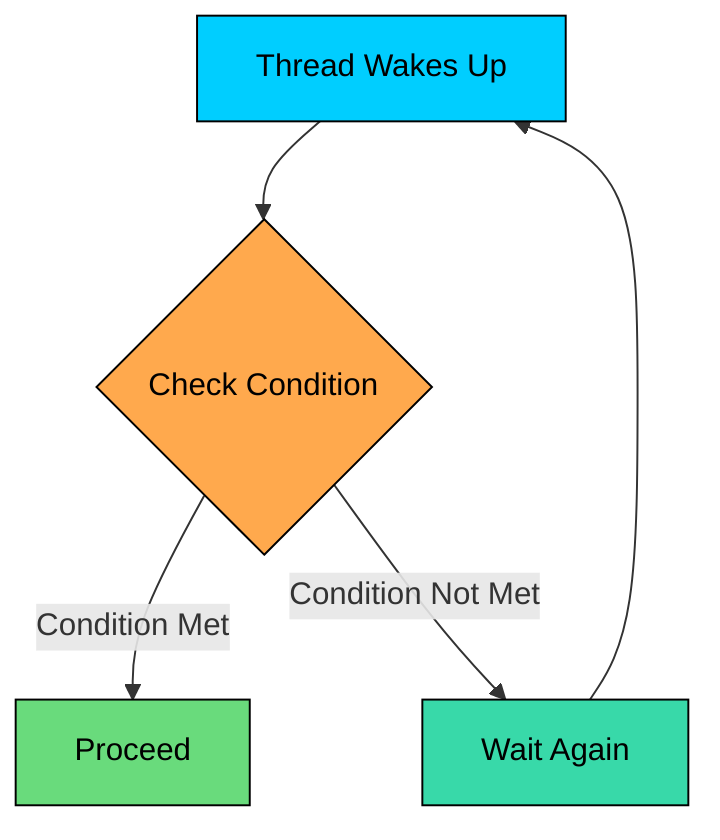
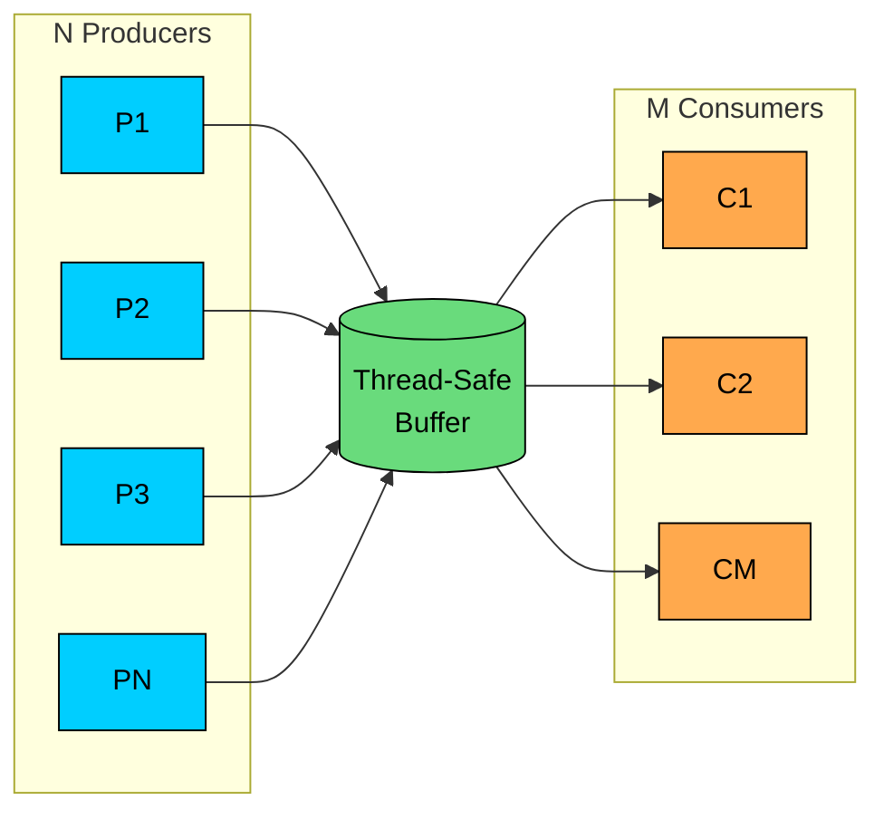
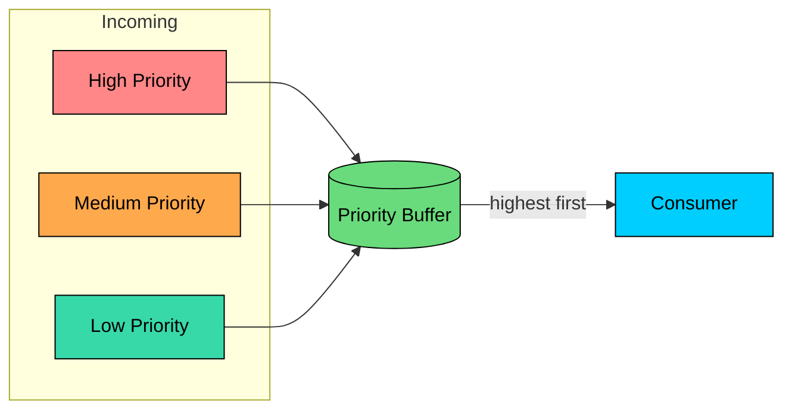
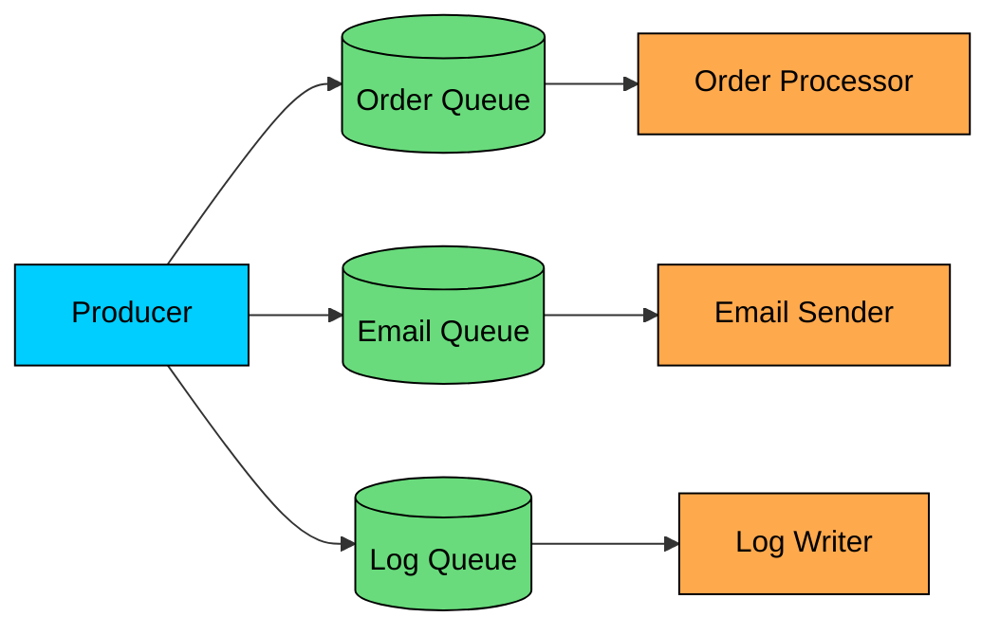
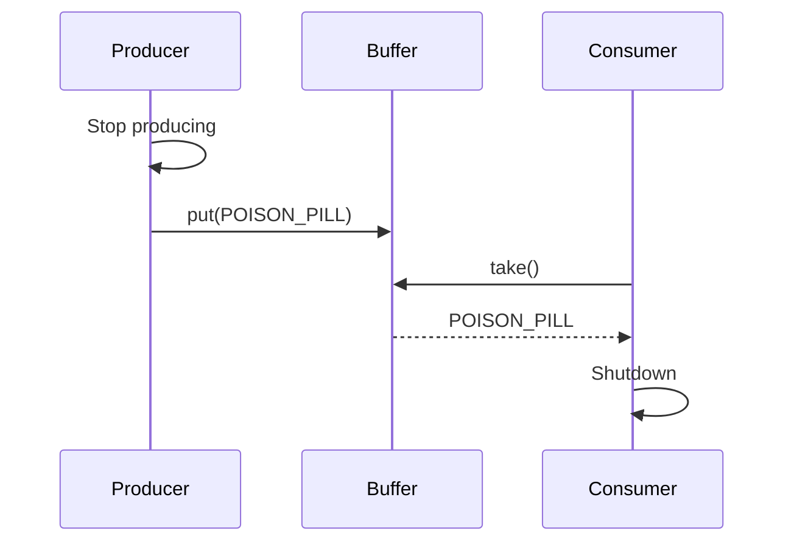

Imagine you're building an application that processes user uploads. Users upload files, and your system needs to process them (resize images, scan for viruses, extract metadata).

If you process each file as it arrives, you create a tight coupling between receiving files and processing them. When upload traffic spikes, processing becomes a bottleneck. When processing is slow, uploads back up.

The **Producer-Consumer Pattern** solves this by introducing a buffer between components. Producers add work to the buffer. Consumers take work from it. Neither knows about the other. The buffer absorbs speed differences and decouples the components.

In this chapter, we'll explore:

- What is the Producer-Consumer Pattern"
- The problem it solves
- How it works
- Implementation
- Variations and how to shutdown gracefully

---

# 1. What is the Producer-Consumer Pattern"

> [!PAYWALL] This content is for premium members only.

The **Producer-Consumer Pattern** is a concurrency design pattern where producer threads generate data and place it in a shared buffer, while consumer threads take data from the buffer and process it. 

The buffer acts as a synchronization point that decouples producers from consumers.



The key insight is that producers and consumers operate independently. A producer doesn't wait for a consumer to process its item before producing the next one. A consumer doesn't wait for a specific producer. The buffer handles all coordination.

---

# 2. Why Decouple Producers and Consumers"

Without a buffer, producers and consumers must communicate directly. This creates several problems.

### Problem 1: Speed Mismatch

Producers and consumers rarely operate at the same speed. Without buffering:



The producer must slow down to match the consumer. Half its capacity is wasted.

### Problem 2: Burst Traffic

Real workloads are bursty. Log entries spike during peak hours. Orders surge during sales. Without buffering, the system either drops data or crashes.

### Problem 3: Tight Coupling

Direct communication means producers must know about consumers. Adding a new consumer type requires changing the producer. Testing requires mocking consumers. The system becomes rigid.

### Problem 4: Blocking Operations

If a consumer is slow (waiting for I/O, processing heavy computation), the producer blocks. One slow consumer affects all producers.

### Problem 5: Failure Propagation

If a consumer crashes, what happens to the producer" Without a buffer, the producer fails too. The failure cascades through the system.

---

# 3. How the Producer-Consumer Pattern Works

The pattern introduces a shared buffer that acts as an intermediary.



### The Buffer's Role

The buffer provides three critical functions:

1. **Decoupling:** Producers and consumers don't know about each other
2. **Buffering:** Absorbs temporary speed differences
3. **Synchronization:** Handles thread-safe access to shared data

### The Execution Flow



Producers and consumers operate on their own schedules. The buffer smooths out timing differences.

---

# 4. Implementation

The core of the pattern is a thread-safe bounded buffer. It must handle:

- Multiple threads accessing it simultaneously
- Blocking when the buffer is full (producers wait)
- Blocking when the buffer is empty (consumers wait)

### Basic Bounded Buffer

### Why Use `while` Instead of `if`"

The `while` loop is critical. A thread might be woken up even when the condition isn't met (spurious wakeup) or another thread might have changed the state. Always recheck the condition after waking.



### Using the Buffer

```java
BoundedBuffer<Task> buffer = new BoundedBuffer<>(100);

// Producer thread
void produce() {
    while (running) {
        Task task = generateTask();
        buffer.put(task);  // Blocks if buffer is full
    }
}

// Consumer thread
void consume() {
    while (running) {
        Task task = buffer.take();  // Blocks if buffer is empty
        process(task);
    }
}
```

---

# 5. Multiple Producers and Consumers

Real systems often have multiple producers and consumers. The pattern scales naturally.



### Key Properties

1. **Thread Safety:** The buffer handles synchronization. Each producer and consumer just calls `put()` or `take()`.
2. **Load Balancing:** Work is automatically distributed among consumers. Whichever consumer is ready takes the next item.
3. **Independent Scaling:** Add more producers or consumers without changing the others.

### Example: Multi-Producer Multi-Consumer Setup

```java
$8e
```

A bounded buffer naturally provides back-pressure. When consumers can't keep up, the buffer fills. When full, producers block. This slows down the entire pipeline gracefully instead of crashing.

---

# 6. Variations of the Pattern

### 6.1 Priority Queue Buffer

Some items are more urgent than others. Use a priority queue so important items are processed first.



**Trade-off:** Low-priority items may starve if high-priority items keep arriving.

### 6.2 Multiple Queues

Different item types go to different queues, each with dedicated consumers.



**Benefit:** Different processing rates and scaling for each type.

### 6.3 Work Stealing

Consumers have local queues. When a consumer's queue is empty, it steals from another consumer's queue.

**Benefit:** Better load balancing, reduced contention on central queue.

---

# 7. Graceful Shutdown

Shutting down a producer-consumer system requires care. You must:

1. Stop producers from adding new items
2. Let consumers drain the remaining items
3. Signal consumers to stop

### Poison Pill Approach

Send a special "poison pill" item that tells consumers to shut down.



```java
public class GracefulShutdown {
    private static final Task POISON_PILL = new Task("SHUTDOWN");

    public void shutdown() {
        // Stop producers
        for (Thread producer : producers) {
            producer.interrupt();
        }

        // Send poison pill for each consumer
        for (int i = 0; i < consumers.size(); i++) {
            buffer.put(POISON_PILL);
        }
    }

    // Consumer loop
    void consume() {
        while (true) {
            Task task = buffer.take();
            if (task == POISON_PILL) {
                break; // Graceful exit
            }
            process(task);
        }
    }
}
```

