In LLD interviews, knowing design patterns is less important than knowing **when to use them and why**. In most interviews, you are evaluated on your design judgement and not on how many patterns you know.

Most candidates either force patterns into simple problems or avoid them completely and end up with rigid code. The right approach is **problem-first**: spot the design pain point (messy object creation, changing behavior, tight coupling, hard-to-extend flow), then choose the pattern that directly solves it.

In this chapter, you’ll learn a practical way to recognize these signals, map them to the right patterns, and explain your choice clearly, so your design feels intentional, clean, and extensible.

---

# 1. Let the Problem Guide You

> [!PAYWALL] This content is for premium members only.

The biggest mistake candidates make is not picking the wrong pattern. It is reaching for patterns too early, before the problem demands one.

A class needs to create an object" Factory. Two classes talk to each other" Observer. A method has two lines of conditional logic" Strategy. Before they know it, a simple problem has six patterns, twelve interfaces, and a codebase that is harder to read than the problem it solves.

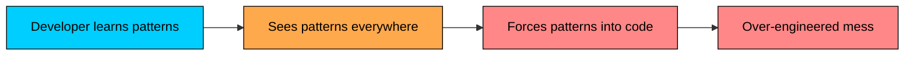

In an interview, this is a red flag. It signals that you are pattern-matching from a textbook instead of thinking about the problem. Interviewers want to see judgment, not a pattern catalog dump.

Using the wrong pattern is worse than using no pattern at all. Each unnecessary pattern adds classes, interfaces, and indirection that make the code harder to understand without solving any real problem.

The sweet spot is recognizing genuine pattern opportunities and articulating why the pattern helps in that specific situation.

### Three Principles to Internalize

- **Start with the Pain:** Don't start with a pattern. Start with a problem. Is your code hard to change" Do you have a giant if/else block that keeps growing" Is creating an object overly complex" Does changing one part of your system break three others" These "code smells" are symptoms. Design patterns are the cure.
- **Patterns are Discovered, Not Invented:** You shouldn't force a pattern onto your code. You should recognize that the problem you're facing is a classic one that has been solved before. The pattern should feel like a natural fit, an "Aha!" moment of discovery.
- **Simplicity is the Default (KISS & YAGNI):** Always start with the simplest possible solution. If a simple if statement or a direct class instantiation works and the requirements are unlikely to change, stick with it. The principles "Keep It Simple, Stupid" (KISS) and "You Ain't Gonna Need It" (YAGNI) are your first line of defense against complexity. A pattern's cost (extra classes, more indirection) must be justified by the flexibility it provides.

---

# 2. A Framework for Pattern Selection

When a specific design pain appears, run it through three questions:

1. **What category does this problem fall into"** Is it about creating objects, structuring relationships, or managing behavior"
2. **What signal am I seeing"** What specific symptom or requirement triggered the need for a pattern"
3. **Which pattern matches that signal"** Within the category, which pattern addresses exactly this kind of signal"

### Top-Level Decision

```mermaid
flowchart TD
    Q["What is the core problem""]:::primary
    Q --> C1{"Is it about<br/>HOW objects<br/>are created""}:::orange
    Q --> C2{"Is it about<br/>HOW objects are<br/>composed/structured""}:::orange
    Q --> C3{"Is it about<br/>HOW objects<br/>communicate/behave""}:::orange

    C1 -->|Yes| CR[Creational<br/>Patterns]:::green
    C2 -->|Yes| ST[Structural<br/>Patterns]:::secondary
    C3 -->|Yes| BH[Behavioral<br/>Patterns]:::purple

    classDef primary fill:#00ceff,stroke:#000,color:#000
    classDef orange fill:#ffa94d,stroke:#000,color:#000
    classDef green fill:#69db7c,stroke:#000,color:#000
    classDef secondary fill:#38d9a9,stroke:#000,color:#000
    classDef purple fill:#9775fa,stroke:#000,color:#000
```

### Category Signals

| Category | You Feel This Pain | Typical Trigger |
|----------|-------------------|-----------------|
| **Creational** | Object creation is complex, conditional, or scattered | `new` with conditionals, complex constructors, global shared resources |
| **Structural** | Classes need to work together but their interfaces do not fit, or you need to add behavior without modifying existing classes | Wrapping, adapting, composing, simplifying interfaces |
| **Behavioral** | Objects need to communicate, change behavior dynamically, or coordinate actions | Algorithms that vary, state-dependent behavior, event notification, undo/redo |

Once you identify the category, use the decision trees below to narrow down to a specific pattern.

### Creational Decision Tree

```mermaid
flowchart TD
    START["Creational Problem"]:::primary
    START --> Q1{"Need exactly ONE<br/>shared instance""}:::orange
    Q1 -->|Yes| SING[Singleton]:::green
    Q1 -->|No| Q2{"Object has many<br/>optional parameters<br/>or complex setup""}:::orange
    Q2 -->|Yes| BUILD[Builder]:::green
    Q2 -->|No| Q3{"Need to create objects<br/>without specifying<br/>exact class""}:::orange
    Q3 -->|Yes| FACT[Factory Method]:::green
    Q3 -->|No| Q4{"Need families of<br/>related objects""}:::orange
    Q4 -->|Yes| ABSFACT[Abstract Factory]:::green
    Q4 -->|No| SIMPLE["Simple constructor<br/>is fine"]:::secondary

    classDef primary fill:#00ceff,stroke:#000,color:#000
    classDef orange fill:#ffa94d,stroke:#000,color:#000
    classDef green fill:#69db7c,stroke:#000,color:#000
    classDef secondary fill:#38d9a9,stroke:#000,color:#000
```

### Structural Decision Tree

```mermaid
flowchart TD
    START["Structural Problem"]:::primary
    START --> Q1{"Need to add behavior<br/>to objects dynamically<br/>without subclassing""}:::orange
    Q1 -->|Yes| DEC[Decorator]:::green
    Q1 -->|No| Q2{"Need to simplify<br/>a complex subsystem<br/>behind one interface""}:::orange
    Q2 -->|Yes| FAC[Facade]:::green
    Q2 -->|No| Q3{"Need to treat individual<br/>objects and groups<br/>uniformly""}:::orange
    Q3 -->|Yes| COMP[Composite]:::green
    Q3 -->|No| Q4{"Need to make<br/>incompatible interfaces<br/>work together""}:::orange
    Q4 -->|Yes| ADAPT[Adapter]:::green
    Q4 -->|No| SIMPLE["Direct composition<br/>is fine"]:::secondary

    classDef primary fill:#00ceff,stroke:#000,color:#000
    classDef orange fill:#ffa94d,stroke:#000,color:#000
    classDef green fill:#69db7c,stroke:#000,color:#000
    classDef secondary fill:#38d9a9,stroke:#000,color:#000
```

### Behavioral Decision Tree

```mermaid
flowchart TD
    START["Behavioral Problem"]:::primary
    START --> Q1{"Multiple algorithms<br/>for the same task,<br/>swappable at runtime""}:::orange
    Q1 -->|Yes| STRAT[Strategy]:::green
    Q1 -->|No| Q2{"Object changes behavior<br/>based on its<br/>internal state""}:::orange
    Q2 -->|Yes| STATE[State]:::green
    Q2 -->|No| Q3{"One object changes,<br/>many others need<br/>to react""}:::orange
    Q3 -->|Yes| OBS[Observer]:::green
    Q3 -->|No| Q4{"Need to encapsulate<br/>requests as objects<br/>for undo/queue/log""}:::orange
    Q4 -->|Yes| CMD[Command]:::green
    Q4 -->|No| Q5{"Need to reduce<br/>direct dependencies<br/>between components""}:::orange
    Q5 -->|Yes| MED[Mediator]:::green
    Q5 -->|No| SIMPLE["Direct method calls<br/>are fine"]:::secondary

    classDef primary fill:#00ceff,stroke:#000,color:#000
    classDef orange fill:#ffa94d,stroke:#000,color:#000
    classDef green fill:#69db7c,stroke:#000,color:#000
    classDef secondary fill:#38d9a9,stroke:#000,color:#000
```

---

# 3. Top 10 Design Patterns for LLD Interviews

While there are dozens of design patterns, a select few appear frequently in LLD interviews because they perfectly showcase core design principles like abstraction, encapsulation, and polymorphism. Mastering this set will prepare you for a vast majority of interview problems.

| Priority | Pattern | Category | Interview Frequency |
|----------|---------|----------|---------------------|
| Must Know | Strategy | Behavioral | Very High |
| Must Know | Observer | Behavioral | Very High |
| Must Know | Factory Method | Creational | Very High |
| Must Know | Singleton | Creational | Very High |
| Must Know | State | Behavioral | High |
| Must Know | Builder | Creational | High |
| Must Know | Command | Behavioral | High |
| Should Know | Decorator | Structural | High |
| Should Know | Facade | Structural | Medium-High |
| Should Know | Composite | Structural | Medium |

### Strategy

**The Signal:** You see multiple algorithms or behaviors for the same operation, and the choice can change at runtime.

**When to reach for it:**

- Payment processing with multiple payment methods (credit card, PayPal, UPI)
- Sorting or filtering with different algorithms
- Pricing or discount calculation that varies by customer type
- Notification delivery through different channels

**Core Idea:** Extract each algorithm into its own class behind a common interface. The context delegates to whichever strategy is plugged in, so adding a new algorithm means adding a new class, not modifying existing code.

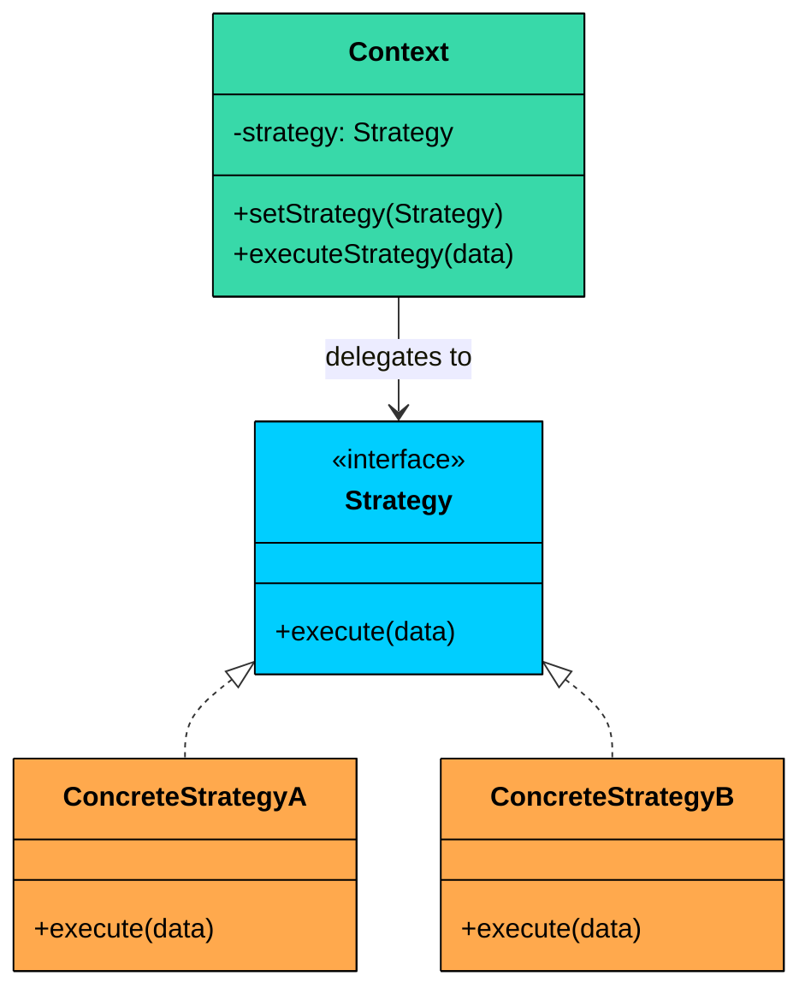

```java
interface PaymentStrategy {
    void pay(double amount);
}

class CreditCardPayment implements PaymentStrategy {
    public void pay(double amount) {
        System.out.println("Paid $" + amount + " via Credit Card");
    }
}

class PayPalPayment implements PaymentStrategy {
    public void pay(double amount) {
        System.out.println("Paid $" + amount + " via PayPal");
    }
}

class PaymentProcessor {
    private PaymentStrategy strategy;

    public void setStrategy(PaymentStrategy strategy) {
        this.strategy = strategy;
    }

    public void processPayment(double amount) {
        strategy.pay(amount);
    }
}
```

### Observer

**The Signal:** When one object changes, multiple other objects need to be notified and react, and you do not want tight coupling between them.

**When to reach for it:**

- Notification systems (email, SMS, push when an event occurs)
- Event-driven architectures (order placed triggers inventory, payment, shipping)
- UI components reacting to data model changes
- Auction systems (bidders notified of new bids)

**Core Idea:** Define a one-to-many dependency. When the subject changes state, all registered observers are notified automatically. Observers can be added or removed at runtime without modifying the subject.

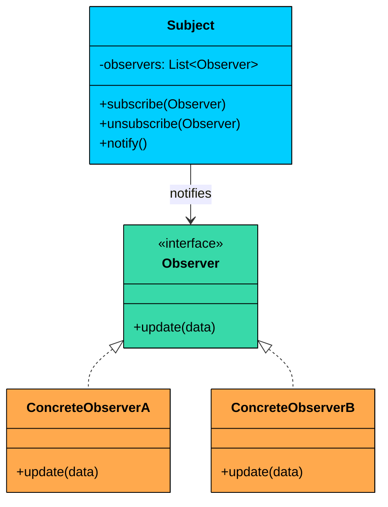

```java
interface Observer {
    void update(String event, String data);
}

class EventManager {
    private Map<String, List<Observer>> listeners = new HashMap<>();

    public void subscribe(String event, Observer observer) {
        listeners.computeIfAbsent(event, k -> new ArrayList<>()).add(observer);
    }

    public void unsubscribe(String event, Observer observer) {
        listeners.getOrDefault(event, Collections.emptyList()).remove(observer);
    }

    public void notify(String event, String data) {
        for (Observer observer : listeners.getOrDefault(event, Collections.emptyList())) {
            observer.update(event, data);
        }
    }
}

class EmailNotifier implements Observer {
    public void update(String event, String data) {
        System.out.println("Email notification: [" + event + "] " + data);
    }
}
```

### Factory Method

**The Signal:**  You have a class that needs to create an object, but should not (or cannot) know the exact concrete class. Subclasses should decide what gets created.

**When to reach for it:**

- A notification service where each channel (Email, SMS, Push) has its own creation and sending logic
- A logistics app where transport (Truck, Ship, Drone) is chosen by subclass
- A document system where each exporter (PDF, Word, HTML) creates its own document type
- A game where each level factory spawns different enemy types

**Core Idea:** Define an abstract creator class with a factory method that returns a product interface. Each concrete creator subclass overrides the factory method to produce a specific product. The creator's business logic works with the product through its interface, so it never depends on concrete product classes.

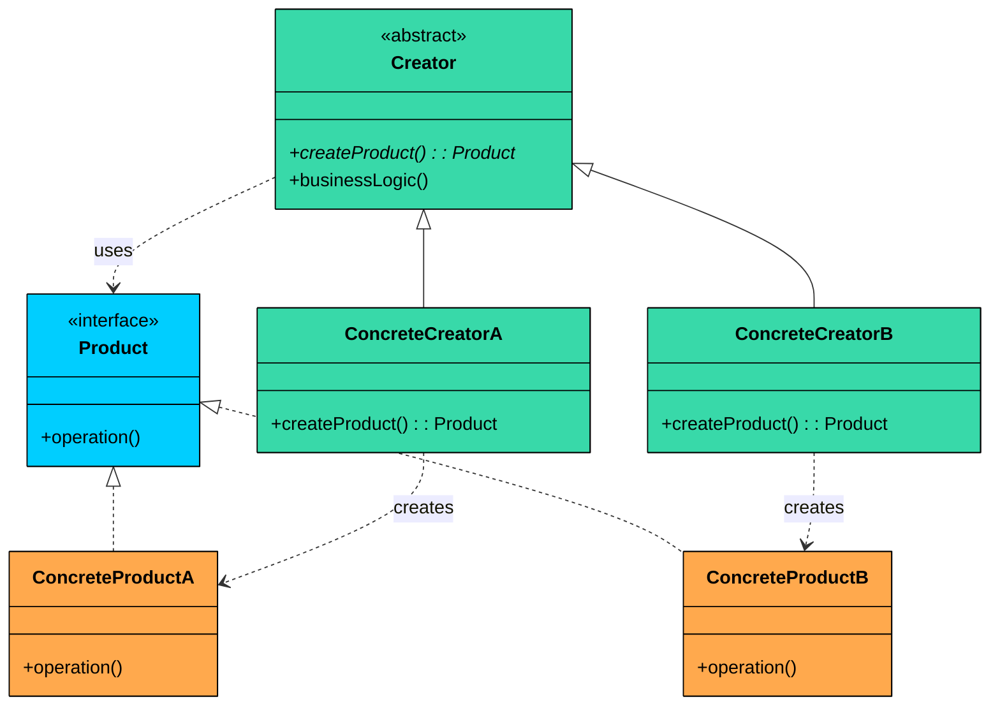

```java
$a8
```

### Singleton

**The Signal:** You need exactly one instance of a class shared across the entire application, and creating multiple instances would cause bugs or waste resources.

**When to reach for it:**

- Configuration managers, loggers, connection pools
- Cache managers shared across services
- Thread pools or task schedulers
- Any resource where duplicates cause inconsistency

**Core Idea:** Make the constructor private so no external code can call `new`. Provide a static method that creates the instance on first call and returns that same instance on every subsequent call.

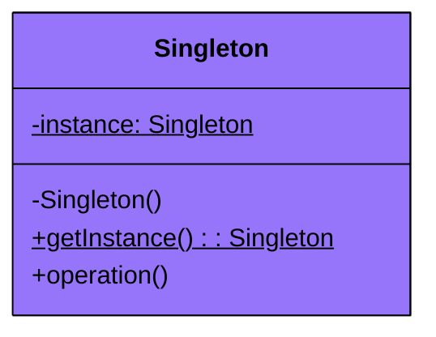

```java
public class ConfigManager {
    private static volatile ConfigManager instance;
    private Map<String, String> config = new HashMap<>();

    private ConfigManager() {
        // load config from file
    }

    public static ConfigManager getInstance() {
        if (instance == null) {
            synchronized (ConfigManager.class) {
                if (instance == null) {
                    instance = new ConfigManager();
                }
            }
        }
        return instance;
    }

    public String get(String key) {
        return config.get(key);
    }
}
```

### State

**The Signal:** An object's behavior changes depending on its internal state, and you are about to write a growing `if-else` or `switch` on a status field.

**When to reach for it:**

- Order lifecycle (Pending, Confirmed, Shipped, Delivered, Cancelled)
- Vending machine states (Idle, HasCoin, Dispensing)
- Document workflow (Draft, Review, Approved, Published)
- Connection states (Connecting, Connected, Disconnected)

**Core Idea:** Encapsulate state-specific behavior into separate state classes. The context object holds a reference to its current state and delegates behavior to it. When the state changes, the context swaps its state object, and its behavior changes automatically without any conditionals.

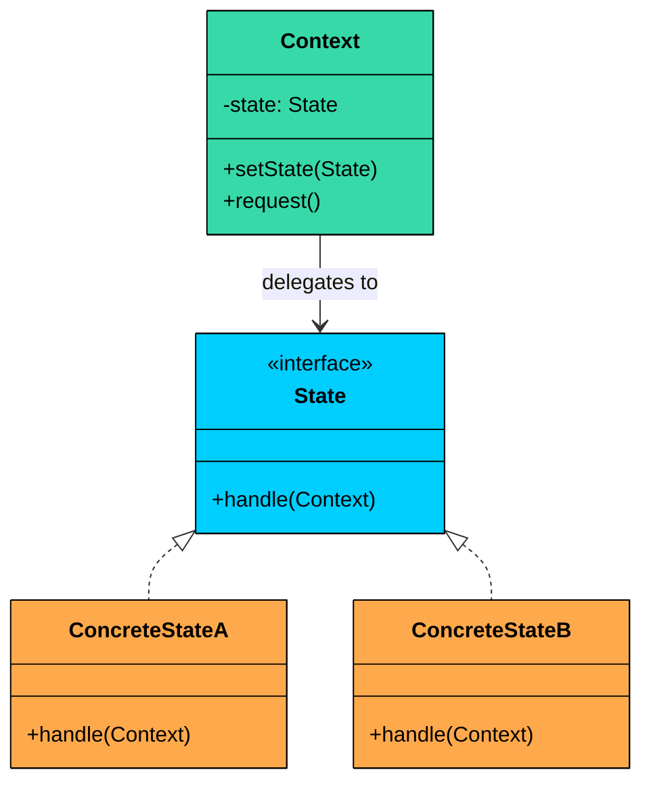

```java
interface OrderState {
    void next(Order order);
    void cancel(Order order);
    String getStatus();
}

class PendingState implements OrderState {
    public void next(Order order) { order.setState(new ConfirmedState()); }
    public void cancel(Order order) { order.setState(new CancelledState()); }
    public String getStatus() { return "PENDING"; }
}

class ConfirmedState implements OrderState {
    public void next(Order order) { order.setState(new ShippedState()); }
    public void cancel(Order order) { order.setState(new CancelledState()); }
    public String getStatus() { return "CONFIRMED"; }
}

class Order {
    private OrderState state = new PendingState();
    public void setState(OrderState state) { this.state = state; }
    public void next() { state.next(this); }
    public void cancel() { state.cancel(this); }
    public String getStatus() { return state.getStatus(); }
}
```

### Builder

**The Signal:** An object has many optional parameters, complex construction steps, or multiple representations, and the constructor is becoming unwieldy.

**When to reach for it:**

- Query builders (SQL, search filters)
- Configuration objects with many optional settings
- Meal/order builders with optional add-ons
- Complex domain objects like User profiles, Vehicle specs

**Core Idea:** Separate the construction of a complex object from its representation. The builder exposes methods for setting each optional part, and a final `build()` call assembles the complete object. This avoids telescoping constructors and makes construction readable.

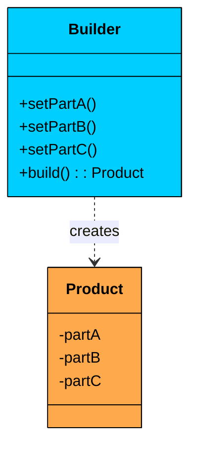

```java
$ae
```

### Command

**The Signal:** You need to encapsulate a request as an object, typically for undo/redo functionality, queueing operations, or logging actions for replay.

**When to reach for it:**

- Undo/redo in text editors, drawing apps, or document editors
- Task queues and job schedulers
- Remote control systems (smart home, IoT)
- Transaction logging and replay

**Core Idea:** Wrap each action in an object that contains everything needed to execute (and possibly reverse) that action. This decouples the invoker (who triggers the action) from the receiver (who performs it) and allows actions to be stored, queued, or undone.

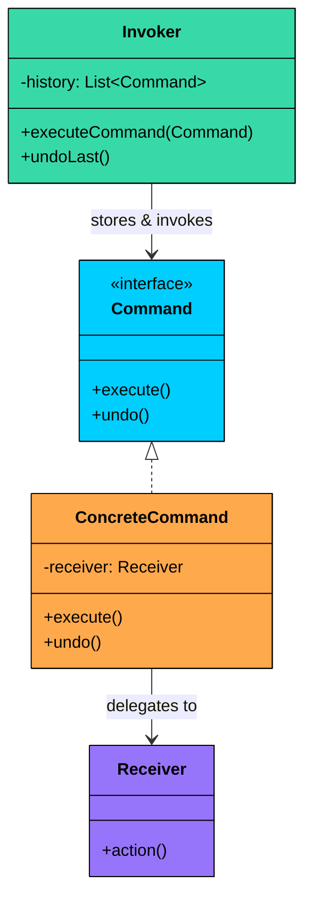

```java
interface Command {
    void execute();
    void undo();
}

class AddTextCommand implements Command {
    private Document doc;
    private String text;

    public AddTextCommand(Document doc, String text) {
        this.doc = doc;
        this.text = text;
    }

    public void execute() { doc.append(text); }
    public void undo() { doc.removeLast(text.length()); }
}

class Editor {
    private Deque<Command> history = new ArrayDeque<>();

    public void executeCommand(Command cmd) {
        cmd.execute();
        history.push(cmd);
    }

    public void undo() {
        if (!history.isEmpty()) {
            history.pop().undo();
        }
    }
}
```

### Decorator

**The Signal:** You need to add responsibilities to objects dynamically without modifying their class, and these responsibilities can be mixed and matched in different combinations.

**When to reach for it:**

- Adding toppings/extras to food orders (pizza, coffee)
- Layering features onto notifications (encryption, compression, logging)
- Extending streams with buffering, compression, encryption
- Adding behavior to UI components (borders, scrollbars)

**Core Idea:** Wrap an object in another object that implements the same interface. The wrapper delegates to the original but adds its own behavior before or after. Multiple decorators can be stacked, each adding a layer of functionality.

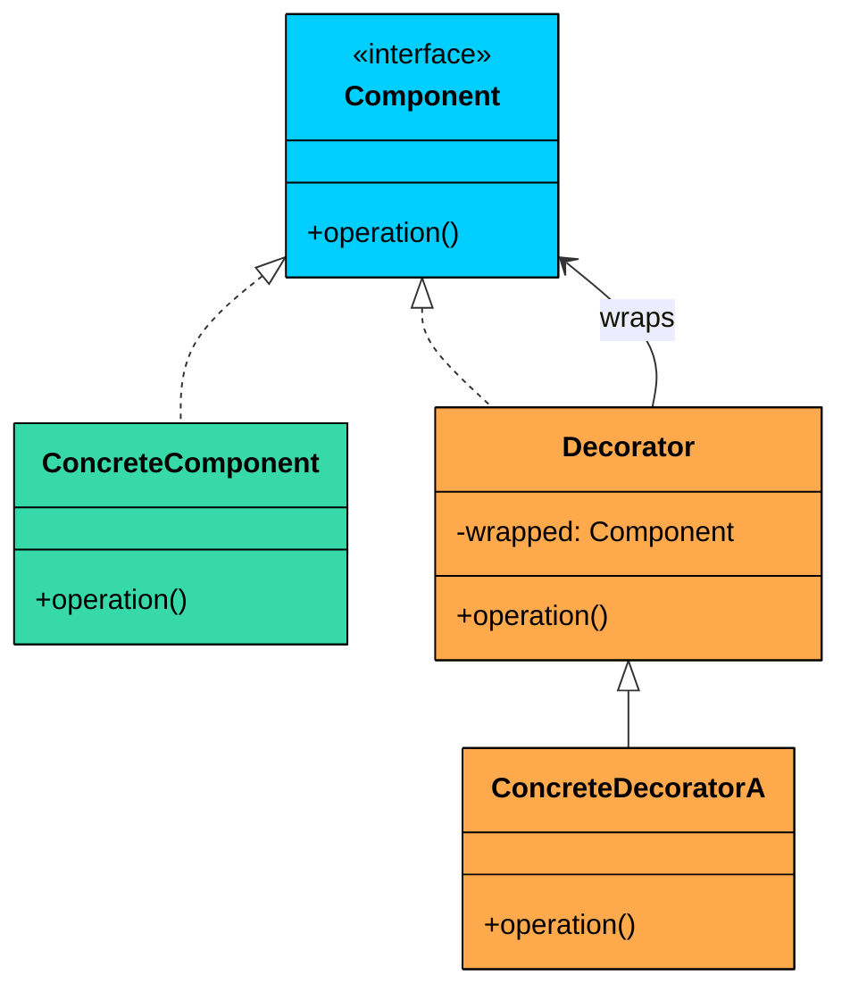

```java
interface Coffee {
    double cost();
    String description();
}

class SimpleCoffee implements Coffee {
    public double cost() { return 2.0; }
    public String description() { return "Simple coffee"; }
}

abstract class CoffeeDecorator implements Coffee {
    protected Coffee wrapped;
    public CoffeeDecorator(Coffee coffee) { this.wrapped = coffee; }
}

class MilkDecorator extends CoffeeDecorator {
    public MilkDecorator(Coffee coffee) { super(coffee); }
    public double cost() { return wrapped.cost() + 0.5; }
    public String description() { return wrapped.description() + ", milk"; }
}

class WhipDecorator extends CoffeeDecorator {
    public WhipDecorator(Coffee coffee) { super(coffee); }
    public double cost() { return wrapped.cost() + 0.7; }
    public String description() { return wrapped.description() + ", whip"; }
}

// Usage: new WhipDecorator(new MilkDecorator(new SimpleCoffee()))
```

### Facade

**The Signal:** A subsystem has many classes and complex interactions, and client code should not need to know about all of them. You want a simplified, unified interface.

**When to reach for it:**

- Wrapping complex third-party libraries or APIs
- Simplifying a multi-step process (place order = validate + charge + notify + ship)
- Providing a clean interface to a complex subsystem
- Hiding internal complexity from external clients

**Core Idea:** Provide a single class with simple methods that internally coordinate the work of multiple subsystem classes. Clients talk to the facade instead of juggling half a dozen subsystem objects themselves.

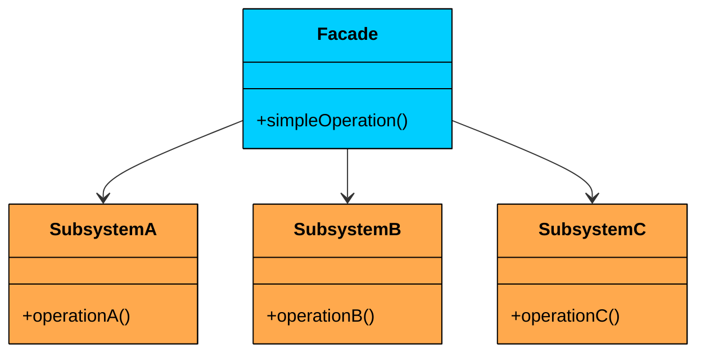

```java
class OrderFacade {
    private InventoryService inventory;
    private PaymentService payment;
    private NotificationService notification;
    private ShippingService shipping;

    public OrderFacade(InventoryService inv, PaymentService pay,
                       NotificationService notif, ShippingService ship) {
        this.inventory = inv;
        this.payment = pay;
        this.notification = notif;
        this.shipping = ship;
    }

    public boolean placeOrder(String itemId, String userId, double amount) {
        if (!inventory.checkStock(itemId)) return false;
        if (!payment.charge(userId, amount)) return false;
        inventory.reserve(itemId);
        shipping.scheduleDelivery(itemId, userId);
        notification.sendConfirmation(userId);
        return true;
    }
}
```

### Composite

**The Signal:** You need to treat individual objects and compositions of objects uniformly, typically in tree or hierarchical structures.

**When to reach for it:**

- File systems (files and directories share operations like `getSize()`)
- Organization hierarchies (employee and department both respond to `getSalary()`)
- Menu systems (menu items and sub-menus)
- UI component trees (leaf widgets and container widgets)

**Core Idea:** Define a common interface for both leaf objects and composite objects that contain children. A composite delegates operations to its children, so clients can treat a single object and a group of objects the same way. This creates recursive tree structures where operations propagate naturally.

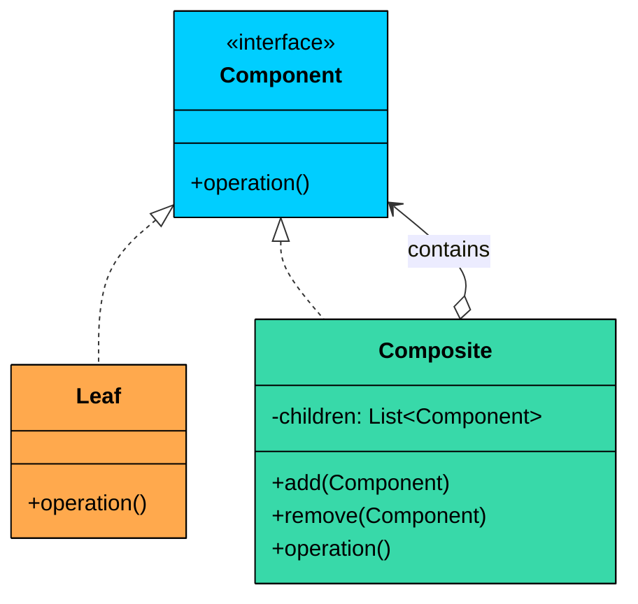

```java
interface FileSystemComponent {
    long getSize();
    String getName();
}

class File implements FileSystemComponent {
    private String name;
    private long size;

    public File(String name, long size) { this.name = name; this.size = size; }
    public long getSize() { return size; }
    public String getName() { return name; }
}

class Directory implements FileSystemComponent {
    private String name;
    private List<FileSystemComponent> children = new ArrayList<>();

    public Directory(String name) { this.name = name; }
    public void add(FileSystemComponent component) { children.add(component); }
    public void remove(FileSystemComponent component) { children.remove(component); }

    public long getSize() {
        return children.stream().mapToLong(FileSystemComponent::getSize).sum();
    }
    public String getName() { return name; }
}
```

