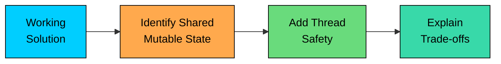
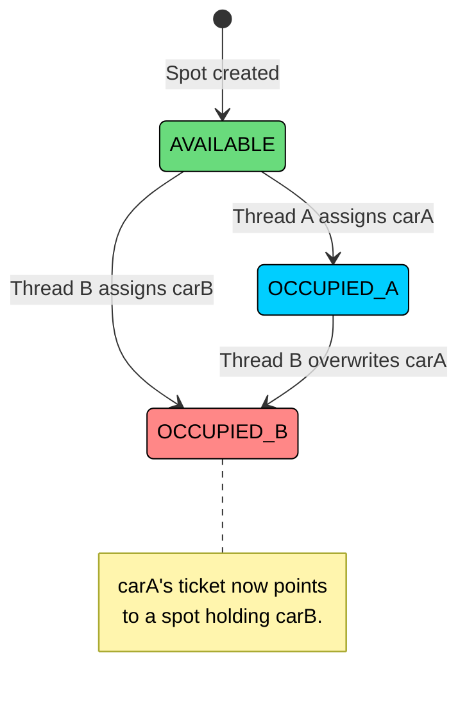
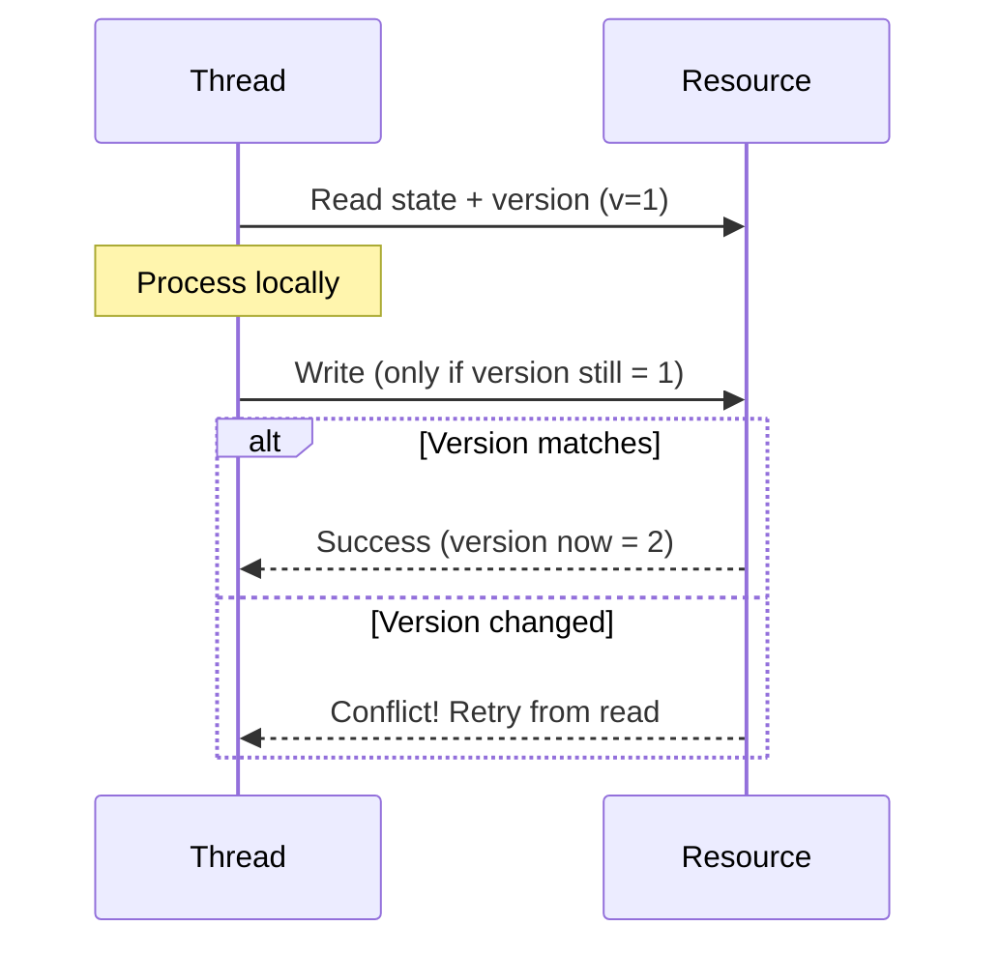

For mid-level roles and above, interviewers are not just checking whether you know OOP. They also want to see if you can design software that holds up in the messy reality of production systems. That’s where concurrency often becomes a differentiator.

At the same time, not every problem needs concurrency. Many can be solved cleanly with single-threaded code, and that is often the expectation unless stated otherwise.

Interviewers usually bring up concurrency in one of three ways:

1. **Explicitly in the requirements:** The problem statement says "handle concurrent access" or "thread-safe operations." This is your cue to build synchronization into the design from the start.
2. **As a follow-up question:** You present a working solution, and the interviewer asks, "What if two users try to book the same seat"" This tests whether you can identify the race condition and fix it.
3. **You raise it yourself:** After implementing the core logic, you call it out: “This method isn’t thread-safe. If concurrent access matters, I’d add synchronization here.” That shows maturity and good engineering instincts.



In most interviews, implementing the core logic first and then handling concurrency works best. If you try to write fully thread-safe code from the first minute, before the logic is even correct, you usually end up with tangled code, unnecessary complexity, and wasted time.

---

# 2. The Core Problem: Race Conditions

> [!PAYWALL] This content is for premium members only.

A race condition occurs when two threads access shared mutable state, and the final result depends on the order in which they execute. In LLD interviews, the shared state is almost always an object field: a parking spot's availability flag, a meeting room's booking list, a movie seat's reservation status.

Here's the classic example. Two threads call `parkVehicle()` on the same `ParkingLot` instance:

| Step | Thread A | Thread B | Spot #3 Status |
|------|----------|----------|----------------|
| 1 | Calls `parkVehicle(carA)` | | AVAILABLE |
| 2 | Finds Spot #3 available | | AVAILABLE |
| 3 | | Calls `parkVehicle(carB)` | AVAILABLE |
| 4 | | Finds Spot #3 available | AVAILABLE |
| 5 | Assigns carA to Spot #3 | | OCCUPIED (carA) |
| 6 | | Assigns carB to Spot #3 | OCCUPIED (carB) |
| 7 | Returns ticket for Spot #3 | Returns ticket for Spot #3 | **carA is lost** |

Both threads read the spot as AVAILABLE (steps 2 and 4) before either thread writes to it. Both proceed to assign their car. CarA gets silently overwritten by carB at step 6, and Thread A holds a ticket for a spot now occupied by a different vehicle. This is a **check-then-act** race condition: the check (is the spot available") and the act (assign the car) are not atomic.

This exact pattern shows up across many LLD problems.

#### **Double-assignment**

**Double-assignment** is the most common variant. Two threads assign different objects to the same shared resource. The parking spot example above is double-assignment. The same thing happens when two users book the same meeting room for the same time slot, or two guests get assigned the same hotel room. 

The telltale sign is a method that checks availability and then assigns, with a gap between the check and the assignment.

#### **Lost update / overselling**

**Lost update / overselling** happens when a shared counter is read and updated non-atomically. Think of a movie theater with 100 seats. Two threads both read `availableSeats = 1`, both decrement it to 0, both confirm a booking. Now two tickets exist for one seat. The counter "lost" one of the decrements. 

This pattern appears in inventory management (stock counts), ticket booking (seat counts), and any system that tracks quantities.

#### **Inconsistent state transitions**

**Inconsistent state transitions** occur when an object's state is read and changed in separate steps by different threads. An auction that's being closed by one thread while another thread places a bid. An order that's being cancelled while a payment confirmation arrives. 

One thread reads the state as ACTIVE and proceeds, but by the time it writes its update, the other thread has already moved the state to CLOSED. The object ends up in a state that neither operation intended.



---

# 3. Concurrency Tools for LLD Interviews

You don't need a textbook's worth of concurrency primitives. Four tools cover virtually every LLD interview scenario, and most problems only need the first one.

### 3.1 Synchronized Methods / Mutex

The simplest tool. Wrapping a method in `synchronized` (Java), a `Lock` (Python), a `mutex` (C++), a `lock` statement (C#), or equivalent ensures that only one thread can execute it at a time. If Thread B calls `parkVehicle()` while Thread A is already inside it, Thread B waits until Thread A finishes.

This is the 80% solution. For most LLD interviews, synchronizing the critical method is all you need. It's easy to implement, easy to explain, and easy for the interviewer to verify.

**When to use:** Any method that reads and writes shared mutable state. If the method checks a condition and then acts on it (check-then-act), synchronize the whole method.

### 3.2 Per-Resource Locks

Synchronized methods lock the entire object. If `parkVehicle()` is synchronized on the `ParkingLot` instance, no two cars can park simultaneously, even if they're heading to different floors with different spots. That's correct but slow.

Per-resource locking gives each resource its own lock. Each `ParkingSpot` gets its own lock object, so Thread A can park in Spot #3 on Floor 1 while Thread B parks in Spot #7 on Floor 2, simultaneously. Only threads targeting the same spot contend.

**When to use:** When the interviewer pushes back on the performance of a coarse-grained lock. "Synchronizing the entire method means only one car can park at a time. With 500 parking spots, that's a bottleneck. Can you do better"" Per-resource locking is the answer.

### 3.3 Concurrent Collections

Languages provide thread-safe collection classes: `ConcurrentHashMap` in Java, `ConcurrentDictionary` in C#, `concurrent.futures` structures in Python. These protect individual operations (put, get, remove) without explicit locking.

**The critical caveat:** Concurrent collections protect individual operations, not compound operations. `if (!map.containsKey(key)) { map.put(key, value); }` is still a race condition even with `ConcurrentHashMap`, because the check and the put are two separate operations. For compound check-then-act patterns, you still need explicit synchronization.

**When to use:** When you need a thread-safe data structure for simple lookups, inserts, or removals, and each operation is independent. Use `ConcurrentHashMap` for storing active tickets keyed by ID, for example. But don't rely on it for the core booking/assignment logic where compound operations are involved.

### 3.4 Atomic Operations

`AtomicInteger`, `AtomicLong`, and similar classes provide lock-free thread-safe operations on single values. Incrementing a counter, generating unique IDs, updating a single flag, these are the sweet spot for atomics.

**When to use:** Counters (ticket IDs, order numbers), flags (a boolean that gets flipped once), and any single-value update that doesn't depend on other state.

Here's a summary of when to reach for each tool:

| Tool | Granularity | LLD Use Case | Example Problem |
|------|-------------|--------------|-----------------|
| Synchronized/Mutex | Entire method | Check-then-act protection | Parking Lot, Meeting Room |
| Per-Resource Lock | Individual resource | High-throughput resource assignment | Movie Ticket Booking, Hotel Rooms |
| Concurrent Collection | Single operation | Thread-safe lookups and inserts | Active tickets map, session store |
| Atomic | Single value | Counters and ID generation | Ticket counter, order number |

---

# 4. Three Concurrency Patterns for LLD Interviews

Each pattern includes a before (unsafe) and after (safe) version, using the Parking Lot and Movie Ticket Booking problems as running examples.

### 4.1 Synchronized Method (The 80% Solution)

This is the pattern you'll use most often. Take the method that contains the race condition and make the entire thing atomic by synchronizing it.

Here's `parkVehicle()` before and after. The before version has the check-then-act gap from Section 2. The after version closes that gap.

```java
// Before: NOT thread-safe (check-then-act race condition)
public Ticket parkVehicle(Vehicle vehicle) {
    ParkingSpot spot = findAvailableSpot(vehicle.getType());
    spot.park(vehicle);
    return issueTicket(vehicle, spot);
}

// After: Thread-safe with synchronized
public synchronized Ticket parkVehicle(Vehicle vehicle) {
    ParkingSpot spot = findAvailableSpot(vehicle.getType());
    spot.park(vehicle);
    return issueTicket(vehicle, spot);
}
```

The entire check-then-act sequence now runs atomically. No two threads can be inside `parkVehicle()` at the same time.

### Pros

- Simple to implement and explain
- Eliminates the race condition completely
- Easy for the interviewer to verify

### Cons

- Only one thread can park at a time
- May be a bottleneck with many concurrent users
- Locks the entire ParkingLot, even for unrelated spots

This trade-off is perfectly acceptable in an interview. Mention it: "This synchronized approach serializes all parking operations. For a parking lot with ten spots, that's fine. For a system with thousands of concurrent users, I'd use per-resource locking."

The same pattern applies to other problems. An auction's `placeBid()` method, a meeting room scheduler's `scheduleMeeting()`, an inventory system's `addStock()`, all of these have the same check-then-act structure and the same fix.

### 4.2 Per-Resource Locking (Throughput)

Now let's look at a scenario where the coarse-grained lock becomes a real problem.

Consider a Movie Ticket Booking system. A show has 500 seats. With a single synchronized `bookSeat()` method on the `Show` object, only one person can book at a time, even if they're booking completely different seats. During a popular movie's opening, thousands of users hit the system simultaneously. A coarse lock means they all queue up behind each other.

Per-resource locking solves this by giving each seat its own lock. Two users booking Seat A1 and Seat F12 proceed in parallel. Only users targeting the same seat contend.

```java
// Coarse lock: only one booking at a time for the entire show
public synchronized boolean bookSeat(String seatId, String userId) {
    ShowSeat seat = seats.get(seatId);
    if (seat == null || !seat.isAvailable()) {
        return false;
    }
    seat.assign(userId);
    return true;
}

// Per-resource lock: each seat has its own ReentrantLock
public boolean bookSeat(String seatId, String userId) {
    ShowSeat seat = seats.get(seatId);
    if (seat == null) return false;

    if (seat.getLock().tryLock()) {
        try {
            if (!seat.isAvailable()) return false;
            seat.assign(userId);
            return true;
        } finally {
            seat.getLock().unlock();
        }
    }
    return false; // seat is being booked by another thread
}
```

Notice the use of `tryLock()` . These are non-blocking lock attempts. If the lock is already held, the method returns `false` immediately instead of waiting. This prevents one user's slow operation from blocking another user entirely.

When the same user wants to book multiple seats in one transaction (say, three adjacent seats for a family), you need to lock all of them before confirming any of them. If you can't acquire all the locks, release the ones you got and fail the entire booking. This is the all-or-nothing pattern, and it prevents a scenario where you book seats A1 and A2 but fail on A3, leaving the user with a partial booking.

### Pros

- Multiple resources can be accessed in parallel
- Much better throughput than coarse locking
- Shows deeper concurrency understanding

### Cons

- More complex to implement and explain
- Must handle lock ordering to avoid deadlocks
- Overkill for problems with few shared resources

### 4.3 Optimistic Concurrency (Mention, Don't Implement)

The two patterns above use pessimistic locking: acquire a lock before reading, hold it through the write, then release. Optimistic concurrency takes the opposite approach: read without locking, do your work, and at write time, check if anyone else changed the data since you read it. If they did, retry. If not, commit.



This pattern is standard in database-backed systems. You add a `version` column to the row, read it along with the data, and include `WHERE version = <read_version>` in your UPDATE statement. If the update affects zero rows, someone else changed the data, so you retry.

In an LLD interview, you typically won't implement optimistic concurrency because LLD problems use in-memory data structures, not databases. But you should know when to mention it:

- When the interviewer asks "How would this work in a distributed system""
- When the interviewer asks "What if this data were in a database""
- When the problem involves low-contention updates where most operations won't conflict

The right thing to say is: "For the in-memory version, I'm using synchronized methods. If this were backed by a database, I'd use optimistic locking with a version column. The write includes a version check, and if it fails, the operation retries." This bridges the gap between LLD interview code and production architecture, which is exactly what senior-level candidates demonstrate.

---

# 5. When to Add Concurrency vs. Skip It

Not every LLD problem needs thread safety. Adding synchronization to a problem that doesn't ask for it wastes time and adds complexity for no benefit. Here's how to decide.

```mermaid
flowchart TD
    A["Does the problem<br/>mention concurrency""]:::primary
    B["Is there shared<br/>mutable state""]:::orange
    C["Did the interviewer<br/>ask about it""]:::orange
    D["Add concurrency"]:::green
    E["Skip it"]:::red
    F["Mention it during<br/>review"]:::secondary

    A -->|"Yes"| D
    A -->|"No"| B
    B -->|"No"| E
    B -->|"Yes"| C
    C -->|"Yes"| D
    C -->|"No"| F

    classDef primary fill:#00ceff,stroke:#000,color:#000
    classDef orange fill:#ffa94d,stroke:#000,color:#000
    classDef green fill:#69db7c,stroke:#000,color:#000
    classDef red fill:#ff8787,stroke:#000,color:#000
    classDef secondary fill:#38d9a9,stroke:#000,color:#000
```

**Add concurrency when:**

- The problem statement explicitly mentions thread safety, concurrent access, or multiple simultaneous users.
- There's an obvious shared mutable resource (a booking system, a shared inventory, a seat map) and the interviewer brings up the concurrency question.

**Skip concurrency when:**

- The problem is primarily about modeling (Chess, Tic-Tac-Toe, Snake and Ladder). These problems test OO design, not thread safety.
- You're running low on time. Thread safety is less important than having a working demo with clean code.
- The interviewer hasn't mentioned it and the problem doesn't hint at it. Don't force it.

#### **The 2-Minute Retrofit Rule**

If your code follows the clean code principles, adding synchronization is often a one-word change. A well-decomposed `parkVehicle()` method that delegates to focused helpers can be made thread-safe by adding `synchronized` / `lock` to the method signature. A tangled 40-line method that mixes validation, searching, and state updates is nearly impossible to synchronize correctly because you can't tell which parts need protection.

This is one of the hidden benefits of clean code: it makes concurrency retrofits trivial. When the interviewer asks "Can you make this thread-safe"", you add one keyword and explain why it works. If your code is messy, you'd have to refactor first, and you don't have time for that in a follow-up question.
