> 💡 **Key Insight:**

> **QUESTION**
>
> #### What is Minesweeper"
>
> **Minesweeper** is a classic single-player puzzle game where the player’s objective is to **reveal all non-mine cells** on a grid without triggering a mine. The game requires logic, deduction, and careful strategy.
>
> 
> <!-- Simulation: minesweeper -->
> 

>
> #### Game Overview
>
> - The game board is a **2D grid** of hidden cells, some of which contain **mines**.
> - The player interacts with the board by clicking on cells.
> - If the revealed cell **contains a mine**, the game ends in a **loss**.
> - If the cell is **safe**, it reveals a number from `0` to `8` indicating how many of its adjacent cells contain mines.
> - If the number is `0`, all adjacent cells are automatically revealed recursively.
> - The player can also **flag** a cell if they suspect it contains a mine.
> - The game ends in a **win** when all non-mine cells are revealed.

In this chapter, we’ll explore the **low-level design** of a Minesweeper game.

Lets start by clarifying the requirements:

---

# 1. Clarifying Requirements

Before starting the design, it's important to ask thoughtful questions to uncover hidden assumptions and better define the scope of the system.

Here is an example of how a conversation between the candidate and the interviewer might unfold:

> 💡 **Key Insight:**

> **DISCUSSION**
>
> **Candidate:** "Should the game support different difficulty levels with preset board sizes and mine counts""
>
> **Interviewer:** "Yes, support at least three difficulty presets: easy (9x9, 10 mines), medium (16x16, 40 mines), and hard (30x16, 99 mines)."
>
> **Candidate:** "What actions should a player be able to perform on a cell""
>
> **Interviewer:** "Players should be able to reveal a cell, flag a cell as suspected mine, or unflag a flagged cell."
>
> **Candidate:** "Should the first cell the player clicks on always be safe, or can it contain a mine""
>
> **Interviewer:** "Good question. The first click should always be safe. It must never reveal a mine."
>
> **Candidate:** "What happens when a player clicks on a cell with no adjacent mines" Should we auto-reveal surrounding cells""
>
> **Interviewer:** "Yes, if a cell has zero adjacent mines, the game should recursively reveal its neighbors until all non-mine cells with adjacent mines are found."
>
> **Candidate:** "How do we determine game outcomes""
>
> **Interviewer: "**If a player reveals a mine → Game Over. If all non-mine cells are revealed → Player Wins."
>
> **Candidate:** "Should the system track game statistics across multiple games, like win rate or games played""
>
> **Interviewer:** "Yes, tracking statistics would be a nice addition."
>
> **Candidate:** "Is there a time limit on how fast the user completes the board""
>
> **Interviewer:** "You can ignore timer for this version."
>
> **Candidate:** "Should we support undo functionality or saving and resuming the game""
>
> **Interviewer:** "Not in this version. We can discuss it if time permits"
>
> **Candidate:** "Do we need to handle concurrent access, like a web-based version where multiple requests could hit the same game""
>
> **Interviewer:** "Think about it, but keep the focus on the core design. Thread safety is a bonus."

After gathering the details, we can summarize the key system requirements.

## 1.1 Functional Requirements

- Support configurable board sizes and mine counts through difficulty presets (easy, medium, hard)
- The first click is always safe (never a mine)
- Revealing a cell with zero adjacent mines triggers a cascade reveal of neighboring cells
- Players can flag and unflag cells to mark suspected mines
- Flagged cells cannot be revealed until unflagged
- The game detects a win when all non-mine cells are revealed
- The game detects a loss when a mine is revealed
- The system tracks statistics (games played, wins, losses) across multiple games

## 1.2 Non-Functional Requirements

- The design should follow **object-oriented principles** with clear separation of concerns
- The system should be **modular and extensible** to support future features
- The code should be **thread-safe** for concurrent access
- The components should be **testable** in isolation

---

# 2. Identifying Core Entities

> [!PAYWALL] This content is for premium members only.

How do you go from a list of requirements to actual classes"

The key is to look for **nouns** in the requirements that have distinct attributes or behaviors. Not every noun becomes a class, but this approach gives you a starting point.

Let's walk through our requirements and identify what needs to exist in our system.

#### 1. **The game is played on a configurable grid with mines.**

This immediately suggests a `Board` entity to manage the grid of cells. The grid itself is composed of individual squares, leading to a `Cell` entity. Each Cell needs to know if it's a mine and how many adjacent mines it has.

We also need a `Position` value type to represent (row, col) coordinates. Positions show up everywhere: mine placement, neighbor computation, flood fill queues. Making Position a proper immutable type (with equality semantics) avoids scattered raw int pairs throughout the code.

#### **2. **Players can flag and unflag cells

A cell can be in one of three states: hidden, revealed, or flagged. This gives us a `CellState` enum. The transitions are strict: HIDDEN can go to REVEALED or FLAGGED, FLAGGED can go back to HIDDEN (unflag), and REVEALED is terminal (you can't un-reveal a cell).

#### **3. **The game detects a win when all non-mine cells are revealed

The game itself has a lifecycle: it hasn't started yet (mines not placed), it's in progress, the player won, or the player lost. This gives us a `GameStatus` enum with four values: `NOT_STARTED`, `IN_PROGRESS`, `WON`, `LOST`.

#### **4. **Support at least three difficulty presets: easy, medium, hard

Each difficulty level bundles three pieces of configuration: number of rows, number of columns, and mine count. A `Difficulty` enum with these associated values is cleaner than passing three separate parameters everywhere.

#### **5. **The system tracks statistics across multiple games

This points to a central `Game` entity responsible for orchestrating the gameplay: processing reveals and flags, enforcing first-click safety, delegating to the Board for the actual grid operations, and checking for win/loss conditions.

When a game ends, statistics need to be updated. Rather than coupling Game directly to a statistics tracker, we define a `GameObserver` interface.

`GameStatistics` implements this interface and tracks games played, wins, and losses. The Game notifies observers on key events (cell revealed, cell flagged, game won, game lost) without knowing what the observers do with that information.

Something needs to decide where mines go. The simplest approach is random placement, but we also need the ability to place mines at predetermined positions for testing. If every test run places mines randomly, tests become non-deterministic.

This suggests a `MinePlacementStrategy` interface with two implementations like **RandomMinePlacement** for real games and **CustomMinePlacement** for tests.

Finally, a `MinesweeperSystem` singleton acts as the facade, providing a simple API for creating games and tracking statistics across sessions.

### Entity Overview

Here's how these entities relate to each other:

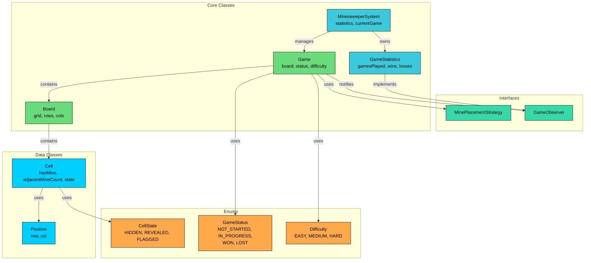

We've identified four types of entities:

**Enums** define fixed sets of values. CellState, GameStatus, and Difficulty provide type safety and make code self-documenting.

**Data Classes** primarily hold data with minimal behavior. Position is an immutable coordinate pair. Cell holds the state of a single board position.

**Interfaces** define contracts for interchangeable behavior. MinePlacementStrategy enables testable mine placement, and GameObserver decouples game events from their handlers.

**Core Classes** contain the main logic. Board manages the grid and implements flood fill, Game orchestrates gameplay, GameStatistics tracks results, and MinesweeperSystem ties everything together.

| Entity | Type | Responsibility |
|--------|------|----------------|
| `CellState` | Enum | Cell visibility: HIDDEN, REVEALED, or FLAGGED |
| `GameStatus` | Enum | Game lifecycle: NOT_STARTED, IN_PROGRESS, WON, LOST |
| `Difficulty` | Enum | Preset configurations: EASY(9,9,10), MEDIUM(16,16,40), HARD(30,16,99) |
| `Position` | Data Class | Immutable (row, col) coordinate with equality semantics |
| `Cell` | Data Class | Holds mine status, adjacency count, and current state |
| `MinePlacementStrategy` | Interface | Contract for mine placement algorithms |
| `GameObserver` | Interface | Contract for listening to game events |
| `Board` | Core Class | Manages the grid, BFS flood fill, adjacency computation |
| `Game` | Core Class | Orchestrates gameplay, first-click safety, win/loss detection |
| `GameStatistics` | Core Class | Tracks wins, losses, games played; implements GameObserver |
| `MinesweeperSystem` | Core Class | Singleton facade for the entire system |

With our entities identified, let's define their attributes, behaviors, and relationships.

---

# 3. Designing Classes and Relationships

Now that we know what entities we need, let's flesh out their details. For each class, we'll define what data it holds (attributes) and what it can do (methods). Then we'll look at how these classes connect to each other.

We'll work bottom-up: simple types first, then data containers, then the classes with real logic. This order makes sense because complex classes depend on simpler ones.

## 3.1 Class Definitions

The system is composed of several types of classes, each with a distinct role.

### **Enums**

Enums define fixed sets of values that provide type safety and make code self-documenting. Using enums prevents invalid states at compile time rather than runtime.

#### `CellState`

Every cell on the board has a visibility state. When the game starts, all cells are hidden. The player can reveal a cell (permanently) or flag it (reversibly). We need a way to represent these three possibilities.

`CellState` represents the visibility of a cell.

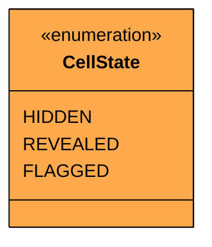

| Value | Description | Terminal" |
|-------|-------------|-----------|
| `HIDDEN` | Cell hasn't been interacted with | No |
| `REVEALED` | Cell has been uncovered | Yes |
| `FLAGGED` | Cell is marked as a suspected mine | No |

The state transitions follow strict rules:

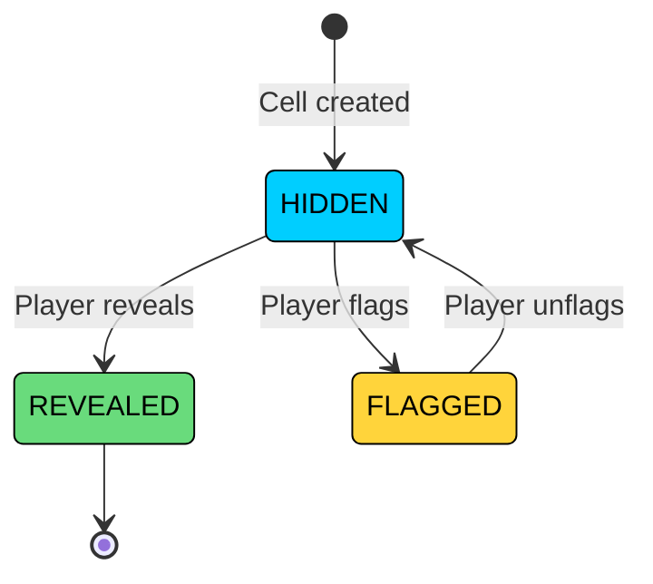

Notice that REVEALED is a terminal state. Once a cell is revealed, it stays revealed. You can't un-reveal it or flag it. FLAGGED, however, is reversible: unflagging takes the cell back to HIDDEN. This asymmetry is important. In the real game, accidentally revealing a mine is permanent (game over), but flagging is a safe, reversible annotation.

#### `GameStatus`

Tracks where we are in the game lifecycle.

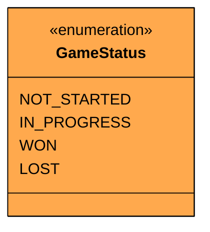

| Value | Description | Terminal" |
|-------|-------------|-----------|
| `NOT_STARTED` | Board created, mines not yet placed | No |
| `IN_PROGRESS` | Mines placed, game is active | No |
| `WON` | All non-mine cells revealed | Yes |
| `LOST` | A mine was revealed | Yes |

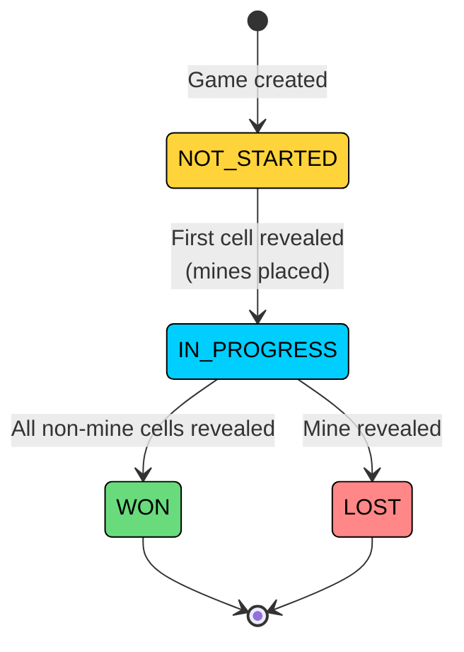

The NOT_STARTED to IN_PROGRESS transition is the critical one. It's triggered by the first reveal action, which: (1) places mines everywhere except the clicked position, (2) computes adjacency counts, and (3) transitions the status to IN_PROGRESS. All of this happens before the reveal itself is processed.

#### `Difficulty`

Each difficulty level packages three configuration values together. Rather than passing `rows`, `cols`, and `mineCount` as three separate parameters everywhere, we bundle them into a clean enum.

`Difficulty` defines preset game configurations.

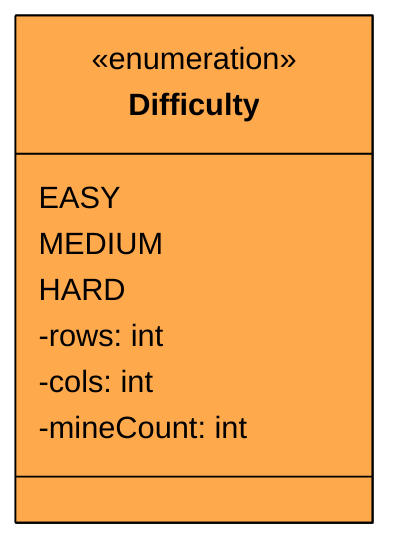

| Value | Rows | Columns | Mines | Mine Density |
|-------|------|---------|-------|-------------|
| `EASY` | 9 | 9 | 10 | 12.3% |
| `MEDIUM` | 16 | 16 | 40 | 15.6% |
| `HARD` | 30 | 16 | 99 | 20.6% |

### Data Classes

Data classes are simple containers that hold data with minimal behavior. They represent the "nouns" in our system that have attributes but little logic.

#### `Position`

Coordinates show up everywhere in Minesweeper: mine placement, neighbor computation, BFS queues, player actions. We could pass raw `int row, int col` pairs, but that gets repetitive and error-prone (was it `row, col` or `col, row`").

`Position` is an immutable coordinate pair with value equality.

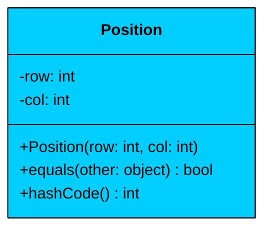

| Attribute | Type | Description | Mutable" |
|-----------|------|-------------|----------|
| `row` | int | Row index (0-based) | No |
| `col` | int | Column index (0-based) | No |

| Method | Description |
|--------|-------------|
| `Position(row, col)` | Constructor |
| `equals(other)` | Value equality based on row and col |
| `hashCode()` | Consistent with equals for use in collections |

Position is **immutable** and implements value equality. Two Position objects with the same row and col are considered equal, which is essential for using them as keys in maps or elements in sets. Without proper `equals()` and `hashCode()`, the BFS flood fill algorithm would break because the "visited" set wouldn't detect duplicate positions.

#### `Cell`

Each position on the board holds a cell with several independent attributes. Does it contain a mine" How many adjacent mines surround it" What's its current visibility state" This is more complex than a Tic-Tac-Toe cell (which just holds a symbol), but each attribute serves a distinct purpose.

`Cell` holds all data for a single board position.

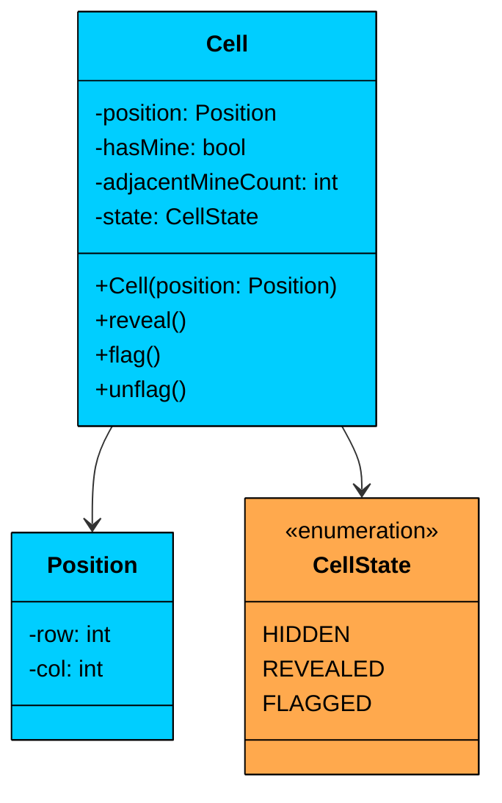

| Attribute | Type | Description | Mutable" |
|-----------|------|-------------|----------|
| `position` | Position | The cell's coordinates | No |
| `hasMine` | bool | Whether this cell contains a mine | Yes (set during mine placement) |
| `adjacentMineCount` | int | Number of neighboring mines (0-8) | Yes (computed after mine placement) |
| `state` | CellState | Current visibility: HIDDEN, REVEALED, or FLAGGED | Yes |

| Method | Description |
|--------|-------------|
| `Cell(position)` | Constructor, initializes as HIDDEN with no mine |
| `reveal()` | Transitions state to REVEALED |
| `flag()` | Transitions state to FLAGGED |
| `unflag()` | Transitions state back to HIDDEN |

The Cell class manages its own state transitions. The `reveal()`, `flag()`, and `unflag()` methods enforce the state machine rules from our CellState diagram. For example, `reveal()` only works on HIDDEN cells (not FLAGGED ones), and `unflag()` only works on FLAGGED cells.

### Interfaces

Interfaces define contracts for interchangeable behavior. They enable the Strategy and Observer patterns that keep our Game class focused on orchestration rather than implementation details.

#### `MinePlacementStrategy`

After the player's first click, mines need to be placed on the board. The placement algorithm has one constraint: the clicked position must remain mine-free. We could hardcode random placement in the Board class, but that makes testing a nightmare. Every test run would produce a different board, making deterministic assertions impossible.

`MinePlacementStrategy` defines the contract for mine placement algorithms.

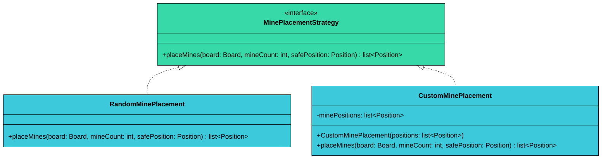

| Method | Parameters | Returns | Description |
|--------|------------|---------|-------------|
| `placeMines` | `board`, `mineCount`, `safePosition` | `list<Position>` | Places mines on the board, returns their positions |

**RandomMinePlacement** generates all valid positions (excluding the safe position), shuffles them, and picks the first `mineCount` positions. This is simpler and more uniform than a "generate and retry" approach.

**CustomMinePlacement** accepts a predefined list of positions. It ignores the `safePosition` parameter since the test author controls placement directly. This makes tests deterministic: you know exactly where every mine is.

#### `GameObserver`

When game events happen (cell revealed, cell flagged, game won, game lost), other components might need to react. Statistics tracking, logging, UI updates. We don't want Game to know about all of these.

`GameObserver` defines the contract for listening to game events.

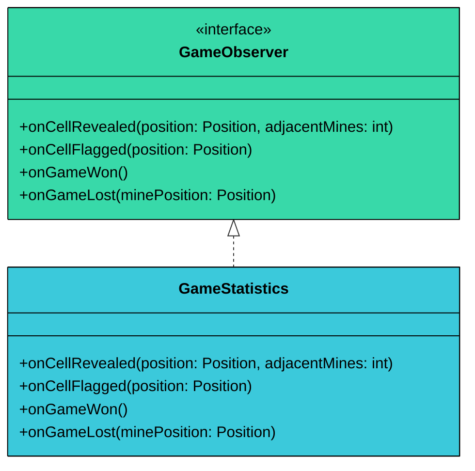

| Method | Parameters | Description |
|--------|------------|-------------|
| `onCellRevealed` | `position`, `adjacentMines` | Called when a cell is revealed |
| `onCellFlagged` | `position` | Called when a cell is flagged |
| `onGameWon` | (none) | Called when the player wins |
| `onGameLost` | `minePosition` | Called when a mine is revealed |

### Core Classes

Core classes contain the actual game logic. They coordinate between data classes and implement the rules of the game.

#### `Board`

The Board is where the heavy lifting happens. It manages a grid of Cell objects, handles mine placement delegation, computes adjacency counts, and implements the BFS flood fill algorithm for cascade reveals.

`Board` manages the grid and provides all board-level operations.

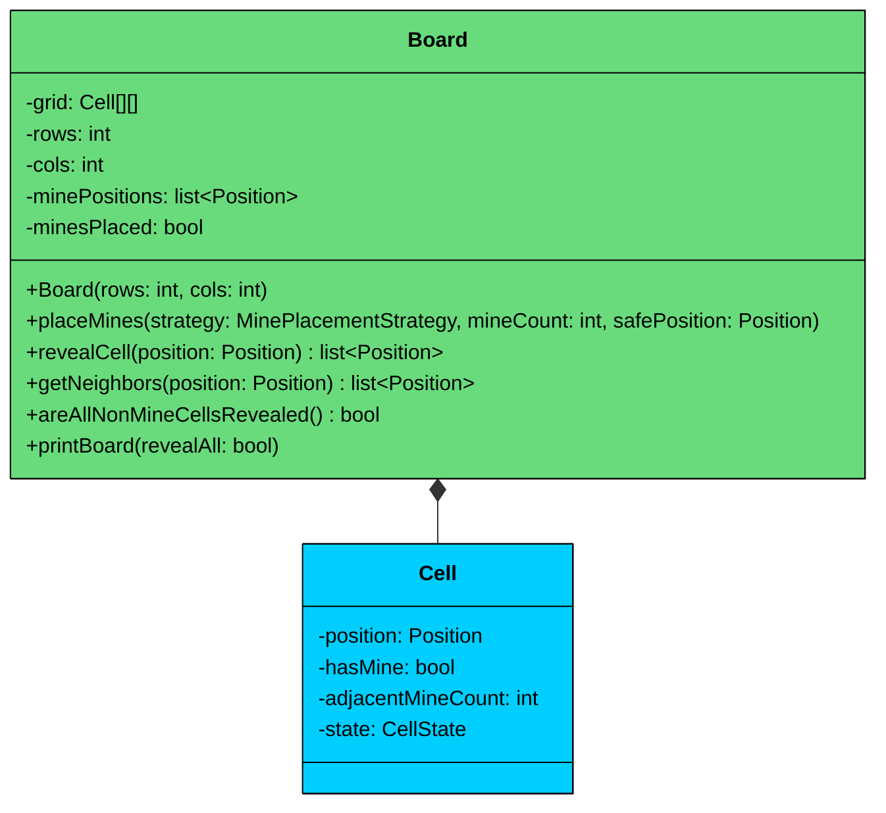

| Attribute | Type | Description |
|-----------|------|-------------|
| `grid` | Cell[][] | 2D array of cells (composition) |
| `rows` | int | Number of rows |
| `cols` | int | Number of columns |
| `minePositions` | list\<Position\> | Positions where mines were placed |
| `minesPlaced` | bool | Whether mines have been placed yet |

| Method | Description |
|--------|-------------|
| `Board(rows, cols)` | Constructor, creates rows x cols grid of empty cells |
| `placeMines(strategy, mineCount, safePosition)` | Delegates mine placement to strategy, then computes adjacency counts |
| `revealCell(position)` | BFS flood fill: reveals the cell and cascades through zero-adjacency neighbors |
| `getNeighbors(position)` | Returns up to 8 valid neighboring positions |
| `areAllNonMineCellsRevealed()` | Checks the win condition |
| `printBoard(revealAll)` | Displays the board (revealAll shows mines after game over) |

**Relationship:** Board has a **composition** relationship with Cell. The Board creates and owns all Cell objects. When the Board is destroyed, all Cells are destroyed with it.

The most important method is `revealCell()`, which implements BFS flood fill. When a cell with zero adjacent mines is revealed, all its hidden neighbors are added to a queue. The algorithm processes each cell in the queue: if it has zero adjacent mines, its hidden neighbors are also enqueued. This continues until the queue is empty. The result is a cascade reveal that expands outward from the clicked cell, stopping at cells that border mines.

#### `Game`

This is the main orchestrator. It coordinates the Board, the mine placement strategy, and the observers. When a player acts, the Game validates the action, delegates to the Board, checks for win/loss, and notifies observers.

`Game` coordinates all game elements and enforces the rules.

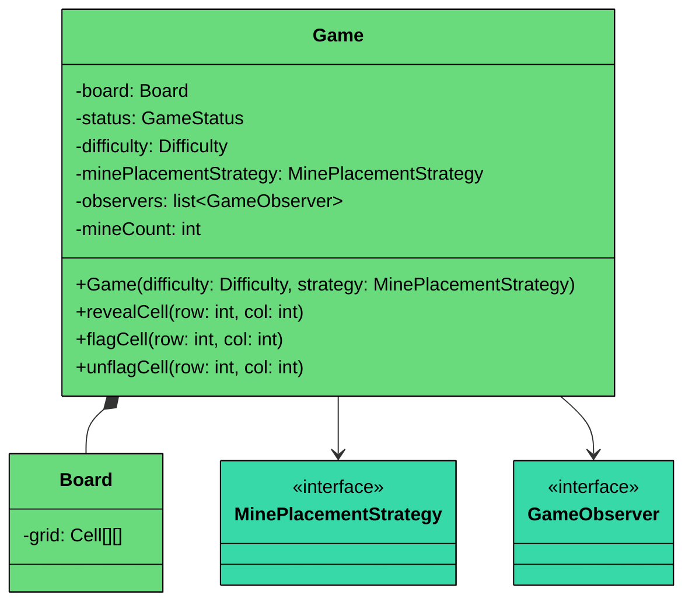

| Attribute | Type | Description |
|-----------|------|-------------|
| `board` | Board | The game board (composition) |
| `status` | GameStatus | Current game lifecycle state |
| `difficulty` | Difficulty | Selected difficulty preset |
| `minePlacementStrategy` | MinePlacementStrategy | Algorithm for placing mines |
| `observers` | list\<GameObserver\> | Listeners for game events |
| `mineCount` | int | Total mines for this game |

| Method | Description |
|--------|-------------|
| `Game(difficulty, strategy)` | Constructor, creates board from difficulty preset |
| `revealCell(row, col)` | Core method: first-click handling, reveal, win/loss check, observer notification |
| `flagCell(row, col)` | Flag a hidden cell as a suspected mine |
| `unflagCell(row, col)` | Remove flag from a flagged cell |

**Relationships:** Game has a **composition** relationship with Board (Game creates and owns the Board) and an **association** with MinePlacementStrategy (Game uses the strategy but doesn't own it). The same strategy instance could be shared across multiple games.

The `revealCell()` method is the most complex. It handles two distinct scenarios:

1. **First reveal (NOT_STARTED):** Triggers mine placement via the strategy, computes adjacency counts, transitions to IN_PROGRESS, then processes the reveal.
2. **Subsequent reveals (IN_PROGRESS):** Delegates to Board's flood fill, then checks if the revealed cell was a mine (loss) or if all non-mine cells are now revealed (win).

#### `GameStatistics`

The GameStatistics class tracks aggregate results across multiple games. It implements the `GameObserver` interface, so it automatically receives notifications when game events occur.

`GameStatistics` tracks wins, losses, and games played; implements `GameObserver`.

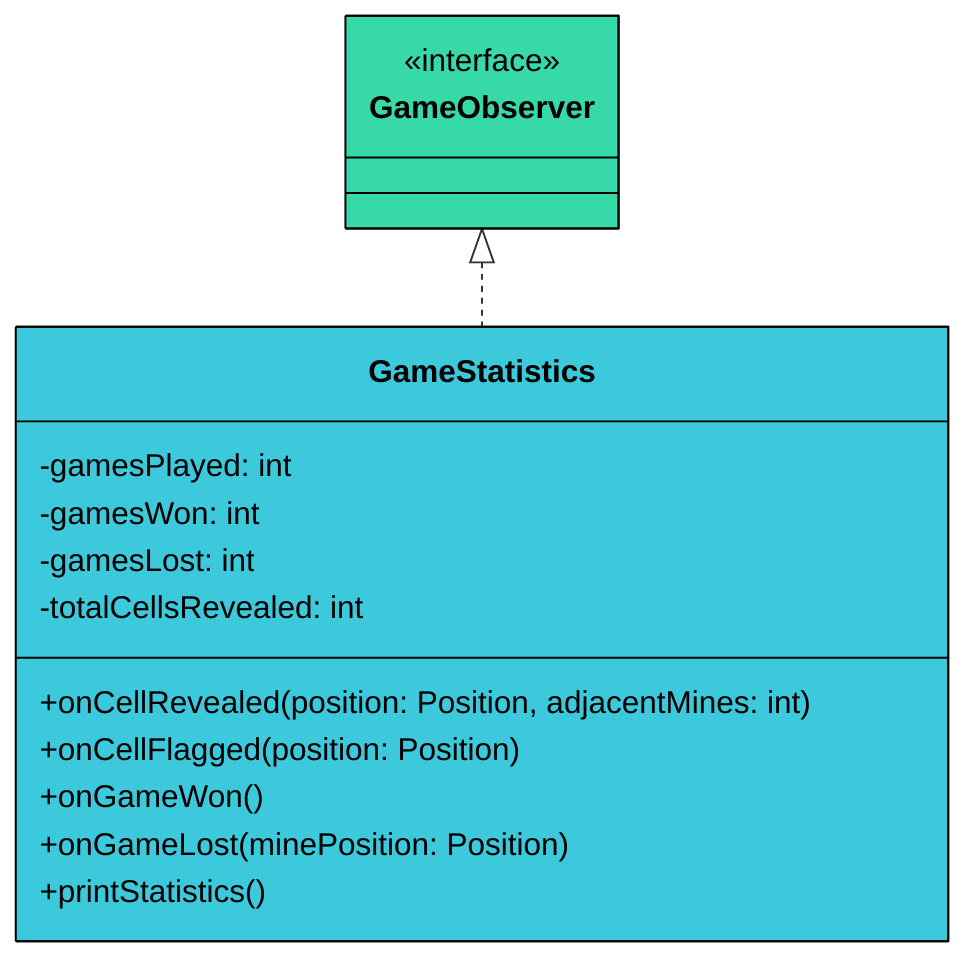

| Attribute | Type | Description |
|-----------|------|-------------|
| `gamesPlayed` | int | Total games completed (thread-safe counter) |
| `gamesWon` | int | Total wins (thread-safe counter) |
| `gamesLost` | int | Total losses (thread-safe counter) |
| `totalCellsRevealed` | int | Aggregate cells revealed across all games |

| Method | Description |
|--------|-------------|
| `onGameWon()` | Increment gamesPlayed and gamesWon |
| `onGameLost(minePosition)` | Increment gamesPlayed and gamesLost |
| `onCellRevealed(position, adjacentMines)` | Increment totalCellsRevealed |
| `onCellFlagged(position)` | No-op for current implementation |
| `printStatistics()` | Display summary of all tracked stats |

**Relationship:** GameStatistics **implements** `GameObserver`. When game events occur, the Game notifies all observers. GameStatistics updates its counters accordingly. The Game doesn't need to know about statistics tracking specifically.

#### `MinesweeperSystem`

External code shouldn't need to know about Board, Cell, or MinePlacementStrategy. The MinesweeperSystem acts as a facade, providing a simple interface for creating games and performing actions. It also ensures a single shared GameStatistics instance exists across all games.

`MinesweeperSystem` is the public-facing facade and singleton entry point.

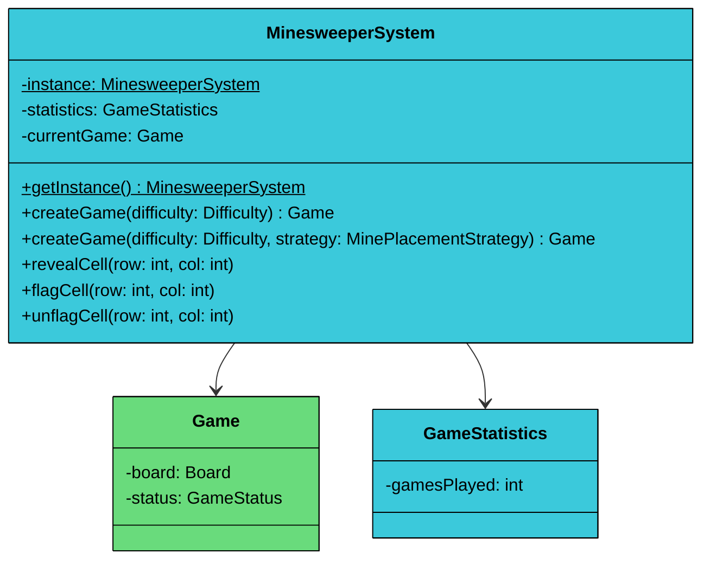

| Attribute | Type | Description |
|-----------|------|-------------|
| `instance` | MinesweeperSystem (static) | Singleton instance |
| `statistics` | GameStatistics | Shared statistics across all games |
| `currentGame` | Game | The currently active game |

| Method | Description |
|--------|-------------|
| `getInstance()` | Static: returns the singleton instance |
| `createGame(difficulty)` | Start a new game with random mine placement |
| `createGame(difficulty, strategy)` | Start a new game with a custom mine placement strategy |
| `revealCell(row, col)` | Reveal a cell in the current game |
| `flagCell(row, col)` | Flag a cell in the current game |
| `unflagCell(row, col)` | Unflag a cell in the current game |

---

## 3.2 Key Design Patterns

You might notice some structural patterns emerging in our design. Let's make them explicit and justify why each pattern is appropriate here.

### [**Strategy Pattern**](/learn/lld/strategy)** (**Mine Placement**)**

**The Problem:** Mines need to be placed on the board after the first click. Random placement is the default, but it makes unit testing non-deterministic. You can't write a test that says "when the player reveals (2,3), they should lose" if you don't control where the mines are.

**The Solution:** The Strategy pattern encapsulates the mine placement algorithm behind an interface. The Game holds a reference to a MinePlacementStrategy and delegates placement to it. Different strategy implementations handle different use cases.

We could seed the random number generator for tests, but that's fragile. If the algorithm changes even slightly, all test seeds break. The Strategy pattern gives us clean separation: `RandomMinePlacement` for production, `CustomMinePlacement` for tests.

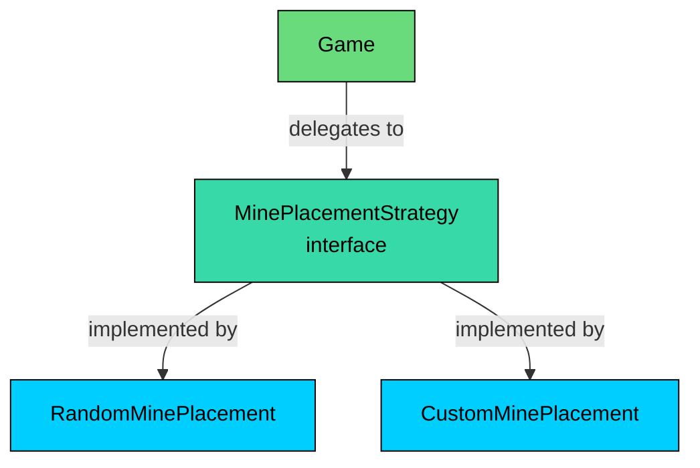

The strategy returns a list of mine positions rather than modifying the board directly. This keeps the strategy focused on position selection while the Board handles the actual cell mutation. It also makes the return value easy to inspect in tests.

### [**Observer Pattern**](/learn/lld/observer)** **(Game Events)

**The Problem:** When game events happen (cell revealed, game won, game lost), statistics need to be updated. The direct approach would be `game.onReveal() { statistics.incrementCellsRevealed(); }`. But this couples Game to GameStatistics. Adding a logger or achievement system later would require modifying Game.

**The Solution:** The Observer pattern decouples the Game (subject) from its listeners (observers). The Game maintains a list of observers and notifies them on key events.

For a single statistics tracker, direct calls would work. We use Observer because:

- It demonstrates proper decoupling
- Adding new listeners (logging, achievements, UI updates) requires zero changes to Game
- The granular event methods make observer implementations straightforward

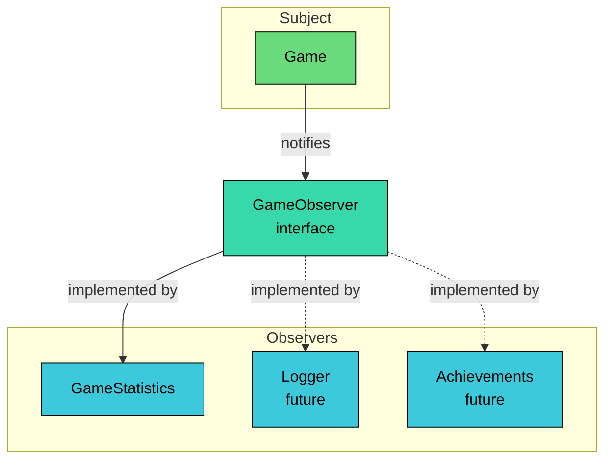

### [**Singleton Pattern**](/learn/lld/singleton)

**The Problem:** We need a single, globally accessible entry point that maintains consistent statistics across multiple games.

**The Solution:** The Singleton pattern ensures only one MinesweeperSystem exists. It provides a global access point via `getInstance()`. Singleton is appropriate here because we genuinely need one statistics tracker shared across all games, and the system acts as a facade for the entire application.

### Why Not the State Pattern"

You might look at `GameStatus` and `CellState` and think "this should use the State pattern." It's a reasonable instinct, but it doesn't earn its weight here.

The State pattern shines when an object's behavior changes dramatically based on its state. An ATM in the `IDLE` state handles card insertion completely differently from the `DISPENSING` state.

In Minesweeper, `GameStatus` is a simple guard check. The `revealCell()` method checks if the game is NOT_STARTED (trigger mine placement) or IN_PROGRESS (process normally). The terminal states (WON, LOST) just mean "reject all actions." That's an if-statement, not a state machine that warrants separate classes.

`CellState` is even simpler. The `reveal()`, `flag()`, and `unflag()` methods on Cell are one-liners. Wrapping each state in its own class with transition methods would add 3 classes that each delegate to a Cell field assignment. That's complexity without benefit.

#### **When State would be warranted"**

If cells had complex per-state behavior (e.g., REVEALED cells respond to clicks differently based on whether they show a number, are blank, or are a mine), the State pattern would start making sense.

---

## 3.3 Full Class Diagram

Here is the complete class diagram showing all entities and their relationships.

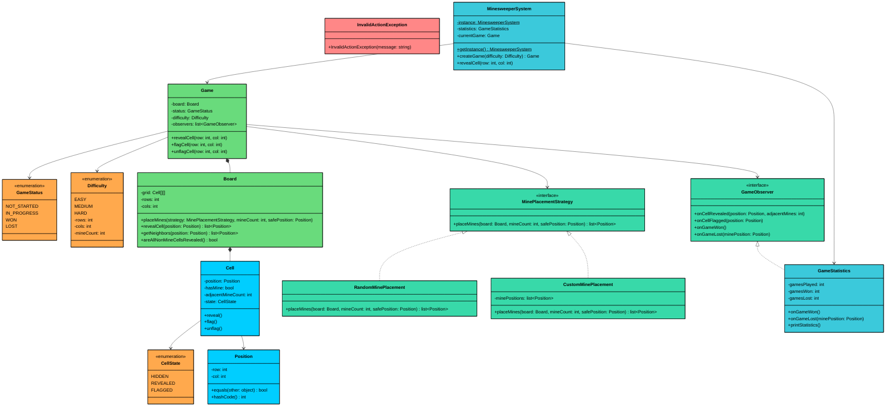

---

# 4. Code Implementation

Now let's translate our design into working code. We'll build bottom-up: foundational types first, then data classes, then the classes with real logic. This order matters because each layer depends on the ones below it.

#### Java

## 4.1 Enums

We start with the three enums that other classes depend on.

#### `CellState`

```java
enum CellState {
    HIDDEN,
    REVEALED,
    FLAGGED
}
```

Three states, strict transitions. HIDDEN is the starting state, REVEALED is terminal, FLAGGED is reversible.

#### `GameStatus`

```java
enum GameStatus {
    NOT_STARTED,
    IN_PROGRESS,
    WON,
    LOST
}
```

Four lifecycle states. NOT_STARTED exists because mine placement is deferred. WON and LOST are terminal.

#### `Difficulty`

```java
enum Difficulty {
    EASY(9, 9, 10),
    MEDIUM(16, 16, 40),
    HARD(30, 16, 99);

    private final int rows;
    private final int cols;
    private final int mineCount;

    Difficulty(int rows, int cols, int mineCount) {
        this.rows = rows;
        this.cols = cols;
        this.mineCount = mineCount;
    }

    public int getRows() { return rows; }
    public int getCols() { return cols; }
    public int getMineCount() { return mineCount; }
}
```

Each Difficulty bundles three configuration values. These match the classic Windows Minesweeper presets.

## 4.2 Custom Exception

Before we write classes that can fail, let's define how they fail.

#### `InvalidActionException`

```java
class InvalidActionException extends RuntimeException {
    public InvalidActionException(String message) {
        super(message);
    }
}
```

We throw this when someone tries to reveal a flagged cell, act on a finished game, or target an out-of-bounds position.

## 4.3 Data Classes

These are the foundational types that hold data.

#### `Position`

```java
class Position {
    private final int row;
    private final int col;

    public Position(int row, int col) {
        this.row = row;
        this.col = col;
    }

    public int getRow() { return row; }
    public int getCol() { return col; }

    @Override
    public boolean equals(Object o) {
        if (this == o) return true;
        if (o == null || getClass() != o.getClass()) return false;
        Position position = (Position) o;
        return row == position.row && col == position.col;
    }

    @Override
    public int hashCode() {
        return 31 * row + col;
    }

    @Override
    public String toString() {
        return "(" + row + ", " + col + ")";
    }
}
```

Position is immutable with value equality. Two Position objects at (2, 3) are considered equal. This is essential for BFS: the visited set needs to correctly detect duplicates. Without proper `equals()` and `hashCode()`, the flood fill would process the same cell multiple times or never terminate.

#### `Cell`

```java
$11f
```

The Cell class manages its own state transitions. The `reveal()`, `flag()`, and `unflag()` methods are simple state assignments. The Game class is responsible for enforcing which transitions are valid (e.g., you can't flag a revealed cell). Keeping the enforcement in Game rather than Cell keeps Cell simple and lets Game handle the cross-cutting validation logic.

## 4.4 Interfaces

Now we define the contracts that our strategy and observer classes will implement.

#### `MinePlacementStrategy`

```java
interface MinePlacementStrategy {
    List<Position> placeMines(Board board, int mineCount, Position safePosition);
}
```

The strategy takes the board (to mark cells as mines), the count, and the safe position to exclude. It returns the list of positions where mines were placed, which the Board uses for adjacency computation.

#### `GameObserver`

```java
interface GameObserver {
    void onCellRevealed(Position position, int adjacentMines);
    void onCellFlagged(Position position);
    void onGameWon();
    void onGameLost(Position minePosition);
}
```

Four event methods, each carrying exactly the data the observer needs. The observer doesn't need access to the entire Game object.

## 4.5 Strategy Implementations

**RandomMinePlacement** generates all valid positions, shuffles them, and picks the first `mineCount` entries.

```java
class RandomMinePlacement implements MinePlacementStrategy {
    @Override
    public List<Position> placeMines(Board board, int mineCount, Position safePosition) {
        List<Position> candidates = new ArrayList<>();

        for (int r = 0; r < board.getRows(); r++) {
            for (int c = 0; c < board.getCols(); c++) {
                Position pos = new Position(r, c);
                if (!pos.equals(safePosition)) {
                    candidates.add(pos);
                }
            }
        }

        Collections.shuffle(candidates);
        List<Position> minePositions = new ArrayList<>();

        for (int i = 0; i < mineCount && i < candidates.size(); i++) {
            Position pos = candidates.get(i);
            board.getCell(pos).setHasMine(true);
            minePositions.add(pos);
        }

        return minePositions;
    }
}
```

The shuffle-and-take approach gives uniform distribution without retry loops. Every valid position has an equal chance of being selected. The `safePosition` is excluded before shuffling, guaranteeing first-click safety.

**CustomMinePlacement** uses predefined positions, making tests deterministic.

```java
class CustomMinePlacement implements MinePlacementStrategy {
    private final List<Position> minePositions;

    public CustomMinePlacement(List<Position> minePositions) {
        this.minePositions = new ArrayList<>(minePositions);
    }

    @Override
    public List<Position> placeMines(Board board, int mineCount, Position safePosition) {
        for (Position pos : minePositions) {
            board.getCell(pos).setHasMine(true);
        }
        return new ArrayList<>(minePositions);
    }
}
```

Notice that CustomMinePlacement ignores `mineCount` and `safePosition`. The test author controls everything. The defensive copy in the constructor prevents external modification of the positions list.

## 4.6 Board Class

The Board is the most algorithmically interesting class. It manages the grid and implements BFS flood fill.

```java
$120
```

Let's walk through the key methods:

`revealCell()`** (BFS Flood Fill):** This is the most important algorithm in the entire design. It uses a queue-based BFS to cascade reveals outward from the clicked position. The algorithm is:

1. Start with the clicked position in the queue
2. Dequeue a position, get its cell
3. If already revealed, skip it (handles duplicates in the queue)
4. Reveal the cell and add it to the result list
5. If the cell has zero adjacent mines (and isn't a mine itself), enqueue all hidden neighbors
6. Repeat until the queue is empty

The key insight is step 5: only zero-adjacency cells expand the frontier. Cells with non-zero counts are revealed but don't cascade. This creates the characteristic "expanding blob" behavior where clicking on an open area reveals a large region bounded by numbered cells.

`getNeighbors()` uses direction arrays to check all 8 surrounding positions. The bounds check filters out positions that would be outside the grid.

`computeAdjacentMineCounts()` runs once after mine placement. For each non-mine cell, it counts how many of its up-to-8 neighbors contain mines. This precomputation means we never need to count neighbors during gameplay.

`areAllNonMineCellsRevealed()` checks the win condition by scanning the entire grid. As soon as it finds a non-mine cell that hasn't been revealed, it returns false. This short-circuits, so it's fast in the common case where the game isn't over yet.

## 4.7 Game Class

The Game class orchestrates everything. Its `revealCell()` method handles first-click safety, mine detection, flood fill delegation, and win/loss notification.

```java
$121
```

Let's break down the key design decisions in the Game class:

**Thread Safety:** All three action methods (`revealCell`, `flagCell`, `unflagCell`) are `synchronized`. This prevents concurrent access from corrupting game state. The observer list uses `CopyOnWriteArrayList` for safe iteration during notification.

**The **`revealCell`** flow:**

1. Check if game is over (fail fast)
2. Check if cell is flagged (prevent accidental reveals)
3. Skip if already revealed (idempotent)
4. If NOT_STARTED: place mines at all positions except the clicked one, transition to IN_PROGRESS
5. If cell has a mine: reveal it, set LOST, notify observers
6. Otherwise: delegate to Board's BFS flood fill, notify observers for each revealed cell, check win condition

**First-click safety:** The critical insight is step 4. Because mines aren't placed until the first reveal, we can pass the clicked position as the `safePosition` to the placement strategy. The strategy excludes this position from mine candidates. This guarantees the first click never hits a mine without any "swap" or "retry" logic.

**Win condition check:** After every successful reveal (no mine hit), we check if all non-mine cells are now revealed. This runs after the flood fill, so a single click that cascades across half the board correctly triggers a win check on the final state.

## 4.8 GameStatistics Class

GameStatistics demonstrates the Observer pattern in action. It tracks aggregate results using thread-safe atomic counters.

```java
$122
```

Each counter is an `AtomicInteger`, providing lock-free thread safety. If multiple games end concurrently (in a multi-game server scenario), these counters update correctly without explicit synchronization.

The `onCellFlagged` method is a no-op. We could track flagging statistics later, but for now we only care about reveals and game outcomes. The interface requires us to implement the method, but the implementation can choose to ignore events it doesn't care about.

## 4.9 MinesweeperSystem (Singleton Facade)

The system class is the public entry point. External code only needs to know about this class.

```java
$123
```

**Singleton Implementation Details:**

- **Double-checked locking:** The first `null` check avoids synchronization overhead when the instance already exists. The second check (inside the synchronized block) handles the race condition where two threads both pass the first check.
- `volatile`** keyword:** Ensures other threads see the fully constructed instance, not a partially initialized one.
- **Overloaded **`createGame`**:** The single-parameter version uses `RandomMinePlacement` (production default). The two-parameter version accepts a custom strategy (for testing). This keeps the common case simple.
- `resetInstance()`** for testing:** Singletons are hard to test because state persists across tests. This method lets us reset between test cases.

## 4.10 Demo Class

Let's see the system in action.

```java
$124
```

### Move Sequence Diagram

The following diagram illustrates what happens when a player reveals a cell (after the first click):

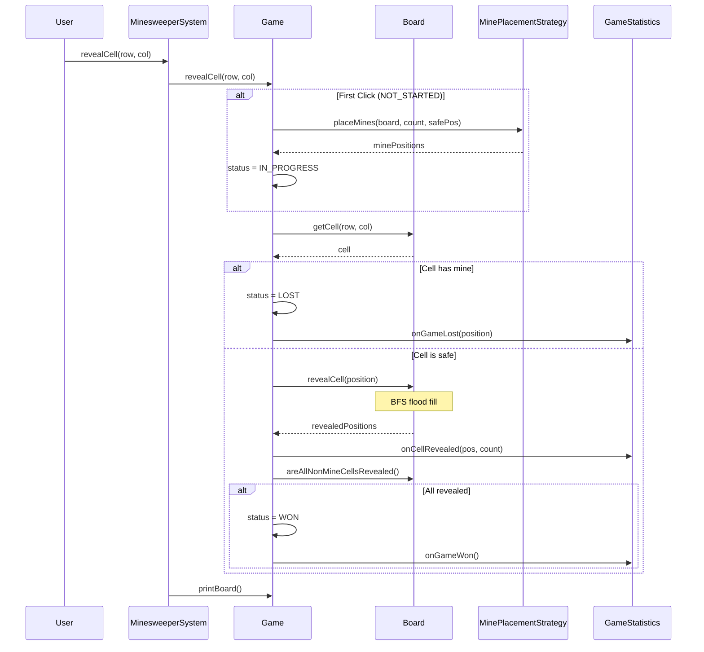

Let's walk through the key phases of this flow.

**Phase 1: First-Click Handling.** If the game hasn't started yet, the first reveal triggers mine placement. The Game passes the clicked position as the safe position, guaranteeing no mine lands there. The strategy places mines, the Board computes adjacency counts, and the status transitions to IN_PROGRESS. All of this happens before the reveal is processed.

**Phase 2: Mine Check.** After mine placement (or immediately if mines are already placed), the Game checks if the target cell contains a mine. If so, the cell is revealed (showing the mine), the status transitions to LOST, and observers are notified. The flow stops here.

**Phase 3: Flood Fill.** If the cell is safe, the Game delegates to Board's `revealCell()` method, which runs BFS flood fill. The result is a list of all positions that were revealed (potentially many cells for a zero-adjacency cascade). The Game notifies observers for each revealed cell.

**Phase 4: Win Check.** After flood fill completes, the Game checks if all non-mine cells are now revealed. If so, the status transitions to WON and observers are notified. This check runs after every reveal, ensuring the win is detected immediately when the last safe cell is uncovered.

---

# 5. Concurrency and Thread Safety

Does Minesweeper actually need thread safety" 

For a desktop application where one person clicks cells, no. But consider a web-based version: the player clicks rapidly, each click generates an HTTP request, and each request is handled by a separate thread. Or imagine a multiplayer variant where two players compete on the same board. Without synchronization, things can go wrong.

### Race Condition: Simultaneous Reveals

**Setup:** A player rapidly clicks two cells. Two request threads hit `Game.revealCell()` concurrently.

#### **Without synchronization:**

1. Thread-A: Reads cell (2,3) state = HIDDEN
2. Thread-B: Reads cell (2,3) state = HIDDEN (same cell!)
3. Thread-A: Reveals cell, flood fill cascades, reveals 15 cells
4. Thread-B: Tries to reveal same cell, it's already REVEALED (skip), but...
5. Thread-B: Win check runs between Thread-A's reveal and Thread-A's win check
6. Both threads call `notifyGameWon()`, statistics counted twice

#### **With synchronization:**

The `synchronized` keyword on `revealCell()` ensures Thread-A completes the entire sequence (reveal, flood fill, win check, notification) atomically. Thread-B waits until Thread-A releases the lock. Thread-B then sees the updated state and correctly handles the already-revealed cell.

---

# 6. Extensions

One of the best ways to validate a design is to see how it handles change. If adding a feature requires modifying multiple classes, the design has problems. Let's walk through four common extension requests.

## 6.1 New Difficulty Level

**Scenario:** "Add an Expert difficulty (24x30, 130 mines)."

This is a one-value change. Add a new value to the Difficulty enum:

```java
enum Difficulty {
    EASY(9, 9, 10),
    MEDIUM(16, 16, 40),
    HARD(30, 16, 99),
    EXPERT(24, 30, 130);  // New!

    // ... rest unchanged
}
```

No other class needs to change. The Board already handles arbitrary sizes, and the mine placement strategies are size-agnostic.

**What stays unchanged:** Board, Cell, Game, GameStatistics, MinesweeperSystem, all strategies.

---

## 6.2 Hint System

**Scenario:** "Add a hint feature that reveals a random safe cell."

We add a `getHint()` method to Game that finds a random hidden non-mine cell:

```java
public Position getHint() {
    List<Position> safeCells = new ArrayList<>();
    for (int r = 0; r < board.getRows(); r++) {
        for (int c = 0; c < board.getCols(); c++) {
            Cell cell = board.getCell(r, c);
            if (cell.isHidden() && !cell.hasMine()) {
                safeCells.add(new Position(r, c));
            }
        }
    }
    if (safeCells.isEmpty()) return null;
    return safeCells.get(new Random().nextInt(safeCells.size()));
}
```

The caller then calls `revealCell()` on the returned position. The existing flood fill handles the rest.

**What stays unchanged:** Board, Cell, strategies, observers, MinesweeperSystem.

---

## 6.3 Undo (Command Pattern)

**Scenario:** "Allow undoing the last reveal."

The Command pattern wraps each action in an object that can be reversed:

```java
$14a
```

The Game would maintain a stack of commands. `undo()` pops the last command and reverses it. This is more complex for Minesweeper than Tic-Tac-Toe because a single reveal can cascade to many cells, all of which need to be un-revealed.

**What stays unchanged:** Board, Cell, strategies, observers (though statistics would need adjustment for undone moves).

---

## 6.4 Timer Observer

**Scenario:** "Track how long each game takes."

Create a new observer that tracks timing:

```java
class TimerObserver implements GameObserver {
    private long startTime;
    private long endTime;

    @Override
    public void onCellRevealed(Position position, int adjacentMines) {
        if (startTime == 0) {
            startTime = System.currentTimeMillis();
        }
    }

    @Override
    public void onGameWon() {
        endTime = System.currentTimeMillis();
        System.out.println("Time: " + (endTime - startTime) / 1000.0 + " seconds");
    }

    @Override
    public void onGameLost(Position minePosition) {
        endTime = System.currentTimeMillis();
        System.out.println("Time: " + (endTime - startTime) / 1000.0 + " seconds");
    }

    @Override
    public void onCellFlagged(Position position) { }
}
```

Register it alongside GameStatistics:

```java
game.addObserver(statistics);
game.addObserver(new TimerObserver());
```

**What stays unchanged:** Game, Board, Cell, strategies, GameStatistics. The Game doesn't know or care what observers are watching it.

---

# 7. Quiz
