> 💡 **Key Insight:**

> **What is Chess Game"**
>
> A **chess game** is a strategic board game played between two players on a square board with **64 squares** arranged in an 8×8 grid.
>
> Each player controls an army of **16 pieces** and takes turns moving them according to specific rules, with the goal of trapping the opponent’s king in a position where it cannot escape. This is called **checkmate**.
>
> 
> <!-- Simulation: chess -->
> 

In this chapter, we will explore the **low-level design of a chess game** in detail.

Let's start by clarifying the requirements:

---

# 1. Clarifying Requirements

Before starting any design, it's important to ask thoughtful questions to uncover hidden assumptions, clarify ambiguities, and define the system's scope. In an interview setting, this dialogue demonstrates that you think before you code.

Here is an example of how a discussion between the candidate and the interviewer might unfold:

> 💡 **Key Insight:**

> **DISCUSSION**
>
> **Candidate:** "Are we building a standard two-player chess game on an 8x8 board with all standard piece types""
>
> **Interviewer:** "Yes, standard chess rules with two players, one controlling white pieces and the other controlling black."
>
> **Candidate:** "Should we support all standard piece movements, including special moves like castling, en passant, and pawn promotion""
>
> **Interviewer:** "Yes, implement all standard movement rules. Castling, en passant, and pawn promotion should all be supported."
>
> **Candidate:** "How should we handle check and checkmate" Should the system automatically detect when a king is in check and prevent illegal moves that leave the king exposed""
>
> **Interviewer:** "Yes, the system must detect check, prevent moves that would leave your own king in check, and detect checkmate and stalemate conditions to end the game."
>
> **Candidate:** "Should we support move history so we can track what happened during the game""
>
> **Interviewer:** "Yes, maintain a history of all moves made. This is also needed for en passant detection since it depends on the previous move."
>
> **Candidate:** "Should we support game termination by resignation, or only through checkmate and stalemate""
>
> **Interviewer:** "Support resignation as well. Either player should be able to resign at any time."

After gathering the details, we can summarize the key system requirements.

## 1.1 Functional Requirements

- Support a standard 8x8 chess board with all six piece types (King, Queen, Rook, Bishop, Knight, Pawn)
- Enforce piece-specific movement rules, including path clearance for sliding pieces
- Validate that moves don't leave the moving player's king in check
- Detect check, checkmate, and stalemate conditions automatically
- Support special moves: castling (kingside and queenside), en passant, and pawn promotion
- Track move history for the entire game
- Support player resignation to end the game immediately
- Enforce turn-based play, alternating between white and black
- Initialize the board with pieces in their standard starting positions

---

## 1.2 Non-Functional Requirements

- The design should follow **object-oriented principles** with clear separation of concerns
- Piece movement logic should be **extensible** without modifying existing classes
- The code should be **clean** with meaningful variable names
- The system should be **modular enough** to test individual components in isolation
- The design should be **extensible for future enhancements** like undo/redo and move notation

---

# 2. Identifying Core Entities

> [!PAYWALL] This content is for premium members only.

How do you go from a list of requirements to actual classes" The key is to look for **nouns** in the requirements that have distinct attributes or behaviors. Not every noun becomes a class, but this approach gives you a starting point.

Let's walk through our requirements and identify what needs to exist in our system.

### 2.1 Game and Status

> "Detect check, checkmate, and stalemate conditions automatically"

The game is the central coordinator. It manages turns, validates moves against the rules, and determines when the game ends. This gives us the **Game** entity.

For the lifecycle, we need a **GameStatus** enum with values `ACTIVE`, `CHECK`, `CHECKMATE`, `STALEMATE`, `RESIGNED`. Unlike a simple three-state lifecycle, chess has a more nuanced state machine. The game starts as ACTIVE, can oscillate between ACTIVE and CHECK as threats arise and resolve, and eventually reaches a terminal state (CHECKMATE, STALEMATE, or RESIGNED). CHECK is unusual because it's not terminal. The game continues, but the player in check must resolve the threat on their next move.

### 2.2 Board

> "Support a standard 8x8 chess board"

The **Board** is the grid that holds pieces. It's an 8x8 array where each cell either contains a piece or is empty (null). The board handles piece placement and retrieval, but it doesn't know the rules of chess. It's a container, not a referee.

Why separate Board from Game" Because the board's job is managing the grid (get piece at position, set piece at position, move piece from A to B). The game's job is enforcing rules (is this move legal, is the king in check, is the game over). Mixing these responsibilities creates a god class.

### 2.3 Pieces

> "Support all six piece types with distinct movement rules"

Each piece type has unique movement logic. A **Piece** abstract class provides the common state (color, type, whether it has moved), and concrete subclasses (**King**, **Queen**, **Rook**, **Bishop**, **Knight**, **Pawn**) implement their specific movement rules.

Why an abstract class instead of an interface" Because pieces share concrete state: every piece has a color, a type, and a `hasMoved` flag. An abstract class lets us define this shared implementation once. If pieces only shared behavior contracts with no shared state, an interface would be the right choice.

### 2.4 Position

> "Moving to an invalid position (off the board)"

A **Position** is a value object representing a row and column on the board (0-7 for both). Encapsulating coordinates in a Position class with validation prevents invalid positions from propagating through the system. Instead of passing raw `int row, int col` everywhere and checking bounds in multiple places, we validate once at construction.

### 2.5 Move

> "Track move history for the entire game"

A **Move** records what happened: which piece moved from where to where, whether it captured a piece, and whether it involved a special action (promotion, castling, en passant). Move objects are immutable. Once a move happens, the record doesn't change. This is important for en passant detection (we need to inspect the previous move) and for future undo/redo support.

### 2.6 Player

> "Two players, one controlling white pieces and the other controlling black"

A **Player** has a name and a color. Players are simple identity holders in this design. Authentication and rating systems are out of scope.

Here's how these entities relate to each other:

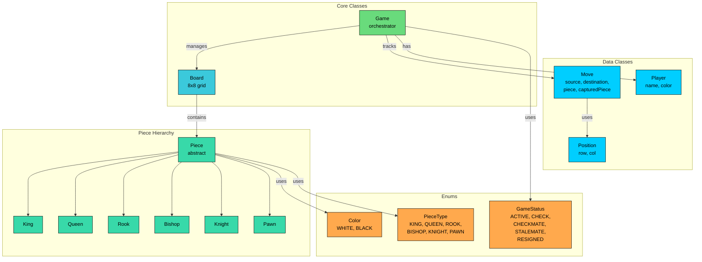

We've identified four types of entities:

**Enums** define fixed sets of values. They provide type safety and make code self-documenting.

**Data Classes** primarily hold data with minimal behavior. Player, Position, and Move are containers with some helper methods (like Position's validation).

**Piece Hierarchy** uses inheritance for movement polymorphism. The abstract Piece class defines the contract, and six concrete subclasses implement their unique movement logic.

**Core Classes** contain the main logic. Board manages the grid, and Game orchestrates the entire system.

| Entity | Type | Responsibility |
|--------|------|----------------|
| `Color` | Enum | Player/piece sides: WHITE, BLACK |
| `PieceType` | Enum | Piece categories: KING, QUEEN, ROOK, BISHOP, KNIGHT, PAWN |
| `GameStatus` | Enum | Game lifecycle: ACTIVE, CHECK, CHECKMATE, STALEMATE, RESIGNED |
| `ChessException` | Exception | Domain-specific error for rule violations |
| `Player` | Data Class | Player identity (name, color) |
| `Position` | Data Class | Board coordinate (row, col) with validation |
| `Move` | Data Class | Immutable record of a move with source, destination, captured piece |
| `Piece` | Abstract Class | Common piece state (color, type, hasMoved) and movement contract |
| `King` | Piece | 1 square any direction + castling |
| `Queen` | Piece | Combines rook and bishop movement |
| `Rook` | Piece | Horizontal and vertical lines |
| `Bishop` | Piece | Diagonal lines |
| `Knight` | Piece | L-shape jumps (ignores blocking pieces) |
| `Pawn` | Piece | Forward movement, diagonal capture, en passant, promotion |
| `Board` | Core Class | 8x8 grid management, piece placement, initial setup |
| `Game` | Core Class | Turn management, move validation, check/checkmate detection |

With our entities identified, let's define their attributes, behaviors, and relationships.

---

# 3. Designing Classes and Relationships

Now that we know what entities we need, let's flesh out their details. For each class, we'll define what data it holds (attributes) and what it can do (methods). Then we'll look at how these classes connect to each other.

## 3.1 Class Definitions

We'll work bottom-up: simple types first, then data containers, then the classes with real logic. This order makes sense because complex classes depend on simpler ones.

### Enums

Enums define fixed sets of values that provide type safety and make code self-documenting. Using enums prevents invalid states at compile time rather than runtime.

#### `Color`

Represents the two sides of the game.

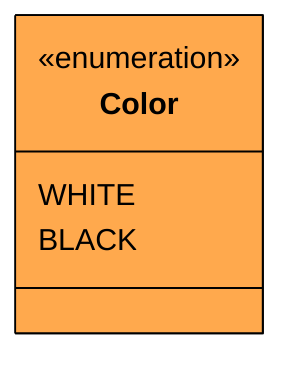

| Value | Meaning |
|-------|---------|
| `WHITE` | The player who moves first |
| `BLACK` | The player who moves second |

Simple, but essential. Color is used everywhere: piece ownership, turn tracking, and determining which direction pawns move. We'll add an `opposite()` method to easily switch between turns.

#### `PieceType`

Categorizes the six chess piece types.

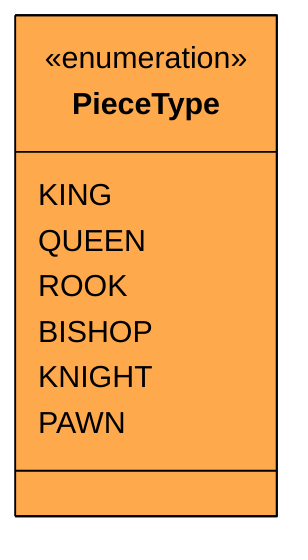

| Value | Symbol | Standard Count Per Side |
|-------|--------|------------------------|
| `KING` | K | 1 |
| `QUEEN` | Q | 1 |
| `ROOK` | R | 2 |
| `BISHOP` | B | 2 |
| `KNIGHT` | N | 2 |
| `PAWN` | - | 8 |

> 💡 **Key Insight:**

> **Design Decision**
>
> We use an enum for piece type rather than relying solely on `instanceof` checks. The enum provides a clean way to identify piece types in switch statements and display logic without coupling to the class hierarchy.

#### `GameStatus`

Tracks the current state of the game.

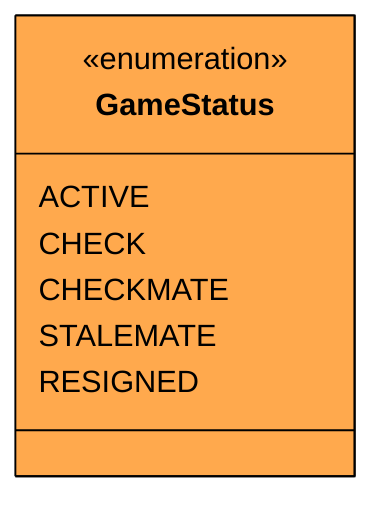

| Value | Meaning | Terminal" |
|-------|---------|-----------|
| `ACTIVE` | Normal play, no immediate threats | No |
| `CHECK` | Current player's king is under attack | No |
| `CHECKMATE` | Current player's king is in check with no escape | Yes |
| `STALEMATE` | Current player has no legal moves but isn't in check | Yes |
| `RESIGNED` | A player voluntarily surrendered | Yes |

#### State Transition Diagram

The state diagram for chess is more interesting than most LLD problems because CHECK is a non-terminal state that the game can oscillate in and out of.

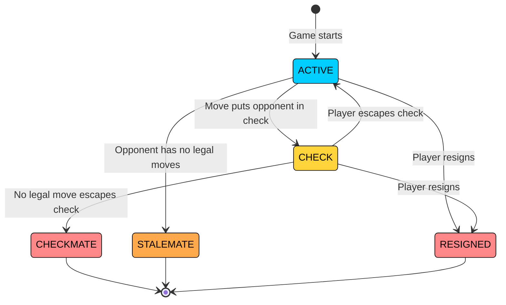

Notice that CHECK can transition back to ACTIVE. This is the key difference from simpler state machines. A player in check must make a move that resolves the threat (move the king, block the attack, or capture the attacker). If they succeed, the game returns to ACTIVE. If no legal move resolves the check, it's CHECKMATE.

### Custom Exception

Before we write classes that can fail, let's define how they fail. A custom exception makes error handling cleaner than catching generic `RuntimeException`.

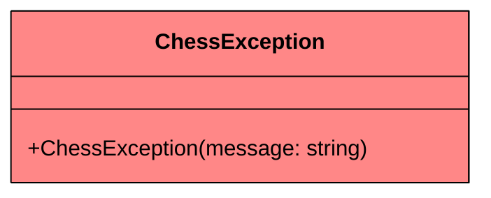

We'll throw this when an illegal move is attempted, a move is made out of turn, the game is already over, or any other chess rule is violated.

### Data Classes

Data classes are simple containers that hold data with minimal behavior. They represent the "nouns" in our system that have attributes but limited logic.

#### `Player` 

Represents a chess player.

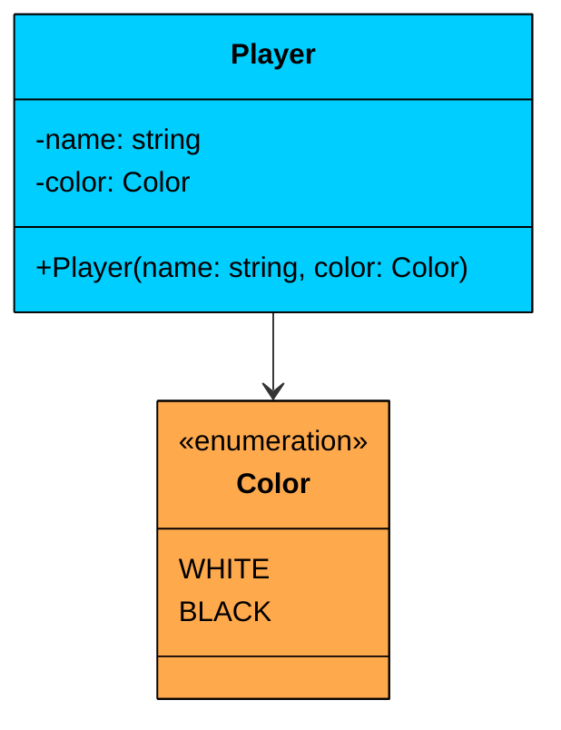

| Attribute | Type | Description | Mutable" |
|-----------|------|-------------|----------|
| `name` | string | Player's display name | No |
| `color` | Color | Which side they play (WHITE or BLACK) | No |

The Player class is **immutable**. Once created, a player's name and color don't change. In this design, players are simple identity holders. Rating systems and authentication are out of scope.

#### `Position`

Represents a coordinate on the chess board.

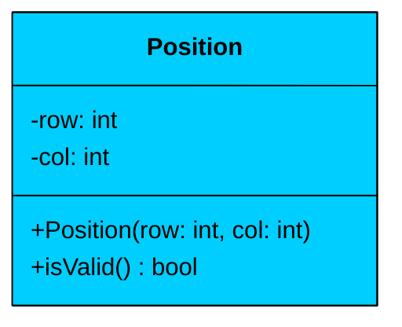

| Attribute | Type | Description | Mutable" |
|-----------|------|-------------|----------|
| `row` | int | Row index (0-7, where 0 is the top/black's back rank) | No |
| `col` | int | Column index (0-7, where 0 is the leftmost column) | No |

| Method | Description |
|--------|-------------|
| `Position(row, col)` | Constructor with validation (both must be 0-7) |

The Position class is a **value object**. Two positions with the same row and column are equal. Immutability means positions can be safely shared and compared without defensive copying. The constructor validates that both row and col are within 0-7, catching off-board positions at creation time.

#### `Move` 

Records a single move in the game.

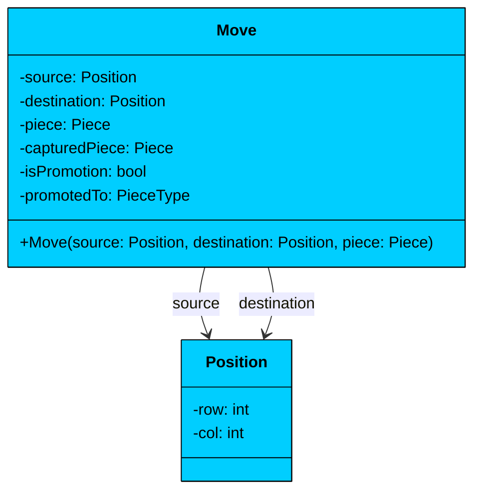

| Attribute | Type | Description | Mutable" |
|-----------|------|-------------|----------|
| `source` | Position | Where the piece moved from | No |
| `destination` | Position | Where the piece moved to | No |
| `piece` | Piece | The piece that was moved | No |
| `capturedPiece` | Piece | The piece that was captured (null if none) | Yes (set after creation) |
| `isPromotion` | bool | Whether this move involved pawn promotion | Yes (set after creation) |
| `promotedTo` | PieceType | What the pawn was promoted to | Yes (set after creation) |

The Move class captures the complete state of a move. We store the captured piece (not just whether a capture happened) so we have all the information needed for undo/redo support. The promotion fields handle the case where a pawn reaches the opposite end of the board.

> 💡 **Key Insight:**

> **Why store the piece reference"**
>
> Because we need to know which piece moved for display purposes and for en passant detection. The previous move's piece type tells us whether an en passant capture is possible.

### Piece Hierarchy

The piece hierarchy is the core of this design. Each piece type has fundamentally different movement rules, and polymorphism lets the board and game interact with pieces without knowing which type they are.

#### `Piece` (abstract) 

Defines the common structure and movement contract.

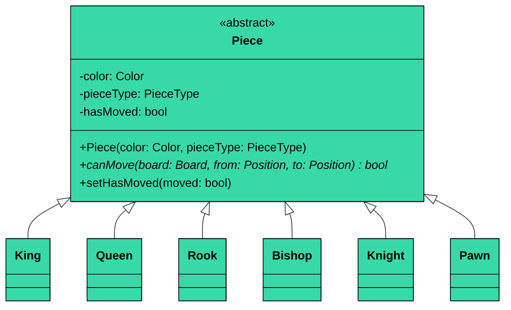

| Attribute | Type | Description | Mutable" |
|-----------|------|-------------|----------|
| `color` | Color | Which side owns this piece | No |
| `pieceType` | PieceType | What type of piece this is | No |
| `hasMoved` | bool | Whether this piece has moved from its starting position | Yes |

| Method | Description |
|--------|-------------|
| `canMove(board, from, to)` | Abstract: returns true if this piece can legally move from source to destination |
| `setHasMoved(moved)` | Marks the piece as having moved (important for castling and pawn double-move) |

The `hasMoved` flag is critical for two special rules: castling (king and rook must not have moved) and pawn's initial double-move (only from starting position). We track this per-piece rather than computing it from move history because it's simpler and more efficient.

Each concrete subclass implements `canMove()` with its specific movement logic:

- **King:** One square in any direction. Also handles castling (two squares toward a rook).
- **Queen:** Any number of squares horizontally, vertically, or diagonally. Must check path clearance.
- **Rook:** Any number of squares horizontally or vertically. Must check path clearance.
- **Bishop:** Any number of squares diagonally. Must check path clearance.
- **Knight:** L-shaped moves (2+1 squares). The only piece that jumps over others.
- **Pawn:** Forward one square (or two from start), captures diagonally. Handles en passant and promotion eligibility.

> 💡 **Key Insight:**

> **Design Decision**
>
> We don't include `getPossibleMoves()` in the base class. While useful, it's not strictly necessary for the core design. The `canMove()` method is sufficient for move validation, and generating all possible moves can be derived from it when needed (for checkmate detection, we iterate all positions and call `canMove()`).

### Core Classes

#### `Board` 

Manages the 8x8 grid of pieces.

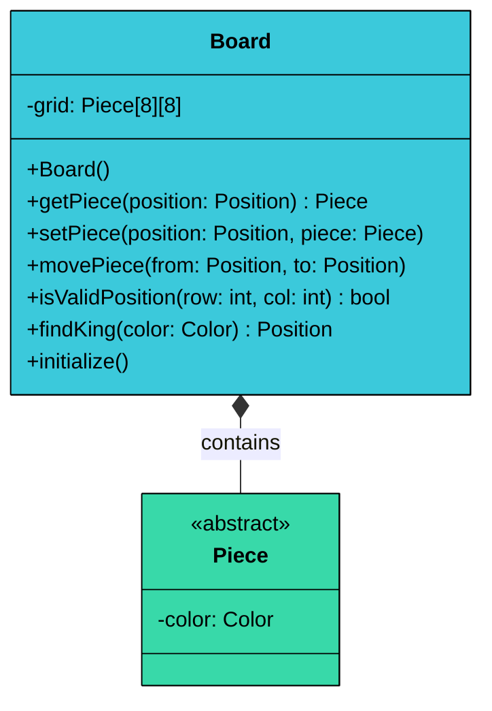

| Attribute | Type | Description |
|-----------|------|-------------|
| `grid` | Piece\[8\]\[8\] | 8x8 array, null means empty square |

| Method | Description |
|--------|-------------|
| `Board()` | Constructor, initializes pieces in standard starting positions |
| `getPiece(position)` | Returns the piece at the given position (null if empty) |
| `setPiece(position, piece)` | Places a piece at the given position (null to clear) |
| `movePiece(from, to)` | Moves piece from source to destination, clears source |
| `isValidPosition(row, col)` | Returns true if row and col are both 0-7 |
| `findKing(color)` | Scans the board and returns the position of the king with the given color |

The Board handles **mechanics**, not **rules**. It can move any piece anywhere. The Game class is responsible for checking whether a move is legal before telling the board to execute it. This separation keeps both classes focused.

The `findKing()` method is essential for check detection. After every move, we need to know where the king is to determine if any opponent piece can attack that square.

#### `Game` 

It is the orchestrator that enforces all chess rules.

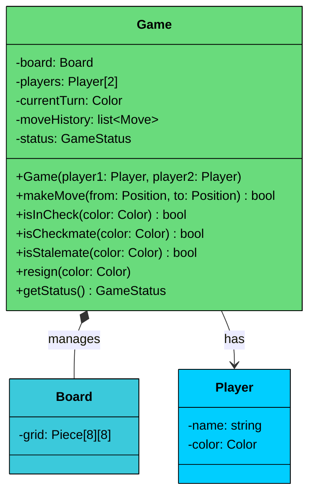

| Attribute | Type | Description |
|-----------|------|-------------|
| `board` | Board | The chess board |
| `players` | Player\[2\] | White and black players |
| `currentTurn` | Color | Whose turn it is (starts with WHITE) |
| `moveHistory` | list\<Move\> | All moves made in the game |
| `status` | GameStatus | Current game state |

| Method | Description |
|--------|-------------|
| `Game(player1, player2)` | Creates a new game with initialized board |
| `makeMove(from, to)` | Validates and executes a move, updates game status |
| `isInCheck(color)` | Returns true if the given color's king is under attack |
| `isCheckmate(color)` | Returns true if the color is in check with no legal escape |
| `isStalemate(color)` | Returns true if the color has no legal moves but isn't in check |
| `resign(color)` | The specified color resigns, game ends |

#### **Key Design Principles:**

1. **Board owns the grid, Game owns the rules:** Board handles piece placement mechanics. Game handles legality, turns, check detection, and win conditions.
2. **Move validation pipeline:** `makeMove()` validates turn, piece ownership, movement rules, and king safety before executing. If any check fails, the move is rejected.
3. **Check detection after every move:** After executing a move, Game checks if the opponent is now in check, checkmate, or stalemate, and updates the status accordingly.

**Relationship:** Game has a **composition** relationship with Board (the board doesn't exist independently of the game). It has **associations** with Player objects (players exist independently).

---

## 3.2 Full Class Diagram

Here's the complete system with all classes and their relationships:

```mermaid
classDiagram
    %% Enums
    class Color {
        <<enumeration>>
        WHITE
        BLACK
        +opposite() Color
    }

    class PieceType {
        <<enumeration>>
        KING
        QUEEN
        ROOK
        BISHOP
        KNIGHT
        PAWN
    }

    class GameStatus {
        <<enumeration>>
        ACTIVE
        CHECK
        CHECKMATE
        STALEMATE
        RESIGNED
    }

    %% Exception
    class ChessException {
        +ChessException(message: string)
    }

    %% Data Classes
    class Player {
        -name: string
        -color: Color
    }

    class Position {
        -row: int
        -col: int
    }

    class Move {
        -source: Position
        -destination: Position
        -piece: Piece
        -capturedPiece: Piece
        -isPromotion: bool
    }

    %% Piece Hierarchy
    class Piece {
        <<abstract>>
        -color: Color
        -pieceType: PieceType
        -hasMoved: bool
        +canMove(board: Board, from: Position, to: Position)* bool
    }

    class King {
        +canMove(board: Board, from: Position, to: Position) bool
    }
    class Queen {
        +canMove(board: Board, from: Position, to: Position) bool
    }
    class Rook {
        +canMove(board: Board, from: Position, to: Position) bool
    }
    class Bishop {
        +canMove(board: Board, from: Position, to: Position) bool
    }
    class Knight {
        +canMove(board: Board, from: Position, to: Position) bool
    }
    class Pawn {
        +canMove(board: Board, from: Position, to: Position) bool
    }

    %% Core Classes
    class Board {
        -grid: Piece[8][8]
        +getPiece(pos: Position) Piece
        +setPiece(pos: Position, piece: Piece)
        +movePiece(from: Position, to: Position)
        +findKing(color: Color) Position
    }

    class Game {
        -board: Board
        -players: Player[2]
        -currentTurn: Color
        -moveHistory: list~Move~
        -status: GameStatus
        +makeMove(from: Position, to: Position) bool
        +isInCheck(color: Color) bool
        +isCheckmate(color: Color) bool
        +resign(color: Color)
    }

    %% Relationships
    Piece --> Color : has
    Piece --> PieceType : has
    Piece <|-- King
    Piece <|-- Queen
    Piece <|-- Rook
    Piece <|-- Bishop
    Piece <|-- Knight
    Piece <|-- Pawn

    Player --> Color : plays as

    Move --> Position : source + destination
    Move --> Piece : moved piece

    Board *-- Piece : contains
    Game *-- Board : manages
    Game --> Player : has
    Game --> GameStatus : tracks
    Game --> Move : records
    Game --> ChessException : throws

    %% Styles
    style Color fill:#ffa94d,stroke:#000,color:#000
    style PieceType fill:#ffa94d,stroke:#000,color:#000
    style GameStatus fill:#ffa94d,stroke:#000,color:#000
    style ChessException fill:#ff8787,stroke:#000,color:#000
    style Player fill:#00ceff,stroke:#000,color:#000
    style Position fill:#00ceff,stroke:#000,color:#000
    style Move fill:#00ceff,stroke:#000,color:#000
    style Piece fill:#38d9a9,stroke:#000,color:#000
    style King fill:#38d9a9,stroke:#000,color:#000
    style Queen fill:#38d9a9,stroke:#000,color:#000
    style Rook fill:#38d9a9,stroke:#000,color:#000
    style Bishop fill:#38d9a9,stroke:#000,color:#000
    style Knight fill:#38d9a9,stroke:#000,color:#000
    style Pawn fill:#38d9a9,stroke:#000,color:#000
    style Board fill:#3bc9db,stroke:#000,color:#000
    style Game fill:#69db7c,stroke:#000,color:#000
```

---

## 3.4 Design Patterns

You might notice some structural patterns emerging in our design. Let's make them explicit and justify why each pattern earns its place.

This problem is **pattern-light** compared to some of the other problems. The core challenge is modeling distinct movement behaviors for six piece types, not coordinating interchangeable algorithms or event-driven notifications. This calls for **polymorphism through inheritance**, and the temptation to reach for heavier patterns should be resisted.

### Polymorphism: Piece Movement

**The Problem:** Six piece types each move differently. The Game and Board need to validate and execute moves without knowing which specific piece type they're dealing with.

**The Solution:** The abstract `Piece` class defines `canMove(board, from, to)`, and each subclass provides its own implementation.

When `Game.makeMove()` calls `piece.canMove(board, source, destination)`,  dynamic dispatch routes to the correct piece type's logic. The Game never writes `if (piece instanceof King)` for basic movement.

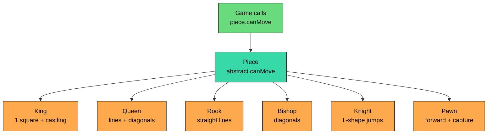

> 💡 **Key Insight:**

> **Design Alternative**
>
> We could use the Strategy pattern with a `MovementStrategy` interface and inject different strategies into a generic `Piece` class. This adds a layer of indirection (Piece -> MovementStrategy -> concrete strategy) without any benefit, since pieces never change their movement behavior. If an interviewer asks "why not Strategy"", explain that Strategy solves the problem of runtime behavior swapping, which chess pieces don't need.

### Why Not the State Pattern for GameStatus"

You might look at `GameStatus` with its transitions (ACTIVE -> CHECK -> CHECKMATE) and think: "Shouldn't I use the State pattern""

The State pattern is valuable when an object's **behavior changes significantly** based on its state. Think of a vending machine where `insertCoin()` does completely different things in each state.

GameStatus has 5 states, but the behavior difference is minimal. In ACTIVE and CHECK states, the game accepts moves (with CHECK adding the constraint that the move must resolve the threat). In terminal states (CHECKMATE, STALEMATE, RESIGNED), the game rejects all moves. That's a simple guard check, not fundamentally different behavior per state.

**What the State pattern would look like here:**

- `ActiveState.makeMove()` -> validates and executes move, checks for check
- `CheckState.makeMove()` -> validates move AND ensures it resolves check
- `CheckmateState.makeMove()` -> throws exception
- `StalemateState.makeMove()` -> throws exception
- `ResignedState.makeMove()` -> throws exception

That's 5 classes to replace what's currently a 3-line guard check at the top of `makeMove()` plus the status update logic after each move. More code, more files, zero added clarity.

---

# 4. Code Implementation

This section presents the complete implementation, built bottom-up. We start with simple types and build toward the complex orchestrator. Every class follows the design from previous section.

#### Java

## Enums

#### `Color` 

Represents the two sides. The `opposite()` method makes turn switching clean.

```java
enum Color {
    WHITE, BLACK;

    public Color opposite() {
        return this == WHITE " BLACK : WHITE;
    }
}
```

#### `PieceType` 

Categorizes the six piece types.

```java
enum PieceType {
    KING, QUEEN, ROOK, BISHOP, KNIGHT, PAWN
}
```

#### `GameStatus` 

Tracks the game lifecycle.

```java
enum GameStatus {
    ACTIVE,      // Normal play
    CHECK,       // Current player's king is under attack
    CHECKMATE,   // Current player has no legal move to escape check
    STALEMATE,   // Current player has no legal moves but isn't in check
    RESIGNED     // A player voluntarily surrendered
}
```

## Custom Exception

#### `ChessException` 

Provides a domain-specific exception for all rule violations.

```java
class ChessException extends RuntimeException {
    public ChessException(String message) {
        super(message);
    }
}
```

We extend `RuntimeException` (unchecked) because chess rule violations are not recoverable by retrying. The caller needs to change their input (pick a different move).

## Data Classes

#### `Player` 

It is a simple immutable identity holder.

```java
class Player {
    private final String name;
    private final Color color;

    public Player(String name, Color color) {
        this.name = name;
        this.color = color;
    }

    public String getName() { return name; }
    public Color getColor() { return color; }

    @Override
    public String toString() { return name + " (" + color + ")"; }
}
```

#### `Position` 

It is a value object representing a board coordinate. The constructor validates bounds, and `equals`/`hashCode` are implemented so positions can be compared and used in collections.

```java
class Position {
    private final int row;
    private final int col;

    public Position(int row, int col) {
        if (row < 0 || row > 7 || col < 0 || col > 7) {
            throw new ChessException(
                "Invalid position: (" + row + ", " + col + ")");
        }
        this.row = row;
        this.col = col;
    }

    public int getRow() { return row; }
    public int getCol() { return col; }

    @Override
    public boolean equals(Object o) {
        if (this == o) return true;
        if (!(o instanceof Position)) return false;
        Position p = (Position) o;
        return row == p.row && col == p.col;
    }

    @Override
    public int hashCode() {
        return 31 * row + col;
    }

    @Override
    public String toString() {
        char file = (char) ('a' + col);
        int rank = 8 - row;
        return "" + file + rank;
    }
}
```

The `toString()` converts internal coordinates (row 0, col 4) to standard algebraic notation (e8). Row 0 is rank 8 (black's back rank), and column 0 is file 'a'.

#### `Move`

Captures the full state of a move for history tracking and en passant detection.

```java
$102
```

The Move class is mostly immutable. The `capturedPiece` and promotion fields are set after construction because they depend on move execution logic that happens in the Game class.

## Piece Hierarchy

Now the core of the design: the abstract Piece and its six concrete subclasses.

#### `Piece` 

Provides the shared state and defines the movement contract.

```java
abstract class Piece {
    protected final Color color;
    protected final PieceType pieceType;
    protected boolean hasMoved;

    public Piece(Color color, PieceType pieceType) {
        this.color = color;
        this.pieceType = pieceType;
        this.hasMoved = false;
    }

    public abstract boolean canMove(Board board, Position from, Position to);

    public Color getColor() { return color; }
    public PieceType getPieceType() { return pieceType; }
    public boolean hasMoved() { return hasMoved; }
    public void setHasMoved(boolean moved) { this.hasMoved = moved; }
}
```

Every subclass implements `canMove()` with its specific movement rules. Let's go through each one.

**King** moves one square in any direction. It also supports castling, which is the most complex special move in chess.

```java
$103
```

Castling has three conditions: neither king nor rook has moved, all squares between them are empty, and the king doesn't pass through or land in check. We handle the first two here. The third (check detection) is handled by the Game class because it requires knowledge of all pieces on the board, which is the Game's responsibility.

**Queen** combines rook and bishop movement. She moves any number of squares horizontally, vertically, or diagonally.

```java
$104
```

The `isPathClear()` helper steps through every square between source and destination. If any square is occupied, the path is blocked. This is critical for sliding pieces: a rook can't jump over a pawn to reach a square three squares away.

**Rook** moves any number of squares horizontally or vertically.

```java
$105
```

The Rook and Queen share the same `isPathClear()` logic. In a production codebase, we might extract this into a utility method. For an interview, duplicating it keeps each class self-contained and easier to discuss.

**Bishop** moves any number of squares diagonally.

```java
$106
```

The diagonal check is `Math.abs(rowDiff) == Math.abs(colDiff)`. If a piece moves 3 rows up and 3 columns right, it's a valid diagonal. If it moves 3 rows up and 2 columns right, it's not on a valid diagonal for a bishop.

**Knight** moves in an L-shape: two squares in one direction and one square perpendicular. It's the only piece that can jump over other pieces.

```java
class Knight extends Piece {
    public Knight(Color color) {
        super(color, PieceType.KNIGHT);
    }

    @Override
    public boolean canMove(Board board, Position from, Position to) {
        int rowDiff = Math.abs(to.getRow() - from.getRow());
        int colDiff = Math.abs(to.getCol() - from.getCol());

        // L-shape: (2,1) or (1,2)
        boolean isLShape = (rowDiff == 2 && colDiff == 1)
                        || (rowDiff == 1 && colDiff == 2);

        if (!isLShape) {
            return false;
        }

        // Knight can jump over pieces, so no path clearance check needed
        Piece target = board.getPiece(to);
        return target == null || target.getColor() != this.color;
    }
}
```

The Knight is the simplest piece to implement. No path clearance, no special moves. Just check the L-shape pattern and whether the destination is available.

**Pawn** is the most complex piece despite being the "simplest" in chess. It moves forward one square (or two from the starting position), captures diagonally, can perform en passant, and promotes when reaching the opposite end.

```java
$107
```

A few things to notice about the Pawn:

**Direction:** White pawns move up the board (row decreases, direction = -1). Black pawns move down (row increases, direction = 1). This is because row 0 is the top of the board (black's back rank) and row 7 is the bottom (white's back rank).

**Two-square advance:** Only allowed from the starting position (`!hasMoved`). Both the intermediate square and the destination must be empty. A pawn can't jump over a piece to make the two-square move.

**En passant:** The Pawn's `canMove()` does a preliminary check (diagonal move to an empty square with an adjacent piece), but the full en passant validation happens in `Game.makeMove()`, which checks the move history to confirm the adjacent pawn just made a two-square advance on the previous turn.

## Board

The `Board` manages the 8x8 grid and handles piece placement. It knows nothing about chess rules.

```java
$108
```

The board layout follows standard chess conventions. Row 0 is black's back rank (rank 8 in algebraic notation), and row 7 is white's back rank (rank 1). The queen starts on her own color: white queen on d1 (row 7, col 3), black queen on d8 (row 0, col 3).

`findKing()` does a linear scan of the entire board. In a system with millions of queries, we'd cache the king's position. For a chess game with at most ~200 moves, scanning 64 squares is fast enough.

## Game

The `Game` class is the heart of the system. It enforces turns, validates moves, detects check/checkmate/stalemate, and handles special moves.

```java
$109
```

Let's walk through the key design decisions in this class.

**Move validation pipeline:** `makeMove()` performs checks in a deliberate order: game state, piece existence, piece ownership, movement rules, special move handling, king safety, and finally status update. Each check builds on the previous one.

**Try-then-undo approach for king safety:** After executing a move, we check if the moving player's king is in check. If it is, the move is illegal and we undo it. This is simpler than pre-computing whether a move would result in check, because we'd need to simulate the move anyway. The try-then-undo approach avoids duplicating board manipulation logic.

**Checkmate detection algorithm:** Checkmate means the player is in check AND has no legal move that resolves it. The `hasAnyLegalMove()` method brute-forces this: for every piece of the given color, try every possible destination. For each valid move, simulate it on the board and check if the king is still in check. If any move resolves the check, it's not checkmate. This is O(pieces x 64 x check_cost), but for a 64-square board with at most 32 pieces, it's fast enough. Professional chess engines use bitboards and move generation tables, but for an interview design, clarity beats optimization.

**En passant validation:** En passant is chess's most unusual rule. A pawn can capture an opponent's pawn that just advanced two squares, but only on the very next move. We validate this by checking the move history: the last move must have been a pawn advancing two squares to the position adjacent to the capturing pawn.

**Auto-promotion:** When a pawn reaches the opposite end, we automatically promote it to a queen. In a full implementation, the player would choose the promotion piece (queen, rook, bishop, or knight). We simplify this since queen is the choice in nearly all cases.

### Sequence Diagram

Here's the complete flow when a move is made:

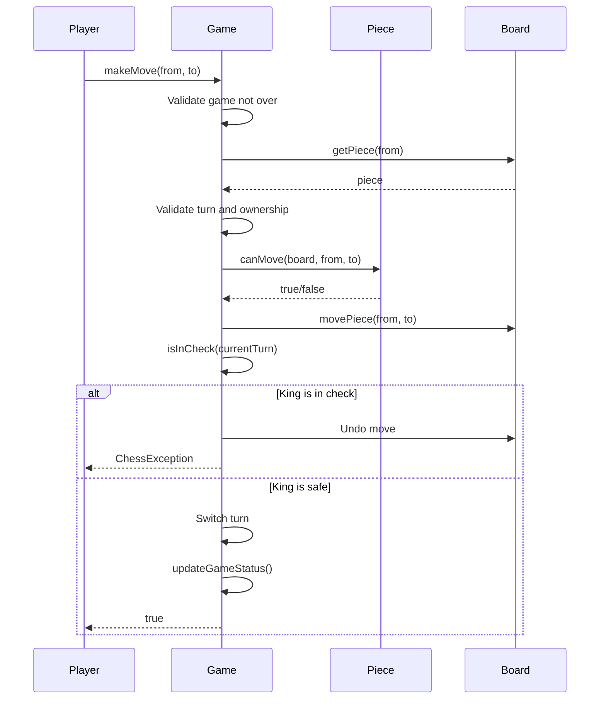

Let's trace through what happens when White plays Queen from d1 to h5 (the fifth move in Scholar's Mate).

#### **Phase 1: Validation**

The player calls `makeMove(new Position(7, 3), new Position(3, 7))`. Game checks that the status isn't terminal, finds the Queen at (7, 3), and confirms it's white's piece and it's white's turn.

#### **Phase 2: Movement Check**

Game calls `queen.canMove(board, from, to)`. The Queen checks if the move is along a valid line (it's diagonal: 4 rows up, 4 columns right, so `abs(rowDiff) == abs(colDiff)`). It then checks path clearance. The diagonal from d1 to h5 passes through e2, f3, and g4. Since e2's pawn already moved to e4 earlier, e2 is empty. If f3 and g4 are also clear, the Queen can move.

#### **Phase 3: Execution and Safety Check**

Game moves the Queen on the board and checks if White's king is in check after the move. It isn't (the Queen move doesn't expose the king). The move is valid.

#### **Phase 4: Status Update**

Game switches the turn to Black and checks Black's status. `isInCheck(BLACK)` scans all white pieces and finds that the Queen at h5 can attack... but not the king directly yet (in this game state). The status remains ACTIVE. Two moves later, after the Queen captures on f7, the check/checkmate detection kicks in and ends the game.

## Demo

Here's the complete runnable demo that plays Scholar's Mate (one of the shortest possible checkmates).

```java
$10a
```

---

# 5. Concurrency and Thread Safety

Does a chess game need thread safety" If you think about two players sitting across from each other, taking turns, the answer is "not really." Chess is inherently sequential. White moves, then black moves, then white. There's no concurrent access to the board.

But in practice, a chess application might serve games over a network. A server hosting thousands of simultaneous games needs each Game instance to handle its own state correctly. And even within a single game, a web server might receive move requests from both players nearly simultaneously (one player submitting their move right as the other player's browser sends a request).

The good news is that chess's turn-based nature simplifies things significantly.

### Game Instance Per Session

The simplest and most natural approach is one Game instance per active game session. Each game has its own board, move history, and current turn. There's no shared state between games, so no cross-game synchronization is needed.

Within a single game, the `makeMove()` method should be synchronized to prevent race conditions. Consider this scenario: both players have a slow network connection. White's move arrives at the server, starts executing `makeMove()`, and is partway through the validation pipeline. Black's move arrives a millisecond later. Without synchronization, Black's move might start executing before White's move finishes, potentially corrupting the board state.

```java
// If building a server-based chess application
public synchronized boolean makeMove(Position from, Position to) {
    // The entire validate-execute-update sequence is atomic
    // ... existing implementation ...
}
```

The `synchronized` keyword ensures that only one thread can execute `makeMove()` at a time on a given Game instance. Since each game has its own instance, this doesn't create a bottleneck across games.

For a standard LLD interview, thread safety isn't the focus of a chess game problem. Mention it briefly if the interviewer asks: "Each Game instance is independent. If this were a server application, I'd synchronize `makeMove()` to prevent concurrent move execution within a single game. But since chess is turn-based, the concurrency risk is low."

---

# 6. Extensions

One of the strengths of this design is how easily it accommodates new features without modifying existing code. Let's walk through several common extensions an interviewer might ask about.

## 6.1 Undo/Redo Moves

**Scenario:** "Can we add the ability to undo and redo moves""

Our Move class already stores all the information needed for undo: the source, destination, piece, captured piece, and promotion info. The extension is straightforward using a Command-like pattern with two stacks.

```java
// Add to Game class
private final Stack<Move> undoStack = new Stack<>();

public void undoLastMove() {
    if (moveHistory.isEmpty()) {
        throw new ChessException("No moves to undo");
    }
    Move lastMove = moveHistory.remove(moveHistory.size() - 1);

    // Reverse the move
    board.setPiece(lastMove.getSource(), lastMove.getPiece());
    board.setPiece(lastMove.getDestination(), lastMove.getCapturedPiece());
    lastMove.getPiece().setHasMoved(false); // simplified; real impl tracks previous state

    // Handle un-promotion
    if (lastMove.isPromotion()) {
        board.setPiece(lastMove.getSource(), lastMove.getPiece());
    }

    undoStack.push(lastMove);
    currentTurn = currentTurn.opposite();
    updateGameStatus();
}

public void redo() {
    if (undoStack.isEmpty()) {
        throw new ChessException("No moves to redo");
    }
    Move move = undoStack.pop();
    makeMove(move.getSource(), move.getDestination());
}
```

The move history serves double duty: it's the game record AND the undo stack. When we undo, we move the entry to a separate redo stack. When we redo, we replay the move.

**What stays unchanged:** All piece classes, Board, Position, Player, and the enums. Undo is purely additive logic in Game.

## 6.2 Move Timer/Clock

**Scenario:** "Add time controls so each player has a fixed amount of time for the entire game."

```java
class ChessClock {
    private long whiteTimeMillis;
    private long blackTimeMillis;
    private long lastMoveTimestamp;
    private Color activeColor;

    public ChessClock(long timePerPlayerMillis) {
        this.whiteTimeMillis = timePerPlayerMillis;
        this.blackTimeMillis = timePerPlayerMillis;
    }

    public void startTurn(Color color) {
        this.activeColor = color;
        this.lastMoveTimestamp = System.currentTimeMillis();
    }

    public void endTurn() {
        long elapsed = System.currentTimeMillis() - lastMoveTimestamp;
        if (activeColor == Color.WHITE) {
            whiteTimeMillis -= elapsed;
        } else {
            blackTimeMillis -= elapsed;
        }
    }

    public boolean isTimeUp(Color color) {
        return (color == Color.WHITE " whiteTimeMillis : blackTimeMillis) <= 0;
    }

    public long getRemainingTime(Color color) {
        return color == Color.WHITE " whiteTimeMillis : blackTimeMillis;
    }
}
```

The Game class would call `clock.startTurn()` at the beginning of each turn and `clock.endTurn()` when a move is made. Before processing a move, it checks `clock.isTimeUp()` and ends the game if time has expired.

**What stays unchanged:** All piece classes, Board, Position, Move, and the core movement logic.

## 6.3 Move Notation

**Scenario:** "Display moves in standard algebraic notation like e4, Nf3, O-O."

Algebraic notation is a formatting concern that can be layered on top of the existing Move class without modifying it.

```java
$138
```

This is a pure utility class that formats existing data. No changes to any existing class.

## 6.4 Draw Conditions

**Scenario:** "Chess has several draw conditions beyond stalemate. How would you handle those""

Three common draw conditions can be added:

**Fifty-move rule:** If 50 consecutive moves pass without a pawn move or capture, either player can claim a draw.

```java
// Add to Game class
public boolean canClaimFiftyMoveRule() {
    if (moveHistory.size() < 100) return false; // 50 moves = 100 half-moves
    for (int i = moveHistory.size() - 100; i < moveHistory.size(); i++) {
        Move m = moveHistory.get(i);
        if (m.getPiece().getPieceType() == PieceType.PAWN
                || m.getCapturedPiece() != null) {
            return false;
        }
    }
    return true;
}
```

**Threefold repetition:** If the same board position occurs three times, either player can claim a draw. This requires hashing board positions and counting occurrences.

**Insufficient material:** If neither side has enough pieces to checkmate (e.g., King vs King, or King+Bishop vs King), the game is a draw.

```java
$13d
```

**What stays unchanged:** All piece classes, Board, Position, Move. Draw conditions are additional checks in the Game class.
