> 💡 **Key Insight:**

> **QUESTION**
>
> #### What is an Autocomplete System"
>
> Search Autocomplete is a widely-used feature in modern applications like Google, Amazon, and YouTube. It enhances user experience by providing real-time suggestions based on partial input, helping users complete queries faster and discover popular or relevant search terms.
>
> 
> <!-- Simulation: autocomplete -->
> 

>
> As the user types a query character by character, the system should return the top N suggestions that match the current prefix. For example, typing "app" might yield results like "apple", "app store", or "application".
>
> These suggestions are typically ranked by relevance, popularity, frequency, or recency.

In this chapter, we will explore the **low-level design of a Search Autocomplete system** in detail.

Let’s start by clarifying the requirements:

---

# 1. Clarifying Requirements

Before diving into the design, it’s important to clarify how the autocomplete system is expected to behave. Asking targeted questions helps refine assumptions, define the scope, and align on core expectations for the system.

> 💡 **Key Insight:**

> **DISCUSSION**
>
> **Candidate**: Should the autocomplete system be case-sensitive"
>
> **Interviewer**: No, all inputs should be treated as lowercase. The system should be case-insensitive.
>
> **Candidate**: Should the system only support English, or do we need to account for Unicode/multilingual input"
>
> **Interviewer**: Let’s assume only English characters for now.
>
> **Candidate**: How should suggestions be ranked—alphabetically, by frequency of use, or both"
>
> **Interviewer**: Good question. The system should support both strategies. The user of the system should be able to configure the ranking strategy.
>
> **Candidate**: How many suggestions should be returned per prefix"
>
> **Interviewer**: That should be configurable, perhaps a default of 10, but the system should allow specifying a custom limit.
>
> **Candidate**: How does the system learn word frequencies" Are we tracking every time a word is added or searched"
>
> **Interviewer**: Let’s increment the frequency every time a word is inserted into the system..
>
> **Candidate**: Can users input new words over time, or is the dictionary fixed at initialization"
>
> **Interviewer**: Words can be added dynamically during runtime.
>
> **Candidate**: Should we support deleting a word or updating its frequency"
>
> **Interviewer**: No, we can skip delete and update functionality for now.

After gathering the details, we can summarize the key system requirements.

### 1.1 Functional Requirements

- Support inserting words into an internal dictionary.
- Return suggestions when a user types a prefix.
- Suggestions should be ranked based on a configurable strategy (alphabetical or frequency-based).
- The number of suggestions returned should be configurable.
- Frequency count is incremented each time a word is added.
- Words and prefixes are treated case-insensitively.

### 1.2 Non-Functional Requirements

- The system should be optimized for fast prefix lookups
- The design should follow object-oriented principles with clear separation of concerns
- The system should be modular and extensible to support new ranking strategies
- The components should be testable in isolation
- The system can assume in-memory storage (no persistence required)

Now that we understand what we're building, let's identify the building blocks of our system.

---

# 2. Identifying Core Entities

> [!PAYWALL] This content is for premium members only.

How do you go from a list of requirements to actual classes" The key is to look for **nouns** in the requirements that have distinct attributes or behaviors. Not every noun becomes a class, but this approach gives you a starting point.

Let's walk through our requirements and extract the relevant entities.

### 2.1 The Trie Data Structure

> "The system supports inserting words into an internal dictionary" and "It returns suggestions when a user types a prefix"

We need an efficient data structure for prefix-based searches. A standard hashmap would require checking every word against the prefix, which is O(n) where n is the dictionary size. For real-time autocomplete with millions of words, that's too slow.

A [**Trie**](https://algomaster.io/learn/dsa/tries-introduction) (prefix tree) is purpose-built for this problem. Each node represents a character, and paths from root to nodes represent prefixes. Finding all words with a given prefix is O(m + k) where m is the prefix length and k is the number of matching words.

This gives us two entities:

- `TrieNode`: The building block representing a single character with links to children
- `Trie`: The data structure that manages TrieNodes for insertions and prefix searches

To understand how words are stored, let's visualize the Trie after inserting "car" (3x), "cat" (1x), "cart" (1x), "canada" (4x):

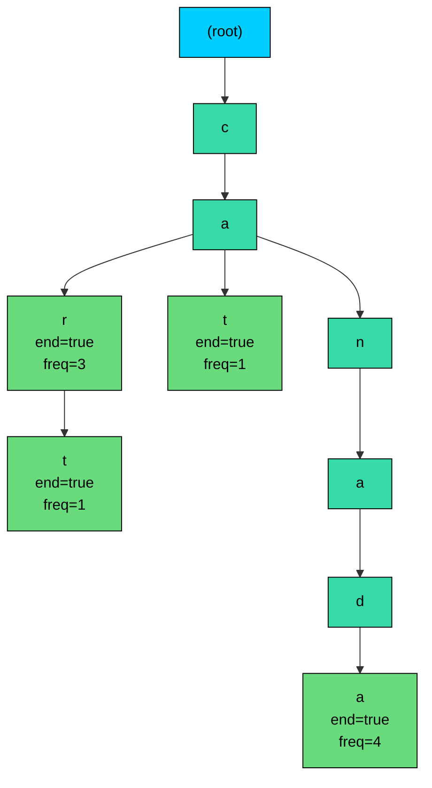

#### **How the Trie Works:**

1. **Shared prefixes:** "car", "cat", "cart", and "canada" all share the "ca" prefix. Instead of storing each word separately, they share the c→a path.
2. **End-of-word markers:** Green nodes have `end=true`, indicating a complete word ends there. The frequency shows how many times that word was inserted.
3. **Prefix search:** To find words starting with "ca":
   - Traverse root → c → a
   - From the 'a' node, DFS collects all descendants with `end=true`
   - Returns: car (freq=3), cat (freq=1), cart (freq=1), canada (freq=4)
4. **Frequency-based ranking:** After collection, sorting by frequency gives: canada, car, cart, cat

This structure gives O(m) lookup time where m is the prefix length, regardless of dictionary size.

### 2.2 Suggestions and Ranking

> "Suggestions are ranked based on a configurable strategy"

When we find words matching a prefix, we need to package them with their ranking metadata (like frequency) for sorting. This gives us:

- `Suggestion`: A data object pairing a word with its ranking weight

For ranking flexibility, we apply the Strategy pattern:

- `RankingStrategy`: An interface defining how suggestions are ranked
- **FrequencyBasedRanking**: Ranks by how often words were added
- **AlphabeticalRanking**: Ranks alphabetically

### 2.3 The Facade

> "The number of suggestions returned is configurable"

We need a simple public interface that hides the Trie, ranking logic, and configuration complexity:

- `AutocompleteSystem`: The main entry point for adding words and getting suggestions
- `AutocompleteSystemBuilder`: Creates configured AutocompleteSystem instances

### 2.4 Entity Overview

Here's how these entities relate to each other:

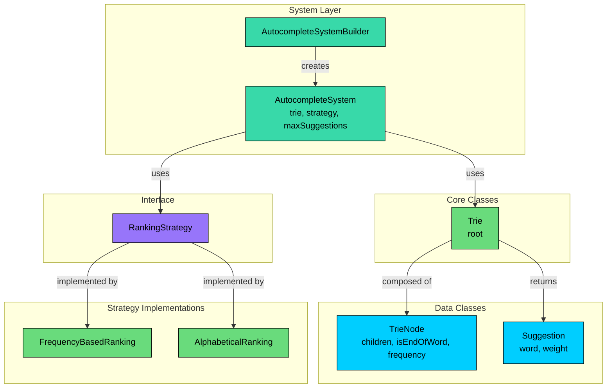

We've identified three types of entities:

**Data Classes** hold data with minimal behavior. TrieNode stores character links and word metadata. Suggestion pairs a word with its ranking weight.

**Core Classes** contain the main logic. Trie manages prefix tree operations. Strategy implementations define ranking algorithms.

**System Classes** provide the public API. AutocompleteSystem orchestrates everything. AutocompleteSystemBuilder handles configuration.

| Entity | Type | Responsibility |
|--------|------|----------------|
| `TrieNode` | Data Class | Stores character, children map, end-of-word flag, frequency |

| `Suggestion` | Data Class | Pairs a word with its ranking weight |
| `RankingStrategy` | Interface | Defines contract for ranking suggestions |
| `AutocompleteSystem` | System Class | Facade for adding words and getting suggestions |
| `AutocompleteSystemBuilder` | System Class | Fluent builder for system configuration |

With our entities identified, let's define their attributes, behaviors, and relationships.

---

# 3. Designing Classes and Relationships

Now that we know what entities we need, let's flesh out their details. For each class, we'll define what data it holds (attributes) and what it can do (methods). Then we'll look at how these classes connect to each other.

## 3.1 Class Definitions

We'll work bottom-up: data classes first, then the interface and strategies, then core logic classes. This order makes sense because complex classes depend on simpler ones.

### Data Classes

Data classes are simple containers that hold data with minimal behavior. They represent the building blocks that other classes use.

#### `TrieNode`

Represents a single node in the Trie data structure. It's the fundamental unit for storing character-level information and word metadata.

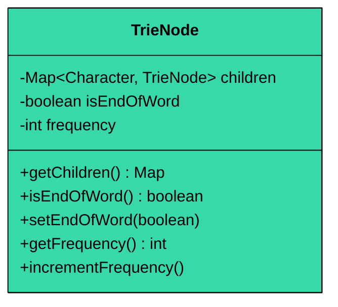

| Attribute | Type | Description | Mutable" |
|-----------|------|-------------|----------|
| `children` | Map\<Character, TrieNode\> | Maps characters to child nodes | Yes (map contents) |
| `isEndOfWord` | boolean | True if this node marks a complete word | Yes |
| `frequency` | int | How many times this word was inserted | Yes |

| Method | Description |
|--------|-------------|
| `TrieNode()` | Constructor, initializes empty children map |
| `getChildren()` | Returns the children map |
| `isEndOfWord()` | Returns the end-of-word flag |
| `setEndOfWord(boolean)` | Sets the end-of-word flag |
| `getFrequency()` | Returns the insertion count |
| `incrementFrequency()` | Increments the frequency counter |

> 💡 **Key Insight:**

> **Design Decision**
>
> We store frequency directly in TrieNode rather than in a separate map. This keeps word metadata collocated with the word itself, making lookups faster and the code simpler. Frequency is only meaningful when `isEndOfWord` is true.

#### `Suggestion`

A simple data transfer object (DTO) that encapsulates a word and its associated ranking weight, making it easy to pass around between the Trie collection logic and the ranking strategy.

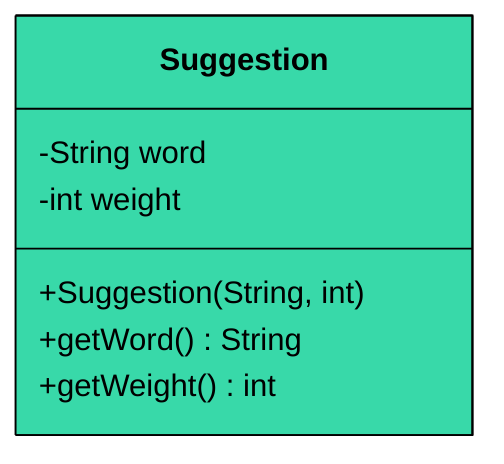

| Attribute | Type | Description | Mutable" |
|-----------|------|-------------|----------|
| `word` | String | The suggested word | No |
| `weight` | int | Ranking weight (e.g., frequency) | No |

| Method | Description |
|--------|-------------|
| `Suggestion(word, weight)` | Constructor |
| `getWord()` | Returns the word |
| `getWeight()` | Returns the weight |

The Suggestion class is **immutable**. This simplifies reasoning about the code and makes it thread-safe by default.

### Interface

Interfaces define contracts that implementations must follow, enabling polymorphism and the Strategy pattern.

#### `RankingStrategy`

Defines the contract for ranking suggestions.

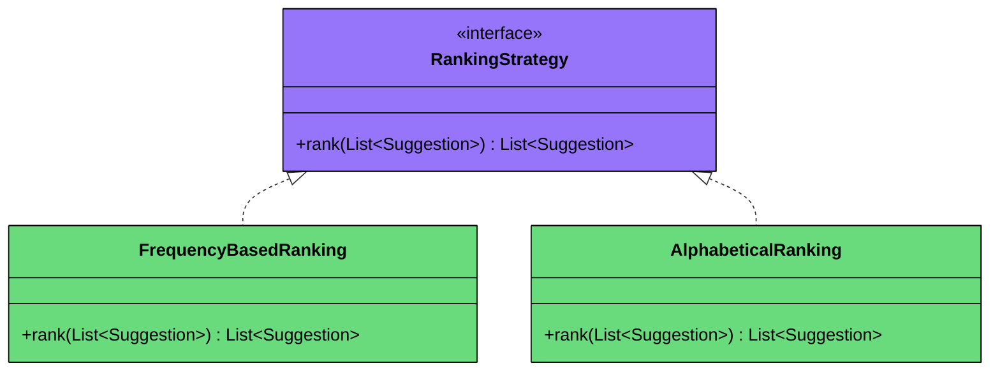

| Method | Description |
|--------|-------------|
| `rank(List<Suggestion>)` | Takes a list of suggestions and returns them sorted |

The interface is minimal and focused. It takes raw suggestions and returns ranked suggestions. How the ranking works is up to each implementation. This is the Strategy pattern in action.

`FrequencyBasedRanking` sorts by weight (frequency) in descending order. Most frequently inserted words appear first.

`AlphabeticalRanking` sorts by word in ascending alphabetical order (A-Z).

Both implement `RankingStrategy` and can be swapped at runtime without changing the system. Adding a new ranking algorithm (like recency-based) just means creating a new class.

### Core Classes

Core classes contain the actual business logic. They coordinate between data classes and implement the system's behavior.

#### `Trie`

Manages the prefix tree data structure.

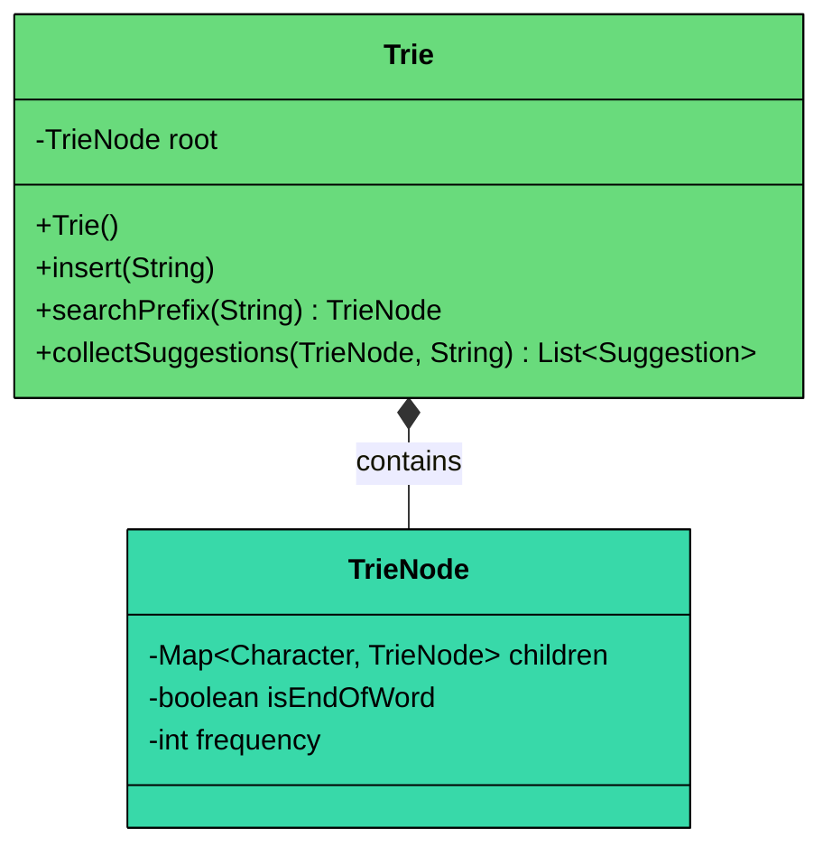

| Attribute | Type | Description |
|-----------|------|-------------|
| `root` | TrieNode | Root node of the tree (composition) |

| Method | Description |
|--------|-------------|
| `Trie()` | Constructor, creates root node |
| `insert(String word)` | Adds word to trie, increments frequency if exists |
| `searchPrefix(String prefix)` | Returns node at end of prefix, or null if not found |
| `collectSuggestions(TrieNode, String)` | Gathers all words from a node via DFS |
| `collect(TrieNode, String, List)` | Private helper for recursive DFS traversal |

**Key Design Principles:**

1. **Single Responsibility:** The Trie only manages tree operations. It doesn't know about ranking or the public API.
2. **Composition:** Trie *owns* its TrieNodes. When the Trie is created, it creates the root. As words are inserted, more nodes are created. All nodes belong to this Trie.

The Trie class is focused on tree operations. It doesn't know about ranking. This separation lets us change ranking without touching Trie logic.

### AutoCompleteSystem

The facade that ties everything together.

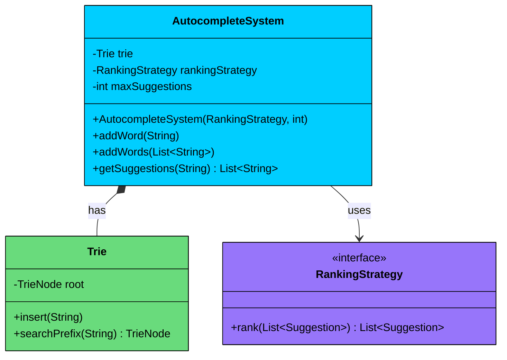

| Attribute | Type | Description |
|-----------|------|-------------|
| `trie` | Trie | The prefix tree (composition) |
| `rankingStrategy` | RankingStrategy | How to rank suggestions (association) |
| `maxSuggestions` | int | Maximum suggestions to return |

| Method | Description |
|--------|-------------|
| `AutocompleteSystem(strategy, max)` | Constructor |
| `addWord(String word)` | Adds a word (lowercased) to the trie |
| `addWords(List<String> words)` | Bulk add words |
| `getSuggestions(String prefix)` | Returns ranked suggestions for prefix |

**Key Design Principles:**

1. **Facade Pattern:** External code only needs to know `addWord()` and `getSuggestions()`. The Trie, ranking logic, and case normalization are hidden.
2. **Composition vs Association:** The system *owns* its Trie (composition) but *uses* a RankingStrategy (association). The strategy could be shared across systems.

> 💡 **Key Insight:**

> **Design Decision**
>
> The AutocompleteSystem doesn't expose the Trie directly. External code calls `addWord()` and `getSuggestions()`. This encapsulation means we could swap the Trie for a different data structure without changing the public API.

#### `AutocompleteSystemBuilder`

Provides fluent construction with sensible defaults.

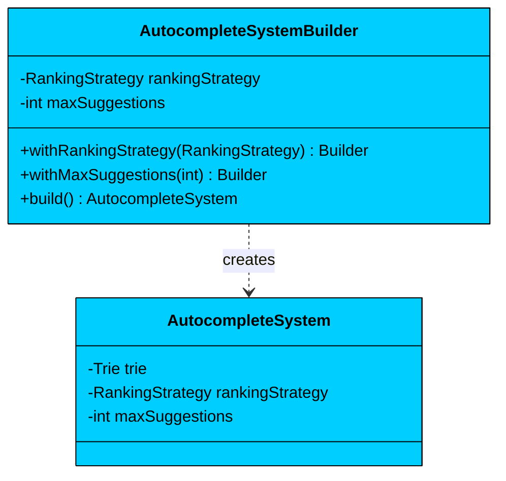

| Attribute | Type | Default | Description |
|-----------|------|---------|-------------|
| `rankingStrategy` | RankingStrategy | FrequencyBasedRanking | How to rank suggestions |
| `maxSuggestions` | int | 10 | Maximum suggestions to return |

| Method | Description |
|--------|-------------|
| `withRankingStrategy(strategy)` | Sets the ranking strategy, returns this |
| `withMaxSuggestions(max)` | Sets the suggestion limit, returns this |
| `build()` | Creates the configured AutocompleteSystem |

The builder provides sensible defaults so callers can create a working system with minimal configuration. The fluent API makes configuration self-documenting.

## 3.2 Class Relationships

Let's examine how these classes connect.

#### Composition ("has-a" with lifecycle dependency)

**Trie is composed of TrieNodes:** When the Trie is created, it creates its root TrieNode. As words are inserted, the Trie creates more TrieNodes. When the Trie is garbage collected, all its nodes go with it.

**AutocompleteSystem owns a Trie:** The system creates and manages its Trie. The Trie doesn't exist independently.

#### Association ("uses-a" with independent lifecycle)

**AutocompleteSystem uses RankingStrategy:** The system receives a strategy but doesn't own it. The same strategy instance could be shared across multiple systems.

**AutocompleteSystem uses Suggestion:** Suggestions are created and returned but not owned by the system.

#### Implementation

**FrequencyBasedRanking and AlphabeticalRanking implement RankingStrategy:** Both classes fulfill the same contract and can be used interchangeably.

## 3.3 Key Design Patterns

You might notice patterns emerging in our design. Let's make them explicit and justify each one.

### [Strategy Pattern](/learn/lld/strategy) (Ranking)

**The Problem:** Users need different ranking algorithms. Some want most-frequent words first. Others want alphabetical order. Tomorrow someone might want recency-based ranking. If we hardcode ranking logic, adding new algorithms requires modifying existing code.

**The Solution:** The Strategy pattern encapsulates each ranking algorithm in its own class. The AutocompleteSystem holds a RankingStrategy reference and delegates ranking to it.

**Why This Pattern:** We could use if-else or switch statements on an enum. But the Strategy pattern gives us:

- **Testability:** Each strategy can be unit tested in isolation
- **Extensibility:** Adding new rankings means adding new classes, not modifying existing code
- **Runtime flexibility:** The strategy can be changed at runtime

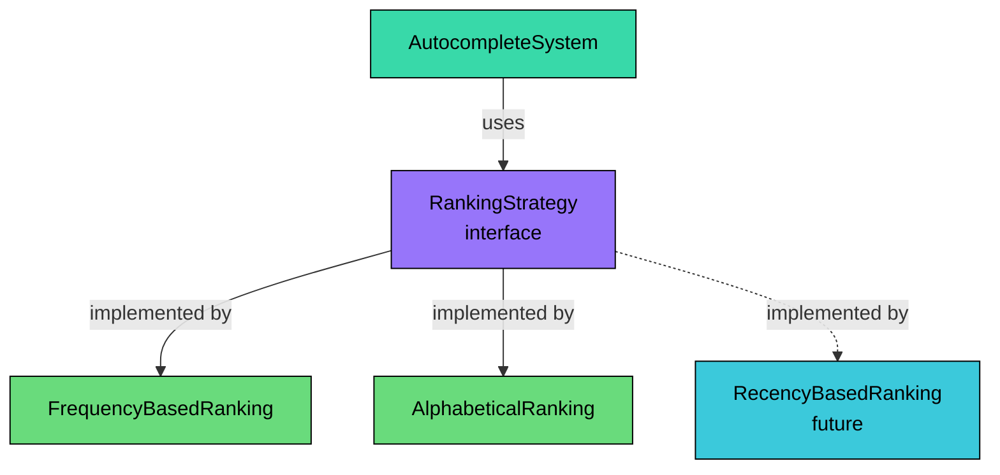

> 💡 **Key Insight:**

> **Design Decision**
>
> The `rank()` method returns a new sorted list rather than modifying the input. This immutability prevents subtle bugs where multiple callers share the same suggestion list.

### [Builder Pattern](/learn/lld/builder) (System Construction)

**The Problem:** AutocompleteSystem has multiple configuration options (ranking strategy, max suggestions). As options grow, constructor parameters become unwieldy. Callers need to remember parameter order and might not know sensible defaults.

**The Solution:** The Builder pattern provides a fluent API for step-by-step construction with named methods and defaults.

**Why This Pattern:** We could use a constructor with default parameters or a configuration object. The Builder pattern gives us:

- **Readability:** `withRankingStrategy(...)` is clearer than positional parameters
- **Defaults:** Callers only specify what they want to customize
- **Validation:** The builder can validate before creating the object

```java
// Without builder - unclear what parameters mean
new AutocompleteSystem(new FrequencyBasedRanking(), 10);

// With builder - self-documenting
new AutocompleteSystemBuilder()
    .withRankingStrategy(new FrequencyBasedRanking())
    .withMaxSuggestions(10)
    .build();
```

### [Facade Pattern](/learn/lld/facade)

**The Problem:** The autocomplete system involves multiple components: Trie, TrieNode, Suggestion, RankingStrategy. Exposing all these to clients creates a complex, coupled API.

**The Solution:** AutocompleteSystem acts as a Facade, providing simple `addWord()` and `getSuggestions()` methods that hide internal complexity.

**Why This Pattern:** Clients don't need to know about Tries or ranking strategies to use autocomplete. The Facade provides:

- **Simplicity:** Two methods cover all common use cases
- **Decoupling:** Internal implementation can change without affecting clients
- **Encapsulation:** Details like case normalization are handled internally

## 3.4 Full Class Diagram

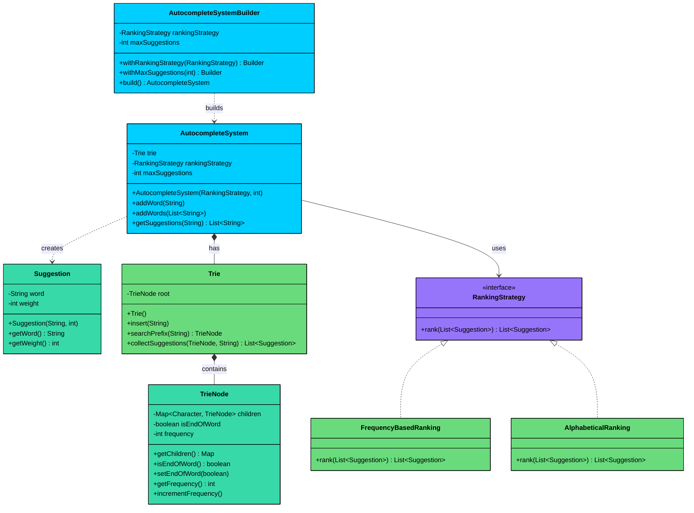

---

# 4. Code Implementation

Now let's translate our design into working code. We'll build bottom-up: data classes first, then interfaces, then implementations, then the facade layer. This order matters because each layer depends on the ones below it.

#### Java

## 4.1 Data Classes

We start with the simple data containers that other classes depend on.

### TrieNode

```java
class TrieNode {
    private final Map<Character, TrieNode> children = new HashMap<>();
    private boolean isEndOfWord;
    private int frequency;

    Map<Character, TrieNode> getChildren() {
        return children;
    }

    boolean isEndOfWord() {
        return isEndOfWord;
    }

    void setEndOfWord(boolean endOfWord) {
        isEndOfWord = endOfWord;
    }

    int getFrequency() {
        return frequency;
    }

    void incrementFrequency() {
        this.frequency++;
    }
}
```

The TrieNode uses a HashMap for children because we need O(1) character lookups. The `frequency` field tracks how often the word ending at this node was inserted. This is only meaningful when `isEndOfWord` is true.

### Suggestion

```java
class Suggestion {
    private final String word;
    private final int weight;

    public Suggestion(String word, int weight) {
        this.word = word;
        this.weight = weight;
    }

    public String getWord() {
        return word;
    }

    public int getWeight() {
        return weight;
    }
}
```

Both fields are `final`. Immutability prevents bugs where code accidentally modifies a suggestion that's being shared.

## 4.2 Interface

The interface comes before implementations so we define the contract first.

```java
interface RankingStrategy {
    List<Suggestion> rank(List<Suggestion> suggestions);
}
```

Simple and focused. The interface doesn't care about Tries or prefixes. It just sorts suggestions.

## 4.3 Strategy Implementations

### AlphabeticalRanking

```java
class AlphabeticalRanking implements RankingStrategy {
    @Override
    public List<Suggestion> rank(List<Suggestion> suggestions) {
        return suggestions.stream()
            .sorted(Comparator.comparing(Suggestion::getWord))
            .collect(Collectors.toList());
    }
}
```

Uses Java streams for clean, functional sorting. Returns a new list rather than modifying the input.

### FrequencyBasedRanking

```java
class FrequencyBasedRanking implements RankingStrategy {
    @Override
    public List<Suggestion> rank(List<Suggestion> suggestions) {
        return suggestions.stream()
            .sorted(Comparator.comparingInt(Suggestion::getWeight).reversed())
            .collect(Collectors.toList());
    }
}
```

Sorts by weight descending (highest frequency first). The `.reversed()` call flips the natural ascending order.

## 4.4 Trie

The core data structure for efficient prefix lookups.

```java
$d7
```

Let's break down the key methods:

`insert()`: Traverses character by character, creating nodes as needed with `computeIfAbsent()`. At the end, marks the node as a complete word and increments frequency.

`searchPrefix()`: Follows the prefix path. Returns null if any character doesn't exist (prefix not found). Otherwise returns the node where the prefix ends.

`collectSuggestions()`: Performs depth-first search from a starting node, gathering all complete words. This is how we find all words matching a prefix.

The DFS in `collect()` is recursive. For each node, if it's an end-of-word, we create a Suggestion. Then we recursively visit all children, building up the word string as we go.

## 4.5 AutocompleteSystem (Facade)

The facade provides the simple public API.

```java
$d8
```

The `getSuggestions()` method orchestrates the full flow:

1. Normalize the prefix to lowercase
2. Find the prefix node in the Trie
3. If not found, return empty (no matches)
4. Collect all words from that node
5. Rank them using the configured strategy
6. Limit to maxSuggestions
7. Extract just the word strings

Notice how the method delegates to Trie and RankingStrategy. It coordinates but doesn't implement the details.

## 4.6 AutocompleteSystemBuilder

The builder provides fluent construction with defaults.

```java
class AutocompleteSystemBuilder {
    private RankingStrategy rankingStrategy = new FrequencyBasedRanking();
    private int maxSuggestions = 10;

    public AutocompleteSystemBuilder withRankingStrategy(RankingStrategy strategy) {
        this.rankingStrategy = strategy;
        return this;
    }

    public AutocompleteSystemBuilder withMaxSuggestions(int max) {
        this.maxSuggestions = max;
        return this;
    }

    public AutocompleteSystem build() {
        return new AutocompleteSystem(rankingStrategy, maxSuggestions);
    }
}
```

Each `withX()` method returns `this`, enabling method chaining. Defaults are set at field declaration, so callers only specify what they want to customize.

## 4.7 Demo

Let's see everything working together.

```java
$d9
```

### Sequence Diagram: getSuggestions Flow

The following diagram shows what happens when a user requests suggestions:

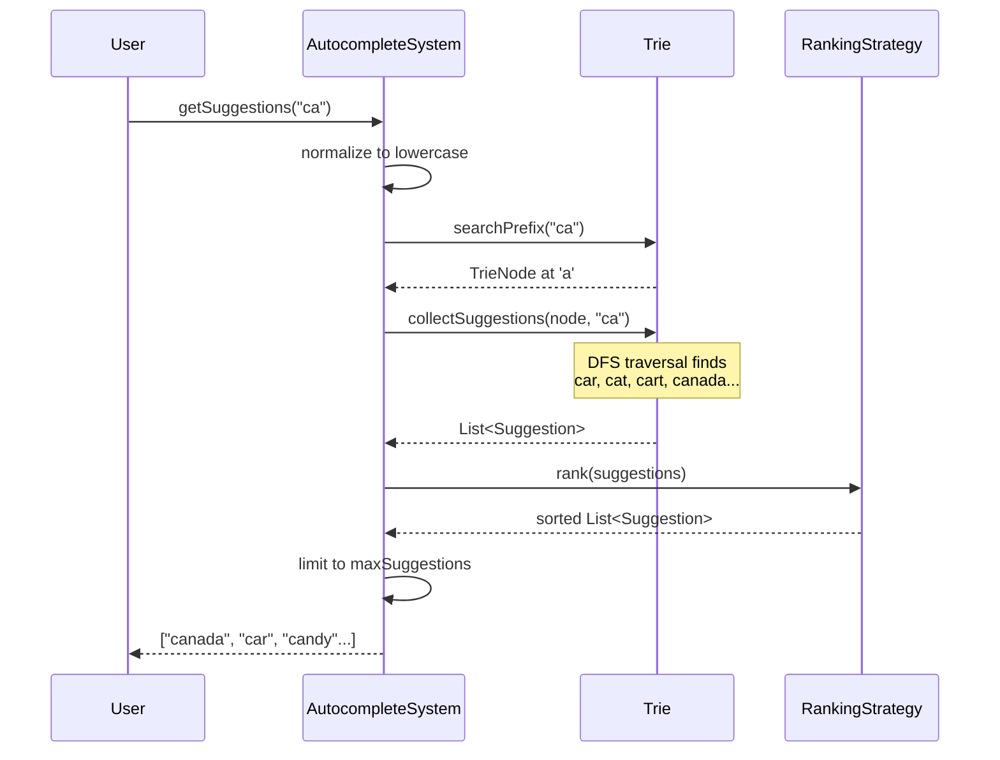

---

# 5. Run and Test

---

# 6. Quiz
