> 💡 **Key Insight:**

> **QUESTION**
>
> #### What is an ATM"
>
> An **ATM (Automated Teller Machine)** is a self-service banking machine that allows users to perform basic financial transactions such as withdrawing cash and checking account balances using a debit or credit card and a secure PIN, without needing to visit a bank branch.
>
> 
> <!-- Simulation: atm -->
> 

>
> They interface with backend banking systems to verify account details, authenticate users, and update balances in real-time.

In this chapter, we will explore the **low-level design of ATM** in detail.

Lets start by clarifying the requirements:

---

# 1. Clarifying Requirements

Before starting the design, it's important to ask thoughtful questions to uncover hidden assumptions, clarify ambiguities, and define the system's scope more precisely.

Here is an example of how a discussion between the candidate and the interviewer might unfold:

> 💡 **Key Insight:**

> **DISCUSSION**
>
> **Candidate:** "What types of transactions should the ATM support""
>
> **Interviewer:** "The ATM should support three transaction types: cash withdrawal, cash deposit, and balance inquiry."
>
> **Candidate:** "How does the ATM authenticate users" Is it card-based with a PIN"
>
> **Interviewer:** "Yes, standard card and PIN authentication. The user inserts a card, enters a PIN, and the system verifies it against a bank service. For this design, you can simulate the call to bank service"
>
> **Candidate:** "What denominations should the ATM support for dispensing cash""
>
> **Interviewer:** "Let's support four denominations: $100, $50, $20, and $10 bills. The ATM should dispense using the largest bills first."
>
> **Candidate:** "How should the ATM handle edge cases like insufficient funds in the user's account, or the ATM running out of cash""
>
> **Interviewer:** "Both should be handled gracefully with appropriate error messages. The ATM should check both the account balance and its own cash inventory before dispensing."
>
> **Candidate:** "Do we need to take input from the user, or can we hardcode a sequence of operations""
>
> **Interviewer:** "You can hardcode a sequence of operations for the demo. No need for user input handling."
>
> **Candidate:** "Should we enforce daily transaction or withdrawal limits per user""
>
> **Interviewer:** "Let’s skip that for now. Assume there are no limits on the number or amount of transactions per day."

After gathering the details, we can summarize the key system requirements.

## 1.1 Functional Requirements

- Authenticate users via card number and PIN
- Support three transaction types: withdrawal, deposit, and balance inquiry
- Dispense cash using the largest denominations first ($100, $50, $20, $10)
- Validate both account balance and ATM cash inventory before dispensing
- Track ATM state transitions (idle, card inserted, authenticated)
- Simulate bank operations (authentication, balance check, debit, credit) via an in-memory service

## 1.2 Non-Functional Requirements

- The design should follow object-oriented principles with clear separation of concerns
- The system should be modular and extensible to support new transaction types and denominations
- The code should be thread-safe for concurrent access
- The components should be testable in isolation
- Financial operations should follow validation-before-commit: always verify dispensability before debiting

After the requirements are clear, lets identify the core entities/objects we will have in our system.

---

# 2. Identifying Core Entities

> [!PAYWALL] This content is for premium members only.

How do you go from a list of requirements to actual classes" The key is to look for **nouns** in the requirements that have distinct attributes or behaviors. Not every noun becomes a class, but this approach gives you a starting point.

Let's walk through our requirements and identify what needs to exist in our system.

### 2.1 Transaction Types

> "Support three transaction types: withdrawal, deposit, and balance inquiry"

We need a way to represent what kind of transaction the user wants to perform. This is a fixed set of options, which makes it a natural fit for an enum. `TransactionType` with values `WITHDRAWAL`, `DEPOSIT`, and `BALANCE_INQUIRY` captures this.

Why an enum" Because `TransactionType.WITHDRAWAL` is type-safe and self-documenting. You can't accidentally create a transaction of type "WITHDRAWL" (notice the typo). The compiler catches that.

### 2.2 ATM States

> "Track ATM state transitions (idle, card inserted, authenticated)"

An ATM behaves differently depending on what's happened so far. You can't withdraw cash before inserting a card. You can't insert a card if one is already inserted. This lifecycle gives us the `ATMState` enum: `IDLE`, `CARD_INSERTED`, `AUTHENTICATED`.

The key insight is that certain operations are only valid in certain states. Withdrawing money requires `AUTHENTICATED` state. Inserting a card requires `IDLE` state. This is exactly the kind of problem the State pattern solves, but we'll get to that in Section 3.4.

### 2.3 Denominations

> "Dispense cash using the largest denominations first ($100, $50, $20, $10)"

The ATM needs to know what bills it has. Each denomination has a face value and the ATM tracks how many of each it holds. `Denomination` is an enum with values `HUNDRED(100)`, `FIFTY(50)`, `TWENTY(20)`, `TEN(10)`.

Why not just use integers" Because denominations are a closed set. You can't have a $37 bill. An enum prevents invalid denominations from entering the system.

### 2.4 Cards and Accounts

> "Authenticate users via card number and PIN"

When a user inserts a card, we need to capture the card's data: card number, PIN, and which bank account it's linked to. This gives us the `Card` data class. It's immutable since card data doesn't change during a session.

> "Validate account balance before dispensing"

Behind every card is a bank account with a balance. `Account` tracks the account number and current balance. Unlike Card, Account is mutable because the balance changes with deposits and withdrawals.

### 2.5 Transactions

> "Support withdrawal, deposit, and balance inquiry"

Each operation should be recorded. A `Transaction` captures what happened: the type, amount, account number, and timestamp. Transactions are immutable records, once created, they never change. This is important for audit trails.

### 2.6 Cash Dispensing

> "Dispense cash using the largest denominations first"

Something needs to manage the ATM's physical cash inventory: how many $100 bills are loaded, how many $50s, and so on. The `CashDispenser` handles this. It also needs to figure out the right combination of bills for a given amount.

The dispensing logic itself is interesting. We need to try the largest denomination first, use as many as possible, then fall through to the next smaller denomination. This is the Chain of Responsibility pattern, and we'll model each denomination as a `DenominationHandler` in the chain.

### 2.7 Bank Service

> "Simulate bank operations via an in-memory service"

The ATM doesn't store account data itself. In the real world, it talks to a bank's servers. We simulate this with `BankService`, which manages cards, accounts, authentication, and balance operations. It's the ATM's gateway to all banking data.

### 2.8 The ATM

> "Track ATM state transitions"

Finally, something needs to orchestrate everything: accept cards, delegate authentication, coordinate transactions, manage state transitions. The `ATM` is the facade that ties the entire system together. It's a singleton because there's one physical ATM, and we need consistent state across all operations.

### 2.9 Entity Overview

Here's how these entities relate to each other:

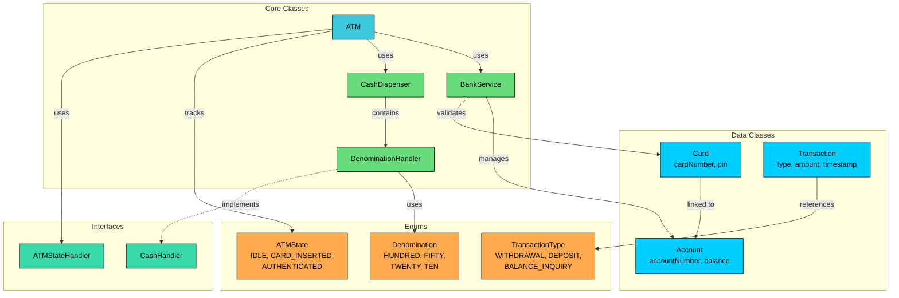

We've identified three types of entities:

**Enums** define fixed sets of values. TransactionType, ATMState, and Denomination provide type safety and prevent invalid values from entering the system.

**Data Classes** primarily hold data with minimal behavior. Card is immutable, Account has a mutable balance, and Transaction is an immutable record.

**Interfaces** define contracts for interchangeable behavior. CashHandler enables the Chain of Responsibility pattern, and ATMStateHandler enables the State pattern.

**Core Classes** contain the main logic. DenominationHandler processes cash dispensing, CashDispenser manages inventory, BankService simulates banking operations, and ATM ties everything together.

| Entity | Type | Responsibility |
|--------|------|----------------|
| `TransactionType` | Enum | Transaction categories: WITHDRAWAL, DEPOSIT, BALANCE_INQUIRY |
| `ATMState` | Enum | ATM lifecycle states: IDLE, CARD_INSERTED, AUTHENTICATED |
| `Denomination` | Enum | Bill values: HUNDRED(100), FIFTY(50), TWENTY(20), TEN(10) |
| `Card` | Data Class | Card data: number, PIN, linked account |
| `Account` | Data Class | Account data: number, mutable balance |
| `Transaction` | Data Class | Transaction record: type, amount, timestamp |
| `CashHandler` | Interface | Contract for chain-of-responsibility cash dispensing |
| `ATMStateHandler` | Interface | Contract for state-specific ATM behavior |
| `DenominationHandler` | Core Class | Handles dispensing for one denomination, delegates remainder |
| `CashDispenser` | Core Class | Manages cash inventory, builds denomination chain |
| `BankService` | Core Class | Simulates bank: authentication, balance, debit, credit |
| `ATM` | Core Class (Singleton) | Orchestrates state machine, coordinates all components |

With our entities identified, let's define their attributes, behaviors, and relationships.

---

# 3. Designing Classes and Relationships

Now that we know what entities we need, let's flesh out their details. For each class, we'll define what data it holds (attributes) and what it can do (methods). Then we'll look at how these classes connect to each other.

## 3.1 Class Definitions

We'll work bottom-up: simple types first, then data containers, then interfaces, then the classes with real logic. This order makes sense because complex classes depend on simpler ones.

### Enums

Enums define fixed sets of values that provide type safety and make code self-documenting. Using enums prevents invalid states at compile time rather than runtime.

#### `TransactionType`

We need a way to distinguish between different operations a user can perform. Rather than using strings like "withdraw" or integers like 1, 2, 3, an enum gives us compile-time safety and readability.

**TransactionType** represents the kinds of transactions the ATM supports.

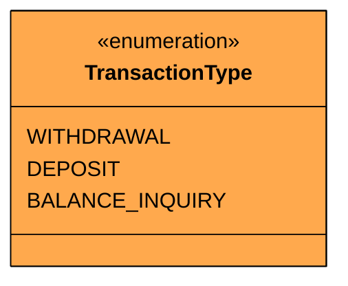

| Value | Purpose |
|-------|---------|
| `WITHDRAWAL` | User takes cash from their account |
| `DEPOSIT` | User adds cash to their account |
| `BALANCE_INQUIRY` | User checks their account balance |

Each value maps to a distinct ATM workflow. Withdrawal involves cash dispensing and account debiting. Deposit involves account crediting. Balance inquiry is read-only with no cash movement.

#### `ATMState`

An ATM behaves differently depending on where the user is in their session. You can't authenticate without a card inserted. You can't withdraw without authenticating first. This lifecycle needs a formal representation.

**ATMState** represents the ATM's current position in its interaction lifecycle.

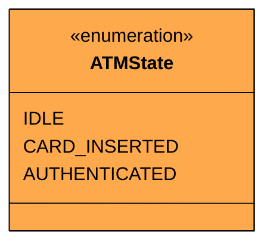

| Value | Meaning | Valid Operations |
|-------|---------|-----------------|
| `IDLE` | No card inserted, waiting for user | Insert card |
| `CARD_INSERTED` | Card present, awaiting PIN | Authenticate, eject card |
| `AUTHENTICATED` | PIN verified, ready for transactions | Withdraw, deposit, check balance, eject card |

The state transitions follow strict rules. Here's the complete state diagram:

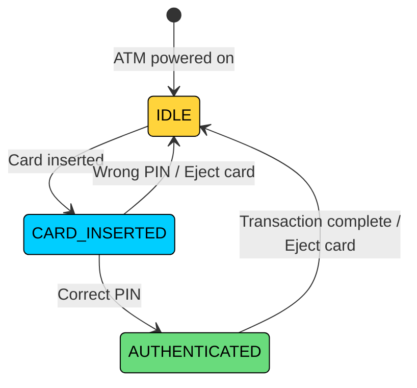

Notice that AUTHENTICATED can only transition back to IDLE, not to CARD_INSERTED. Once a transaction completes or the user ejects the card, the ATM resets fully. There's no "go back to PIN entry" from an authenticated state. This keeps the lifecycle simple and prevents partial-state bugs.

Also notice that IDLE cannot jump directly to AUTHENTICATED. Every authentication must go through CARD_INSERTED first. This enforces the physical constraint that you need a card in the machine before you can type a PIN.

#### `Denomination`

The ATM needs to know what bills it has and how to dispense them. Each denomination has a fixed face value.

**Denomination** represents the bill types the ATM can hold and dispense.

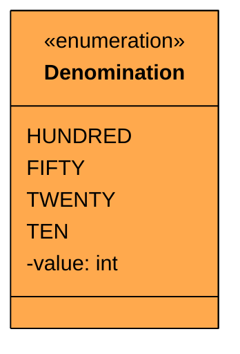

| Value | Face Value | Purpose |
|-------|------------|---------|
| `HUNDRED` | 100 | Largest bill, used first |
| `FIFTY` | 50 | Second priority |
| `TWENTY` | 20 | Third priority |
| `TEN` | 10 | Smallest bill, used last |

Each enum value carries a `value` field (read-only) representing the dollar amount. The ordering matters: the ATM tries to dispense $100 bills first, then $50s, then $20s, then $10s. This minimizes the total number of bills dispensed.

### Custom Exception

Before we write classes that can fail, let's define how they fail. A custom exception makes error handling cleaner than catching generic exceptions.

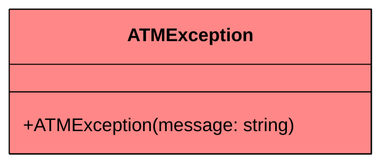

We throw `ATMException` when someone tries to withdraw more than their balance, when the ATM runs out of cash, when an invalid PIN is entered, or when an operation is attempted in the wrong state. One exception class is sufficient here since the error message communicates the specific failure.

### Data Classes

Data classes are simple containers that hold data with minimal behavior. They represent the "nouns" in our system that have attributes but little logic.

#### `Card`

When a user approaches the ATM, the first thing they do is insert a physical card. We need to capture that card's data: who it belongs to, what account it's linked to, and the PIN for verification.

**Card** represents a bank card with authentication credentials.

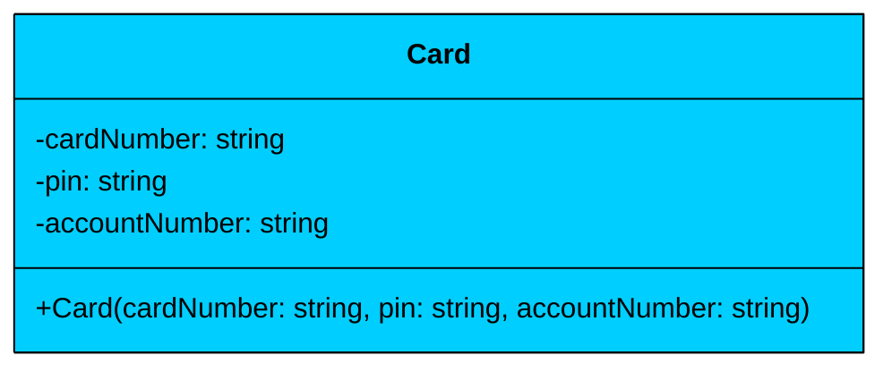

| Attribute | Type | Description | Mutable" |
|-----------|------|-------------|----------|
| `cardNumber` | string | Unique card identifier | No |
| `pin` | string | Authentication PIN | No |
| `accountNumber` | string | Linked bank account number | No |

Card is **immutable**. All three fields are read-only, set once at construction. A card's PIN doesn't change during an ATM session (PIN changes would be a separate system). The `accountNumber` links this card to a specific bank account, which is how the ATM knows whose balance to check.

#### `Account`

Behind every card is a bank account. Unlike a card, an account's balance changes with every transaction. This is one of the few mutable objects in our design.

**Account** represents a bank account with a balance that can be debited and credited.

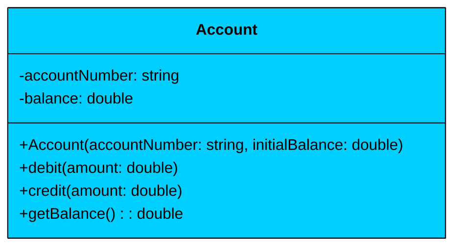

| Attribute | Type | Description | Mutable" |
|-----------|------|-------------|----------|
| `accountNumber` | string | Unique account identifier | No |
| `balance` | double | Current account balance | Yes |

| Method | Description |
|--------|-------------|
| `debit(amount)` | Subtracts amount from balance after validating sufficiency |
| `credit(amount)` | Adds amount to balance |
| `getBalance()` | Returns current balance |

The `debit` method validates that the account has sufficient funds before subtracting. If not, it throws `ATMException`. The `credit` method simply adds to the balance. Both methods need synchronized access since multiple ATMs could theoretically operate on the same account.

#### `Transaction`

Every operation the user performs should be recorded. A transaction captures what happened, when, and to which account.

**Transaction** is an immutable record of a completed ATM operation.

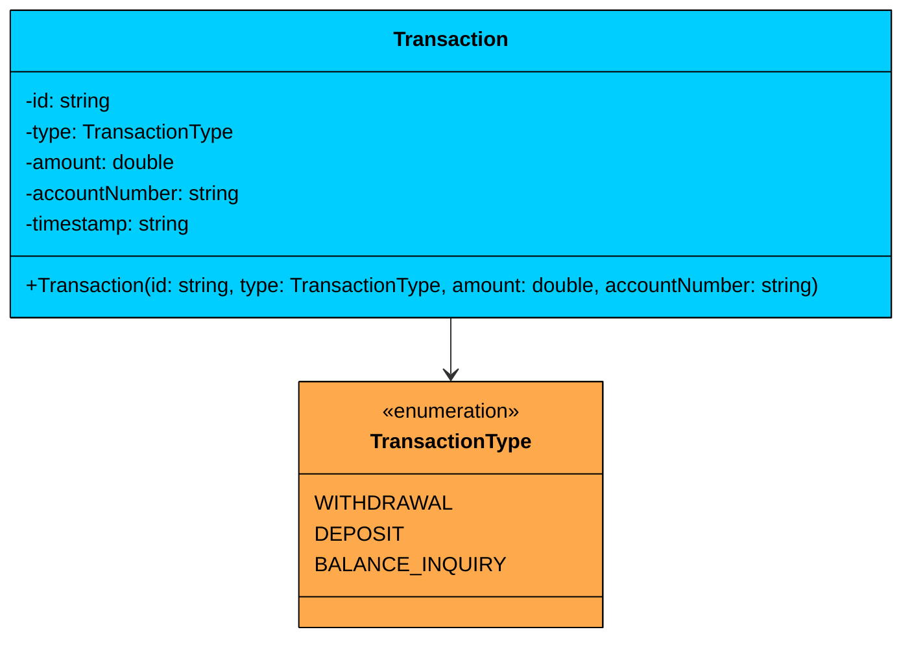

| Attribute | Type | Description | Mutable" |
|-----------|------|-------------|----------|
| `id` | string | Auto-generated unique identifier | No |
| `type` | TransactionType | What kind of transaction | No |
| `amount` | double | Dollar amount (0 for balance inquiry) | No |
| `accountNumber` | string | Which account was involved | No |
| `timestamp` | string | When the transaction occurred | No |

Transaction is completely **immutable**. Once created, it never changes. This is critical for audit trails. If someone disputes a transaction, you need to guarantee that the record hasn't been modified after the fact.

With our data classes defined, we need interfaces to define the contracts for our two key patterns.

### Interfaces

Interfaces define contracts for interchangeable behavior. Our ATM uses two interfaces: one for the Chain of Responsibility pattern (cash dispensing) and one for the State pattern (ATM behavior).

#### `CashHandler`

When the ATM needs to dispense $170, it should try $100 bills first, then $50s, then $20s, then $10s. Each denomination handler needs to process what it can and pass the remainder to the next handler. This is the Chain of Responsibility pattern, and the interface defines what each handler must do.

**CashHandler** defines the contract for a single link in the cash dispensing chain.

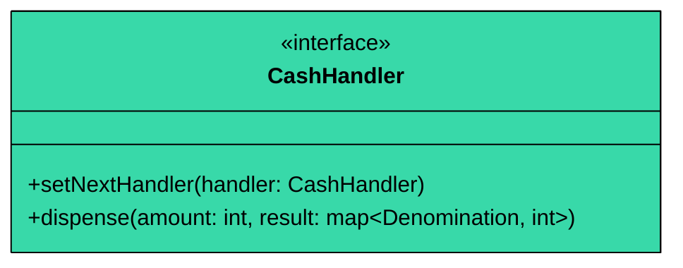

| Method | Description |
|--------|-------------|
| `setNextHandler(handler)` | Links this handler to the next one in the chain |
| `dispense(amount, result)` | Processes what it can, delegates the rest |

The `result` map accumulates the bills dispensed across the entire chain. Each handler adds its contribution and passes the remaining amount to the next handler.

#### `ATMStateHandler`

The ATM behaves differently depending on its current state. In IDLE state, only `insertCard` is valid. In CARD_INSERTED state, only `authenticate` and `ejectCard` are valid. Rather than checking state with if-else in every method, we delegate to state-specific handler classes.

**ATMStateHandler** defines the contract for state-specific ATM behavior.

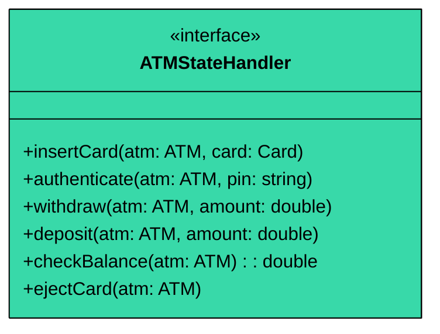

| Method | Description |
|--------|-------------|
| `insertCard(atm, card)` | Handle card insertion in this state |
| `authenticate(atm, pin)` | Handle PIN entry in this state |
| `withdraw(atm, amount)` | Handle withdrawal in this state |
| `deposit(atm, amount)` | Handle deposit in this state |
| `checkBalance(atm)` | Handle balance inquiry in this state |
| `ejectCard(atm)` | Handle card ejection in this state |

Each state implementation will handle the valid operations and throw `ATMException` for invalid ones. For example, `IdleState.withdraw()` throws "Please insert a card first," while `AuthenticatedState.withdraw()` processes the withdrawal normally.

Now let's build the classes that implement these interfaces and contain the real system logic.

### Core Classes

Core classes contain the actual system logic. They coordinate between data classes and implement the design patterns.

#### `DenominationHandler`

Each denomination in the ATM needs its own handler that knows how many bills of that denomination are available and how to dispense them. The handler processes what it can and passes the remainder to the next smaller denomination.

**DenominationHandler** implements `CashHandler` for a specific denomination.

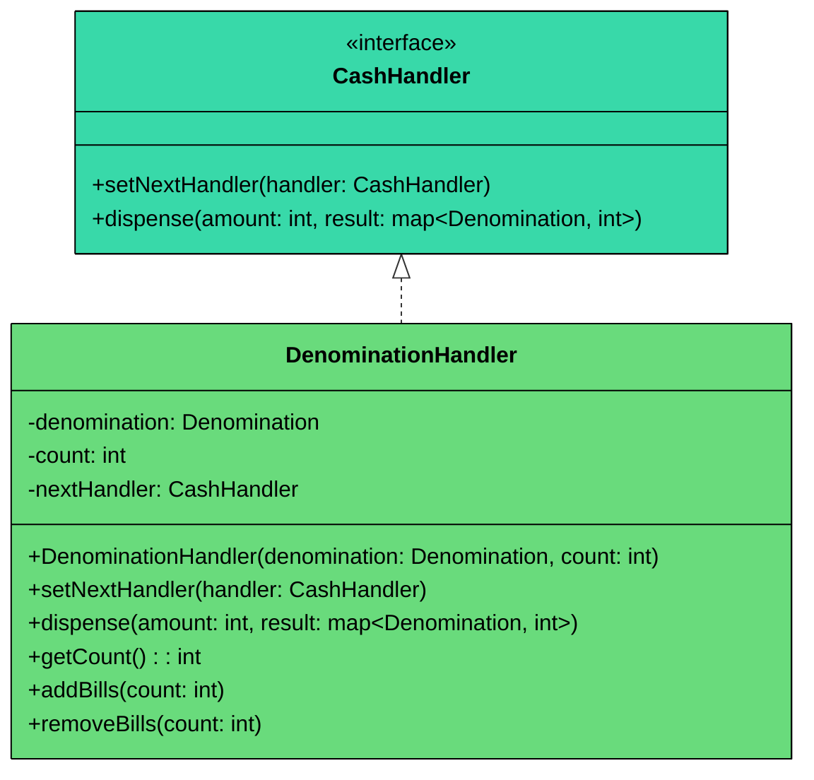

| Attribute | Type | Description | Mutable" |
|-----------|------|-------------|----------|
| `denomination` | Denomination | Which bill this handler manages | No |
| `count` | int | How many bills are currently loaded | Yes |
| `nextHandler` | CashHandler | Next handler in the chain (or null) | Yes |

| Method | Description |
|--------|-------------|
| `dispense(amount, result)` | Uses as many bills as possible, passes remainder to next handler |
| `addBills(count)` | Loads more bills (ATM restocking) |
| `removeBills(count)` | Removes bills from inventory |

The `dispense` method calculates how many bills of its denomination fit into the remaining amount, uses up to that many (limited by inventory), records the count in the result map, and passes any remainder to the next handler.

We need three state handler implementations, one for each ATMState. Each one handles the valid operations for that state and rejects the invalid ones.

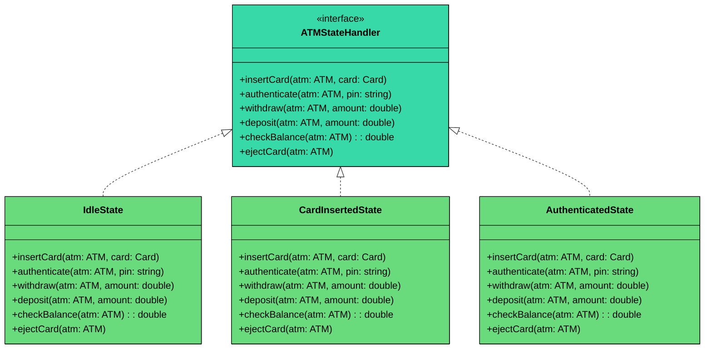

Each state handler follows the same pattern: valid operations do the work and transition to the next state, invalid operations throw `ATMException` with a helpful message.

| State | Valid Operations | Invalid Operations (throw ATMException) |
|-------|-----------------|----------------------------------------|
| `IdleState` | insertCard | authenticate, withdraw, deposit, checkBalance, ejectCard |
| `CardInsertedState` | authenticate, ejectCard | insertCard, withdraw, deposit, checkBalance |
| `AuthenticatedState` | withdraw, deposit, checkBalance, ejectCard | insertCard, authenticate |

The state handlers don't contain business logic themselves. They delegate to the ATM's internal methods. For example, `AuthenticatedState.withdraw()` calls the ATM's internal withdrawal logic. The state handler's job is just to guard: "Is this operation valid right now""

#### `CashDispenser`

The CashDispenser manages the ATM's physical cash inventory. It builds the chain of denomination handlers, checks if a given amount can be dispensed, and coordinates the actual dispensing.

**CashDispenser** manages the denomination chain and cash inventory.

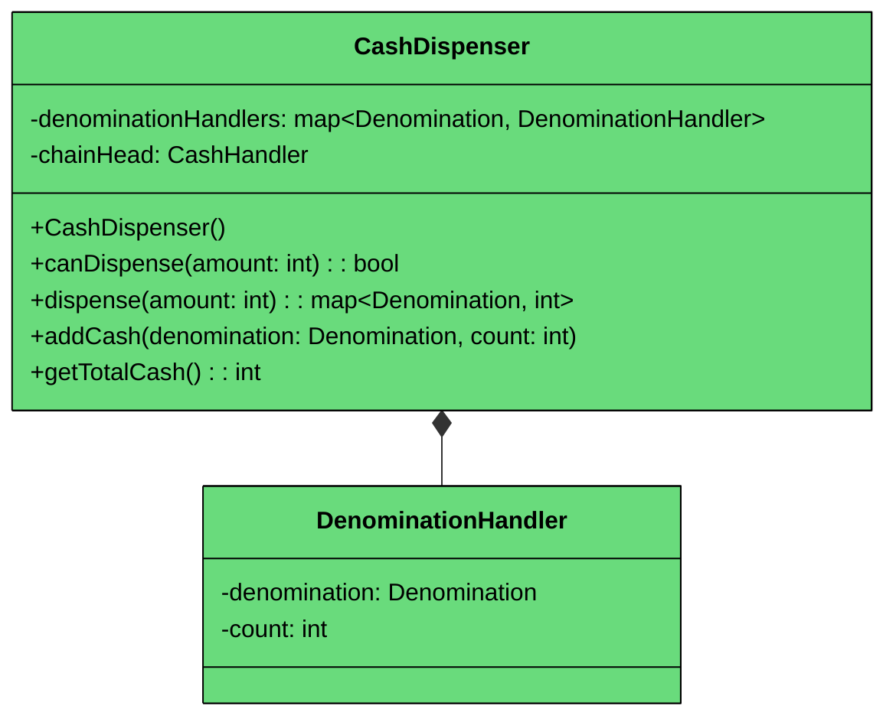

| Attribute | Type | Description | Mutable" |
|-----------|------|-------------|----------|
| `denominationHandlers` | map<Denomination, DenominationHandler> | Quick lookup by denomination | No (reference) |
| `chainHead` | CashHandler | First handler in the dispensing chain | No (reference) |

| Method | Description |
|--------|-------------|
| `canDispense(amount)` | Checks if the ATM can make the exact amount with available bills |
| `dispense(amount)` | Dispenses bills and updates inventory |
| `addCash(denomination, count)` | Restocks bills (for ATM maintenance) |
| `getTotalCash()` | Returns total cash value in the ATM |

CashDispenser has a **composition** relationship with DenominationHandler. The CashDispenser creates and owns all handlers. When the CashDispenser is destroyed, the handlers go with it. The chain is built in the constructor, linking $100 → $50 → $20 → $10.

The `canDispense` method is critical for financial safety. Before debiting the user's account, we must verify that the ATM can actually make the requested amount with the bills it has. A user requesting $30 when the ATM only has $50 and $100 bills should be rejected before any account changes happen.

#### `BankService`

The ATM doesn't store account data itself. It delegates all banking operations to a service that simulates what a real bank's servers would do.

**BankService** simulates the bank backend with in-memory accounts and cards.

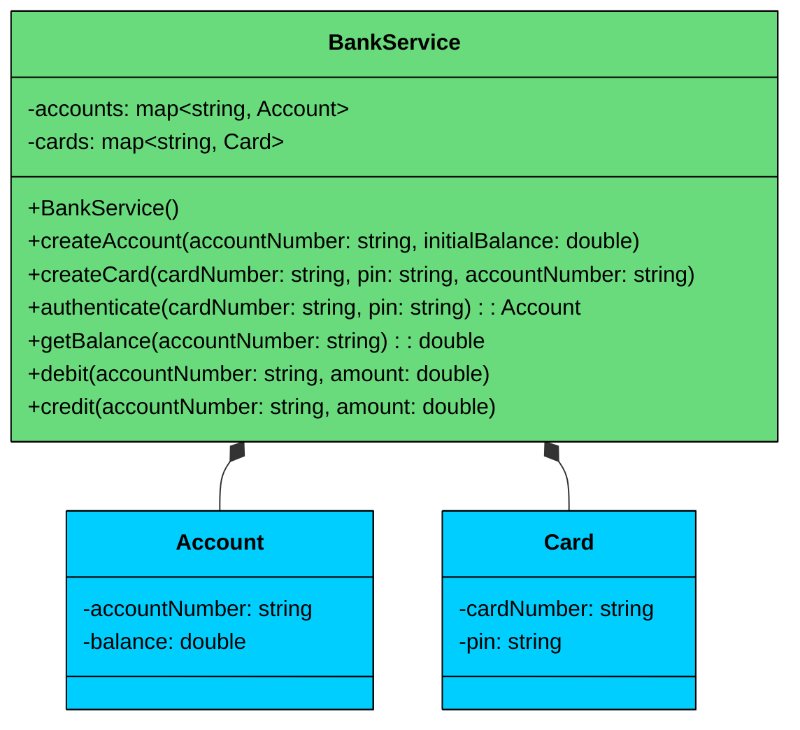

| Method | Description |
|--------|-------------|
| `createAccount(number, balance)` | Registers a new account |
| `createCard(number, pin, account)` | Issues a new card linked to an account |
| `authenticate(cardNumber, pin)` | Validates PIN and returns the linked Account |
| `getBalance(accountNumber)` | Returns current balance |
| `debit(accountNumber, amount)` | Subtracts from balance (validates sufficiency) |
| `credit(accountNumber, amount)` | Adds to balance |

The `authenticate` method checks both that the card exists and that the PIN matches. In the real world, this would be a network call to the bank's authentication servers. Here, it's an in-memory lookup.

#### `ATM`

Finally, the ATM itself. This is the facade that ties everything together: state management, bank communication, and cash dispensing.

**ATM** is the singleton facade that orchestrates the entire system.

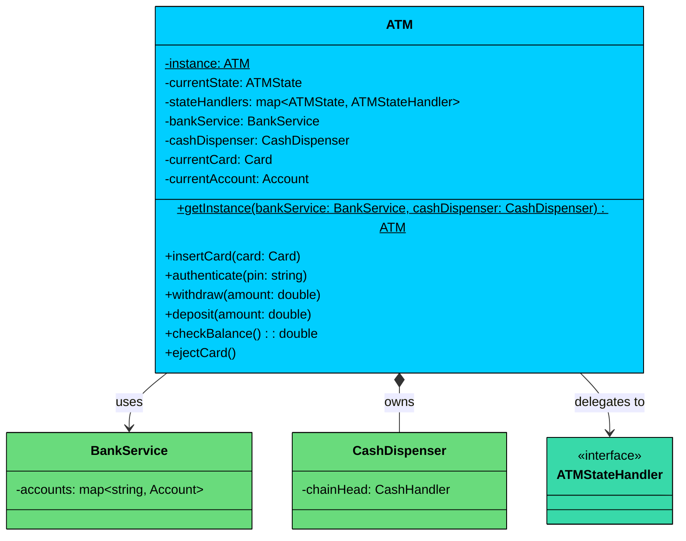

| Attribute | Type | Description | Mutable" |
|-----------|------|-------------|----------|
| `currentState` | ATMState | Where the ATM is in its lifecycle | Yes |
| `stateHandlers` | map<ATMState, ATMStateHandler> | State-to-handler mapping | No |
| `bankService` | BankService | Bank operations delegate | No |
| `cashDispenser` | CashDispenser | Cash inventory manager | No |
| `currentCard` | Card | Currently inserted card (null when IDLE) | Yes |
| `currentAccount` | Account | Currently authenticated account (null when not authenticated) | Yes |

| Method | Description |
|--------|-------------|
| `insertCard(card)` | Delegates to current state handler |
| `authenticate(pin)` | Delegates to current state handler |
| `withdraw(amount)` | Delegates to current state handler |
| `deposit(amount)` | Delegates to current state handler |
| `checkBalance()` | Delegates to current state handler |
| `ejectCard()` | Delegates to current state handler, resets session |

Every public method on ATM follows the same pattern: delegate to the current state handler. The state handler either performs the operation (if valid in this state) or throws an exception. This is the State pattern in action. The ATM doesn't have a single if-else chain checking its state. Instead, each state knows what it can and can't do.

ATM has a **composition** relationship with CashDispenser (owns it, manages its lifecycle) and an **association** with BankService (uses it but doesn't own it). ATM **delegates to** ATMStateHandler instances based on its current state.

> 💡 **Key Insight:**

> **Design Alternative**
>
> We could skip the State pattern entirely and use if-else checks in each ATM method: `if (state != AUTHENTICATED) throw new ATMException("...")`. For three states and six methods, that's manageable. We chose the State pattern because it keeps each state's logic isolated and makes adding new states (like `OUT_OF_SERVICE` or `MAINTENANCE`) a matter of adding a new class rather than editing every method. In a real interview, if the interviewer says "only these three states, no changes," the if-else approach is perfectly fine.

---

## 3.2 Key Design Patterns

You might notice some structural patterns emerging in our design. Let's make them explicit and justify each one.

The core challenges are managing state transitions (what operations are valid when") and dispensing cash across multiple denominations (how to try each denomination in order"). These map naturally to the State and Chain of Responsibility patterns.

### [**State Pattern**](/learn/lld/state)

**The Problem:** The ATM behaves completely differently depending on whether a card is inserted and whether the user has authenticated. Without a clean abstraction, every public method on ATM would start with:

```plaintext
if state is IDLE then reject
else if state is CARD_INSERTED then maybe allow
else if state is AUTHENTICATED then allow
```

With six methods and three states, that's 18 conditional branches scattered across the ATM class. Adding a new state (like OUT_OF_SERVICE) means editing every method.

**The Solution:** The State pattern encapsulates each state's behavior in a dedicated class. The ATM delegates to its current state handler, which knows what's valid and what isn't.

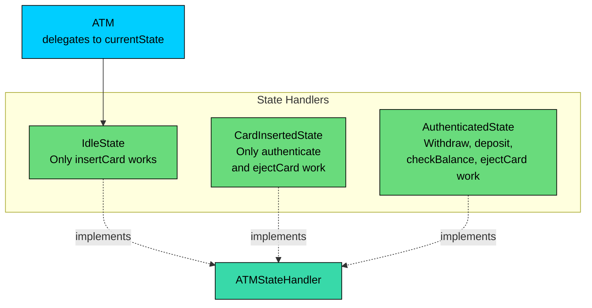

The State pattern isolates each state's rules into a single class. Adding OUT_OF_SERVICE means adding one class, not editing six methods. In interviews, this is one of the clearest demonstrations of the Open/Closed Principle.

### [**Chain of Responsibility Pattern**](/learn/lld/chain-of-responsibility)

**The Problem:** Dispensing $170 requires trying $100 bills first (dispense one, $70 remaining), then $50 bills (dispense one, $20 remaining), then $20 bills (dispense one, done). Each denomination needs to process what it can and hand off the remainder.

**The Solution:** The Chain of Responsibility pattern links denomination handlers in order from largest to smallest. Each handler in the chain processes what it can and passes the remainder to the next handler.

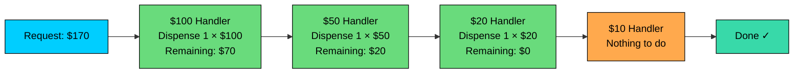

Each denomination handler is self-contained: it knows its denomination, its inventory count, and who to delegate to. Adding a $5 bill denomination means creating one new handler and linking it at the end of the chain. The CashDispenser doesn't change.

### [**Singleton Pattern**](/learn/lld/singleton)

**The Problem:** There's one physical ATM. If multiple parts of the code create ATM instances, they'd have inconsistent state: different cash inventories, different session states.

**The Solution:** The ATM uses the Singleton pattern with thread-safe lazy initialization. This ensures that only **one instance** of the ATM controller exists throughout the application's lifecycle. This is logical, as the software is designed to operate a single physical machine.

---

## 3.3 Full Class Diagram

```mermaid
classDiagram
    %% Enums
    class TransactionType {
        <<enumeration>>
        WITHDRAWAL
        DEPOSIT
        BALANCE_INQUIRY
    }

    class ATMState {
        <<enumeration>>
        IDLE
        CARD_INSERTED
        AUTHENTICATED
    }

    class Denomination {
        <<enumeration>>
        HUNDRED
        FIFTY
        TWENTY
        TEN
        -value: int
    }

    %% Exception
    class ATMException {
        +ATMException(message: string)
    }

    %% Data Classes
    class Card {
        -cardNumber: string
        -pin: string
        -accountNumber: string
    }

    class Account {
        -accountNumber: string
        -balance: double
        +debit(amount: double)
        +credit(amount: double)
    }

    class Transaction {
        -id: string
        -type: TransactionType
        -amount: double
        -accountNumber: string
        -timestamp: string
    }

    %% Interfaces
    class CashHandler {
        <<interface>>
        +setNextHandler(handler: CashHandler)
        +dispense(amount: int, result: map~Denomination, int~)
    }

    class ATMStateHandler {
        <<interface>>
        +insertCard(atm: ATM, card: Card)
        +authenticate(atm: ATM, pin: string)
        +withdraw(atm: ATM, amount: double)
        +deposit(atm: ATM, amount: double)
        +checkBalance(atm: ATM): double
        +ejectCard(atm: ATM)
    }

    %% Implementations
    class DenominationHandler {
        -denomination: Denomination
        -count: int
        -nextHandler: CashHandler
        +dispense(amount: int, result: map~Denomination, int~)
    }

    class IdleState {
        +insertCard(atm: ATM, card: Card)
    }

    class CardInsertedState {
        +authenticate(atm: ATM, pin: string)
        +ejectCard(atm: ATM)
    }

    class AuthenticatedState {
        +withdraw(atm: ATM, amount: double)
        +deposit(atm: ATM, amount: double)
        +checkBalance(atm: ATM): double
        +ejectCard(atm: ATM)
    }

    %% Core Classes
    class CashDispenser {
        -denominationHandlers: map~Denomination, DenominationHandler~
        -chainHead: CashHandler
        +canDispense(amount: int): bool
        +dispense(amount: int): map~Denomination, int~
        +addCash(denomination: Denomination, count: int)
    }

    class BankService {
        -accounts: map~string, Account~
        -cards: map~string, Card~
        +authenticate(cardNumber: string, pin: string): Account
        +debit(accountNumber: string, amount: double)
        +credit(accountNumber: string, amount: double)
    }

    class ATM {
        -instance: ATM$
        -currentState: ATMState
        -bankService: BankService
        -cashDispenser: CashDispenser
        -currentCard: Card
        -currentAccount: Account
        +insertCard(card: Card)
        +authenticate(pin: string)
        +withdraw(amount: double)
        +deposit(amount: double)
        +checkBalance(): double
        +ejectCard()
    }

    %% Relationships
    Transaction --> TransactionType : has
    DenominationHandler --> Denomination : handles
    ATM --> ATMState : tracks

    CashHandler <|.. DenominationHandler
    ATMStateHandler <|.. IdleState
    ATMStateHandler <|.. CardInsertedState
    ATMStateHandler <|.. AuthenticatedState

    CashDispenser *-- DenominationHandler : contains
    BankService *-- Account : manages
    BankService *-- Card : validates

    ATM *-- CashDispenser : owns
    ATM --> BankService : uses
    ATM --> ATMStateHandler : delegates to
    ATM --> ATMException : throws

    style TransactionType fill:#ffa94d,stroke:#000,color:#000
    style ATMState fill:#ffa94d,stroke:#000,color:#000
    style Denomination fill:#ffa94d,stroke:#000,color:#000
    style ATMException fill:#ff8787,stroke:#000,color:#000
    style Card fill:#00ceff,stroke:#000,color:#000
    style Account fill:#00ceff,stroke:#000,color:#000
    style Transaction fill:#00ceff,stroke:#000,color:#000
    style CashHandler fill:#38d9a9,stroke:#000,color:#000
    style ATMStateHandler fill:#38d9a9,stroke:#000,color:#000
    style DenominationHandler fill:#69db7c,stroke:#000,color:#000
    style IdleState fill:#69db7c,stroke:#000,color:#000
    style CardInsertedState fill:#69db7c,stroke:#000,color:#000
    style AuthenticatedState fill:#69db7c,stroke:#000,color:#000
    style CashDispenser fill:#69db7c,stroke:#000,color:#000
    style BankService fill:#69db7c,stroke:#000,color:#000
    style ATM fill:#00ceff,stroke:#000,color:#000
```

---

# 4. Code Implementation

This section contains the code implementation of the ATM system. We present the code bottom-up: enums first, then data classes, interfaces, implementations, core classes, and finally the ATM facade.

#### Java

## 4.1 Enums

### TransactionType

`TransactionType` categorizes the three operations the ATM supports. It's a straightforward enum with no extra fields since the type itself is all the information we need.

### ATMState

`ATMState` tracks where the ATM is in its interaction lifecycle. The three states map directly to the physical steps a user goes through: approach the machine, insert a card, enter a PIN.

### Denomination

`Denomination` represents the bill types the ATM can hold. Each value carries its face value as a read-only field, which the dispensing logic uses to calculate how many bills are needed.

The ordering matters: `HUNDRED` is first because the chain of responsibility processes denominations in declaration order (largest first). This minimizes the number of bills dispensed for any given amount.

## 4.2 Exception

### ATMException

Before we build classes that can fail, we need a clean way to signal failures. `ATMException` is a runtime exception because ATM errors (wrong PIN, insufficient funds) are recoverable situations that callers should handle, not programming bugs.

We use a single exception class rather than separate `InsufficientFundsException`, `AuthenticationException`, etc. For this scope, the error message provides enough context. In a larger system with distinct error handling paths, separate exception types would make more sense.

## 4.3 Data Classes

### Card

`Card` is an immutable container for bank card data. All three fields are `final` because a card's number, PIN, and linked account don't change during an ATM session.

### Account

`Account` is the one mutable data class in our system. The balance changes with every withdrawal and deposit, so `debit` and `credit` methods are `synchronized` to prevent race conditions when multiple ATMs share the same bank service.

The `debit` method validates sufficiency before subtracting. This is the inner validation ring. The ATM also validates before calling debit (checking cash availability), but the Account does its own check as a safety net. Defense in depth for financial operations.

### Transaction

`Transaction` is an immutable record of a completed operation. Once created, nothing about it can change. This immutability is critical for audit integrity.

## 4.4 Interfaces

### CashHandler

`CashHandler` defines the contract for a single link in the cash dispensing chain. The two methods, `setNextHandler` and `dispense`, are all that's needed for the Chain of Responsibility pattern.

The `result` map is passed through the entire chain, accumulating bills from each handler. This avoids each handler needing to return a partial result that gets merged later.

### ATMStateHandler

`ATMStateHandler` defines the contract for state-specific behavior. Every ATM operation has a corresponding method. Each state implementation decides which operations are valid and which throw exceptions.

The ATM reference is passed as a parameter so state handlers can call the ATM's internal methods (like `setState`, `setCurrentCard`) to perform state transitions. This avoids each state handler needing a stored reference to the ATM.

## 4.5 DenominationHandler

`DenominationHandler` is the core of the cash dispensing logic. Each handler manages one denomination: it knows the bill's value, how many are in stock, and who handles the next smaller denomination.

The `dispense` method is where the Chain of Responsibility pattern shines. Each handler calculates how many of its denomination fit into the remaining amount, uses only what it has in stock, and passes the remainder to the next handler. If the $100 handler can cover $100 of a $170 request, it does so and passes $70 to the $50 handler.

## 4.6 State Implementations

Now we implement the three state handlers. Each one follows the same structure: valid operations do the work, invalid operations throw `ATMException` with a descriptive message.

### IdleState

The ATM is waiting for a card. The only valid operation is inserting a card. Everything else gets rejected.

### CardInsertedState

A card is in the machine, but the user hasn't authenticated yet. They can enter their PIN or eject the card. Transaction operations are blocked.

The `authenticate` method delegates to the bank service for PIN validation. If authentication succeeds, we store the account reference and transition to AUTHENTICATED. If the bank service throws (wrong PIN, invalid card), the exception propagates up and the state stays at CARD_INSERTED.

### AuthenticatedState

The user has verified their identity. All transaction operations are available. Notice the withdrawal logic follows the critical safety invariant: **dispense cash before debiting the account**.

The withdrawal method performs three validations before touching any money: (1) the amount must be a positive multiple of $10, (2) the account must have sufficient funds, and (3) the ATM must be able to make the exact amount with its current bills. Only after all three pass does the actual dispensing and debiting happen.

## 4.7 CashDispenser

`CashDispenser` manages the ATM's physical cash inventory. It builds the chain of denomination handlers in the constructor and provides methods to check dispensability and actually dispense cash.

All public methods are `synchronized` because the cash inventory is shared mutable state. The `canDispense` method simulates the dispensing without modifying inventory, using a simple loop rather than the chain. The actual `dispense` method uses the chain, which modifies the real handler counts.

Why does `canDispense` use a loop instead of the chain" Because the chain's `dispense` method modifies handler counts as it goes. To simulate without side effects, we'd need to either clone all handlers or use a separate simulation chain. A simple loop is cleaner for a read-only check.

## 4.8 BankService

`BankService` simulates the bank's backend. In a real system, these would be network calls to the bank's servers. Here, we use in-memory maps for accounts and cards.

We use `ConcurrentHashMap` for both `accounts` and `cards` since multiple ATMs could be authenticating users and performing transactions concurrently. The individual `Account.debit()` and `Account.credit()` methods are also synchronized, providing defense in depth.

## 4.9 ATM

The `ATM` class is the singleton facade that ties everything together. Every public method delegates to the current state handler, which determines if the operation is valid and performs it.

The singleton uses double-checked locking with `volatile` to ensure thread-safe initialization. The `volatile` keyword prevents the JVM from reordering the instance construction, which could allow another thread to see a partially constructed ATM.

Every public method is `synchronized` on the ATM instance. This ensures that only one thread can operate the ATM at a time, which matches the physical reality: one person uses the ATM while others wait in line.

The internal methods (`setState`, `setCurrentCard`, etc.) are package-private (no access modifier). They're only called by state handler implementations, never by external code. This keeps the ATM's state management encapsulated.

## 4.10 Demo

The demo exercises all major features: successful withdrawal, deposit, and error handling for insufficient funds.

### 4.11 Withdrawal Flow

Let's trace a complete ATM session end-to-end to see how all the pieces work together. The user inserts a card, authenticates, withdraws $170, and ejects the card. This is the most common flow and the one interviewers will ask you to walk through.

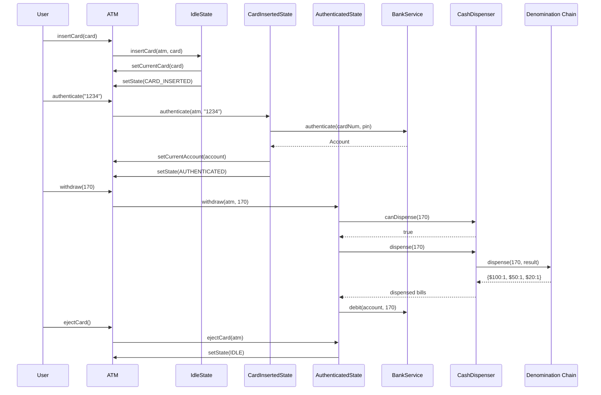

The flow has four distinct phases. Let's walk through each one.

#### **Phase 1: Card Insertion (IDLE → CARD_INSERTED)**

The user calls `insertCard(card)`. The ATM is in IDLE state, so it delegates to `IdleState.insertCard()`. The IdleState handler stores the card on the ATM and transitions the state to CARD_INSERTED. This is the only operation IdleState allows. If the user tried to call `withdraw()` right now, IdleState would throw `ATMException("Please insert a card first")`.

#### **Phase 2: Authentication (CARD_INSERTED → AUTHENTICATED)**

The user calls `authenticate("1234")`. The ATM is now in CARD_INSERTED state, so it delegates to `CardInsertedState.authenticate()`. The handler calls `BankService.authenticate()`, which looks up the card number, verifies the PIN matches, and returns the linked Account object. If the PIN is wrong, the bank service throws an exception and the state stays at CARD_INSERTED, giving the user another chance. On success, the handler stores the Account on the ATM and transitions to AUTHENTICATED.

#### **Phase 3: Withdrawal (stays AUTHENTICATED)**

This is the most complex phase with three safety gates. The user calls `withdraw(170)`, which delegates to `AuthenticatedState.withdraw()`. The handler performs three checks in order:

1. **Amount validation:** Is $170 a positive multiple of $10" Yes, proceed.
2. **Balance check:** Does the account have at least $170" Yes, proceed.
3. **Dispensability check:** Can the ATM make exactly $170 with its current bills" `CashDispenser.canDispense(170)` simulates the chain without touching inventory and returns true.

All three gates pass, so the handler calls `CashDispenser.dispense(170)`. The chain processes the request: the $100 handler takes one bill ($70 remaining), the $50 handler takes one bill ($20 remaining), and the $20 handler takes one bill ($0 remaining). The result map `{HUNDRED=1, FIFTY=1, TWENTY=1}` comes back.

Only after the cash is dispensed does the handler call `account.debit(170)`. This is the critical safety invariant: cash out first, debit second. If the dispenser jammed between dispensing and debiting, the customer keeps their money.

#### **Phase 4: Card Ejection (AUTHENTICATED → IDLE)**

The user calls `ejectCard()`. The `AuthenticatedState.ejectCard()` handler clears the current card and account from the ATM and transitions back to IDLE. The ATM is now ready for the next customer.

Notice that the ATM state never "skips" a phase. You can't go from IDLE to AUTHENTICATED without passing through CARD_INSERTED. You can't withdraw without authenticating first. Each state handler enforces its own rules, so the state machine is impossible to violate through the public API.

---

# 5. Run and Test

---

# 6. Quiz
