> 💡 **Key Insight:**

> **QUESTION**
>
> #### What is an Elevator System"
>
> An **elevator system** is a combination of mechanical components and software logic used in multi-story buildings to transport people or goods **vertically** between floors.
>
> 
> <!-- Simulation: elevator -->
> 

>
> Modern elevator systems typically consist of one or more elevator cars (also called lifts), each controlled by an embedded software system that manages a range of operations, including:
>
> - **Movement control** (moving the elevator up or down)
> - **Door operations** (opening and closing doors safely and efficiently)
> - **User request handling **(both from inside and outside the elevator)
> - **Scheduling logic** to decide which elevator responds to which request, in what order, and in which direction

In this chapter, we will explore the **low-level design of an elevator system ** in detail.

Lets start by clarifying the requirements:

---

# 1. Clarifying Requirements

Before starting the design, it's important to ask thoughtful questions to uncover hidden assumptions and better define the scope of the system.

Here is an example of how a conversation between the candidate and the interviewer might unfold:

> 💡 **Key Insight:**

> **DISCUSSION**
>
> **Candidate:** "How many floors and elevators should the system support""
>
> **Interviewer:** "Let's design for a 10-floor building with 3 elevators. But the design should be flexible enough to scale to more."
>
> **Candidate:** "Should the system handle both internal requests (floor buttons inside the elevator) and external requests (hall calls from each floor)""
>
> **Interviewer:** "Yes, the system should support both internal and external requests. Internal requests specify only a destination floor. External requests specify a floor and a desired direction (up or down)."
>
> **Candidate:** "Should we follow a specific elevator scheduling algorithm, like SCAN or LOOK, or is a basic first-come-first-serve strategy sufficient""
>
> **Interviewer:** "You can start with a simple scheduling strategy like nearest elevator first. However, the design should be extensible enough to support pluggable scheduling algorithms in the future."
>
> **Candidate:** "Should each floor and elevator cabin have a display showing the current floor and direction""
>
> **Interviewer:** "Yes. Displays should update whenever an elevator's state changes, but the elevator itself shouldn't know about displays directly."
>
> **Candidate:** "Should each elevator run independently in its own thread""
>
> **Interviewer:** "Yes. Each elevator should have its own controller running in a separate thread."
>
> **Candidate:** "Do we need to handle user input, or can we hardcode test scenarios""
>
> **Interviewer:** "Hardcode the scenarios. Focus on the design, not the I/O."

After gathering the details, we can summarize the key system requirements.

## 1.1 Functional Requirements

- Support **multiple elevators** serving **multiple floors** in a building
- Handle **internal requests** (cabin buttons) and **external requests** (hall buttons with direction)
- Dispatch external requests to the **most suitable elevator** using a configurable strategy
- Each elevator uses the **LOOK algorithm** to serve requests efficiently
- Display current floor and direction on each floor and inside each elevator cabin
- Each elevator operates **independently** in its own thread

## 1.2 Non-Functional Requirements

- The design should follow **object-oriented principles** with clear separation of concerns
- The system should be **modular and extensible** to support new dispatch strategies
- The code should be **thread-safe** for concurrent elevator operations
- The components should be **testable** in isolation
- The dispatch strategy should be swappable at runtime without modifying existing code

## Elevator Movement Algorithms

The most naive approach is **FIFO (First-In, First-Out)**: serve requests in the order they arrive. If the elevator is on floor 1 and receives requests for floors 8, 3, and 6 in that order, it goes 1 → 8 → 3 → 6. That's a lot of unnecessary back-and-forth. Passengers on floors the elevator passes right by have to wait while it chases requests in arrival order.

A better idea is **SCAN** (sometimes called the "elevator algorithm", ironically). The elevator moves in one direction, serving all requests along the way, then reverses and does the same in the opposite direction. It always travels to the very end of its range before reversing, even if there are no more requests in that direction.

**LOOK** improves on SCAN with one key tweak: instead of traveling all the way to the top or bottom floor, the elevator only goes as far as the highest (or lowest) pending request in its current direction, then reverses immediately. It "looks ahead" to see if there are more requests before continuing, hence the name.

Here's a concrete example. Imagine a 10-floor building where an elevator is on floor 3, moving UP, with pending requests for floors 5, 7, and 2:

```plaintext
FIFO:    3 → 5 → 7 → 2         (serves in arrival order)
SCAN:    3 → 5 → 7 → 10 → 2   (goes all the way to top, then reverses)
LOOK:    3 → 5 → 7 → 2         (reverses at 7, the highest request)
```

LOOK and FIFO happen to visit the same floors in this example, but the difference shows up under load. With FIFO, if a new request for floor 4 arrives while the elevator is heading to floor 7, it won't be served until after the trip down to floor 2 and back. With LOOK, the elevator serves 4 on the way down because it processes all requests in its current direction of travel.

The LOOK algorithm gives us the best trade-off for elevators: it minimizes unnecessary travel (unlike FIFO), avoids wasted trips to empty extremes (unlike SCAN), and it's simple enough to implement with just two sorted sets, one for each direction. We'll see exactly how those sets work when we build the `Elevator` class.

Now that we understand what we're building and the algorithm driving it, let's identify the building blocks of our system.

---

# 2. Identifying Core Entities

> [!PAYWALL] This content is for premium members only.

How do you go from a list of requirements to actual classes" The key is to look for **nouns** in the requirements that have distinct attributes or behaviors. Not every noun becomes a class, but this approach gives you a starting point.

Let's walk through our requirements and identify what needs to exist in our system.

### 2.1 Direction and State

> "The elevator continues in its current direction and reverses when there are no more requests ahead"

An elevator can move up, move down, or sit idle. We need a `Direction` enum with values `UP`, `DOWN`, and `IDLE`. This is more than just a label. The dispatch algorithm (e.g., LOOK) uses direction to decide which request set to pull from.

> "Elevator doors open automatically on arrival and close before moving"

A door is either open or closed. We need a `DoorState` enum to track this. And since doors are physical components with open/close behavior, we also need a `Door` data class.

> "Each elevator operates independently"

An elevator has a lifecycle: it can be idle, moving up, moving down, have its door open, or be out of service. The `ElevatorState` enum captures these states. This is richer than Direction because it includes door and maintenance states.

### 2.2 Requests

> "Handle internal requests (cabin buttons) and external requests (hall buttons with direction)"

When someone presses a button, we need to capture that as a data object. A `Request` holds the target floor, the direction (for external requests), the request type, and a timestamp. 

We also need a `RequestType` enum to distinguish `INTERNAL` from `EXTERNAL`.

Why a single Request class instead of separate InternalRequest and ExternalRequest subclasses" Because both types carry the same core data (floor number) and are handled identically by the elevator's scheduling algorithm. The only difference is where they originate, which is captured by the type field.

### 2.3 Physical Components

> "Display current floor and direction on each floor and inside each elevator cabin"

Displays update when an elevator's state changes, but the elevator shouldn't know about displays directly. This is a classic Observer scenario. The `Display` class implements an observer interface and reacts to state changes.

> "Support multiple elevators serving multiple floors"

Each `Elevator` is a physical car with a current floor, a direction, a door, a display, and two sets of pending requests (one for up, one for down). Each `Floor` has a number, hall buttons, and a display showing the nearest elevator's status.

### 2.4 Dispatch and Control

> "Dispatch external requests to the most suitable elevator using a configurable strategy"

We need a `DispatchStrategy` interface with implementations like **NearestElevatorStrategy** and **ZoneBasedStrategy**. The Strategy pattern lets us swap dispatch algorithms without touching any other code.

The scheduling logic is complex enough to warrant its own class. The `ElevatorController` runs in its own thread, pulling requests from its elevator's queue and deciding which floor to visit next using the LOOK algorithm.

### 2.5 System Facade

> "The system should be modular and extensible"

We need an `ElevatorSystem` singleton that acts as the entry point. It receives external requests from hall buttons, picks the best elevator via the dispatch strategy, and routes the request. This is the facade that ties everything together.

### 2.6 Entity Overview

Here's how these entities relate to each other:

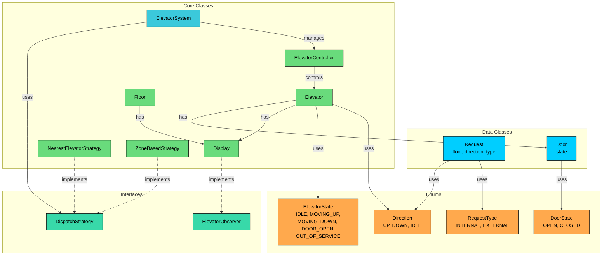

We've identified four types of entities:

**Enums** define fixed sets of values. Direction, ElevatorState, DoorState, and RequestType provide type safety and prevent invalid values from entering the system.

**Data Classes** primarily hold data with minimal behavior. Request is an immutable record of a button press. Door manages its open/close state.

**Interfaces** define contracts for interchangeable behavior. ElevatorObserver enables the Observer pattern for displays, and DispatchStrategy enables swappable elevator selection algorithms.

**Core Classes** contain the main logic. Display observes elevator state changes. Elevator manages its physical state and request queues. Floor represents a building floor. ElevatorController runs the LOOK algorithm. ElevatorSystem orchestrates everything as a singleton facade.

| Entity | Type | Responsibility |
|--------|------|----------------|
| `Direction` | Enum | Movement direction: UP, DOWN, IDLE |
| `ElevatorState` | Enum | Elevator lifecycle: IDLE, MOVING_UP, MOVING_DOWN, DOOR_OPEN, OUT_OF_SERVICE |
| `DoorState` | Enum | Door position: OPEN, CLOSED |
| `RequestType` | Enum | Request origin: INTERNAL (cabin), EXTERNAL (hall) |
| `Request` | Data Class | Immutable record of a floor request with direction and type |
| `Door` | Data Class | Door state management with open/close behavior |
| `ElevatorObserver` | Interface | Contract for observing elevator state changes |
| `DispatchStrategy` | Interface | Contract for selecting which elevator handles a hall request |
| `Display` | Core Class | Observer implementation that shows floor and direction |
| `Elevator` | Core Class | Physical car: current floor, direction, door, request sets |
| `Floor` | Core Class | Building floor with hall button state and display |
| `NearestElevatorStrategy` | Core Class | Dispatch: picks closest idle or same-direction elevator |
| `ZoneBasedStrategy` | Core Class | Dispatch: assigns floor zones to specific elevators |
| `ElevatorController` | Core Class | Runs LOOK algorithm in its own thread |
| `ElevatorSystem` | Core Class (Singleton) | Facade: dispatches external requests via strategy |

With our entities identified, let's define their attributes, behaviors, and relationships.

---

# 3. Designing Classes and Relationships

Now that we know what entities we need, let's flesh out their details. For each class, we'll define what data it holds (attributes) and what it can do (methods). Then we'll look at how these classes connect to each other.

## 3.1 Class Definitions

We'll work bottom-up: simple types first, then data containers, then interfaces, then the classes with real logic. This order makes sense because complex classes depend on simpler ones.

### Enums

Enums define fixed sets of values that provide type safety and make code self-documenting. Using enums prevents invalid states at compile time rather than runtime.

#### `Direction`

We need a way to express which way an elevator is moving or which way a person on a floor wants to go. Using strings like "up" or integers like 1 and -1 would work, but they're error-prone. An enum gives us a closed set of valid options.

**Direction** represents the movement direction of an elevator or a hall request.

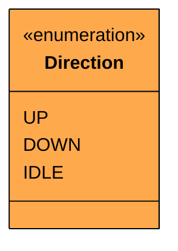

| Value | Purpose |
|-------|---------|
| `UP` | Elevator is moving upward, or passenger wants to go up |
| `DOWN` | Elevator is moving downward, or passenger wants to go down |
| `IDLE` | Elevator is stationary with no pending requests |

The `IDLE` value might seem redundant if you already have an ElevatorState enum. But Direction and ElevatorState serve different purposes. Direction is about movement intent (which request set to pull from in the LOOK algorithm), while ElevatorState is about the elevator's lifecycle phase (including door states and maintenance). An elevator with `Direction.IDLE` and `ElevatorState.DOOR_OPEN` is perfectly valid: it's not moving, but its door is open at a floor.

#### `ElevatorState`

An elevator's behavior depends on more than just its direction. Is the door open" Is it out of service" These states determine what operations are valid. You can't add a passenger while the door is closed. You can't move while the door is open.

**ElevatorState** represents the elevator's current lifecycle phase.

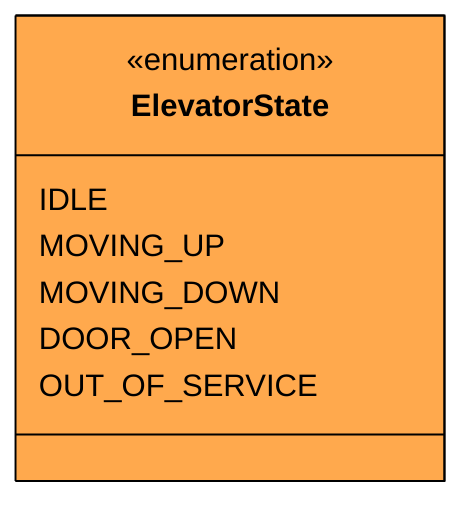

| Value | Meaning | Valid Operations |
|-------|---------|-----------------|
| `IDLE` | Stationary, door closed, no pending requests | Accept requests, begin moving |
| `MOVING_UP` | Traveling upward toward a target floor | Accept new requests |
| `MOVING_DOWN` | Traveling downward toward a target floor | Accept new requests |
| `DOOR_OPEN` | Stopped at a floor with door open | Passengers enter/exit |
| `OUT_OF_SERVICE` | Disabled for maintenance | No operations |

The state transitions follow strict rules. Here's the complete state diagram:

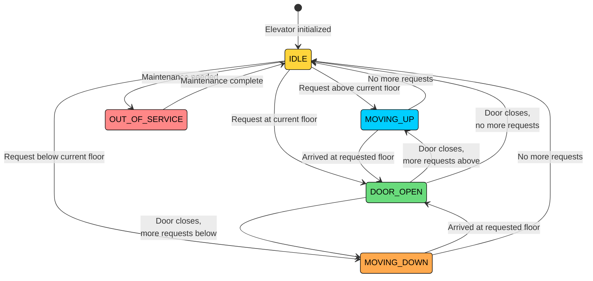

Notice that MOVING_UP can never transition directly to MOVING_DOWN. An elevator must stop (DOOR_OPEN or IDLE) before reversing direction. This prevents the jarring experience of an elevator suddenly changing direction mid-travel. Also notice that OUT_OF_SERVICE can only transition back to IDLE, not directly to a moving state. A serviced elevator starts fresh.

The DOOR_OPEN state is the critical junction. From here, the elevator decides its next move based on remaining requests: continue in the same direction, reverse, or go idle. This decision point is where the LOOK algorithm lives.

#### `DoorState`

The door is either open or closed. No in-between states for this design. In a real elevator you'd model OPENING and CLOSING transitions, but for an interview, two states keep the focus on the scheduling algorithm rather than door mechanics.

**DoorState** represents the physical position of the elevator door.

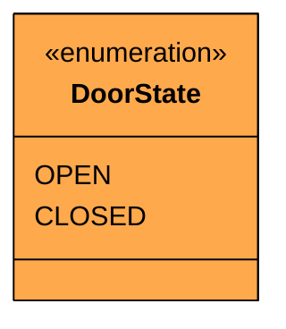

| Value | Meaning |
|-------|---------|
| `OPEN` | Door is open, passengers can enter/exit |
| `CLOSED` | Door is closed, elevator can move |

#### `RequestType`

We need to distinguish where a request came from because external and internal requests are handled differently. An external request (hall button) needs to be dispatched to the best elevator. An internal request (cabin button) goes directly to the elevator the passenger is already in.

**RequestType** identifies the origin of a floor request.

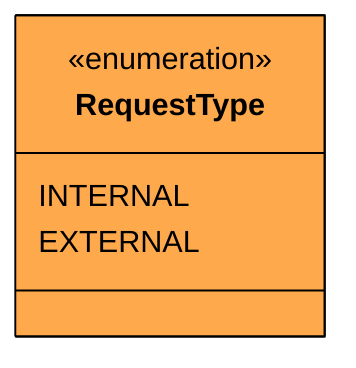

| Value | Meaning |
|-------|---------|
| `INTERNAL` | Pressed inside the elevator cabin (destination floor) |
| `EXTERNAL` | Pressed on a floor hallway (pickup request with direction) |

The dispatch strategy only operates on EXTERNAL requests. INTERNAL requests bypass dispatch entirely since the elevator is already determined.

Now that we have our value types defined, we need classes to hold the data that flows through the system.

### Custom Exception

Before we write classes that can fail, let's define how they fail. A custom exception makes error handling cleaner than catching generic exceptions.

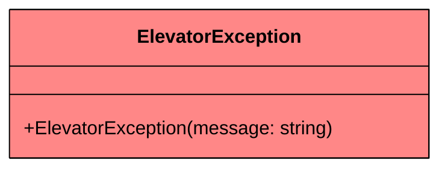

We'll throw `ElevatorException` when someone requests an invalid floor number, when no elevator is available for dispatch, or when a request targets an out-of-service elevator.

### Data Classes

Data classes are simple containers that hold data with minimal behavior. They represent the "nouns" in our system that have attributes but limited logic.

#### `Request`

When a passenger presses a button, either inside the cabin or on a floor, we need to capture that as an object that can be queued, compared, and processed. The floor number is the most important piece: it tells the elevator where to stop.

**Request** represents a floor request from either a cabin button or a hall button.

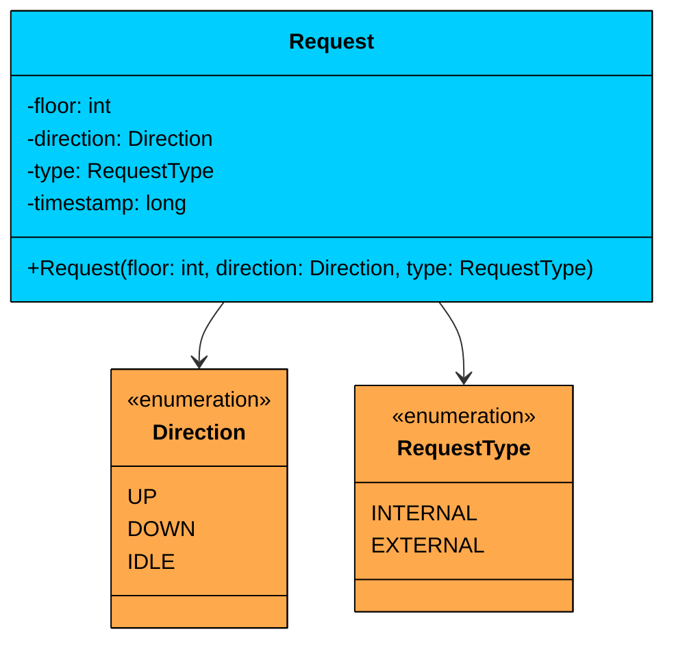

| Attribute | Type | Description | Mutable" |
|-----------|------|-------------|----------|
| `floor` | int | Target floor number | No |
| `direction` | Direction | Desired direction (UP/DOWN for external, IDLE for internal) | No |
| `type` | RequestType | Whether this is a cabin or hall request | No |
| `timestamp` | long | When the request was created | No |

Request is completely **immutable**. Once a button is pressed, the request doesn't change. The timestamp is set automatically at construction time and can be useful for fairness or aging in more advanced scheduling algorithms.

#### `Door`

The door is a physical component of the elevator. It has a state (open or closed) and behavior (open and close operations). We keep it as a separate class rather than a boolean on Elevator because it encapsulates its own validation: you can't open an already-open door.

**Door** manages the elevator door state transitions.

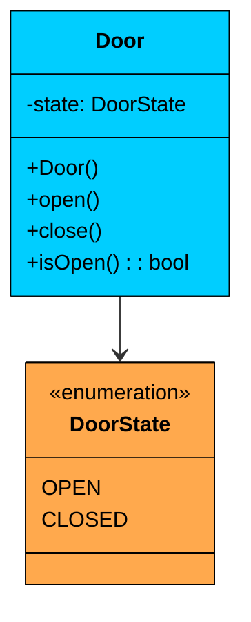

| Attribute | Type | Description | Mutable" |
|-----------|------|-------------|----------|
| `state` | DoorState | Current door position | Yes |

| Method | Description |
|--------|-------------|
| `open()` | Transitions door to OPEN state |
| `close()` | Transitions door to CLOSED state |
| `isOpen()` | Returns true if door is currently open |

The door starts in the CLOSED state. The `open()` and `close()` methods are idempotent: opening an already-open door is a no-op, not an error. This simplifies the controller logic since it doesn't need to check door state before issuing commands.

With our data classes defined, we need interfaces to define the contracts for our two key patterns.

### Interfaces

Interfaces define contracts for interchangeable behavior. Our elevator system uses two interfaces: one for the Observer pattern (display updates) and one for the Strategy pattern (dispatch algorithms).

#### `ElevatorObserver`

When an elevator moves to a new floor or changes direction, every display in the system that cares about that elevator needs to update. But the elevator shouldn't know about displays, scoreboards, logging systems, or any other consumers of its state changes. This is exactly what the Observer pattern solves.

**ElevatorObserver** defines the contract for receiving elevator state change notifications.

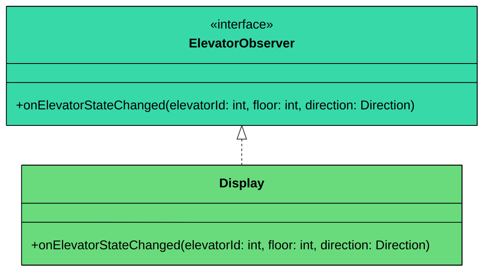

| Method | Description |
|--------|-------------|
| `onElevatorStateChanged(elevatorId, floor, direction)` | Called when an elevator's floor or direction changes |

The observer receives three pieces of information: which elevator changed, what floor it's now at, and which direction it's heading. This is enough for any display to render meaningful information.

#### `DispatchStrategy`

When someone presses a hall button on floor 7 wanting to go up, the system needs to decide which of the 3 elevators should handle the request. The "best" choice depends on the algorithm: nearest idle elevator" Nearest elevator already heading in that direction" Elevator assigned to that floor's zone"

**DispatchStrategy** defines the contract for selecting an elevator to handle an external request.

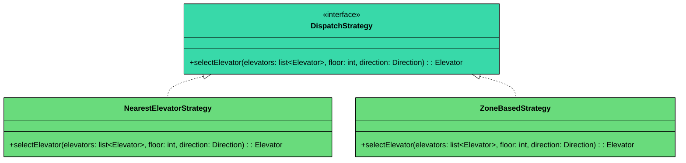

| Method | Description |
|--------|-------------|
| `selectElevator(elevators, floor, direction)` | Returns the best elevator to handle a request at the given floor and direction |

The method takes the full list of elevators, the requesting floor, and the desired direction. Each strategy implementation applies its own scoring or filtering logic to pick the best candidate.

Now let's build the classes that implement these interfaces and contain the real system logic.

### Core Classes

Core classes contain the actual system logic. They coordinate between data classes and implement the design patterns.

#### `Display`

We said that elevators shouldn't know about displays directly. The Display class implements `ElevatorObserver` and receives notifications whenever an elevator's state changes. It then renders the current floor and direction.

**Display** shows the current floor and direction of an elevator.

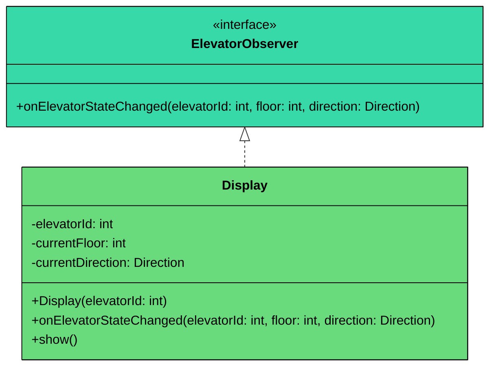

| Attribute | Type | Description | Mutable" |
|-----------|------|-------------|----------|
| `elevatorId` | int | Which elevator this display tracks | No |
| `currentFloor` | int | Last known floor of the elevator | Yes |
| `currentDirection` | Direction | Last known direction of the elevator | Yes |

| Method | Description |
|--------|-------------|
| `onElevatorStateChanged(elevatorId, floor, direction)` | Updates display state when the tracked elevator changes |
| `show()` | Renders the current floor and direction information |

The Display only updates when the notification matches its `elevatorId`. This allows multiple displays to observe the same elevator events, with each one filtering for its own elevator. A floor display and a cabin display for elevator 1 both receive all events but only react to elevator 1's changes.

#### `Elevator`

The elevator is the central physical entity. It holds its current floor, direction, state, door, display, and two sorted sets of pending requests: one for floors to visit while going up, and one for floors to visit while going down.

**Elevator** represents a physical elevator car with its state and request queues.

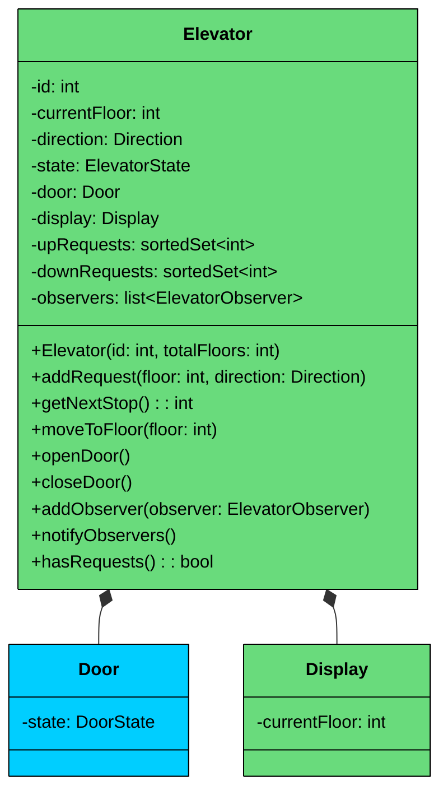

| Attribute | Type | Description | Mutable" |
|-----------|------|-------------|----------|
| `id` | int | Unique elevator identifier | No |
| `currentFloor` | int | Floor the elevator is currently at | Yes |
| `direction` | Direction | Current movement direction | Yes |
| `state` | ElevatorState | Current lifecycle state | Yes |
| `door` | Door | Physical door (composition) | No (reference) |
| `display` | Display | Cabin display (composition) | No (reference) |
| `upRequests` | sortedSet<int> | Floors to visit going up (sorted ascending) | Yes (contents) |
| `downRequests` | sortedSet<int> | Floors to visit going down (sorted descending) | Yes (contents) |
| `observers` | list<ElevatorObserver> | Registered state change listeners | Yes (contents) |
| `totalFloors` | int | Maximum floor number in the building | No |

| Method | Description |
|--------|-------------|
| `addRequest(floor, direction)` | Adds floor to appropriate request set based on direction |
| `getNextStop()` | Returns the next floor to visit based on current direction |
| `moveToFloor(floor)` | Updates current floor and notifies observers |
| `openDoor()` | Opens the door and updates state |
| `closeDoor()` | Closes the door |
| `addObserver(observer)` | Registers a state change listener |
| `notifyObservers()` | Broadcasts current state to all observers |
| `hasRequests()` | Returns true if either request set has pending floors |

**Two sorted sets** is the key data structure decision. `upRequests` is sorted in ascending order so the next floor above is always first. `downRequests` is sorted in descending order so the next floor below is always first. This makes the LOOK algorithm's "find the next stop in the current direction" operation very efficient.

**Relationship:** Elevator has a **composition** relationship with Door and Display. The Elevator creates and owns both. When the Elevator is destroyed, the Door and Display go with it. Elevator has an **aggregation** relationship with ElevatorObserver: it references observers but doesn't own them (external displays on floors can observe multiple elevators).

> 💡 **Key Insight:**

> **Design Alternative**
>
> We could use a single priority queue instead of two TreeSets. This would simplify the data structure but make direction-aware scheduling harder. With a single queue, finding "the next floor above me in the up direction" requires scanning the entire queue. With two sorted sets, it's a single `ceiling()` or `floor()` call. We chose two sets because the LOOK algorithm's core operation is "find next in current direction," and sorted sets make that O(log n) instead of O(n).

#### `Floor`

Each floor in the building has a floor number, indicators for whether the up/down hall buttons are pressed, and a display showing the nearest elevator's status.

**Floor** represents a building floor with hall buttons and a display.

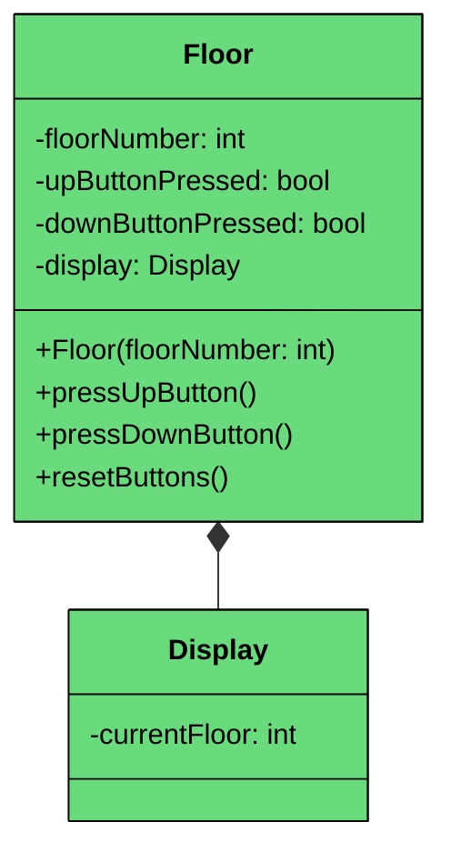

| Attribute | Type | Description | Mutable" |
|-----------|------|-------------|----------|
| `floorNumber` | int | Which floor this represents | No |
| `upButtonPressed` | bool | Whether the up hall button is active | Yes |
| `downButtonPressed` | bool | Whether the down hall button is active | Yes |
| `display` | Display | Floor display showing elevator status | No (reference) |

| Method | Description |
|--------|-------------|
| `pressUpButton()` | Activates the up hall button indicator |
| `pressDownButton()` | Activates the down hall button indicator |
| `resetButtons()` | Deactivates both hall button indicators after elevator arrives |

**Relationship:** Floor has a **composition** relationship with Display. The floor owns its display panel.

#### `NearestElevatorStrategy`

The default dispatch strategy. When a hall button is pressed, this strategy scores each elevator based on distance and direction compatibility, then picks the best one.

**NearestElevatorStrategy** selects the closest suitable elevator for a hall request.

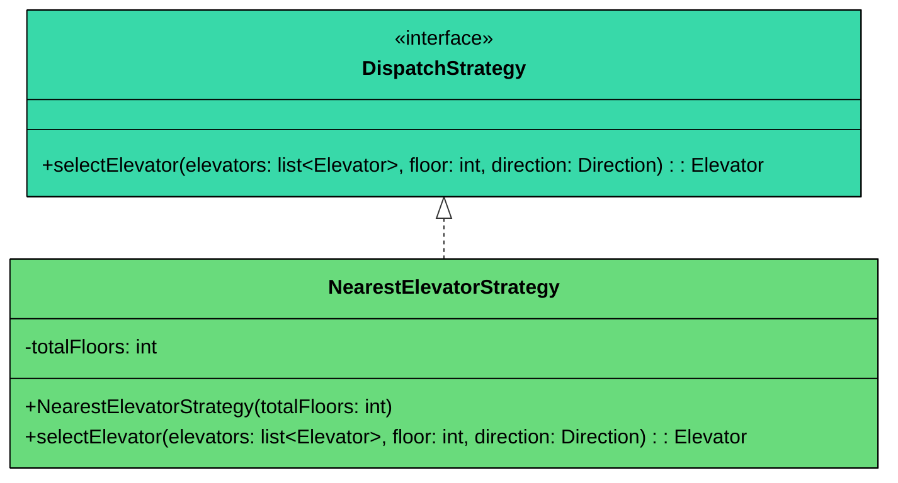

The scoring system considers three cases:

| Elevator Status | Score Formula | Reasoning |
|----------------|---------------|-----------|
| IDLE | totalFloors - distance | Closer idle elevators score higher |
| Same direction, hasn't passed the floor | totalFloors - distance + bonus | Best case: already heading toward the floor |
| Opposite direction or already passed | 1 (minimum score) | Would need to reverse, low priority |

The strategy skips any elevator that is OUT_OF_SERVICE. If no suitable elevator is found, it throws `ElevatorException`.

#### `ZoneBasedStrategy`

An alternative dispatch strategy that divides the building into zones and assigns each elevator to a specific range of floors.

**ZoneBasedStrategy** assigns elevators to floor zones for balanced load distribution.

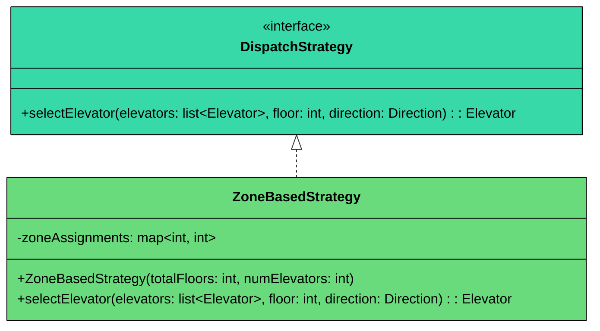

For a 10-floor building with 3 elevators, the zones might be:

- Elevator 0: Floors 1-3
- Elevator 1: Floors 4-6
- Elevator 2: Floors 7-10

The `zoneAssignments` map stores floor-to-elevator-index mappings. If the assigned elevator is OUT_OF_SERVICE, the strategy falls back to the nearest available elevator.

#### `ElevatorController`

This is where the LOOK algorithm lives. Each elevator has its own controller running in a separate thread, continuously checking for requests and moving the elevator accordingly.

**ElevatorController** runs the LOOK scheduling algorithm for a single elevator.

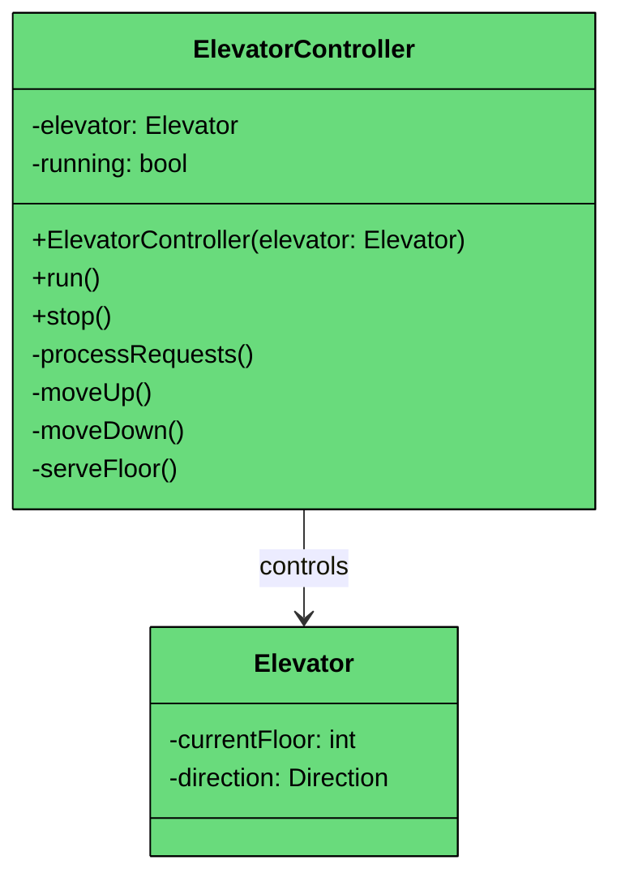

| Attribute | Type | Description | Mutable" |
|-----------|------|-------------|----------|
| `elevator` | Elevator | The elevator this controller manages | No |
| `running` | bool | Whether the controller thread is active | Yes |

| Method | Description |
|--------|-------------|
| `run()` | Main loop: checks requests, moves elevator, serves floors |
| `stop()` | Signals the controller thread to shut down gracefully |
| `processRequests()` | Core LOOK logic: serve current direction, then reverse |
| `moveUp()` | Moves elevator one floor up |
| `moveDown()` | Moves elevator one floor down |
| `serveFloor()` | Opens door, waits, closes door, removes floor from request set |

The LOOK algorithm works like a disk arm:

1. If there are requests in the current direction, move toward the nearest one
2. When no more requests exist in the current direction, reverse direction
3. If no requests exist in either direction, go IDLE and wait

This is more efficient than FIFO (first-come-first-served) because it avoids unnecessary direction changes. An elevator going up from floor 3 with requests at floors 5, 8, and 2 will serve 5 and 8 first (same direction), then reverse to serve 2. A FIFO approach might go 5, then back down to 2, then back up to 8, wasting time.

#### `ElevatorSystem`

The facade that ties everything together. It creates elevators and controllers, receives external requests, and dispatches them using the configured strategy.

**ElevatorSystem** is the singleton entry point for the elevator system.

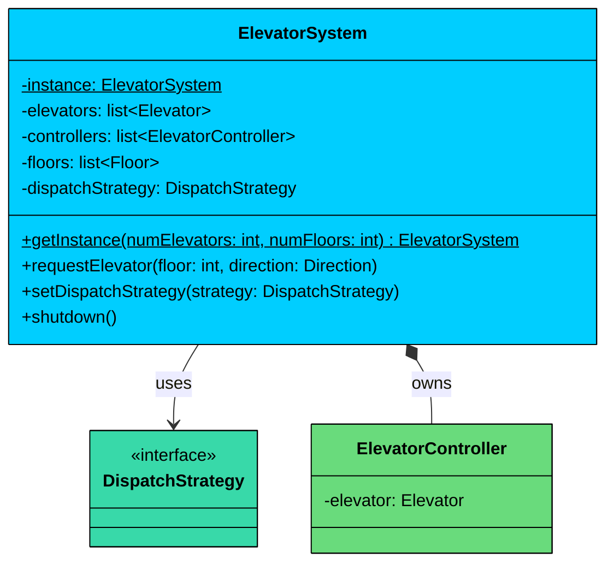

| Attribute | Type | Description | Mutable" |
|-----------|------|-------------|----------|
| `elevators` | list<Elevator> | All elevators in the building | No (reference) |
| `controllers` | list<ElevatorController> | One controller per elevator | No (reference) |
| `floors` | list<Floor> | All floors in the building | No (reference) |
| `dispatchStrategy` | DispatchStrategy | Current dispatch algorithm | Yes (swappable) |

| Method | Description |
|--------|-------------|
| `requestElevator(floor, direction)` | Handles a hall button press by dispatching to the best elevator |
| `setDispatchStrategy(strategy)` | Swaps the dispatch algorithm at runtime |
| `shutdown()` | Stops all controller threads gracefully |

Every public method on ElevatorSystem is the system's entry point for external requests. When someone presses a hall button, `requestElevator()` validates the floor, calls the dispatch strategy to pick an elevator, and adds the request to that elevator's queue.

**Relationship:** ElevatorSystem has a **composition** relationship with ElevatorController (owns them, manages their lifecycle) and an **association** with DispatchStrategy (uses it but can swap it out). It also has an **association** with Elevator and Floor objects.

---

## 3.2 Key Design Patterns

You might notice some structural patterns emerging in the design. Let's make them explicit and justify each one.

### [**Strategy Pattern**](/learn/lld/strategy)** **(Dispatch Algorithm)

**The Problem:** When someone presses a hall button, the system needs to decide which elevator to send. The "best" choice depends on the algorithm: nearest elevator, zone-based assignment, round-robin, or something custom. We don't want to hardcode one approach, and we don't want to change the ElevatorSystem class every time we add a new dispatch algorithm.

**The Solution:** The Strategy pattern encapsulates each dispatch algorithm behind the `DispatchStrategy` interface. The ElevatorSystem holds a reference to one strategy and delegates all dispatch decisions to it. Swapping from nearest-elevator to zone-based dispatch is a single method call: `setDispatchStrategy(new ZoneBasedStrategy(...))`.

 Without Strategy, the dispatch logic would live in ElevatorSystem as a growing if-else chain: `if (algorithm == "nearest") {...} else if (algorithm == "zone") {...}`. Every new algorithm modifies ElevatorSystem, violating the Open/Closed Principle. With Strategy, new algorithms are new classes. ElevatorSystem never chang

```mermaid
flowchart TD
    ES[ElevatorSystem]:::green --> DSI[DispatchStrategy<br/>interface]:::teal
    DSI --> NES[NearestElevator<br/>Strategy]:::primary
    DSI --> ZBS[ZoneBased<br/>Strategy]:::primary
    DSI --> NEW["" Future<br/>Strategy"]:::orange

    classDef primary fill:#00ceff,stroke:#000,color:#000
    classDef green fill:#69db7c,stroke:#000,color:#000
    classDef teal fill:#38d9a9,stroke:#000,color:#000
    classDef orange fill:#ffa94d,stroke:#000,color:#000
```

### [**Observer Pattern**](/learn/lld/observer) (Display Updates)

**The Problem:** When an elevator moves to a new floor, multiple displays need to update: the cabin display, the floor displays, and potentially a monitoring dashboard. But the Elevator class shouldn't know about these consumers. Adding a direct call to `display.update()` inside Elevator means Elevator changes every time we add a new type of display or monitoring system.

**The Solution:** The Observer pattern decouples the event source (Elevator) from the event consumers (Display, and potentially others). Elevator maintains a list of `ElevatorObserver` instances and calls `notifyObservers()` whenever its state changes. Any class implementing `ElevatorObserver` can register for updates.

Without Observer, Elevator would need direct references to Display, FloorDisplay, MonitoringService, and any future listener. Adding a logging observer would mean modifying Elevator. With Observer, new listeners are just new implementations of `ElevatorObserver`. Elevator never changes.

```mermaid
flowchart TD
    EV[Elevator]:::green --> EO[ElevatorObserver<br/>interface]:::teal
    EO --> D1[Cabin Display]:::primary
    EO --> D2[Floor Display]:::primary
    EO --> NEW["" Future<br/>Observer"]:::orange

    classDef primary fill:#00ceff,stroke:#000,color:#000
    classDef green fill:#69db7c,stroke:#000,color:#000
    classDef teal fill:#38d9a9,stroke:#000,color:#000
    classDef orange fill:#ffa94d,stroke:#000,color:#000
```

### [**Singleton Pattern**](/learn/lld/singleton) (ElevatorSystem)

The ElevatorSystem is the single entry point for the building's elevator infrastructure. There's one building, one set of elevators, one dispatch strategy. Multiple instances would lead to conflicting dispatch decisions. The Singleton pattern ensures a single, consistent point of coordination.

### Why Not the State Pattern"

The State pattern might seem like a natural fit here. After all, we have an ElevatorState enum with five values and state-dependent behavior. But look closely at where the behavioral logic lives: it's in the ElevatorController's LOOK algorithm, not in the states themselves.

The State pattern shines when each state has fundamentally different behavior for the same operations (like the ATM, where IdleState, CardInsertedState, and AuthenticatedState each handle `withdraw()` differently). In our elevator system, the behavioral differences between states are simple guard checks ("don't move if door is open"), not entirely different operation implementations. The LOOK algorithm in ElevatorController handles the scheduling logic uniformly, checking the current direction and request sets regardless of the specific state.

Introducing a State pattern here would mean creating five state classes (IdleState, MovingUpState, MovingDownState, DoorOpenState, OutOfServiceState), each with methods like `processRequest()` and `move()`. But the logic in each would be nearly identical except for a few guard conditions. The result would be more classes, more indirection, and no real benefit. The enum with guard checks in the controller is simpler and clearer.

**When State would be worthwhile:** If each elevator state had genuinely different, complex behavior (for example, if DOOR_OPEN needed to manage a passenger queue, MOVING states needed speed control logic, and OUT_OF_SERVICE needed diagnostic routines), the State pattern would help organize that complexity. For our requirements, it's overkill.

### LOOK Algorithm Visualization

The LOOK algorithm is the scheduling heart of each elevator. Here's how it decides which direction to serve:

```mermaid
flowchart TD
    START[Check Requests]:::primary --> DIR{Current<br/>Direction"}:::orange

    DIR -->|UP| UP_CHECK{Requests<br/>above"}:::primary
    DIR -->|DOWN| DOWN_CHECK{Requests<br/>below"}:::primary
    DIR -->|IDLE| IDLE_CHECK{Any<br/>requests"}:::primary

    UP_CHECK -->|Yes| SERVE_UP[Move up to<br/>next request]:::green
    UP_CHECK -->|No| REV_DOWN{Requests<br/>below"}:::primary
    REV_DOWN -->|Yes| REVERSE_D[Reverse to<br/>DOWN]:::orange
    REV_DOWN -->|No| GO_IDLE[Go IDLE]:::teal

    DOWN_CHECK -->|Yes| SERVE_DOWN[Move down to<br/>next request]:::green
    DOWN_CHECK -->|No| REV_UP{Requests<br/>above"}:::primary
    REV_UP -->|Yes| REVERSE_U[Reverse to<br/>UP]:::orange
    REV_UP -->|No| GO_IDLE2[Go IDLE]:::teal

    IDLE_CHECK -->|Up requests| START_UP[Start UP]:::green
    IDLE_CHECK -->|Down requests| START_DOWN[Start DOWN]:::green
    IDLE_CHECK -->|None| WAIT[Wait for<br/>new request]:::teal

    classDef primary fill:#00ceff,stroke:#000,color:#000
    classDef orange fill:#ffa94d,stroke:#000,color:#000
    classDef green fill:#69db7c,stroke:#000,color:#000
    classDef teal fill:#38d9a9,stroke:#000,color:#000
```

The key insight is that the elevator never backtracks within a direction. If it's going up and passes floor 5, it won't come back down to floor 5 until it has served all floors above 5 first. This minimizes direction changes and gives predictable service: passengers going up know they won't be taken down first.

---

## 3.3 Full Class Diagram

```mermaid
classDiagram
    %% Enums
    class Direction {
        <<enumeration>>
        UP
        DOWN
        IDLE
    }

    class ElevatorState {
        <<enumeration>>
        IDLE
        MOVING_UP
        MOVING_DOWN
        DOOR_OPEN
        OUT_OF_SERVICE
    }

    class DoorState {
        <<enumeration>>
        OPEN
        CLOSED
    }

    class RequestType {
        <<enumeration>>
        INTERNAL
        EXTERNAL
    }

    %% Exception
    class ElevatorException {
        +ElevatorException(message: string)
    }

    %% Data Classes
    class Request {
        -floor: int
        -direction: Direction
        -type: RequestType
        -timestamp: long
    }

    class Door {
        -state: DoorState
        +open()
        +close()
        +isOpen(): bool
    }

    %% Interfaces
    class ElevatorObserver {
        <<interface>>
        +onElevatorStateChanged(elevatorId: int, floor: int, direction: Direction)
    }

    class DispatchStrategy {
        <<interface>>
        +selectElevator(elevators: list~Elevator~, floor: int, direction: Direction): Elevator
    }

    %% Core Classes
    class Display {
        -elevatorId: int
        -currentFloor: int
        -currentDirection: Direction
        +onElevatorStateChanged(elevatorId: int, floor: int, direction: Direction)
        +show()
    }

    class Elevator {
        -id: int
        -currentFloor: int
        -direction: Direction
        -state: ElevatorState
        -upRequests: sortedSet~int~
        -downRequests: sortedSet~int~
        +addRequest(floor: int, direction: Direction)
        +moveToFloor(floor: int)
        +notifyObservers()
    }

    class Floor {
        -floorNumber: int
        -upButtonPressed: bool
        -downButtonPressed: bool
    }

    class NearestElevatorStrategy {
        -totalFloors: int
        +selectElevator(elevators: list~Elevator~, floor: int, direction: Direction): Elevator
    }

    class ZoneBasedStrategy {
        -zoneAssignments: map~int, int~
        +selectElevator(elevators: list~Elevator~, floor: int, direction: Direction): Elevator
    }

    class ElevatorController {
        -running: bool
        +run()
        +stop()
    }

    class ElevatorSystem {
        -instance: ElevatorSystem$
        -dispatchStrategy: DispatchStrategy
        +requestElevator(floor: int, direction: Direction)
        +setDispatchStrategy(strategy: DispatchStrategy)
        +shutdown()
    }

    %% Relationships
    Request --> Direction : has
    Request --> RequestType : has
    Door --> DoorState : has

    Elevator --> Direction : tracks
    Elevator --> ElevatorState : tracks
    Elevator *-- Door : owns
    Elevator *-- Display : owns cabin display
    Elevator --> ElevatorObserver : notifies

    Floor *-- Display : owns floor display

    ElevatorObserver <|.. Display

    DispatchStrategy <|.. NearestElevatorStrategy
    DispatchStrategy <|.. ZoneBasedStrategy

    ElevatorController --> Elevator : controls
    ElevatorSystem *-- ElevatorController : owns
    ElevatorSystem --> DispatchStrategy : uses
    ElevatorSystem --> Elevator : manages
    ElevatorSystem --> Floor : manages

    Elevator ..> ElevatorException : throws
    ElevatorSystem ..> ElevatorException : throws

    %% Styles
    style Direction fill:#ffa94d,stroke:#000,color:#000
    style ElevatorState fill:#ffa94d,stroke:#000,color:#000
    style DoorState fill:#ffa94d,stroke:#000,color:#000
    style RequestType fill:#ffa94d,stroke:#000,color:#000
    style ElevatorException fill:#ff8787,stroke:#000,color:#000
    style Request fill:#00ceff,stroke:#000,color:#000
    style Door fill:#00ceff,stroke:#000,color:#000
    style ElevatorObserver fill:#38d9a9,stroke:#000,color:#000
    style DispatchStrategy fill:#38d9a9,stroke:#000,color:#000
    style Display fill:#69db7c,stroke:#000,color:#000
    style Elevator fill:#69db7c,stroke:#000,color:#000
    style Floor fill:#69db7c,stroke:#000,color:#000
    style NearestElevatorStrategy fill:#69db7c,stroke:#000,color:#000
    style ZoneBasedStrategy fill:#69db7c,stroke:#000,color:#000
    style ElevatorController fill:#69db7c,stroke:#000,color:#000
    style ElevatorSystem fill:#00ceff,stroke:#000,color:#000
```

Now that we've designed the classes and justified the patterns, let's put the design to practice.

---

# 4. Code Implementation

Now let's translate the design into production-ready Java code. We'll present the code bottom-up: enums first, then exceptions, data classes, interfaces, implementations, core classes, and finally the demo. Each code block includes thread safety where needed, with brief inline explanations of why.

#### Java

## 4.1 Enums

### Direction

`Direction` represents which way an elevator is moving or which way a passenger on a floor wants to go. Three values cover all possibilities: actively going up, actively going down, or stationary.

The `IDLE` direction is distinct from the `IDLE` elevator state. Direction is about movement intent (used by the LOOK algorithm to choose request sets), while ElevatorState is about lifecycle phase (used for state transition validation).

### ElevatorState

`ElevatorState` captures the full lifecycle of an elevator. Five states cover all valid phases, from waiting for requests to being taken offline for maintenance.

We separate MOVING_UP and MOVING_DOWN instead of using a single MOVING state because the direction matters for determining valid transitions. An elevator that's MOVING_UP should never transition directly to MOVING_DOWN. It must pass through DOOR_OPEN or IDLE first.

### DoorState

`DoorState` tracks whether the physical door is open or closed. Two values are sufficient for this design.

### RequestType

`RequestType` distinguishes where a request originated, which determines how it's routed through the system.

External requests go through the dispatch strategy to find the best elevator. Internal requests go directly to the elevator the passenger is already in.

## 4.2 ElevatorException

Before any class can fail gracefully, we need a domain-specific exception. The `ElevatorException` communicates elevator-specific errors to callers, making it easy to distinguish elevator problems from general programming errors.

We extend `RuntimeException` (unchecked) rather than `Exception` (checked) because elevator errors are typically unrecoverable at the point they're thrown. A request for an invalid floor or an out-of-service elevator should propagate up to the caller for handling, not be caught and swallowed in intermediate code.

## 4.3 Data Classes

### Request

`Request` is an immutable record of a button press. Once created, it never changes. The timestamp records when the request was made, which can be useful for fairness in more advanced scheduling.

All four fields are `final` because a request is a fact about what happened: someone pressed a button at a specific time. There's no reason for any field to change after construction.

### Door

The door manages its own state transitions. The `synchronized` keyword on each method ensures that concurrent calls from different threads (for example, the controller thread and a monitoring thread) don't corrupt the door state.

The `open()` and `close()` methods are idempotent. Opening an already-open door simply sets the state to OPEN again, which is a no-op in practice. This simplifies the controller logic because it doesn't need to check door state before issuing commands.

## 4.4 Interfaces

### ElevatorObserver

The observer interface defines a single notification method. Any class that wants to react to elevator state changes implements this interface and registers with the elevator.

The method receives the elevator's ID, current floor, and current direction. This is everything a display needs to render useful information. We pass primitives rather than the Elevator object itself to avoid giving observers a back-door reference to modify elevator state.

### DispatchStrategy

The strategy interface defines how the system selects an elevator for an external request. Each implementation applies different logic to pick the best candidate.

The method receives the full list of elevators (so the strategy can compare them all), the requesting floor, and the desired direction. Returning `null` or throwing `ElevatorException` when no elevator is suitable is the implementation's responsibility.

## 4.5 Display

`Display` is the Observer implementation. It tracks one specific elevator and updates its state whenever that elevator moves or changes direction. The `show()` method renders the current information.

The `elevatorId` check in `onElevatorStateChanged` is important. In a building with 3 elevators, all observers receive all notifications. Each display filters for its own elevator. This means a floor display tracking elevator 2 silently ignores updates from elevators 1 and 3.

## 4.6 Elevator

The `Elevator` class is the heart of the physical model. It manages two `TreeSet` collections: one for floors to visit going up (natural ascending order) and one for floors to visit going down (reversed descending order). This data structure choice makes the LOOK algorithm efficient.

Several design choices in this class deserve explanation:

**Two TreeSets with different orderings.** The `upRequests` TreeSet uses natural ordering (ascending), so `ceiling(currentFloor)` returns the nearest floor above. The `downRequests` TreeSet uses reverse ordering (descending), so `ceiling(currentFloor)` returns the nearest floor below. This makes the LOOK algorithm's "find next stop in current direction" a single O(log n) call instead of a linear scan.

**CopyOnWriteArrayList for observers.** Observer notifications happen frequently (every floor change), but observer registration is rare (only during setup). `CopyOnWriteArrayList` is optimized for exactly this pattern: frequent reads, infrequent writes. It also avoids `ConcurrentModificationException` if an observer is added while we're iterating through notifications.

**Synchronized methods for mutable state.** The elevator's floor, direction, state, and request sets are all accessed from the controller thread (which moves the elevator) and potentially from the system thread (which dispatches requests). The `synchronized` keyword ensures these reads and writes don't interleave dangerously.

## 4.7 Floor

`Floor` represents a building floor with hall buttons. The floor tracks whether its up and down buttons are pressed, and holds a display for showing elevator status.

The floor's display is initialized with elevator ID 0 as a default. In a real system, the floor display would show the status of the nearest approaching elevator, but for this design we keep it simple. The button states are reset when an elevator arrives and serves the floor.

## 4.8 Dispatch Strategies

### NearestElevatorStrategy

The default dispatch algorithm. It scores each elevator based on proximity and direction compatibility, then picks the highest-scoring candidate.

The scoring system has three tiers. The best case is an elevator already heading toward the requesting floor in the same direction, since it will naturally pass by without any detour. An idle elevator is the second best because it can start moving immediately but needs to cover the full distance. An elevator heading the wrong way is the worst case because it needs to finish its current run, reverse, and then come to the floor.

The `totalFloors` constant is used as a scoring base to ensure that distance differences within the same tier always matter. A closer idle elevator always beats a farther idle elevator.

### ZoneBasedStrategy

An alternative strategy that pre-assigns floor ranges to specific elevators. This works well in buildings where certain floors have higher traffic (like a lobby or cafeteria floor).

The constructor divides floors evenly among elevators. For a 10-floor building with 3 elevators: elevator 0 gets floors 1-4, elevator 1 gets floors 5-7, elevator 2 gets floors 8-10. The remainder floors are distributed to the first elevators to keep zones balanced.

The fallback logic is important: if the assigned elevator is out of service, the strategy degrades gracefully to nearest-available rather than throwing an exception. This shows the interviewer you think about failure modes.

## 4.9 ElevatorController

This is where the LOOK algorithm lives. The controller runs in its own thread, continuously checking for requests and moving the elevator to serve them. The algorithm is simple but effective: serve all requests in the current direction, then reverse.

The `running` field is `volatile` because it's written by one thread (the main thread calling `stop()`) and read by another (the controller's own thread in the `run()` loop). Without `volatile`, the controller thread might cache the old value and never see the stop signal.

The LOOK algorithm in `processRequests()` follows a clear decision tree:

1. **IDLE with requests:** Pick a direction based on which request set has pending floors
2. **Moving with requests ahead:** Move one floor toward the next stop, serve it if we've arrived
3. **Moving with no requests ahead:** Reverse direction if requests exist the other way, otherwise go IDLE

The `serveFloor()` method simulates the physical process of arriving at a floor: open the door, wait for passengers (simulated with a 1-second sleep), close the door, and remove the floor from the request set.

## 4.10 ElevatorSystem

The singleton facade that creates all elevators and controllers, starts their threads, and handles external request dispatch.

The singleton uses double-checked locking with `volatile` to ensure thread-safe initialization without paying the synchronization cost on every `getInstance()` call. The outer null check avoids the lock entirely after initialization. The inner null check handles the race condition where two threads pass the outer check simultaneously.

The `requestElevator` method is `synchronized` to prevent two hall button presses from racing to dispatch the same elevator. Without synchronization, two simultaneous requests might both select elevator 1 (because neither sees the other's request yet), overloading one elevator while others sit idle.

The `shutdown()` method stops each controller and waits for the threads to finish. The `join(2000)` timeout prevents hanging indefinitely if a controller thread is stuck.

## 4.11 Demo

The demo exercises all major features: external hall button requests, internal cabin requests, and a rush-hour scenario with multiple simultaneous requests.

The demo starts three elevators on floor 1. Scenario 1 sends them to floors 3, 7, and 5 via hall buttons, testing the dispatch strategy. Scenario 2 adds internal requests directly to specific elevators, simulating passengers pressing cabin buttons. Scenario 3 creates a burst of requests to show how multiple elevators handle concurrent demand.

The `Thread.sleep()` calls between scenarios give the elevator threads time to process requests. In a real application, you'd use proper synchronization instead of sleep, but for a demo this is sufficient to visualize the behavior.

## 4.12 External Request Flow

Let's trace a complete external request end-to-end to see how all the pieces work together. A person on floor 5 presses the "Up" hall button, and the system dispatches elevator 1 (currently idle on floor 2) to handle it.

```mermaid
sequenceDiagram
    participant User
    participant ES as ElevatorSystem
    participant NS as NearestElevator<br/>Strategy
    participant EV as Elevator 1
    participant EC as ElevatorController 1
    participant DP as Display

    User->>ES: requestElevator(5, UP)
    ES->>ES: Validate floor and direction
    ES->>NS: selectElevator(elevators, 5, UP)
    NS->>NS: Score all elevators
    NS-->>ES: Elevator 1 (best score)
    ES->>EV: addRequest(5, UP)
    EV->>EV: Add 5 to upRequests

    Note over EC: Controller thread picks up request
    EC->>EV: hasRequests() → true
    EC->>EC: Set direction to UP
    EC->>EV: getNextStop() → 5
    EC->>EV: moveToFloor(3)
    EV->>DP: notifyObservers()
    DP->>DP: Show "Floor 3 | UP"
    EC->>EV: moveToFloor(4)
    EV->>DP: notifyObservers()
    EC->>EV: moveToFloor(5)
    EV->>DP: notifyObservers()

    Note over EC: Arrived at floor 5
    EC->>EV: openDoor()
    Note over EC: Wait for passengers
    EC->>EV: closeDoor()
    EC->>EV: removeCurrentFloorFromRequests()
```

Let's walk through each phase of this flow.

#### **Phase 1: Request Validation and Dispatch**

The user presses the "Up" button on floor 5. This calls `ElevatorSystem.requestElevator(5, UP)`. The system first validates the input: floor 5 is within the building's range (1-10), and the direction is UP (not IDLE). Then it calls the dispatch strategy's `selectElevator()` method, passing all three elevators and the request details. The NearestElevatorStrategy scores each elevator. Elevator 1 is idle on floor 2 (score = 10 - 3 = 7). Elevator 2 is idle on floor 1 (score = 10 - 4 = 6). Elevator 3 is idle on floor 1 (score = 10 - 4 = 6). Elevator 1 wins with the highest score.

#### **Phase 2: Request Queuing**

The system calls `elevator1.addRequest(5, UP)`. The elevator validates the request (floor is valid, elevator isn't out of service, floor 5 isn't the current floor). Since the direction is UP, floor 5 goes into the `upRequests` TreeSet.

#### **Phase 3: LOOK Algorithm Execution**

The controller thread, which has been sleeping in its idle loop, detects that `hasRequests()` is now true. Since the elevator is IDLE, it picks a direction based on available requests: `upRequests` is non-empty, so direction becomes UP. On the next iteration, `getNextStop()` returns 5 (the only entry in `upRequests`). The controller calls `moveToFloor()` for each intermediate floor (3, 4, 5), advancing one floor at a time with a 500ms sleep between floors to simulate travel time.

#### **Phase 4: Floor Service**

When the elevator reaches floor 5, the controller calls `serveFloor()`. This opens the door (state becomes DOOR_OPEN), waits 1 second for passengers to enter/exit, closes the door, and removes floor 5 from `upRequests`. With no more requests, the next iteration finds the elevator IDLE.

**What happens on failure"** If the dispatch strategy can't find a suitable elevator (all are out of service), it throws `ElevatorException`. If the request is for an invalid floor, `requestElevator()` throws before even calling the strategy. The caller (the demo, or a UI layer) catches these exceptions and handles them appropriately.

---

# 5. Run and Test

---

# 6. Quiz
