> 💡 **Key Insight:**

> **QUESTION**
>
> #### What is Parking Lot"
>
> A **parking lot** is a designated area where vehicles can be parked temporarily, either in public or private spaces.
>
> 
> <!-- Simulation: parking-lot -->
> 

>
> It may consist of multiple floors, and each floor contains a fixed number of parking spots. These spots are often categorized by vehicle size such as **small**, **compact**, or **large**.
>
> When a vehicle enters the parking lot, a parking ticket is issued to record the entry time. Upon exiting, the vehicle owner pays the parking fee.

In this chapter, we will explore the **low-level design of a parking lot system** in detail.

Let's start by clarifying the requirements:

---

# 1. Clarifying Requirements

Before starting the design, it's important to ask thoughtful questions to uncover hidden assumptions, clarify ambiguities, and define the system's scope more precisely.

Here is an example of how a discussion between the candidate and the interviewer might unfold:

> 💡 **Key Insight:**

> **DISCUSSION**
>
> **Candidate: **Is the parking lot a single-level or multi-level structure"
>
> **Interviewer: **Let’s assume it is a multi-level parking lot. Each level can have a different number of parking spots.
>
> **Candidate: **Do we need to support different types of vehicles, such as bikes, cars, and trucks"
>
> **Interviewer: **Yes, we’ll support at least these three types: bikes, cars, and trucks.
>
> **Candidate: **Should the system enforce compatibility between vehicle types and parking slot sizes"
>
> **Interviewer: **Yes, each vehicle must be assigned to a compatible spot type based on its size.
>
> **Candidate: **Should parking spot assignment be automatic, or should users be able to choose a spot manually"
>
> **Interviewer: **To keep things simple, let’s use automatic allocation based on availability.
>
> **Candidate:** Should the system support querying and displaying for open slots"
>
> **Interviewer: **Yes, users should be able to view open spots based on their vehicle size.
>
> **Candidate:** Should parking spot IDs follow a specific sequence, like B1, B2, etc., or can they be random"
>
> **Interviewer: **In real-world systems they are usually ordered, but for this problem, you can assign random IDs.
>
> **Candidate:** Do we need to track entry and exit times for each vehicle to calculate parking fees, or will it be a flat-rate system"
>
> **Interviewer:** We should track both entry and exit times. Parking fees will be calculated based on the duration of stay.
>
> **Candidate:** Do we need to take input from the user, or can we hardcode a sequence of parking requests for this design"
>
> **Interview: **You can hardcode the sequence for this design. No need for user input handling.

> 💡 **Key Insight:**

> **NOTE**
>
> ### Parking Rules
>
> Since the system must enforce compatibility between vehicle types and parking spot sizes, it’s important to clearly define the parking rules.
>
> In real-world scenarios, the following constraints typically apply:
>
> - **Bikes** can be parked **only in small** parking spots
> - **Cars** can be parked in **compact or large** spots
> - **Trucks** can be parked **only in large** spots
>
> These rules ensure optimal utilization of space and prevent oversized vehicles from occupying undersized spots.

After gathering the details, we can summarize the key system requirements.

## 1.1 Functional Requirements

- Support **multiple parking floors**, each with a configurable number of **parking spots.**
- Support **multiple vehicle types**, including bikes, cars, and trucks
- **Classify parking spots by size** (e.g., Small, Medium, Large) and match them with appropriate vehicle types
- **Automatically** **assign** parking spots based on availability
- Issue a **parking ticket** upon vehicle entry and track entry and exit times
- Calculate **parking fees** based on duration of stay and support **different pricing strategies**, such as flat-rate or vehicle-type-based pricing.
- Support **querying and displaying **real-time** **availability of parking spots, grouped by floor and spot size.
- Parking requests can be **hardcoded in a driver/demo class** for simulation purpose.

## 1.2 Non-Functional Requirements

- The design should follow object-oriented principles with clear separation of concerns
- The system should handle concurrent entry/exit events without race conditions
- The system should be modular and extensible to support future enhancements
- The code should be thread-safe for concurrent access
- The components should be testable in isolation

Now that we understand what we're building, let's identify the building blocks of our system.

---

# 2. Identifying Core Entities

> [!PAYWALL] This content is for premium members only.

How do you go from a list of requirements to actual classes" The key is to look for **nouns** in the requirements that have distinct attributes or behaviors. Not every noun becomes a class, but this approach gives you a starting point.

Let's walk through our requirements and identify what needs to exist in our system.

### 2.1 Vehicles and Sizes

> "Support multiple vehicle types: bikes, cars, and trucks"

We need to represent vehicles. Each vehicle has a license plate and a size. This gives us the `Vehicle` entity.

**But what about vehicle types" **

We could create separate classes for Bike, Car, and Truck, or we could use an enum. Since the only difference between vehicle types is their size compatibility with spots, an enum `VehicleSize` with values `SMALL`, `MEDIUM`, `LARGE` captures what we need. The Vehicle class can have subclasses (Bike, Car, Truck) that set their size appropriately.

> 💡 **Key Insight:**

> **Why use an enum for size"**
>
> Because `VehicleSize.SMALL` is self-documenting and type-safe. You can't accidentally create a vehicle with size "EXTRA_LARGE". The compiler catches invalid sizes at compile time, not runtime.

> 💡 **Key Insight:**

> **TIP**
>
> **Why **`VehicleSize`** instead of **`VehicleType`** (like Bike, Car, Truck)"**
>
> Designing the system around **vehicle size** rather than specific **vehicle types** makes it easier to maintain, scale, and reason about.
>
> When you use `VehicleType`, you tie your logic to specific labels like `Bike`, `Car`, or `Truck`. This becomes a problem when a new vehicle type is introduced.
>
> For example, adding a new type like **“Mini Truck”** would require updating the allocation logic, billing logic, and compatibility checks.
>
> On the other hand, using `VehicleSize` keeps the focus on the **space the vehicle occupies**, which is the primary concern in a parking lot. Whether a vehicle is a motorcycle, scooter, or bike is less important than the amount of physical room it needs.
>
> #### Example:
>
> - A **van** and a **pickup truck** can both be classified as `LARGE` size.
> - A **motorcycle** and an **electric scooter** can both be classified as `SMALL`.
> - A **sedan**, **hatchback**, or **compact SUV** can be classified as `MEDIUM`.
>
> This way, the core logic for allocating spots and calculating fees remains the same. You simply tag each new vehicle with the appropriate size and the system works without any change.

### 2.2 Parking Spots

> "Classify parking spots by size (Small, Medium, Large)"

The parking spot is central to our system. Each spot has an ID, a size, and tracks whether it's occupied. This gives us the `ParkingSpot` entity.

A spot uses the same **VehicleSize** enum to define what size of vehicles it can accommodate. When a vehicle parks, the spot stores a reference to it. When the vehicle leaves, the spot becomes available again.

**Why not just use a boolean for availability"**

Because we need to know WHICH vehicle is parked there to generate tickets and calculate fees. The spot holds the parked vehicle reference.

### 2.3 Parking Floors

> "Support multiple parking floors, each with a configurable number of parking spots"

Multiple spots are grouped into floors. Each floor has an identifier and a collection of spots. This gives us the `ParkingFloor` entity.

The floor needs to find available spots for vehicles of a given size. It also needs to track spot counts for availability displays. The floor doesn't know about the entire parking lot, it just manages its spots.

**Why separate Floor from the overall ParkingLot"**

Because floors have their own identity (Floor 1, Floor 2) and their own collection of spots. A floor can answer questions like "how many medium spots are available"" without knowing about other floors.

### 2.4 The Parking Lot

> "Automatically assign parking spots based on availability"

Something needs to coordinate the entire system: accept vehicles, find spots across all floors, track tickets, calculate fees. This orchestrator is our `ParkingLot` entity.

The ParkingLot is a singleton because there's only one parking lot in our system, and we need consistent state across all operations. It holds all floors and uses strategies for spot allocation and fee calculation.

##### Hierarchical Visualization

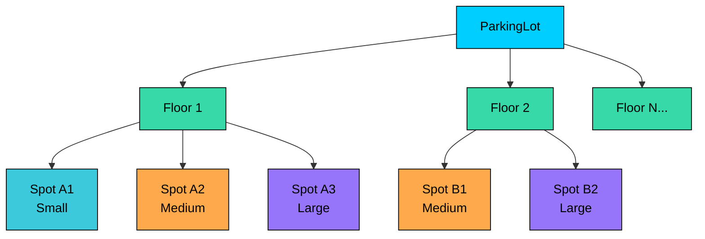

### 2.5 Tickets and Timing

> "Issue a parking ticket upon vehicle entry and track entry and exit times"

When a vehicle enters, we need to record when it arrived and which spot it got. When it leaves, we calculate how long it stayed. This gives us the `ParkingTicket` entity.

A ticket references the vehicle, the assigned spot, and timestamps for entry and exit. The ticket is the bridge between parking and payment.

### 2.6 Pricing Strategies

> "Calculate parking fees based on duration of stay with support for different pricing strategies"

Fee calculation could be **flat-rate**, **hourly**, or **vehicle-based**. Instead of hardcoding one approach, we use a `FeeStrategy` interface. Different implementations (FlatRateFeeStrategy, HourlyFeeStrategy, VehicleBasedFeeStrategy) handle different pricing models.

Similarly, for spot allocation, a `SpotAllocationStrategy` interface allows different approaches (nearest first, best fit, etc.).

### 2.7 Entity Overview

Here's how these entities relate to each other:

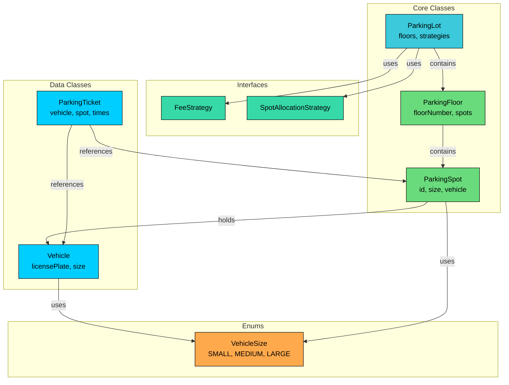

We've identified three types of entities:

**Enums** define fixed sets of values. They provide type safety and make code self-documenting.

**Data Classes** primarily hold data with minimal behavior. Vehicle and ParkingTicket are simple containers.

**Interfaces** define contracts for interchangeable behavior. FeeStrategy and SpotAllocationStrategy allow different implementations.

**Core Classes** contain the main logic. ParkingSpot manages individual spots, ParkingFloor groups spots, and ParkingLot ties everything together.

| Entity | Type | Responsibility |
|--------|------|----------------|
| `VehicleSize` | Enum | Vehicle/spot sizes: SMALL, MEDIUM, LARGE |
| `Vehicle` | Abstract Class | Base class with license plate and size |
| `Bike`, `Car`, `Truck` | Data Classes | Concrete vehicle types |
| `ParkingSpot` | Core Class | Manages individual spot state |
| `ParkingFloor` | Core Class | Groups spots by floor |
| `ParkingLot` | Core Class (Singleton) | Orchestrates entire system |
| `ParkingTicket` | Data Class | Tracks parking session |
| `FeeStrategy` | Interface | Contract for fee calculation |
| `SpotAllocationStrategy` | Interface | Contract for spot selection |

With our entities identified, let's define their attributes, behaviors, and relationships.

---

# 3. Designing Classes and Relationships

Once the core entities have been identified, the next step is to translate them into an organized class structure. This includes defining attributes and responsibilities for each class, identifying relationships among them, and applying relevant design patterns to ensure the system is clean, scalable, and extensible.

## 3.1 Class Definitions

We'll work bottom-up: simple types first, then data containers, then the classes with real logic. This order makes sense because complex classes depend on simpler ones.

### Enums

Enums define fixed sets of values that provide type safety and make code self-documenting. Using enums prevents invalid states at compile time rather than runtime.

#### `VehicleSize`

Represents the size category for vehicles and spots.

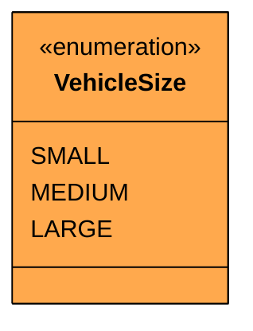

| Value | Vehicle Type | Compatible Spot Sizes |
|-------|--------------|----------------------|
| `SMALL` | Bike | Small, Medium, Large |
| `MEDIUM` | Car | Medium, Large |
| `LARGE` | Truck | Large only |

This single enum serves double duty: it describes both vehicle sizes and spot sizes. A SMALL vehicle fits in a SMALL spot. A MEDIUM vehicle fits in MEDIUM or LARGE spots. This creates a natural compatibility mapping.

> 💡 **Key Insight:**

> **Design Decision**
>
> We use a single enum rather than separate VehicleType and SpotSize enums because they share the same domain. Having one enum simplifies the compatibility check: a vehicle can park in a spot if the spot's size is greater than or equal to the vehicle's size.

### Custom Exception

Before we write classes that can fail, let's define how they fail. A custom exception makes error handling cleaner than catching generic `RuntimeException`.

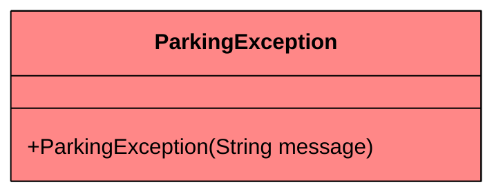

We'll throw this when someone tries to park a vehicle with no available spots, unpark a vehicle that isn't parked, or perform invalid operations.

### Data Classes

Data classes are simple containers that hold data with minimal behavior. They represent the "nouns" in our system that have attributes but little logic.

#### `Vehicle`

Base class for all vehicle types.

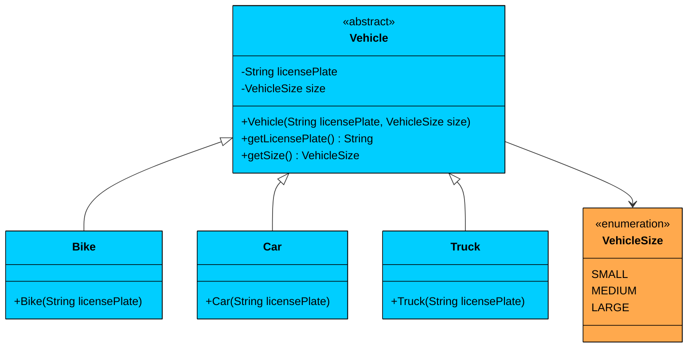

| Attribute | Type | Description | Mutable" |
|-----------|------|-------------|----------|
| `licensePlate` | String | Unique vehicle identifier | No |
| `size` | VehicleSize | Size category of the vehicle | No |

| Method | Description |
|--------|-------------|
| `Vehicle(licensePlate, size)` | Protected constructor for subclasses |
| `getLicensePlate()` | Returns the license plate |
| `getSize()` | Returns the vehicle's size |

The Vehicle class is **abstract** and **immutable**. Both fields are `final`. Subclasses (Bike, Car, Truck) call the parent constructor with their appropriate size. Bike passes `SMALL`, Car passes `MEDIUM`, Truck passes `LARGE`.

> 💡 **Key Insight:**

> **Why use inheritance here"**
>
> Because we might want to add vehicle-specific behavior later (like different rates for different vehicle types). The subclasses also make the code more readable: `new Car("ABC-123")` is clearer than `new Vehicle("ABC-123", VehicleSize.MEDIUM)`.

#### `ParkingTicket`

Captures all metadata related to a parking session. It is generated when a vehicle is parked and updated upon exit.

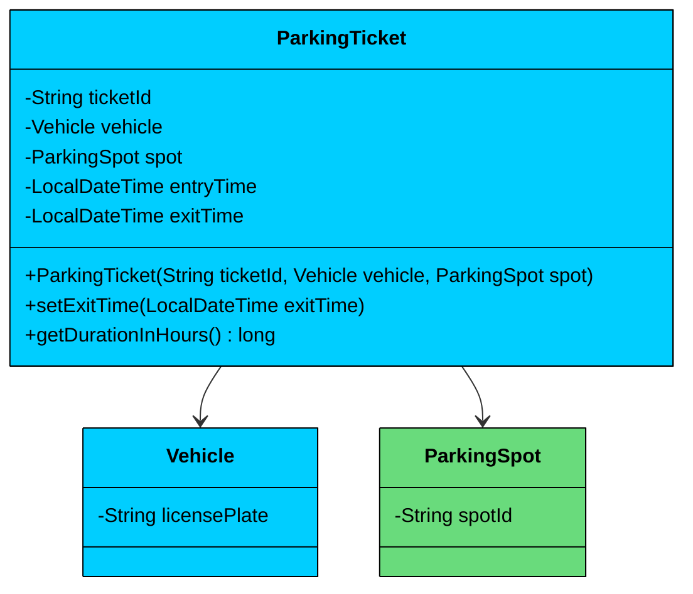

| Attribute | Type | Description | Mutable" |
|-----------|------|-------------|----------|
| `ticketId` | String | Unique ticket identifier | No |
| `vehicle` | Vehicle | The parked vehicle | No |
| `spot` | ParkingSpot | The assigned spot | No |
| `entryTime` | LocalDateTime | When the vehicle entered | No |
| `exitTime` | LocalDateTime | When the vehicle exited | Yes |

| Method | Description |
|--------|-------------|
| `ParkingTicket(id, vehicle, spot)` | Constructor, sets entryTime to now |
| `setExitTime(time)` | Records exit time |
| `getDurationInHours()` | Calculates parking duration |

The ticket is mostly immutable, created when a vehicle parks. Only `exitTime` is mutable, set when the vehicle leaves. The `getDurationInHours()` method calculates the time difference for fee calculation.

### Interfaces

Interfaces define contracts for interchangeable behavior. They enable the Strategy pattern.

#### `FeeStrategy`

Defines how parking fees are calculated.

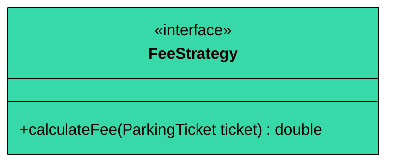

Different implementations can calculate fees differently: flat rate, hourly, vehicle-based, time-of-day, etc. The ParkingLot uses this interface, so it doesn't care which strategy is active.

#### `SpotAllocationStrategy`

Defines how spots are selected.

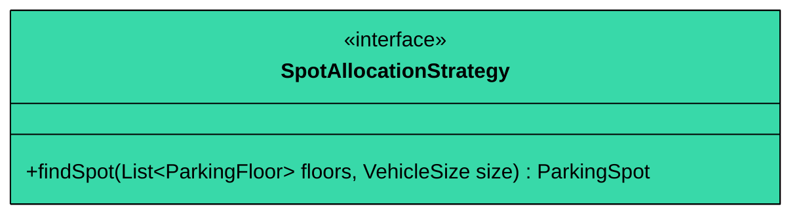

Different implementations can use different allocation algorithms: nearest first, best fit, distribute evenly, etc. This keeps allocation logic separate from the core parking lot logic.

### Core Classes

These classes form the heart of the system and handle core logic, coordination, and data flow.

#### `ParkingSpot`

Represents an individual physical space that can hold a vehicle.

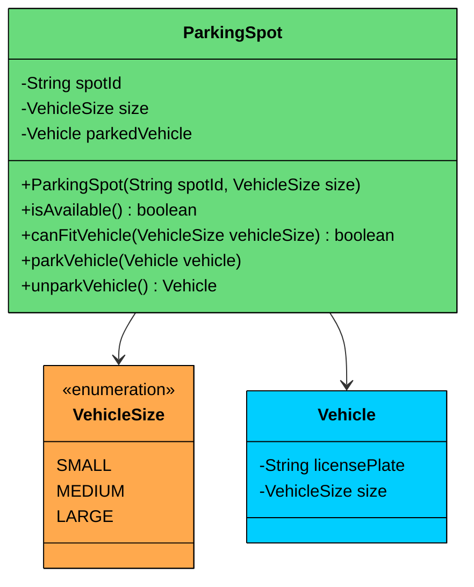

| Attribute | Type | Description |
|-----------|------|-------------|
| `spotId` | String | Unique identifier (e.g., "F1-S001") |
| `size` | VehicleSize | What size vehicles this spot accepts |
| `parkedVehicle` | Vehicle | Currently parked vehicle, null if empty |

| Method | Description |
|--------|-------------|
| `ParkingSpot(id, size)` | Constructor |
| `isAvailable()` | Returns true if no vehicle is parked |
| `canFitVehicle(size)` | Returns true if spot can accommodate the size |
| `parkVehicle(vehicle)` | Parks vehicle, throws if occupied or incompatible |
| `unparkVehicle()` | Removes and returns parked vehicle |

**Key Design Principles:**

1. **Encapsulation:** The spot manages its own state. External code can't directly set `parkedVehicle`. it must go through `parkVehicle()` which validates the operation.
2. **Compatibility Logic:** The `canFitVehicle()` method encapsulates the size compatibility rules. A spot can fit a vehicle if the vehicle's size ordinal is less than or equal to the spot's size ordinal.
3. **Thread Safety:** The `parkVehicle()` and `unparkVehicle()` methods are `synchronized` to prevent race conditions when multiple threads try to park in the same spot.

#### `ParkingFloor`

Manages all the spots on a single level of the parking lot.

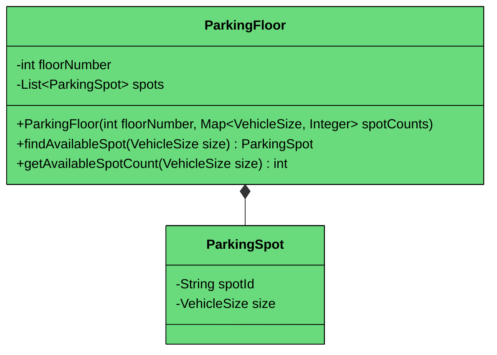

| Attribute | Type | Description |
|-----------|------|-------------|
| `floorNumber` | int | Floor identifier (1, 2, 3...) |
| `spots` | List\<ParkingSpot\> | All spots on this floor |

| Method | Description |
|--------|-------------|
| `ParkingFloor(number, spotCounts)` | Constructor, creates spots based on count map |
| `findAvailableSpot(size)` | Finds first available compatible spot |
| `getAvailableSpotCount(size)` | Counts available spots for a size |

**Key Design Principles:**

1. **Composition:** The floor *owns* its spots. When you create a floor, it creates the spots. The spots don't exist outside the floor context.
2. **Flexible Configuration:** The constructor takes a map of size to count, allowing different floor configurations. Floor 1 might have 10 small, 20 medium, 5 large. Floor 2 might have different counts.
3. **Spot ID Generation:** Spots get IDs like "F1-S001", "F1-M002" combining floor number, size prefix, and sequence number.

#### `ParkingLot`

The top-level orchestrator class that represents the entire facility. It acts as a Facade for the client.

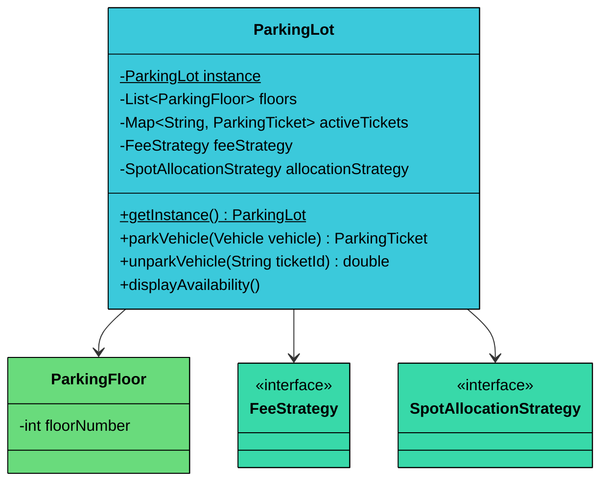

| Attribute | Type | Description |
|-----------|------|-------------|
| `instance` | ParkingLot (static) | Singleton instance |
| `lock` | Object (static) | Lock for thread-safe initialization |
| `floors` | List\<ParkingFloor\> | All floors in the lot |
| `activeTickets` | ConcurrentHashMap | Maps ticket IDs to active tickets |
| `feeStrategy` | FeeStrategy | Current pricing strategy |
| `allocationStrategy` | SpotAllocationStrategy | Current spot selection strategy |

| Method | Description |
|--------|-------------|
| `getInstance()` | Returns singleton instance |
| `initialize(floors, feeStrategy, allocationStrategy)` | Sets up the parking lot |
| `parkVehicle(vehicle)` | Parks vehicle, returns ticket |
| `unparkVehicle(ticketId)` | Unparks vehicle, returns fee |
| `displayAvailability()` | Shows available spots per floor |

**Key Design Principles:**

1. **Singleton Pattern:** Ensures only one ParkingLot exists. Uses double-checked locking with `volatile` for thread-safe lazy initialization.
2. **Strategy Pattern:** Both fee calculation and spot allocation are delegated to strategies. The lot doesn't know HOW fees are calculated or HOW spots are chosen, just that it needs to calculate fees and choose spots.
3. **Thread Safety:** Uses `ConcurrentHashMap` for active tickets. The `parkVehicle()` method handles the race condition where two threads might try to park in the same spot.
4. **Facade Pattern:** External code only interacts with ParkingLot. It doesn't need to know about floors, spots, or strategies directly.

## 3.2 Class Relationships

How do these classes connect" There are three types of relationships we use.

#### Composition (Strong Ownership)

Composition means one object owns another. When the owner is destroyed, the owned object is destroyed too.

- **ParkingFloor owns ParkingSpots:** When you create a floor, it creates its spots. Those spots don't exist outside the floor.
- **ParkingLot owns ParkingFloors:** The lot creates and manages all floors.

#### Association (Weak Reference)

Association means one object uses another, but doesn't own it. Both objects have independent lifecycles.

- **ParkingSpot references Vehicle:** A spot holds a vehicle reference while it's parked, but the vehicle exists independently.
- **ParkingTicket references Vehicle and ParkingSpot:** The ticket points to both but doesn't own them.
- **ParkingLot uses Strategies:** The lot uses strategy implementations but doesn't own them. Strategies could be shared.

#### Implementation (Interface Contract)

Implementation means a class fulfills an interface contract.

- **HourlyFeeStrategy, FlatRateFeeStrategy implement FeeStrategy:** All can calculate fees, but each uses a different formula.
- **NearestFirstStrategy, BestFitStrategy implement SpotAllocationStrategy:** All can find spots, but each uses different criteria.

## 3.3 Key Design Patterns

You might notice some structural patterns emerging in our design. Let's make them explicit and justify why each pattern is appropriate here.

### [Strategy Pattern](/learn/lld/strategy) (Fee Calculation)

**The Problem:** Parking fees can be calculated in many ways: flat rate, hourly, vehicle-based, time-of-day based, weekend rates, etc. If we hardcode one approach, changing the pricing model requires modifying the ParkingLot class. Every new pricing model means more if-else statements.

**The Solution:** The Strategy pattern encapsulates each fee calculation algorithm in its own class. The ParkingLot holds a FeeStrategy reference and delegates fee calculation to it.

**Why This Pattern:** We could use a switch statement on a "pricing type" enum. However, the Strategy pattern gives us:

- **Testability:** Each strategy can be unit tested in isolation
- **Runtime Flexibility:** We can change pricing strategies without restarting the system
- **Single Responsibility:** Each strategy handles exactly one pricing model
- **Open/Closed:** Adding new pricing models means adding new classes, not modifying existing code

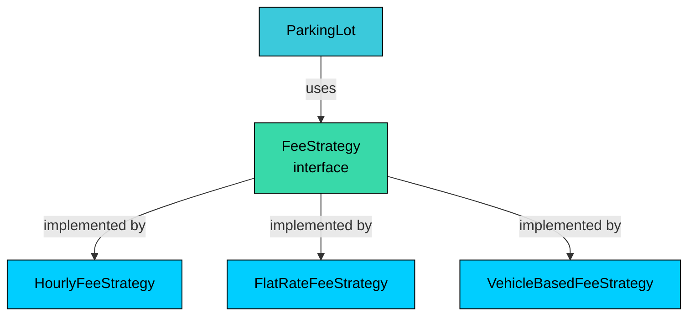

> 💡 **Key Insight:**

> **Design Decision**
>
> We use an interface rather than an abstract class because strategies have no shared state or default behavior. Each implementation is completely independent.

### Strategy Pattern (Spot Allocation)

**The Problem:** How do you choose which spot to assign" The nearest available spot" The smallest spot that fits" Distribute evenly across floors" Each approach has trade-offs, and different parking lots might prefer different strategies.

**The Solution:** Same as fee calculation, we encapsulate spot selection in SpotAllocationStrategy implementations.

**Why This Pattern:** Spot allocation is even more complex than fee calculation because it involves searching across multiple floors. Keeping this logic in a separate strategy class prevents the ParkingLot from becoming bloated with search algorithms.

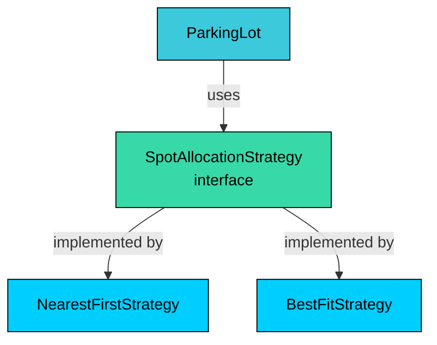

NearestFirstStrategy finds the first available spot on the lowest floor number. BestFitStrategy finds the smallest spot that fits the vehicle. For a car (MEDIUM), BestFit would prefer a MEDIUM spot over a LARGE spot, saving large spots for trucks.

### [Singleton Pattern](/learn/lld/singleton) (ParkingLot)

**The Problem:** We need a single, globally accessible parking lot that maintains consistent state across all operations. Multiple ParkingLot instances would create chaos. which one has the real ticket data"

**The Solution:** The Singleton pattern ensures only one ParkingLot instance exists. It provides a global access point via `getInstance()`.

**Why This Pattern:** Singleton is often overused, but it's appropriate here because:

- We genuinely need one parking lot with consistent state
- The lot acts as a facade for the entire system
- It simplifies client code (no need to pass lot references around)

```java
public static ParkingLot getInstance() {
    if (instance == null) {
        synchronized (lock) {
            if (instance == null) {
                instance = new ParkingLot();
            }
        }
    }
    return instance;
}
```

We use double-checked locking with a volatile instance for thread safety. This is necessary because multiple threads (representing different entry/exit lanes) might access the lot concurrently.

> 💡 **Key Insight:**

> **Interview Insight**
>
> Interviewers often follow up on Singleton with "what are the downsides"" 
>
> Be ready to discuss: difficulty in unit testing (hard to mock), hidden dependencies, and global state issues. Mention that dependency injection is often preferred, but Singleton is appropriate when you genuinely need a single instance and DI isn't available

## 3.4 Full Class Diagram

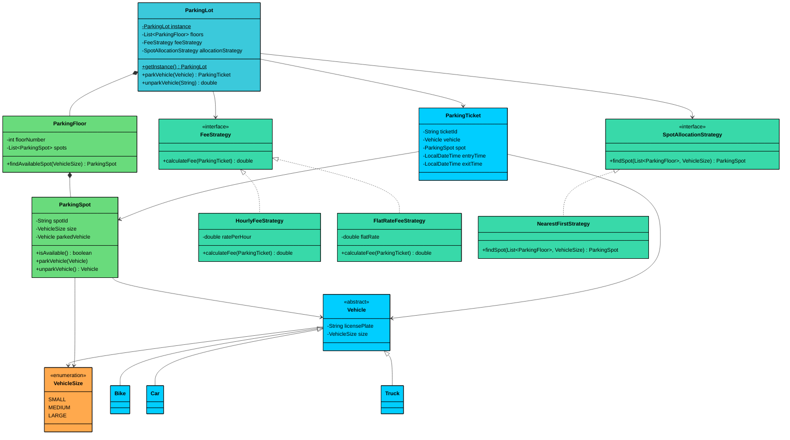

---

# 4. Code Implementation

Now let's translate our design into working code. We'll build bottom-up: foundational types first, then data classes, then the classes with real logic. This order matters because each layer depends on the ones below it.

#### Java

## 4.1 Enum

We start with the enum that other classes depend on.

```java
public enum VehicleSize {
    SMALL,   // For bikes
    MEDIUM,  // For cars
    LARGE    // For trucks
}
```

The ordinal values (0, 1, 2) create a natural ordering that we use for compatibility checks. A SMALL vehicle (ordinal 0) fits in any spot. A LARGE vehicle (ordinal 2) only fits in LARGE spots.

## 4.2 Custom Exception

Before we write classes that can fail, let's define how they fail. A custom exception makes error handling cleaner than catching generic `RuntimeException`.

```java
public class ParkingException extends RuntimeException {
    public ParkingException(String message) {
        super(message);
    }
}
```

We'll throw this when someone tries to park with no available spots, unpark a vehicle that isn't parked, or perform invalid operations.

## 4.3 Vehicle Classes

The base class and its subclasses are simple but demonstrate proper inheritance.

```java
public abstract class Vehicle {
    private final String licensePlate;
    private final VehicleSize size;

    protected Vehicle(String licensePlate, VehicleSize size) {
        if (licensePlate == null || licensePlate.trim().isEmpty()) {
            throw new IllegalArgumentException("License plate cannot be null or empty");
        }
        this.licensePlate = licensePlate;
        this.size = size;
    }

    public String getLicensePlate() {
        return licensePlate;
    }

    public VehicleSize getSize() {
        return size;
    }

    @Override
    public String toString() {
        return getClass().getSimpleName() + "[" + licensePlate + "]";
    }
}
```

Notice the constructor validation. A vehicle without a license plate makes no sense, so we reject it immediately. The class is abstract, so it can't be instantiated directly.

Now the concrete subclasses:

```java
public class Bike extends Vehicle {
    public Bike(String licensePlate) {
        super(licensePlate, VehicleSize.SMALL);
    }
}
```

```java
public class Car extends Vehicle {
    public Car(String licensePlate) {
        super(licensePlate, VehicleSize.MEDIUM);
    }
}
```

```java
public class Truck extends Vehicle {
    public Truck(String licensePlate) {
        super(licensePlate, VehicleSize.LARGE);
    }
}
```

Each subclass just calls the parent constructor with its appropriate size. The `toString()` method from the parent class automatically uses `getClass().getSimpleName()`, so `new Car("ABC-123").toString()` returns "Car[ABC-123]".

## 4.4 ParkingTicket

The ticket records a parking session with timestamps.

```java
$129
```

The ticket is mostly immutable. Only `exitTime` is mutable, set when the vehicle leaves. The `getDurationInHours()` method returns at least 1, ensuring a minimum charge even for very short stays.

## 4.5 Interfaces

Now we define the contracts that our strategy classes will implement.

```java
public interface FeeStrategy {
    double calculateFee(ParkingTicket ticket);
}
```

```java
import java.util.List;

public interface SpotAllocationStrategy {
    ParkingSpot findSpot(List<ParkingFloor> floors, VehicleSize size);
}
```

These interfaces are minimal. Each takes exactly what it needs and returns exactly what's required. No extra methods, no default implementations.

## 4.6 Strategy Implementations

Each strategy encapsulates one algorithm. Let's implement the fee strategies first.

**HourlyFeeStrategy** charges based on duration.

```java
public class HourlyFeeStrategy implements FeeStrategy {
    private final double ratePerHour;

    public HourlyFeeStrategy(double ratePerHour) {
        this.ratePerHour = ratePerHour;
    }

    @Override
    public double calculateFee(ParkingTicket ticket) {
        return ticket.getDurationInHours() * ratePerHour;
    }
}
```

**FlatRateFeeStrategy** charges a fixed amount regardless of duration.

```java
public class FlatRateFeeStrategy implements FeeStrategy {
    private final double flatRate;

    public FlatRateFeeStrategy(double flatRate) {
        this.flatRate = flatRate;
    }

    @Override
    public double calculateFee(ParkingTicket ticket) {
        return flatRate;
    }
}
```

**VehicleBasedFeeStrategy** charges different rates based on vehicle size.

```java
import java.util.Map;

public class VehicleBasedFeeStrategy implements FeeStrategy {
    private final Map<VehicleSize, Double> ratesPerHour;

    public VehicleBasedFeeStrategy(Map<VehicleSize, Double> ratesPerHour) {
        this.ratesPerHour = ratesPerHour;
    }

    @Override
    public double calculateFee(ParkingTicket ticket) {
        VehicleSize size = ticket.getVehicle().getSize();
        double rate = ratesPerHour.getOrDefault(size, 0.0);
        return ticket.getDurationInHours() * rate;
    }
}
```

Now the spot allocation strategies:

**NearestFirstStrategy** finds the first available spot, preferring lower floors.

```java
import java.util.List;

public class NearestFirstStrategy implements SpotAllocationStrategy {
    @Override
    public ParkingSpot findSpot(List<ParkingFloor> floors, VehicleSize size) {
        for (ParkingFloor floor : floors) {
            ParkingSpot spot = floor.findAvailableSpot(size);
            if (spot != null) {
                return spot;
            }
        }
        return null;
    }
}
```

**BestFitStrategy** finds the smallest spot that fits, saving larger spots for larger vehicles.

```java
import java.util.List;

public class BestFitStrategy implements SpotAllocationStrategy {
    @Override
    public ParkingSpot findSpot(List<ParkingFloor> floors, VehicleSize size) {
        // Try to find exact size match first
        for (ParkingFloor floor : floors) {
            for (ParkingSpot spot : floor.getSpots()) {
                if (spot.isAvailable() && spot.getSize() == size) {
                    return spot;
                }
            }
        }

        // If no exact match, find smallest spot that fits
        for (VehicleSize spotSize : VehicleSize.values()) {
            if (spotSize.ordinal() < size.ordinal()) {
                continue;  // Spot too small
            }
            for (ParkingFloor floor : floors) {
                for (ParkingSpot spot : floor.getSpots()) {
                    if (spot.isAvailable() && spot.getSize() == spotSize) {
                        return spot;
                    }
                }
            }
        }
        return null;
    }
}
```

The BestFit strategy first tries to find a spot that exactly matches the vehicle size. If none is available, it looks for progressively larger spots. This helps preserve large spots for trucks.

## 4.7 ParkingSpot

The spot manages its own state with thread-safe methods.

```java
$12a
```

The `synchronized` keyword on `parkVehicle()` and `unparkVehicle()` prevents race conditions. If two threads try to park in the same spot, only one will succeed.

The `canFitVehicle()` method uses ordinal comparison. SMALL (0) fits in SMALL (0), MEDIUM (1), or LARGE (2). MEDIUM (1) fits in MEDIUM (1) or LARGE (2). LARGE (2) fits only in LARGE (2).

The `synchronized` methods on ParkingSpot prevent race conditions at the spot level, but there's still a TOCTOU (time-of-check-to-time-of-use) race between `isAvailable()` and `parkVehicle()`. In the full implementation, we handle this by catching the exception if someone else parked first.

## 4.8 ParkingFloor

The floor groups spots and provides search functionality.

```java
$12b
```

The floor generates spot IDs like "F1-S001" (Floor 1, Small spot, #001). The `getSpots()` method returns an unmodifiable list to prevent external code from adding or removing spots directly.

## 4.9 ParkingLot (Singleton)

The main class that ties everything together.

```java
$12c
```

**Key Implementation Details:**

1. **Thread-Safe Singleton:** Double-checked locking with `volatile` ensures only one instance is created even with concurrent access.
2. **ConcurrentHashMap:** Active tickets are stored in a thread-safe map, allowing concurrent park/unpark operations.
3. **Strategy Delegation:** Fee calculation and spot allocation are delegated to strategies. The lot doesn't know HOW these operations work, just that it needs them.
4. **Failure Handling:** If no spot is available, we throw a meaningful exception rather than returning null.
5. **Race Condition Handling:** There's a race between `findSpot()` and `parkVehicle()`. If two threads find the same spot, only one will succeed (due to synchronized `parkVehicle()` on ParkingSpot). The other will get a `ParkingException`. In production, you'd wrap this in a retry loop to find another spot.

### Park Vehicle Sequence Diagram

The following diagram illustrates what happens when a vehicle is parked:

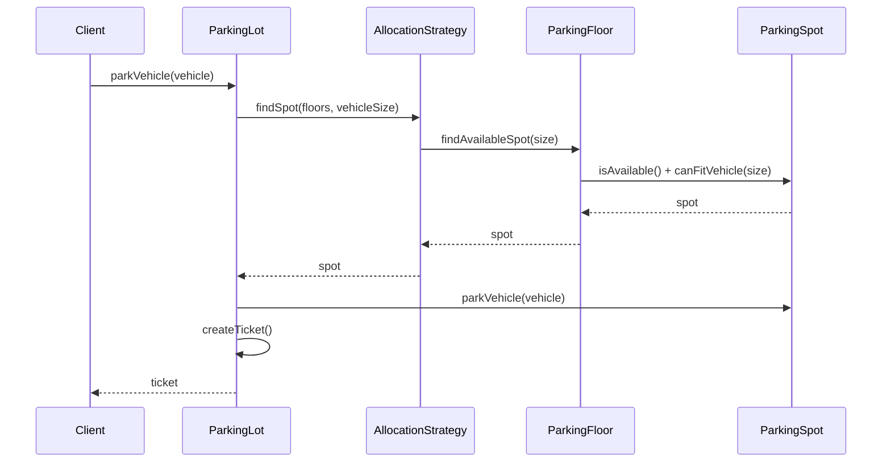

---

# 5. Run and Test

---

# 6. Quiz
