> 💡 **Key Insight:**

> **QUESTION**
>
> #### What is a Task Management System"
>
> A **task management system** is a software tool that helps individuals and teams **plan**, **organize**, **assign**, and **track** tasks in an efficient and structured manner. It plays a key role in improving productivity, accountability, and collaboration especially in fast-paced, team-driven environments.
>
> 
> <!-- Simulation: task-management -->
> 

>
> Popular tools like **Trello**, **Asana**, and **ClickUp** are examples of task management platforms designed to streamline workflows and improve team efficiency.

In this chapter, we will explore the **low-level design of a task management system** in detail.

Lets start by clarifying the requirements:

---

# 1. Clarifying Requirements

Before starting the design, it's important to ask thoughtful questions to uncover hidden assumptions, clarify ambiguities, and define the system's scope more precisely.

Here is an example of how a discussion between the candidate and the interviewer might unfold:

> 💡 **Key Insight:**

> **DISCUSSION**
>
> **Candidate:** Should tasks support hierarchical structures, like subtasks within parent tasks"
>
> **Interviewer:** Yes, tasks should be able to have subtasks. A parent task can only be marked complete when all its subtasks are done.
>
> **Candidate:** What states can a task be in" Just open and closed, or something more detailed"
>
> **Interviewer:** Tasks should have four states: TODO, IN_PROGRESS, DONE, and BLOCKED. There should be rules about which transitions are valid.
>
> **Candidate:** Should we track task history" For example, when status changed or who it was assigned to previously"
>
> **Interviewer:** Yes, we need an activity log that records key events like creation, status changes, and assignment changes.
>
> **Candidate:** How should users find tasks" Do we need full-text search or just filtering"
>
> **Interviewer:** Simple filtering is fine. Users should be able to filter by status, priority, and assignee.
>
> **Candidate:** Should tasks have due dates and priorities"
>
> **Interviewer:** Yes, tasks should have optional due dates and a priority level: LOW, MEDIUM, HIGH, or CRITICAL.
>
> **Candidate:** Can tasks be organized into lists or projects"
>
> **Interviewer:** Yes, tasks belong to task lists. Users can have multiple task lists.
>
> **Candidate:** How should I handle input" Console interface or hardcoded demo"
>
> **Interviewer:** To keep things focused on design, you can hardcode a demo sequence showing the key features.

After gathering the details, we can summarize the key system requirements.

## 1.1 Functional Requirements

- Users can create, update, and delete tasks
- Tasks have a title, description, due date, priority, and status
- Tasks can have subtasks; parent tasks complete only when all subtasks are done
- Tasks can be assigned to users
- Tasks support tags for categorization
- Tasks can have comments
- The system should track activity history (creation, status changes, assignment changes)
- Users can filter tasks by status, priority, and assignee
- Tasks belong to task lists

## 1.2 Non-Functional Requirements

- The design should follow object-oriented principles with clear separation of concerns
- The system should be modular and extensible to support future features
- The code should be thread-safe for concurrent access
- The components should be testable in isolation

Now that we understand what we're building, let's identify the building blocks of our system.

---

# 2. Identifying Core Entities

> [!PAYWALL] This content is for premium members only.

How do you go from a list of requirements to actual classes" The key is to look for **nouns** in the requirements that have distinct attributes or behaviors. Not every noun becomes a class, but this approach gives you a starting point.

Let's walk through our requirements and identify what needs to exist in our system.

### 2.1 The Task

> "Tasks have a title, description, due date, priority, and status"

The task is the central entity. Everything revolves around it. This gives us our first and most important entity: `Task`.

A task has many attributes: title, description, due date, priority, status, assignee, tags, comments, and potentially subtasks. This complexity suggests we might need the Builder pattern later since constructing a Task with all optional fields would lead to telescoping constructors.

### 2.2 Task States

> "Tasks should have four states: TODO, IN_PROGRESS, DONE, and BLOCKED"

We need to represent these states. An enum `TaskStatus` with values `TODO`, `IN_PROGRESS`, `DONE`, `BLOCKED` gives us type safety.

But wait, there are also transition rules. You can't go directly from TODO to DONE. You can't mark a parent task DONE if subtasks aren't complete. This behavior suggests the State pattern, where each state is a class that controls its own transitions.

### 2.3 Priority Levels

> "Priority level: LOW, MEDIUM, HIGH, or CRITICAL"

Another fixed set of values. An enum `TaskPriority` with four levels. This is simpler than status since there are no transition rules, just a simple value.

### 2.4 Users and Assignment

> "Tasks can be assigned to users"

Someone creates tasks and someone gets assigned to them. We need a `User` entity with basic information like ID, name, and email.

### 2.5 Categorization and Comments

> "Tasks support tags for categorization" and "Tasks can have comments"

Tags are simple labels. We could use strings, but a `Tag` class gives us room to add metadata later (like color or description).

Comments need more structure: who wrote it, when, what they said. A `Comment` class captures this.

### 2.6 Activity Tracking

> "Track activity history (creation, status changes, assignment changes)"

Every significant action needs to be recorded. An `ActivityLog` entity captures what happened, when, and who did it. This is where the Observer pattern comes in since tasks notify observers when state changes.

### 2.7 Organization

> "Tasks belong to task lists"

Tasks need containers. A `TaskList` holds related tasks and provides filtering and sorting operations.

For the system entry point, we need `TaskManagementSystem` as a facade that ties everything together.

### 2.8 Entity Overview

We've identified three types of entities:

**Enums** define fixed sets of values. They provide type safety and make code self-documenting.

**Data Classes** primarily hold data with minimal behavior. User, Tag, Comment, and ActivityLog are containers for information.

**Core Classes** contain the main logic. Task manages its own state and subtasks, TaskList provides organization and filtering, and TaskManagementSystem ties everything together.

| Entity | Type | Responsibility |
|--------|------|----------------|
| `TaskStatus` | Enum | Task states: TODO, IN_PROGRESS, DONE, BLOCKED |
| `TaskPriority` | Enum | Priority levels: LOW, MEDIUM, HIGH, CRITICAL |
| `User` | Data Class | Holds user information (id, name, email) |
| `Tag` | Data Class | Category label for tasks |
| `Comment` | Data Class | User comment on a task |
| `ActivityLog` | Data Class | Record of task activity |
| `Task` | Core Class | Central entity with state management and subtasks |
| `TaskList` | Core Class | Container for tasks with filtering/sorting |
| `TaskManagementSystem` | Core Class | Facade for the entire system |

With our entities identified, let's define their attributes, behaviors, and relationships.

---

# 3. Designing Classes and Relationships

Now that we know what entities we need, let's flesh out their details. For each class, we'll define what data it holds (attributes) and what it can do (methods). Then we'll look at how these classes connect to each other.

## 3.1 Class Definitions

We'll work bottom-up: simple types first, then data containers, then the classes with real logic. This order makes sense because complex classes depend on simpler ones.

### Enums

Enums define fixed sets of values that provide type safety and make code self-documenting.

#### `TaskStatus`

Represents the lifecycle states of a task.

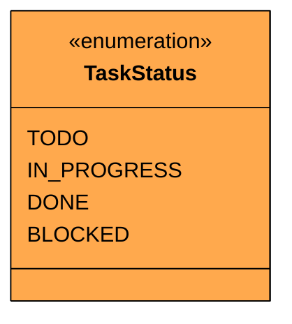

| Value | Description | Can Transition To |
|-------|-------------|-------------------|
| `TODO` | Task not yet started | IN_PROGRESS, BLOCKED |
| `IN_PROGRESS` | Task is being worked on | TODO, DONE, BLOCKED |
| `DONE` | Task is complete | (terminal state) |
| `BLOCKED` | Task is blocked by external factors | TODO, IN_PROGRESS |

> 💡 **Key Insight:**

> **Design Decision**
>
> We use separate state classes (State pattern) rather than just this enum because transitions have rules. For example, you can't mark a parent task DONE if subtasks aren't complete. The enum defines valid states; the State classes implement transition logic.

#### `TaskPriority`

Indicates task urgency level.

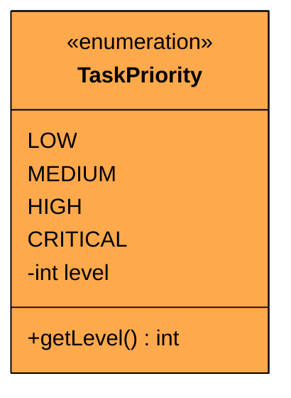

| Value | Level | Description |
|-------|-------|-------------|
| `LOW` | 1 | Can be done when time permits |
| `MEDIUM` | 2 | Should be done soon |
| `HIGH` | 3 | Important, do this week |
| `CRITICAL` | 4 | Drop everything and do this |

Each priority maps to a numeric level for sorting. CRITICAL (4) is higher than LOW (1). Unlike status, priority has no transition rules. It's just a simple value that can be changed freely.

### Data Classes

Data classes are simple containers that hold data with minimal behavior.

#### `User`

Represents an user in the system.

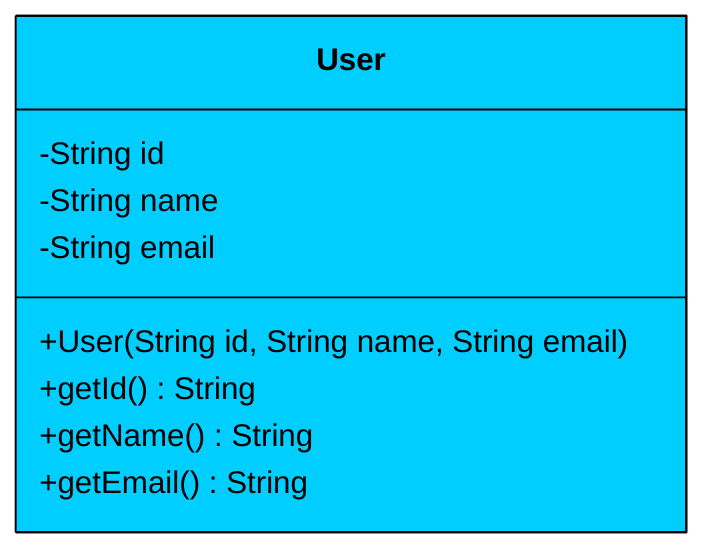

| Attribute | Type | Description | Mutable" |
|-----------|------|-------------|----------|
| `id` | String | Unique identifier | No |
| `name` | String | Display name | No |
| `email` | String | Contact email | No |

| Method | Description |
|--------|-------------|
| `User(id, name, email)` | Constructor |
| `getId()` | Returns unique identifier |
| `getName()` | Returns display name |
| `getEmail()` | Returns contact email |

The User class is **immutable**. All fields are `final`, so once created, user details don't change within the task system. If you need to update user info, create a new User object. We override `equals` and `hashCode` based on ID so users can be compared and used in collections properly.

#### `Tag`

A simple wrapper for a string that categorizes tasks (e.g., "feature", "bug"). Tags are reusable across multiple tasks.

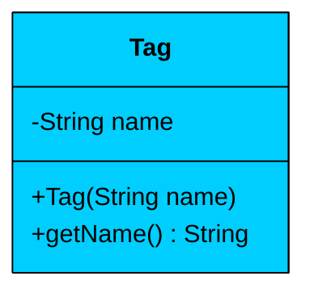

| Attribute | Type | Description | Mutable" |
|-----------|------|-------------|----------|
| `name` | String | Tag label (e.g., "bug", "feature") | No |

| Method | Description |
|--------|-------------|
| `Tag(name)` | Constructor, normalizes to lowercase |
| `getName()` | Returns the tag name |
| `toString()` | Returns "#name" format |

Tags are simple labels normalized to lowercase to avoid duplicates like "Bug" vs "bug". We use a class instead of plain strings to allow future extensions like color or description.

#### `Comment`

Stores a piece of text content, the `User` who authored it, and a timestamp.

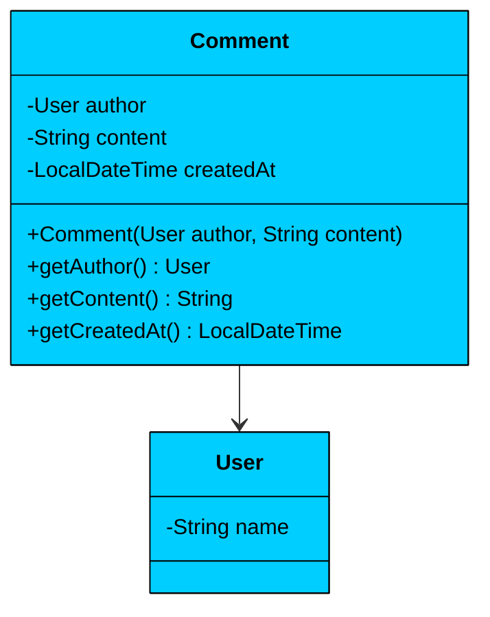

| Attribute | Type | Description | Mutable" |
|-----------|------|-------------|----------|
| `author` | User | Who wrote the comment | No |
| `content` | String | The comment text | No |
| `createdAt` | LocalDateTime | When it was written | No |

| Method | Description |
|--------|-------------|
| `Comment(author, content)` | Constructor, sets createdAt to now |
| `getAuthor()` | Returns the comment author |
| `getContent()` | Returns the comment text |
| `getCreatedAt()` | Returns the creation timestamp |
| `toString()` | Returns "[Author]: Content" format |

Comments are **immutable**. Once posted, they don't change. The timestamp is captured automatically at creation. This simplifies the activity log since we don't need to track comment edits.

#### `ActivityLog`

Records a single change made to a task with a description and a timestamp, creating an immutable audit trail.

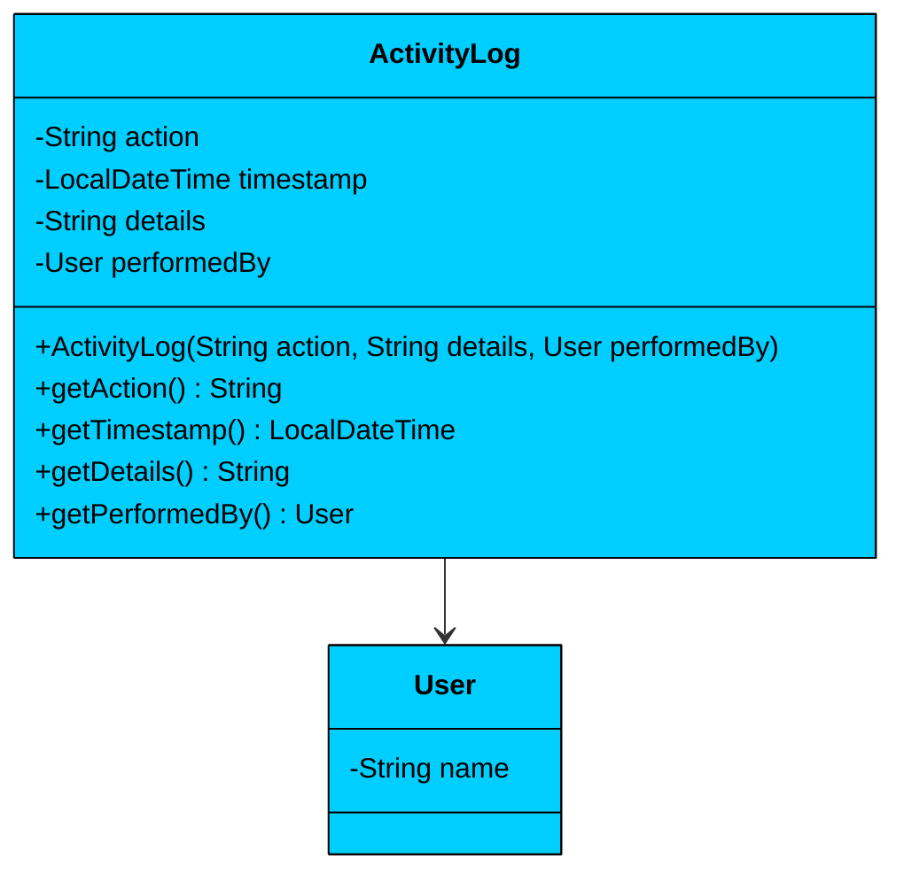

| Attribute | Type | Description | Mutable" |
|-----------|------|-------------|----------|
| `action` | String | What happened (e.g., "STATUS_CHANGED") | No |
| `timestamp` | LocalDateTime | When it happened | No |
| `details` | String | Additional context | No |
| `performedBy` | User | Who did it | No |

| Method | Description |
|--------|-------------|
| `ActivityLog(action, details, performedBy)` | Constructor, sets timestamp to now |
| `getAction()` | Returns the action type |
| `getTimestamp()` | Returns when it happened |
| `getDetails()` | Returns additional context |
| `getPerformedBy()` | Returns who performed the action |

The activity log is the audit trail. Every significant action on a task creates an ActivityLog entry. The timestamp is captured automatically at creation.

### Interfaces

Before defining core classes, let's establish the contracts they'll implement.

#### `TaskState`

Defines the State pattern interface.

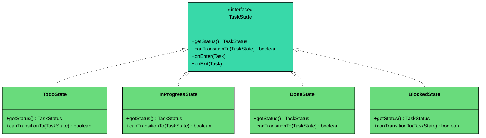

| Method | Description |
|--------|-------------|
| `getStatus()` | Returns the TaskStatus enum value |
| `canTransitionTo(TaskState)` | Checks if transition is valid |
| `onEnter(Task)` | Called when entering this state |
| `onExit(Task)` | Called when leaving this state |

Each state implementation controls its own transition rules. This keeps transition logic organized and testable. The Task delegates state-related behavior to its current state object.

#### `TaskSortStrategy`

Defines the Strategy pattern interface for sorting.

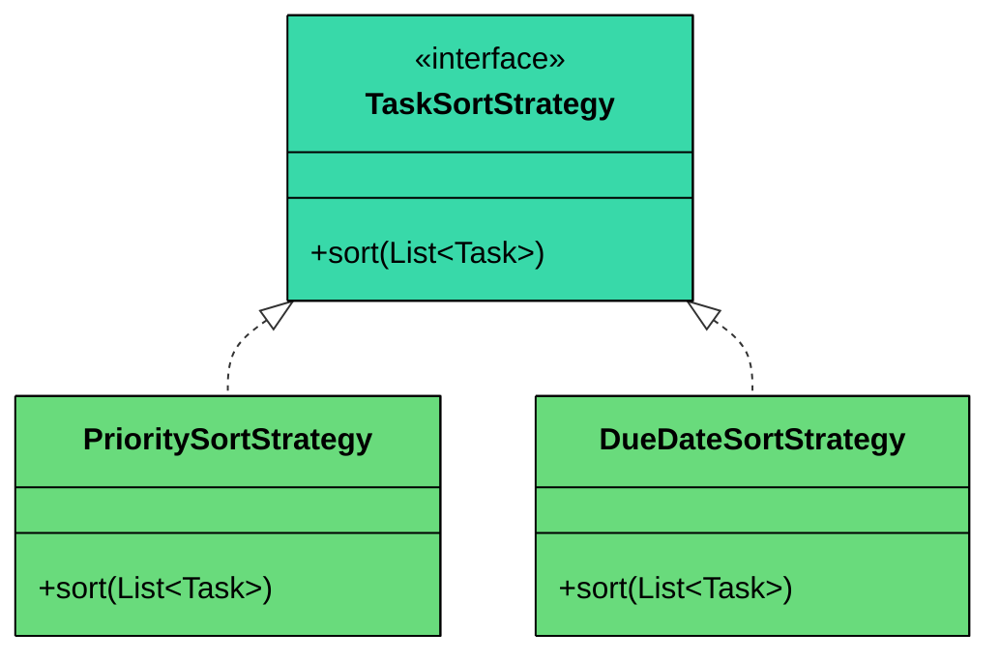

| Method | Description |
|--------|-------------|
| `sort(List<Task>)` | Sorts the task list in place |

Different implementations sort by priority, due date, creation date, etc. The TaskList doesn't know how sorting works; it just uses whatever strategy is provided.

#### `TaskObserver`

Defines the Observer pattern interface.

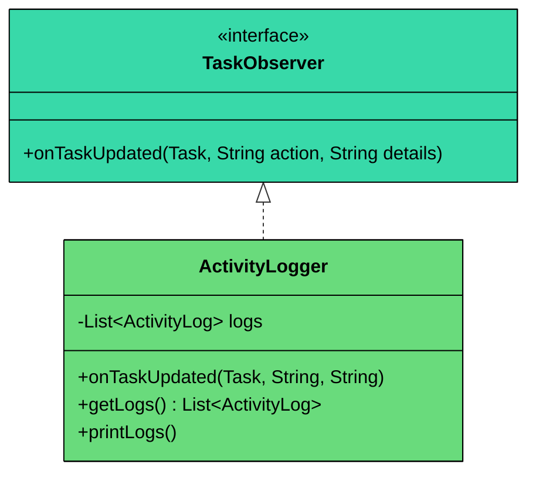

| Method | Description |
|--------|-------------|
| `onTaskUpdated(Task, String action, String details)` | Called when task changes |

The Task notifies observers when significant events occur. The ActivityLogger is the primary observer, but we could add email notifications, webhook triggers, etc. The Observer pattern allows adding new listeners without modifying the Task class.

### Core Classes

Core classes contain the actual business logic.

#### `Task`

The central entity of the system. It aggregates all relevant information like title, description, due date, priority, assignee, comments, and subtasks. It also manages its own state transitions and notifies observers of changes.

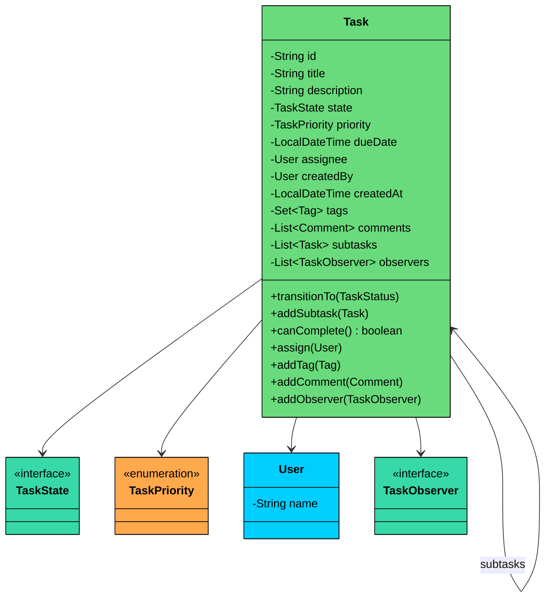

| Attribute | Type | Description | Mutable" |
|-----------|------|-------------|----------|
| `id` | String | Unique identifier | No |
| `title` | String | Task name | No |
| `description` | String | Detailed description | Yes |
| `state` | TaskState | Current state (State pattern) | Yes |
| `priority` | TaskPriority | Urgency level | Yes |
| `dueDate` | LocalDateTime | When task is due | Yes |
| `assignee` | User | Who's responsible | Yes |
| `createdBy` | User | Who created it | No |
| `createdAt` | LocalDateTime | Creation timestamp | No |
| `tags` | Set\<Tag\> | Categories | Additive |
| `comments` | List\<Comment\> | User comments | Additive |
| `subtasks` | List\<Task\> | Child tasks | Additive |
| `observers` | List\<TaskObserver\> | Event listeners | Additive |

| Method | Description |
|--------|-------------|
| `builder(title, createdBy)` | Static: returns a new Builder |
| `transitionTo(TaskStatus)` | Change state with validation |
| `addSubtask(Task)` | Add a child task |
| `canComplete()` | Check if all subtasks are done |
| `assign(User)` | Assign to a user, notifies observers |
| `addTag(Tag)` | Add categorization |
| `addComment(Comment)` | Add user feedback, notifies observers |
| `addObserver(TaskObserver)` | Register event listener |
| `notifyObservers(action, details)` | Notify all observers of changes |

**Key Design Principles:**

1. **Builder Pattern:** Task has many optional fields (description, dueDate, assignee, etc.). Instead of telescoping constructors or a constructor with 10 parameters, we use the Builder pattern. `Task.Builder` provides a fluent API for construction.
2. **State Pattern:** The task delegates state-related behavior to its current TaskState object. Each state controls its own transitions.
3. **Observer Pattern:** Every significant change (status, assignment, comments) notifies observers. This decouples the Task from logging, notifications, and other side effects.
4. **Thread Safety:** The `transitionTo` method is synchronized to prevent race conditions.

#### `TaskList`

A container for a logical grouping of `Task` objects (e.g., a project's backlog or a sprint's tasks).

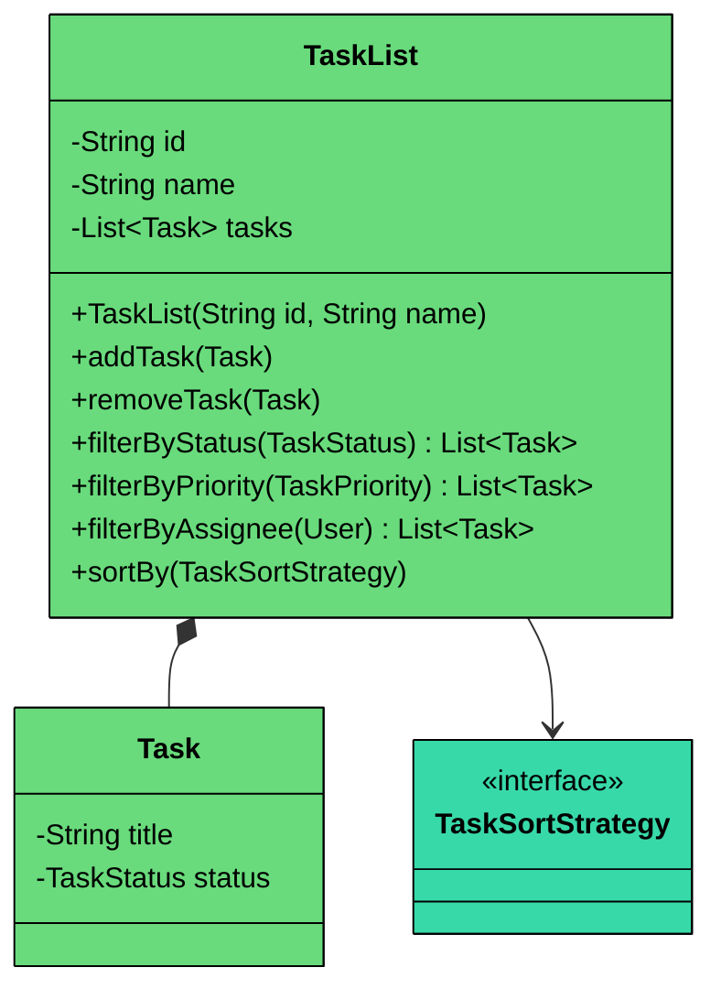

| Attribute | Type | Description | Mutable" |
|-----------|------|-------------|----------|
| `id` | String | Unique identifier | No |
| `name` | String | List name (e.g., "Sprint 1", "Backlog") | No |
| `tasks` | List\<Task\> | Tasks in this list | Additive |

| Method | Description |
|--------|-------------|
| `TaskList(id, name)` | Constructor |
| `addTask(Task)` | Add a task to the list |
| `removeTask(Task)` | Remove a task |
| `filterByStatus(TaskStatus)` | Get tasks with given status |
| `filterByPriority(TaskPriority)` | Get tasks with given priority |
| `filterByAssignee(User)` | Get tasks assigned to user |
| `sortBy(TaskSortStrategy)` | Sort using strategy |
| `getTasks()` | Returns defensive copy of tasks |
| `printTasks()` | Display all tasks to console |

**Key Design Principles:**

1. **Strategy Pattern:** The TaskList receives a sorting strategy and uses it without knowing the details. Different implementations sort by priority, due date, creation date, etc.
2. **Composition:** TaskList owns its Tasks. When a TaskList is deleted, the tasks within it are effectively removed from that context.

#### `TaskManagementSystem`

The main controller and entry point for the application. It acts as a central repository for all users, tasks, and lists, providing a simplified interface for all system operations.

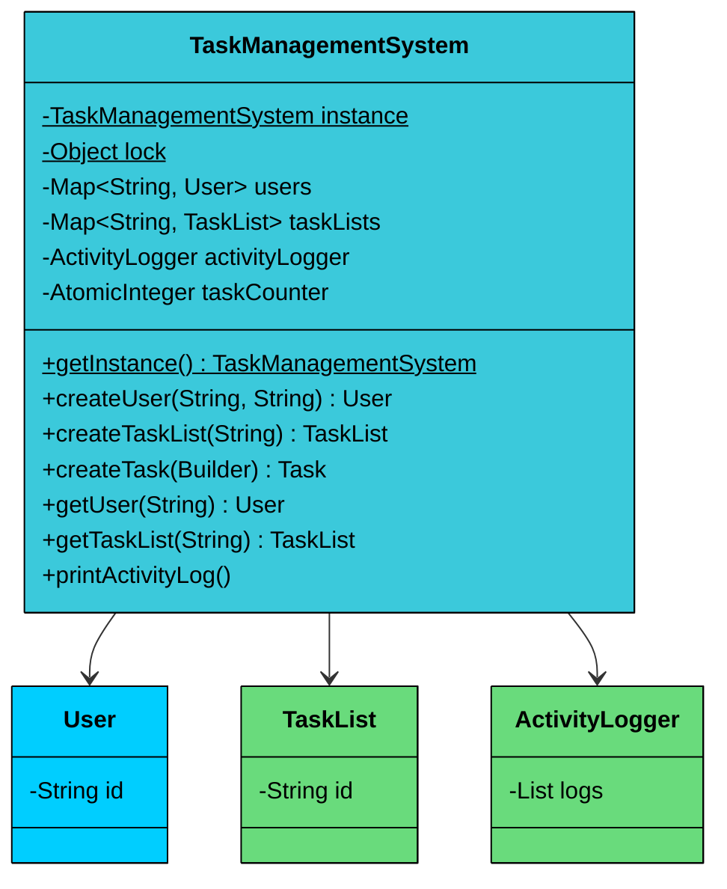

| Attribute | Type | Description |
|-----------|------|-------------|
| `instance` | TaskManagementSystem (static) | Singleton instance |
| `lock` | Object (static) | Lock for thread-safe initialization |
| `users` | ConcurrentHashMap\<String, User\> | Registered users |
| `taskLists` | ConcurrentHashMap\<String, TaskList\> | All task lists |
| `activityLogger` | ActivityLogger | Observer for logging |
| `taskCounter` | AtomicInteger | Thread-safe ID generation |

| Method | Description |
|--------|-------------|
| `getInstance()` | Static: returns singleton instance with double-checked locking |
| `createUser(name, email)` | Create and register a user |
| `createTaskList(name)` | Create a new task list |
| `createTask(builder)` | Create a task from builder, auto-registers activity logger |
| `getUser(id)` | Retrieve a user by ID |
| `getTaskList(id)` | Retrieve a task list by ID |
| `printActivityLog()` | Display all activity logs |
| `resetInstance()` | Static: reset singleton (for testing) |

**Key Design Principles:**

1. **Singleton Pattern:** Ensures only one instance of the system exists. Uses double-checked locking with `volatile` for thread-safe lazy initialization.
2. **Facade Pattern:** External code only interacts with TaskManagementSystem. It doesn't need to know about ActivityLogger registration or ID generation.
3. **Thread Safety:** Uses ConcurrentHashMap for storage and AtomicInteger for ID generation.

## 3.2 Class Relationships

After defining individual classes, let's examine how they connect to each other. Understanding these relationships is crucial for proper memory management, lifecycle handling, and API design.

#### Composition (Strong Ownership)

Composition means one object owns another. When the owner is destroyed, the owned object is destroyed too. The owned object has no meaningful existence outside its owner.

- **Task owns Comments:** When a task is deleted, its comments go with it. A comment exists only within the context of a specific task. It makes no sense to have a "floating" comment not attached to anything.
- **Task owns ActivityLogs:** Activity records belong to their task. The log entry "Status changed from TODO to IN_PROGRESS" only has meaning in the context of the specific task it describes.
- **TaskList owns Tasks (within the list):** Tasks belong to exactly one list at a time. When you remove a task from a list, it's effectively gone from that context. (In a more complex system, you might allow tasks to exist in multiple lists, which would change this to association.)

#### Association (Weak Reference)

Association means objects reference each other but have independent lifecycles. Neither object "owns" the other.

- **Task references User (assignee):** The task points to a user, but the user exists independently. If you delete a task, the user continues to exist. If you delete a user... well, that's a business decision. You might reassign their tasks, mark them as "unassigned," or keep the historical reference.
- **Task references Tags:** Tags can be shared across multiple tasks. The "bug" tag might appear on 50 different tasks. Deleting one task doesn't affect the tag, and deleting a tag doesn't delete the tasks.
- **Task references subtasks:** Subtasks are other Task objects. They're associated, not composed, because a subtask could theoretically be promoted to a top-level task or moved to a different parent. The parent-child relationship is navigational, not ownership.
- **Task references TaskState:** The current state is held by reference. When transitioning states, we create a new state object, not modify the existing one.

#### Implementation (Interface Contract)

Implementation means a class fulfills an interface contract. The implementing class can be used anywhere the interface is expected.

- **TodoState, InProgressState, DoneState, BlockedState implement TaskState:** All four can be used interchangeably by Task. The Task doesn't know which concrete state it's holding, only that it conforms to the TaskState interface.
- **PrioritySortStrategy, DueDateSortStrategy implement TaskSortStrategy:** The TaskList can use any sorting strategy. Adding a new sort option (by creation date, by assignee name) means adding a new class, not modifying TaskList.
- **ActivityLogger implements TaskObserver:** The Task notifies observers without knowing what they'll do with the information. ActivityLogger logs events, but we could add EmailNotifier, SlackNotifier, or WebhookTrigger without changing Task.

## 3.3 Key Design Patterns

Several design patterns are employed to ensure the system is flexible, scalable, and maintainable.

### [**State** Pattern](/learn/lld/state)  (Task Lifecycle)

**The Problem:** A task can be in four states: TODO, IN_PROGRESS, DONE, BLOCKED. But transitions aren't free-form. You can't go directly from TODO to DONE. You can't mark a parent DONE if subtasks aren't complete. If we use a simple enum with switch statements, validation logic gets scattered throughout the codebase.

**The Solution:** The State pattern encapsulates each state in its own class. Each state knows which transitions are valid from itself. The Task delegates state-related behavior to its current state object.

The State pattern gives us:

- **Isolated logic:** Each state's rules are in one place
- **Easy extension:** Adding a new state (like ARCHIVED) means adding a class, not modifying existing switch statements
- **Self-documenting:** The TodoState class explicitly shows what TODO can transition to

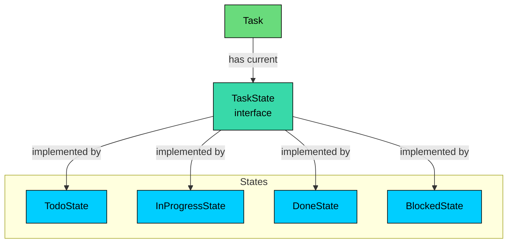

**The state machine for task transitions:**

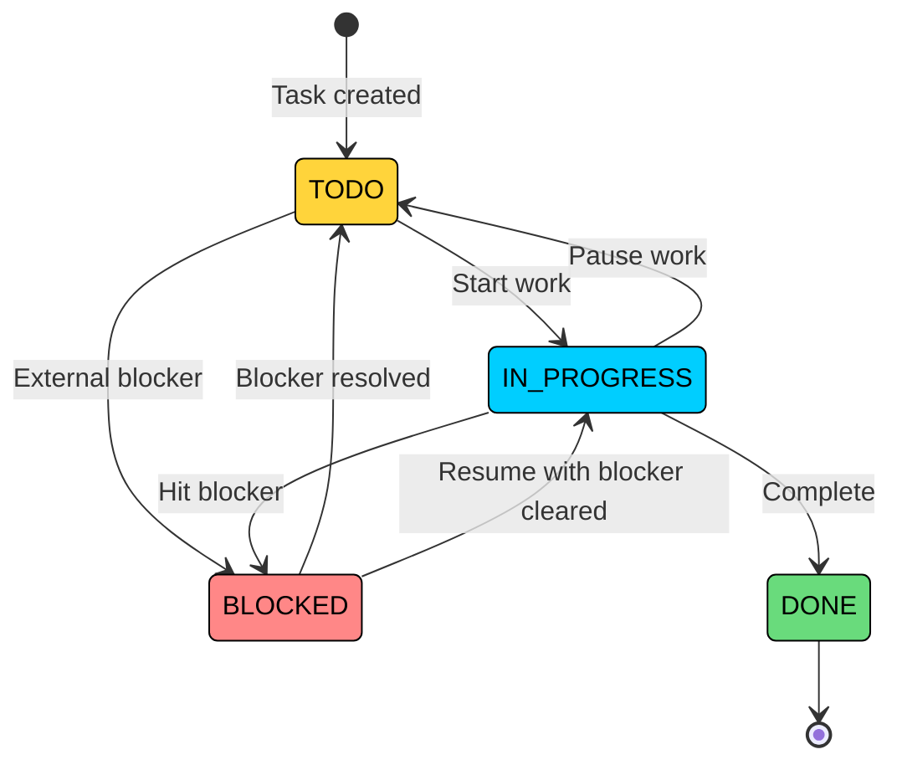

> 💡 **Key Insight:**

> **Design Decision**
>
> DONE is a terminal state. Once a task is done, it can't transition back. This simplifies the model. If you need to "reopen" tasks, you could add an ARCHIVED state that DONE transitions to, and allow ARCHIVED to go back to TODO.

> 💡 **Key Insight:**

> **Interview Insight**
>
> A common confusion is State vs. Strategy. Both involve delegating to different implementations. The difference: Strategy is about *how* to do something (algorithms are interchangeable). State is about *what* to do based on current context (behavior changes with state). Here, the task's valid actions depend on its current state, making State the right choice.

### [**Strategy** Pattern](/learn/lld/strategy) (Task Sorting)

**The Problem:** Users want to sort tasks by different criteria: priority (CRITICAL first), due date (soonest first), creation date (newest first). If we hardcode sorting logic, adding new sort options requires modifying existing code.

**The Solution:** The Strategy pattern encapsulates each sorting algorithm in its own class. The TaskList receives a strategy and uses it without knowing the details.

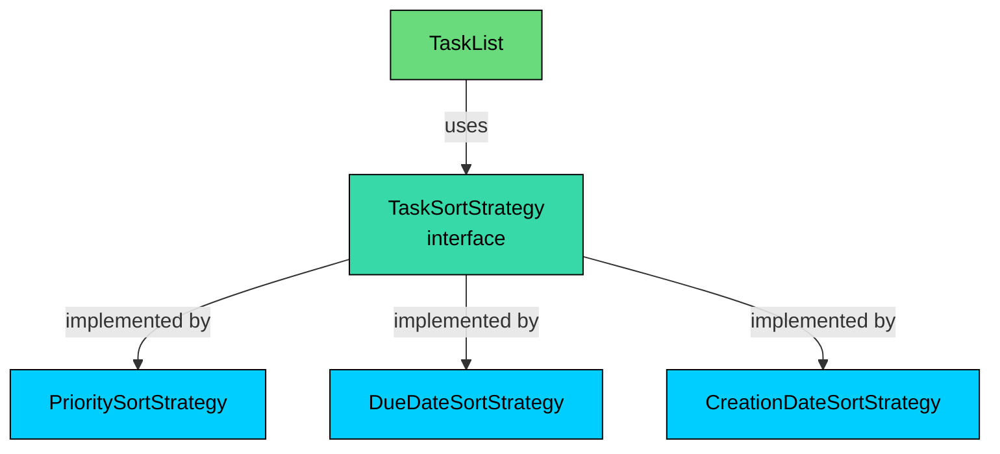

The `TaskSortStrategy` interface allows different sorting algorithms (`SortByPriority`, `SortByDueDate`) to be encapsulated and used interchangeably. The client (`TaskManagementSystem`) can select a sorting strategy at runtime.

### [**Observer** Pattern](/learn/lld/observer) (Activity Logging)

**The Problem:** When a task changes status or gets reassigned, we need to log it. The naive approach is to call `activityLogger.log()` directly in every method that modifies the task. But that couples Task to ActivityLogger. What if we want to add email notifications" Webhook triggers" Each new listener requires modifying Task.

**The Solution:** The Observer pattern decouples the event source (Task) from its listeners (ActivityLogger, future notifiers). Task maintains a list of observers and notifies them when events occur. Observers implement a common interface.

For just logging, direct method calls would work. We use Observer because:

- It demonstrates proper decoupling (important for interviews)
- Adding new listeners (email, Slack notifications) requires no changes to Task
- Each observer can be tested independently

> 💡 **Key Insight:**

> **Design Decision**
>
> We notify observers for specific events (status change, assignment change), not every property change. This keeps the observer interface focused and avoids noise.

The `TaskObserver` pattern is used to notify dependent objects (`ActivityLogger`) of any change in a `Task`'s state. This decouples the `Task` (the subject) from the objects that need to react to its changes (the observers).

### [**Builder** Pattern](/learn/lld/builder) (Task Construction)

**The Problem:** A Task has many fields: title (required), description (optional), dueDate (optional), priority (optional, defaults to MEDIUM), assignee (optional), tags (optional), etc. A constructor with all these parameters would be:

```java
new Task(title, description, dueDate, priority, assignee, createdBy, tags...)
```

This is unreadable. Which parameter is which" What if I only want to set title and priority"

**The Solution:** The Builder pattern provides a fluent API for construction:

```java
Task.builder("Fix login bug", currentUser)
    .description("Users can't log in with SSO")
    .priority(TaskPriority.CRITICAL)
    .dueDate(LocalDateTime.now().plusDays(1))
    .build();
```

Builder shines when:

- There are many optional parameters
- The object should be immutable after construction
- Construction involves validation

### Singleton + Facade (System Entry Point)

**The Problem:** External code needs a single entry point to the system. It shouldn't need to manually create TaskLists, wire up ActivityLoggers, or manage User registries.

**The Solution:** TaskManagementSystem is both a Singleton (one instance) and a Facade (simplified interface to complex subsystem). It handles object creation, wiring, and lifecycle. Singleton is often overused, but it's appropriate here because we genuinely need one system instance to maintain consistent state across all operations.

## 3.4 Full Class Diagram

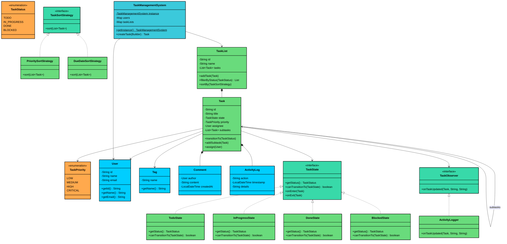

---

# 4. Implementation

### 4.1 Enums: `TaskStatus` and `TaskPriority`

```java
enum TaskStatus {
    TODO,
    IN_PROGRESS,
    DONE,
    BLOCKED
}

enum TaskPriority {
    LOW, 
    MEDIUM, 
    HIGH,
    CRITICAL
}
```

These enums define task metadata:

- `TaskStatus` tracks task lifecycle stages.
- `TaskPriority` indicates the urgency of the task, used for sorting and filtering.

### 4.2 User

Represents a user in the system with a unique ID, name, and email. Used as creator or assignee for tasks.

```java
class User {
    private final String id;
    private final String name;
    private final String email;

    public User(String name, String email) {
        this.id = UUID.randomUUID().toString();
        this.name = name;
        this.email = email;
    }

    // Getters...
    public String getId() {
        return id;
    }

    public String getEmail() {
        return email;
    }

    public String getName() {
        return name;
    }
}
```

### 4.3 Tag

Represents a tag (e.g., "bug", "feature") used to categorize tasks. Tags are optional metadata.

```java
class Tag {
    private final String name;

    public Tag(String name) { this.name = name; }

    public String getName() { return name; }
}
```

### 4.4 Comment

Models a comment left on a task by a user, with timestamp for audit trail.

```java
class Comment {
    private final String id;
    private final String content;
    private final User author;
    private final Date timestamp;

    public Comment(String content, User author) {
        this.id = UUID.randomUUID().toString();
        this.content = content;
        this.author = author;
        this.timestamp = new Date();
    }

    public User getAuthor() {
        return author;
    }
}
```

### 4.5 ActivityLog

Tracks updates to a task like status changes, comments, assignment, etc. Used for task history and accountability.

```java
class ActivityLog {
    private final String description;
    private final LocalDateTime timestamp;

    public ActivityLog(String description) {
        this.description = description;
        this.timestamp = LocalDateTime.now();
    }

    @Override
    public String toString() {
        return "[" + timestamp + "] " + description;
    }
}
```

### 4.6 Task

The Task class is the heart of the system. It's a complex entity that aggregates data and behavior to manage its state, relationships, and history.

```java
$137
```

A task has many optional and required attributes, making its constructor complex. The **Builder Pattern** provides a clean, fluent API for creating Task objects.

### 4.7 TaskList

```java
class TaskList {
    private final String id;
    private final String name;
    private final List<Task> tasks;

    public TaskList(String name) {
        this.id = UUID.randomUUID().toString();
        this.name = name;
        this.tasks = new CopyOnWriteArrayList<>();
    }

    public void addTask(Task task) {
        this.tasks.add(task);
    }

    public List<Task> getTasks() {
        return new ArrayList<>(tasks); // Return a copy to prevent external modification
    }

    // Getters...
    public String getId() { return id; }
    public String getName() { return name; }

    public void display() {
        System.out.println("--- Task List: " + name + " ---");
        for (Task task : tasks) {
            task.display("");
        }
        System.out.println("-----------------------------------");
    }
}
```

Encapsulates a logical group of tasks (e.g., “Bugs”, “Features”). Allows displaying grouped tasks in a hierarchical view.

### 4.8 Task Sorting Strategies

Implements the Strategy pattern to allow pluggable sorting mechanisms. New strategies (e.g., by creation date or assignee) can be added easily.

```java
interface TaskSortStrategy {
    void sort(List<Task> tasks);
}

class SortByPriority implements TaskSortStrategy {
    @Override
    public void sort(List<Task> tasks) {
        // Higher priority (lower enum ordinal) comes first
        tasks.sort(Comparator.comparing(Task::getPriority).reversed());
    }
}

class SortByDueDate implements TaskSortStrategy {
    @Override
    public void sort(List<Task> tasks) {
        tasks.sort(Comparator.comparing(Task::getDueDate));
    }
}
```

### 4.9 TaskObserver

```java
interface TaskObserver {
    void update(Task task, String changeType);
}

class ActivityLogger implements TaskObserver {
    @Override
    public void update(Task task, String changeType) {
        System.out.println("LOGGER: Task '" + task.getTitle() + "' was updated. Change: " + changeType);
    }
}
```

External components like loggers or notification systems can subscribe to task changes without being tightly coupled.

### 4.10 TaskState

```java
$13d
```

Each TaskState implementation (TodoState, InProgressState, DoneState) knows which transitions are valid from its current state. This design cleans up the Task class and makes it easy to add new states (e.g., BlockedState) without modifying existing code.

### 4.11 TaskManagementSystem

This class serves as the central point of control. It uses the **Singleton Pattern** to ensure a single instance manages all system data and the **Facade Pattern** to provide a simple, unified interface to the complex subsystem.

```java
$143
```

- **Singleton**: Ensures that there is only one central repository for all users, tasks, and lists throughout the application.
- **Facade**: Hides the complexity of creating and linking objects. A client simply calls taskManagementSystem.createTask(...) without needing to know about builders, observers, or internal storage maps.

### 4.12 TaskManagementSystem Demo

The TaskManagementSystemDemo class demonstrates how a client would interact with the system's facade to perform common operations.

```java
$149
```

This driver code simulates a user's interaction with the system, showcasing:

- Object creation with the **Builder**.
- Hierarchical task management via the **Composite** pattern.
- State transitions managed by the **State** pattern.
- Automatic logging via the **Observer** pattern.
- Flexible searching and sorting using the **Strategy** pattern.

---

# 5. Run and Test

---

# 6. Quiz
