> 💡 **Key Insight:**

> **QUESTION**
>
> #### What is an Inventory Management System"
>
> An **Inventory Management System (IMS)** is a software solution that helps businesses efficiently **track**, **organize**, and **control** their inventory across the supply chain, from procurement to storage to sales and fulfillment.
>
> 
> <!-- Simulation: inventory-management -->
> 

>
> A well-designed IMS allows companies to:
>
> - Monitor current stock levels in real time
> - Reduce overstocking and understocking
> - Track the flow of goods between warehouses or stores
> - Support procurement, sales, fulfillment, and auditing processes

In this chapter, we will explore the **low-level design of an inventory management system **in detail.

Lets start by clarifying the requirements:

---

# 1. Clarifying Requirements

We are tasked with designing a system to manage inventory across multiple warehouses. The system should track products, stock levels, and handle orders.

Let's begin by clearly defining the system's capabilities.

> 💡 **Key Insight:**

> **DISCUSSION**
>
> **Candidate:** "Do we need to track inventory at a single location or across multiple warehouses""
>
> **Interviewer:** "Let’s support multiple warehouses. Each warehouse should maintain its own stock levels independently."
>
> **Candidate:** "What types of stock operations do we need to support" Just adding and removing, or also transfers between warehouses""
>
> **Interviewer:** "All three: additions (new stock arrives), removals (stock is sold or consumed), and transfers (move stock from one warehouse to another)."
>
> **Candidate:** "Should we categorize products" For example, electronics vs. food vs. clothing""
>
> **Interviewer:** "Yes, products should have a category. Keep it simple with a fixed set of categories."
>
> **Candidate:** "How should the system handle low stock situations" Should it just alert, or also trigger automatic restocking""
>
> **Interviewer:** "The system should detect low stock and notify interested parties. The restock policy should be configurable, different warehouses might use different thresholds or strategies."
>
> **Candidate:** "Should we maintain a history of all stock movements for audit purposes""
>
> **Interviewer:** "Yes. Every addition, removal, and transfer should be recorded with a timestamp."
>
> **Candidate:** "Do we need to handle concurrent access" For example, two workers adding and removing stock for the same product at the same time""
>
> **Interviewer:** "Yes. The system should be thread-safe for concurrent stock operations."
>
> **Candidate:** "Should the system enforce any constraints on operations" For example, preventing removal of more stock than is available""
>
> **Interviewer:** "Yes. Removals and transfers should fail gracefully if there isn't enough stock."

With these clarifications, we can now summarize the key system requirements.

## 1.1 Functional Requirements

- The system should support **adding products** with a name, category, and price
- The system should support **multiple warehouses**, each managing its own stock levels
- The system should allow **adding stock**, **removing stock**, and **transferring stock** between warehouses
- The system should **record** every stock movement with a timestamp for audit purposes
- The system should detect **low stock** and notify registered observers
- The system should support configurable **restock strategies** (e.g., threshold-based restocking)
- The system should allow querying current stock levels for any product in any warehouse

## 1.2 Non-Functional Requirements

- The design should follow **object-oriented principles** (encapsulation, single responsibility, loose coupling)
- The system should be **modular** and **extensible** (new restock strategies, new observer types)
- The code should be **thread-safe** for concurrent stock operations
- The components should be **testable** in isolation

With the requirements clarified, the next step is to identify the core entities and responsibilities in the system.

---

# 2. Identifying Core Entities

> [!PAYWALL] This content is for premium members only.

How do you go from a list of requirements to actual classes" The key is to look for **nouns** in the requirements that have distinct attributes or behaviors. Not every noun becomes a class, but this approach gives you a starting point.

Let's walk through our requirements and identify what needs to exist in our system.

### 2.1 Products and Categories

> "Add products with a name, category, and price"

We need to represent items that the system tracks. Each product has an ID, a name, and a price. This gives us the `Product` entity.

But products also belong to categories. We could use a raw string for this, but that opens the door to inconsistency ("electronics" vs "Electronics" vs "ELECTRONICS"). A fixed set of values is a natural fit for an enum, so we create `Category` with values like ELECTRONICS, CLOTHING, FOOD, and FURNITURE.

Why an enum over strings" Because `Category.ELECTRONICS` is self-documenting and type-safe. You can't accidentally create a product with category "ELECTRONICSS". The compiler catches invalid categories at compile time, not runtime.

### 2.2 Stock Operations and Movements

> "Allow adding stock, removing stock, and transferring stock between warehouses"

Three distinct operation types need tracking. That's a `MovementType` enum with values ADDITION, REMOVAL, and TRANSFER.

Each operation also needs to be recorded for audit purposes. We need a data class to capture what happened, when, and where. This gives us `StockMovement`, which records the product involved, the type of operation, the quantity, the source and destination warehouses, and a timestamp.

Why a single StockMovement class instead of separate classes per operation" Because the data structure is identical across all three types, just with different fields populated. For additions, the source warehouse is null. For removals, the destination is null. For transfers, both are populated.

### 2.3 Warehouses

> "Support multiple warehouses, each managing its own stock levels"

The warehouse is the heart of the system. Each warehouse has an ID, a name, and manages its own product-to-quantity mapping. This gives us the `Warehouse` entity.

A warehouse needs to enforce business rules like "you can't remove more stock than you have." It also records every stock operation as a StockMovement for the audit trail. The warehouse doesn't know about other warehouses. It manages its own inventory in isolation.

Why not a single global inventory" Because in the real world, products exist in specific physical locations. Knowing that 50 laptops are spread across two warehouses is more useful than knowing you have 50 laptops "somewhere."

### 2.5 Restock Strategies

> "Support configurable restock strategies"

Different warehouses might have different restocking policies. A pharmacy warehouse might restock when quantity drops below 50, while a furniture warehouse restocks below 5. Instead of hardcoding these rules, we use a `RestockStrategy` interface. Different implementations handle different policies.

Our first implementation is **ThresholdRestockStrategy**, which triggers restock when quantity drops below a configurable reorder level. But the interface is open for other approaches like just-in-time restocking or demand-based calculations.

### 2.6 Inventory Notifications

> "Detect low stock and notify registered observers"

When stock levels change, several things might need to happen: alerts, dashboard updates, purchase order triggers. If the warehouse calls these directly, it becomes tightly coupled to every notification target. Instead, we define an `InventoryObserver` interface for anything that reacts to inventory events.

Our first implementation is **LowStockAlertObserver**, which prints an alert when stock drops below a threshold. But any number of observers can subscribe: loggers, dashboards, automated purchasing systems.

### 2.7 System Coordination

> "Centralized coordination across warehouses, strategies, and observers"

With multiple warehouses, we need something to coordinate cross-warehouse operations like transfers, apply restock strategies, and dispatch notifications. This facade is the `InventoryManagementSystem`, a singleton that ties everything together.

The system doesn't duplicate warehouse logic. It delegates stock operations to individual warehouses and handles the cross-cutting concerns (observer notification, restock checking, transfer coordination) that span multiple warehouses.

### 2.8 Entity Overview

Here's how these entities relate to each other:

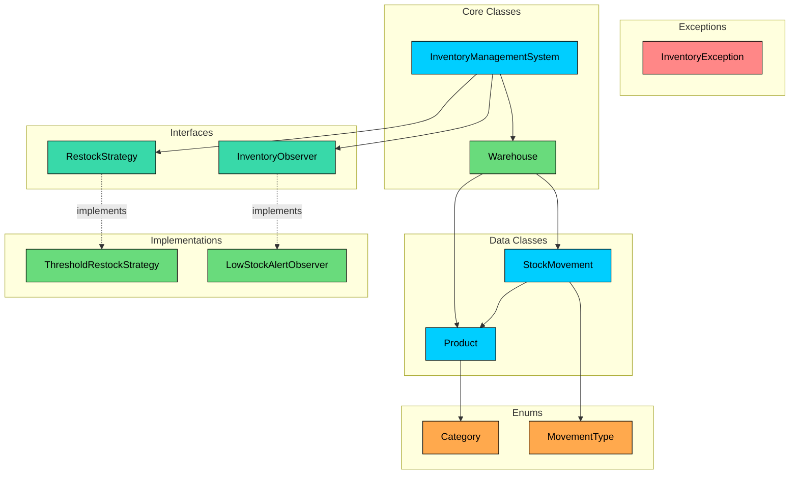

We've identified four types of entities:

**Enums** define fixed sets of values. Category and MovementType provide type safety and prevent invalid classifications.

**Data Classes** primarily hold data with minimal behavior. Product and StockMovement are immutable containers that capture facts about the domain.

**Interfaces** define contracts for interchangeable behavior. RestockStrategy and InventoryObserver allow different implementations to be plugged in without changing the system.

**Core Classes** contain the main logic. Warehouse manages individual inventory, and InventoryManagementSystem coordinates everything.

Here's the complete entity summary:

| Entity | Type | Responsibility |
|--------|------|----------------|
| `Category` | Enum | Classifies products (ELECTRONICS, CLOTHING, FOOD, FURNITURE) |
| `MovementType` | Enum | Identifies stock operation type (ADDITION, REMOVAL, TRANSFER) |
| `Product` | Data Class | Immutable product info (id, name, category, price) |
| `StockMovement` | Data Class | Records a stock change with product, type, quantity, warehouses, timestamp |
| `RestockStrategy` | Interface | Defines when and how much to restock |
| `InventoryObserver` | Interface | Reacts to inventory events (low stock, movements) |
| `Warehouse` | Core Class | Manages product inventory, enforces stock operations |
| `InventoryManagementSystem` | Core/Facade | Singleton orchestrator: warehouses, strategies, observers, transfers |

With our entities identified, let's define their attributes, behaviors, and relationships.

---

# 3. Designing Classes and Relationships

This section details the classes that form the core of the inventory management system, their relationships, and the key design patterns employed to ensure a robust, scalable, 

## 3.1 Class Definitions

The system is designed around a set of well-defined classes, each with a single responsibility. They can be categorized as Enums, Data Classes, and Core Classes.

### Enums

#### `Category`

We need a way to classify products. We could use raw strings ("electronics", "Electronics", "ELECTRONICS"), but that invites inconsistency and typos. An enum gives us a closed set of valid categories with compile-time safety.

**Category** represents the product classification.

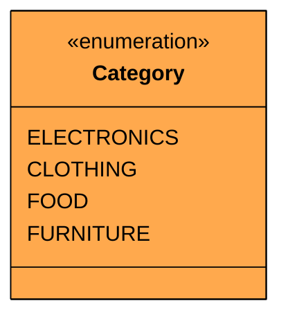

| Value | Purpose |
|-------|---------|
| `ELECTRONICS` | Phones, laptops, accessories |
| `CLOTHING` | Apparel, shoes, textiles |
| `FOOD` | Perishable and non-perishable food items |
| `FURNITURE` | Desks, chairs, shelving |

The set is fixed by the business domain. If new categories emerge, adding an enum value is a one-line change that the compiler can flag across all switch statements.

Now that we can classify products, we need a way to classify what happens to them in the warehouse.

#### `MovementType`

Every stock operation falls into one of three categories: stock coming in, stock going out, or stock moving between warehouses. Tracking the type of each movement is essential for audit trails and analytics.

**MovementType** represents the kind of stock operation.

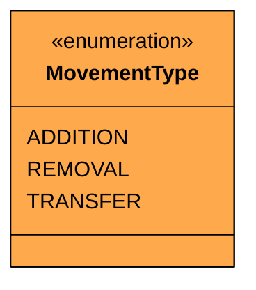

| Value | Purpose |
|-------|---------|
| `ADDITION` | New stock added to a warehouse |
| `REMOVAL` | Stock removed (sold, consumed, damaged) |
| `TRANSFER` | Stock moved from one warehouse to another |

Unlike `Category`, `MovementType` doesn't represent a lifecycle with transitions, it's just a classification label. An addition doesn't "become" a removal. Each movement record is created once and never changes type, so a state diagram wouldn't add value here.

With our classification enums in place, we need a way to signal when things go wrong.

### Custom Exception

#### `InventoryException`

Stock operations can fail for several reasons: insufficient quantity, unknown product, invalid warehouse. Rather than throwing generic exceptions with message strings, a dedicated exception class lets callers distinguish inventory failures from other runtime errors.

**InventoryException** signals domain-specific errors in inventory operations.

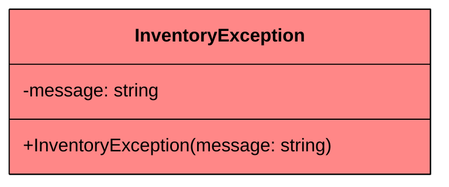

This is a simple wrapper around the standard runtime exception. The value isn't in the class itself but in the type. Catching `InventoryException` is more meaningful than catching `RuntimeException` and parsing the message string.

Now let's define the data that flows through the system.

### Data Classes

#### `Product`

A product represents an item that can be stocked in warehouses. Once created, its properties shouldn't change, a product's name and price are set at creation time and remain consistent across all warehouses.

**Product** holds immutable product information.

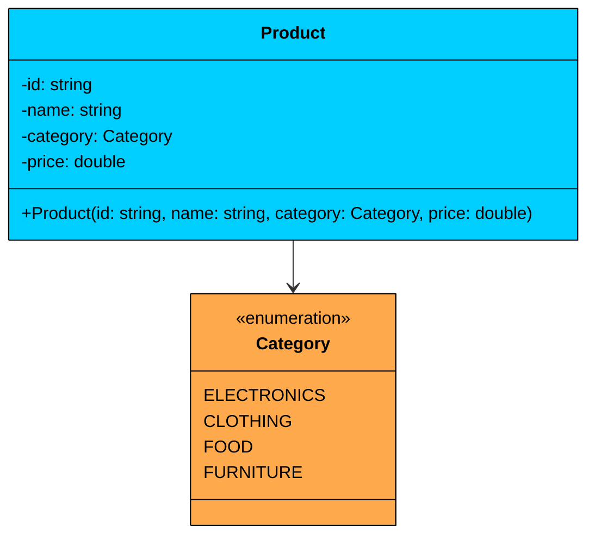

| Attribute | Type | Description | Mutable" |
|-----------|------|-------------|----------|
| `id` | string | Unique product identifier | No |
| `name` | string | Human-readable product name | No |
| `category` | Category | Product classification | No |
| `price` | double | Unit price | No |

All fields are read-only. The `id` is used as a key in warehouse inventory maps, so immutability is critical. If the id could change after the product was added to a warehouse, the map lookup would break silently.

Now that we have products, we need a way to record what happens to them.

#### `StockMovement`

Every time stock is added, removed, or transferred, we create a record of that event. This serves as an audit trail and can feed into analytics, reporting, or compliance requirements.

**StockMovement** records a single stock operation.

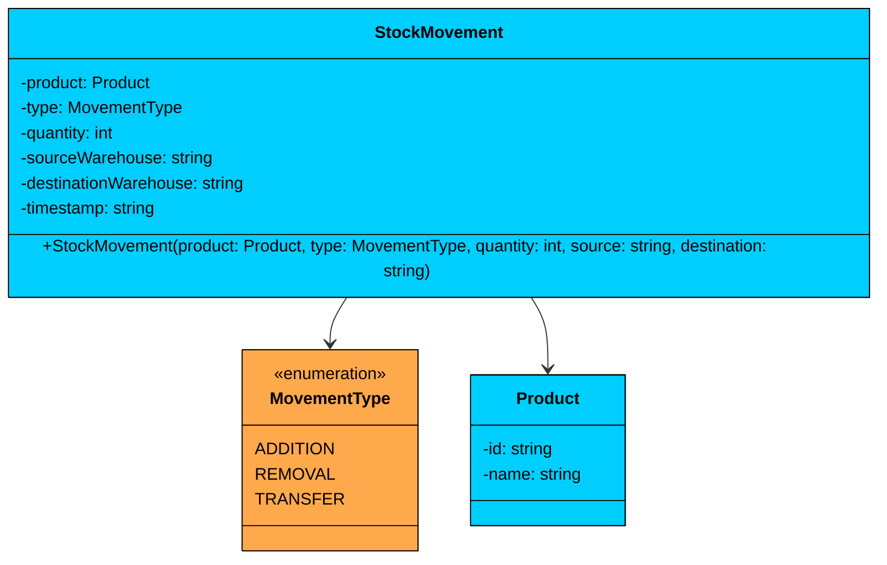

| Attribute | Type | Description | Mutable" |
|-----------|------|-------------|----------|
| `product` | Product | The product involved in this movement | No |
| `type` | MovementType | What kind of operation (ADDITION, REMOVAL, TRANSFER) | No |
| `quantity` | int | How many units were moved | No |
| `sourceWarehouse` | string | Where stock came from (null for additions) | No |
| `destinationWarehouse` | string | Where stock went to (null for removals) | No |
| `timestamp` | string | When the operation occurred | No |

For additions, `sourceWarehouse` is null (stock comes from outside the system). For removals, `destinationWarehouse` is null (stock leaves the system). For transfers, both are populated.

### Interfaces

#### `RestockStrategy`

Different warehouses might have different restocking policies. A pharmacy warehouse might restock when quantity drops below 50, while a furniture warehouse restocks below 5. Rather than hardcoding these rules, we define an interface that any restock policy can implement.

**RestockStrategy** defines the contract for restock decision-making.

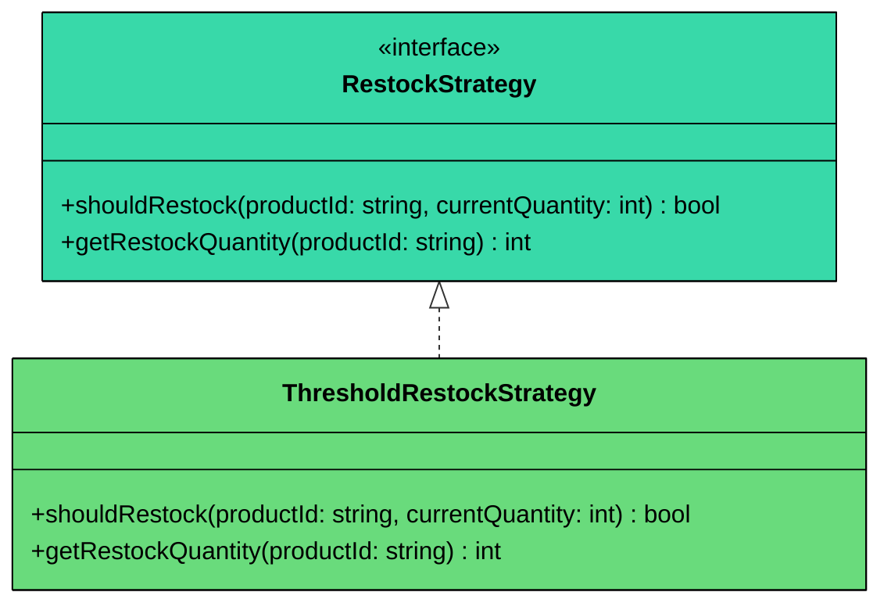

| Method | Description |
|--------|-------------|
| `shouldRestock(productId, currentQuantity)` | Returns true if the product needs restocking |
| `getRestockQuantity(productId)` | Returns how many units to order |

Two methods instead of one because the decision to restock and the quantity to restock are independent concerns. A strategy might always restock in batches of 100, or it might calculate the quantity dynamically based on demand.

#### `InventoryObserver`

When stock levels change, several things might need to happen: send an alert, update a dashboard, log to an audit system, trigger a purchase order. The warehouse shouldn't know about any of these. It should just announce what happened and let interested parties react.

**InventoryObserver** defines the contract for reacting to inventory events.

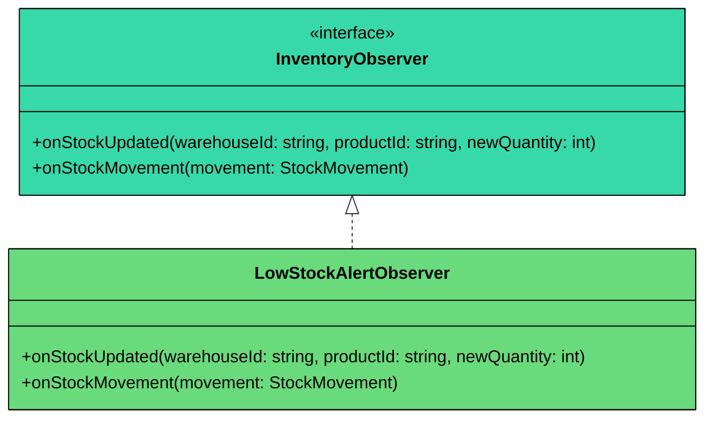

| Method | Description |
|--------|-------------|
| `onStockUpdated(warehouseId, productId, newQuantity)` | Called whenever a product's stock level changes |
| `onStockMovement(movement)` | Called whenever a stock movement is recorded |

Two notification methods give observers flexibility. Some care about current levels (low-stock alerting), others care about what happened (audit logging). An observer can implement both or focus on one.

Now let's build the classes that do the real work.

### Core Classes

#### `Warehouse`

The warehouse is the heart of the system. It manages a collection of products, tracks stock quantities, records movements, and enforces business rules like "you can't remove more than you have."

**Warehouse** manages inventory for a single physical location.

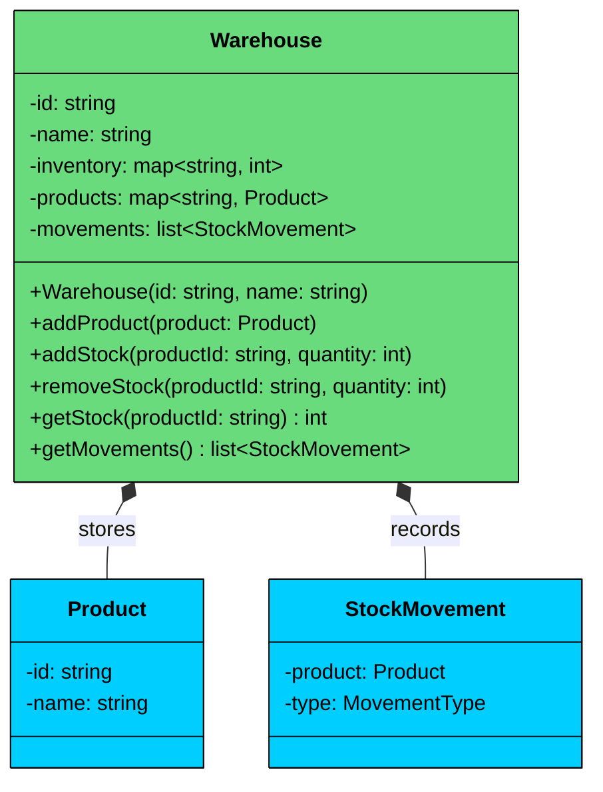

| Attribute | Type | Description | Mutable" |
|-----------|------|-------------|----------|
| `id` | string | Unique warehouse identifier | No |
| `name` | string | Human-readable warehouse name | No |
| `inventory` | map<string, int> | Maps product ID to current quantity | Yes |
| `products` | map<string, Product> | Maps product ID to Product object | Yes |
| `movements` | list<StockMovement> | Chronological history of all operations | Yes (append-only) |

| Method | Description |
|--------|-------------|
| `addProduct(product)` | Registers a product with initial stock of 0 |
| `addStock(productId, quantity)` | Increases stock, records ADDITION movement |
| `removeStock(productId, quantity)` | Decreases stock if sufficient, records REMOVAL movement |
| `getStock(productId)` | Returns current quantity for a product |
| `getMovements()` | Returns the full movement history |

**Relationship:** Warehouse has a **composition** relationship with its inventory data and movement history. When a warehouse is destroyed, its stock records go with it. The Product references are **associations**, the same Product object can exist across multiple warehouses.

The warehouse validates at its public boundary: `addStock` and `removeStock` check that the product exists and the quantity is positive. Internal helper methods trust their callers.

The warehouse is where most of the complexity lives, so let's design the orchestrator that ties multiple warehouses together.

#### `InventoryManagementSystem`

With multiple warehouses, we need something that coordinates cross-warehouse operations (transfers), applies restock strategies, and dispatches notifications to observers. This facade simplifies client interaction: instead of managing individual warehouses, clients talk to one system.

**InventoryManagementSystem** is the singleton orchestrator for the entire inventory system.

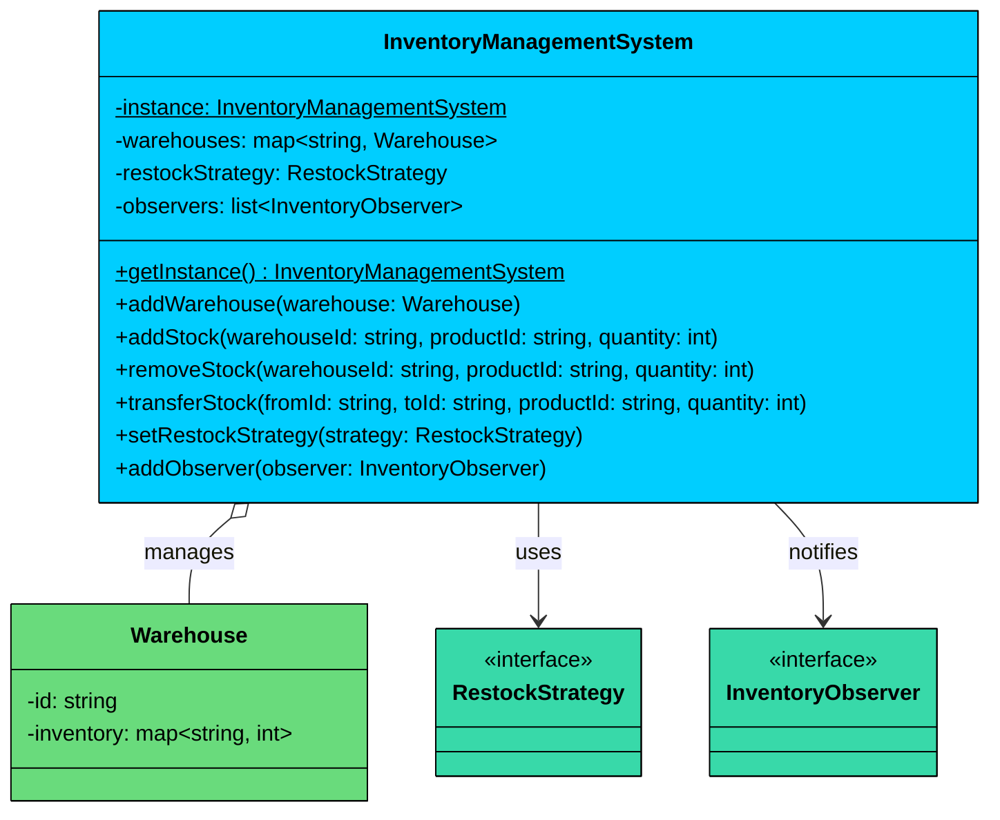

| Attribute | Type | Description | Mutable" |
|-----------|------|-------------|----------|
| `instance` | InventoryManagementSystem (static) | Singleton instance | Yes (set once) |
| `warehouses` | map<string, Warehouse> | Registered warehouses by ID | Yes |
| `restockStrategy` | RestockStrategy | Current restock policy | Yes (swappable) |
| `observers` | list<InventoryObserver> | Registered event listeners | Yes |

| Method | Description |
|--------|-------------|
| `getInstance()` | Returns the singleton instance (thread-safe lazy init) |
| `addWarehouse(warehouse)` | Registers a warehouse with the system |
| `addStock(warehouseId, productId, quantity)` | Delegates to warehouse, then checks restock and notifies observers |
| `removeStock(warehouseId, productId, quantity)` | Delegates to warehouse, then checks restock and notifies observers |
| `transferStock(fromId, toId, productId, quantity)` | Removes from source, adds to destination, records transfer movement |
| `setRestockStrategy(strategy)` | Swaps the restock policy at runtime |
| `addObserver(observer)` | Registers a new event listener |

**Relationship:** InventoryManagementSystem has an **aggregation** relationship with Warehouse. It manages warehouses but doesn't own their lifecycle. Warehouses can exist independently. The system has **association** relationships with RestockStrategy and InventoryObserver, it uses them but doesn't own them.

---

## 3.2 Key Design Patterns

Several design patterns are strategically used to achieve flexibility, safety, and separation of concerns.

### [Strategy Pattern](/learn/lld/strategy) (Restock Policies)

**The Problem:** Different warehouses may need different restocking rules. A grocery warehouse restocks when quantity drops below 100 units. A luxury goods warehouse restocks below 5 units. A just-in-time warehouse might not restock at all until quantity hits zero.

**The Solution:** The Strategy pattern encapsulates each restocking algorithm behind the `RestockStrategy` interface. The system delegates restock decisions to whatever strategy is currently configured, without knowing the specifics.

Without it, the `InventoryManagementSystem` would need an if-else chain checking string labels like "threshold", "just-in-time", and "never", with each new policy adding another branch. Every new policy requires modifying this chain. With Strategy, adding a new policy means creating a new class. Zero changes to existing code.

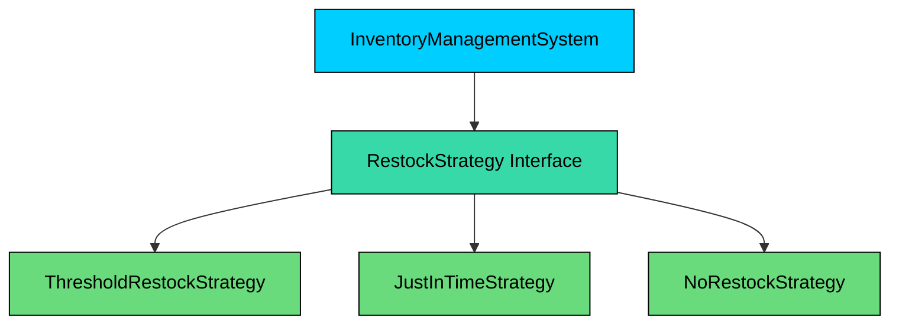

### [**Observer Pattern**](/learn/lld/observer)** **(Inventory Notifications)

**The Problem:** When stock levels change, several things need to happen: check if stock is low, log the event, potentially trigger purchase orders, update dashboards. If the warehouse calls these directly, it becomes tightly coupled to every notification target.

**The Solution:** The Observer pattern decouples the event source (inventory changes) from the event handlers (alerts, logs, dashboards). The system broadcasts events, and registered observers react independently.

Without it, every new notification type requires modifying the `InventoryManagementSystem`. The `stockChanged()` method would grow with direct calls to `alertSystem.check()`, then `logger.log()`, then `dashboard.refresh()`, then `purchaseOrder.trigger()`, each added in a different version. The method becomes a growing list of hardcoded dependencies. With Observer, adding a new notification is one line: `system.addObserver(new DashboardObserver())`. The system doesn't change.

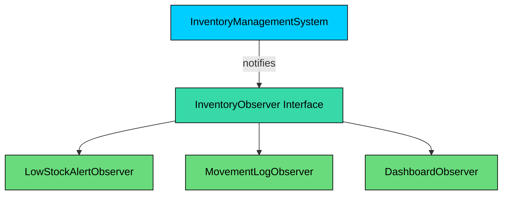

### [**Singleton Pattern**](/learn/lld/singleton)** **(InventoryManagementSystem)

**The Problem:** Multiple parts of the application need to access the same inventory state. If different code paths create their own InventoryManagementSystem instances, they'll have different warehouse registries and observer lists, leading to inconsistent behavior.

**The Solution:** The Singleton pattern ensures exactly one InventoryManagementSystem exists. All code paths share the same instance with consistent state.

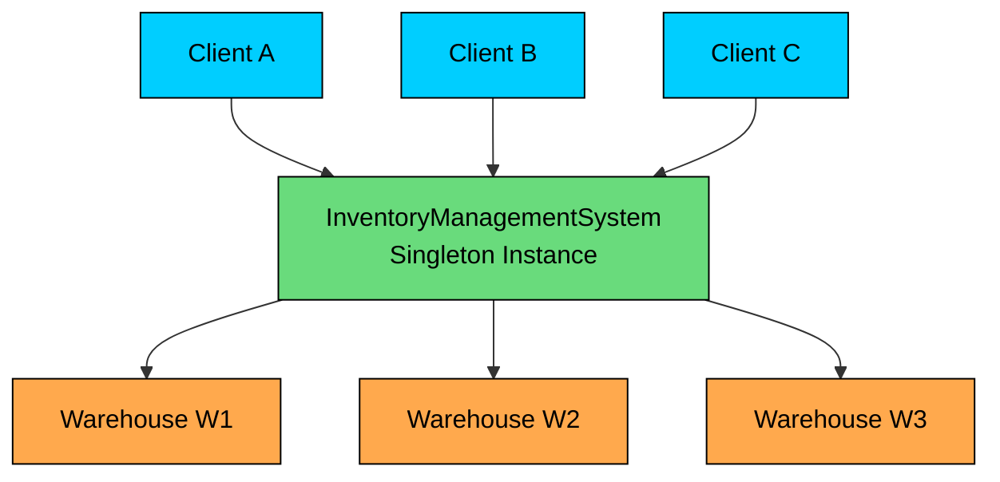

All clients access the same instance, which ensures every warehouse lookup, observer notification, and transfer operation works against consistent state.

---

## 3.3 Full Class Diagram

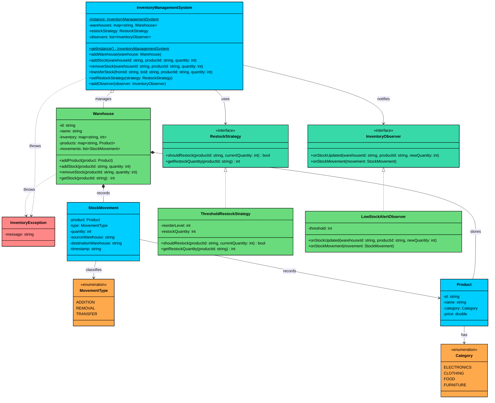

---

# 4. Code Implementation

This section presents the complete implementation, following the bottom-up order: enums first, then data classes, interfaces, implementations, and finally the core orchestrator.

#### Java

## 4.1 Enums

### Category

`Category` is the simplest piece of our design. Four fixed values, no methods, no fields. It exists purely for type safety, preventing invalid product classifications at compile time.

### MovementType

`MovementType` classifies what kind of stock operation occurred. Each value corresponds to a distinct business event: stock arriving, stock departing, or stock moving between warehouses.

Both enums are intentionally simple. Adding display names or descriptions would be over-engineering for this use case. The enum name itself is descriptive enough.

## 4.2 Custom Exception

### InventoryException

A lightweight exception class that wraps a descriptive message. The class itself carries no additional logic. Its value is in the type name: catching `InventoryException` is more intentional than catching `RuntimeException`.

We extend `RuntimeException` (unchecked) rather than `Exception` (checked) because inventory errors represent situations the caller should handle but isn't forced to. This is consistent with how most modern Java frameworks handle domain exceptions.

## 4.3 Data Classes

### Product

Product is an immutable data holder. Once created, nothing changes. This is important because the same Product object is shared across multiple warehouses, and immutability eliminates the need for synchronization on product reads.

Validation happens once in the constructor. After that, every getter returns a guaranteed-valid value. This is the "validate at the boundary, trust internally" principle from Section 1.3.

### StockMovement

StockMovement captures a snapshot of a stock operation. It references the Product, the movement type, the quantity, and which warehouses were involved. The timestamp is set automatically at creation time.

The `toString()` method formats output differently based on movement type. For transfers, it shows both source and destination. For additions, it shows the destination warehouse. For removals, it shows the source. This makes the audit log human-readable without requiring callers to format the output themselves.

## 4.4 Interfaces

### RestockStrategy

The strategy interface defines two methods: one to decide IF restocking is needed, and one to determine HOW MUCH to order. Splitting these concerns allows strategies to be more flexible. For example, a dynamic strategy might always restock but vary the quantity based on sales velocity.

### InventoryObserver

The observer interface provides two notification hooks. `onStockUpdated` fires whenever a product's quantity changes and is ideal for threshold-based alerting. `onStockMovement` fires when a movement is recorded and is ideal for audit logging.

An observer can implement one or both methods meaningfully. A low-stock alerter only cares about `onStockUpdated`. An audit logger cares about `onStockMovement`. A comprehensive monitoring system might use both.

## 4.5 Strategy Implementation

### ThresholdRestockStrategy

The simplest restock policy: if the current quantity drops below a fixed reorder level, suggest restocking a fixed quantity. Both values are set at construction time and don't change.

The `productId` parameter is accepted but not used in this simple implementation. More sophisticated strategies (like demand-based restocking) would use the product ID to look up historical sales data and calculate a custom restock quantity per product.

## 4.6 Observer Implementation

### LowStockAlertObserver

This observer monitors stock levels and prints alerts when quantity drops below a configurable threshold. It also logs all stock movements for visibility.

The observer uses `productId` rather than the `Product` object in `onStockUpdated` because it doesn't need product details to decide if stock is low. This keeps the interface lightweight. If an observer needs full product details, it can look them up through the warehouse.

## 4.7 Core Class: Warehouse

### Warehouse

The Warehouse class is where inventory management actually happens. It maintains two maps (products and inventory), validates all operations, records movements, and uses `synchronized` on stock-modifying methods to prevent concurrent access issues.

A few key decisions in this implementation:

1. **ConcurrentHashMap for inventory and products:** Thread-safe for individual reads and writes. But compound operations (read-then-write in `removeStock`) still need `synchronized` because ConcurrentHashMap only guarantees atomicity for single operations, not multi-step sequences.
2. **CopyOnWriteArrayList for movements:** Movements are append-heavy and read-occasionally. CopyOnWriteArrayList is ideal for this pattern since writes create a new array copy (acceptable for infrequent stock operations) while reads never block.
3. **Collections.unmodifiableList for getMovements():** Returns a read-only view of the movement history. Callers can inspect the history but can't tamper with it.
4. **Validation at the boundary:** `addStock` and `removeStock` validate inputs (product exists, positive quantity, sufficient stock) before modifying state. If validation fails, the warehouse state remains unchanged.

Here's the internal flow of a warehouse stock removal operation:

```mermaid
flowchart LR
    A[removeStock<br/>called]:::primary
    B{Product<br/>exists"}:::orange
    C{Quantity<br/>> 0"}:::orange
    D{Sufficient<br/>stock"}:::orange
    E[Update<br/>inventory map]:::green
    F[Record<br/>StockMovement]:::green
    G[Throw<br/>InventoryException]:::red

    A --> B
    B -->|No| G
    B -->|Yes| C
    C -->|No| G
    C -->|Yes| D
    D -->|No| G
    D -->|Yes| E
    E --> F

    classDef primary fill:#00ceff,stroke:#000,color:#000
    classDef orange fill:#ffa94d,stroke:#000,color:#000
    classDef green fill:#69db7c,stroke:#000,color:#000
    classDef red fill:#ff8787,stroke:#000,color:#000
```

The entire flow runs inside a `synchronized` block. If any validation step fails, the method throws immediately and the warehouse state is unchanged. This "validate first, mutate last" pattern ensures no partial updates occur.

## 4.8 Facade: InventoryManagementSystem

### InventoryManagementSystem

The singleton orchestrator ties everything together. It delegates stock operations to warehouses, checks restock policies after each operation, and broadcasts events to registered observers. The transfer operation coordinates between two warehouses atomically.

Key implementation choices:

1. **Double-checked locking** with `volatile` for the singleton. The first null check avoids acquiring the lock on every call. The `volatile` keyword ensures the instance is fully constructed before it becomes visible to other threads.
2. **`transferStock` is `synchronized`:** Transfers involve two warehouses and must be atomic. Without synchronization, a concurrent transfer and removal could both check sufficient stock at the source, leading to an overdraft.
3. **`restockStrategy` is `volatile`:** The strategy can be swapped at runtime via `setRestockStrategy`. `volatile` ensures all threads see the latest strategy without requiring synchronization on every stock operation.
4. **CopyOnWriteArrayList for observers:** Observers are added infrequently but iterated on every stock operation. CopyOnWriteArrayList makes iteration safe without explicit locking.
5. **Notification order:** The system notifies observers after the stock operation completes successfully. If the operation throws an exception (insufficient stock, invalid product), no notifications are sent. This prevents false alerts.

## 4.9 Demo

The demo exercises all major features: product creation, stock additions, removals, transfers, low-stock alerts, restock suggestions, and error handling.

With our implementation complete, let's examine the concurrency concerns in more detail.

### Transfer Stock Flow

The transfer operation is the most complex flow in the system because it coordinates between two warehouses. Here's the step-by-step process:

```mermaid
flowchart TD
    A[transferStock called]:::primary
    B{Source warehouse<br/>exists"}:::orange
    C{Destination warehouse<br/>exists"}:::orange
    D[Remove from source]:::green
    E{Sufficient<br/>stock"}:::orange
    F[Add to destination]:::green
    G[Create TRANSFER<br/>movement record]:::primary
    H[Notify observers]:::teal
    I[Check restock<br/>for source]:::teal
    J[Done]:::green
    K[Throw<br/>InventoryException]:::red

    A --> B
    B -->|No| K
    B -->|Yes| C
    C -->|No| K
    C -->|Yes| D
    D --> E
    E -->|No| K
    E -->|Yes| F
    F --> G
    G --> H
    H --> I
    I --> J

    classDef primary fill:#00ceff,stroke:#000,color:#000
    classDef orange fill:#ffa94d,stroke:#000,color:#000
    classDef green fill:#69db7c,stroke:#000,color:#000
    classDef teal fill:#38d9a9,stroke:#000,color:#000
    classDef red fill:#ff8787,stroke:#000,color:#000
```

The entire flow runs inside a `synchronized` block, so no other transfer or stock operation can interleave between the remove and the add. This is critical: without it, stock could "disappear" if the source removal succeeds but the destination addition fails or another thread drains the source between the two steps.

### Stock Operation Sequence Diagram

The following diagram illustrates what happens when stock is removed and triggers a low-stock alert:

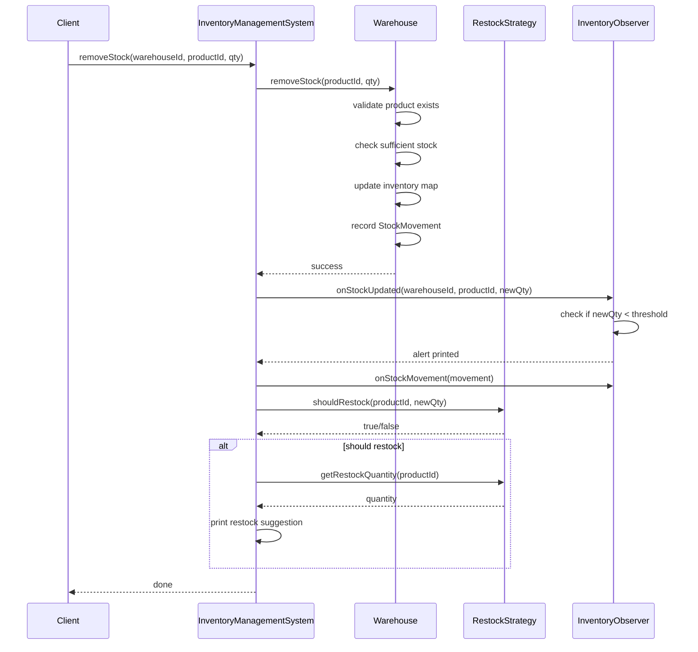

Let's walk through the flow phase by phase.

**Phase 1: Client Request.** The client calls `removeStock` on the InventoryManagementSystem with a warehouse ID, product ID, and quantity. The system looks up the warehouse and delegates the actual stock operation.

**Phase 2: Warehouse Validation and Update.** The Warehouse validates that the product exists, checks that sufficient stock is available, updates its inventory map, and records a StockMovement. If validation fails (product not found, insufficient stock), an InventoryException propagates back to the client and no further steps execute. This is important: observers never receive notifications about failed operations.

**Phase 3: Observer Notification.** After the warehouse confirms success, the system iterates through registered observers. The LowStockAlertObserver checks if the new quantity is below its threshold and prints an alert if so. The `onStockMovement` call logs the movement details.

**Phase 4: Restock Check.** Finally, the system consults the RestockStrategy. If the strategy determines restocking is needed, the system prints a restock suggestion with the recommended quantity. The strategy is consulted last because it's advisory, it doesn't modify state.

Notice that the system coordinates all post-operation activities (notification, restock checking) while the warehouse only manages its own inventory. This keeps both classes focused on their single responsibility.

---

# 5. Run and Test

---

# 6. Quiz
