> 💡 **Key Insight:**

> **QUESTION**
>
> #### What is Splitwise"
>
> **Splitwise** is a popular expense-sharing application that helps groups of people such as roommates, friends, coworkers, or travelers split bills and keep track of who owes whom.
>
> 
> <!-- Simulation: splitwise -->
> 

>
> Rather than requiring users to settle up after every expense, Splitwise allows them to **log payments** as they happen. It maintains a **running balance** for each user, tracking how much they owe or are owed.

In this chapter, we will explore the **low-level design of a splitwise like service** in detail.

Lets start by clarifying the requirements:

---

# 1. Clarifying Requirements

Before starting the design, it's important to ask thoughtful questions to uncover hidden assumptions and better define the scope of the system.

Here is an example of how a discussion between the candidate and the interviewer might unfold:

> 💡 **Key Insight:**

> **DISCUSSION**
>
> **Candidate:** "Should the system support both one-to-one and group expenses""
>
> **Interviewer:** "Yes, we should support both. Users can create individual expenses as well as group expenses involving multiple participants."
>
> **Candidate:** "Should the system support different ways of splitting an expense" For example, equal splits, exact amounts, and percentage-based splits""
>
> **Interviewer:** "Yes, we should support equal, exact and  percentage-based splits."
>
> **Candidate:** "How should we track balances" Should the system maintain who owes whom, or just a running total per user""
>
> **Interviewer:** "Maintain pairwise balances. If Alice owes Bob $50 and Bob owes Alice $20, the net balance should show Alice owes Bob $30."
>
> **Candidate:** "Should users be able to settle up partially, or should settlements be allowed only in full""
>
> **Interviewer:** "Partial settlements should be supported. Users should be able to pay back in parts and see updated balances accordingly."
>
> **Candidate:** "What happens with rounding in equal splits" For example, $100 split 3 ways is $33.33 each, but that only adds up to $99.99."
>
> **Interviewer:** "Good question. The last person in the split should absorb the rounding difference. So two people pay $33.33 and the third pays $33.34."
>
> **Candidate:** "Should we notify users when an expense is added or a settlement happens""
>
> **Interviewer:** "Yes, participants should be notified of new expenses and settlements."
>
> **Candidate:** "Do we need to handle concurrent operations" For example, two expenses being added at the same time affecting the same users""
>
> **Interviewer:** "Yes, the system should be thread-safe. Balance updates should be consistent even under concurrent modifications."
>
> **Candidate:** "Do we need to maintain a complete history of all expenses and settlements""
>
> **Interviewer: "**Yes, the system should keep a record of all expenses and payment activities so users can view their transaction history."
>
> **Candidate:** "Should we support multiple currencies or just assume a single currency for all transactions""
>
> **Interviewer:** "For now, let’s keep it simple and assume all transactions happen in a single currency."
>
> **Candidate:** "Do we need to handle user input, or can we hardcode a sequence of operations""
>
> **Interviewer:** "You can hardcode the sequence for this design. No need for user input handling."

## 1.1 Functional Requirements

- Support **adding users** with basic profile information (name, email, phone)
- Support **creating groups** of users for shared expenses
- Support adding expenses with three **split types**: equal, exact amounts, and percentage-based
- Track **pairwise net balances** between users (who owes whom and how much)
- Support **partial** and **full** settlements between any two users
- **Notify** users when expenses are added or settlements occur
- Handle **rounding differences** in equal splits so the total always matches

## 1.2 Non-Functional Requirements

- The design should follow **object-oriented principles** with clear separation of concerns
- The system should handle **concurrent expense** additions without race conditions
- The system should be **modular** and **extensible** to support new split types
- The components should be **testable** in isolation

After the requirements are clear, lets identify the core entities/objects we will have in our system.

---

# 2. Identifying Core Entities

> [!PAYWALL] This content is for premium members only.

How do you go from a list of requirements to actual classes" The key is to look for **nouns** in the requirements that have distinct attributes or behaviors. Not every noun becomes a class, but this approach gives you a starting point.

Let's walk through our requirements and identify what needs to exist in our system.

### 2.1 Split Types

> "Support all three: equal, exact amounts, and percentage-based splits"

We need a way to categorize how an expense is divided. This gives us a `SplitType` enum with values `EQUAL`, `EXACT`, `PERCENTAGE`. Each type has fundamentally different calculation and validation logic, which will drive the Strategy pattern later.

### 2.2 Users

> "Support adding users with basic profile information"

Every expense involves people. A `User` holds an ID, name, email, and phone number. Users are simple data containers. They don't change once created, and they don't contain business logic.

### 2.3 Splits

> "Support equal, exact amounts, and percentage-based splits"

When an expense is split, each participant gets a `Split` object that tracks their user ID and the amount they owe. But different split types need different data. An equal split doesn't need extra info (the amount is calculated). An exact split has a fixed amount. A percentage split needs the percentage value so we can compute the amount later.

This gives us a `Split` base class and three subclasses: **EqualSplit**, **ExactSplit**, and **PercentageSplit**. The class hierarchy makes invalid states unrepresentable. You can't accidentally create a "percentage split" without specifying the percentage.

### 2.4 Expenses

> "Add expenses with three split types"

An `Expense` records what was paid, who paid it, how it was split, and when it happened. Each expense has an ID, amount, description, the paying user's ID, the split type, a list of splits, an optional group ID, and a creation timestamp. Expenses are immutable once created. You don't edit a past expense, you create a new one to correct it.

### 2.5 Split Strategies

> "Support different ways of splitting an expense"

Equal splits divide evenly (with rounding handling). Exact splits validate that amounts sum to the total. Percentage splits validate percentages sum to 100 and compute dollar amounts. Instead of hardcoding this logic, we use a `SplitStrategy` interface with three implementations: **EqualSplitStrategy**, **ExactSplitStrategy**, and **PercentageSplitStrategy**.

### 2.6 Groups

> "Users should be able to create groups and track group expenses"

A `Group` holds an ID, name, member IDs, and a list of expense IDs associated with the group. Groups are organizational containers. The actual balance tracking happens elsewhere.

### 2.7 Balance Sheet

> "Maintain pairwise balances. If Alice owes Bob $50 and Bob owes Alice $20, the net balance should show Alice owes Bob $30."

This is the most interesting data structure in the problem. A `BalanceSheet` tracks net debts between every pair of users. It's essentially a graph where nodes are users and edge weights are net balances. When Alice pays for something and Bob owes $50, we update the Alice-Bob edge. When Bob pays for something and Alice owes $20, the edge adjusts to $30.

The BalanceSheet also handles settlements. When Bob pays Alice $30, the edge drops to zero.

### 2.8 Notifications

> "Participants should be notified of new expenses and settlements"

When an expense is added or a settlement happens, participants need to know. An `ExpenseObserver` interface allows different notification implementations (email, push, SMS) without the service caring about delivery details.

### 2.9 Entity Overview

Here's how these entities relate to each other:

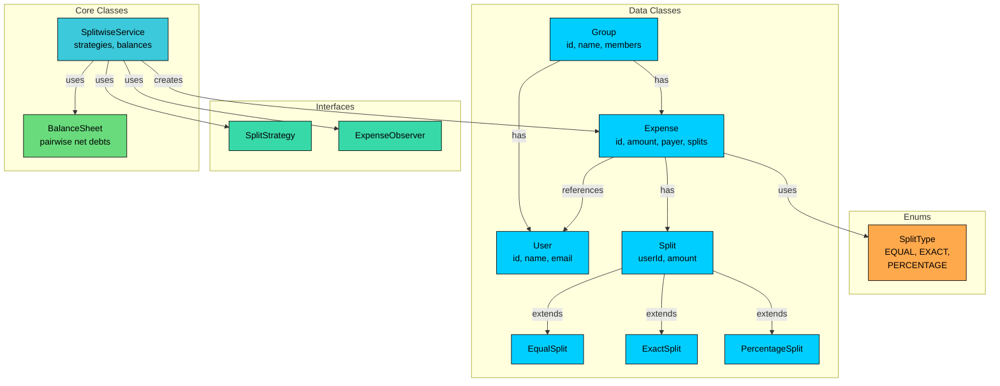

We've identified four types of entities:

**Enums** define fixed sets of values. SplitType categorizes how expenses are divided, providing type safety and driving strategy selection.

**Data Classes** primarily hold data with minimal behavior. User, Split (with its hierarchy), Expense, and Group are containers with straightforward structure.

**Interfaces** define contracts for interchangeable behavior. SplitStrategy allows different split algorithms to be swapped in. ExpenseObserver allows different notification implementations.

**Core Classes** contain the main logic. BalanceSheet manages the pairwise debt graph. SplitwiseService orchestrates the entire system as a singleton facade.

| Entity | Type | Responsibility |
|--------|------|----------------|
| `SplitType` | Enum | Split categories: EQUAL, EXACT, PERCENTAGE |
| `User` | Data Class | User profile (id, name, email, phone) |
| `Split` | Data Class (Base) | Tracks a participant's user ID and owed amount |

| `Expense` | Data Class | Records who paid, how much, and how it was split |
| `Group` | Data Class | Organizational container for users and expenses |
| `SplitStrategy` | Interface | Contract for split validation and calculation |
| `ExpenseObserver` | Interface | Contract for expense and settlement event handling |
| `BalanceSheet` | Core Class | Pairwise net debt tracking (adjacency matrix) |
| `SplitwiseService` | Core Class (Singleton) | Orchestrates expenses, settlements, and notifications |

With our entities identified, let's define their attributes, behaviors, and relationships.

---

# 3. Designing Classes and Relationships

Now that we know what entities we need, let's flesh out their details. For each class, we'll define what data it holds (attributes) and what it can do (methods). Then we'll look at how these classes connect to each other.

## 3.1 Class Definitions

We'll work bottom-up: simple types first, then data containers, then the classes with real logic. This order makes sense because complex classes depend on simpler ones.

### Enums

Enums define fixed sets of values that provide type safety and make code self-documenting. Using enums prevents invalid states at compile time rather than runtime.

#### `SplitType`

We need a way to tell the system how an expense should be divided among participants. We could use raw strings like "equal" or "percentage", but that opens the door to typos and invalid values. What stops someone from passing "equl" or "by-weight""

**SplitType** represents the three supported ways to split an expense.

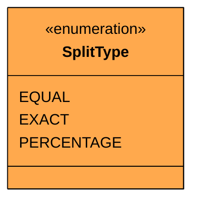

| Value | Meaning | Strategy Behavior |
|-------|---------|-------------------|
| `EQUAL` | Divide expense evenly among participants | Calculates equal shares, last absorbs rounding |
| `EXACT` | Each participant owes a specific amount | Validates amounts sum to total |
| `PERCENTAGE` | Each participant owes a percentage of total | Validates percentages sum to 100, computes amounts |

This enum does double duty. It labels the split type on an expense, and it serves as a key to look up the corresponding SplitStrategy implementation. When the service receives a `SplitType.PERCENTAGE` expense, it uses the enum to grab the `PercentageSplitStrategy` from a map. No switch statements needed.

Now that we can categorize how expenses are split, we need something to represent the people involved.

### Custom Exceptions

Before we define classes that can fail, let's define how they fail. Generic exceptions like `RuntimeException` don't communicate what went wrong. A caller catching a generic exception has no idea if it was a bad split, a missing user, or a missing group.

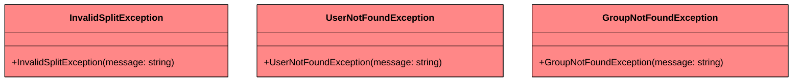

Three custom exceptions cover our three failure modes:

- **InvalidSplitException** when split validation fails (amounts don't add up, percentages don't sum to 100)
- **UserNotFoundException** when an operation references a user ID that doesn't exist in the system
- **GroupNotFoundException** when an operation references a group ID that doesn't exist

Each extends the runtime exception base so callers aren't forced to handle them, but can choose to when they need to distinguish failure modes.

### Data Classes

Data classes are simple containers that hold data with minimal behavior. They represent the "nouns" in our system that have attributes but limited logic.

#### `User`

Every expense involves people. A user has a name, email, and phone number, none of which change after registration. This is a straightforward immutable data class.

**User** represents a registered participant in the system.

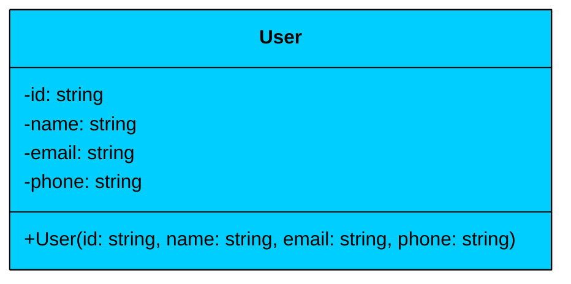

| Attribute | Type | Description | Mutable" |
|-----------|------|-------------|----------|
| `id` | string | Unique user identifier | No |
| `name` | string | User's display name | No |
| `email` | string | Email address for notifications | No |
| `phone` | string | Phone number | No |

The User class is **immutable**. All fields are read-only, set once at construction. There's no business logic here. User is purely a data holder, which is appropriate because user behavior (paying, splitting, settling) lives in the service layer, not on the user object.

With users defined, we need something to represent each person's share of an expense.

#### `Split (Base Class)`

When an expense is split among participants, each participant gets a split object that records their user ID and how much they owe. But different split types carry different data. An equal split just needs a user ID (the amount is computed). An exact split needs a user ID and a fixed amount. A percentage split needs a user ID and a percentage.

We could use a single class with nullable fields, but that makes invalid states representable. A "percentage split" with no percentage field" A "split" where both percentage and exact amount are set" A class hierarchy eliminates these ambiguities.

**Split** is the base class representing one participant's share of an expense.

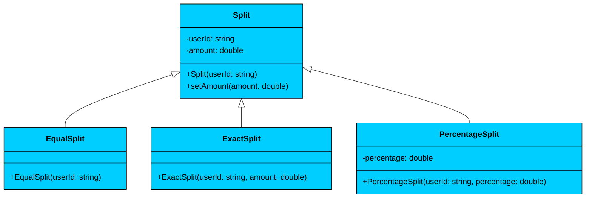

| Class | Additional Fields | How Amount Is Set |
|-------|-------------------|-------------------|
| `EqualSplit` | None | Strategy calculates and sets via `setAmount()` |
| `ExactSplit` | None (amount set in constructor) | Caller provides the exact amount upfront |
| `PercentageSplit` | `percentage: double` | Strategy computes amount from percentage and total |

The `amount` field on the base Split class is mutable because for equal and percentage splits, the strategy needs to compute and set it after construction. The `userId` is immutable since a split always belongs to the same participant.

**Relationship:** Split and its subclasses use **inheritance**. EqualSplit, ExactSplit, and PercentageSplit extend Split. This is appropriate because each subclass IS a Split with the same core identity (userId + amount), just carrying different supplementary data.

Now that we can represent each participant's share, we need something to hold the full expense record.

#### `Expense`

An expense records the full picture: who paid, how much, what for, how it was split, and when. Once created, an expense shouldn't change. You don't retroactively modify a restaurant bill. If something was wrong, you create a new corrective expense.

**Expense** represents a completed expense record.

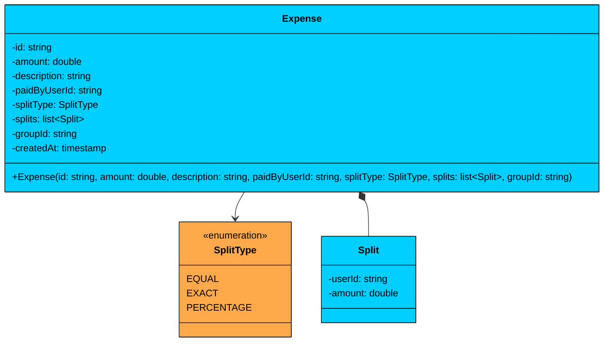

| Attribute | Type | Description | Mutable" |
|-----------|------|-------------|----------|
| `id` | string | Unique expense identifier | No |
| `amount` | double | Total expense amount | No |
| `description` | string | What the expense was for | No |
| `paidByUserId` | string | ID of the user who paid | No |
| `splitType` | SplitType | How the expense is divided | No |
| `splits` | list\<Split\> | Each participant's share | No (list reference) |
| `groupId` | string | Associated group (null if no group) | No |
| `createdAt` | timestamp | When the expense was created | No |

**Relationship:** Expense has a **composition** relationship with Split. The Expense owns its list of splits. When the Expense ceases to exist, the splits are meaningless on their own. The splits list is stored as an unmodifiable collection to enforce immutability.

The `groupId` is nullable. Personal expenses between two users don't need a group. This avoids forcing every expense into a group just for organizational convenience.

With expenses covered, let's add groups to organize them.

#### `Group`

Groups are organizational containers that let users track expenses for shared contexts like trips, apartments, or regular dinners. The group itself doesn't compute balances or manage splits. It just holds references to its members and associated expenses.

**Group** represents a collection of users sharing expenses.

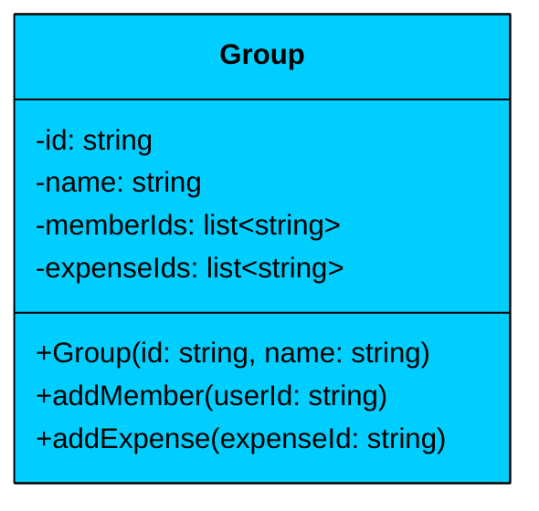

| Attribute | Type | Description | Mutable" |
|-----------|------|-------------|----------|
| `id` | string | Unique group identifier | No |
| `name` | string | Group display name (e.g., "Trip to Goa") | No |
| `memberIds` | list\<string\> | IDs of users in the group | Yes (add members) |
| `expenseIds` | list\<string\> | IDs of expenses in the group | Yes (add expenses) |

| Method | Description |
|--------|-------------|
| `Group(id, name)` | Constructor, creates empty member and expense lists |
| `addMember(userId)` | Adds a user to the group |
| `addExpense(expenseId)` | Associates an expense with the group |

Groups store IDs rather than object references. This keeps groups lightweight and avoids circular dependencies. When you need the actual User or Expense objects, you look them up in the service's maps.

> 💡 **Key Insight:**

> **Design Alternative**
>
> We could store full User and Expense objects inside the Group. This would make lookups faster (no map access needed) but creates tight coupling and raises questions about which object is the "source of truth" when a user's data changes. We chose ID-based references because they're simpler and avoid these ownership ambiguities.

Now that we have our data classes, we need interfaces that define interchangeable behaviors.

### Interfaces

Interfaces define contracts for interchangeable behavior. They enable the Strategy and Observer patterns without the client code needing to know which implementation it's talking to.

#### `SplitStrategy`

Different split types need different logic. Equal splits divide evenly, exact splits validate sums, percentage splits convert percentages to amounts. We could hardcode all three in one method with a switch statement, but that makes adding a fourth split type (say, "by shares") require modifying existing code.

**SplitStrategy** defines the contract that all split calculation algorithms must follow.

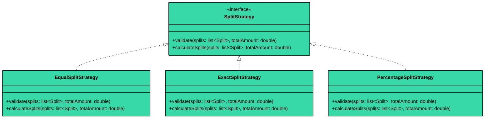

The two-method interface separates concerns: `validate()` checks correctness (do the splits make mathematical sense"), and `calculateSplits()` fills in the computed amounts. Validation runs first, and only if it passes does calculation proceed. This separation means a bad input fails fast with a clear error rather than producing silently wrong results.

**EqualSplitStrategy** divides the total evenly and assigns the rounding remainder to the last participant. **ExactSplitStrategy** validates that the provided amounts sum to the total. **PercentageSplitStrategy** validates percentages sum to 100 and converts each percentage to a dollar amount.

#### `ExpenseObserver`

When an expense is added or a settlement happens, interested parties need to be notified. If the service directly calls notification code, it becomes tightly coupled to every notification channel. Adding SMS notifications would mean modifying the service class.

**ExpenseObserver** defines the contract for receiving expense and settlement events.

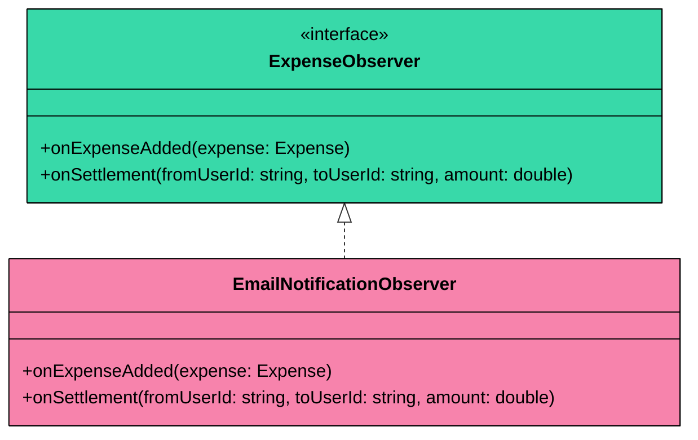

The observer has two methods because expenses and settlements are fundamentally different events. An expense carries the full Expense object (who paid, how it was split). A settlement is simpler: who paid whom and how much. Separate methods let observers handle each event type differently.

### Core Classes

Core classes contain the actual system logic. They coordinate between data classes, apply strategies, and manage state.

#### `BalanceSheet`

This is the most interesting class in the entire design. The balance sheet tracks who owes whom across all expenses and settlements. It's essentially an adjacency matrix for a directed graph where nodes are users and edge weights are net balances.

**BalanceSheet** manages pairwise net debts between all users.

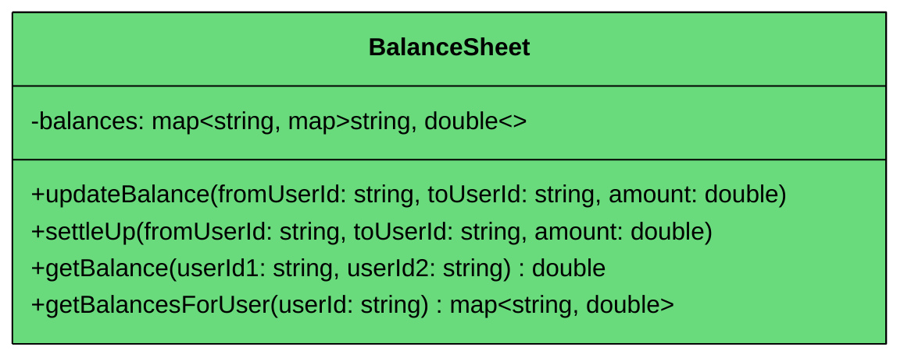

| Attribute | Type | Description | Mutable" |
|-----------|------|-------------|----------|
| `balances` | map\<string, map\<string, double\>\> | Nested map: balances[A][B] = how much A owes B | Yes (updates on every expense/settlement) |

| Method | Description |
|--------|-------------|
| `updateBalance(from, to, amount)` | Increases `from`'s debt to `to` by `amount`, mirrors in reverse |
| `settleUp(from, to, amount)` | Decreases `from`'s debt to `to` by `amount`, mirrors in reverse |
| `getBalance(user1, user2)` | Returns how much user1 owes user2 (positive = owes, negative = is owed) |
| `getBalancesForUser(userId)` | Returns a snapshot of all balances involving this user |

The key insight is **mirror updates**. When we record that Alice owes Bob $50, we also record that Bob is owed $50 by Alice (stored as -$50 in the reverse direction). This means `balances["Alice"]["Bob"] = 50` and `balances["Bob"]["Alice"] = -50` are always in sync. Looking up the balance from either direction gives a consistent answer.

The `getBalancesForUser()` method returns a **defensive copy** of the internal map. Callers get a snapshot they can read or modify freely without affecting the balance sheet's internal state.

This brings us to the class that ties everything together.

#### `SplitwiseService`

The service is the single entry point for all operations. External code doesn't interact with strategies, the balance sheet, or observers directly. It talks to SplitwiseService, which coordinates everything behind the scenes.

**SplitwiseService** is the singleton facade that orchestrates all expense operations.

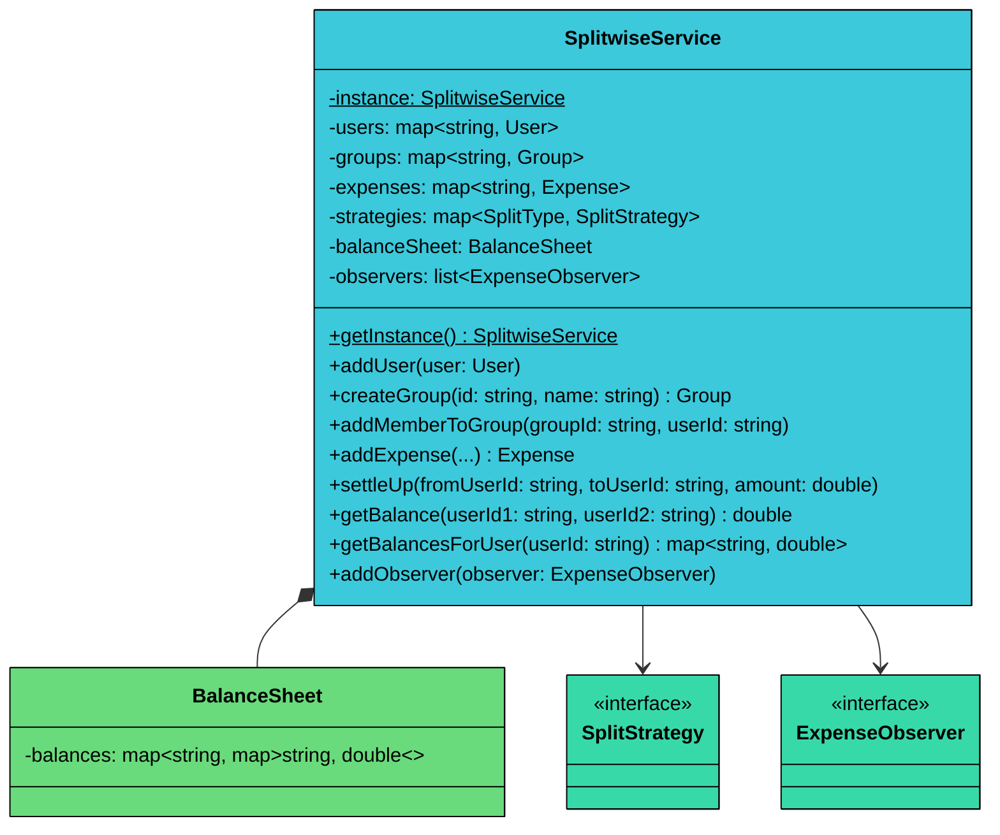

| Attribute | Type | Description |
|-----------|------|-------------|
| `instance` | SplitwiseService (static) | Singleton instance |
| `users` | map\<string, User\> | Registered users, keyed by ID |
| `groups` | map\<string, Group\> | Created groups, keyed by ID |
| `expenses` | map\<string, Expense\> | All expenses, keyed by ID |
| `strategies` | map\<SplitType, SplitStrategy\> | Strategy lookup by split type |
| `balanceSheet` | BalanceSheet | Pairwise balance tracker |
| `observers` | list\<ExpenseObserver\> | Event listeners |

| Method | Description |
|--------|-------------|
| `getInstance()` | Returns the singleton instance |
| `addUser(user)` | Registers a user in the system |
| `createGroup(id, name)` | Creates a new group |
| `addMemberToGroup(groupId, userId)` | Adds a user to a group |
| `addExpense(...)` | Creates an expense, validates splits, updates balances, notifies observers |
| `settleUp(from, to, amount)` | Records a settlement between two users |
| `getBalance(user1, user2)` | Returns net balance between two users |
| `getBalancesForUser(userId)` | Returns all balances for a user |
| `addObserver(observer)` | Registers an event listener |

#### **Key Design Principles**

1. **Singleton Pattern:** Ensures one SplitwiseService with consistent state. All operations go through the same instance.
2. **Facade Pattern:** External code only interacts with SplitwiseService. It doesn't need to know about strategies, the balance sheet, or how observers work.
3. **Strategy Delegation:** The service looks up the right SplitStrategy from a map using the SplitType. It delegates validation and calculation without knowing HOW any strategy works.
4. **Observer Notification:** After every expense or settlement, all registered observers are notified. The service doesn't know or care who's listening.

**Relationship:** SplitwiseService has a **composition** relationship with BalanceSheet. The service creates and owns the balance sheet. When the service is destroyed, the balance sheet goes with it. In contrast, it has an **association** with Users and Groups, which are looked up by ID and could conceptually exist independently.

---

## 3.2 Key Design Patterns

You might notice some structural patterns emerging in our design. Let's make them explicit and justify why each pattern is appropriate here.

The core challenges are providing interchangeable split algorithms, broadcasting events, and managing a single service instance. That naturally calls for 3 design patterns: Strategy, Observer, and Singleton. We don't have complex state transitions (expenses are immutable once created), so the State pattern is not needed

### [**Strategy Pattern**](/learn/lld/strategy)** ** (Split Calculation)

**The Problem:** Expenses can be split three different ways: equally, by exact amounts, or by percentages. Each approach has different validation rules and different calculation logic. If we put all three in one method with a switch statement, every new split type requires modifying that method. We'd also be mixing validation, calculation, and error handling for three unrelated algorithms in one place.

**The Solution:** The Strategy pattern encapsulates each split algorithm in its own class. SplitwiseService holds a map from SplitType to SplitStrategy and delegates to the appropriate one.

We have three algorithms today and could easily need more (split by shares, split by income ratio). Each algorithm has fundamentally different validation logic. The Strategy pattern gives us:

- **Open/Closed:** Adding a new split type means adding a new class and one map entry, zero modification to existing code
- **Testability:** Each strategy can be unit tested in isolation with its own edge cases
- **Clean separation:** Rounding logic for equal splits doesn't intermingle with percentage validation

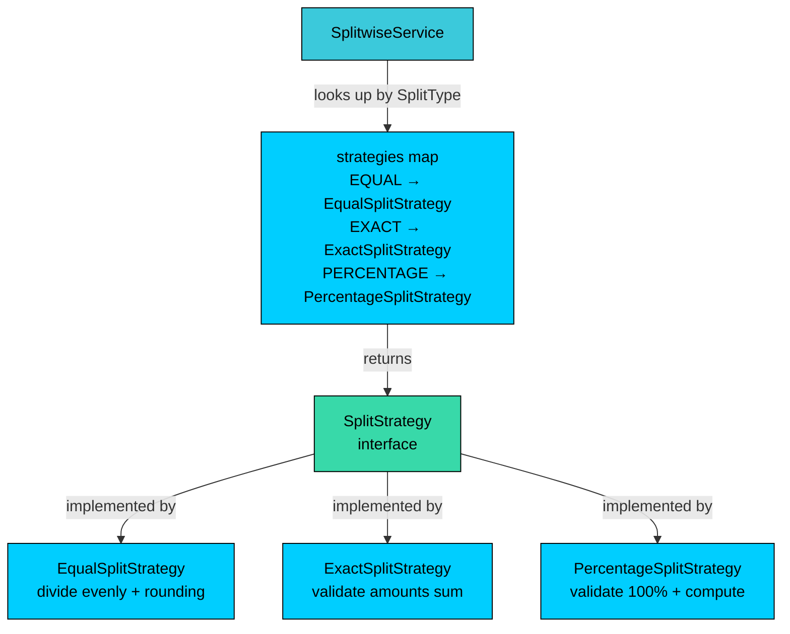

### [**Observer Pattern**](/learn/lld/observer)** **(Notifications)

**The Problem:** When an expense is added or a settlement happens, multiple parties need to know: users need notifications, an activity log might need to record the event, and analytics might need to track spending patterns. If SplitwiseService directly calls all these components, it becomes tightly coupled to every consumer.

**The Solution:** The Observer pattern lets SplitwiseService broadcast events to all registered listeners. Each observer decides what to do with the event independently.

Direct method calls (e.g., `emailService.sendNotification()`) work when there's one listener. But our requirements mention notifications, and in a real system you'd add logging, analytics, and push notifications. The Observer pattern scales to any number of listeners without modifying the event source.

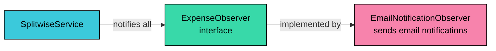

### [**Singleton Pattern**](/learn/lld/singleton) (SplitwiseService)

**The Problem:** We need a single, globally accessible SplitwiseService that maintains consistent state for all users, expenses, and balances. Multiple instances would create chaos, with expenses registered in one instance but balances tracked in another.

**The Solution:** The Singleton pattern ensures only one SplitwiseService instance exists, providing a global access point via `getInstance()`.

Singleton is appropriate here because we genuinely need one service with consistent state, and it acts as a facade for the entire system. The thread-safe initialization (lazy with locking) prevents race conditions during startup.

---

## 3.3 Full Class Diagram

```mermaid
classDiagram
    %% Enums
    class SplitType {
        <<enumeration>>
        EQUAL
        EXACT
        PERCENTAGE
    }

    %% Exceptions
    class InvalidSplitException {
        +InvalidSplitException(message: string)
    }
    class UserNotFoundException {
        +UserNotFoundException(message: string)
    }
    class GroupNotFoundException {
        +GroupNotFoundException(message: string)
    }

    %% Data Classes
    class User {
        -id: string
        -name: string
        -email: string
        -phone: string
    }

    class Split {
        -userId: string
        -amount: double
        +setAmount(amount: double)
    }

    class EqualSplit {
        +EqualSplit(userId: string)
    }

    class ExactSplit {
        +ExactSplit(userId: string, amount: double)
    }

    class PercentageSplit {
        -percentage: double
        +PercentageSplit(userId: string, percentage: double)
    }

    class Expense {
        -id: string
        -amount: double
        -description: string
        -paidByUserId: string
        -splitType: SplitType
        -splits: list~Split~
        -groupId: string
        -createdAt: timestamp
    }

    class Group {
        -id: string
        -name: string
        -memberIds: list~string~
        -expenseIds: list~string~
        +addMember(userId: string)
        +addExpense(expenseId: string)
    }

    %% Interfaces
    class SplitStrategy {
        <<interface>>
        +validate(splits: list~Split~, totalAmount: double)
        +calculateSplits(splits: list~Split~, totalAmount: double)
    }

    class ExpenseObserver {
        <<interface>>
        +onExpenseAdded(expense: Expense)
        +onSettlement(from: string, to: string, amount: double)
    }

    %% Strategy Implementations
    class EqualSplitStrategy {
        +validate(splits: list~Split~, totalAmount: double)
        +calculateSplits(splits: list~Split~, totalAmount: double)
    }

    class ExactSplitStrategy {
        +validate(splits: list~Split~, totalAmount: double)
        +calculateSplits(splits: list~Split~, totalAmount: double)
    }

    class PercentageSplitStrategy {
        +validate(splits: list~Split~, totalAmount: double)
        +calculateSplits(splits: list~Split~, totalAmount: double)
    }

    %% Observer Implementation
    class EmailNotificationObserver {
        +onExpenseAdded(expense: Expense)
        +onSettlement(from: string, to: string, amount: double)
    }

    %% Core Classes
    class BalanceSheet {
        -balances: map~string, map~string, double~~
        +updateBalance(from: string, to: string, amount: double)
        +settleUp(from: string, to: string, amount: double)
        +getBalance(user1: string, user2: string) double
        +getBalancesForUser(userId: string) map~string, double~
    }

    class SplitwiseService {
        -instance: SplitwiseService$
        -users: map~string, User~
        -groups: map~string, Group~
        -expenses: map~string, Expense~
        -strategies: map~SplitType, SplitStrategy~
        -balanceSheet: BalanceSheet
        +getInstance()$ SplitwiseService
        +addExpense(...) Expense
        +settleUp(from: string, to: string, amount: double)
    }

    %% Relationships - FULLY CONNECTED
    %% Inheritance
    Split <|-- EqualSplit
    Split <|-- ExactSplit
    Split <|-- PercentageSplit

    %% Interface implementations
    SplitStrategy <|.. EqualSplitStrategy
    SplitStrategy <|.. ExactSplitStrategy
    SplitStrategy <|.. PercentageSplitStrategy
    ExpenseObserver <|.. EmailNotificationObserver

    %% Enum connections
    Expense --> SplitType : uses

    %% Composition
    Expense *-- Split : contains
    SplitwiseService *-- BalanceSheet : owns

    %% Association
    Expense --> User : paid by
    Group --> User : members
    Group --> Expense : tracks

    %% System connections
    SplitwiseService --> User : manages
    SplitwiseService --> Group : manages
    SplitwiseService --> Expense : creates
    SplitwiseService --> SplitStrategy : delegates to
    SplitwiseService --> ExpenseObserver : notifies

    %% Exception connections
    SplitStrategy --> InvalidSplitException : throws
    SplitwiseService --> UserNotFoundException : throws
    SplitwiseService --> GroupNotFoundException : throws

    %% Styles
    style SplitType fill:#ffa94d,stroke:#000,color:#000
    style InvalidSplitException fill:#ff8787,stroke:#000,color:#000
    style UserNotFoundException fill:#ff8787,stroke:#000,color:#000
    style GroupNotFoundException fill:#ff8787,stroke:#000,color:#000
    style User fill:#00ceff,stroke:#000,color:#000
    style Split fill:#00ceff,stroke:#000,color:#000
    style EqualSplit fill:#00ceff,stroke:#000,color:#000
    style ExactSplit fill:#00ceff,stroke:#000,color:#000
    style PercentageSplit fill:#00ceff,stroke:#000,color:#000
    style Expense fill:#00ceff,stroke:#000,color:#000
    style Group fill:#00ceff,stroke:#000,color:#000
    style SplitStrategy fill:#38d9a9,stroke:#000,color:#000
    style ExpenseObserver fill:#38d9a9,stroke:#000,color:#000
    style EqualSplitStrategy fill:#38d9a9,stroke:#000,color:#000
    style ExactSplitStrategy fill:#38d9a9,stroke:#000,color:#000
    style PercentageSplitStrategy fill:#38d9a9,stroke:#000,color:#000
    style EmailNotificationObserver fill:#f783ac,stroke:#000,color:#000
    style BalanceSheet fill:#69db7c,stroke:#000,color:#000
    style SplitwiseService fill:#3bc9db,stroke:#000,color:#000
```

---

# 4. Code Implementation

Now let's implement the above design. We'll follow the same bottom-up order from Section 3: enums first, then exceptions, data classes, interfaces, strategy implementations, observer implementations, core classes, and finally the demo that ties everything together.

#### Java

## 4.1 Enums

### SplitType

`SplitType` categorizes how an expense is divided. It also serves as a lookup key for the strategy map in SplitwiseService.

Three values, no extra fields. The enum is intentionally minimal because the behavioral differences are handled by the Strategy classes, not by the enum itself.

## 4.2 Exceptions

### InvalidSplitException

This exception is thrown when split validation fails, such as when exact amounts don't sum to the total or percentages don't sum to 100.

### UserNotFoundException

Thrown when an operation references a user ID that doesn't exist in the system.

### GroupNotFoundException

Thrown when an operation references a group ID that doesn't exist.

All three extend `RuntimeException` so callers aren't forced to handle them. The distinct types let callers catch and handle specific failures when they need to.

## 4.3 Data Classes

### User

The User class is a simple immutable container. All fields are `final` and set once at construction.

The constructor validates that `id` and `name` are not null, since a user without an identity is meaningless. Email and phone are nullable since they're optional for the core split functionality.

### Split

The Split class is the base for all split types. It holds a user ID and an amount. The amount is mutable because for equal and percentage splits, the strategy computes it after construction.

### EqualSplit

EqualSplit adds nothing to the base Split. Its type identity is enough for the strategy to know that it should calculate the amount by dividing evenly.

### ExactSplit

ExactSplit sets the amount at construction time. The caller provides the exact dollar amount this participant owes.

### PercentageSplit

PercentageSplit carries a percentage field. The strategy uses this percentage to compute the dollar amount from the total expense.

The `percentage` field is `final` because a participant's share percentage shouldn't change after the split is created. If you need a different percentage, create a new PercentageSplit.

### Expense

The Expense class is fully immutable. Every field is `final`, and the splits list is wrapped in `Collections.unmodifiableList()` to prevent external modification.

The splits list is defensively copied before being made unmodifiable. This prevents the caller from modifying the original list and having those changes appear inside the Expense. Once created, the expense is a sealed record of what happened.

### Group

Groups are mutable containers. Members and expenses can be added over time, but the group's identity (id, name) is fixed.

The `addMember()` method checks for duplicates to prevent the same user from being added twice. The getter methods return unmodifiable views to prevent external code from directly modifying the internal lists.

## 4.4 Interfaces

Now we define the contracts that our strategy and observer classes will implement.

### SplitStrategy

### ExpenseObserver

Two minimal interfaces. `SplitStrategy` separates validation from calculation because failing fast on bad input is better than computing wrong results. `ExpenseObserver` has two methods because expenses and settlements are distinct events with different data.

## 4.5 Strategy Implementations

Each strategy encapsulates one split algorithm. Let's start with the most interesting one.

### EqualSplitStrategy

The equal split strategy divides the total evenly among all participants. The tricky part is rounding. $100 split 3 ways is $33.33 each, but 33.33 * 3 = $99.99. Someone has to absorb the penny. We assign it to the last person in the list.

The rounding approach is simple but correct: round each share to 2 decimal places, then give the last person whatever's left. For $100 / 3: two people pay $33.33, the third pays $33.34. The total always matches.

### ExactSplitStrategy

The exact split strategy validates that the provided amounts sum to the total. There's nothing to calculate since the amounts are already set.

The validation uses an epsilon of 0.01 (one cent) rather than exact equality. Floating-point arithmetic can introduce tiny errors (0.1 + 0.2 = 0.30000000000000004), so we tolerate a one-cent difference.

### PercentageSplitStrategy

The percentage split strategy validates that percentages sum to 100, then converts each percentage to a dollar amount. Like the equal strategy, it handles rounding by giving the remainder to the last person.

The validation also checks that all splits are actually `PercentageSplit` instances. Passing an `ExactSplit` to a percentage strategy is a programming error that should fail fast.

## 4.6 Observer Implementations

### EmailNotificationObserver

This observer prints email-style notifications for expenses and settlements. In a production system, this would call an actual email service.

The observer doesn't need to know about strategies, balance sheets, or groups. It just receives events and acts on them. This is the power of the Observer pattern: each observer is completely independent.

## 4.7 Core Classes

### BalanceSheet

The BalanceSheet is the most complex class in the system. It maintains a nested map tracking pairwise net debts between all users. Every update modifies both directions simultaneously to keep the balance symmetric.

The `synchronized` keyword on `updateBalance()` and `settleUp()` ensures the entire read-modify-write sequence is atomic. Without it, two threads could read the same balance, compute different updates, and overwrite each other's results.

The `settleUp()` method reuses `updateBalance()` with a negative amount. This is elegant because settlement is mathematically the inverse of adding debt. If Bob owes Alice $100 and settles $30, we update the balance by -$30, leaving Bob owing Alice $70.

The `getBalancesForUser()` method returns a `new HashMap<>()` copy, not the internal `ConcurrentHashMap`. This prevents callers from modifying the internal state and avoids leaking the concurrent implementation detail.

### SplitwiseService

The SplitwiseService ties everything together. It's a singleton that coordinates users, groups, expenses, strategies, the balance sheet, and observers.

The `addExpense()` method is the most complex. Let's trace through what happens step by step:

1. **Validate the payer exists** to catch errors early
2. **Look up the strategy** using the `SplitType` as a key in the strategies map
3. **Validate and calculate** using the strategy (this is where `InvalidSplitException` gets thrown if splits are invalid)
4. **Create the immutable Expense** object
5. **Associate with group** if it's a group expense
6. **Update balances** for each participant who isn't the payer
7. **Notify all observers** about the new expense

Step 5 skips the payer's own split. If Alice pays $300 and the expense is split equally among Alice, Bob, and Charlie, Alice owes herself $100. That doesn't make sense, so we skip it and only update Bob -> Alice and Charlie -> Alice balances.

## 4.8 Demo

The demo exercises all three split types, a settlement, and shows the final balances.

## Sequence Diagram: Add Expense Flow

The following diagram shows the most complex operation in the system, adding an expense with strategy validation, balance updates, and observer notification:

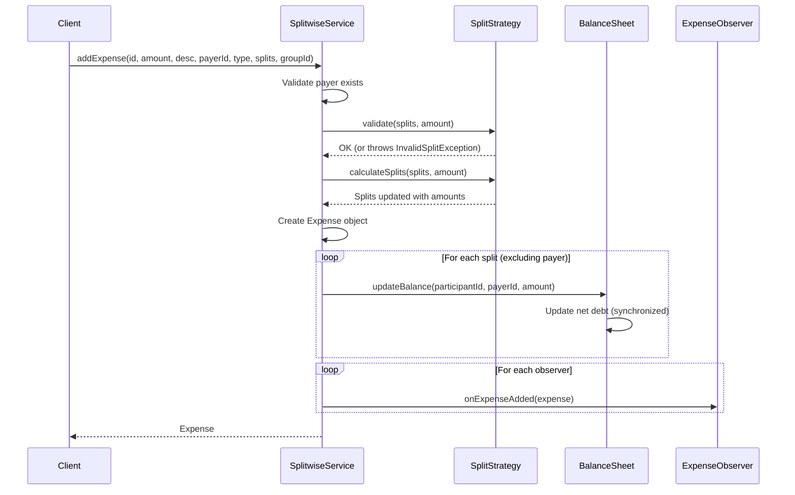

Let's walk through the phases of this flow to understand what happens and what could go wrong.

#### **Phase 1: Validation (fail-fast)**

The service first checks that the payer exists in the user registry. If not, it throws `UserNotFoundException` immediately. No strategy is invoked, no balance is updated, no observer is notified. The system state is unchanged. Next, the service delegates to the appropriate `SplitStrategy.validate()`, which checks the mathematical consistency of the splits (amounts sum to total, percentages sum to 100). If validation fails, `InvalidSplitException` is thrown. Again, nothing has been modified yet.

#### **Phase 2: Calculation**

Once validation passes, the strategy computes the actual dollar amounts. For equal splits, this is where the division and rounding happen. For percentage splits, this converts percentages to amounts. For exact splits, this is a no-op since amounts are already set.

#### **Phase 3: Balance Updates**

The service iterates through each split and updates the balance sheet for every participant except the payer. The payer's own split is skipped because you don't owe yourself money. Each `updateBalance()` call is synchronized, so concurrent updates to the same user pair are atomic.

#### **Phase 4: Observer Notification**

After all balance updates complete, observers are notified. This happens last because we want to ensure the system is in a consistent state before broadcasting events. If an observer throws an exception, it shouldn't corrupt the balance data.

---

# 5. Run and Test

---

# 6. Quiz
