> 💡 **Key Insight:**

> **What is Amazon Locker"**
>
> An **Amazon Locker** is a **self-service parcel pickup location** where customers can receive and collect their online orders securely instead of having them delivered to their home.
>
> 
> <!-- Simulation: amazon-locker -->
> 

>
> It works like a smart storage cabinet placed in public places such as malls, metro stations, grocery stores, or office buildings.

In this chapter, we will explore the **low-level design of Amazon Locker** in detail.

Let's start by clarifying the requirements:

---

# 1. Clarifying Requirements

Before starting any design, it's important to ask thoughtful questions to uncover hidden assumptions, clarify ambiguities, and define the system's scope. In an interview setting, this dialogue demonstrates that you think before you code.

Here is an example of how a discussion between the candidate and the interviewer might unfold:

> 💡 **Key Insight:**

> **DISCUSSION**
>
> **Candidate:** "What sizes of lockers are available" Are they all the same, or do we have different sizes for different packages""
>
> **Interviewer:** "There are four locker sizes: small, medium, large, and extra-large. Each size has maximum height, width, and depth dimensions. A package should be assigned to the smallest locker that fits it."
>
> **Candidate:** "How does the system decide which locker to assign" Do we just pick any available one, or is there a specific strategy""
>
> **Interviewer:** "Assign the smallest locker that can fit the package. If no locker of the exact size is available, try the next size up. The assignment algorithm should be pluggable so we can swap in different strategies later."
>
> **Candidate:** "What format is the pickup code, and how long does the customer have to pick up their package""
>
> **Interviewer:** "A 6-digit numeric code. The customer has 3 days to pick up the package before it's considered expired and gets returned."
>
> **Candidate:** "Can the system manage multiple locker locations, like different buildings or neighborhoods""
>
> **Interviewer:** "Yes. Each location has its own address and its own set of lockers. A delivery targets a specific location."
>
> **Candidate:** "Should we handle concurrent access" For instance, two delivery agents dropping off packages at the same location at the same time""
>
> **Interviewer:** "Yes. The system should be thread-safe. Two agents delivering simultaneously should never be assigned the same locker."
>
> **Candidate:** "How does the customer get notified about the pickup code and locker details""
>
> **Interviewer:** "Through a notification service. For this design, simulate it with console output, but the notification mechanism should be pluggable so we can swap in SMS, email, or push notifications later."

After gathering the details, we can summarize the key system requirements.

## 1.1 Functional Requirements

- Deliver a package to an available locker at a specific location
- Generate a **unique 6-digit pickup code** with a 3-day expiration window
- **Validate** the pickup code and release the package to the customer
- Assign the smallest available locker that fits the package, trying larger sizes if needed
- Automatically **return** expired packages and free their lockers
- **Notify the customer** with the pickup code, locker location, and expiration time
- Support **multiple locker locations**, each with its own set of lockers

---

## 1.2 Non-Functional Requirements

- The design should follow **object-oriented principles** with clear separation of concerns
- The system should be **modular** and **extensible** to support new locker sizes, assignment strategies, and notification channels
- The code should be **thread-safe** for concurrent delivery and pickup operations
- The components should be **testable** in isolation

---

# 2. Identifying Core Entities

How do you go from a list of requirements to actual classes" The key is to look for **nouns** in the requirements that have distinct attributes or behaviors. Not every noun becomes a class, but this approach gives you a starting point.

Let's walk through our requirements and identify what needs to exist in our system.

### 2.1 Locker Sizes

> "Four locker sizes: small, medium, large, and extra-large"

We need a way to represent the available locker dimensions. This is a fixed set of options, which makes it a natural fit for an enum. **LockerSize** with values `SMALL`, `MEDIUM`, `LARGE`, `XL` captures this, where each value carries its maximum height, width, and depth.

Why an enum" Because `LockerSize.SMALL` is type-safe and self-documenting. You can't accidentally create a locker of size "TINY". The compiler catches that.

### 2.2 Locker Availability

> "Assign the smallest available locker" and "free their lockers"

A locker can be in different states: available for use, currently holding a package, or out of service for maintenance. **LockerStatus** captures these three states: `AVAILABLE`, `OCCUPIED`, `OUT_OF_SERVICE`.

### 2.3 Package Lifecycle

> "Deliver a package to a locker" and "Automatically return expired packages"

A package goes through a lifecycle: it's created when a delivery is initiated, delivered when placed in a locker, picked up when the customer collects it, or returned if the expiry window passes. **PackageStatus** tracks this: `CREATED`, `DELIVERED`, `PICKED_UP`, `RETURNED`.

The transitions here have rules. A package can only move from CREATED to DELIVERED (not directly to PICKED_UP). A PICKED_UP package can never go back to DELIVERED. These constraints are important for data integrity.

### 2.4 Packages

> "Deliver a package to an available locker"

When a delivery agent brings a package, we need to capture its details: a unique ID, the associated order, what size locker it needs, and its current status. **Package** is a data class holding this information.

### 2.5 Pickup Codes

> "Generate a unique 6-digit pickup code with a 3-day expiration"

When a package is delivered, the system generates a code for the customer to use at pickup. This code has a value, an expiration time, and is tied to a specific package. **LockerCode** captures these three pieces of information as an immutable data class.

### 2.6 Lockers

> "Assign the smallest available locker that fits the package"

Each individual locker has a size, a status, and may currently hold a package with its associated code. **Locker** manages its own state: accepting a package, validating a pickup code, and releasing a package.

### 2.7 Locker Locations

> "Multiple locker locations, each with its own set of lockers"

A physical locker station (like one outside a grocery store) has an address and a collection of lockers of various sizes. **LockerLocation** groups lockers together and provides methods to find available ones by size.

### 2.8 Assignment Strategy

> "The assignment algorithm should be pluggable"

Something needs to decide which specific locker gets a package. The simplest approach is "smallest locker that fits," but we might want round-robin, load-balanced, or proximity-based strategies later. **LockerAssignmentStrategy** defines the contract, and **SmallestLockerStrategy** is our first implementation.

### 2.9 Notification Service

> "The notification mechanism should be pluggable"

When a package is delivered, the customer needs to be told where to pick it up and what code to use. **NotificationService** defines the contract, and **ConsoleNotificationService** is our simulation.

### 2.10 The Locker System

> "Thread-safe concurrent delivery and pickup"

Finally, something needs to orchestrate everything: accept deliveries, coordinate locker assignment, handle pickups, and run expiry cleanup. **LockerSystem** is the facade that ties the entire system together as a singleton.

### 2.11 Entity Overview

Here's how these entities relate to each other:

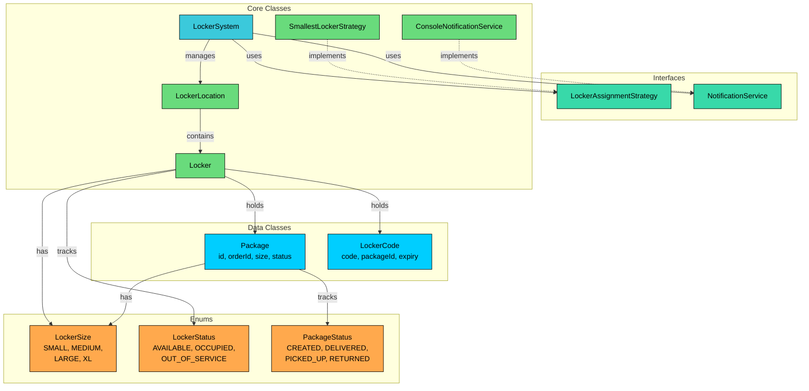

We've identified four types of entities:

**Enums** define fixed sets of values. LockerSize, LockerStatus, and PackageStatus provide type safety and prevent invalid values from entering the system.

**Data Classes** primarily hold data with minimal behavior. Package tracks delivery information. LockerCode is an immutable value object holding the pickup credentials and expiry time.

**Interfaces** define contracts for interchangeable behavior. LockerAssignmentStrategy enables pluggable allocation algorithms. NotificationService enables pluggable customer notifications.

**Core Classes** contain the main logic. Locker manages individual locker state. LockerLocation groups lockers at a physical station. SmallestLockerStrategy and ConsoleNotificationService are concrete implementations. LockerSystem orchestrates everything.

| Entity | Type | Responsibility |
|--------|------|----------------|
| `LockerSize` | Enum | Available locker sizes with maximum dimensions |
| `LockerStatus` | Enum | Locker availability: AVAILABLE, OCCUPIED, OUT_OF_SERVICE |
| `PackageStatus` | Enum | Package lifecycle: CREATED, DELIVERED, PICKED_UP, RETURNED |
| `Package` | Data Class | Package info: id, orderId, required locker size, status |
| `LockerCode` | Data Class | Pickup code with expiration time |
| `LockerAssignmentStrategy` | Interface | Contract for locker selection algorithms |
| `NotificationService` | Interface | Contract for customer notifications |
| `Locker` | Core Class | Individual locker: size, status, current package, current code |
| `LockerLocation` | Core Class | Physical station with address and collection of lockers |
| `LockerSystem` | Core Class (Singleton) | Facade: delivery, pickup, expiry cleanup |

With our entities identified, let's define their attributes, behaviors, and relationships.

---

# 3. Designing Classes and Relationships

Now that we know what entities we need, let's flesh out their details. For each class, we'll define what data it holds (attributes) and what it can do (methods). Then we'll look at how these classes connect to each other.

## 3.1 Class Definitions

We'll work bottom-up: simple types first, then data containers, then interfaces, then the classes with real logic. This order makes sense because complex classes depend on simpler ones.

### Enums

Enums define fixed sets of values that provide type safety and make code self-documenting. Using enums prevents invalid states at compile time rather than runtime.

#### LockerSize

We need a way to represent what size locker is available and what size a package requires. We could use strings like "small" or integers like 1, 2, 3, but that opens the door to invalid values. What stops someone from requesting a locker of size "HUGE" or size 99" An enum gives us a closed set of valid options, and each value can carry its own maximum dimensions.

`LockerSize` represents the available locker dimensions.

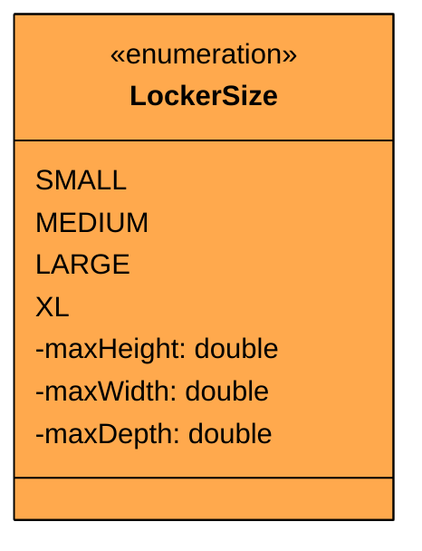

| Value | Max Height | Max Width | Max Depth | Typical Use |
|-------|-----------|-----------|-----------|-------------|
| `SMALL` | 20 cm | 25 cm | 30 cm | Books, small electronics |
| `MEDIUM` | 30 cm | 35 cm | 40 cm | Shoes, medium boxes |
| `LARGE` | 40 cm | 45 cm | 55 cm | Large electronics, clothing bundles |
| `XL` | 55 cm | 60 cm | 70 cm | Bulk orders, large appliances |

Each enum value carries maximum dimensions. This lets us compare whether a package fits in a locker by checking if the package's required size is less than or equal to the locker's size. The ordering of enum values (SMALL < MEDIUM < LARGE < XL) naturally supports the "try the next size up" logic in our assignment strategy.

#### LockerStatus

A locker isn't always available. It might be holding a package, or it might be out of service for maintenance. We need to track this so the assignment strategy only considers lockers that are actually usable.

`LockerStatus` represents the availability state of a locker.

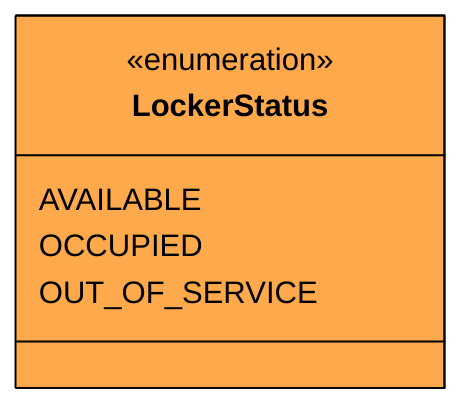

| Value | Meaning |
|-------|---------|
| `AVAILABLE` | Locker is empty and ready for a package |
| `OCCUPIED` | Locker currently holds a package |
| `OUT_OF_SERVICE` | Locker is down for maintenance |

The transitions are simple: AVAILABLE to OCCUPIED when a package is assigned, OCCUPIED back to AVAILABLE when the package is picked up or returned. OUT_OF_SERVICE can transition to AVAILABLE when maintenance is complete.

#### PackageStatus

A package goes through a lifecycle from creation to final disposition. Tracking this lifecycle explicitly prevents bugs like picking up a package twice or returning a package that's already been collected.

`PackageStatus` represents where a package is in its lifecycle.

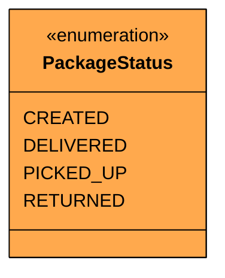

Here's the complete state diagram for the package lifecycle:

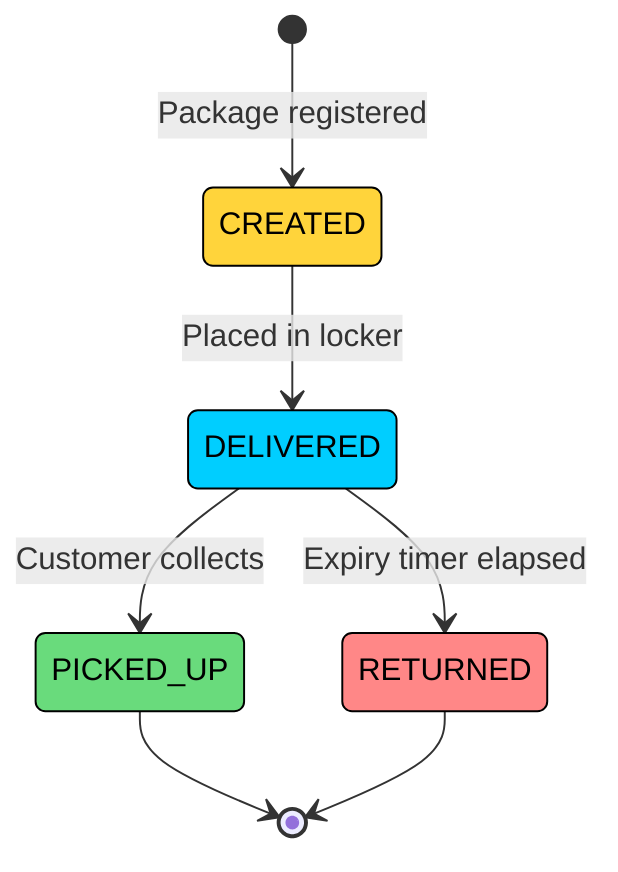

Notice that PICKED_UP and RETURNED are both terminal states. A package that's been picked up can never be returned, and a returned package can never be picked up. Also notice that CREATED can only transition to DELIVERED, not directly to PICKED_UP. A package must physically be in a locker before it can be collected. These constraints seem obvious, but explicitly mapping them prevents subtle bugs.

Now that we have our enums defined, we need data classes to hold the information that flows through the system.

### Data Classes

Data classes hold information with minimal behavior. They're the "nouns" that other classes operate on.

#### Package

When a delivery agent brings a package, we need to capture what it is, what order it belongs to, what size locker it needs, and where it is in its lifecycle.

`Package` represents a physical package in the system.

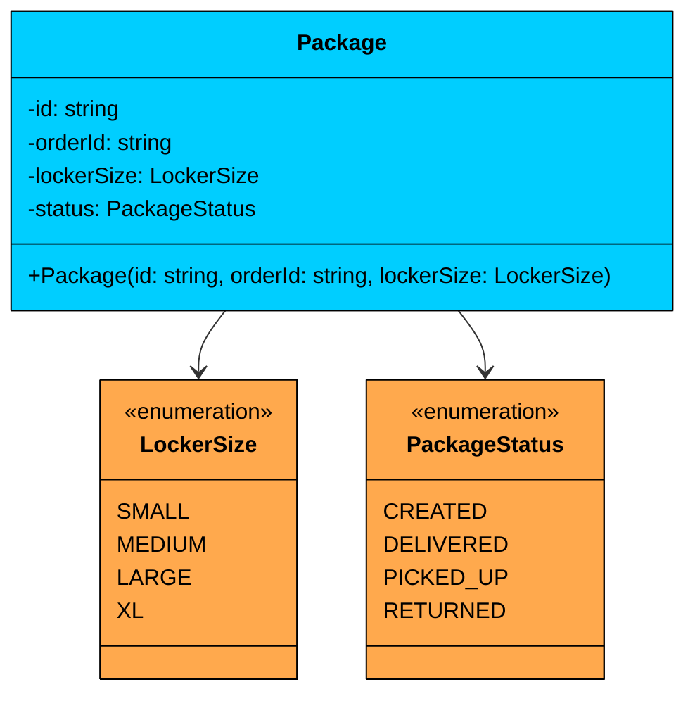

| Attribute | Type | Description | Mutable" |
|-----------|------|-------------|----------|
| `id` | string | Unique package identifier | No |
| `orderId` | string | Associated customer order | No |
| `lockerSize` | LockerSize | Required locker size | No |
| `status` | PackageStatus | Current lifecycle state | Yes |

| Method | Description |
|--------|-------------|
| `Package(id, orderId, lockerSize)` | Constructor with validation. Status starts as CREATED. |

The Package class is mostly immutable. The id, orderId, and lockerSize are all read-only since they don't change once a package exists. The only mutable field is status, which transitions through the lifecycle as the package is delivered, picked up, or returned.

**Validation:** The constructor rejects null or empty IDs because a package without an identifier can't be tracked through the system.

#### LockerCode

When a package is placed in a locker, the system generates a pickup code for the customer. This code is the key to retrieving the package, so it needs to be tied to a specific package and have a clear expiration time.

`LockerCode` represents the pickup credentials for a delivered package.

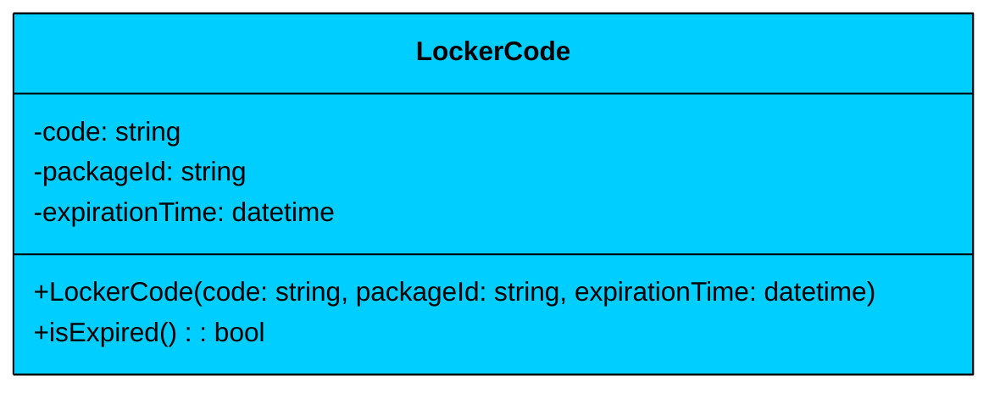

| Attribute | Type | Description | Mutable" |
|-----------|------|-------------|----------|
| `code` | string | 6-digit numeric pickup code | No |
| `packageId` | string | ID of the associated package | No |
| `expirationTime` | datetime | When this code becomes invalid | No |

| Method | Description |
|--------|-------------|
| `LockerCode(code, packageId, expirationTime)` | Constructor. All fields are immutable. |
| `isExpired()` | Returns true if the current time is past the expiration time |

LockerCode is fully **immutable**. Once generated, nothing about it changes. The `isExpired()` method doesn't modify state; it simply compares the expiration time against the current clock. This immutability is important because the code serves as a security credential. If someone could modify the code's packageId or expiration, it would break the trust model.

With our data classes defined, we need interfaces that define the contracts for pluggable behavior.

### Interfaces

Interfaces define contracts for behavior that might have multiple implementations. They're how we achieve the Open/Closed Principle: open for extension (new implementations), closed for modification (existing code doesn't change).

#### LockerAssignmentStrategy

Different situations might call for different locker assignment algorithms. The simplest is "pick the smallest locker that fits," but a high-traffic location might prefer round-robin to distribute wear evenly, or a load-balanced strategy to keep utilization even across locker sizes.

`LockerAssignmentStrategy` defines the contract for how a locker is selected.

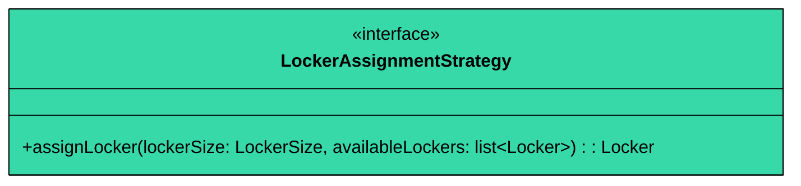

| Method | Description |
|--------|-------------|
| `assignLocker(lockerSize, availableLockers)` | Selects the best locker from available options for the given required size |

The method takes the required locker size and a list of available lockers, and returns the best match. If no suitable locker exists, it throws `NoAvailableLockerException`. This signature gives implementations full flexibility to use whatever selection criteria they want.

#### NotificationService

The system needs to tell the customer where their package is and what code to use. Today we simulate with console output. Tomorrow it might be SMS, email, or push notifications. An interface lets us swap implementations without touching the delivery logic.

`NotificationService` defines the contract for customer notifications.

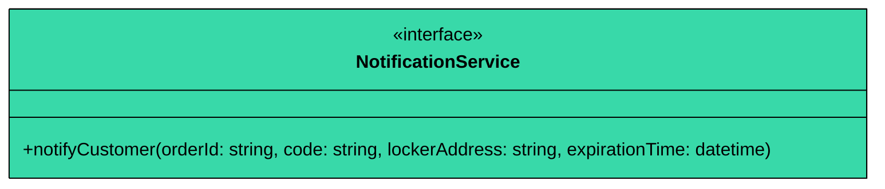

| Method | Description |
|--------|-------------|
| `notifyCustomer(orderId, code, lockerAddress, expirationTime)` | Sends pickup details to the customer |

The parameters carry everything the customer needs: which order, what code, where to go, and when the code expires. The interface doesn't prescribe how the message is formatted or delivered.

Now we have the contracts defined. Let's build the core classes that hold the real logic.

### Core Classes

Core classes contain the primary business logic. They use enums for type safety, hold data classes, and implement interfaces for extensibility.

#### Locker

Each individual locker is a physical compartment at a location. It knows its own size, whether it's available, and what package it currently holds (if any). The Locker is responsible for the mechanics of accepting and releasing packages. It doesn't decide *which* package goes where. That's the strategy's job.

`Locker` represents a single physical locker compartment.

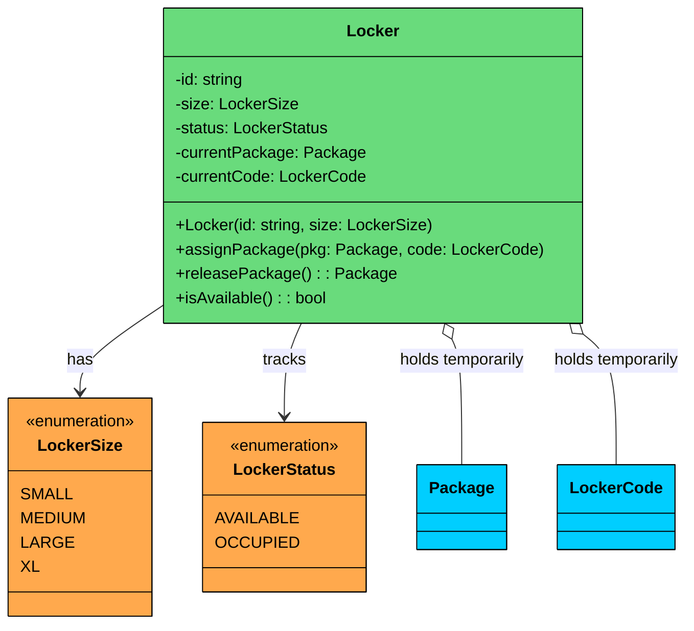

| Attribute | Type | Description | Mutable" |
|-----------|------|-------------|----------|
| `id` | string | Unique locker identifier | No |
| `size` | LockerSize | Physical size of this locker | No |
| `status` | LockerStatus | Current availability state | Yes |
| `currentPackage` | Package | Package currently stored (null if empty) | Yes |
| `currentCode` | LockerCode | Active pickup code (null if empty) | Yes |

| Method | Description |
|--------|-------------|
| `Locker(id, size)` | Constructor. Status starts as AVAILABLE, no package or code. |
| `assignPackage(pkg, code)` | Stores a package and its code, sets status to OCCUPIED |
| `releasePackage()` | Removes and returns the package, clears the code, sets status to AVAILABLE |
| `isAvailable()` | Returns true if status is AVAILABLE |

**Relationship:** Locker has an **association** with Package and LockerCode. It holds them temporarily but doesn't own them. When a package is released, it continues to exist outside the locker.

> 💡 **Key Insight:**

> **Key design choice**
>
> `assignPackage` and `releasePackage` are the only ways to modify a locker's state. There's no `setStatus()` or `setPackage()`. This encapsulation ensures that the status always stays in sync with whether a package is present. You can't have a locker that's AVAILABLE but still holds a package.

#### LockerLocation

A locker location is a physical station, like the bank of lockers outside a Whole Foods. It has an address and a collection of lockers of various sizes. The location knows how to find available lockers filtered by size, which the assignment strategy uses to make its selection.

`LockerLocation` represents a physical locker station.

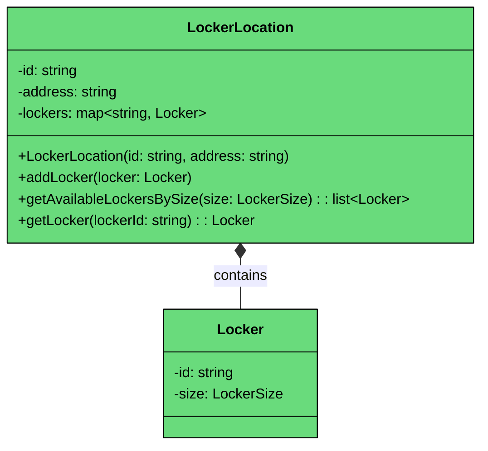

| Attribute | Type | Description | Mutable" |
|-----------|------|-------------|----------|
| `id` | string | Unique location identifier | No |
| `address` | string | Physical address of the locker station | No |
| `lockers` | map<string, Locker> | Map of locker ID to Locker object | Yes (add lockers) |

| Method | Description |
|--------|-------------|
| `LockerLocation(id, address)` | Constructor. Starts with an empty locker collection. |
| `addLocker(locker)` | Adds a locker to this location |
| `getAvailableLockersBySize(size)` | Returns all available lockers of the given size |
| `getLocker(lockerId)` | Returns a specific locker by ID |

**Relationship:** LockerLocation has a **composition** relationship with Locker. The location owns its lockers. If the location is decommissioned, its lockers go with it.

The `getAvailableLockersBySize` method filters to return only lockers that are both available and match the requested size. This keeps the filtering logic centralized in one place rather than scattered across the strategy and the system.

#### SmallestLockerStrategy

The simplest and most space-efficient assignment strategy: find the smallest locker that fits the package. If no small locker is available, try medium. If no medium, try large, and so on.

`SmallestLockerStrategy` implements the "smallest fit" locker assignment algorithm.

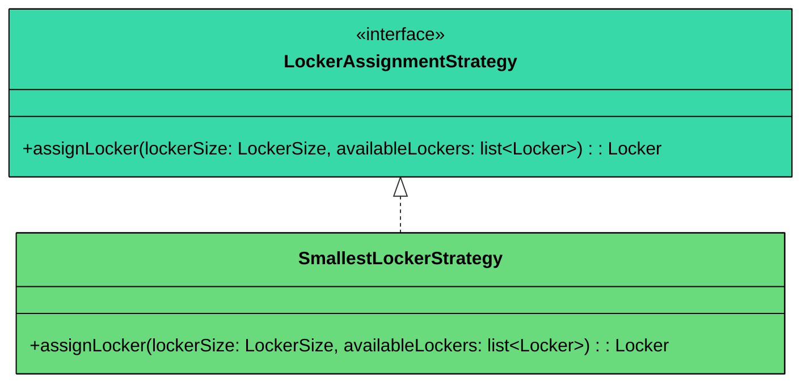

The algorithm is straightforward:

1. Start with the package's required size (e.g., SMALL)
2. Check if any available lockers match that size
3. If yes, return the first one
4. If no, try the next larger size (MEDIUM)
5. Repeat until a locker is found or all sizes are exhausted
6. If no locker fits, throw `NoAvailableLockerException`

This strategy minimizes wasted space. A small package doesn't get placed in an XL locker if a small one is available. But it gracefully upgrades when the preferred size is full.

#### ConsoleNotificationService

For our design, we simulate notifications by printing to the console. This implementation satisfies the NotificationService contract while keeping things simple.

`ConsoleNotificationService` prints pickup details to standard output.

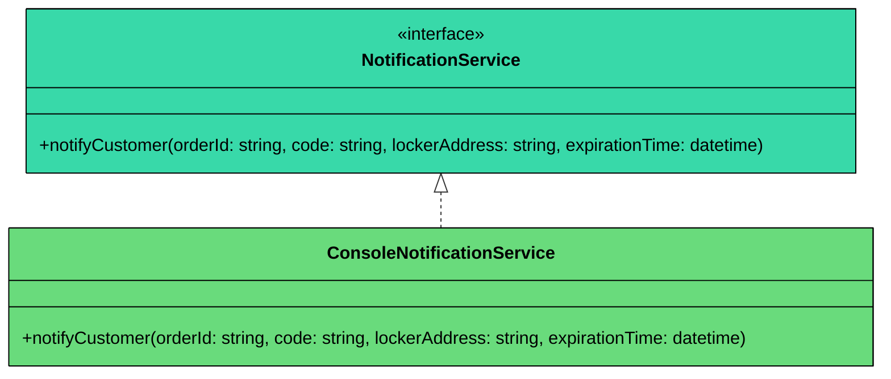

In production, you'd swap this out for an SmsNotificationService, EmailNotificationService, or PushNotificationService. The LockerSystem doesn't care which one it gets because it depends on the interface, not the implementation.

#### LockerSystem

The LockerSystem is the central coordinator. It's where delivery agents submit packages, customers pick them up, and background jobs clean up expired deliveries. It delegates the actual locker selection to a strategy and notifications to a service, keeping its own code focused on orchestration.

`LockerSystem` is the facade and entry point for all locker operations.

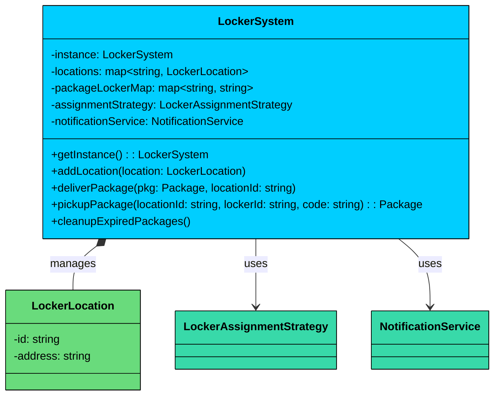

| Attribute | Type | Description | Mutable" |
|-----------|------|-------------|----------|
| `instance` | LockerSystem | Singleton instance | No (once created) |
| `locations` | map<string, LockerLocation> | All managed locker locations | Yes |
| `packageLockerMap` | map<string, string> | Maps package ID to locker ID for lookup | Yes |
| `assignmentStrategy` | LockerAssignmentStrategy | Current assignment algorithm | Yes (swappable) |
| `notificationService` | NotificationService | Current notification channel | Yes (swappable) |

| Method | Description |
|--------|-------------|
| `getInstance()` | Thread-safe lazy initialization of singleton |
| `addLocation(location)` | Registers a new locker location |
| `deliverPackage(pkg, locationId)` | Assigns a locker, generates code, notifies customer |
| `pickupPackage(locationId, lockerId, code)` | Validates code, releases package |
| `cleanupExpiredPackages()` | Scans all lockers, returns expired packages, frees lockers |

**Relationship:** LockerSystem has a **composition** relationship with LockerLocation (it owns the locations). It has **associations** with LockerAssignmentStrategy and NotificationService (it uses them but doesn't own their lifecycle).

The `packageLockerMap` is a convenience index that maps package IDs to locker IDs. Without it, finding which locker holds a specific package would require scanning every locker at every location, which is wasteful.

---

## 3.2 Full Class Diagram

Here's the complete system with all classes, enums, interfaces, and their relationships:

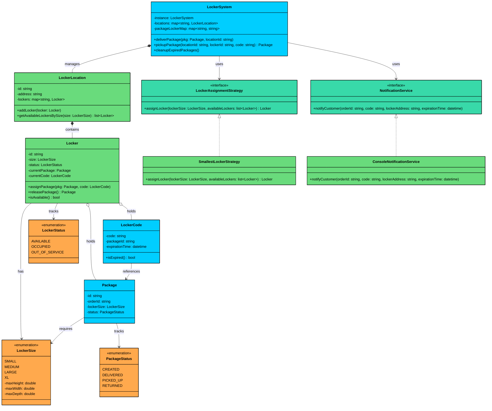

---

## 3.2 Design Patterns

This problem classifies as **medium pattern density**. The core challenge is resource allocation with constraints (picking the right locker), which calls for the Strategy pattern. We also need a singleton for coordination. But we don't need State, Observer, or Command. Let's look at what we use and what we deliberately skip.

### [Strategy Pattern](/learn/lld/strategy): Locker Assignment

**The Problem:** The system needs to pick a locker for each incoming package. The simplest approach is "smallest locker that fits." But different locations might benefit from different algorithms. A high-traffic hub might want round-robin to distribute wear. An airport location might prioritize proximity to the entrance. Hardcoding one algorithm means changing it requires modifying the LockerSystem class.

**The Solution:** The Strategy pattern extracts the locker selection algorithm into an interface. The LockerSystem depends on `LockerAssignmentStrategy`, not on any specific algorithm. Swapping algorithms is a one-line change: pass a different strategy to the system.

If we embedded the selection logic in LockerSystem using if-else branches, every new algorithm would require modifying LockerSystem. With Strategy, we add a new class that implements the interface. LockerSystem never changes.

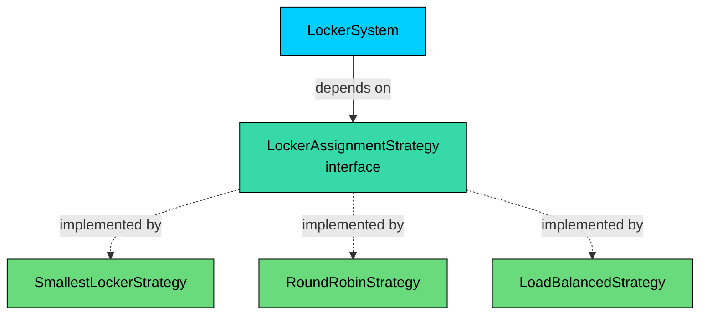

> 💡 **Key Insight:**

> **Design Alternative**
>
> We could put the assignment logic directly inside LockerSystem with a simple loop: iterate sizes from the package's required size upward, return the first available locker. For a single algorithm, this is simpler and perfectly fine. We chose the Strategy pattern because the interviewer explicitly asked for pluggable assignment. In a real interview, if the interviewer says "just use smallest-fit and it won't change," the inline approach is the better choice.

### [Singleton Pattern](/learn/lld/singleton): LockerSystem

**The Problem:** Multiple parts of the system (delivery endpoints, pickup terminals, expiry scheduler) need to coordinate through a single source of truth for locker state. Multiple LockerSystem instances could make conflicting assignments.

**The Solution:** The Singleton pattern ensures exactly one LockerSystem instance exists. Thread-safe lazy initialization prevents race conditions during startup.

In this domain, "one system managing all locations" is a natural constraint. The singleton makes this explicit in the code rather than relying on callers to manage instance creation correctly.

### Why NOT the State Pattern"

You might look at PackageStatus (CREATED, DELIVERED, PICKED_UP, RETURNED) and think "State pattern!" After all, it's a state machine with transition rules. But let's apply the practical test: if we removed the State pattern and used simple enum checks, would the code become significantly harder to extend or understand"

The answer is no. Package status transitions are straightforward: CREATED to DELIVERED to PICKED_UP (or RETURNED). There are only four states and three transitions. The logic amounts to a couple of guard clauses like "if status is not DELIVERED, throw an exception." The State pattern would require four separate state classes, each implementing a `PackageState` interface, with transition methods that mostly throw "not allowed in this state" exceptions. That's a lot of machinery for what amounts to two if-checks.

#### **When it would be worth it"**

If packages had complex state-dependent behavior (e.g., DELIVERED packages can be resized, PICKED_UP packages can be returned, RETURNED packages can be re-delivered), where each state has meaningfully different logic, then the State pattern would earn its weight. For our simple lifecycle, enum guards are cleaner.

---

# 4. Code Implementation

This section presents the complete implementation, built bottom-up from simple types to the full system.

#### Java

## 4.1 Enums

### LockerSize

The LockerSize enum carries maximum dimensions for each size category. This lets us determine whether a package fits in a locker by comparing the required size against the available size. The natural ordering of enum values (ordinal comparison) is what makes the "try the next size up" logic in the assignment strategy work cleanly.

```java
enum LockerSize {
    SMALL(20, 25, 30),
    MEDIUM(30, 35, 40),
    LARGE(40, 45, 55),
    XL(55, 60, 70);

    private final double maxHeight;
    private final double maxWidth;
    private final double maxDepth;

    LockerSize(double maxHeight, double maxWidth, double maxDepth) {
        this.maxHeight = maxHeight;
        this.maxWidth = maxWidth;
        this.maxDepth = maxDepth;
    }

    public double getMaxHeight() { return maxHeight; }
    public double getMaxWidth() { return maxWidth; }
    public double getMaxDepth() { return maxDepth; }
}
```

All three fields are `final` because locker dimensions are physical constants. A SMALL locker doesn't grow over time.

### LockerStatus

LockerStatus tracks whether a locker is available to receive a package. Three states cover all possibilities: empty, holding a package, or down for maintenance.

```java
enum LockerStatus {
    AVAILABLE, OCCUPIED, OUT_OF_SERVICE
}
```

### PackageStatus

PackageStatus tracks the lifecycle of a package from creation through its final disposition.

```java
enum PackageStatus {
    CREATED, DELIVERED, PICKED_UP, RETURNED
}
```

Both LockerStatus and PackageStatus are simple marker enums with no fields. The transition logic lives in the classes that manage these statuses, not in the enums themselves.

## 4.2 Exceptions

Each exception represents a distinct failure mode that the caller might need to handle differently.

### NoAvailableLockerException

Thrown when no locker of a suitable size is available at the requested location. The caller might respond by suggesting a nearby location or queuing the package.

```java
class NoAvailableLockerException extends RuntimeException {
    public NoAvailableLockerException(String message) {
        super(message);
    }
}
```

### InvalidCodeException

Thrown when the customer enters a wrong pickup code. This is security-relevant. In a production system, you might track failed attempts and lock the terminal after several tries.

```java
class InvalidCodeException extends RuntimeException {
    public InvalidCodeException(String message) {
        super(message);
    }
}
```

### PackageExpiredException

Thrown when a pickup is attempted after the expiry window. The package is already being returned.

```java
class PackageExpiredException extends RuntimeException {
    public PackageExpiredException(String message) {
        super(message);
    }
}
```

### PackageAlreadyPickedUpException

Thrown when someone tries to pick up a package that was already collected. This prevents double-pickup scenarios.

```java
class PackageAlreadyPickedUpException extends RuntimeException {
    public PackageAlreadyPickedUpException(String message) {
        super(message);
    }
}
```

We extend `RuntimeException` rather than `Exception` because these are operational errors that callers may or may not catch. Checked exceptions would force try-catch blocks at every call site, which adds noise without improving safety for this use case.

## 4.3 Data Classes

### Package

The Package class holds information about a physical package being delivered through the locker system. Most fields are immutable since a package's identity and size don't change. Only the status changes as the package moves through its lifecycle.

```java
class Package {
    private final String id;
    private final String orderId;
    private final LockerSize lockerSize;
    private PackageStatus status;

    public Package(String id, String orderId, LockerSize lockerSize) {
        if (id == null || id.isEmpty()) {
            throw new IllegalArgumentException("Package ID cannot be null or empty");
        }
        if (orderId == null || orderId.isEmpty()) {
            throw new IllegalArgumentException("Order ID cannot be null or empty");
        }
        this.id = id;
        this.orderId = orderId;
        this.lockerSize = lockerSize;
        this.status = PackageStatus.CREATED;
    }

    public String getId() { return id; }
    public String getOrderId() { return orderId; }
    public LockerSize getLockerSize() { return lockerSize; }
    public PackageStatus getStatus() { return status; }
    public void setStatus(PackageStatus status) { this.status = status; }
}
```

### LockerCode

The LockerCode class represents the pickup credentials the customer receives. It's fully immutable. The `isExpired()` method compares the expiration time against the current system time.

```java
class LockerCode {
    private final String code;
    private final String packageId;
    private final long expirationTime; // epoch milliseconds

    public LockerCode(String code, String packageId, long expirationTime) {
        this.code = code;
        this.packageId = packageId;
        this.expirationTime = expirationTime;
    }

    public boolean isExpired() {
        return System.currentTimeMillis() > expirationTime;
    }

    public String getCode() { return code; }
    public String getPackageId() { return packageId; }
    public long getExpirationTime() { return expirationTime; }
}
```

We use epoch milliseconds for the expiration time because it's the simplest representation that supports comparison. In production you'd use an `Instant` or `LocalDateTime`, but for an interview solution, keeping the time representation simple avoids unnecessary complexity.

## 4.4 Interfaces

### LockerAssignmentStrategy

The strategy interface defines a single method: given a required size and a list of available lockers, pick the best one. The LockerSystem calls this method during delivery, passing the filtered set of available lockers from the location.

```java
interface LockerAssignmentStrategy {
    Locker assignLocker(LockerSize requiredSize, List<Locker> availableLockers);
}
```

### NotificationService

The notification interface defines a single method for sending pickup details to the customer. The parameters carry everything the customer needs: which order, what code, where to go, and when it expires.

```java
interface NotificationService {
    void notifyCustomer(String orderId, String code, String lockerAddress, long expirationTime);
}
```

## 4.5 Strategy Implementations

### SmallestLockerStrategy

The SmallestLockerStrategy implements the "smallest fit with fallback" algorithm. It iterates through locker sizes starting from the package's required size, moving upward until it finds an available locker. This ensures space efficiency while still handling capacity shortages gracefully.

```java
class SmallestLockerStrategy implements LockerAssignmentStrategy {
    @Override
    public Locker assignLocker(LockerSize requiredSize, List<Locker> availableLockers) {
        LockerSize[] sizes = LockerSize.values();

        // Start from the required size and try increasingly larger sizes
        for (int i = requiredSize.ordinal(); i < sizes.length; i++) {
            LockerSize targetSize = sizes[i];
            for (Locker locker : availableLockers) {
                if (locker.getSize() == targetSize && locker.isAvailable()) {
                    return locker;
                }
            }
        }

        throw new NoAvailableLockerException(
            "No available locker for size " + requiredSize + " or larger"
        );
    }
}
```

The outer loop walks through sizes from the required size upward (SMALL, then MEDIUM, then LARGE, then XL). The inner loop finds the first available locker of that size. This two-level iteration ensures we try the exact size first before upgrading. If we exhausted all sizes without finding a locker, we throw `NoAvailableLockerException`.

### ConsoleNotificationService

The ConsoleNotificationService prints pickup details to standard output. It satisfies the NotificationService contract while keeping the implementation trivial. In production, this would be replaced with an implementation that sends SMS, email, or push notifications.

```java
class ConsoleNotificationService implements NotificationService {
    @Override
    public void notifyCustomer(String orderId, String code, String lockerAddress, long expirationTime) {
        java.text.SimpleDateFormat sdf = new java.text.SimpleDateFormat("yyyy-MM-dd HH:mm:ss");
        String expiry = sdf.format(new java.util.Date(expirationTime));

        System.out.println("[NOTIFICATION] Order " + orderId + ": Your package is ready for pickup!");
        System.out.println("  Locker Location: " + lockerAddress);
        System.out.println("  Pickup Code: " + code);
        System.out.println("  Expires: " + expiry);
    }
}
```

## 4.6 Core Classes

### Locker

The Locker class manages a single physical compartment. It handles the mechanics of accepting a package (store it, save the code, mark as occupied) and releasing a package (return it, clear the code, mark as available). Both operations are synchronized because two threads (a delivery agent and a cleanup job, or two delivery agents) could interact with the same locker concurrently.

```java
$12e
```

The `assignPackage` method checks that the locker is actually available before proceeding. This guard is critical: even though the assignment strategy only returns available lockers, a race condition could occur between the time the strategy checks availability and the time the assignment happens. The synchronized block ensures atomicity.

The `releasePackage` method returns the package and clears the locker in a single atomic operation. Without synchronization, a cleanup thread could clear the package while a customer's pickup is reading it.

### LockerLocation

LockerLocation represents a physical locker station. It manages a collection of lockers and provides filtered access to available ones. The lockers are stored in a `ConcurrentHashMap` because multiple threads may add lockers or query availability simultaneously.

```java
$12f
```

The `getAvailableLockersBySize` method returns a snapshot of available lockers at a point in time. By the time the strategy uses this list, some lockers might have been claimed by other threads. That's fine because the `Locker.assignPackage` method has its own synchronized check.

### LockerSystem

The LockerSystem is the central coordinator. It ties together locations, strategies, and notifications into a cohesive API. It's a singleton because there should be one system managing all locations, preventing conflicting assignments.

The `deliverPackage` method orchestrates the full delivery flow: find the location, get available lockers, run the assignment strategy, generate a code, assign the package, and notify the customer. The `pickupPackage` method validates the code, checks for expiry, and releases the package. The `cleanupExpiredPackages` method scans all locations for expired deliveries and frees the lockers.

```java
$130
```

A few things worth noting about the LockerSystem:

**Code generation:** `generateCode()` produces a random 6-digit string. In production, you'd want to ensure uniqueness across active codes, possibly using a counter or a hash. For an interview, random is sufficient.

**Tracking maps:** Three maps (`packageLockerMap`, `packageLocationMap`, `packageCodeMap`) provide O(1) lookup from package ID to its locker, location, and code. Without these, finding a package's locker would require iterating every locker at every location.

**Delivery flow:** The `deliverPackage` method passes all available lockers to the strategy (not just lockers of the required size). This gives the strategy full flexibility to implement whatever selection logic it wants, including the "try next size up" behavior in SmallestLockerStrategy.

**Pickup flow:** The `pickupPackage` method checks three things in order: is the locker occupied, is the code expired, and does the code match. The order matters because we want to give the customer the most helpful error message. If the package expired, telling them "wrong code" would be confusing.

**Cleanup flow:** `cleanupExpiredPackages` scans every locker at every location. For a large system, you'd optimize this with a scheduled priority queue. For an interview, the scan approach is clear and correct.

Here's the full delivery and pickup flow as a sequence diagram:

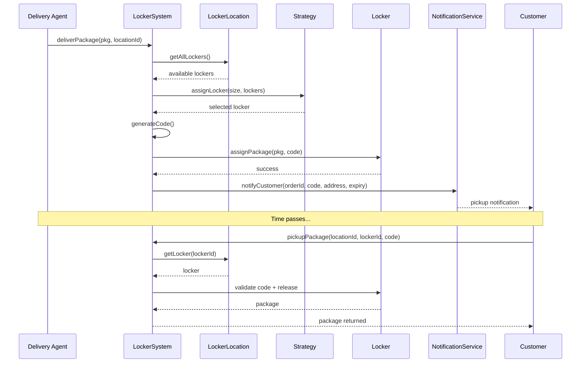

Let's walk through this flow phase by phase.

**Phase 1: Delivery Request.** The delivery agent calls `deliverPackage` with the package and the target location. The system looks up the location and retrieves all available lockers. This is the entry point that kicks off the entire workflow.

**Phase 2: Locker Selection.** The system passes the available lockers to the assignment strategy, which selects the best fit. If the strategy can't find a suitable locker (all lockers occupied or too small), it throws `NoAvailableLockerException` and the delivery fails cleanly. No locker is modified on failure.

**Phase 3: Assignment and Code Generation.** The system generates a 6-digit code with a 3-day expiry and assigns the package to the selected locker. The `Locker.assignPackage` method is synchronized, so if another thread is simultaneously trying to assign to the same locker, one will succeed and the other will fail with an exception.

**Phase 4: Notification.** The system notifies the customer with all the details they need: order ID, pickup code, locker address, and expiration time. The delivery is now complete.

**Phase 5: Pickup.** When the customer arrives, they call `pickupPackage` with the location, locker ID, and code. The system validates the code within a synchronized block on the locker, ensuring no race between pickup and cleanup. If the code is valid and not expired, the package is released and returned to the customer.

Notice that at no point can a locker be partially assigned. The synchronized blocks on `assignPackage` and `releasePackage` ensure each operation completes atomically.

## 4.7 Demo

The demo exercises all three scenarios: a successful delivery and pickup, a failed code attempt followed by a correct one, and an expired package cleanup.

```java
$131
```

The demo creates a location with five lockers of varying sizes, then runs three scenarios. Scenario 1 tests the happy path. Scenario 2 tests error handling with an invalid code. Scenario 3 tests the expiry cleanup by delivering a package with a 0-second expiry window.

---

# 5. Concurrency and Thread Safety

Does this system actually need thread safety" Consider the real-world scenario. A locker station outside a grocery store might have a delivery driver dropping off three packages while a customer punches in a code to pick up theirs, and a background cleanup job is scanning for expired packages. These are three independent actors hitting the same lockers simultaneously.

In a single-threaded demo, everything works fine. But in production (or if an interviewer probes your design), these concurrent operations can cause real problems.

## Concern 1: Two Deliveries to the Same Location (High Risk)

Two delivery agents arrive at the same locker station with packages at the same time. Both need a SMALL locker. There's one SMALL locker available.

**Setup:** Agent A has PKG-100 (SMALL). Agent B has PKG-200 (SMALL). Locker L1 is the only available SMALL locker at location LOC-1.

**Without synchronization on **`Locker.assignPackage()`**:**

1. **Agent A thread:** Calls `assignLocker()`, strategy finds L1 is available, returns L1
2. **Agent B thread:** Calls `assignLocker()`, strategy finds L1 is still available (Agent A hasn't assigned yet), returns L1
3. **Agent A thread:** Calls `L1.assignPackage(PKG-100, code1)`, sets L1 to OCCUPIED with PKG-100
4. **Agent B thread:** Calls `L1.assignPackage(PKG-200, code2)`, overwrites L1 with PKG-200

**Result:** PKG-100 is lost. It was assigned to L1 but then silently replaced by PKG-200. Agent A got a confirmation, but the package is gone. The customer for PKG-100 shows up, enters their code, and gets PKG-200 instead.

**With synchronization:** Agent A's thread acquires the lock on L1 and completes `assignPackage`. When Agent B's thread tries to call `assignPackage`, it acquires the same lock, sees that L1's status is now OCCUPIED, and throws `IllegalStateException`. Agent B's delivery fails cleanly, and the LockerSystem can retry with a MEDIUM locker.

```java
public synchronized void assignPackage(Package pkg, LockerCode code) {
    if (status != LockerStatus.AVAILABLE) {
        throw new IllegalStateException("Locker " + id + " is not available");
    }
    this.currentPackage = pkg;
    this.currentCode = code;
    this.status = LockerStatus.OCCUPIED;
}
```

The `synchronized` keyword on the method means the thread must hold the lock on the Locker object before entering. The status check and assignment happen atomically.

## Concern 2: Pickup During Expiry Cleanup (Medium Risk)

A customer enters their code at the exact moment the background cleanup job scans their locker.

**Setup:** PKG-300 is in locker L4 with a code that's about to expire (or has just expired). Customer enters the correct code. Cleanup job is running.

**Without synchronization:**

1. **Cleanup thread:** Reads L4.getStatus() = OCCUPIED, reads L4.getCurrentCode().isExpired() = true
2. **Customer thread:** Reads L4.getStatus() = OCCUPIED, reads L4.getCurrentCode().getCode() = matches
3. **Cleanup thread:** Calls L4.releasePackage(), marks PKG-300 as RETURNED, frees L4
4. **Customer thread:** Calls L4.releasePackage(), but L4 is now empty. Returns null.

**Result:** The customer gets nothing. The package was returned even though the customer was mid-pickup.

**With synchronization:** In `pickupPackage`, we synchronize on the locker object. The cleanup method also synchronizes on each locker before checking it. Whichever thread acquires the lock first completes its operation, and the second thread sees the updated state.

If the customer wins the race, they pick up their package, and when the cleanup thread gets the lock, the locker is already AVAILABLE and gets skipped. If the cleanup wins, the customer gets a `PackageExpiredException`, which is the correct behavior: the code had expired.

---

# 6. Extensions

One of the key signals interviewers look for is whether your design can accommodate new features without rewriting existing code. Let's walk through several common follow-up questions and show how our design handles them.

## 6.1 Adding a New Locker Size

**Scenario:** "Now add an extra-small size for envelopes and letters."

This is the simplest extension. We add a new value to the LockerSize enum. The assignment strategy, the locker classes, and the LockerSystem don't need any changes because they all work with the LockerSize type generically.

```java
enum LockerSize {
    XS(10, 15, 20),       // new size for envelopes
    SMALL(20, 25, 30),
    MEDIUM(30, 35, 40),
    LARGE(40, 45, 55),
    XL(55, 60, 70);

    // ... constructor and getters unchanged
}
```

The SmallestLockerStrategy already iterates `LockerSize.values()` starting from the required size, so XS packages will try XS first, then fall through to SMALL, MEDIUM, and so on. No logic changes needed.

**What stays unchanged:** SmallestLockerStrategy, Locker, LockerLocation, LockerSystem, NotificationService.

## 6.2 Different Assignment Strategy

**Scenario:** "Implement a round-robin strategy to distribute wear evenly across lockers."

We create a new class that implements `LockerAssignmentStrategy`. No changes to LockerSystem or any other existing class.

```java
class RoundRobinStrategy implements LockerAssignmentStrategy {
    private int lastAssignedIndex = 0;

    @Override
    public synchronized Locker assignLocker(LockerSize requiredSize, List<Locker> availableLockers) {
        LockerSize[] sizes = LockerSize.values();

        for (int i = requiredSize.ordinal(); i < sizes.length; i++) {
            LockerSize targetSize = sizes[i];
            List<Locker> matching = new ArrayList<>();
            for (Locker locker : availableLockers) {
                if (locker.getSize() == targetSize && locker.isAvailable()) {
                    matching.add(locker);
                }
            }
            if (!matching.isEmpty()) {
                lastAssignedIndex = (lastAssignedIndex + 1) % matching.size();
                return matching.get(lastAssignedIndex);
            }
        }

        throw new NoAvailableLockerException(
            "No available locker for size " + requiredSize + " or larger"
        );
    }
}
```

Swapping is a one-line change:

```java
system.setAssignmentStrategy(new RoundRobinStrategy());
```

**What stays unchanged:** LockerSystem, Locker, LockerLocation, all existing strategies.

## 6.3 SMS or Email Notifications

**Scenario:** "Send real SMS notifications instead of console output."

We create a new class that implements `NotificationService`. The LockerSystem doesn't know or care how notifications are delivered.

```java
class SmsNotificationService implements NotificationService {
    private final SmsClient smsClient;
    private final Map<String, String> orderPhoneMap;

    public SmsNotificationService(SmsClient smsClient, Map<String, String> orderPhoneMap) {
        this.smsClient = smsClient;
        this.orderPhoneMap = orderPhoneMap;
    }

    @Override
    public void notifyCustomer(String orderId, String code, String lockerAddress, long expirationTime) {
        String phone = orderPhoneMap.get(orderId);
        String message = "Your package for order " + orderId + " is ready! "
            + "Pickup code: " + code + " at " + lockerAddress;
        smsClient.send(phone, message);
    }
}
```

**What stays unchanged:** LockerSystem, all delivery and pickup logic, existing notification implementations.

## 6.4 Locker Return with Refund

**Scenario:** "Allow customers to return a package to a locker and trigger a refund."

This requires a new status and a new method, but the existing code doesn't change.

```java
enum PackageStatus {
    CREATED, DELIVERED, PICKED_UP, RETURNED, RETURN_REQUESTED  // new status
}
```

```java
// New method in LockerSystem
public void requestReturn(Package pkg, String locationId) {
    LockerLocation location = locations.get(locationId);
    List<Locker> availableLockers = location.getAllLockers();
    Locker locker = assignmentStrategy.assignLocker(pkg.getLockerSize(), availableLockers);

    String code = generateCode();
    long expirationTime = System.currentTimeMillis() + (7L * 24 * 60 * 60 * 1000); // 7 days
    LockerCode lockerCode = new LockerCode(code, pkg.getId(), expirationTime);

    locker.assignPackage(pkg, lockerCode);
    pkg.setStatus(PackageStatus.RETURN_REQUESTED);
    packageLockerMap.put(pkg.getId(), locker.getId());
    packageLocationMap.put(pkg.getId(), locationId);
}
```

The existing `deliverPackage`, `pickupPackage`, and `cleanupExpiredPackages` methods don't need modification.

**What stays unchanged:** All existing methods, strategies, and notification services.
