> 💡 **Key Insight:**

> **What is a Shopping Cart"**
>
> A **shopping cart** is a feature in online stores that lets customers **collect items they want to buy before completing the purchase**.
>
> 
> <!-- Simulation: shopping-cart -->
> 

>
> It works like a physical cart in a supermarket. You add products as you browse, review them together, then proceed to checkout and pay.

In this chapter, we will explore the **low-level design of shopping cart** in detail.

Let's start by clarifying the requirements:

---

# 1. Clarifying Requirements

Before starting any design, it's important to ask thoughtful questions to uncover hidden assumptions, clarify ambiguities, and define the system's scope. In an interview setting, this dialogue demonstrates that you think before you code.

Here is an example of how a discussion between the candidate and the interviewer might unfold:

> 💡 **Key Insight:**

> **DISCUSSION**
>
> **Candidate:** "Can a customer have multiple active carts, or just one at a time""
>
> **Interviewer:** "One active cart per customer. Creating a new cart while one exists should return the existing cart."
>
> **Candidate:** "Is there a limit on how many units of a single product a customer can add""
>
> **Interviewer:** "Yes. Each product defines a maximum quantity per cart. Attempting to exceed it should fail."
>
> **Candidate:** "How should the cart handle price changes" If a product costs $50 when added but the price increases to $60 before checkout, what does the customer pay""
>
> **Interviewer:** "The price at the time of adding should be captured. The customer pays the price they saw when they added the item."
>
> **Candidate:** "What types of discounts should the system support""
>
> **Interviewer:** "Three types: percentage off the cart subtotal, flat dollar amount off, and buy-X-get-Y-free within a product category. Only one discount can be active on a cart at a time, but the design should allow adding new discount types easily."
>
> **Candidate:** "What happens to a cart after checkout" Can items still be modified""
>
> **Interviewer:** "No. Once a cart is checked out, it becomes immutable. It can also be abandoned. Only an active cart allows item modifications."
>
> **Candidate:** "Should the system notify anything when cart events happen, like items added or cart checked out""
>
> **Interviewer:** "Yes. We need logging for all cart events and abandoned cart alerts, but these should be decoupled from the cart logic itself."
>
> **Candidate:** "Do we need to handle concurrent access to the same cart""
>
> **Interviewer:** "Yes. Think about a customer with two browser tabs open, both modifying the same cart simultaneously. The cart state should remain consistent."

After gathering the details, we can summarize the key system requirements.

## 1.1 Functional Requirements

- Allow customers to add products to a cart with a specified quantity
- Allow customers to remove products or update quantities
- Capture the product price at the time of addition (price snapshot)
- Enforce a maximum quantity per product per cart
- Support three discount types: percentage off, flat amount off, buy-X-get-Y-free
- Allow only one discount strategy active per cart at a time
- Calculate cart total as subtotal minus discount
- Track cart lifecycle through 3 states: Active, Checked Out, Abandoned
- Only allow modifications (add, remove, update, apply discount) on active carts
- Notify observers when items are added, removed, or the cart is checked out
- Support one active cart per customer

## 1.2 Non-Functional Requirements

- The design should follow **object-oriented principles** with clear separation of concerns
- The system should handle **concurrent cart modifications** without data corruption
- The system should be **modular and extensible** to support future discount types
- The components should be **testable** in isolation

---

# 2. Identifying Core Entities

How do you go from a list of requirements to actual classes" The key is to look for **nouns** in the requirements that have distinct attributes or behaviors. Not every noun becomes a class, but this approach gives you a starting point.

Let's walk through our requirements and identify what needs to exist in our system.

### 2.1 Products and Categories

From "allow customers to add products to a cart," we get `Product`. A product has a name, price, category, and a maximum quantity per cart. Products don't change once created in our system.

We also need `ProductCategory` to classify products. The buy-X-get-Y-free discount operates within a specific category, so this needs to be a distinct type, not a raw string.

### 2.2 Cart Items and Price Snapshots

From "capture the product price at the time of addition," we get `CartItem`. This is more than just a product reference. A cart item wraps a product with its quantity and the price snapshot taken when the item was added. This separation is critical: the product's current price might change, but the customer pays what they saw.

### 2.3 The Cart Itself

From "track cart lifecycle through 3 states," we get `Cart` and `CartStatus`. The cart is the central entity that holds items, applies discounts, notifies observers, and enforces its own lifecycle. CartStatus (ACTIVE, CHECKED_OUT, ABANDONED) controls which operations are allowed.

### 2.4 Customers

From "one active cart per customer," we get `Customer`. A customer has an identity and can own one active cart at a time.

### 2.5 Discounts and Notifications

From "support three discount types" and "notify observers when cart events happen," we get the `DiscountStrategy` interface and the `CartObserver` interface. These represent the two extension points in our design.

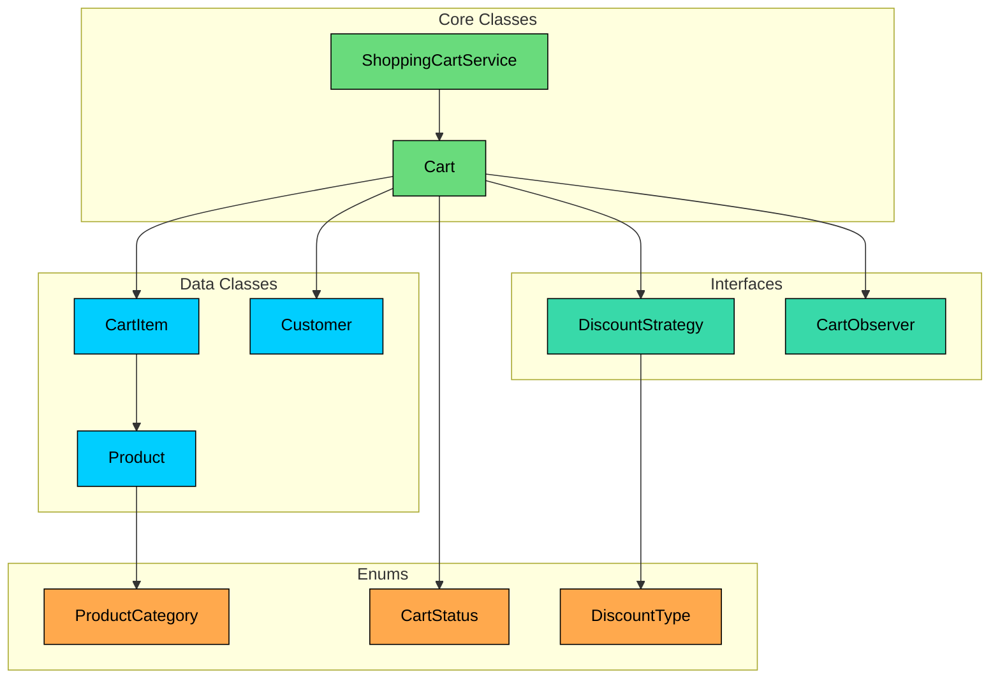

Here's a summary of all entities in our design:

| Entity | Type | Responsibility |
|--------|------|----------------|
| `ProductCategory` | Enum | Classifies products for category-based discounts |
| `CartStatus` | Enum | Tracks cart lifecycle (Active, Checked Out, Abandoned) |
| `DiscountType` | Enum | Identifies discount strategy type |
| `Product` | Data Class | Immutable product definition with price and category |
| `CartItem` | Data Class | Product reference with quantity and price snapshot |
| `Customer` | Data Class | Immutable customer identity |
| `CartException` | Exception | Domain-specific error for cart operations |
| `DiscountStrategy` | Interface | Contract for pluggable discount calculations |
| `CartObserver` | Interface | Contract for cart event listeners |
| `Cart` | Core Class | Manages items, discounts, status, and observers |
| `ShoppingCartService` | Core Class | Singleton facade for cart registry |

With our entities identified, let's define their attributes, behaviors, and relationships.

---

# 3. Designing Classes and Relationships

This section defines the class structure using language-agnostic UML notation. No code here, just Mermaid diagrams, tables, and design reasoning. The goal is to nail down the design before touching any language-specific implementation.

## 3.1 Class Definitions

### Enums

#### ProductCategory

We need a way to classify products. The buy-X-get-Y-free discount operates on a specific category, so we can't use raw strings. What stops someone from passing "elctronics" (typo) as a category" An enum gives us a closed set of valid options.

`ProductCategory` represents the product classification.

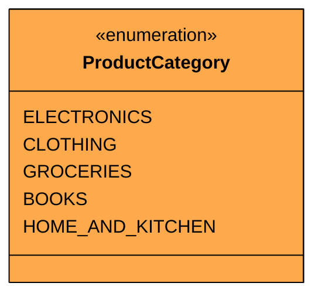

| Value | Purpose |
|-------|---------|
| `ELECTRONICS` | Electronic devices and accessories |
| `CLOTHING` | Apparel and fashion items |
| `GROCERIES` | Food and daily essentials |
| `BOOKS` | Books and publications |
| `HOME_AND_KITCHEN` | Home goods and kitchen items |

This set covers the major retail categories. New categories can be added to the enum without affecting existing discount logic.

#### CartStatus

A cart has a lifecycle. It starts active, and eventually either gets checked out or abandoned. We need to enforce that once a cart leaves the active state, nobody can modify it. An enum with clear state transitions handles this.

`CartStatus` represents where a cart is in its lifecycle.

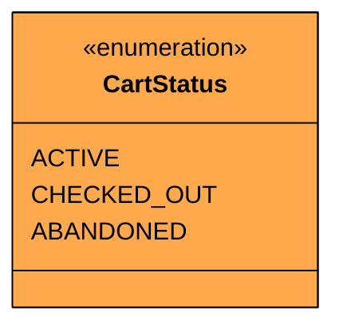

| Value | Purpose |
|-------|---------|
| `ACTIVE` | Cart is open for modifications |
| `CHECKED_OUT` | Cart has been purchased, no further changes allowed |
| `ABANDONED` | Cart was abandoned, no further changes allowed |

Both CHECKED_OUT and ABANDONED are terminal states. There's no coming back once a cart leaves ACTIVE. This is a deliberate simplification. In a real e-commerce system you might allow re-opening an abandoned cart, but for interview scope, terminal states keep the design clean.

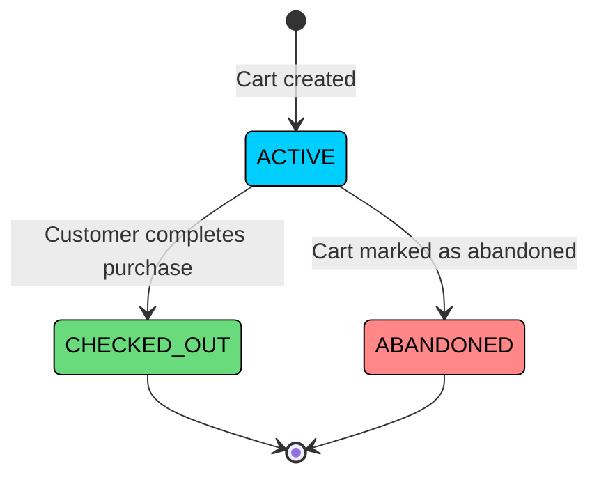

Notice that there is no transition from CHECKED_OUT to ACTIVE or from ABANDONED to ACTIVE. Once a cart reaches a terminal state, it stays there. Also notice there is no direct transition between CHECKED_OUT and ABANDONED. These are two completely separate outcomes of an active cart.

#### DiscountType

We need to identify what kind of discount is applied. This enum pairs with the DiscountStrategy interface to let callers inspect the type without downcasting.

`DiscountType` identifies the discount strategy variant.

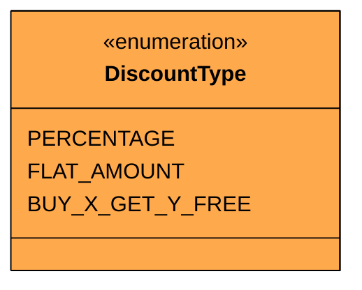

With our enums defined, let's move to the data that flows through the system.

### Data Classes

#### Product

A product represents something a customer can buy. Its price, name, category, and quantity limit are all set at creation time and never change. This is a classic immutable data class.

`Product` represents a purchasable item in the catalog.

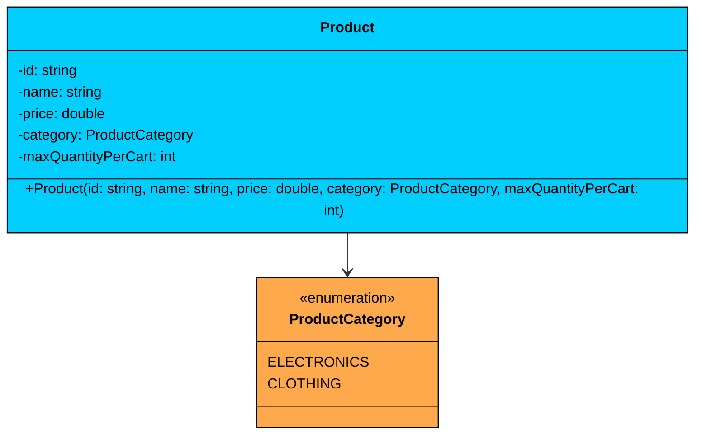

| Attribute | Type | Description | Mutable" |
|-----------|------|-------------|----------|
| `id` | string | Unique product identifier | No |
| `name` | string | Display name | No |
| `price` | double | Current catalog price | No |
| `category` | ProductCategory | Product classification | No |
| `maxQuantityPerCart` | int | Maximum units per cart | No |

All fields are read-only. The `maxQuantityPerCart` field prevents customers from hoarding. Each product defines its own limit because a customer buying 10 books is reasonable, but 10 laptops probably isn't.

#### CartItem

Here's where things get interesting. A cart item is not just a reference to a product with a quantity. It also captures the price at the moment the item was added. This price snapshot protects the customer: if a product's price increases after they added it, they still pay the original price.

`CartItem` wraps a product with quantity and a price snapshot.

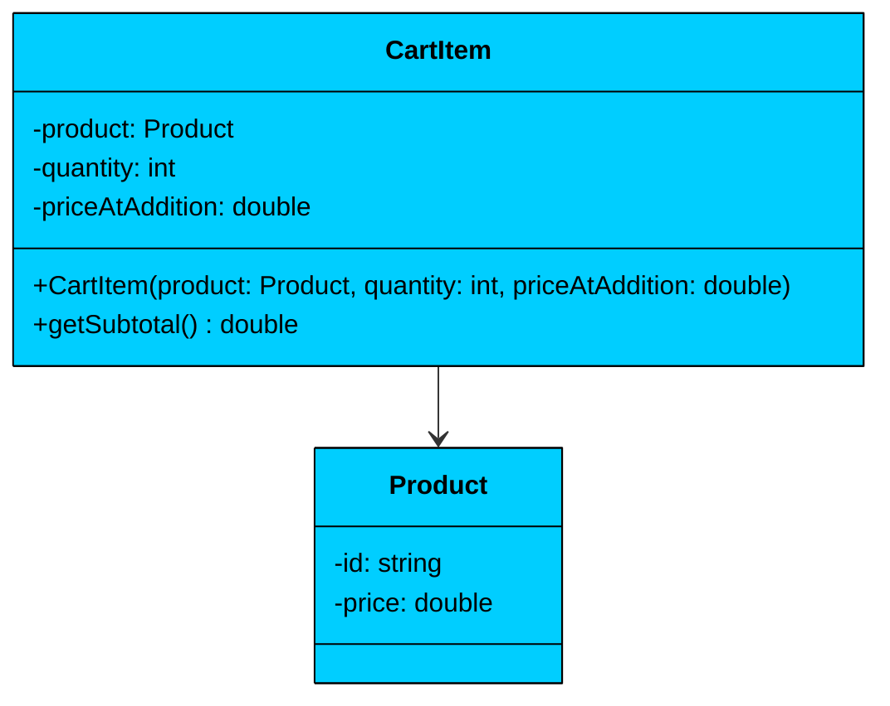

| Attribute | Type | Description | Mutable" |
|-----------|------|-------------|----------|
| `product` | Product | Reference to the product | No |
| `quantity` | int | Number of units | Yes (via Cart methods) |
| `priceAtAddition` | double | Price captured when item was added | No |

| Method | Description |
|--------|-------------|
| `getSubtotal()` | Returns `quantity * priceAtAddition` |

The quantity field is conceptually mutable because the Cart can update it when a customer changes how many units they want. However, the Cart controls this mutation, not external callers.

#### Customer

A customer is a simple identity. Name and email, both set at creation time.

`Customer` represents a registered user.

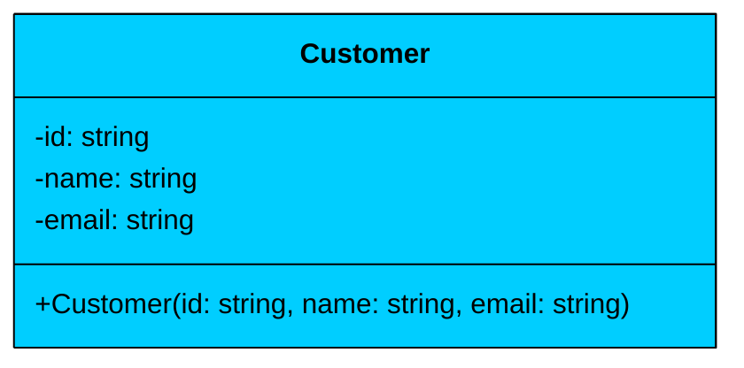

| Attribute | Type | Description | Mutable" |
|-----------|------|-------------|----------|
| `id` | string | Unique customer identifier | No |
| `name` | string | Customer name | No |
| `email` | string | Contact email | No |

Immutable. A customer's identity doesn't change during a shopping session.

Now that we have our data classes, we need the contracts that define how discounts and notifications work.

### Interfaces

#### DiscountStrategy

We need a way to calculate discounts without the Cart knowing which specific algorithm is being used. Three discount types today, potentially more tomorrow. This calls for an interface that each discount type implements.

`DiscountStrategy` defines the contract for all discount calculations.

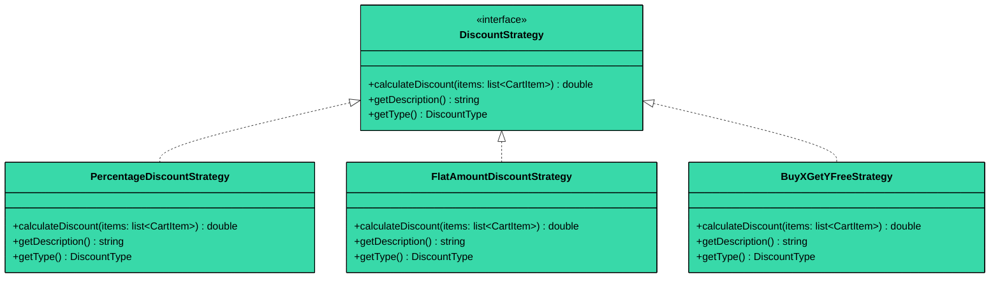

| Method | Description |
|--------|-------------|
| `calculateDiscount(items)` | Computes the discount amount given the current cart items |
| `getDescription()` | Returns a human-readable description of the discount |
| `getType()` | Returns the DiscountType enum value |

The interface receives the full list of cart items because some discounts (like buy-X-get-Y-free) need to inspect individual items and their categories, while others (like percentage off) only need the subtotal.

#### CartObserver

We need to notify external systems when things happen in the cart without coupling the Cart to those systems. A logging service and an abandoned cart alerting service need to know about cart events, but the Cart shouldn't know or care about either of them.

`CartObserver` defines the contract for cart event listeners.

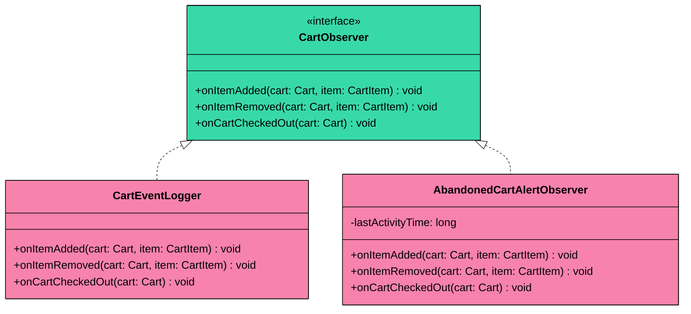

| Method | Description |
|--------|-------------|
| `onItemAdded(cart, item)` | Called when an item is added to the cart |
| `onItemRemoved(cart, item)` | Called when an item is removed from the cart |
| `onCartCheckedOut(cart)` | Called when the cart is checked out |

The `AbandonedCartAlertObserver` tracks the timestamp of the last activity. An external process could query this to identify carts that haven't been touched in a while.

With interfaces defined, let's look at the core classes that orchestrate everything.

### Core Classes

#### Cart

The Cart is the heart of the system. It manages the collection of items, enforces the cart lifecycle, delegates discount calculations to the active strategy, and notifies observers on state changes.

`Cart` manages items, discount, status, and observers.

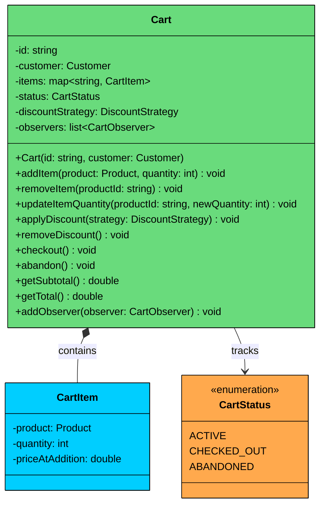

| Attribute | Type | Description | Mutable" |
|-----------|------|-------------|----------|
| `id` | string | Unique cart identifier | No |
| `customer` | Customer | Cart owner | No |
| `items` | map<string, CartItem> | Product ID to cart item mapping | Yes (contents) |
| `status` | CartStatus | Current lifecycle state | Yes (via state transitions) |
| `discountStrategy` | DiscountStrategy | Currently active discount (nullable) | Yes |
| `observers` | list<CartObserver> | Registered event listeners | Yes (list contents) |

| Method | Description |
|--------|-------------|
| `addItem(product, quantity)` | Adds product with price snapshot, validates status and quantity limits |
| `removeItem(productId)` | Removes item, validates status and existence |
| `updateItemQuantity(productId, newQuantity)` | Updates quantity, validates status and limits |
| `applyDiscount(strategy)` | Sets the active discount strategy |
| `removeDiscount()` | Clears the active discount |
| `checkout()` | Transitions status to CHECKED_OUT, notifies observers |
| `abandon()` | Transitions status to ABANDONED |
| `getSubtotal()` | Sum of all item subtotals |
| `getTotal()` | Subtotal minus discount (never negative) |
| `addObserver(observer)` | Registers an event listener |

**Key design principles:**

1. **Encapsulation:** The items map is private. External callers can't directly manipulate cart contents. All modifications go through methods that enforce validation.
2. **State guard:** Every mutating method checks that the cart is ACTIVE before proceeding. This single guard pattern prevents invalid operations on checked-out or abandoned carts.
3. **Composition with CartItem:** Cart owns its CartItems. When the Cart is destroyed, all CartItems go with it.
4. **Association with Customer:** Cart references a Customer but doesn't own it. The customer exists independently.

**Relationship:** Cart has a **composition** relationship with CartItem (lifecycle dependency) and an **association** with Customer, DiscountStrategy, and CartObserver (independent lifecycles).

#### ShoppingCartService

We need a single entry point that manages the cart registry, one active cart per customer. This is the facade that external code interacts with.

`ShoppingCartService` is the singleton facade for the cart system.

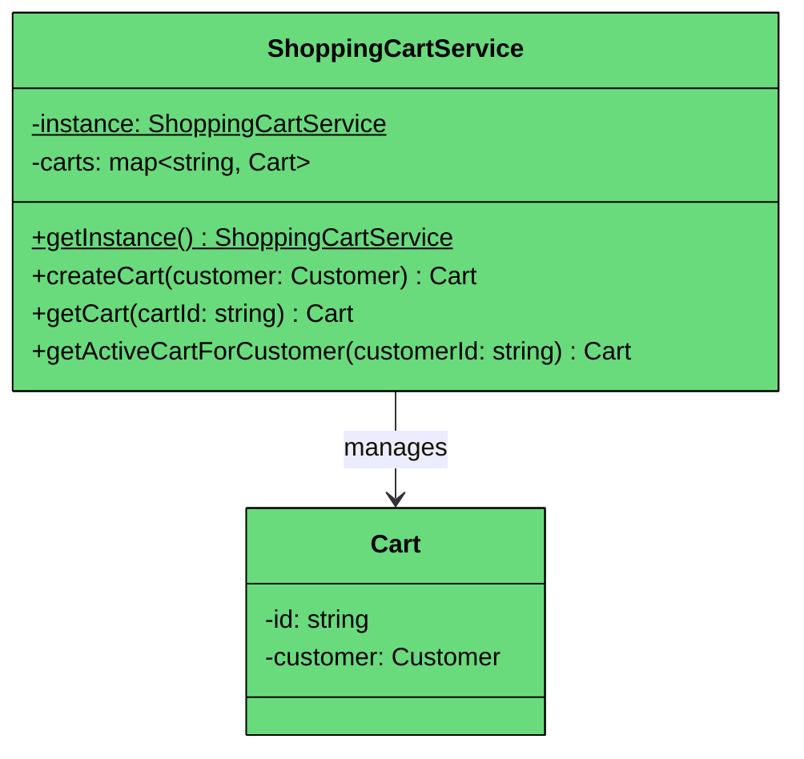

| Attribute | Type | Description | Mutable" |
|-----------|------|-------------|----------|
| `instance` | ShoppingCartService (static) | Singleton instance | No (after initialization) |
| `carts` | map<string, Cart> | Cart ID to Cart mapping | Yes (contents) |

| Method | Description |
|--------|-------------|
| `getInstance()` | Returns the singleton instance with thread-safe lazy initialization |
| `createCart(customer)` | Creates a new cart or returns existing active cart for customer |
| `getCart(cartId)` | Retrieves a cart by ID |
| `getActiveCartForCustomer(customerId)` | Finds the active cart for a customer |

The singleton pattern makes sense here because in a real application there's one cart service managing the registry. In a production system with dependency injection, you'd skip the singleton and inject the service. But for interview scope, it demonstrates the pattern cleanly.

---

## 3.2 Full Class Diagram

Here's the complete system with all relationships connected. Every entity links to at least one other, and you can trace a path from any node to any other.

```mermaid
classDiagram
    %% Enums
    class ProductCategory {
        <<enumeration>>
        ELECTRONICS
        CLOTHING
        GROCERIES
        BOOKS
        HOME_AND_KITCHEN
    }

    class CartStatus {
        <<enumeration>>
        ACTIVE
        CHECKED_OUT
        ABANDONED
    }

    class DiscountType {
        <<enumeration>>
        PERCENTAGE
        FLAT_AMOUNT
        BUY_X_GET_Y_FREE
    }

    %% Exception
    class CartException {
        +CartException(message: string)
    }

    %% Data Classes
    class Product {
        -id: string
        -name: string
        -price: double
        -category: ProductCategory
        -maxQuantityPerCart: int
    }

    class CartItem {
        -product: Product
        -quantity: int
        -priceAtAddition: double
        +getSubtotal() double
    }

    class Customer {
        -id: string
        -name: string
        -email: string
    }

    %% Interfaces
    class DiscountStrategy {
        <<interface>>
        +calculateDiscount(items: list~CartItem~) double
        +getDescription() string
        +getType() DiscountType
    }

    class CartObserver {
        <<interface>>
        +onItemAdded(cart: Cart, item: CartItem) void
        +onItemRemoved(cart: Cart, item: CartItem) void
        +onCartCheckedOut(cart: Cart) void
    }

    %% Strategy Implementations
    class PercentageDiscountStrategy {
        -percentage: double
        +calculateDiscount(items: list~CartItem~) double
        +getDescription() string
        +getType() DiscountType
    }

    class FlatAmountDiscountStrategy {
        -amount: double
        +calculateDiscount(items: list~CartItem~) double
        +getDescription() string
        +getType() DiscountType
    }

    class BuyXGetYFreeStrategy {
        -buyCount: int
        -freeCount: int
        -category: ProductCategory
        +calculateDiscount(items: list~CartItem~) double
        +getDescription() string
        +getType() DiscountType
    }

    %% Observer Implementations
    class CartEventLogger {
        +onItemAdded(cart: Cart, item: CartItem) void
        +onItemRemoved(cart: Cart, item: CartItem) void
        +onCartCheckedOut(cart: Cart) void
    }

    class AbandonedCartAlertObserver {
        -lastActivityTime: long
        +onItemAdded(cart: Cart, item: CartItem) void
        +onItemRemoved(cart: Cart, item: CartItem) void
        +onCartCheckedOut(cart: Cart) void
    }

    %% Core Classes
    class Cart {
        -id: string
        -customer: Customer
        -items: map~string, CartItem~
        -status: CartStatus
        -discountStrategy: DiscountStrategy
        -observers: list~CartObserver~
        +addItem(product: Product, quantity: int) void
        +removeItem(productId: string) void
        +checkout() void
        +getTotal() double
    }

    class ShoppingCartService {
        -instance: ShoppingCartService$
        -carts: map~string, Cart~
        +getInstance()$ ShoppingCartService
        +createCart(customer: Customer) Cart
    }

    %% Relationships
    Product --> ProductCategory : categorized by
    CartItem --> Product : references
    Cart *-- CartItem : contains
    Cart --> CartStatus : tracks
    Cart --> Customer : belongs to
    Cart --> DiscountStrategy : uses
    Cart --> CartObserver : notifies
    Cart ..> CartException : throws

    DiscountStrategy <|.. PercentageDiscountStrategy
    DiscountStrategy <|.. FlatAmountDiscountStrategy
    DiscountStrategy <|.. BuyXGetYFreeStrategy
    DiscountStrategy --> DiscountType : identifies

    BuyXGetYFreeStrategy --> ProductCategory : targets

    CartObserver <|.. CartEventLogger
    CartObserver <|.. AbandonedCartAlertObserver

    ShoppingCartService --> Cart : manages

    %% Styles
    style ProductCategory fill:#ffa94d,stroke:#000,color:#000
    style CartStatus fill:#ffa94d,stroke:#000,color:#000
    style DiscountType fill:#ffa94d,stroke:#000,color:#000
    style CartException fill:#ff8787,stroke:#000,color:#000
    style Product fill:#00ceff,stroke:#000,color:#000
    style CartItem fill:#00ceff,stroke:#000,color:#000
    style Customer fill:#00ceff,stroke:#000,color:#000
    style DiscountStrategy fill:#38d9a9,stroke:#000,color:#000
    style CartObserver fill:#38d9a9,stroke:#000,color:#000
    style PercentageDiscountStrategy fill:#38d9a9,stroke:#000,color:#000
    style FlatAmountDiscountStrategy fill:#38d9a9,stroke:#000,color:#000
    style BuyXGetYFreeStrategy fill:#38d9a9,stroke:#000,color:#000
    style CartEventLogger fill:#f783ac,stroke:#000,color:#000
    style AbandonedCartAlertObserver fill:#f783ac,stroke:#000,color:#000
    style Cart fill:#69db7c,stroke:#000,color:#000
    style ShoppingCartService fill:#69db7c,stroke:#000,color:#000
```

---

## 3.3 Design Patterns

You might notice some structural patterns emerging from the design. Let's make them explicit and justify each one.

### [Strategy Pattern](/learn/lld/strategy) (Discount Calculation)

**The Problem:** We have three different discount algorithms (percentage, flat amount, buy-X-get-Y-free), and we need to support adding new ones in the future. If we put all the discount logic inside Cart with if-else chains, every new discount type means modifying the Cart class.

**The Solution:** The Strategy pattern encapsulates each discount algorithm behind the `DiscountStrategy` interface. The Cart holds a reference to the current strategy and delegates the calculation without knowing which algorithm runs.

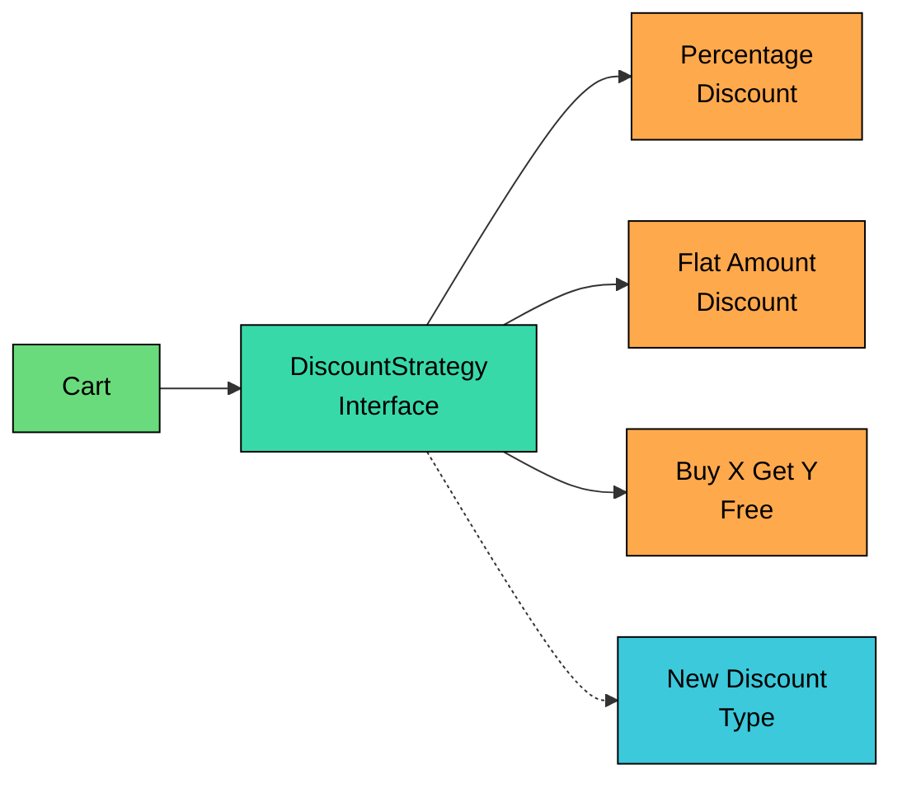

Without it, Cart.getTotal() would look like: "if discount type is percentage, do X; if flat amount, do Y; if buy-X-get-Y-free, do Z." That violates the Open/Closed principle. With Strategy, adding a "loyalty points" discount means creating a new class, not touching Cart.

### [Observer Pattern](/learn/lld/observer) (Cart Events)

**The Problem:** When something happens in the cart (item added, cart checked out), we need to log it and potentially trigger alerts. But Cart shouldn't know about loggers, alert systems, or any other downstream consumer. Hard-coding `logger.log()` inside Cart means adding every new notification type requires modifying Cart.

**The Solution:** The Observer pattern lets Cart notify a list of observers without knowing who they are or what they do. Observers register themselves, and Cart calls their methods when events occur.

It decouples the event source (Cart) from event consumers (logger, alert system). Adding a new observer (e.g., analytics tracking) means creating a new class and registering it, not changing Cart.

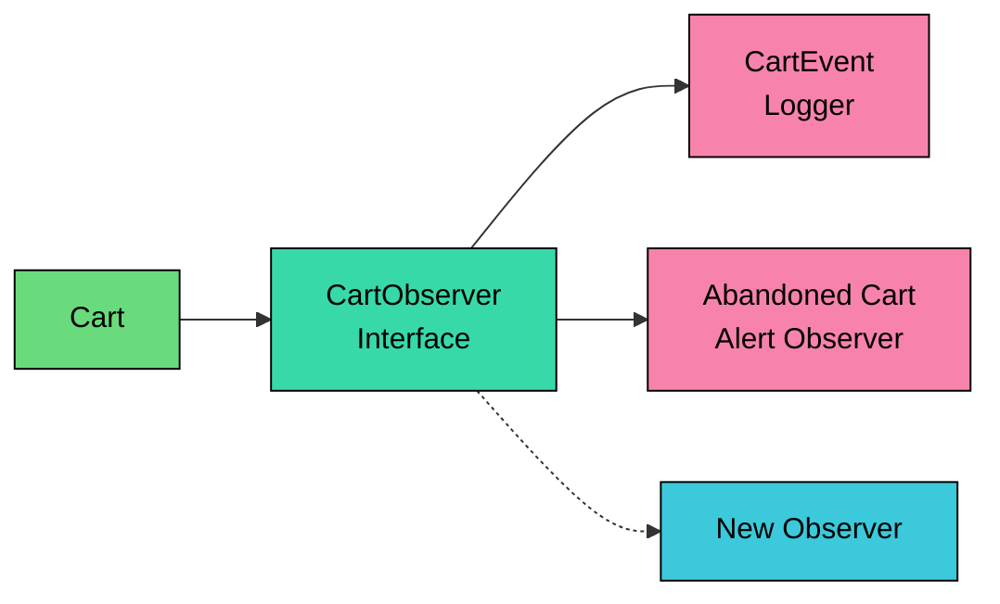

> 💡 **Key Insight:**

> **Design Alternative**
>
> We could have Cart call a logging service directly. For just one listener, that's simpler and more explicit. We chose the Observer pattern because the requirements already list two listeners (logger and abandoned cart alerts), and the pattern makes adding more trivial. In an interview where the interviewer only asks for logging, the direct call is perfectly acceptable.

### [Singleton Pattern](/learn/lld/singleton) (ShoppingCartService)

**The Problem:** We need a single, shared cart registry that all parts of the application use. Multiple instances would mean different parts of the system see different cart collections.

**The Solution:** The Singleton pattern with thread-safe lazy initialization ensures exactly one ShoppingCartService instance exists.

In a real production system you'd use dependency injection instead. But for LLD interviews, the Singleton cleanly demonstrates that you understand global access control and thread-safe initialization. It's a quick win.

---

# 4. Code Implementation

This section presents the full Java implementation, built bottom-up from the simplest building blocks to the top-level facade. Every class is thread-safe where needed, and every code block has surrounding context explaining why it's written the way it is.

#### Java

## 4.1 Enums

### ProductCategory

We start with the simplest building block. ProductCategory is a straightforward enum with no fields or methods.

```java
enum ProductCategory {
    ELECTRONICS,
    CLOTHING,
    GROCERIES,
    BOOKS,
    HOME_AND_KITCHEN
}
```

### CartStatus

CartStatus tracks the cart's lifecycle. The three values map directly to the state diagram from Section 3.

```java
enum CartStatus {
    ACTIVE,       // Cart can be modified
    CHECKED_OUT,  // Purchase complete, no modifications allowed
    ABANDONED     // Cart was abandoned, no modifications allowed
}
```

Both CHECKED_OUT and ABANDONED are terminal. Every mutating method in Cart will check for ACTIVE status before proceeding.

### DiscountType

DiscountType identifies which strategy variant is active. This lets callers inspect the discount type without downcasting the strategy object.

```java
enum DiscountType {
    PERCENTAGE,
    FLAT_AMOUNT,
    BUY_X_GET_Y_FREE
}
```

## 4.2 Exception

### CartException

All domain-specific errors flow through a single exception class. Callers can catch CartException to handle cart-specific failures (invalid state, quantity exceeded) separately from generic runtime exceptions.

```java
class CartException extends RuntimeException {
    CartException(String message) {
        super(message);
    }
}
```

We extend RuntimeException (unchecked) rather than Exception (checked) because cart errors are typically programming errors or validation failures that callers shouldn't be forced to catch at every call site.

## 4.3 Data Classes

### Product

Product is immutable. All fields are `final`, set once in the constructor. The `maxQuantityPerCart` field is validated to ensure it's positive.

```java
class Product {
    private final String id;
    private final String name;
    private final double price;
    private final ProductCategory category;
    private final int maxQuantityPerCart;

    Product(String id, String name, double price, ProductCategory category, int maxQuantityPerCart) {
        if (price < 0) throw new IllegalArgumentException("Price cannot be negative");
        if (maxQuantityPerCart <= 0) throw new IllegalArgumentException("Max quantity must be positive");
        this.id = id;
        this.name = name;
        this.price = price;
        this.category = category;
        this.maxQuantityPerCart = maxQuantityPerCart;
    }

    String getId() { return id; }
    String getName() { return name; }
    double getPrice() { return price; }
    ProductCategory getCategory() { return category; }
    int getMaxQuantityPerCart() { return maxQuantityPerCart; }
}
```

Immutability means we can safely share Product references across threads without synchronization. Multiple carts can reference the same Product object.

### CartItem

CartItem captures a product reference, quantity, and the price snapshot. The `priceAtAddition` field is the key design decision here: it freezes the price at the moment the item enters the cart.

```java
class CartItem {
    private final Product product;
    private int quantity;
    private final double priceAtAddition;

    CartItem(Product product, int quantity, double priceAtAddition) {
        this.product = product;
        this.quantity = quantity;
        this.priceAtAddition = priceAtAddition;
    }

    double getSubtotal() {
        return quantity * priceAtAddition;
    }

    Product getProduct() { return product; }
    int getQuantity() { return quantity; }
    void setQuantity(int quantity) { this.quantity = quantity; }
    double getPriceAtAddition() { return priceAtAddition; }
}
```

The `quantity` field is not final because Cart updates it when the customer changes how many units they want. However, `setQuantity` is package-private, so only Cart (in the same package) can call it. External code can't directly mutate cart items.

### Customer

Customer is a simple immutable identity object.

```java
class Customer {
    private final String id;
    private final String name;
    private final String email;

    Customer(String id, String name, String email) {
        this.id = id;
        this.name = name;
        this.email = email;
    }

    String getId() { return id; }
    String getName() { return name; }
    String getEmail() { return email; }
}
```

## 4.4 Interfaces

### DiscountStrategy

The strategy interface receives the full list of cart items. This is necessary because some strategies (buy-X-get-Y-free) need to inspect individual items and their categories, not just the subtotal.

```java
interface DiscountStrategy {
    double calculateDiscount(List<CartItem> items);
    String getDescription();
    DiscountType getType();
}
```

### CartObserver

The observer interface receives the Cart and the affected CartItem (where applicable). Observers get enough context to log, alert, or track without needing to query additional state.

```java
interface CartObserver {
    void onItemAdded(Cart cart, CartItem item);
    void onItemRemoved(Cart cart, CartItem item);
    void onCartCheckedOut(Cart cart);
}
```

## 4.5 Strategy Implementations

### PercentageDiscountStrategy

The simplest strategy. Takes a percentage (e.g., 10 for 10%) and applies it to the cart subtotal.

```java
class PercentageDiscountStrategy implements DiscountStrategy {
    private final double percentage;

    PercentageDiscountStrategy(double percentage) {
        if (percentage < 0 || percentage > 100) {
            throw new IllegalArgumentException("Percentage must be between 0 and 100");
        }
        this.percentage = percentage;
    }

    @Override
    public double calculateDiscount(List<CartItem> items) {
        double subtotal = items.stream().mapToDouble(CartItem::getSubtotal).sum();
        return subtotal * (percentage / 100.0);
    }

    @Override
    public String getDescription() {
        return percentage + "% off";
    }

    @Override
    public DiscountType getType() {
        return DiscountType.PERCENTAGE;
    }
}
```

The percentage is validated in the constructor. A 10% discount on a $100 subtotal returns $10.

### FlatAmountDiscountStrategy

Subtracts a fixed dollar amount, but never more than the subtotal. This prevents negative totals.

```java
class FlatAmountDiscountStrategy implements DiscountStrategy {
    private final double amount;

    FlatAmountDiscountStrategy(double amount) {
        if (amount < 0) {
            throw new IllegalArgumentException("Discount amount cannot be negative");
        }
        this.amount = amount;
    }

    @Override
    public double calculateDiscount(List<CartItem> items) {
        double subtotal = items.stream().mapToDouble(CartItem::getSubtotal).sum();
        // Cap at subtotal to prevent negative totals
        return Math.min(amount, subtotal);
    }

    @Override
    public String getDescription() {
        return "$" + String.format("%.2f", amount) + " off";
    }

    @Override
    public DiscountType getType() {
        return DiscountType.FLAT_AMOUNT;
    }
}
```

The `Math.min(amount, subtotal)` line is the key safety check. A $200 flat discount on a $150 cart gives $150 off, not $200.

### BuyXGetYFreeStrategy

The most complex strategy. For a given product category, buy X items and get Y cheapest ones free. The algorithm sorts eligible items by price (ascending), then marks every Nth item as free based on the buy/free ratio.

```java
$103
```

The algorithm works by expanding all eligible items into individual price entries, sorting them ascending, and then grouping them. In each group of (buyCount + freeCount) items, the first freeCount items (the cheapest ones, since the list is sorted) are made free. For example, with buy-2-get-1-free and 3 books at $44.99, $47.99, $49.99: the group is all 3 items, and the cheapest 1 ($44.99) is free, giving a $44.99 discount.

## 4.6 Observer Implementations

### CartEventLogger

A simple logger that prints cart events. In a real system, this would integrate with a logging framework.

```java
class CartEventLogger implements CartObserver {
    @Override
    public void onItemAdded(Cart cart, CartItem item) {
        System.out.println("[LOG] Item added to cart " + cart.getId() + ": "
            + item.getQuantity() + "x " + item.getProduct().getName()
            + " @ $" + String.format("%.2f", item.getPriceAtAddition()));
    }

    @Override
    public void onItemRemoved(Cart cart, CartItem item) {
        System.out.println("[LOG] Item removed from cart " + cart.getId() + ": "
            + item.getProduct().getName());
    }

    @Override
    public void onCartCheckedOut(Cart cart) {
        System.out.println("[LOG] Cart " + cart.getId() + " checked out. Total: $"
            + String.format("%.2f", cart.getTotal()));
    }
}
```

### AbandonedCartAlertObserver

Tracks the timestamp of the last cart activity. An external scheduler could periodically check carts and flag ones where `lastActivityTime` is older than a threshold.

```java
class AbandonedCartAlertObserver implements CartObserver {
    private volatile long lastActivityTime;

    AbandonedCartAlertObserver() {
        this.lastActivityTime = System.currentTimeMillis();
    }

    @Override
    public void onItemAdded(Cart cart, CartItem item) {
        lastActivityTime = System.currentTimeMillis();
    }

    @Override
    public void onItemRemoved(Cart cart, CartItem item) {
        lastActivityTime = System.currentTimeMillis();
    }

    @Override
    public void onCartCheckedOut(Cart cart) {
        // Cart checked out, no longer at risk of abandonment
        lastActivityTime = System.currentTimeMillis();
    }

    long getLastActivityTime() { return lastActivityTime; }
}
```

The `lastActivityTime` field is `volatile` because it may be read by the external scheduler thread while being written by the cart's thread. Volatile guarantees visibility across threads for this simple single-field update.

## 4.7 Core Classes

### Cart

This is the central class. It manages the items map, enforces the ACTIVE status guard on every mutation, delegates discount calculations to the strategy, and notifies observers on changes. All mutating methods are `synchronized` to prevent concurrent modification issues.

```java
$104
```

Several design choices are worth noting. The `items` field uses `ConcurrentHashMap` and the `observers` field uses `CopyOnWriteArrayList`. These concurrent collections provide thread-safe iteration in `getSubtotal()` and `getTotal()`, which are not synchronized (they're read-only operations). The `status` and `discountStrategy` fields are `volatile` so that reads from unsynchronized methods like `getTotal()` see the latest values. The `getItems()` method returns an unmodifiable view, preventing external callers from bypassing the Cart's validation by directly manipulating the map. The `validateActive()` private method is called at the top of every mutating method, creating a consistent guard pattern.

### ShoppingCartService

The singleton facade manages the cart registry. It uses double-checked locking for thread-safe lazy initialization and a `ConcurrentHashMap` for the cart collection. A static counter generates unique cart IDs.

```java
$105
```

The `instance` field is `volatile` to ensure that when one thread completes the initialization inside the synchronized block, all other threads see the fully constructed object. Without `volatile`, a thread could see a partially constructed ShoppingCartService due to instruction reordering. The `cartCounter` uses `AtomicInteger` for lock-free ID generation.

## 4.8 Sequence Diagram

Let's trace the most interesting operation end-to-end: adding an item to a cart that has an observer and then checking out with a discount applied.

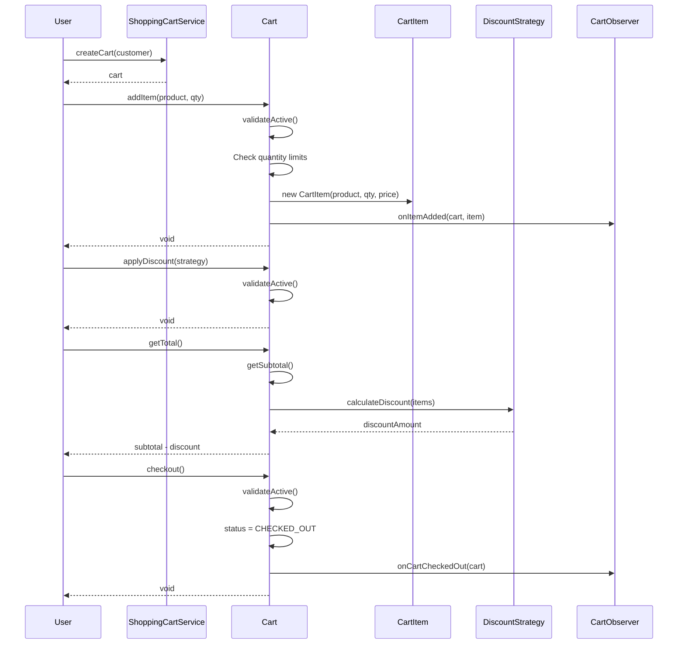

Let's walk through this flow phase by phase.

#### **Phase 1: Cart Creation**

The user asks `ShoppingCartService` for a cart. The service checks if the customer already has an active cart. If not, it generates a unique ID, creates the Cart, stores it in the registry, and returns it. This is a simple lookup-or-create operation.

#### **Phase 2: Adding an Item**

When `addItem` is called, the first thing Cart does is call `validateActive()` to ensure the cart hasn't been checked out or abandoned. Then it checks quantity limits against the product's `maxQuantityPerCart`. If the product already exists in the cart, it updates the quantity. If not, it creates a new CartItem with the price snapshot. Finally, it notifies all registered observers. If validation fails at any point, a CartException is thrown and the cart state remains unchanged.

#### **Phase 3: Applying Discount and Computing Total**

The discount strategy is set on the cart but not executed until `getTotal()` is called. This lazy evaluation means switching strategies is cheap. When `getTotal()` runs, it computes the subtotal from all items, passes the item list to the strategy's `calculateDiscount()`, and subtracts the result. The `Math.max(0, ...)` guard ensures the total never goes negative.

#### **Phase 4: Checkout**

The cart validates it's ACTIVE and not empty, then transitions the status to CHECKED_OUT. This is a one-way transition. After this point, any attempt to call `addItem`, `removeItem`, or any other mutating method will hit the `validateActive()` guard and throw. The observers are notified so the logger can record the final total.

Notice that the entire flow is protected by synchronized methods on Cart. No step can interleave with another thread's operations on the same cart.

---

# 5. Concurrency and Thread Safety

Does a shopping cart really need thread safety" If you picture a single customer clicking buttons on a web page, each click becomes a single HTTP request handled by one thread. Seems sequential.

But consider these realistic scenarios: a customer has the same store open in two browser tabs on their laptop and their phone, both modifying the cart at the same time. Or a backend process runs that applies promotional discounts to active carts while customers are still shopping. In any web application where cart objects live in server memory (or in a shared cache), concurrent access to the same cart is a real concern.

### Concern 1: Two Tabs Adding Items Simultaneously (High Risk)

The most common real-world concurrency scenario for a shopping cart is a customer (or two family members sharing an account) modifying the same cart from different sessions.

**Setup:** Alice has her store open in two browser tabs. Tab A is adding a Laptop (max 2 per cart). Tab B is also adding a Laptop. The cart currently has 0 Laptops.

**Without synchronization on **`addItem()`**:**

1. Tab A thread: Calls `addItem(laptop, 1)`, reads `currentQuantity = 0`
2. Tab B thread: Calls `addItem(laptop, 1)`, reads `currentQuantity = 0` (Tab A hasn't written yet)
3. Tab A: `newTotal = 0 + 1 = 1`, passes max quantity check (1 <= 2)
4. Tab B: `newTotal = 0 + 1 = 1`, passes max quantity check (1 <= 2)
5. Tab A: Creates CartItem with quantity 1, puts in map
6. Tab B: Creates CartItem with quantity 1, overwrites Tab A's entry

**Result:** Cart has 1 Laptop instead of 2. Tab A's addition was silently lost. Or worse, if Tab A reads quantity 0 but Tab B already created the entry, Tab A creates a new CartItem that overwrites Tab B's, and now we have a lost update either way.

**With synchronization:** Tab A acquires the Cart's lock, reads `currentQuantity = 0`, creates a CartItem with quantity 1, releases lock. Tab B acquires the lock, reads `currentQuantity = 1`, updates quantity to 2, releases lock. Both additions are correctly reflected.

The `synchronized` keyword on `addItem()` ensures the entire read-check-write sequence is atomic:

```java
synchronized void addItem(Product product, int quantity) {
    validateActive();
    CartItem existing = items.get(product.getId());
    int currentQuantity = (existing != null) " existing.getQuantity() : 0;
    int newTotal = currentQuantity + quantity;
    // ... rest of the method
}
```

### Concern 2: Checkout Racing with Item Modification (Medium Risk)

A customer is browsing and adding items while simultaneously clicking the checkout button from a different tab.

**Setup:** Alice's cart has 1 Laptop ($999.99). Tab A is adding Headphones ($149.99). Tab B clicks checkout at the same moment.

**Without synchronization:**

1. Tab B thread: Calls `checkout()`, reads `status = ACTIVE`, begins checkout logic
2. Tab A thread: Calls `addItem(headphones, 1)`, reads `status = ACTIVE` (checkout hasn't changed it yet)
3. Tab B: Sets `status = CHECKED_OUT`, notifies observers with total = $999.99
4. Tab A: Adds headphones to the cart after status is already CHECKED_OUT

**Result:** An item was added to a checked-out cart. The checkout total ($999.99) doesn't include the headphones ($149.99), but the cart now contains them. The customer might be charged differently than what the checkout recorded, or the extra item might ship without being paid for.

**With synchronization:** Tab B acquires the lock, sets `status = CHECKED_OUT`, notifies observers, releases lock. Tab A acquires the lock, calls `validateActive()`, sees CHECKED_OUT, throws CartException. The headphones are never added, and the checkout total is consistent.

---

# 6. Extensions

With our implementation complete, let's see how easily it extends to new requirements. Each extension demonstrates the Open/Closed Principle: we add new classes without modifying existing ones.

## 6.1 Coupon Codes

**Scenario:** "Now add support for coupon codes that map to discount strategies."

The Strategy pattern already separates discount logic from the Cart. Supporting coupon codes means adding a lookup layer that maps code strings to strategy instances. The Cart itself doesn't change at all.

```java
class Coupon {
    private final String code;
    private final DiscountStrategy strategy;
    private final long expiryTime;

    Coupon(String code, DiscountStrategy strategy, long expiryTime) {
        this.code = code;
        this.strategy = strategy;
        this.expiryTime = expiryTime;
    }

    boolean isValid() {
        return System.currentTimeMillis() < expiryTime;
    }

    String getCode() { return code; }
    DiscountStrategy getStrategy() { return strategy; }
}
```

```java
class CouponManager {
    private final ConcurrentHashMap<String, Coupon> coupons = new ConcurrentHashMap<>();

    void registerCoupon(Coupon coupon) {
        coupons.put(coupon.getCode(), coupon);
    }

    DiscountStrategy redeemCoupon(String code) {
        Coupon coupon = coupons.get(code);
        if (coupon == null) {
            throw new CartException("Invalid coupon code: " + code);
        }
        if (!coupon.isValid()) {
            throw new CartException("Coupon expired: " + code);
        }
        return coupon.getStrategy();
    }
}
```

Usage is straightforward: `cart.applyDiscount(couponManager.redeemCoupon("SAVE10"))`. The Cart just sees a DiscountStrategy. It doesn't know or care that it came from a coupon.

**What stays unchanged:** Cart, all existing DiscountStrategy implementations, CartObserver, ShoppingCartService.

## 6.2 Composite Discount Stacking

**Scenario:** "Allow multiple discounts to be combined on a single cart."

Our current design allows one discount at a time. To support stacking, we introduce a CompositeDiscountStrategy that holds multiple strategies and applies them sequentially.

```java
$fd
```

This follows the Composite design pattern. The Cart still calls `discountStrategy.calculateDiscount(items)`, unaware that the strategy is actually a list of strategies. The total discount is capped at the subtotal to prevent negative totals.

**What stays unchanged:** Cart, all existing DiscountStrategy implementations, CartObserver.

## 6.3 Wishlist / Save for Later

**Scenario:** "Allow customers to save items for later without removing them permanently."

We can add a `savedItems` map to the Cart that holds items moved out of the active cart. Moving an item to the wishlist removes it from `items` and adds it to `savedItems`. Moving it back does the reverse.

```java
// Added to Cart class
private final ConcurrentHashMap<String, CartItem> savedItems = new ConcurrentHashMap<>();

synchronized void saveForLater(String productId) {
    validateActive();
    CartItem item = items.remove(productId);
    if (item == null) {
        throw new CartException("Product " + productId + " not found in cart");
    }
    savedItems.put(productId, item);
}

synchronized void moveToCart(String productId) {
    validateActive();
    CartItem item = savedItems.remove(productId);
    if (item == null) {
        throw new CartException("Product " + productId + " not found in saved items");
    }
    items.put(productId, item);
    notifyItemAdded(item);
}
```

Saved items keep their original price snapshot, so the customer still gets the price they saw when they first added the item.

**What stays unchanged:** All classes except Cart (which gains two new methods and a new field). This is one of the few extensions that requires modifying an existing class, but the modification is purely additive.

## 6.4 Auto-Abandon Expired Carts

**Scenario:** "Automatically abandon carts that have been inactive for more than 30 minutes."

The Observer pattern makes this straightforward. We already have the `AbandonedCartAlertObserver` tracking activity timestamps. We add a scheduled task that periodically scans carts and abandons stale ones.

```java
class CartExpirationService {
    private final ShoppingCartService cartService;
    private final long expirationMillis;

    CartExpirationService(ShoppingCartService cartService, long expirationMillis) {
        this.cartService = cartService;
        this.expirationMillis = expirationMillis;
    }

    void expireStaleCarts() {
        long now = System.currentTimeMillis();
        // In a real system, ShoppingCartService would expose an iterator over active carts
        // For each active cart, check if its AbandonedCartAlertObserver's
        // lastActivityTime is older than (now - expirationMillis)
        // If so, call cart.abandon()
    }
}
```

The Cart's `abandon()` method already handles the state transition. The expiration service just decides when to call it.

**What stays unchanged:** Cart, all discount strategies, CartEventLogger.
