> 💡 **Key Insight:**

> **QUESTION**
>
> A **car rental system** is a service or software platform that allows customers to **book, use, and return vehicles for a temporary period** in exchange for payment.
>
> It helps people rent cars for a few hours, days, or weeks without owning them.
>
> 
> <!-- Simulation: car-rental -->
> 

In this chapter, we will explore the **low-level design of a car rental system** in detail.

Let's start by clarifying the requirements:

---

# 1. Clarifying Requirements

Before starting any design, it's important to ask thoughtful questions to uncover hidden assumptions, clarify ambiguities, and define the system's scope. In an interview setting, this dialogue demonstrates that you think before you code.

Here is an example of how a discussion between the candidate and the interviewer might unfold:

> 💡 **Key Insight:**

> **DISCUSSION**
>
> **Candidate:** "Is this a single-location rental agency or a multi-location company" Can customers return cars to a different location than where they picked up""
>
> **Interviewer:** "Multi-location. Customers should be able to pick up from one location and return to another."
>
> **Candidate:** "Should we support different vehicle categories with different pricing" How granular should the categories be""
>
> **Interviewer:** "Yes. Support categories like Economy, Compact, SUV, Luxury, and Van. Each category has its own daily rate."
>
> **Candidate:** "When a customer makes a reservation, do they reserve a specific car or just a vehicle type" When is the actual car assigned""
>
> **Interviewer:** "They reserve a vehicle type. The specific car gets assigned at pickup time, based on what's available at the location."
>
> **Candidate:** "Should we support additional equipment rentals like GPS, child seats, or insurance""
>
> **Interviewer:** "Yes, those should be add-ons with their own daily rates that get included in the final bill."
>
> **Candidate:** "How should pricing work" Is it always a flat daily rate, or should we support different pricing models like weekend rates or seasonal pricing""
>
> **Interviewer:** "Let's support configurable pricing strategies. Standard daily rate is the default, but we should be able to swap in weekend pricing or other models."
>
> **Candidate:** "Do we need to handle concurrent reservations" Two customers trying to book the last SUV at the same location at the same time""
>
> **Interviewer:** "Yes, the system should be thread-safe. Only one reservation should succeed when inventory is limited."
>
> **Candidate:** "Should we handle late returns" What about vehicle maintenance after returns""
>
> **Interviewer:** "Yes to both. Late returns should incur additional fees, and we should track vehicle status through maintenance before it becomes available again."

After gathering the details, we can summarize the key system requirements.

## 1.1 Functional Requirements

- Support multiple rental locations where vehicles are stored and managed
- Support different vehicle types (Economy, Compact, SUV, Luxury, Van) with distinct daily rates
- Allow customers to make reservations by vehicle type, pickup location, and date range
- Support different pickup and return locations (one-way rentals)
- Assign a specific vehicle at pickup time based on availability at the location
- Track vehicle status through its lifecycle: Available, Reserved, Rented, Under Maintenance
- Support add-on equipment (GPS, Child Seat, Insurance) with daily rates
- Calculate rental cost based on duration, vehicle type, equipment, and pricing strategy
- Support configurable pricing strategies (standard, weekend)
- Handle late returns with additional fees
- Notify observers when reservations are created, vehicles picked up, and vehicles returned

---

## 1.2 Non-Functional Requirements

- The design should follow object-oriented principles with clear separation of concerns
- The system should handle concurrent reservation requests without double-booking
- The system should be modular and extensible to support future enhancements
- The code should be thread-safe for concurrent access
- The components should be testable in isolation

---

# 2. Identifying Core Entities

> [!PAYWALL] This content is for premium members only.

How do you go from a list of requirements to actual classes" The key is to look for **nouns** in the requirements that have distinct attributes or behaviors. Not every noun becomes a class, but this approach gives you a starting point.

Let's walk through our requirements and identify what needs to exist in our system.

### 2.1 Vehicles and Types

> "Support different vehicle types (Economy, Compact, SUV, Luxury, Van) with distinct daily rates"

Every car in the fleet is an individual **Vehicle** with a license plate, make/model, and current status. But customers don't reserve a specific car, they reserve a type. So we also need a **VehicleType** enum for categorization and a **VehicleStatus** enum to track each car's lifecycle.

Why separate VehicleType from Vehicle" Because a customer says "I want an SUV," not "I want the 2023 Ford Explorer with plate GHI-9012." The type drives pricing and availability searches, while the individual vehicle handles physical tracking.

### 2.2 Reservations and Their Lifecycle

> "Allow customers to make reservations by vehicle type, pickup location, and date range"

A **Reservation** captures the customer's intent: which vehicle type, where to pick up, where to return, and when. It progresses through a lifecycle: PENDING when created, CONFIRMED when inventory is verified, ACTIVE when the customer picks up the car, COMPLETED when they return it, or CANCELLED if they change their mind. This gives us a **ReservationStatus** enum.

### 2.3 Locations

> "Support multiple rental locations where vehicles are stored and managed"

A **Location** represents a physical rental branch. Vehicles belong to locations, and customers specify pickup and return locations. Keeping locations as first-class entities (rather than just strings) gives us room to add addresses, operating hours, or regional rules later.

### 2.4 Customers and Equipment

> "Support add-on equipment (GPS, Child Seat, Insurance) with daily rates"

A **Customer** has basic profile information and a driving license. An **Equipment** represents an add-on item with its own daily rate. We also need an **EquipmentType** enum to categorize add-ons and a **PaymentMethod** enum for billing.

### 2.5 Billing

> "Calculate rental cost based on duration, vehicle type, equipment, and pricing strategy"

A **Bill** breaks down the charges: base vehicle cost, equipment cost, late fees, and total. It's generated at return time and captures the financial summary of the rental.

### 2.6 Pricing Strategy and Notifications

> "Support configurable pricing strategies" and "Notify observers when reservations are created"

A **PricingStrategy** interface allows different pricing algorithms (standard daily rate vs. weekend rates). A **RentalObserver** interface decouples the system from specific notification channels.

Here's how these entities relate to each other:

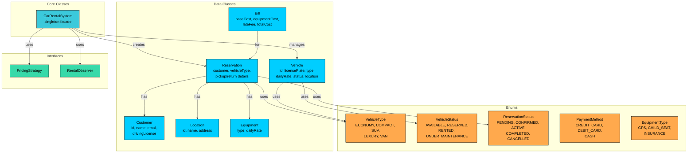

We've identified four types of entities:

**Enums** define fixed sets of values. They provide type safety and make code self-documenting.

**Data Classes** primarily hold data with minimal behavior. Customer, Location, Vehicle, Equipment, Reservation, and Bill are containers with some helper methods.

**Interfaces** define contracts for interchangeable behavior. PricingStrategy and RentalObserver allow different implementations to be swapped in.

**Core Classes** contain the main logic. CarRentalSystem orchestrates the entire system as a singleton facade.

| Entity | Type | Responsibility |
|--------|------|----------------|
| `VehicleType` | Enum | Vehicle categories: ECONOMY, COMPACT, SUV, LUXURY, VAN |
| `VehicleStatus` | Enum | Vehicle lifecycle: AVAILABLE, RESERVED, RENTED, UNDER_MAINTENANCE |
| `ReservationStatus` | Enum | Reservation lifecycle: PENDING, CONFIRMED, ACTIVE, COMPLETED, CANCELLED |
| `PaymentMethod` | Enum | Payment types: CREDIT_CARD, DEBIT_CARD, CASH |
| `EquipmentType` | Enum | Add-on categories: GPS, CHILD_SEAT, INSURANCE |
| `CarRentalException` | Exception | Domain-specific error for rental failures |
| `Customer` | Data Class | Customer profile with driving license |
| `Location` | Data Class | Physical rental branch (id, name, address) |
| `Vehicle` | Data Class | Individual car with type, rate, status, location |
| `Equipment` | Data Class | Add-on item with type and daily rate |
| `Reservation` | Data Class | Booking details with lifecycle tracking |
| `Bill` | Data Class | Itemized cost breakdown for a rental |
| `PricingStrategy` | Interface | Contract for rental cost calculation |
| `RentalObserver` | Interface | Contract for rental event notifications |

| `CarRentalSystem` | Core Class (Singleton) | Orchestrates locations, vehicles, reservations, and billing |

With our entities identified, let's define their attributes, behaviors, and relationships.

---

# 3. Designing Classes and Relationships

Now that we know what entities we need, let's flesh out their details. For each class, we'll define what data it holds (attributes) and what it can do (methods). Then we'll look at how these classes connect to each other.

## 3.1 Class Definitions

We'll work bottom-up: simple types first, then data containers, then the classes with real logic. This order makes sense because complex classes depend on simpler ones.

### Enums

Enums define fixed sets of values that provide type safety and make code self-documenting. Using enums prevents invalid states at compile time rather than runtime.

#### VehicleType

We need a way to categorize vehicles for reservation searches and pricing. We could use raw strings ("economy", "suv"), but that opens the door to typos and inconsistency. An enum gives us a closed, type-safe set of vehicle categories.

`VehicleType` represents the categories of vehicles available for rent.

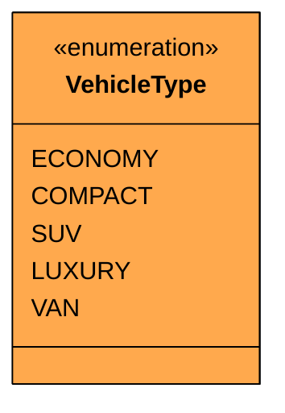

| Value | Typical Use Case | Daily Rate Range |
|-------|-----------------|------------------|
| `ECONOMY` | Budget travelers, solo trips | $30-50/day |
| `COMPACT` | City driving, small families | $40-60/day |
| `SUV` | Families, outdoor trips | $60-90/day |
| `LUXURY` | Business travelers, special occasions | $100-200/day |
| `VAN` | Group travel, moving | $70-100/day |

Each vehicle type maps to a pricing tier. The daily rate is stored on the individual Vehicle, not the enum, because rates can vary by location and fleet age.

#### VehicleStatus

Every vehicle in the fleet goes through a lifecycle. We need to track where each car is in that lifecycle to determine availability, prevent double-assignments, and manage maintenance schedules.

`VehicleStatus` tracks the current state of an individual vehicle.

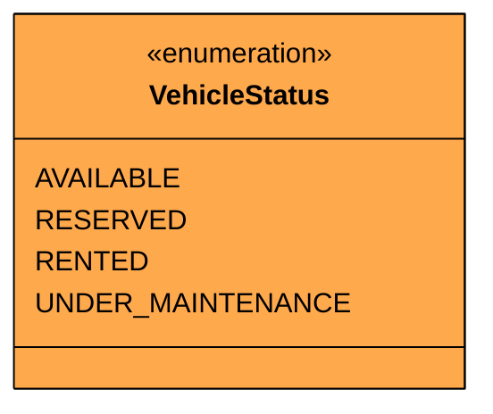

| Value | Meaning |
|-------|---------|
| `AVAILABLE` | Ready to rent at a location |
| `RESERVED` | Assigned to an upcoming reservation |
| `RENTED` | Currently with a customer |
| `UNDER_MAINTENANCE` | Being serviced, not available for rent |

##### State Transition Diagram

The state diagram makes transition rules explicit. It answers "what can happen next"" and just as importantly, "what CAN'T happen""

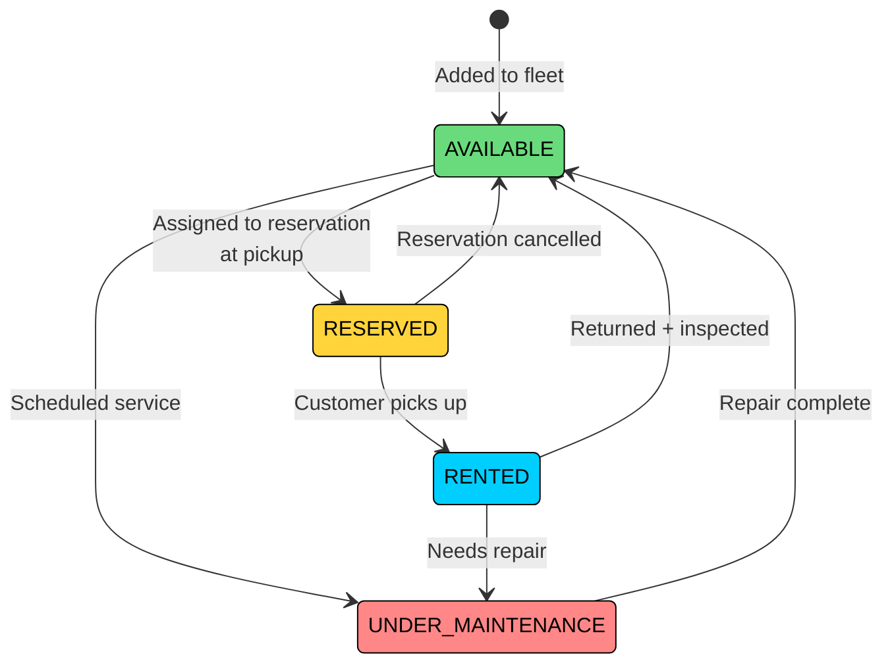

Notice that RENTED cannot transition directly to RESERVED. A car must go through AVAILABLE first (after return and inspection) before it can be assigned to another reservation. Also, UNDER_MAINTENANCE always transitions back to AVAILABLE, never directly to RENTED. These constraints prevent a car from being handed to a customer without proper inspection.

#### ReservationStatus

A reservation follows its own lifecycle, separate from the vehicle. A reservation can be cancelled even after confirmation, and a vehicle can be returned to maintenance regardless of other reservations for that vehicle type.

`ReservationStatus` tracks where a reservation is in its lifecycle.

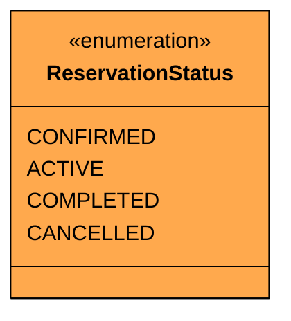

##### State Transition Diagram

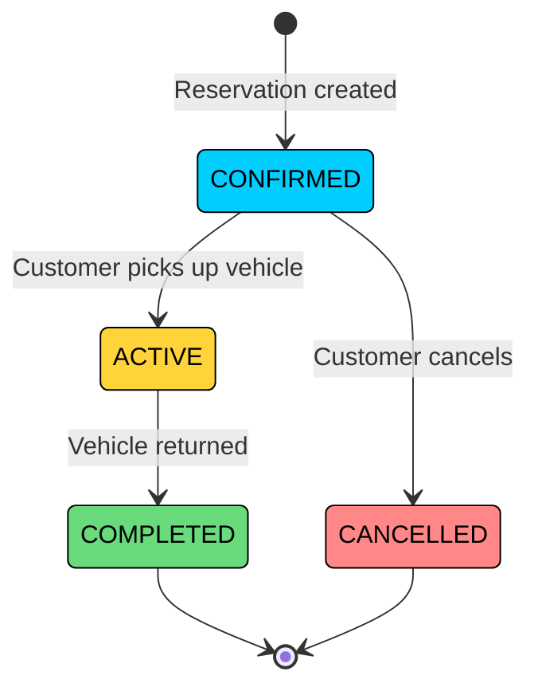

Notice that ACTIVE can only transition to COMPLETED (not CANCELLED). Once a customer has the car, they must return it. Cancellation after pickup is handled through the return process with potential early-return fees. Also, COMPLETED and CANCELLED are terminal states. A cancelled reservation can't be "uncancelled" since we'd create a new reservation instead.

#### PaymentMethod and EquipmentType

Two simpler enums round out our type definitions.

`PaymentMethod` defines accepted payment types.

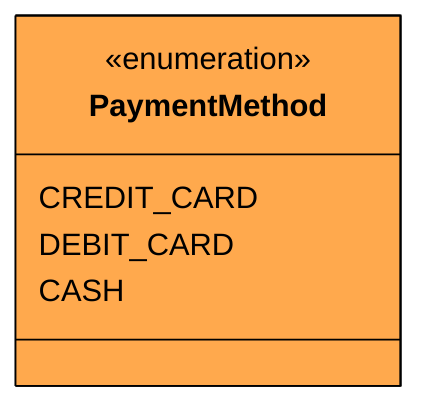

`EquipmentType` categorizes add-on items that can be rented alongside a vehicle.

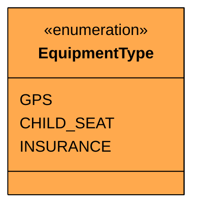

These enums are straightforward categorizations. GPS, child seats, and insurance each have different daily rates, but the rates are stored on the Equipment object, not the enum, since they might vary by location.

### Custom Exception

Before we write classes that can fail, let's define how they fail. A custom exception makes error handling cleaner than catching generic `RuntimeException`.

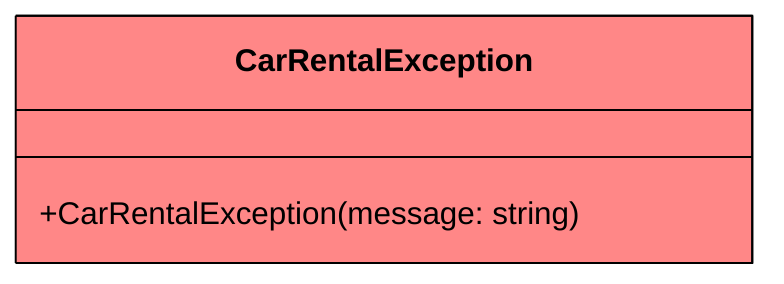

We'll throw this when no vehicles are available, a reservation is in an invalid state for the requested operation, or a vehicle assignment fails at pickup.

### Data Classes

Data classes are simple containers that hold data with minimal behavior. They represent the "nouns" in our system that have attributes but limited logic.

#### Customer

A customer is someone renting a vehicle. They have basic contact information and a driving license number. In a real system, license validation would involve external service calls, but for this design we just store the license string.

`Customer` represents a person renting a vehicle.

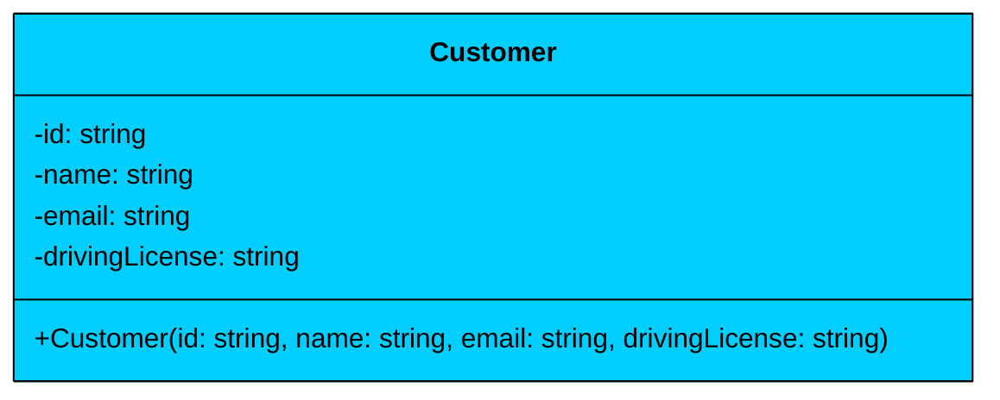

| Attribute | Type | Description | Mutable" |
|-----------|------|-------------|----------|
| `id` | string | Unique customer identifier | No |
| `name` | string | Customer's full name | No |
| `email` | string | Email for notifications and receipts | No |
| `drivingLicense` | string | Driver's license number | No |

The Customer class is **immutable**. All fields are read-only, set once at construction. In this design, customers are identity holders. Authentication, credit checks, and loyalty tiers are out of scope.

#### Location

A location is a physical rental branch. Vehicles are stored at locations, and customers specify pickup and return locations when reserving.

`Location` represents a rental branch.

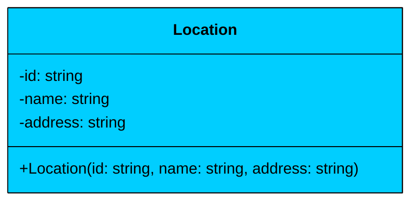

| Attribute | Type | Description | Mutable" |
|-----------|------|-------------|----------|
| `id` | string | Unique location identifier | No |
| `name` | string | Branch name (e.g., "JFK Airport") | No |
| `address` | string | Physical address | No |

Also **immutable**. If a branch moves, you'd decommission the old location and create a new one. Keeping locations immutable simplifies concurrency since multiple threads can read location data without synchronization.

#### Vehicle

A vehicle is an individual car in the fleet. Unlike VehicleType (which is a category), Vehicle represents a specific physical car with a license plate, daily rate, and current status.

`Vehicle` represents a specific car available for rent.

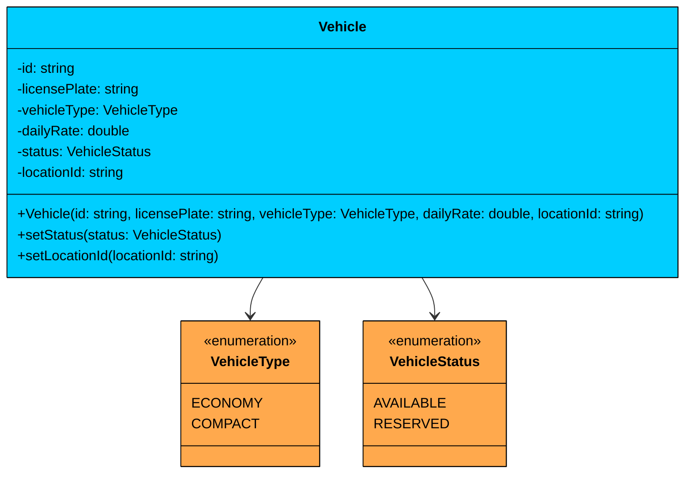

| Attribute | Type | Description | Mutable" |
|-----------|------|-------------|----------|
| `id` | string | Unique vehicle identifier | No |
| `licensePlate` | string | License plate number | No |
| `vehicleType` | VehicleType | Category (Economy, SUV, etc.) | No |
| `dailyRate` | double | Base cost per day | No |
| `status` | VehicleStatus | Current lifecycle state | Yes |
| `locationId` | string | Current location ID | Yes |

| Method | Description |
|--------|-------------|
| `setStatus(status)` | Updates vehicle lifecycle state |
| `setLocationId(locationId)` | Updates vehicle's current location (after return to different branch) |

Vehicle is **mostly immutable**. The identity fields (id, license plate, type, rate) never change. But `status` and `locationId` are mutable because they change throughout the vehicle's lifecycle. A car starts as AVAILABLE at JFK Airport, gets RENTED, and might be returned to Downtown Manhattan.

**Relationship:** Vehicle has **associations** with VehicleType and VehicleStatus. It references a location by ID rather than holding a Location object, keeping the dependency lightweight.

---

#### Equipment

Equipment represents an add-on item that a customer can rent alongside their vehicle.

`Equipment` represents a rentable add-on.

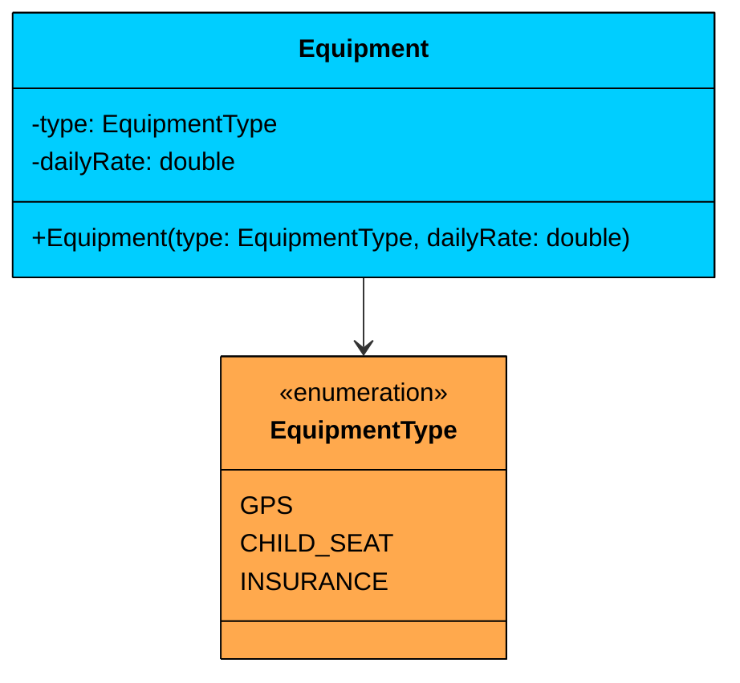

| Attribute | Type | Description | Mutable" |
|-----------|------|-------------|----------|
| `type` | EquipmentType | Category of add-on | No |
| `dailyRate` | double | Cost per day for this add-on | No |

Equipment is **immutable**. The type and rate are fixed at creation. If GPS pricing changes, you'd create a new Equipment instance rather than modifying the existing one.

#### Reservation

A reservation is the central data object in this system. It ties together who is renting, what type of vehicle, where and when, any add-on equipment, and which specific vehicle gets assigned at pickup.

`Reservation` captures a customer's rental booking.

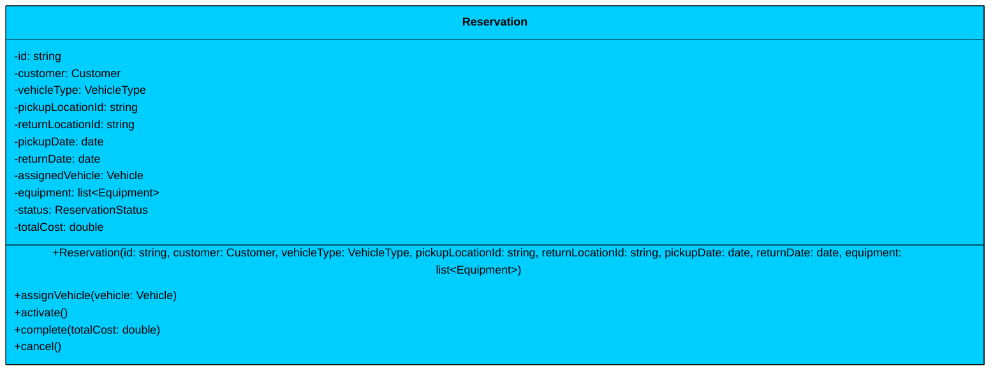

| Attribute | Type | Description | Mutable" |
|-----------|------|-------------|----------|
| `id` | string | Unique reservation identifier | No |
| `customer` | Customer | Who is renting | No |
| `vehicleType` | VehicleType | Requested category | No |
| `pickupLocationId` | string | Where to pick up | No |
| `returnLocationId` | string | Where to return | No |
| `pickupDate` | date | Rental start date | No |
| `returnDate` | date | Expected return date | No |
| `assignedVehicle` | Vehicle | Specific car (assigned at pickup) | Yes |
| `equipment` | list\<Equipment\> | Add-on items | No |
| `status` | ReservationStatus | Current lifecycle state | Yes |
| `totalCost` | double | Final cost (set at completion) | Yes |

| Method | Description |
|--------|-------------|
| `assignVehicle(vehicle)` | Links a specific vehicle at pickup time |
| `activate()` | Transitions from CONFIRMED to ACTIVE |
| `complete(totalCost)` | Transitions from ACTIVE to COMPLETED, records cost |
| `cancel()` | Transitions from CONFIRMED to CANCELLED |

The Reservation class is mostly immutable. The booking details (customer, type, dates, locations, equipment) are set at creation and never change. But three fields are mutable: `assignedVehicle` (null until pickup), `status` (progresses through the lifecycle), and `totalCost` (calculated at return). The state transition methods enforce the lifecycle: you can only activate a CONFIRMED reservation, only complete an ACTIVE one, and only cancel a CONFIRMED one.

**Relationship:** Reservation has **associations** with Customer, Vehicle, and Equipment. The Reservation doesn't own these objects, it references them. A Customer exists independently of their reservations.

#### Bill

A bill is generated when a vehicle is returned. It breaks down the charges into base cost, equipment cost, and late fees.

`Bill` represents the financial summary of a completed rental.

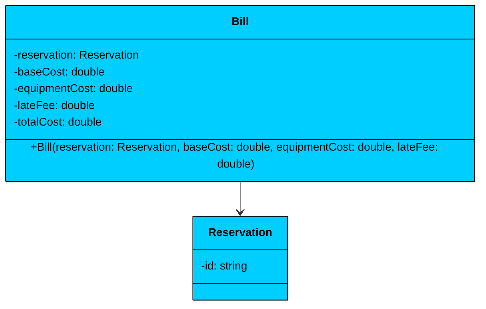

| Attribute | Type | Description | Mutable" |
|-----------|------|-------------|----------|
| `reservation` | Reservation | The rental this bill is for | No |
| `baseCost` | double | Vehicle daily rate x rental days | No |
| `equipmentCost` | double | Sum of equipment daily rates x rental days | No |
| `lateFee` | double | Additional charge for late return | No |
| `totalCost` | double | baseCost + equipmentCost + lateFee | No |

Bill is **fully immutable**. Once generated, it serves as a receipt. The total is calculated at construction time: `totalCost = baseCost + equipmentCost + lateFee`.

Now that we have our data classes, we need interfaces that define how pricing and notifications work.

### Interfaces

Interfaces define contracts for interchangeable behavior. They enable the Strategy and Observer patterns.

#### PricingStrategy

Different business scenarios call for different pricing. Standard rates apply on weekdays, but weekends might cost more. Airport locations might charge a premium. Rather than hardcoding one calculation, we define a contract that any pricing algorithm must fulfill.

`PricingStrategy` defines how rental cost is calculated.

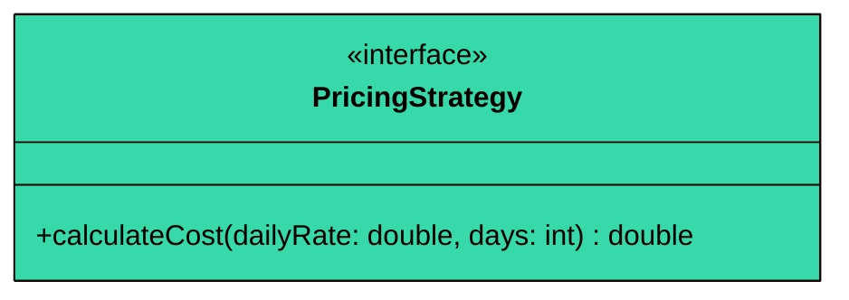

The strategy takes the vehicle's daily rate and the number of rental days, and returns the base cost. Different implementations can apply multipliers, discounts, or tiered pricing. The strategy only handles the base vehicle cost, not equipment or late fees, keeping each calculation focused.

#### RentalObserver

When a reservation is created, a vehicle is picked up, or a car is returned, multiple systems need to react: email confirmations, invoice generation, fleet analytics. If the CarRentalSystem directly called each of these, adding a new notification channel would mean modifying the core class.

`RentalObserver` defines a listener for rental lifecycle events.

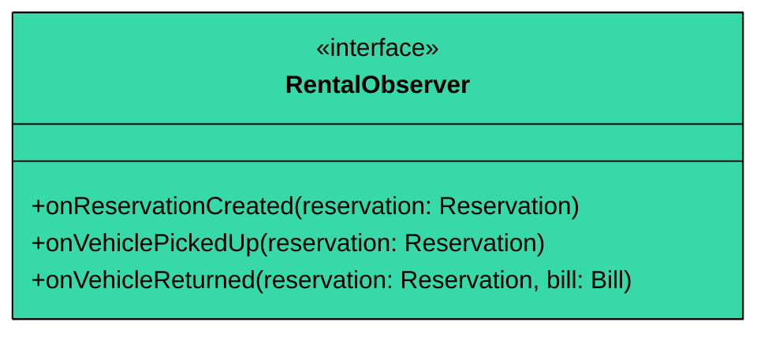

Three methods cover the key lifecycle events. The `onVehicleReturned` method includes the Bill so observers can generate receipts or trigger payment processing. Each observer handles events independently, and the system doesn't know or care who's listening.

### Strategy Implementations

#### StandardPricingStrategy

The simplest pricing: flat daily rate times number of days.

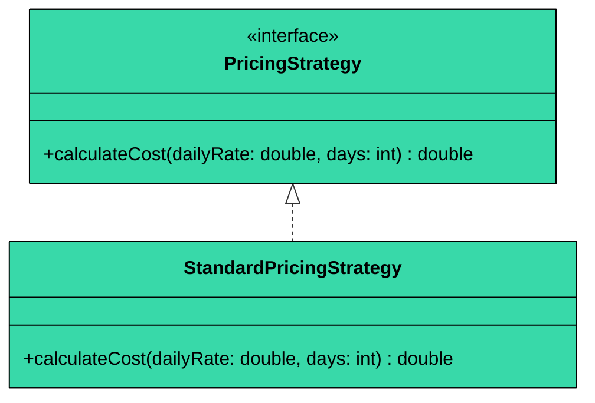

Standard pricing is `dailyRate * days`. No multipliers, no tiers. This is the default strategy and works for most weekday business rentals.

#### WeekendPricingStrategy

Applies a premium multiplier (1.5x) to the standard rate. Rental agencies commonly charge more on weekends due to higher demand from leisure travelers.

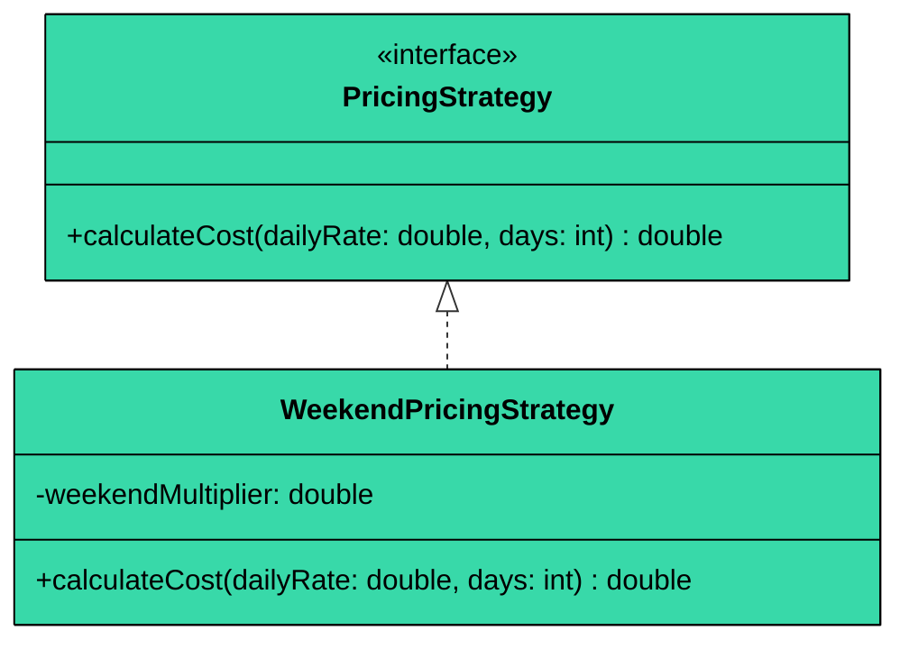

The multiplier is configurable at construction, defaulting to 1.5. This means a $50/day Economy car costs $75/day on weekends. The strategy applies the multiplier uniformly to all days (a simplification; a production system might count actual weekend days in the range).

**Relationship:** Both strategies implement the PricingStrategy interface. The CarRentalSystem depends on the interface, not the concrete classes.

### Observer Implementations

#### EmailNotificationObserver

Sends email-style notifications for reservation events. In a real system, this would call an email API (SendGrid, SES). For this design, it prints formatted messages.

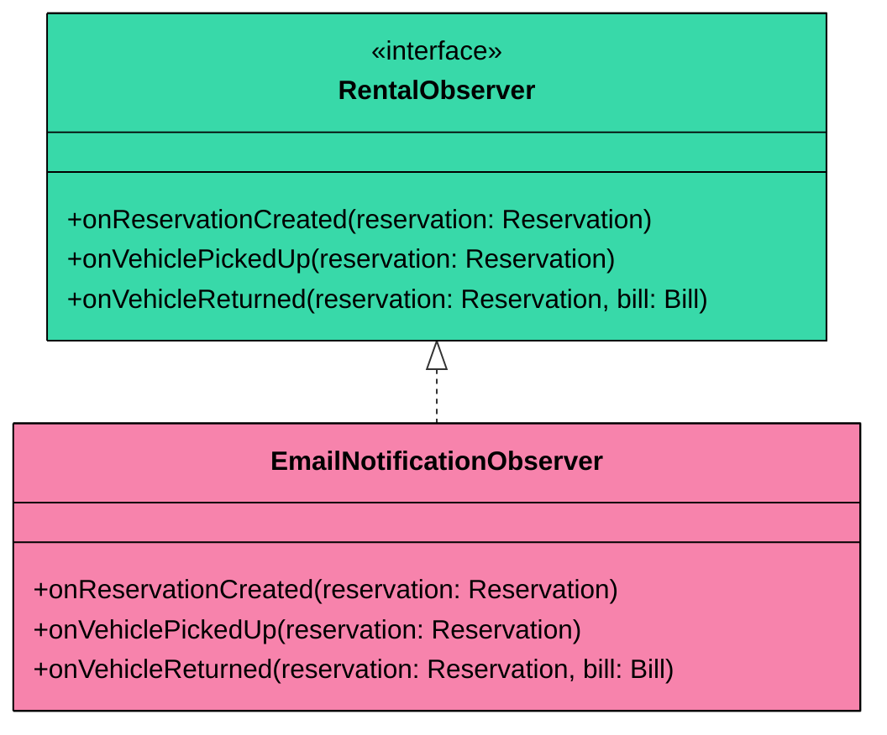

#### InvoiceObserver

Generates invoice records when a vehicle is returned. This observer only reacts to the return event since that's when billing is finalized.

```mermaid
classDiagram
    class RentalObserver {
        <<interface>>
        +onReservationCreated(reservation: Reservation)
        +onVehiclePickedUp(reservation: Reservation)
        +onVehicleReturned(reservation: Reservation, bill: Bill)
    }
    class InvoiceObserver {
        +onReservationCreated(reservation: Reservation)
        +onVehiclePickedUp(reservation: Reservation)
        +onVehicleReturned(reservation: Reservation, bill: Bill)
    }
    RentalObserver <|.. InvoiceObserver
    style RentalObserver fill:#38d9a9,stroke:#000,color:#000
    style InvoiceObserver fill:#f783ac,stroke:#000,color:#000
```

**Relationship:** Both observers implement the RentalObserver interface. The CarRentalSystem maintains a list of observers and notifies all of them when events occur.

### Core Class

#### CarRentalSystem

This is the heart of the system. It coordinates locations, vehicles, reservations, pricing, and notifications. As a singleton, it ensures consistent state across all operations.

`CarRentalSystem` is the central facade that manages the entire rental operation.

```mermaid
classDiagram
    class CarRentalSystem {
        -instance: CarRentalSystem$
        -locations: map~string, Location~
        -vehicles: map~string, Vehicle~
        -reservations: map~string, Reservation~
        -locationVehicles: map~string, list~Vehicle~~
        -observers: list~RentalObserver~
        -pricingStrategy: PricingStrategy
        -CarRentalSystem()
        +getInstance()$ CarRentalSystem
        +addLocation(location: Location)
        +addVehicle(vehicle: Vehicle)
        +makeReservation(...) Reservation
        +pickupVehicle(reservationId: string) Vehicle
        +returnVehicle(reservationId: string, returnLocationId: string, actualReturnDate: date) Bill
        +cancelReservation(reservationId: string)
        +setPricingStrategy(strategy: PricingStrategy)
        +addObserver(observer: RentalObserver)
    }
    class Vehicle {
        -id: string
    }
    class Reservation {
        -id: string
    }
    class PricingStrategy {
        <<interface>>
    }
    class RentalObserver {
        <<interface>>
    }
    CarRentalSystem *-- Vehicle : manages
    CarRentalSystem *-- Reservation : creates
    CarRentalSystem --> PricingStrategy : uses
    CarRentalSystem --> RentalObserver : notifies
    style CarRentalSystem fill:#69db7c,stroke:#000,color:#000
    style Vehicle fill:#00ceff,stroke:#000,color:#000
    style Reservation fill:#00ceff,stroke:#000,color:#000
    style PricingStrategy fill:#38d9a9,stroke:#000,color:#000
    style RentalObserver fill:#38d9a9,stroke:#000,color:#000
```

| Attribute | Type | Description |
|-----------|------|-------------|
| `instance` | CarRentalSystem (static) | Singleton instance, uses thread-safe lazy initialization |
| `locations` | map\<string, Location\> | All registered locations (thread-safe map) |
| `vehicles` | map\<string, Vehicle\> | All vehicles by ID (thread-safe map) |
| `reservations` | map\<string, Reservation\> | All reservations by ID (thread-safe map) |
| `locationVehicles` | map\<string, list\<Vehicle\>\> | Per-location vehicle lists for availability searches |
| `observers` | list\<RentalObserver\> | Registered event listeners (thread-safe list) |
| `pricingStrategy` | PricingStrategy | Current pricing algorithm |

| Method | Description |
|--------|-------------|
| `getInstance()` | Returns the singleton instance (thread-safe lazy initialization) |
| `addLocation(location)` | Registers a new rental branch |
| `addVehicle(vehicle)` | Adds a vehicle to the fleet at its assigned location |
| `makeReservation(...)` | Creates a reservation, verifies availability, notifies observers |
| `pickupVehicle(reservationId)` | Assigns a specific vehicle, transitions to ACTIVE |
| `returnVehicle(reservationId, returnLocationId, actualReturnDate)` | Calculates bill, completes reservation, frees vehicle |
| `cancelReservation(reservationId)` | Cancels a reservation, frees any assigned vehicle |
| `setPricingStrategy(strategy)` | Changes the pricing algorithm at runtime |
| `addObserver(observer)` | Registers a notification listener |

**Key Design Principles:**

1. **Singleton:** Only one rental system exists, providing consistent state across all operations
2. **Facade:** Hides the complexity of fleet management, availability checking, billing, and notifications behind a clean API
3. **Per-location vehicle lists:** The `locationVehicles` map enables efficient availability searches. Instead of scanning every vehicle in the fleet, we only check vehicles at the requested pickup location
4. **Thread safety:** Thread-safe collections for vehicle/reservation storage, synchronized compound operations, and a thread-safe observer list

**Relationship:** CarRentalSystem has **composition** relationships with Vehicle and Reservation (it manages their lifecycle). It has **associations** with PricingStrategy and RentalObserver (it uses them but doesn't own them).

---

## 3.2 Full Class Diagram

Here's the complete system with all classes and their relationships:

```mermaid
classDiagram
    %% Enums
    class VehicleType {
        <<enumeration>>
        ECONOMY
        COMPACT
        SUV
        LUXURY
        VAN
    }

    class VehicleStatus {
        <<enumeration>>
        AVAILABLE
        RESERVED
        RENTED
        UNDER_MAINTENANCE
    }

    class ReservationStatus {
        <<enumeration>>
        CONFIRMED
        ACTIVE
        COMPLETED
        CANCELLED
    }

    class PaymentMethod {
        <<enumeration>>
        CREDIT_CARD
        DEBIT_CARD
        CASH
    }

    class EquipmentType {
        <<enumeration>>
        GPS
        CHILD_SEAT
        INSURANCE
    }

    %% Exception
    class CarRentalException {
        +CarRentalException(message: string)
    }

    %% Data Classes
    class Customer {
        -id: string
        -name: string
        -email: string
        -drivingLicense: string
    }

    class Location {
        -id: string
        -name: string
        -address: string
    }

    class Vehicle {
        -id: string
        -licensePlate: string
        -vehicleType: VehicleType
        -dailyRate: double
        -status: VehicleStatus
        -locationId: string
    }

    class Equipment {
        -type: EquipmentType
        -dailyRate: double
    }

    class Reservation {
        -id: string
        -customer: Customer
        -vehicleType: VehicleType
        -pickupLocationId: string
        -returnLocationId: string
        -assignedVehicle: Vehicle
        -equipment: list~Equipment~
        -status: ReservationStatus
        +assignVehicle(vehicle: Vehicle)
        +activate()
        +complete(totalCost: double)
        +cancel()
    }

    class Bill {
        -reservation: Reservation
        -baseCost: double
        -equipmentCost: double
        -lateFee: double
        -totalCost: double
    }

    %% Interfaces
    class PricingStrategy {
        <<interface>>
        +calculateCost(dailyRate: double, days: int) double
    }

    class RentalObserver {
        <<interface>>
        +onReservationCreated(reservation: Reservation)
        +onVehiclePickedUp(reservation: Reservation)
        +onVehicleReturned(reservation: Reservation, bill: Bill)
    }

    %% Strategy Implementations
    class StandardPricingStrategy {
        +calculateCost(dailyRate: double, days: int) double
    }

    class WeekendPricingStrategy {
        -weekendMultiplier: double
        +calculateCost(dailyRate: double, days: int) double
    }

    %% Observer Implementations
    class EmailNotificationObserver {
        +onReservationCreated(reservation: Reservation)
        +onVehiclePickedUp(reservation: Reservation)
        +onVehicleReturned(reservation: Reservation, bill: Bill)
    }

    class InvoiceObserver {
        +onReservationCreated(reservation: Reservation)
        +onVehiclePickedUp(reservation: Reservation)
        +onVehicleReturned(reservation: Reservation, bill: Bill)
    }

    %% Core Class
    class CarRentalSystem {
        -instance: CarRentalSystem$
        -locations: map~string, Location~
        -vehicles: map~string, Vehicle~
        -reservations: map~string, Reservation~
        -locationVehicles: map~string, list~Vehicle~~
        -observers: list~RentalObserver~
        -pricingStrategy: PricingStrategy
        +getInstance()$ CarRentalSystem
        +addLocation(location: Location)
        +addVehicle(vehicle: Vehicle)
        +makeReservation(...) Reservation
        +pickupVehicle(reservationId: string) Vehicle
        +returnVehicle(...) Bill
        +cancelReservation(reservationId: string)
    }

    %% Relationships - FULLY CONNECTED
    %% Enums connect to data classes
    Vehicle --> VehicleType : categorized by
    Vehicle --> VehicleStatus : tracks
    Reservation --> ReservationStatus : tracks
    Reservation --> VehicleType : requests
    Equipment --> EquipmentType : categorized by

    %% Data class relationships
    Reservation --> Customer : booked by
    Reservation --> Vehicle : assigned
    Reservation --> Equipment : includes
    Bill --> Reservation : charges for

    %% Interface implementations
    PricingStrategy <|.. StandardPricingStrategy
    PricingStrategy <|.. WeekendPricingStrategy
    RentalObserver <|.. EmailNotificationObserver
    RentalObserver <|.. InvoiceObserver

    %% Core relationships
    CarRentalSystem *-- Location : manages
    CarRentalSystem *-- Vehicle : manages
    CarRentalSystem *-- Reservation : creates
    CarRentalSystem --> PricingStrategy : uses
    CarRentalSystem --> RentalObserver : notifies

    %% Exception usage
    CarRentalSystem --> CarRentalException : throws

    %% Styles
    style VehicleType fill:#ffa94d,stroke:#000,color:#000
    style VehicleStatus fill:#ffa94d,stroke:#000,color:#000
    style ReservationStatus fill:#ffa94d,stroke:#000,color:#000
    style PaymentMethod fill:#ffa94d,stroke:#000,color:#000
    style EquipmentType fill:#ffa94d,stroke:#000,color:#000
    style CarRentalException fill:#ff8787,stroke:#000,color:#000
    style Customer fill:#00ceff,stroke:#000,color:#000
    style Location fill:#00ceff,stroke:#000,color:#000
    style Vehicle fill:#00ceff,stroke:#000,color:#000
    style Equipment fill:#00ceff,stroke:#000,color:#000
    style Reservation fill:#00ceff,stroke:#000,color:#000
    style Bill fill:#00ceff,stroke:#000,color:#000
    style PricingStrategy fill:#38d9a9,stroke:#000,color:#000
    style RentalObserver fill:#38d9a9,stroke:#000,color:#000
    style StandardPricingStrategy fill:#38d9a9,stroke:#000,color:#000
    style WeekendPricingStrategy fill:#38d9a9,stroke:#000,color:#000
    style EmailNotificationObserver fill:#f783ac,stroke:#000,color:#000
    style InvoiceObserver fill:#f783ac,stroke:#000,color:#000
    style CarRentalSystem fill:#69db7c,stroke:#000,color:#000
```

---

## 3.3 Design Patterns

You might notice some structural patterns emerging in our design. Let's make them explicit and justify why each pattern earns its place.

This problem is a **hybrid** (pattern-heavy for pricing and notifications, data-structure needs for per-location availability tracking). The core challenge is managing multi-location fleet inventory alongside flexible pricing and event-driven notifications. This calls for 3 patterns (Strategy, Observer, Singleton), each solving a specific problem.

### Strategy Pattern: Pricing

**The Problem:** Rental agencies change their pricing based on season, day of week, promotions, and vehicle demand. If the pricing logic is hardcoded in the CarRentalSystem, every pricing change requires modifying the core class. Worse, if you need to support multiple simultaneous pricing models (standard for online bookings, premium for walk-ins), you'd end up with messy conditional logic.

**The Solution:** The Strategy pattern encapsulates each pricing algorithm in its own class. The CarRentalSystem depends on the PricingStrategy interface, not any specific implementation. Switching from standard to weekend pricing is a single method call.

Without Strategy, you'd have an if-else chain: `if (isWeekend) { cost = rate * days * 1.5; } else { cost = rate * days; }`. Every new pricing model means modifying the system. With Strategy, you add a new class and no existing code changes.

```mermaid
flowchart TD
    CRS[CarRentalSystem]:::green
    PSI[PricingStrategy<br/>interface]:::teal
    SP[StandardPricingStrategy]:::orange
    WP[WeekendPricingStrategy]:::orange
    NEW[Future Strategy"<br/>Seasonal, Airport Premium]:::lightblue

    CRS --> PSI
    PSI --> SP
    PSI --> WP
    PSI -.-> NEW

    classDef green fill:#69db7c,stroke:#000,color:#000
    classDef teal fill:#38d9a9,stroke:#000,color:#000
    classDef orange fill:#ffa94d,stroke:#000,color:#000
    classDef lightblue fill:#3bc9db,stroke:#000,color:#000
```

> 💡 **Key Insight:**

> **Design Alternative**
>
> We could put the pricing logic directly inside the `CarRentalSystem` class using simple conditional checks. For a system with only two pricing models, this is straightforward and arguably simpler. We chose the Strategy pattern because pricing is the kind of behavior that rental agencies change frequently (holiday rates, promotional discounts, loyalty pricing). In a real interview, if the interviewer says "pricing never changes," the simpler approach is the better choice.

### Observer Pattern: Rental Notifications

**The Problem:** When a reservation is created, a vehicle is picked up, or a car is returned, multiple systems need to react: email confirmations to the customer, invoice generation for accounting, fleet analytics for operations. If the CarRentalSystem directly calls each of these, adding a new notification channel (say, SMS) means modifying the core class.

**The Solution:** The Observer pattern decouples event production from event consumption. The system notifies all registered observers when something happens. Each observer handles the event independently.

Without Observer, the `returnVehicle()` method would contain: `emailService.sendReceipt()`, `invoiceService.generate()`, `analytics.logReturn()`. The system becomes tightly coupled to every downstream consumer. With Observer, the system just calls `notifyVehicleReturned()` and doesn't know or care who's listening.

```mermaid
flowchart TD
    CRS[CarRentalSystem<br/>notifies all observers]:::green
    ROI[RentalObserver<br/>interface]:::teal
    EN[EmailNotificationObserver]:::pink
    IO[InvoiceObserver]:::pink
    NEW[Future Observer"<br/>SMS, Analytics, etc.]:::lightblue

    CRS --> ROI
    ROI --> EN
    ROI --> IO
    ROI -.-> NEW

    classDef green fill:#69db7c,stroke:#000,color:#000
    classDef teal fill:#38d9a9,stroke:#000,color:#000
    classDef pink fill:#f783ac,stroke:#000,color:#000
    classDef lightblue fill:#3bc9db,stroke:#000,color:#000
```

### Why Not the State Pattern"

You might look at `VehicleStatus` and `ReservationStatus` and think: "There are state enums with transitions, shouldn't I use the State pattern"" It's a reasonable instinct, but this is a case where the pattern adds complexity without adding value.

The State pattern is valuable when an object's **behavior changes significantly** based on its state. Think of an elevator where the same `handleRequest()` method does completely different things depending on whether the elevator is idle, moving up, or moving down. Each state has fundamentally different logic for the same operations.

VehicleStatus has 4 states with simple guard-check transitions. The "behavior" that changes is trivial: `setStatus()` validates the transition, and the CarRentalSystem checks `status == AVAILABLE` before assigning a vehicle. There's no meaningful per-state logic that justifies separate state classes.

**What the State pattern would look like here:**

- `AvailableState.reserve()` -> transitions to ReservedState
- `AvailableState.rent()` -> throws exception
- `ReservedState.pickUp()` -> transitions to RentedState
- `ReservedState.rent()` -> throws exception
- `RentedState.return()` -> transitions to AvailableState
- `RentedState.reserve()` -> throws exception
- ...and so on for every state-method combination

That's 4+ classes and 12+ methods to replace what's currently a simple status field check in CarRentalSystem. More code, more files, zero added clarity.

#### **When State WOULD make sense"**

If vehicles had complex per-state behavior, like an `UNDER_INSPECTION` state where `inspect()` triggers a multi-step diagnostic workflow, a `DAMAGED` state where `getRepairEstimate()` calculates costs based on damage type, and each state had 3-4 methods with distinct implementations. That's when separate state classes reduce complexity instead of adding it.

---

# 4. Code Implementation

This section presents the complete implementation, built bottom-up. We start with simple types and build toward the complex orchestrator.

#### Java

## Enums

#### `VehicleType` 

Categorizes vehicles for reservation searches and pricing tiers. Five categories cover the typical rental fleet from budget to premium.

```java
enum VehicleType {
    ECONOMY,     // Budget-friendly cars
    COMPACT,     // Small cars for city driving
    SUV,         // Sport utility vehicles
    LUXURY,      // Premium vehicles
    VAN          // Large vehicles for groups
}
```

#### `VehicleStatus` 

Tracks where a vehicle is in its lifecycle. Each status determines what operations are valid for that vehicle.

```java
enum VehicleStatus {
    AVAILABLE,          // Ready to rent
    RESERVED,           // Assigned to an upcoming reservation
    RENTED,             // Currently with a customer
    UNDER_MAINTENANCE   // Being serviced
}
```

#### `ReservationStatus` 

Tracks the booking lifecycle independently from vehicle status. A reservation and its assigned vehicle have separate but coordinated state machines.

```java
enum ReservationStatus {
    CONFIRMED,   // Reservation created and confirmed
    ACTIVE,      // Customer has picked up the vehicle
    COMPLETED,   // Vehicle returned, rental finished
    CANCELLED    // Customer cancelled before pickup
}
```

#### `PaymentMethod` 

Defines how customers can pay.

```java
enum PaymentMethod {
    CREDIT_CARD, DEBIT_CARD, CASH
}
```

#### `EquipmentType` 

Categorizes add-on items.

```java
enum EquipmentType {
    GPS,         // Navigation device
    CHILD_SEAT,  // Car seat for children
    INSURANCE    // Additional coverage
}
```

## Custom Exception

#### `CarRentalException` 

Provides a domain-specific exception for all rental failures. This gives callers a single exception type to catch for availability issues, invalid state transitions, and missing reservations.

```java
class CarRentalException extends RuntimeException {
    public CarRentalException(String message) {
        super(message);
    }
}
```

We extend `RuntimeException` (unchecked) rather than `Exception` (checked) because rental failures are typically not recoverable by the caller. The caller can catch and display the error, but there's no meaningful retry without changing the inputs.

## Data Classes

Next, the data classes. These hold information with minimal behavior.

#### `Customer` 

**Customer** is a simple immutable identity holder. All four fields are `final`, and there are no setters.

```java
class Customer {
    private final String id;
    private final String name;
    private final String email;
    private final String drivingLicense;

    public Customer(String id, String name, String email, String drivingLicense) {
        this.id = id;
        this.name = name;
        this.email = email;
        this.drivingLicense = drivingLicense;
    }

    public String getId() { return id; }
    public String getName() { return name; }
    public String getEmail() { return email; }
    public String getDrivingLicense() { return drivingLicense; }

    @Override
    public String toString() { return name; }
}
```

The `toString()` returns just the name for readable notification output. License validation (checking format, expiry) would involve an external service and is out of scope for this design.

#### `Location` 

Represents a physical rental branch. Also immutable.

```java
class Location {
    private final String id;
    private final String name;
    private final String address;

    public Location(String id, String name, String address) {
        this.id = id;
        this.name = name;
        this.address = address;
    }

    public String getId() { return id; }
    public String getName() { return name; }
    public String getAddress() { return address; }

    @Override
    public String toString() { return name; }
}
```

#### `Vehicle` 

Represents a specific car in the fleet. Most fields are immutable, but `status` and `locationId` change throughout the vehicle's lifecycle.

```java
$145
```

A new vehicle starts as `AVAILABLE`. The `setStatus()` and `setLocationId()` methods are intentionally simple. State transition validation happens at the `CarRentalSystem` level, where the business logic lives. Vehicle is a data container, not a state machine.

#### `Equipment` 

Represents a rentable add-on item. Fully immutable.

```java
class Equipment {
    private final EquipmentType type;
    private final double dailyRate;

    public Equipment(EquipmentType type, double dailyRate) {
        this.type = type;
        this.dailyRate = dailyRate;
    }

    public EquipmentType getType() { return type; }
    public double getDailyRate() { return dailyRate; }

    @Override
    public String toString() { return type + " ($" + dailyRate + "/day)"; }
}
```

#### `Reservation` 

It is the central data object that ties everything together. It tracks who, what, where, when, and the lifecycle status of a rental booking.

```java
$146
```

A few things to notice. The equipment list is wrapped in `Collections.unmodifiableList()` and defensively copied to prevent external modification. The state transition methods (`activate()`, `complete()`, `cancel()`) enforce the lifecycle: you can only activate a CONFIRMED reservation, only complete an ACTIVE one, and only cancel a CONFIRMED one. Violating these rules throws a `CarRentalException`.

#### `Bill`

Captures the financial breakdown of a completed rental. Fully immutable once created.

```java
$147
```

The total is calculated at construction: `baseCost + equipmentCost + lateFee`. Once a bill is generated, it serves as an immutable receipt.

## Interfaces

Now the interfaces that define extensibility points.

#### `PricingStrategy` 

Defines the contract for rental cost calculation algorithms.

```java
interface PricingStrategy {
    double calculateCost(double dailyRate, int days);
}
```

The interface takes the vehicle's daily rate and the number of rental days, and returns the base cost. The strategy only handles the base vehicle cost. Equipment charges and late fees are calculated separately by the CarRentalSystem. This separation keeps each calculation focused.

#### `RentalObserver` 

Defines the contract for rental event listeners.

```java
interface RentalObserver {
    void onReservationCreated(Reservation reservation);
    void onVehiclePickedUp(Reservation reservation);
    void onVehicleReturned(Reservation reservation, Bill bill);
}
```

Three methods cover the three key lifecycle events. The `onVehicleReturned` method includes the Bill so observers can generate receipts or trigger payment processing.

## Strategy Implementations

#### `StandardPricingStrategy` 

Applies a flat daily rate. Simple multiplication, no modifiers.

```java
class StandardPricingStrategy implements PricingStrategy {
    @Override
    public double calculateCost(double dailyRate, int days) {
        return dailyRate * days;
    }
}
```

This is the default strategy. A $40/day Economy car for 3 days costs $120. Straightforward and predictable.

#### `WeekendPricingStrategy` 

Applies a multiplier to the standard rate. Rental agencies commonly charge more on weekends due to higher leisure demand.

```java
class WeekendPricingStrategy implements PricingStrategy {
    private final double weekendMultiplier;

    public WeekendPricingStrategy(double weekendMultiplier) {
        this.weekendMultiplier = weekendMultiplier;
    }

    @Override
    public double calculateCost(double dailyRate, int days) {
        return dailyRate * days * weekendMultiplier;
    }
}
```

The multiplier is configurable at construction. A 1.5 multiplier means a $75/day SUV costs $112.50/day on weekends. In production, you'd likely count actual weekend days in the range rather than applying the multiplier to all days, but this simplified version demonstrates the Strategy pattern clearly.

## Observer Implementations

#### `EmailNotificationObserver` 

Prints email-style notifications. In a real system, this would call an email API.

```java
$148
```

#### `InvoiceObserver`

Generates invoice records when a vehicle is returned. It only reacts to the return event since that's when billing is finalized. The other two methods are no-ops.

```java
class InvoiceObserver implements RentalObserver {
    @Override
    public void onReservationCreated(Reservation reservation) {
        // No invoice needed at reservation time
    }

    @Override
    public void onVehiclePickedUp(Reservation reservation) {
        // No invoice needed at pickup time
    }

    @Override
    public void onVehicleReturned(Reservation reservation, Bill bill) {
        System.out.println("[Invoice] Invoice generated for " + reservation.getId()
            + ": Base=$" + String.format("%.2f", bill.getBaseCost())
            + ", Equipment=$" + String.format("%.2f", bill.getEquipmentCost())
            + ", Late Fee=$" + String.format("%.2f", bill.getLateFee())
            + ", Total=$" + String.format("%.2f", bill.getTotalCost()));
    }
}
```

Both observers follow the same pattern: extract information from the reservation and bill, then format it for their channel. Neither observer knows anything about how reservations are created or vehicles are returned. They just react to events.

## Core Class

#### `CarRentalSystem` 

is the heart of the system. It coordinates locations, vehicles, reservations, pricing, and notifications.

```java
$149
```

Let's walk through the key design decisions in this class.

**Per-location vehicle lists:** The `locationVehicles` map stores vehicles indexed by location ID. When checking availability at JFK Airport, we only scan vehicles at JFK, not the entire fleet across all locations. For a company with 500 vehicles across 50 locations, this means checking ~10 vehicles per location instead of scanning all 500.

**Reservation-time vs. pickup-time vehicle assignment:** We check availability at reservation time (does this location have any Economy cars") but assign the specific car at pickup time. This is how real rental agencies work. Between reservation and pickup, a car might go to maintenance or be returned by another customer. The availability check at reservation is a soft guarantee, and the specific assignment at pickup is the hard commitment.

**Vehicle relocation on return:** When a customer returns a vehicle to a different location than where they picked up, we move the vehicle in the `locationVehicles` map. This keeps the per-location lists accurate for future availability searches.

**Late fee calculation:** Late fees are calculated as `lateDays * LATE_FEE_PER_DAY` (a fixed $50/day penalty). This is a simplification. Production systems might charge the daily vehicle rate per late day, use a tiered penalty structure, or cap late fees.

## Sequence Diagram

Here's the complete flow from reservation through return:

```mermaid
sequenceDiagram
    participant C as Customer
    participant CRS as CarRentalSystem
    participant PS as PricingStrategy
    participant V as Vehicle
    participant OBS as Observers

    Note over C,OBS: Phase 1: Reservation
    C->>CRS: makeReservation(customer, type, locations, dates, equipment)
    CRS->>CRS: Check availability at pickup location
    CRS->>CRS: Create Reservation (CONFIRMED)
    CRS->>OBS: notifyReservationCreated()
    CRS-->>C: Reservation

    Note over C,OBS: Phase 2: Pickup
    C->>CRS: pickupVehicle(reservationId)
    CRS->>V: Find available vehicle of requested type
    CRS->>V: setStatus(RENTED)
    CRS->>CRS: Assign vehicle to reservation
    CRS->>CRS: Reservation.activate() (ACTIVE)
    CRS->>OBS: notifyVehiclePickedUp()
    CRS-->>C: Vehicle

    Note over C,OBS: Phase 3: Return
    C->>CRS: returnVehicle(reservationId, returnLocation, actualDate)
    CRS->>PS: calculateCost(dailyRate, days)
    PS-->>CRS: baseCost
    CRS->>CRS: Calculate equipment cost + late fees
    CRS->>CRS: Create Bill
    CRS->>V: setStatus(AVAILABLE), update location
    CRS->>CRS: Reservation.complete() (COMPLETED)
    CRS->>OBS: notifyVehicleReturned(reservation, bill)
    CRS-->>C: Bill
```

Let's trace through what happens when Alice reserves an Economy car, picks it up, and returns it, from the first API call to the final bill.

#### **Phase 1: Reservation**

Alice calls `makeReservation()` specifying she wants an Economy car at JFK Airport from March 10-13 with a GPS add-on. The system checks the `locationVehicles` map for JFK and scans for any Economy car with status AVAILABLE. If at least one exists, the reservation is created with status CONFIRMED. At this point, no specific car is assigned. The system notifies observers (EmailNotificationObserver sends a confirmation email).

If no Economy cars are available at JFK, the system throws a `CarRentalException`. This is a soft availability check since the actual car isn't locked. Between reservation and pickup, fleet status could change.

#### **Phase 2: Pickup**

Alice arrives at JFK and calls `pickupVehicle()` with her reservation ID. The system verifies the reservation is CONFIRMED, then searches for an available Economy car at the pickup location. The first available match is assigned. The vehicle status changes from AVAILABLE to RENTED, the vehicle is linked to the reservation via `assignVehicle()`, and the reservation transitions from CONFIRMED to ACTIVE.

If between reservation and pickup all Economy cars at JFK became unavailable (rented to walk-in customers, sent to maintenance), the pickup fails with a `CarRentalException`. In production, this scenario would trigger a rebooking or vehicle substitution workflow.

#### **Phase 3: Return**

Alice returns the car by calling `returnVehicle()`. The system calculates charges in three parts. First, the base cost: the PricingStrategy takes the vehicle's daily rate ($40) and rental days (3), returning $120 for standard pricing. Second, equipment cost: the GPS at $10/day for 3 days adds $30. Third, late fee: if the actual return date is after the expected return date, each late day costs $50. The Bill object captures all three components.

After billing, the vehicle status returns to AVAILABLE and its location updates to the return location (if different from pickup). The reservation transitions to COMPLETED. Observers are notified: the EmailNotificationObserver sends a receipt, and the InvoiceObserver generates an invoice record.

Notice the entire flow runs inside `synchronized` blocks. If another customer tries to pick up the last Economy car simultaneously, one thread completes the assignment and the other gets a `CarRentalException`.

## Demo

Here's the complete runnable demo that exercises all major features.

```java
$14b
```

---

# 5. Concurrency and Thread Safety

Does a car rental system actually need thread safety" If you think of a single desk agent processing one customer at a time, the answer is "probably not." Each action is sequential: make a reservation, hand over the keys, process a return.

But in practice, car rental systems serve customers through multiple channels simultaneously. Walk-in customers at the counter, online reservations through the website, mobile app bookings, and corporate account integrations all submit requests concurrently. During peak travel seasons, a popular airport location might process dozens of pickups within the same hour, and multiple customers might compete for the last available SUV. That's where thread safety becomes essential.

Let's examine the two main concurrency concerns in this design and trace through what goes wrong without proper synchronization.

## Concern 1: Concurrent Vehicle Pickup (High Risk)

The highest-risk scenario is two customers with confirmed reservations for the same vehicle type at the same location, both showing up to pick up at the same time. The `pickupVehicle()` method performs a compound operation: find an available vehicle, assign it to the reservation, and change its status to RENTED. If this sequence isn't atomic, two threads can both find the same car and both assign it.

**Setup:** Alice and Bob both have confirmed reservations for an Economy car at JFK Airport. There's only one Economy car available (V1, the ABC-1234 Corolla). Both arrive at the counter at the same moment, and two agents process their pickups simultaneously.

#### **Without synchronization on **`pickupVehicle()`**:**

1. Thread A (Alice's agent): Calls `pickupVehicle("RES-1")`, scans vehicles at JFK for an available Economy car - finds V1 (status: AVAILABLE)
2. Thread B (Bob's agent): Calls `pickupVehicle("RES-2")`, scans vehicles at JFK for an available Economy car - finds V1 (status: STILL AVAILABLE, Alice hasn't changed it yet)
3. Thread A: Sets V1 status to RENTED, assigns V1 to Alice's reservation, activates reservation
4. Thread B: Sets V1 status to RENTED (already RENTED, no error), assigns V1 to Bob's reservation, activates reservation
5. **Result:** Both Alice and Bob are handed the keys to the same car. V1 is assigned to two active reservations simultaneously. The car drives away with one customer while the other customer's reservation shows an assigned vehicle that doesn't exist at the location.

#### **With synchronization:**

Thread A acquires the lock on `pickupVehicle()`, finds V1, assigns it, sets it to RENTED, and releases the lock. Thread B then acquires the lock, scans for an available Economy car at JFK, finds none (V1 is now RENTED), and throws a `CarRentalException`. The agent can then offer Bob an upgrade or alternative.

Here's the synchronized method that prevents this race:

```java
public synchronized Vehicle pickupVehicle(String reservationId) {
    Reservation reservation = reservations.get(reservationId);
    // ... validation ...

    // The find-assign-rent sequence is atomic
    Vehicle vehicle = vehiclesAtLocation.stream()
        .filter(v -> v.getVehicleType() == reservation.getVehicleType()
            && v.getStatus() == VehicleStatus.AVAILABLE)
        .findFirst()
        .orElseThrow(() -> new CarRentalException("No available vehicle"));

    vehicle.setStatus(VehicleStatus.RENTED);
    reservation.assignVehicle(vehicle);
    reservation.activate();
    notifyVehiclePickedUp(reservation);
    return vehicle;
}
```

The `synchronized` keyword ensures the entire method body executes atomically. No other thread can enter `pickupVehicle()`, `returnVehicle()`, or `makeReservation()` on the same system instance until the current thread finishes.

## Concern 2: Concurrent Return and Pickup at Same Location (Medium Risk)

A subtler issue arises when one customer returns a vehicle while another is trying to pick up at the same location. The return operation modifies the `locationVehicles` list (potentially adding a vehicle to a different location) while the pickup operation reads from that same list.

**Setup:** Alice is returning an Economy car to JFK Airport. At the same moment, Charlie is picking up an Economy car at JFK. Alice's return would make V1 available, which is exactly the car Charlie needs.

#### **Without synchronization:**

1. Thread A (Alice's return): Enters `returnVehicle()`, starts calculating the bill (slow operation)
2. Thread B (Charlie's pickup): Enters `pickupVehicle()`, scans JFK for available Economy cars - V1 is still RENTED (Alice hasn't completed the return yet), finds none
3. Thread B: Throws `CarRentalException` - "No available Economy at JFK"
4. Thread A: Completes return, sets V1 to AVAILABLE
5. **Result:** Charlie's pickup failed even though a car was about to become available. Not a data corruption bug, but a poor user experience. A more insidious variant: if Thread B reads a partially-updated vehicle list while Thread A is modifying it, you could get a `ConcurrentModificationException` or see stale data.

#### **With synchronization:**

Thread A acquires the lock, completes the entire return (bill calculation, status update, location transfer), releases the lock. Thread B then acquires the lock and sees V1 as AVAILABLE at JFK. If the agent retries the pickup after Alice's return completes, it succeeds. The operations are serialized, so the system is always in a consistent state.

---

# 6. Extensions

One of the strengths of this design is how easily it accommodates new features without modifying existing code. Let's walk through several common extensions an interviewer might ask about.

## 6.1 Loyalty/Rewards Program

**Scenario:** "Now add a loyalty program where frequent renters earn points and get discounts."

A loyalty program maps naturally to a new pricing strategy. Loyal customers get a discount applied on top of the base pricing. We add a loyalty tier and a new strategy that wraps an existing strategy with a discount.

```java
enum LoyaltyTier {
    BRONZE(0.05),   // 5% discount
    SILVER(0.10),   // 10% discount
    GOLD(0.15);     // 15% discount

    private final double discount;

    LoyaltyTier(double discount) { this.discount = discount; }
    public double getDiscount() { return discount; }
}
```

```java
class LoyaltyPricingStrategy implements PricingStrategy {
    private final PricingStrategy baseStrategy;
    private final LoyaltyTier tier;

    public LoyaltyPricingStrategy(PricingStrategy baseStrategy, LoyaltyTier tier) {
        this.baseStrategy = baseStrategy;
        this.tier = tier;
    }

    @Override
    public double calculateCost(double dailyRate, int days) {
        double baseCost = baseStrategy.calculateCost(dailyRate, days);
        return baseCost * (1 - tier.getDiscount());
    }
}
```

This uses the Decorator pattern on top of Strategy. A Gold member with weekend pricing gets: `dailyRate * days * 1.5 * 0.85`. The existing `StandardPricingStrategy` and `WeekendPricingStrategy` stay unchanged.

**What stays unchanged:** `CarRentalSystem`, `Vehicle`, `Reservation`, `Bill`, all existing strategies and observers.

## 6.2 Vehicle Damage Tracking

**Scenario:** "Track vehicle condition at pickup and return to handle damage claims."

We add a damage report that captures the vehicle's condition at both ends of the rental. This plugs into the return flow without modifying the core reservation logic.

```java
enum DamageLevel {
    NONE, MINOR, MODERATE, SEVERE
}
```

```java
class DamageReport {
    private final String vehicleId;
    private final String reservationId;
    private final DamageLevel levelAtPickup;
    private final DamageLevel levelAtReturn;
    private final String notes;

    public DamageReport(String vehicleId, String reservationId,
                        DamageLevel levelAtPickup, DamageLevel levelAtReturn,
                        String notes) {
        this.vehicleId = vehicleId;
        this.reservationId = reservationId;
        this.levelAtPickup = levelAtPickup;
        this.levelAtReturn = levelAtReturn;
        this.notes = notes;
    }

    public boolean hasNewDamage() {
        return levelAtReturn.ordinal() > levelAtPickup.ordinal();
    }
}
```

A new observer could trigger damage assessment workflows when `hasNewDamage()` returns true, adding a surcharge to the bill or flagging the vehicle for maintenance.

**What stays unchanged:** `CarRentalSystem`, `PricingStrategy`, `Reservation`, all existing classes.

## 6.3 Dynamic/Surge Pricing

**Scenario:** "Implement surge pricing when inventory is low at popular locations."

This is another Strategy implementation that considers demand levels.

```java
class SurgePricingStrategy implements PricingStrategy {
    private final double surgeMultiplier;

    public SurgePricingStrategy(double surgeMultiplier) {
        this.surgeMultiplier = surgeMultiplier;
    }

    @Override
    public double calculateCost(double dailyRate, int days) {
        return dailyRate * days * surgeMultiplier;
    }
}
```

The system could automatically switch to surge pricing when availability drops below a threshold. Since `setPricingStrategy()` can be called at runtime, the pricing model can adapt to real-time demand without restarting the system.

**What stays unchanged:** All existing code. The new strategy is just another implementation of `PricingStrategy`.

## 6.4 Fleet Transfer Between Locations

**Scenario:** "Allow managers to transfer vehicles between locations to balance inventory."

This extends the CarRentalSystem with a new method that doesn't modify any existing methods.

```java
// Added to CarRentalSystem
public synchronized void transferVehicle(String vehicleId,
        String fromLocationId, String toLocationId) {
    Vehicle vehicle = vehicles.get(vehicleId);
    if (vehicle == null) {
        throw new CarRentalException("Vehicle not found: " + vehicleId);
    }
    if (vehicle.getStatus() != VehicleStatus.AVAILABLE) {
        throw new CarRentalException(
            "Can only transfer AVAILABLE vehicles. Current: " + vehicle.getStatus());
    }

    // Move vehicle between location lists
    locationVehicles.get(fromLocationId).remove(vehicle);
    vehicle.setLocationId(toLocationId);
    locationVehicles.computeIfAbsent(toLocationId,
        k -> new ArrayList<>()).add(vehicle);
}
```

This reuses the existing `locationVehicles` structure and vehicle status checks. Only AVAILABLE vehicles can be transferred, preventing conflicts with active rentals.

**What stays unchanged:** All existing methods. `makeReservation()`, `pickupVehicle()`, `returnVehicle()` continue to work identically.
