> 💡 **Key Insight:**

> **What is a Meeting Room Scheduler"**
>
> A **meeting room scheduler** is a system that helps people **book, manage, and organize meeting rooms** efficiently so that multiple teams can share limited rooms without conflicts.
>
> It ensures the right room is available at the right time, and prevents double bookings.
>
> 
> <!-- Simulation: meeting-scheduler -->
> 

In this chapter, we will explore the **low-level design of a meeting room scheduler system** in detail.

Let's start by clarifying the requirements:

---

# 1. Clarifying Requirements

Before starting any design, it's important to ask thoughtful questions to uncover hidden assumptions, clarify ambiguities, and define the system's scope. In an interview setting, this dialogue demonstrates that you think before you code.

Here is an example of how a discussion between the candidate and the interviewer might unfold:

> 💡 **Key Insight:**

> **DISCUSSION**
>
> **Candidate:** "Should the system manage multiple rooms with different characteristics, like capacity and room type""
>
> **Interviewer:** "Yes, we should support rooms of different types and capacities, such as conference rooms, board rooms, and huddle spaces."
>
> **Candidate:** "How should we handle room selection when scheduling a meeting" Should we always pick the first available room, or support different selection criteria""
>
> **Interviewer:** "Let's support configurable room selection strategies. First available is the default, but we should also support best-fit selection, where the room with the smallest sufficient capacity is chosen to minimize waste."
>
> **Candidate:** "How should we detect scheduling conflicts" If someone tries to book a room that's already occupied during the requested time, should we reject the booking""
>
> **Interviewer:** "Yes, the system must detect time overlaps and reject conflicting bookings. Two meetings in the same room cannot overlap in time."
>
> **Candidate:** "Should we notify participants when a meeting is scheduled or cancelled""
>
> **Interviewer:** "Yes, all relevant parties should receive notifications when meetings are created or cancelled."
>
> **Candidate:** "Do we need to handle concurrent booking requests" For example, two organizers trying to book the same room at the same time."
>
> **Interviewer:** "Yes, the system should be thread-safe. Only one booking should succeed when two requests target the same room and overlapping time."
>
> **Candidate:** "Should we support cancelling meetings" What about recurring meetings or buffer time between bookings""
>
> **Interviewer:** "Support cancellation for now. Recurring meetings and buffer time are good extensions but out of scope for the initial design."
>
> **Candidate:** "Do we need user input handling, or can we hardcode a sequence of operations""
>
> **Interviewer:** "You can hardcode the sequence. No need for user input handling."

After gathering the details, we can summarize the key system requirements.

## 1.1 Functional Requirements

- Support **multiple meeting rooms** with different types (conference, board room, huddle space) and capacities
- Support** scheduling meetings** with a subject, organizer, list of participants, room, and time slot
- Detect and **reject scheduling conflicts** when a room is already booked during the requested time
- Support **configurable room selection strategies** (first available, best fit by capacity)
- Support **canceling scheduled meetings** and free up the room for that time slot
- Support **quering available rooms** for a given time slot and required capacity
- **Notify participants** when meetings are scheduled or cancelled
- **Track meeting status** through its lifecycle (scheduled, cancelled, completed)

---

## 1.2 Non-Functional Requirements

- The design should follow **object-oriented principles** with clear separation of concerns
- The system should handle **concurrent booking requests** without race conditions
- The system should be **modular and extensible** to support future enhancements
- The components should be **testable** in isolation

---

# 2. Identifying Core Entities

How do you go from a list of requirements to actual classes" The key is to look for **nouns** in the requirements that have distinct attributes or behaviors. Not every noun becomes a class, but this approach gives you a starting point.

Let's walk through our requirements and identify what needs to exist in our system.

### 2.1 Meetings and Status

> "Track meeting status through its lifecycle (scheduled, cancelled, completed)"

The meeting is the central entity in our system. Each meeting has a subject, an organizer, a list of participants, an assigned room, a time slot, and a status. This gives us the `Meeting` entity.

For the lifecycle, we need a `MeetingStatus` enum with values `SCHEDULED`, `CANCELLED`, `COMPLETED`. A meeting starts as SCHEDULED, and can either be CANCELLED or transition to COMPLETED when the meeting time passes.

### 2.2 Rooms and Types

> "Support multiple meeting rooms with different types and capacities"

A `Room` has an ID, name, room type, and capacity. The room type distinguishes conference rooms from board rooms from huddle spaces, so we need a `RoomType` enum (`CONFERENCE`, `BOARD_ROOM`, `HUDDLE_SPACE`).

> 💡 **Key Insight:**

> **Why use an enum for room type instead of just capacity"**
>
> Because room type carries semantic meaning beyond size. A board room might have the same capacity as a conference room but different equipment (video conferencing, whiteboards). The enum gives us a type-safe way to categorize rooms.

### 2.3 Time Slots and Overlap Detection

> "Detect and reject scheduling conflicts when a room is already booked during the requested time"

This is the algorithmic heart of the problem. A `TimeSlot` has a start time and end time. The critical method is `overlaps(TimeSlot other)`, which determines whether two time slots conflict.

Two time slots overlap if and only if: `start1 < end2 AND start2 < end1`. This is a classic interval overlap check. Encapsulating this logic inside TimeSlot rather than spreading it across the scheduler keeps the overlap algorithm in one place and makes it easy to test.

### 2.4 Users

> "Schedule meetings with a subject, organizer, list of participants"

Who's actually in these meetings" Someone organizes a meeting, others show up as participants. We need to represent these people in the system. A `User` has an ID, name, and email. We keep this entity deliberately simple since user management (authentication, roles, permissions) is out of scope for this problem.

### 2.5 Room Selection Strategies

> "Support configurable room selection strategies (first available, best fit)"

Say three rooms are available and the meeting needs five seats. Do you grab the first open room" Or find the smallest room that still fits everyone" Different organizations prefer different policies, and hardcoding one approach means rewriting code whenever that preference changes.

A `RoomSelectionStrategy` interface handles this cleanly. **FirstAvailableStrategy** picks the first room from the available list. **BestFitStrategy** picks the room with the smallest capacity that still fits the required number of attendees. 

Adding a new policy later (say, "prefer rooms on the same floor as the organizer") is just another implementation of the interface.

### 2.6 Notification Observers

> "Notify observers when meetings are scheduled or cancelled"

The meeting is booked. Now what" Participants need email notifications, calendar systems need to sync, maybe a Slack channel gets a ping. The tempting approach is having the scheduler call all this notification code directly, but that creates tight coupling. Every new notification channel means modifying the scheduler.

Instead, we use a `MeetingObserver` interface. The scheduler just broadcasts "a meeting was scheduled" or "a meeting was cancelled," and registered observers react however they need to.

Here's how these entities relate to each other:

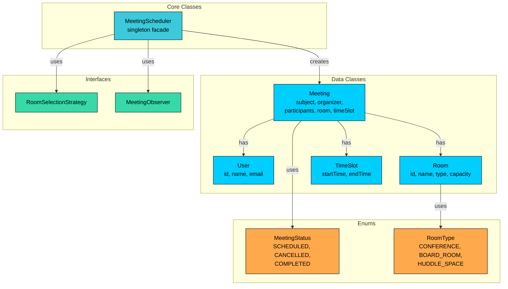

We've identified four types of entities:

**Enums** define fixed sets of values. They provide type safety and make code self-documenting.

**Data Classes** primarily hold data with minimal behavior. User, Room, TimeSlot, and Meeting are containers with some helper methods (like TimeSlot's overlap detection).

**Interfaces** define contracts for interchangeable behavior. RoomSelectionStrategy and MeetingObserver allow different implementations to be swapped in.

**Core Classes** contain the main logic. MeetingScheduler orchestrates the entire system as a singleton facade.

| Entity | Type | Responsibility |
|--------|------|----------------|
| `MeetingStatus` | Enum | Meeting lifecycle states: SCHEDULED, CANCELLED, COMPLETED |
| `RoomType` | Enum | Room categories: CONFERENCE, BOARD_ROOM, HUDDLE_SPACE |
| `User` | Data Class | User profile (id, name, email) |
| `Room` | Data Class | Room details (id, name, type, capacity) |
| `TimeSlot` | Data Class | Time interval with overlap detection |
| `Meeting` | Data Class | Meeting details with status tracking |
| `RoomSelectionStrategy` | Interface | Contract for room selection algorithm |
| `MeetingObserver` | Interface | Contract for meeting event notifications |
| `MeetingScheduler` | Core Class (Singleton) | Orchestrates rooms, meetings, and notifications |

With our entities identified, let's define their attributes, behaviors, and relationships.

---

# 3. Designing Classes and Relationships

Now that we know what entities we need, let's flesh out their details. For each class, we'll define what data it holds (attributes) and what it can do (methods). Then we'll look at how these classes connect to each other.

## 3.1 Class Definitions

We'll work bottom-up: simple types first, then data containers, then the classes with real logic. This order makes sense because complex classes depend on simpler ones.

### Enums

Enums define fixed sets of values that provide type safety and make code self-documenting. Using enums prevents invalid states at compile time rather than runtime.

#### `MeetingStatus` 

It represents where a meeting is in its lifecycle.

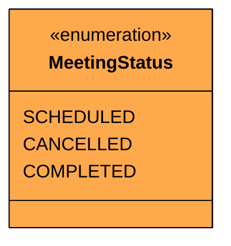

| Value | Meaning | Transitions To |
|-------|---------|---------------|
| `SCHEDULED` | Meeting is booked and upcoming | CANCELLED, COMPLETED |
| `CANCELLED` | Meeting was cancelled by the organizer | (terminal) |
| `COMPLETED` | Meeting time has passed | (terminal) |

This is a simple three-state lifecycle. A meeting starts as SCHEDULED and can move to exactly one terminal state. There's no path from CANCELLED to COMPLETED or vice versa. Once a meeting is cancelled, it stays cancelled.

#### State Transition Diagram

The state diagram makes transition rules explicit. It answers "what can happen next"" and just as importantly, "what CAN'T happen""

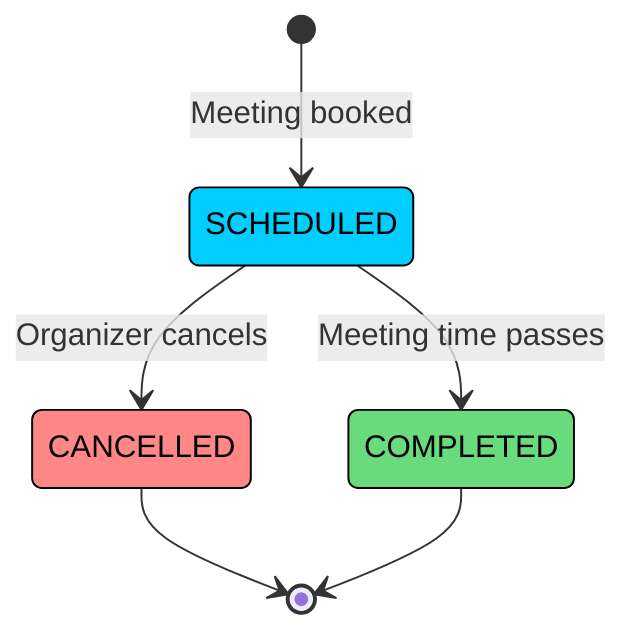

Notice that both CANCELLED and COMPLETED are terminal states. There's no way to "uncancel" a meeting or transition a completed meeting to any other state. This simplicity is intentional. If we needed to support rescheduling, we'd create a new meeting rather than reusing the cancelled one. This avoids complex state transitions and keeps the audit trail clean.

#### `RoomType`

Categorizes the kind of meeting space.

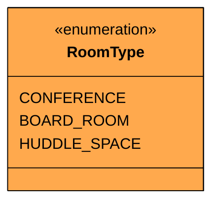

| Value | Typical Capacity | Use Case |
|-------|-----------------|----------|
| `CONFERENCE` | 6-20 people | Standard team meetings, presentations |
| `BOARD_ROOM` | 10-30 people | Executive meetings, all-hands |
| `HUDDLE_SPACE` | 2-4 people | Quick syncs, 1-on-1s |

> 💡 **Key Insight:**

> **Design Decision:**
>
> We use a simple enum rather than a class hierarchy for room types. If room types needed distinct behaviors (like different booking rules or equipment lists), a class hierarchy might be appropriate. For categorization and filtering, an enum is sufficient.

### Custom Exception

Before we write classes that can fail, let's define how they fail. A custom exception makes error handling cleaner than catching generic `RuntimeException`.

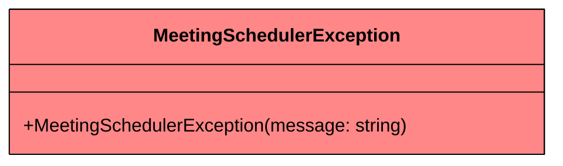

We'll throw this when a scheduling conflict is detected, no rooms are available, a meeting can't be found, or an invalid state transition is attempted.

### Data Classes

Data classes are simple containers that hold data with minimal behavior. They represent the "nouns" in our system that have attributes but limited logic.

#### `User`

Represents a meeting participant or organizer.

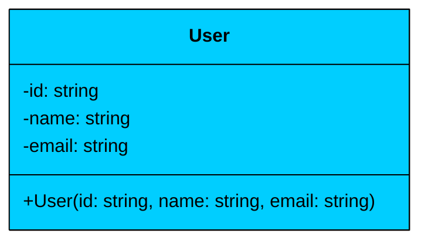

| Attribute | Type | Description | Mutable" |
|-----------|------|-------------|----------|
| `id` | string | Unique user identifier | No |
| `name` | string | Display name | No |
| `email` | string | Email address for notifications | No |

The User class is **immutable**. All fields are read-only, set once at construction. In this design, users are simple identity holders. Authentication, roles, and preferences are out of scope.

#### `Room` 

Represents a bookable meeting space.

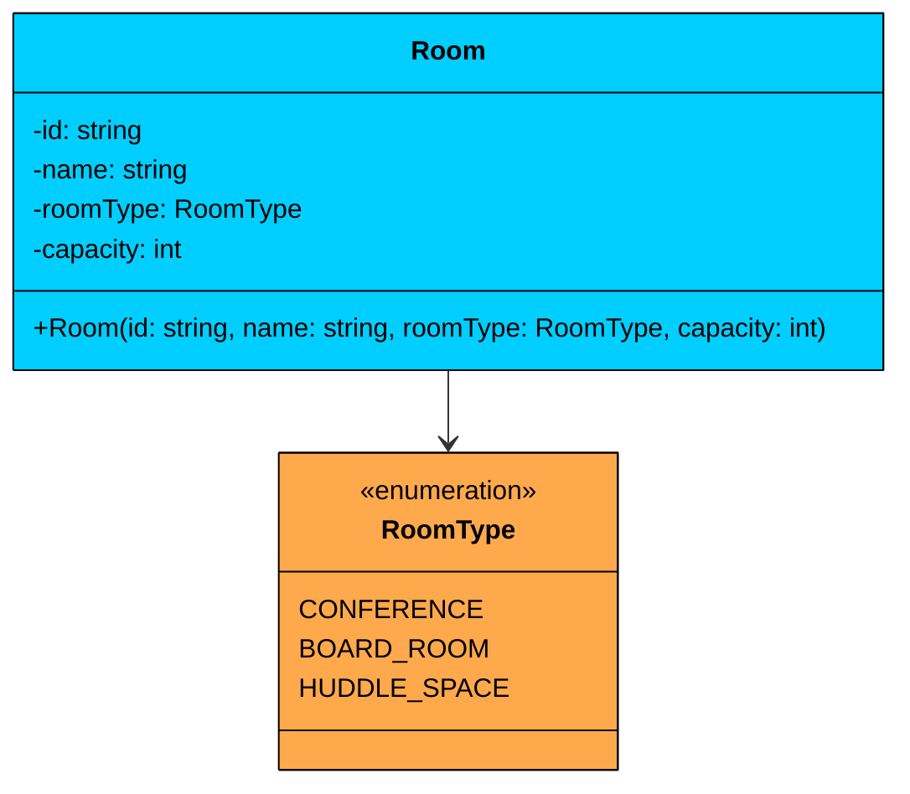

| Attribute | Type | Description | Mutable" |
|-----------|------|-------------|----------|
| `id` | string | Unique room identifier | No |
| `name` | string | Room display name (e.g., "Everest") | No |
| `roomType` | RoomType | Category of the room | No |
| `capacity` | int | Maximum number of people | No |

The Room class is **immutable**. Room properties don't change once created. If a room is renovated and its capacity changes, you'd remove the old room and add a new one. This simplifies concurrency since immutable objects are inherently thread-safe.

**Relationship:** Room has an **association** with RoomType. The enum describes the room's category. Room doesn't own RoomType, it's a shared classification.

#### `TimeSlot`

Represents a time interval for a meeting.

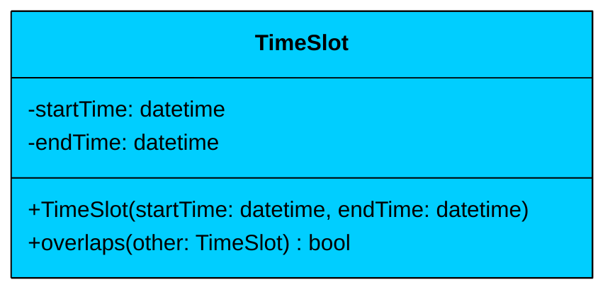

| Attribute | Type | Description | Mutable" |
|-----------|------|-------------|----------|
| `startTime` | datetime | When the meeting starts | No |
| `endTime` | datetime | When the meeting ends | No |

| Method | Description |
|--------|-------------|
| `TimeSlot(startTime, endTime)` | Constructor with validation (end must be after start) |
| `overlaps(other)` | Returns true if this time slot overlaps with another |

The `overlaps()` method is the algorithmic core of this design. Two time slots overlap if and only if: `start1 < end2 AND start2 < end1`. This is a well-known interval overlap condition. If either condition fails, the intervals don't overlap (one ends before the other starts).

> 💡 **Key Insight:**

> **Design Decision**
>
> We encapsulate the overlap logic inside TimeSlot rather than in the MeetingScheduler. This follows the "Information Expert" principle: the class with the data (start and end times) should own the behavior that operates on that data. It also makes overlap detection independently testable.

#### `Meeting` 

Represents a scheduled meeting.

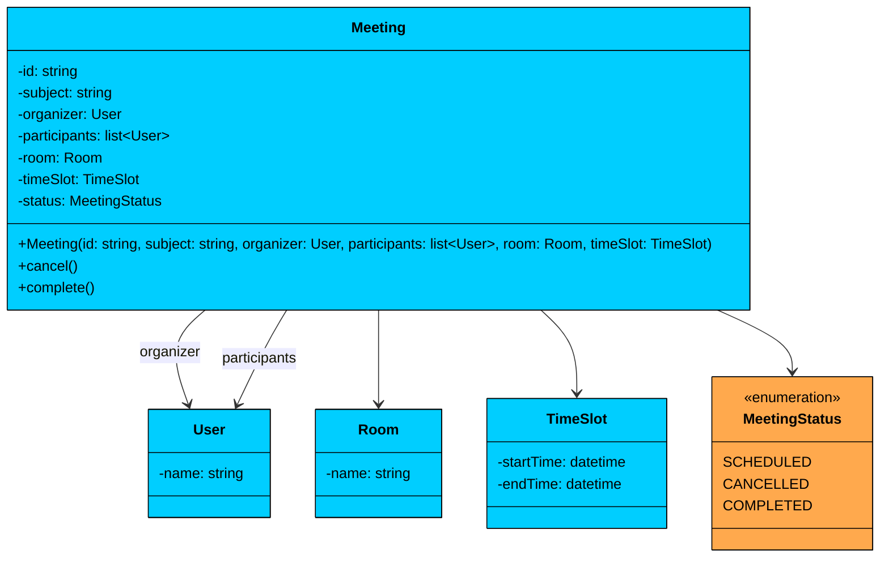

| Attribute | Type | Description | Mutable" |
|-----------|------|-------------|----------|
| `id` | string | Unique meeting identifier | No |
| `subject` | string | Meeting title/description | No |
| `organizer` | User | Who created the meeting | No |
| `participants` | list\<User\> | Attendees (stored as immutable list) | No |
| `room` | Room | Assigned meeting room | No |
| `timeSlot` | TimeSlot | When the meeting occurs | No |
| `status` | MeetingStatus | Current lifecycle state | Yes |

| Method | Description |
|--------|-------------|
| `Meeting(id, subject, organizer, participants, room, timeSlot)` | Constructor, sets status to SCHEDULED |
| `cancel()` | Transitions status from SCHEDULED to CANCELLED |
| `complete()` | Transitions status from SCHEDULED to COMPLETED |

The Meeting class is mostly immutable. Only `status` can change, and only through controlled transition methods (`cancel()` and `complete()`). These methods enforce the state machine: you can only cancel or complete a SCHEDULED meeting. Trying to cancel an already-completed meeting throws an exception.

**Relationship:** Meeting has **associations** with User (organizer and participants), Room, and TimeSlot. The Meeting doesn't own these objects. Users exist independently, rooms are managed by the scheduler, and time slots are value objects.

### Interfaces

Interfaces define contracts for interchangeable behavior. They enable the Strategy and Observer patterns.

#### `RoomSelectionStrategy` 

Defines how a room is chosen from a list of available rooms.

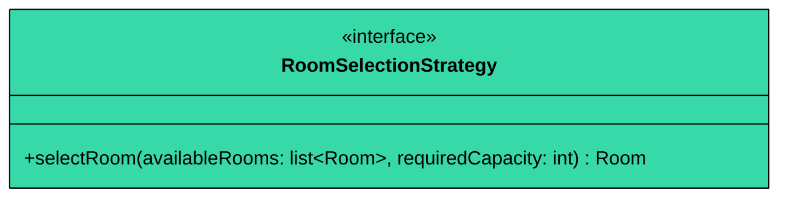

The strategy takes a list of rooms that are available for the requested time slot and the number of attendees. It returns the best room according to its policy. Different implementations can optimize for different goals: minimize wasted capacity, maximize convenience, or simply pick the first option.

#### `MeetingObserver` 

Defines a listener for meeting lifecycle events.

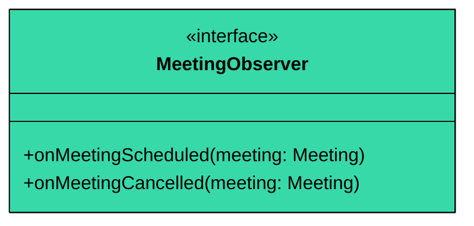

Observers are notified when meetings are scheduled or cancelled. The two-method interface (rather than a single generic `onEvent` method) makes the contract explicit. Each observer knows exactly which events it needs to handle, and the compiler enforces that both are implemented.

### Strategy Implementations

#### `FirstAvailableStrategy`

Picks the first room from the available list.

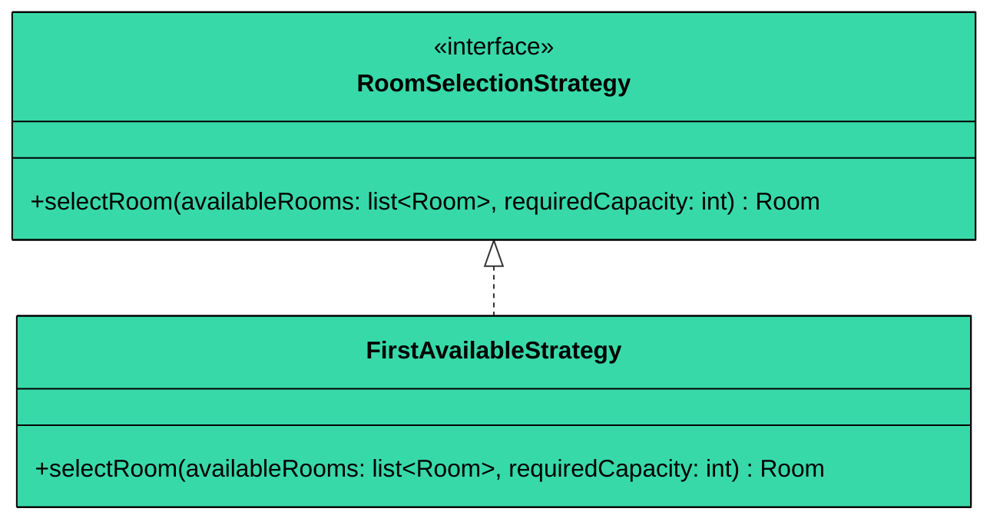

This is the simplest strategy. Since `getAvailableRooms()` already filters by capacity and conflicts, the strategy just returns the first room from the pre-filtered list. It's fast and predictable, but doesn't optimize for room utilization. A 2-person meeting might grab a 20-person conference room.

#### `BestFitStrategy`

Picks the room with the smallest capacity that still meets the requirement.

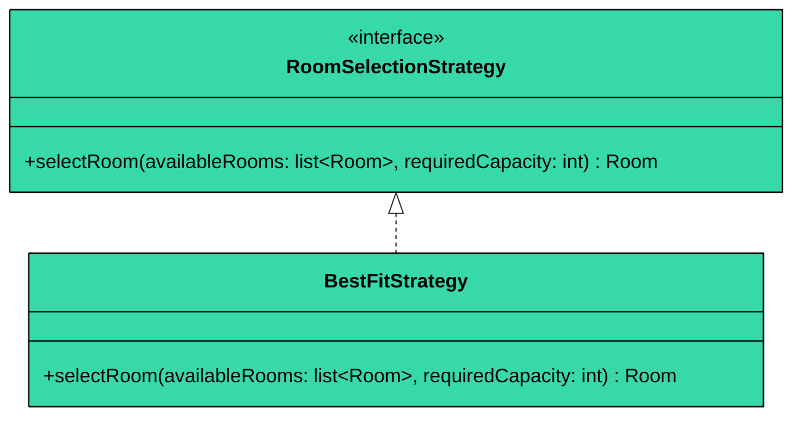

This strategy minimizes wasted capacity. Since rooms are already filtered by capacity in `getAvailableRooms()`, the strategy just picks the smallest room from the pre-filtered list. A 2-person meeting gets a huddle space, not a board room. This is more efficient for room utilization but slightly more expensive computationally (finding the minimum vs. returning the first element).

**Relationship:** Both strategies implement the RoomSelectionStrategy interface. The MeetingScheduler depends on the interface, not the concrete classes.

### Observer Implementations

#### `EmailNotificationObserver` 

Sends email notifications when meetings are scheduled or cancelled.

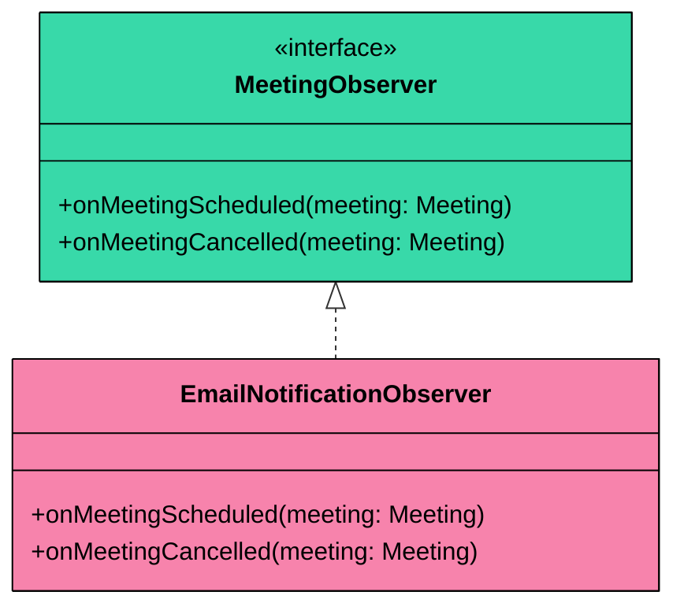

In a real system, this would integrate with an email service (SMTP, SendGrid, etc.). For this design, it prints notification messages. The key point is that the observer doesn't need to know anything about how meetings are scheduled. It just reacts to events.

#### `CalendarNotificationObserver` 

Syncs meeting events to an external calendar system.

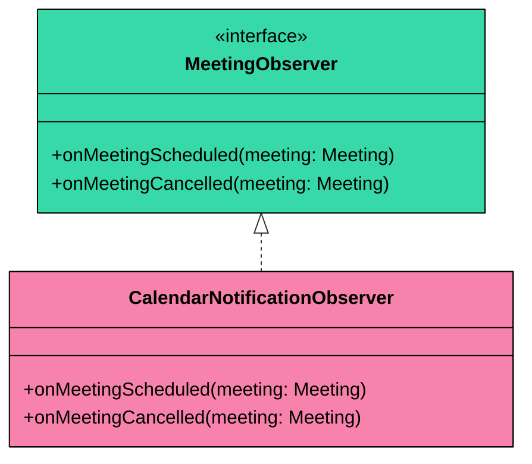

This observer would integrate with Google Calendar, Outlook, or a similar system. Again, the scheduler doesn't know or care what observers do with the events. Adding a Slack notification observer later is just another `addObserver()` call.

**Relationship:** Both observers implement the MeetingObserver interface. The MeetingScheduler maintains a list of observers and notifies all of them when events occur.

### Core Class

#### `MeetingScheduler`

It is the central coordinator that manages rooms, meetings, and notifications.

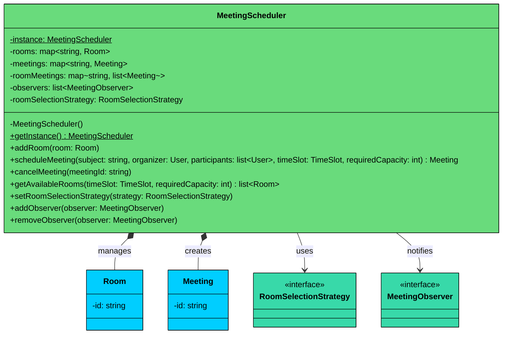

| Attribute | Type | Description |
|-----------|------|-------------|
| `instance` | MeetingScheduler (static) | Singleton instance, uses thread-safe lazy initialization |
| `rooms` | map\<string, Room\> | All registered rooms (thread-safe map) |
| `meetings` | map\<string, Meeting\> | All meetings by ID (thread-safe map) |
| `roomMeetings` | map\<string, list\<Meeting\>\> | Per-room meeting lists for conflict checking |
| `observers` | list\<MeetingObserver\> | Registered event listeners (thread-safe list) |
| `roomSelectionStrategy` | RoomSelectionStrategy | Current room selection policy |

| Method | Description |
|--------|-------------|
| `getInstance()` | Returns the singleton instance (thread-safe lazy initialization) |
| `addRoom(room)` | Registers a new room |
| `scheduleMeeting(...)` | Creates a meeting, checks conflicts, assigns room, notifies observers |
| `cancelMeeting(meetingId)` | Cancels a meeting, frees the room, notifies observers |
| `getAvailableRooms(timeSlot, capacity)` | Returns rooms available for the given time and capacity |
| `setRoomSelectionStrategy(strategy)` | Changes the room selection algorithm at runtime |
| `addObserver(observer)` | Registers a notification listener |
| `removeObserver(observer)` | Removes a notification listener |

**Key Design Principles:**

1. **Singleton:** Only one scheduler exists, providing consistent state across all operations
2. **Facade:** Hides the complexity of room management, conflict detection, and notifications behind a clean API
3. **Per-room meeting lists:** The `roomMeetings` map enables efficient conflict checking. Instead of scanning all meetings in the system, we only check meetings in the specific room being booked
4. **Thread safety:** Thread-safe collections for room/meeting storage, thread-safe list for observers, and synchronized access for compound operations (check-then-book)

**Relationship:** MeetingScheduler has **composition** relationships with Room and Meeting (it manages their lifecycle). It has **associations** with RoomSelectionStrategy and MeetingObserver (it uses them but doesn't own them).

---

## 3.2 Full Class Diagram

Here's the complete system with all classes and their relationships:

```mermaid
classDiagram
    %% Enums
    class MeetingStatus {
        <<enumeration>>
        SCHEDULED
        CANCELLED
        COMPLETED
    }

    class RoomType {
        <<enumeration>>
        CONFERENCE
        BOARD_ROOM
        HUDDLE_SPACE
    }

    %% Exception
    class MeetingSchedulerException {
        +MeetingSchedulerException(message: string)
    }

    %% Data Classes
    class User {
        -id: string
        -name: string
        -email: string
    }

    class Room {
        -id: string
        -name: string
        -roomType: RoomType
        -capacity: int
    }

    class TimeSlot {
        -startTime: datetime
        -endTime: datetime
        +overlaps(other: TimeSlot) bool
    }

    class Meeting {
        -id: string
        -subject: string
        -organizer: User
        -participants: list~User~
        -room: Room
        -timeSlot: TimeSlot
        -status: MeetingStatus
        +cancel()
        +complete()
    }

    %% Interfaces
    class RoomSelectionStrategy {
        <<interface>>
        +selectRoom(availableRooms: list~Room~, requiredCapacity: int) Room
    }

    class MeetingObserver {
        <<interface>>
        +onMeetingScheduled(meeting: Meeting)
        +onMeetingCancelled(meeting: Meeting)
    }

    %% Strategy Implementations
    class FirstAvailableStrategy {
        +selectRoom(availableRooms: list~Room~, requiredCapacity: int) Room
    }

    class BestFitStrategy {
        +selectRoom(availableRooms: list~Room~, requiredCapacity: int) Room
    }

    %% Observer Implementations
    class EmailNotificationObserver {
        +onMeetingScheduled(meeting: Meeting)
        +onMeetingCancelled(meeting: Meeting)
    }

    class CalendarNotificationObserver {
        +onMeetingScheduled(meeting: Meeting)
        +onMeetingCancelled(meeting: Meeting)
    }

    %% Core Class
    class MeetingScheduler {
        -instance: MeetingScheduler$
        -rooms: map~string, Room~
        -meetings: map~string, Meeting~
        -roomMeetings: map~string, list~Meeting~~
        -observers: list~MeetingObserver~
        -strategy: RoomSelectionStrategy
        +getInstance()$ MeetingScheduler
        +addRoom(room: Room)
        +scheduleMeeting(...) Meeting
        +cancelMeeting(meetingId: string)
        +getAvailableRooms(timeSlot: TimeSlot, requiredCapacity: int) list~Room~
    }

    %% Relationships - FULLY CONNECTED
    %% Enums connect to data classes
    Meeting --> MeetingStatus : tracks
    Room --> RoomType : categorized by

    %% Data class relationships
    Meeting --> User : organizer + participants
    Meeting --> Room : held in
    Meeting --> TimeSlot : occurs during

    %% Interface implementations
    RoomSelectionStrategy <|.. FirstAvailableStrategy
    RoomSelectionStrategy <|.. BestFitStrategy
    MeetingObserver <|.. EmailNotificationObserver
    MeetingObserver <|.. CalendarNotificationObserver

    %% Core relationships
    MeetingScheduler *-- Meeting : manages
    MeetingScheduler *-- Room : manages
    MeetingScheduler --> RoomSelectionStrategy : uses
    MeetingScheduler --> MeetingObserver : notifies

    %% Exception usage
    MeetingScheduler --> MeetingSchedulerException : throws

    %% Styles
    style MeetingStatus fill:#ffa94d,stroke:#000,color:#000
    style RoomType fill:#ffa94d,stroke:#000,color:#000
    style MeetingSchedulerException fill:#ff8787,stroke:#000,color:#000
    style User fill:#00ceff,stroke:#000,color:#000
    style Room fill:#00ceff,stroke:#000,color:#000
    style TimeSlot fill:#00ceff,stroke:#000,color:#000
    style Meeting fill:#00ceff,stroke:#000,color:#000
    style RoomSelectionStrategy fill:#38d9a9,stroke:#000,color:#000
    style MeetingObserver fill:#38d9a9,stroke:#000,color:#000
    style FirstAvailableStrategy fill:#38d9a9,stroke:#000,color:#000
    style BestFitStrategy fill:#38d9a9,stroke:#000,color:#000
    style EmailNotificationObserver fill:#f783ac,stroke:#000,color:#000
    style CalendarNotificationObserver fill:#f783ac,stroke:#000,color:#000
    style MeetingScheduler fill:#69db7c,stroke:#000,color:#000
```

---

## 3.3 Design Patterns

You might notice some structural patterns emerging in our design. Let's make them explicit and justify why each pattern earns its place.

The core challenge is managing complexity: interchangeable room selection behaviors, event-driven notifications, and centralized scheduling. This calls for 3 patterns (Strategy, Observer, Singleton), and each solves a specific problem.

### [Strategy Pattern](/learn/lld/strategy): Room Selection

**The Problem:** Different organizations have different room booking philosophies. Some want to grab the first available room (speed over efficiency). Others want the smallest room that fits (maximize utilization). Hardcoding one approach means changing it later requires modifying the scheduler.

**The Solution:** The Strategy pattern encapsulates each room selection algorithm in its own class. The MeetingScheduler depends on the RoomSelectionStrategy interface, not any specific implementation. Switching from first-available to best-fit is a single method call.

Without Strategy, you'd have an if-else chain in the scheduler: `if (policy == "FIRST_AVAILABLE") { ... } else if (policy == "BEST_FIT") { ... }`. Every new policy means modifying the scheduler. With Strategy, you add a new class, no existing code changes.

```mermaid
flowchart TD
    MS[MeetingScheduler]:::green
    RSI[RoomSelectionStrategy<br/>interface]:::teal
    FA[FirstAvailableStrategy]:::orange
    BF[BestFitStrategy]:::orange
    NEW[Future Strategy"]:::lightblue

    MS --> RSI
    RSI --> FA
    RSI --> BF
    RSI -.-> NEW

    classDef green fill:#69db7c,stroke:#000,color:#000
    classDef teal fill:#38d9a9,stroke:#000,color:#000
    classDef orange fill:#ffa94d,stroke:#000,color:#000
    classDef lightblue fill:#3bc9db,stroke:#000,color:#000
```

> 💡 **Key Insight:**

> **Design Alternative**
>
> We could put the room selection logic directly inside the `MeetingScheduler` class using simple conditional checks. For a system with only two selection policies, this is straightforward and arguably simpler. We chose the Strategy pattern because room selection is the kind of behavior that organizations customize frequently (preferred floors, equipment requirements, VIP rooms). 
>
> In a real interview, if the interviewer says "we'll only ever have one selection method," the simpler approach is the better choice.

### [Observer Pattern](/learn/lld/observer): Meeting Notifications

**The Problem:** When a meeting is scheduled or cancelled, multiple systems need to react: email notifications, calendar syncs, Slack messages, analytics tracking. If the MeetingScheduler directly calls each notification system, adding a new channel means modifying the scheduler.

**The Solution:** The Observer pattern decouples event production from event consumption. The scheduler notifies all registered observers when something happens. Each observer handles the event independently.

Without Observer, the `scheduleMeeting()` method would contain: `emailService.send()`, `calendarService.sync()`, `slackBot.post()`. The scheduler becomes tightly coupled to every notification channel. With Observer, the scheduler just calls `notifyObservers()` and doesn't know or care who's listening.

```mermaid
flowchart TD
    MS[MeetingScheduler<br/>notifies all observers]:::green
    MOI[MeetingObserver<br/>interface]:::teal
    EN[EmailNotificationObserver]:::pink
    CN[CalendarNotificationObserver]:::pink
    NEW[Future Observer"<br/>Slack, Analytics, etc.]:::lightblue

    MS --> MOI
    MOI --> EN
    MOI --> CN
    MOI -.-> NEW

    classDef green fill:#69db7c,stroke:#000,color:#000
    classDef teal fill:#38d9a9,stroke:#000,color:#000
    classDef pink fill:#f783ac,stroke:#000,color:#000
    classDef lightblue fill:#3bc9db,stroke:#000,color:#000
```

> 💡 **Key Insight:**

> **Design Alternative**
>
> We could have `MeetingScheduler` call `EmailService.notify()` directly whenever a meeting is created. This is simpler and works fine when you have exactly one notification channel. We chose the Observer pattern because meeting notifications are a natural fan-out scenario (email, calendar, Slack, analytics). In a system with a single, fixed notification method, the direct call is perfectly acceptable.

### [Singleton Pattern](/learn/lld/singleton): MeetingScheduler

**The Problem:** There must be exactly one MeetingScheduler in the system. If multiple instances exist, each would have its own room and meeting data, leading to inconsistent state and duplicate bookings.

**The Solution:** The Singleton pattern ensures a single instance with global access via `getInstance()`. Thread-safe lazy initialization guarantees only one instance is created, even under concurrent access.

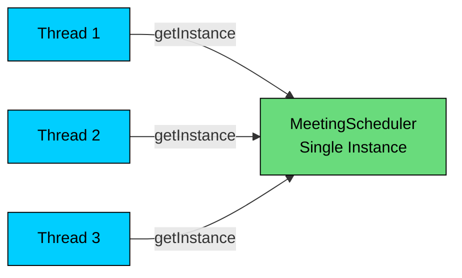

### Why Not the State Pattern"

You might look at `MeetingStatus` and think: "There's a state enum with transitions, shouldn't I use the State pattern"" It's a reasonable instinct, but this is a case where the pattern adds complexity without adding value.

The State pattern is valuable when an object's **behavior changes significantly** based on its state. Think of a vending machine where the same `insertCoin()` method does completely different things depending on whether the machine is idle, has money inserted, or is currently dispensing. Each state has fundamentally different logic for the same operations.

MeetingStatus has 3 states with only 2 transitions (`SCHEDULED -> CANCELLED`, `SCHEDULED -> COMPLETED`). The "behavior" that changes is trivial: just a guard check. There's no meaningful per-state logic that justifies separate state classes.

**What the State pattern would look like here:**

- `ScheduledState.cancel()` -> transitions to CancelledState
- `ScheduledState.complete()` -> transitions to CompletedState
- `CancelledState.cancel()` -> throws exception
- `CancelledState.complete()` -> throws exception
- `CompletedState.cancel()` -> throws exception
- `CompletedState.complete()` -> throws exception

That's 3 classes and 6 methods to replace what's currently a 2-line if-check in `Meeting.cancel()` and `Meeting.complete()`. More code, more files, zero added clarity.

> 💡 **Key Insight:**

> **When State WOULD make sense"**
>
> If meetings had complex per-state behavior, like a `PENDING_APPROVAL` state where `approve()` triggers room reservation, a `WAITLISTED` state where `notifyAvailability()` re-attempts booking, and each state had 3-4 methods with distinct implementations. That's when separate state classes reduce complexity instead of adding it.

---

# 4. Code Implementation

This section presents the complete implementation, built bottom-up. We start with simple types and build toward the complex orchestrator.

#### Java

## Enums

#### `MeetingStatus` 

Tracks where a meeting is in its lifecycle. Three states cover all possible outcomes. A meeting starts as `SCHEDULED` and transitions to exactly one terminal state.

```java
enum MeetingStatus {
    SCHEDULED,   // Meeting is booked and upcoming
    CANCELLED,   // Meeting was cancelled
    COMPLETED    // Meeting time has passed
}
```

We use `SCHEDULED` as the default rather than a separate `CREATED` state. In meeting scheduling, creation and scheduling happen atomically. There's no meaningful "created but not yet scheduled" state.

#### `RoomType`

It categorizes meeting spaces.

```java
enum RoomType {
    CONFERENCE,    // Standard meeting rooms (6-20 people)
    BOARD_ROOM,    // Large executive rooms (10-30 people)
    HUDDLE_SPACE   // Small rooms for quick syncs (2-4 people)
}
```

## Custom Exception

#### `MeetingSchedulerException` 

It provides a domain-specific exception for all scheduling failures. This gives callers a single exception type to catch for booking conflicts, invalid operations, and missing resources.

```java
class MeetingSchedulerException extends RuntimeException {
    public MeetingSchedulerException(String message) {
        super(message);
    }
}
```

We extend `RuntimeException` (unchecked) rather than `Exception` (checked) because scheduling failures are typically not recoverable by the caller. The caller can catch and display the error, but there's no meaningful retry without changing the inputs.

## Data Classes

Next, the data classes. These hold information with minimal behavior.

#### `User` 

It is a simple immutable identity holder. All three fields are `final`, and there are no setters.

```java
class User {
    private final String id;
    private final String name;
    private final String email;

    public User(String id, String name, String email) {
        this.id = id;
        this.name = name;
        this.email = email;
    }

    public String getId() { return id; }
    public String getName() { return name; }
    public String getEmail() { return email; }

    @Override
    public String toString() { return name; }
}
```

The `toString()` returns just the name for readable output in notifications. No need for a verbose format here.

#### `Room`

Represents a bookable meeting space. Also immutable.

```java
class Room {
    private final String id;
    private final String name;
    private final RoomType roomType;
    private final int capacity;

    public Room(String id, String name, RoomType roomType, int capacity) {
        this.id = id;
        this.name = name;
        this.roomType = roomType;
        this.capacity = capacity;
    }

    public String getId() { return id; }
    public String getName() { return name; }
    public RoomType getRoomType() { return roomType; }
    public int getCapacity() { return capacity; }

    @Override
    public String toString() {
        return name + " (" + roomType + ", capacity: " + capacity + ")";
    }
}
```

#### `TimeSlot` 

Represents a time interval. This is where the overlap detection algorithm lives.

```java
class TimeSlot {
    private final LocalDateTime startTime;
    private final LocalDateTime endTime;

    public TimeSlot(LocalDateTime startTime, LocalDateTime endTime) {
        if (!endTime.isAfter(startTime)) {
            throw new MeetingSchedulerException(
                "End time must be after start time");
        }
        this.startTime = startTime;
        this.endTime = endTime;
    }

    public LocalDateTime getStartTime() { return startTime; }
    public LocalDateTime getEndTime() { return endTime; }

    // Two time slots overlap if start1 < end2 AND start2 < end1
    public boolean overlaps(TimeSlot other) {
        return this.startTime.isBefore(other.endTime)
            && other.startTime.isBefore(this.endTime);
    }

    @Override
    public String toString() {
        return String.format("%02d:%02d-%02d:%02d",
            startTime.getHour(), startTime.getMinute(),
            endTime.getHour(), endTime.getMinute());
    }
}
```

The constructor validates that end time comes after start time. This is the validation boundary: we catch invalid time slots at creation time, so all downstream code can trust that a TimeSlot is always valid.

The `overlaps()` method implements the standard interval overlap check. Consider two intervals [A, B) and [C, D). They overlap if A < D and C < B. If A >= D, the first interval starts after the second ends. If C >= B, the second starts after the first ends. Both conditions must hold for overlap.

#### `Meeting` 

Meeting class ties everything together. It's the central data object.

```java
$127
```

A few things to notice. The participants list is wrapped in `Collections.unmodifiableList()` to prevent external callers from modifying the list after creation. We also copy the input list (`new ArrayList<>(participants)`) to prevent the caller from modifying the original list and affecting the meeting. This is the defensive copy idiom.

The `cancel()` and `complete()` methods enforce the state machine. You can only cancel or complete a SCHEDULED meeting. Trying to cancel a COMPLETED meeting throws an exception. This prevents invalid state transitions.

## Interfaces

Now the interfaces that define extensibility points.

#### `RoomSelectionStrategy` 

Defines the contract for room selection algorithms.

```java
interface RoomSelectionStrategy {
    Room selectRoom(List<Room> availableRooms, int requiredCapacity);
}
```

The interface takes a pre-filtered list of available rooms and the required capacity. The scheduler handles the filtering (removing rooms with time conflicts and insufficient capacity), and the strategy handles the selection (choosing from the remaining options). This separation of concerns keeps both the scheduler and strategies focused, and avoids duplicating filter logic in every strategy implementation.

#### `MeetingObserver`

Defines the contract for meeting event listeners.

```java
interface MeetingObserver {
    void onMeetingScheduled(Meeting meeting);
    void onMeetingCancelled(Meeting meeting);
}
```

Two methods, one for each event type. This is more explicit than a single `onEvent(EventType, Meeting)` approach. The compiler ensures every observer handles both events.

## Strategy Implementations

#### `FirstAvailableStrategy` 

Picks the first room that meets the capacity requirement.

```java
class FirstAvailableStrategy implements RoomSelectionStrategy {
    @Override
    public Room selectRoom(List<Room> availableRooms, int requiredCapacity) {
        return availableRooms.isEmpty() " null : availableRooms.get(0);
    }
}
```

Simple and fast. Since `getAvailableRooms()` already filters by capacity and conflicts, the strategy just returns the first room from the pre-filtered list. The order depends on how rooms are stored in the scheduler's map, so the "first" room is somewhat arbitrary. This strategy optimizes for speed over utilization.

#### `BestFitStrategy` 

Picks the smallest room that still meets the capacity requirement.

```java
class BestFitStrategy implements RoomSelectionStrategy {
    @Override
    public Room selectRoom(List<Room> availableRooms, int requiredCapacity) {
        return availableRooms.stream()
            .min(Comparator.comparingInt(Room::getCapacity))
            .orElse(null);
    }
}
```

This strategy minimizes wasted capacity. Since rooms are already pre-filtered by capacity in `getAvailableRooms()`, the strategy just finds the smallest room from the remaining options. A 2-person meeting gets a 4-person huddle space instead of a 20-person board room, leaving the larger rooms available for bigger meetings. The tradeoff is a slight computational overhead (finding the minimum vs. returning the first element), but for typical office room counts (10-50 rooms), this is negligible.

## Observer Implementations

#### `EmailNotificationObserver` 

Prints email-style notifications. In a real system, this would call an email service API.

```java
class EmailNotificationObserver implements MeetingObserver {
    @Override
    public void onMeetingScheduled(Meeting meeting) {
        System.out.println("[Email] Meeting scheduled: \""
            + meeting.getSubject() + "\" in " + meeting.getRoom().getName()
            + " (" + meeting.getTimeSlot() + ") organized by "
            + meeting.getOrganizer());
    }

    @Override
    public void onMeetingCancelled(Meeting meeting) {
        System.out.println("[Email] Meeting cancelled: \""
            + meeting.getSubject() + "\" in " + meeting.getRoom().getName()
            + " was cancelled by " + meeting.getOrganizer());
    }
}
```

#### `CalendarNotificationObserver` 

Prints calendar sync notifications. In a real system, this would integrate with Google Calendar or Outlook.

```java
class CalendarNotificationObserver implements MeetingObserver {
    @Override
    public void onMeetingScheduled(Meeting meeting) {
        System.out.println("[Calendar] Meeting added to calendar: \""
            + meeting.getSubject() + "\" in " + meeting.getRoom().getName()
            + " (" + meeting.getTimeSlot() + ")");
    }

    @Override
    public void onMeetingCancelled(Meeting meeting) {
        System.out.println("[Calendar] Meeting removed from calendar: \""
            + meeting.getSubject() + "\" in " + meeting.getRoom().getName());
    }
}
```

Both observers follow the same pattern: extract information from the meeting and format it for their channel. Neither observer knows anything about how meetings are scheduled or cancelled. They just react to events.

## Core Class

#### `MeetingScheduler` 

This is the heart of the system. It coordinates rooms, meetings, conflict detection, and notifications.

```java
$128
```

Let's walk through the key design decisions in this class.

**Per-room meeting lists:** The `roomMeetings` map stores meetings indexed by room ID. When checking for conflicts, we only scan meetings in the specific room being booked, not every meeting in the system. For an office with 50 rooms and 200 meetings, this means checking ~4 meetings per room instead of scanning all 200.

**Synchronized scheduling:** The `scheduleMeeting()` method is `synchronized` because it's a compound operation: check availability, select room, create meeting, register meeting. These steps must happen atomically. Without synchronization, two threads could both see a room as available and both book it, creating a double booking.

**Meeting removal on cancel:** When a meeting is cancelled, we remove it from the `roomMeetings` list. This means future availability checks won't see the cancelled meeting as an obstacle. The meeting still exists in the `meetings` map for history and audit purposes.

**AtomicInteger for IDs:** The meeting counter uses `AtomicInteger` for thread-safe ID generation. Even though `scheduleMeeting` is synchronized, generating IDs atomically is good practice and costs nothing.

### Sequence Diagram

Here's the complete flow when a meeting is scheduled:

```mermaid
sequenceDiagram
    participant O as Organizer
    participant MS as MeetingScheduler
    participant RSS as RoomSelectionStrategy
    participant RM as Room Meetings Map
    participant OBS as Observers

    O->>MS: scheduleMeeting(subject, organizer, participants, timeSlot, capacity)
    MS->>RM: getAvailableRooms(timeSlot, capacity)
    RM-->>MS: List of available rooms
    MS->>RSS: selectRoom(availableRooms, capacity)
    RSS-->>MS: Selected room
    MS->>MS: Create Meeting object
    MS->>RM: Register meeting in room
    MS->>OBS: notifyMeetingScheduled(meeting)
    OBS-->>MS: (notifications sent)
    MS-->>O: Return meeting
```

Let's trace through what happens when Alice schedules a "Sprint Planning" meeting for 3 people, from the moment she calls `scheduleMeeting()` to the moment she gets the meeting back.

#### **Phase 1: Availability Check**

The organizer calls `scheduleMeeting()` on the scheduler. The first thing the scheduler does is find rooms that are both available during the requested time slot and large enough for the group. It iterates through all registered rooms, checks capacity, and for each sufficiently large room, scans its per-room meeting list for time overlaps using `TimeSlot.overlaps()`. Any room with no conflicts makes the cut.

#### **Phase 2: Room Selection (Strategy Delegation)**

The scheduler hands the pre-filtered list of available rooms to the configured `RoomSelectionStrategy`. Since `getAvailableRooms()` already filtered by capacity and conflicts, the strategy only handles selection logic. If the strategy is `FirstAvailableStrategy`, it grabs the first room. If it's `BestFitStrategy`, it picks the smallest room to minimize wasted capacity. The scheduler doesn't know or care which algorithm runs. If the strategy returns null (empty list), the scheduler throws a `MeetingSchedulerException`.

#### **Phase 3: Meeting Creation and Registration**

With a room selected, the scheduler creates a new `Meeting` object with an auto-generated ID, sets its status to SCHEDULED, and registers it in two places: the global `meetings` map (for lookup by ID) and the room's per-room meeting list (for future conflict checks). This registration is what prevents double bookings. The next call to `getAvailableRooms()` will see this meeting and exclude the room if there's an overlap.

#### **Phase 4: Observer Notification**

Finally, the scheduler iterates through all registered observers and calls `onMeetingScheduled()`. The `EmailNotificationObserver` sends an email, the `CalendarNotificationObserver` syncs the calendar. If either observer throws an exception, it doesn't affect the other observers or roll back the booking. The meeting is already committed.

Notice the entire flow runs inside a `synchronized` block. If another thread tries to schedule a meeting simultaneously, it waits until this operation completes. This prevents the check-then-act race condition where two threads see the same room as available and both book it.

## Demo

Here's the complete runnable demo that exercises all major features.

```java
$129
```

---

# 5. Concurrency and Thread Safety

Does a meeting room scheduler actually need thread safety" If you think of a single admin booking rooms through a UI, the answer is "probably not." Each action is sequential: book a room, cancel a meeting, check availability.

But in practice, meeting schedulers serve entire organizations. Multiple admins, team leads, and automated systems (calendar integrations, recurring meeting generators) all submit booking requests concurrently. A company with 500 employees might have dozens of booking requests hitting the scheduler within the same minute, especially around popular time slots like Monday mornings or post-lunch hours. That's where thread safety becomes essential.

Let's examine the two main concurrency concerns in this design and trace through what goes wrong without proper synchronization.

#### Java

### Concern 1: Concurrent Room Booking

The highest-risk scenario is two organizers trying to book the same room for overlapping times simultaneously. The `scheduleMeeting()` method performs a compound operation: check availability, select a room, register the meeting. If this sequence isn't atomic, two threads can both see the same room as available and both book it.

**Setup:** Alice and Bob are both team leads. Alice wants to book the only conference room (Everest, capacity 10) for a Sprint Planning meeting from 9:00-10:00. Bob wants to book the same room for a Design Review from 9:30-11:00. Both submit their requests at the same instant.

#### **Without synchronization on **`scheduleMeeting()`**:**

1. Thread A (Alice): Calls `scheduleMeeting("Sprint Planning", ...)`, enters `getAvailableRooms()` - Everest has no meetings, it's available
2. Thread B (Bob): Calls `scheduleMeeting("Design Review", ...)`, enters `getAvailableRooms()` - Everest STILL has no meetings (Alice hasn't registered hers yet), it's available
3. Thread A: Strategy selects Everest, creates Meeting-1, adds to `roomMeetings`
4. Thread B: Strategy selects Everest, creates Meeting-2, adds to `roomMeetings`

**Result:** Everest now has two overlapping meetings (9:00-10:00 and 9:30-11:00). Both Alice and Bob show up at the same room at 9:30. The conflict detection failed because the check and the registration weren't atomic.

#### **With synchronization:**

Thread A acquires the lock on `scheduleMeeting()`, checks availability, selects Everest, registers the meeting, and releases the lock. Thread B then acquires the lock, calls `getAvailableRooms()`, and sees that Everest already has a 9:00-10:00 meeting that overlaps with 9:30-11:00. If another room is available, it gets assigned there. If not, a `MeetingSchedulerException` is thrown.

Here's the synchronized method that prevents this race:

```java
$13b
```

The `synchronized` keyword ensures the entire method body executes atomically. No other thread can enter `scheduleMeeting()` or `cancelMeeting()` on the same scheduler instance until the current thread finishes.

## Concern 2: Observer Notification During Modification (Medium Risk)

A subtler issue arises with the observer list. Suppose one thread is scheduling a meeting (which triggers `notifyMeetingScheduled()`, iterating through observers), while another thread is registering a new observer via `addObserver()`. If the observer list isn't thread-safe, iterating while modifying causes a `ConcurrentModificationException` or, worse, silently skips or duplicates notifications.

**Setup:** The system starts with an `EmailNotificationObserver`. While Alice's booking triggers email notifications (iterating the observer list), the admin registers a new `SlackNotificationObserver`.

#### **Without a thread-safe list:**

1. Thread A (booking): Enters `notifyMeetingScheduled()`, starts iterating observers at index 0 (EmailObserver)
2. Thread B (admin): Calls `addObserver(slackObserver)`, modifies the list's internal array
3. Thread A: Iterator detects structural modification, throws `ConcurrentModificationException`
4. **Result:** Alice's booking succeeds, but the email notification fails mid-delivery. Some observers get notified, others don't.

#### **With **`CopyOnWriteArrayList`**:**

The observer list uses `CopyOnWriteArrayList`, which creates a snapshot of the list for iteration. Thread A iterates over a stable copy. Thread B's `addObserver()` creates a new internal array. Neither thread interferes with the other. The Slack observer won't receive THIS notification (it was added after the snapshot), but it will receive all future notifications. This is the correct behavior: you shouldn't expect an observer to retroactively receive events that happened before it was registered.

With concurrency handled, let's see how easily this design extends to new requirements.

---

# 6. Extensions

One of the strengths of this design is how easily it accommodates new features without modifying existing code. Let's walk through several common extensions an interviewer might ask about.

## 6.1 Recurring Meetings

**Scenario:** "Now add support for recurring meetings, like a daily standup or weekly sync."

Recurring meetings are essentially a series of individual meetings with a common template. We add a recurrence pattern and a class that generates individual `Meeting` objects for each occurrence.

```java
enum RecurrencePattern {
    DAILY, WEEKLY, BIWEEKLY, MONTHLY
}
```

```java
$142
```

The `MeetingScheduler` gets a new method that generates individual meetings for each occurrence:

```java
// Add to MeetingScheduler
public List<Meeting> scheduleRecurringMeeting(RecurringMeeting recurring) {
    List<Meeting> scheduled = new ArrayList<>();
    for (TimeSlot slot : recurring.generateOccurrences()) {
        Meeting meeting = scheduleMeeting(
            recurring.getSubject(), recurring.getOrganizer(),
            recurring.getParticipants(), slot, recurring.getRequiredCapacity());
        scheduled.add(meeting);
    }
    return scheduled;
}
```

Each generated meeting is a regular `Meeting` object, so conflict detection, notifications, and cancellation all work without changes.

**What stays unchanged:** `Meeting`, `TimeSlot`, `Room`, `RoomSelectionStrategy`, `MeetingObserver`, and all their implementations.

## 6.2 Room Amenities and Equipment Filter

**Scenario:** "Meetings might need specific equipment, like a projector or video conferencing. How would you handle this""

Room amenities can be modeled as a set of enum values. The `Room` class gets a `Set<Amenity>` field, and the scheduling method filters rooms accordingly.

```java
enum Amenity {
    PROJECTOR, WHITEBOARD, VIDEO_CONFERENCING, PHONE, TV_SCREEN
}
```

We extend `Room` with an amenities field:

```java
// Add to Room class
private final Set<Amenity> amenities;

public Room(String id, String name, RoomType roomType,
            int capacity, Set<Amenity> amenities) {
    this.id = id;
    this.name = name;
    this.roomType = roomType;
    this.capacity = capacity;
    this.amenities = Collections.unmodifiableSet(new HashSet<>(amenities));
}

public boolean hasAmenities(Set<Amenity> required) {
    return amenities.containsAll(required);
}
```

Then update `getAvailableRooms()` to accept and filter by required amenities:

```java
// Updated method in MeetingScheduler
public List<Room> getAvailableRooms(TimeSlot timeSlot, int requiredCapacity,
                                     Set<Amenity> requiredAmenities) {
    List<Room> available = new ArrayList<>();
    for (Room room : rooms.values()) {
        if (room.getCapacity() < requiredCapacity) continue;
        if (!room.hasAmenities(requiredAmenities)) continue;

        List<Meeting> existing = roomMeetings
            .getOrDefault(room.getId(), Collections.emptyList());
        boolean hasConflict = existing.stream()
            .anyMatch(m -> m.getTimeSlot().overlaps(timeSlot));
        if (!hasConflict) {
            available.add(room);
        }
    }
    return available;
}
```

**What stays unchanged:** `Meeting`, `TimeSlot`, `MeetingObserver`, all observers, and the Strategy interface. Filtering by amenities happens before room selection, so strategies don't need to change.

## 6.3 Buffer Time Between Meetings

**Scenario:** "In practice, there's always a few minutes between meetings for people to walk between rooms and for the previous meeting to clear out. Can we add buffer time""

Buffer time is an extension of the overlap check. Instead of checking exact overlap, we expand each existing meeting's time slot by the buffer duration before checking.

```java
// Add to MeetingScheduler
private int bufferMinutes = 0;

public void setBufferMinutes(int minutes) {
    this.bufferMinutes = minutes;
}
```

The key change is in `getAvailableRooms()`, where we expand existing meeting time slots before checking overlap:

```java
// Updated conflict check in getAvailableRooms()
boolean hasConflict = existingMeetings.stream()
    .anyMatch(m -> {
        // Expand existing meeting by buffer on both sides
        TimeSlot buffered = new TimeSlot(
            m.getTimeSlot().getStartTime().minusMinutes(bufferMinutes),
            m.getTimeSlot().getEndTime().plusMinutes(bufferMinutes));
        return buffered.overlaps(timeSlot);
    });
```

With a 5-minute buffer, a meeting ending at 10:00 would block bookings that start before 10:05. The `TimeSlot.overlaps()` method itself doesn't change. We just feed it expanded time slots.

**What stays unchanged:** `TimeSlot`, `Meeting`, `Room`, all strategies, and all observers. The only change is in the scheduler's availability check logic.

## 6.4 Meeting Waitlist

**Scenario:** "If no room is available, instead of throwing an exception, add the meeting to a waitlist and automatically schedule it when a room frees up."

The Observer pattern makes this natural. We create a waitlist request object and check it whenever a room frees up.

```java
class WaitlistRequest {
    private final String subject;
    private final User organizer;
    private final List<User> participants;
    private final TimeSlot timeSlot;
    private final int requiredCapacity;
    private final LocalDateTime requestedAt;

    // constructor, getters...
}
```

```java
// Add to MeetingScheduler
private final List<WaitlistRequest> waitlist = new ArrayList<>();

public WaitlistRequest addToWaitlist(String subject, User organizer,
                                      List<User> participants,
                                      TimeSlot timeSlot, int requiredCapacity) {
    WaitlistRequest request = new WaitlistRequest(
        subject, organizer, participants, timeSlot,
        requiredCapacity, LocalDateTime.now());
    waitlist.add(request);
    System.out.println("Added to waitlist: " + subject);
    return request;
}
```

When a meeting is cancelled, the scheduler checks the waitlist for any requests that can now be fulfilled:

```java
// Add to cancelMeeting(), after removing from roomMeetings
private void processWaitlist() {
    List<WaitlistRequest> fulfilled = new ArrayList<>();
    for (WaitlistRequest req : waitlist) {
        List<Room> available = getAvailableRooms(
            req.getTimeSlot(), req.getRequiredCapacity());
        Room room = roomSelectionStrategy.selectRoom(
            available, req.getRequiredCapacity());
        if (room != null) {
            fulfilled.add(req);
            Meeting meeting = new Meeting(
                "MTG-" + meetingCounter.incrementAndGet(),
                req.getSubject(), req.getOrganizer(),
                req.getParticipants(), room, req.getTimeSlot());
            meetings.put(meeting.getId(), meeting);
            roomMeetings.get(room.getId()).add(meeting);
            notifyMeetingScheduled(meeting);
        }
    }
    waitlist.removeAll(fulfilled);
}
```

**What stays unchanged:** `Room`, `TimeSlot`, `RoomSelectionStrategy`, `MeetingObserver`, and their implementations. The waitlist is purely additive logic in the scheduler.

Each of these extensions demonstrates the Open/Closed Principle in action: we extended behavior by adding new classes, not by modifying existing ones. The Strategy and Observer patterns were key enablers, allowing new algorithms and new event handlers to be plugged in without touching the core system.

You could also combine the Waitlist (6.4) with priority-based scheduling. Add a `MeetingPriority` enum (LOW, NORMAL, HIGH, CRITICAL), create a `PriorityAwareStrategy` that can preempt lower-priority meetings when no room is available, and the preempted meeting gets cancelled (triggering observers) and added to the waitlist. The two extensions compose naturally through the existing Strategy and Observer patterns.
