> 💡 **Key Insight:**

> **QUESTION**
>
> #### **What is a Task Scheduler"**
>
> A **Task Scheduler** is a system that manages the execution of tasks at predefined times or intervals. It is commonly used in operating systems, distributed systems, and backend services to automate jobs like backups, notifications, report generation, and periodic cleanup tasks.
>
> For example, a task might be scheduled to run **once at 8:00 AM**, **every day at midnight**, or **5 minutes after another task completes**.
>
> 
> <!-- Simulation: task-scheduler -->
> 

>
> The scheduler must ensure these tasks run reliably and at the correct times, even under heavy load or failures.

In this chapter, we will explore the **low-level design of a Task Scheduler**.

There are multiple variants to this problem which you can find in the concurrency interview course:

- [Design Deferred Callback Executor](/learn/concurrency-interview/design-deferred-callback-executor)
- [Design Task Scheduler with Dependencies](/learn/concurrency-interview/design-task-scheduler-with-dependencies)

Let’s start by clarifying the requirements:

---

# 1. Clarifying Requirements

Before starting the design, it's important to ask thoughtful questions to uncover hidden assumptions and better define the scope of the system.

Here is an example of how a conversation between the candidate and the interviewer might unfold:

> 💡 **Key Insight:**

> **DISCUSSION**
>
> **Candidate:** "Should the scheduler support only one-time tasks, or recurring tasks as well""
>
> **Interviewer:** "Both. One-time tasks run at a specific future time, and recurring tasks run repeatedly at a fixed interval."
>
> **Candidate:** "Should tasks be executed exactly on time, or is a small delay acceptable""
>
> **Interviewer:** "A small delay is acceptable. We're not aiming for real-time precision, but tasks should execute as close as possible to the scheduled time. "
>
> **Candidate:** "Should the scheduler support retries if a task fails""
>
> **Interviewer:** "No retries for now. However, you can keep the design open to supporting retries later."
>
> **Candidate:** "Can a task have dependencies, such that one task should only start after another completes""
>
> **Interviewer:** "Let's not handle task dependencies in this version. All tasks are independent."
>
> **Candidate:** "What should happen if a task throws an exception during execution""
>
> **Interviewer:** "The exception should be caught and reported, but it should not crash the worker thread or block other tasks."
>
> **Candidate:** "Can multiple tasks run in parallel""
>
> **Interviewer:** "Yes. The system should be able to run multiple tasks concurrently using a configurable number of worker threads."
>
> **Candidate:** "Should we support task cancellation""
>
> **Interviewer:** "Yes, a scheduled task should be cancellable before it executes."

After gathering the details, we can summarize the key system requirements.

## 1.1 Functional Requirements

- The system should schedule **one-time tasks** to run at a specific future time
- The system should schedule **recurring tasks** to run repeatedly at a fixed interval
- The system should execute tasks **concurrently** using a configurable number of worker threads
- The system should allow **cancelling** a scheduled task before it executes
- The system should **notify** observers when tasks start, complete, or fail
- The system should **track** task status through its lifecycle

## 1.2 Non-Functional Requirements

- The design should follow **object-oriented principles** with clear separation of concerns
- The system should be **thread-safe** for concurrent scheduling and execution
- The system should be **extensible** to support new scheduling strategies without modifying existing code
- The components should be **testable** in isolation

---

# 2. Core Entities and Classes

> [!PAYWALL] This content is for premium members only.

How do you go from a list of requirements to actual classes" The key is to look for **nouns** in the requirements that have distinct attributes or behaviors. Not every noun becomes a class, but this approach gives you a starting point.

Let's walk through our requirements and identify what needs to exist in our system.

### 2.1 Tasks and Scheduling

> "Schedule one-time tasks and recurring tasks"

We need something to represent the work itself. This gives us `Task`, an interface for any executable unit of work. A Task only knows *what* to do, not *when* to do it.

The *when* part is a separate concern. A backup task might run once in testing but every night in production. This separation gives us `SchedulingStrategy`, an interface that calculates the next execution time.

To combine the two, we need `ScheduledTask`, a wrapper that pairs a Task with its strategy and tracks execution metadata like next execution time, status, and a unique ID.

### 2.2 Task Lifecycle

> "Track task status through its lifecycle"

A task moves through states: scheduled, running, completed, failed, or cancelled. An enum `TaskStatus` captures these transitions cleanly. Using an enum prevents invalid states like `status = "SORT_OF_DONE"`.

### 2.3 Execution and Coordination

> "Execute tasks concurrently using a configurable number of worker threads"

We need a central orchestrator that manages the priority queue, spawns worker threads, and coordinates execution. This is `TaskSchedulerService`, the main class of our system.

### 2.4 Notifications

> "Notify observers when tasks start, complete, or fail"

Different parts of the system might care about task lifecycle events: logging, metrics, alerting. Rather than hardcoding these into the scheduler, we use `TaskExecutionObserver`, an interface for decoupled notification.

### 2.5 Entity Overview

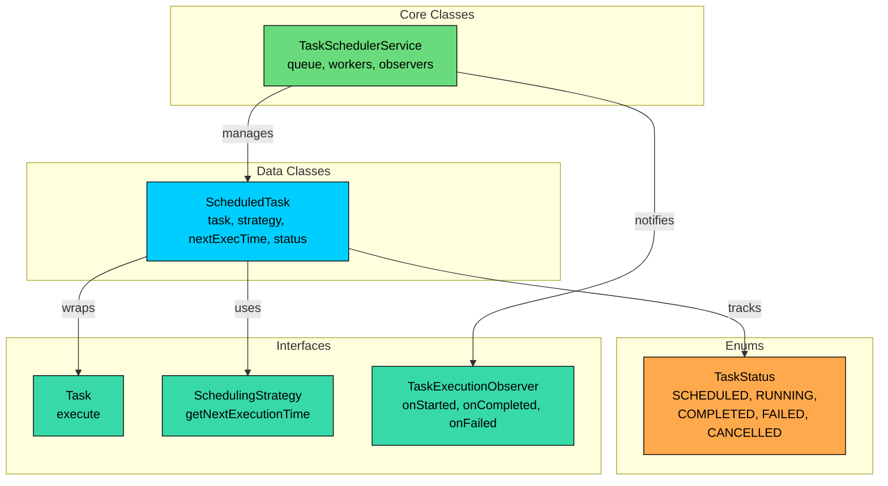

| Entity | Type | Responsibility |
|--------|------|----------------|
| `Task` | Interface | Defines executable work |
| `TaskStatus` | Enum | Lifecycle states: SCHEDULED, RUNNING, COMPLETED, FAILED, CANCELLED |
| `SchedulingStrategy` | Interface | Calculates next execution time |
| `TaskExecutionObserver` | Interface | Receives task lifecycle events |
| `ScheduledTask` | Data Class | Wraps Task with scheduling metadata and status |
| `TaskSchedulerService` | Core Class | Orchestrates queue, manual thread pool, and execution |

With our entities identified, let's define their attributes, behaviors, and relationships.

---

# 3. Designing Classes and Relationships

Now that we know what entities we need, let's flesh out their details. This section is entirely about design, not implementation.

We'll work bottom-up: enums and interfaces first, then data classes, then the core orchestrator.

## 3.1 Class Definitions

### Enums

#### `TaskStatus`

Tracks where a task is in its lifecycle.

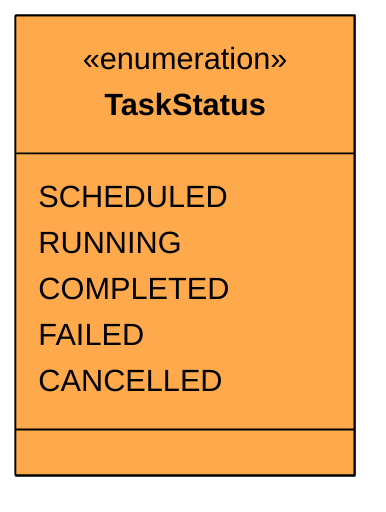

| Value | Description | Terminal" |
|-------|-------------|-----------|
| `SCHEDULED` | Task is in the queue waiting to execute | No |
| `RUNNING` | Worker thread is currently executing the task | No |
| `COMPLETED` | Task finished successfully | Yes (unless recurring) |
| `FAILED` | Task threw an exception during execution | Yes (unless recurring) |
| `CANCELLED` | Task was cancelled before execution | Yes |

A task starts as `SCHEDULED` and transitions to `RUNNING` when a worker picks it up. From `RUNNING`, it moves to either `COMPLETED` or `FAILED`. A recurring task that completes transitions back to `SCHEDULED` with an updated next execution time.

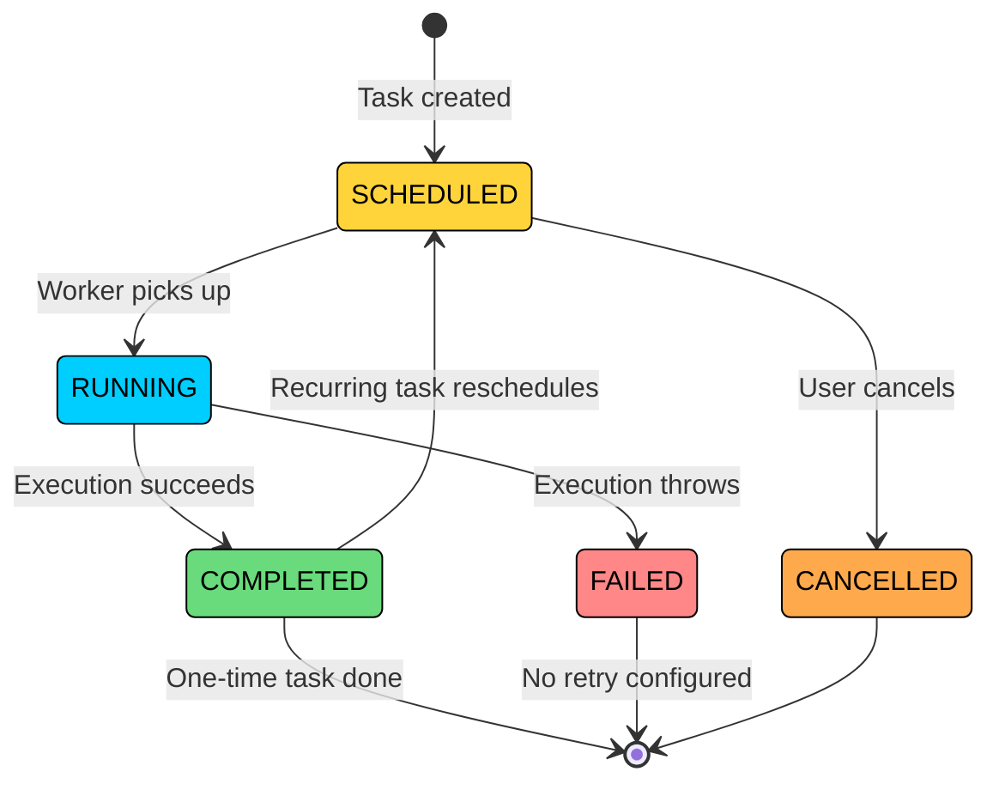

Notice that `CANCELLED` is a one-way terminal state. Once cancelled, a task cannot be rescheduled. Also notice that `RUNNING` cannot transition directly to `SCHEDULED`. A recurring task must go through `COMPLETED` first, which triggers the rescheduling logic.

### Interfaces

The scheduler needs to execute arbitrary work without knowing what that work is. A backup task and a message-printing task have completely different logic, but the scheduler should treat them identically.

#### `Task`

Represents any executable unit of work. This follows the Command pattern: encapsulate an action as an object.

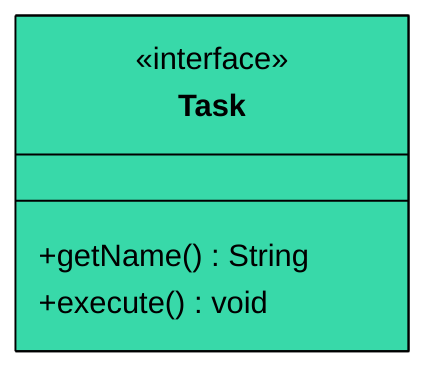

| Method | Description |
|--------|-------------|
| `getName()` | Returns a human-readable task name for logging |
| `execute()` | Performs the actual work |

#### `SchedulingStrategy`

Defines how to calculate when a task should run next. This is the Strategy pattern: different scheduling algorithms are interchangeable.

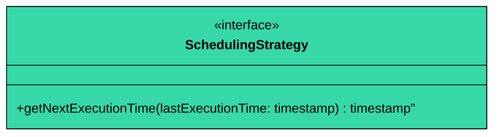

| Method | Description |
|--------|-------------|
| `getNextExecutionTime(lastExecutionTime)` | Returns the next execution time, or null/empty if no more executions |

The nullable return type is key. When a one-time task has already executed, it returns null/empty to signal "I'm done, don't reschedule me." This is cleaner than using a sentinel value or a separate `hasMoreExecutions()` check.

#### `TaskExecutionObserver`

Receives task lifecycle events. This is the Observer pattern for decoupled notification.

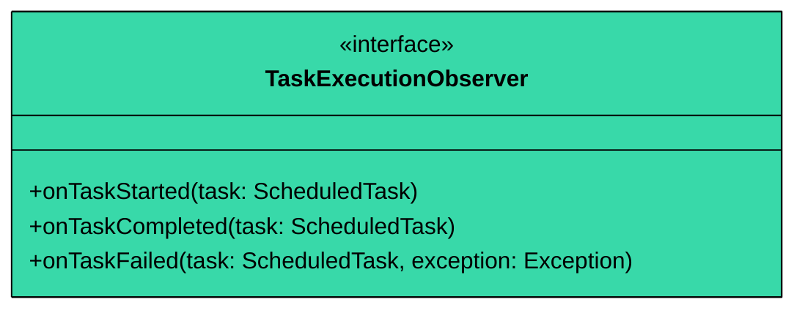

| Method | Description |
|--------|-------------|
| `onTaskStarted(task)` | Called just before task execution begins |
| `onTaskCompleted(task)` | Called after successful execution |
| `onTaskFailed(task, exception)` | Called when execution throws an exception |

Three separate methods instead of one generic `onEvent(type, task)` because each event has different data. Failures include an exception, completions don't.

### Data Classes

#### `ScheduledTask`

Wraps a Task with its scheduling metadata. This is what goes into the priority queue.

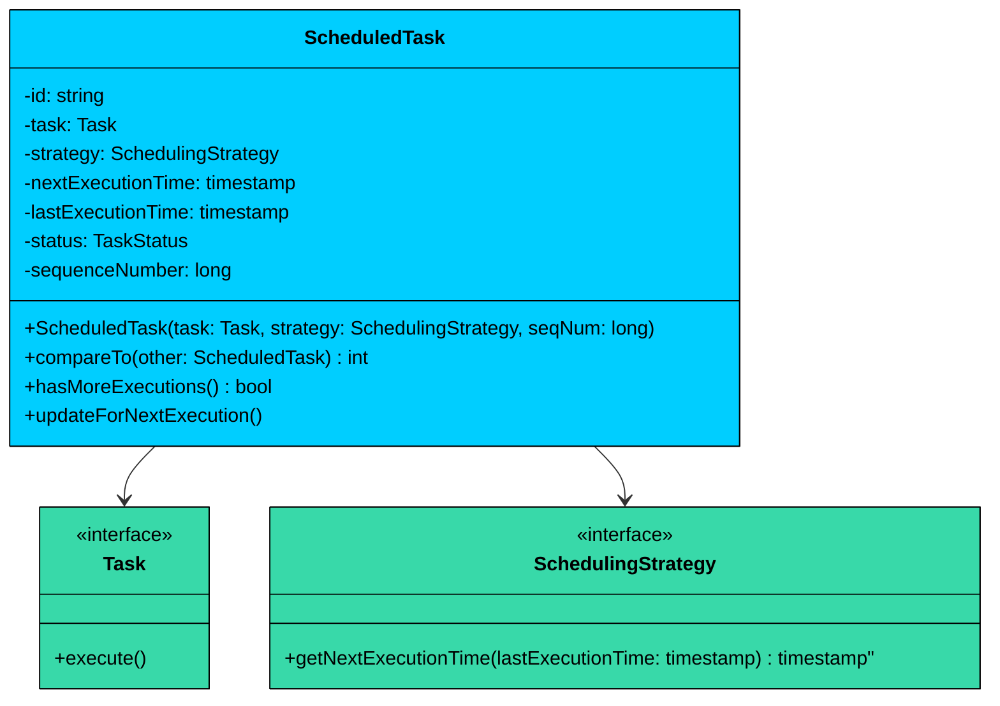

| Attribute | Type | Description | Mutable" |
|-----------|------|-------------|----------|
| `id` | String | UUID for identification and cancellation | No |
| `task` | Task | The actual work to execute | No |
| `strategy` | SchedulingStrategy | Calculates next execution time | No |
| `nextExecutionTime` | LocalDateTime | When to execute next | Yes |
| `lastExecutionTime` | LocalDateTime | When last executed (null if never) | Yes |
| `status` | TaskStatus | Current lifecycle state | Yes |
| `sequenceNumber` | long | Tiebreaker for same-time tasks (FIFO order) | No |

| Method | Description |
|--------|-------------|
| `compareTo(other)` | Orders by nextExecutionTime, then sequenceNumber as tiebreaker |
| `hasMoreExecutions()` | Returns true if strategy provides a next time |
| `updateForNextExecution()` | Updates lastExecutionTime and recalculates nextExecutionTime |

> 💡 **Key Insight:**

> **Design Decision**
>
> The `sequenceNumber` field is a monotonically increasing counter assigned at scheduling time. When two tasks have the same `nextExecutionTime`, the one scheduled first gets priority. Without this, the `PriorityQueue` ordering would be unstable for same-time tasks, potentially starving tasks that were scheduled earlier.

### Core Classes

#### `TaskSchedulerService`

It is the central orchestrator. t manages the priority queue, spawns worker threads, and coordinates execution.

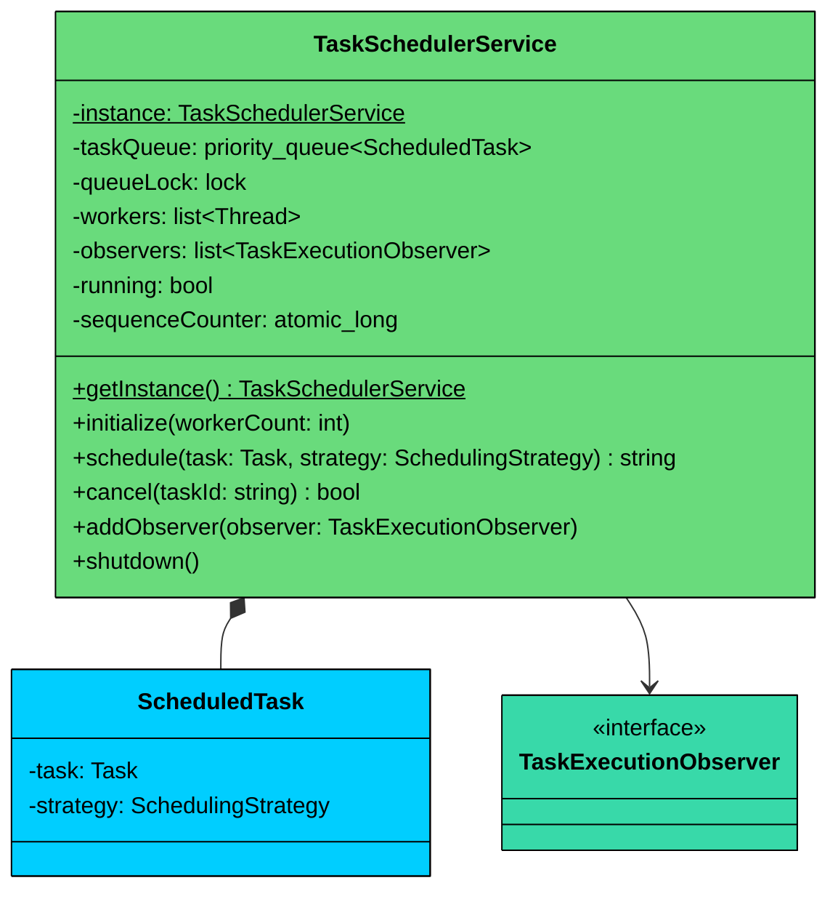

| Attribute | Type | Description |
|-----------|------|-------------|
| `instance` | TaskSchedulerService (static, volatile) | Singleton instance |
| `taskQueue` | PriorityQueue<ScheduledTask> | Min-heap ordered by execution time |
| `queueLock` | Object | Lock for synchronized access to queue |
| `workers` | Thread[] | Manually created worker threads |
| `observers` | CopyOnWriteArrayList<TaskExecutionObserver> | Lifecycle event listeners |
| `running` | volatile boolean | Controls worker loop lifecycle |
| `sequenceCounter` | AtomicLong | Generates tiebreaker sequence numbers |

| Method | Description |
|--------|-------------|
| `getInstance()` | Thread-safe singleton access (double-checked locking) |
| `initialize(workerCount)` | Creates and starts worker threads |
| `schedule(task, strategy)` | Wraps task, adds to queue, notifies workers, returns ID |
| `cancel(taskId)` | Marks task as cancelled and removes from queue |
| `addObserver(observer)` | Registers a lifecycle event listener |
| `shutdown()` | Stops workers gracefully |

#### **Key Design Principles:**

1. **Manual Thread Pool:** We create worker threads directly instead of using a built-in executor framework. Each worker runs a loop that pulls from the priority queue using lock-based synchronization. This demonstrates understanding of concurrency internals, which is exactly what interviewers are testing.
2. **Timed Wait Pattern:** Workers don't busy-wait. When the next task is in the future, the worker releases the lock and sleeps until either the delay expires or a new task is scheduled (which wakes all workers). This is the same mechanism that production-grade scheduled executors use internally.
3. **Singleton:** One scheduler per application. Uses thread-safe lazy initialization to ensure only one instance exists, even under concurrent access.

> 💡 **Key Insight:**

> **Design Alternative**
>
> In production, you'd use `ScheduledExecutorService` or `PriorityBlockingQueue` from `java.util.concurrent`. We use manual synchronization with `PriorityQueue` + `wait`/`notify` because it demonstrates the underlying mechanics that these utilities abstract away. Understanding what happens inside `PriorityBlockingQueue` is exactly what interviewers are testing.
>
>  We could use `PriorityBlockingQueue` instead of `PriorityQueue` + manual synchronization. `PriorityBlockingQueue` handles thread safety internally, but it doesn't support timed waits based on the next task's execution time. With manual `wait(delayMs)`, we can sleep exactly until the next task is due, then wake up. This is how `ScheduledThreadPoolExecutor` works internally.

## 3.2 Key Design Patterns

This problem is **pattern-heavy**. The core challenge is managing multiple interchangeable behaviors (scheduling strategies), decoupled event notification (observers), and concurrent producer-consumer coordination (queue + workers).

### [**Command Pattern**](/learn/lld/command)** (Task)**

**The Problem:** The scheduler needs to execute arbitrary work, but it shouldn't know or care what that work is. A backup task and a message-printing task have completely different logic, but the scheduler treats them identically.

**The Solution:** The Command pattern encapsulates work as an object. Every task implements the `Task` interface with a single `execute()` method. The scheduler invokes `task.execute()` without knowing the implementation details. The caller (client) creates a concrete command and hands it to the invoker (scheduler), which stores it in a queue and triggers execution later. The command itself holds everything it needs to run, so the invoker never touches the receiver's internals.

### [**Strategy Pattern**](/learn/lld/strategy)** **(SchedulingStrategy)

**The Problem:** Different tasks need different scheduling rules. A one-time reminder runs once. A health check runs every 30 seconds. A report runs on a CRON schedule. If we bake scheduling logic into the task itself, we'd need a different task class for every combination of work and timing.

**The Solution:** The Strategy pattern separates the *what* (Task) from the *when* (SchedulingStrategy). A single backup task can be paired with a one-time strategy in testing and a recurring strategy in production.

This gives us multiplicative flexibility. 5 task types and 3 scheduling strategies yield 15 combinations without 15 classes. Adding a CRON strategy later means adding one class, not modifying every task.

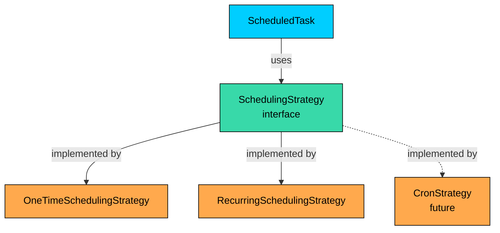

### [**Observer Pattern**](/learn/lld/observer)** **(TaskExecutionObserver)

**The Problem:** When a task starts, completes, or fails, multiple systems might care: logging, metrics, alerting. If the scheduler directly calls a logger, adding metrics means modifying the scheduler. Adding alerting means modifying it again. Every new concern adds another hardcoded dependency, and the scheduler becomes a tangled mess that knows about logging libraries, metrics SDKs, and email clients.

**The Solution:** The Observer pattern decouples the scheduler from its listeners. The scheduler maintains a list of registered observers and notifies all of them when a lifecycle event occurs. Each observer decides independently what to do with the event. The scheduler doesn't know whether it's talking to a logger, a metrics counter, or a PagerDuty integration.

### [**Producer-Consumer Pattern**](/learn/lld/producer-consumer)** **(PriorityQueue + Workers)

**The Problem:** Scheduling and execution happen at different times and from different threads. The `schedule()` method adds tasks; worker threads consume them. Without coordination, workers might miss tasks or multiple workers might grab the same one.

**The Solution:** A shared `PriorityQueue` protected by `synchronized`/`wait`/`notify` implements the producer-consumer pattern. Producers call `notifyAll()` after adding a task. Consumers call `wait()` when the queue is empty or the next task isn't due yet.

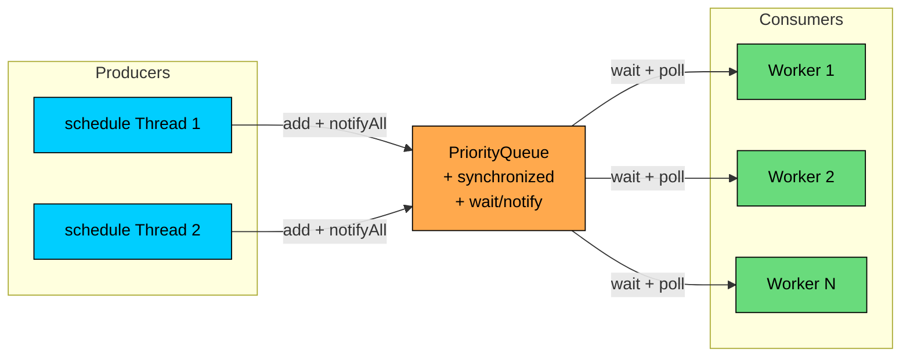

### [**Singleton Pattern**](/learn/lld/singleton)** (**TaskSchedulerService**)**

We need a single scheduler instance that all parts of the application share. Multiple scheduler instances would compete for threads and create duplicate task executions.

Singleton is appropriate here because we genuinely need one scheduler managing one thread pool and one priority queue.

## 3.3 Full Class Diagram

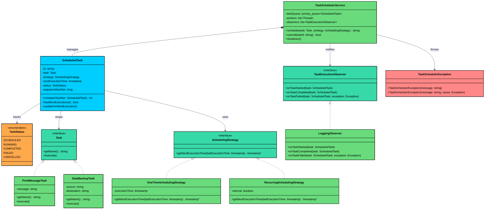

---

# 4. Code Implementation

Now let's translate our design into working Java code. We build bottom-up: enums and exceptions first, interfaces next, then implementations, and finally the core scheduler with its manual thread pool.

#### Java

## 4.1 Enums and Exceptions

We start with `TaskStatus`, which defines the five lifecycle states a task can be in. Every task begins as `SCHEDULED` and moves through transitions as workers pick it up and execute it.

```java
enum TaskStatus {
    SCHEDULED,   // In the queue, waiting for a worker
    RUNNING,     // A worker thread is currently executing this task
    COMPLETED,   // Execution finished successfully
    FAILED,      // Execution threw an exception
    CANCELLED    // Cancelled before execution (terminal, cannot be rescheduled)
}
```

Next, a custom exception for scheduler-specific errors. We extend `RuntimeException` (unchecked) because scheduler failures like "scheduler not running" are programming errors that callers shouldn't be forced to catch.

```java
class TaskSchedulerException extends RuntimeException {
    public TaskSchedulerException(String message) {
        super(message);
    }

    public TaskSchedulerException(String message, Throwable cause) {
        super(message, cause);
    }
}
```

The two-argument constructor preserves the original exception's stack trace when wrapping lower-level failures. This is important for debugging: you want to see both "scheduler failed" and the root cause.

## 4.2 Interfaces

The `Task` interface follows the Command pattern. It encapsulates a unit of work as an object that the scheduler can queue, execute, and track without knowing what the work actually is.

```java
interface Task {
    String getName();  // Human-readable identifier for logging and monitoring
    void execute();    // Performs the actual work
}
```

Why two methods instead of just `execute()`" Because `getName()` is essential for observability. When a task fails at 3 AM, "Task abc12345 failed" is useless in a log. "DataBackupTask failed" tells the on-call engineer exactly what broke.

The `SchedulingStrategy` interface defines the Strategy pattern for scheduling algorithms. It separates *when* a task runs from *what* it does.

```java
interface SchedulingStrategy {
    // Returns the next time this task should execute, or empty if done.
    // lastExecutionTime is null on the first call (task has never run).
    Optional<LocalDateTime> getNextExecutionTime(LocalDateTime lastExecutionTime);
}
```

The `Optional` return type is important. When a one-time task has already executed, the strategy returns `Optional.empty()` to cleanly signal "no more executions." This is safer than returning null, because the type system forces callers to handle the "done" case explicitly.

The `TaskExecutionObserver` interface follows the Observer pattern for decoupled lifecycle notifications. The scheduler calls these methods at the right moments, but doesn't know or care what observers do with the information.

```java
interface TaskExecutionObserver {
    void onTaskStarted(ScheduledTask task);
    void onTaskCompleted(ScheduledTask task);
    void onTaskFailed(ScheduledTask task, Exception exception);
}
```

We use three separate methods instead of one generic `onEvent(type, task)` because each event carries different data. Failures include an exception that observers need for alerting, while completions don't. This follows the Interface Segregation Principle: callers get exactly the signature they need.

## 4.3 ScheduledTask

This is the object that lives in the priority queue. It wraps a `Task` with scheduling metadata: when to run next, when it last ran, its current status, and a sequence number for tiebreaking. Think of it as the "envelope" around a task that the scheduler reads to decide ordering and timing.

```java
$ba
```

A few things to note about this class:

**The **`compareTo`** method** is what drives the priority queue ordering. Tasks with earlier execution times float to the top. When two tasks are due at the exact same time, the sequence number breaks the tie: whichever was scheduled first gets priority. Without the tiebreaker, `PriorityQueue` ordering would be unstable for same-time tasks, potentially starving tasks that were scheduled earlier.

**The **`updateForNextExecution`** method** uses the actual completion time, not the originally scheduled time, as the base for calculating the next run. This is a deliberate choice. If a task was scheduled for 10:00 but didn't finish until 10:07, the next run calculates from 10:07. For a 5-minute interval, that means the next run is at 10:12, not 10:05 (which already passed). This prevents task pile-up when tasks run longer than their interval.

## 4.4 Strategy Implementations

Now we implement the two scheduling strategies. Each one encapsulates a different timing algorithm behind the same `SchedulingStrategy` interface. The scheduler doesn't know which strategy a task uses, and it doesn't need to.

**OneTimeSchedulingStrategy** is the simplest strategy. It returns a fixed time on the first call, then signals "I'm done" by returning empty. The logic hinges on `lastExecutionTime`: if it's null, the task hasn't run yet, so we return the scheduled time. If it's not null, the task already ran, so there's nothing more to do.

```java
class OneTimeSchedulingStrategy implements SchedulingStrategy {
    private final LocalDateTime executionTime;

    public OneTimeSchedulingStrategy(LocalDateTime executionTime) {
        this.executionTime = executionTime;
    }

    @Override
    public Optional<LocalDateTime> getNextExecutionTime(LocalDateTime lastExecutionTime) {
        // null lastExecutionTime means the task has never executed
        if (lastExecutionTime == null) {
            return Optional.of(executionTime);
        }
        // Already executed once, no more runs needed
        return Optional.empty();
    }
}
```

If someone schedules a one-time task with a time in the past, the strategy still returns that time. The worker will see a non-positive delay and execute immediately, which is typically the desired behavior.

**RecurringSchedulingStrategy** calculates the next execution by adding a fixed interval to the last execution time. On the first call (when `lastExecutionTime` is null), it uses `now + interval` as the base, so the first execution happens one interval from now.

```java
class RecurringSchedulingStrategy implements SchedulingStrategy {
    private final Duration interval;

    public RecurringSchedulingStrategy(Duration interval) {
        // Fail fast: zero or negative intervals make no sense for recurring tasks
        if (interval.isNegative() || interval.isZero()) {
            throw new IllegalArgumentException("Interval must be positive");
        }
        this.interval = interval;
    }

    @Override
    public Optional<LocalDateTime> getNextExecutionTime(LocalDateTime lastExecutionTime) {
        // First execution: schedule relative to now
        // Subsequent executions: schedule relative to when the task last finished
        LocalDateTime baseTime = (lastExecutionTime != null)
            " lastExecutionTime
            : LocalDateTime.now();
        return Optional.of(baseTime.plus(interval));
    }
}
```

Notice how the recurring strategy always returns a value. There's no natural "end." It will keep producing future times forever. If you wanted a recurring task that stops after N executions, you'd create a `LimitedRecurringStrategy` that wraps this one with a counter and returns `Optional.empty()` after the limit is reached.

## 4.5 Task Implementations

Here are two concrete task implementations for demonstration. In a real system, these would be things like sending emails, generating reports, or calling APIs. The key thing is that each task only knows *what* to do, not *when* or *how often*.

`PrintMessageTask` is a lightweight task that prints a timestamped message. It's useful for testing and verifying that the scheduler fires at the right times.

```java
class PrintMessageTask implements Task {
    private final String message;

    public PrintMessageTask(String message) {
        this.message = message;
    }

    @Override
    public String getName() { return message; }

    @Override
    public void execute() {
        // withNano(0) truncates nanoseconds for cleaner log output
        System.out.printf("[%s] %s%n", LocalTime.now().withNano(0), message);
    }
}
```

`DataBackupTask` simulates a long-running operation. The 2-second sleep represents actual I/O work (copying files, writing to storage). This is important for testing because it demonstrates that a slow task doesn't block other workers from executing their tasks.

```java
class DataBackupTask implements Task {
    private final String source;
    private final String destination;

    public DataBackupTask(String source, String destination) {
        this.source = source;
        this.destination = destination;
    }

    @Override
    public String getName() { return "DataBackupTask"; }

    @Override
    public void execute() {
        System.out.printf("[%s] Starting backup: %s -> %s%n",
            LocalTime.now().withNano(0), source, destination);
        try {
            Thread.sleep(2000);  // Simulate I/O-bound work
        } catch (InterruptedException e) {
            // Restore the interrupt flag so the caller (worker thread)
            // knows this thread was interrupted during execution
            Thread.currentThread().interrupt();
        }
        System.out.printf("[%s] Backup completed: %s -> %s%n",
            LocalTime.now().withNano(0), source, destination);
    }
}
```

The `Thread.currentThread().interrupt()` call in the catch block deserves attention. When `Thread.sleep()` is interrupted, Java clears the thread's interrupt flag. If we don't restore it, the worker thread won't know it was interrupted, and the scheduler's `shutdown()` logic (which relies on interrupts) won't work correctly.

## 4.6 Observer Implementation

`LoggingObserver` is a straightforward observer that prints task lifecycle events to the console. In production, you'd replace this with structured logging, metric counters, or alerting integrations. The point is that each observer handles one concern, and adding new ones doesn't touch the scheduler.

```java
class LoggingObserver implements TaskExecutionObserver {
    @Override
    public void onTaskStarted(ScheduledTask task) {
        // Include thread name so logs show which worker executed which task
        System.out.printf("[%s] Task '%s' started%n",
            Thread.currentThread().getName(), task.getTask().getName());
    }

    @Override
    public void onTaskCompleted(ScheduledTask task) {
        System.out.printf("[%s] Task '%s' completed%n",
            Thread.currentThread().getName(), task.getTask().getName());
    }

    @Override
    public void onTaskFailed(ScheduledTask task, Exception exception) {
        // Use stderr for failures so they stand out in logs
        System.err.printf("[%s] Task '%s' failed: %s%n",
            Thread.currentThread().getName(), task.getTask().getName(),
            exception.getMessage());
    }
}
```

## 4.7 TaskSchedulerService

This is the heart of the system. It combines the Singleton, Facade, and Producer-Consumer patterns into one class. Internally, it manages a `PriorityQueue` with manual `synchronized`/`wait`/`notify` synchronization and a hand-built thread pool of raw `Thread` objects.

Let's walk through it piece by piece.

**Fields and Constructor:**

```java
$bb
```

We use a dedicated `queueLock` object rather than `synchronized(this)` or `synchronized(taskQueue)`. This is intentional: using `this` as a lock is fragile because external code could also synchronize on our instance and cause unexpected contention. A private lock object gives us full control.

**Singleton Access:**

```java
    public static TaskSchedulerService getInstance() {
        // First check: avoid synchronization overhead on every call
        if (instance == null) {
            synchronized (instanceLock) {
                // Second check: another thread may have created the instance
                // between our first check and acquiring the lock
                if (instance == null) {
                    instance = new TaskSchedulerService();
                }
            }
        }
        return instance;
    }
```

Double-checked locking with `volatile`. The first null check is an optimization: once the instance exists, we skip the `synchronized` block entirely. The second check inside the block handles the race where two threads both pass the first check.

**Initialization and Worker Startup:**

```java
    public void initialize(int workerCount) {
        if (workerCount <= 0) {
            throw new IllegalArgumentException("Worker count must be positive");
        }
        if (running) {
            throw new TaskSchedulerException("Scheduler is already running");
        }

        this.running = true;
        this.workers = new Thread[workerCount];
        for (int i = 0; i < workerCount; i++) {
            workers[i] = new Thread(this::runWorker, "Scheduler-Worker-" + i);
            // Daemon threads don't prevent JVM shutdown. If the main thread
            // exits without calling shutdown(), the JVM still terminates cleanly.
            workers[i].setDaemon(true);
            workers[i].start();
        }
        System.out.printf("Started %d worker threads%n", workerCount);
    }
```

Each worker runs the same `runWorker()` method. Named threads (`Scheduler-Worker-0`, etc.) make log output and thread dumps much easier to read than `Thread-14`.

**Scheduling (Producer Side):**

```java
    public String schedule(Task task, SchedulingStrategy strategy) {
        if (task == null || strategy == null) {
            throw new IllegalArgumentException("Task and strategy must not be null");
        }
        if (!running) {
            throw new TaskSchedulerException("Scheduler is not running");
        }

        ScheduledTask scheduledTask = new ScheduledTask(
            task, strategy, sequenceCounter.getAndIncrement());

        synchronized (queueLock) {
            taskQueue.add(scheduledTask);
            // Wake ALL waiting workers. One of them will pick up this task.
            // We use notifyAll() instead of notify() because a worker in a
            // timed wait (sleeping until a future task) also needs to wake up
            // and re-evaluate if this new task is earlier than what it's waiting for.
            queueLock.notifyAll();
        }
        return scheduledTask.getId();
    }
```

The `notifyAll()` after adding to the queue is essential. Workers might be sleeping in `wait()` (queue was empty) or `wait(delayMs)` (waiting for a future task). In both cases, the new task might need attention sooner than whatever the worker was waiting for.

**Cancellation:**

```java
    public boolean cancel(String taskId) {
        synchronized (queueLock) {
            // Linear scan through the queue to find the task by ID.
            // PriorityQueue doesn't support O(1) lookup by ID, but cancellation
            // is rare enough that O(n) is acceptable for an interview solution.
            Iterator<ScheduledTask> iterator = taskQueue.iterator();
            while (iterator.hasNext()) {
                ScheduledTask task = iterator.next();
                if (task.getId().equals(taskId)) {
                    task.setStatus(TaskStatus.CANCELLED);
                    iterator.remove();
                    return true;
                }
            }
        }
        // Task not found: either already executed or invalid ID
        return false;
    }

    public void addObserver(TaskExecutionObserver observer) {
        // CopyOnWriteArrayList handles thread safety internally
        observers.add(observer);
    }
```

**Shutdown:**

```java
    public void shutdown() {
        running = false;  // volatile write: immediately visible to all workers

        // Wake any workers blocked in wait()
        synchronized (queueLock) {
            queueLock.notifyAll();
        }

        // Interrupt workers that might be sleeping in wait(delayMs)
        // or blocked inside a long-running task
        for (Thread worker : workers) {
            if (worker != null) {
                worker.interrupt();
            }
        }
        System.out.println("Scheduler shut down.");
    }
```

Shutdown does three things: sets the `running` flag to false, wakes workers blocked on `wait()`, and interrupts workers that might be in the middle of a timed wait or a long-running task. Workers check the `running` flag at the top of their loop and exit gracefully.

**Worker Loop (Consumer Side) - the critical method:**

```java
$bc
```

**Task Execution and Rescheduling:**

```java
$bd
```

The `executeTask` method has an important design choice in its rescheduling logic: it calls `updateForNextExecution()` regardless of whether the task succeeded or failed. This means a recurring task that fails will still be rescheduled for its next interval. If you wanted failed tasks to stop recurring, you'd add a check for `TaskStatus.FAILED` before rescheduling.

With our implementation complete, let's take a closer look at the concurrency mechanics that make it all work.

---

# 5. Run and Test

---

# 6. Quiz
