Distributed systems keep copies of data in more than one place: primary databases, read replicas, caches, search indexes, vector indexes, event streams, analytics stores, and regional failover clusters.

Replication improves availability, read capacity, locality, and fault tolerance. It also creates a contract problem:

**After a write succeeds, what is a later read allowed to return"**

That contract is the consistency model.

A consistency model does not tell you whether the data is "correct" in a business sense. It tells you which histories of reads and writes the storage system is allowed to expose. That distinction matters. A system can be internally consistent and still contain a bad payment record because the application wrote the wrong value.

In practice, consistency is not one switch. A production system often uses strong consistency for money, permissions, quotas, and workflow transitions, while using weaker consistency for search, recommendations, counters, caches, and AI-derived indexes.

---

# 1. Why Consistency is Hard in Distributed Systems

On a single machine, consistency is easier to reason about. There is one copy of the data, one local clock domain, and one storage engine deciding operation order.

Once data is replicated, several things can happen:

1. A write reaches one replica before another.
2. A client reads from a replica that has not caught up.
3. A network partition prevents replicas from exchanging updates.
4. Two regions accept writes to the same item at nearly the same time.
5. A cache, search index, or feature store lags behind the source of truth.

#### The Replication Problem

Suppose a client writes `X = 5`. Node 1 applies the write and replicates it to Node 3, but Node 2 is behind.

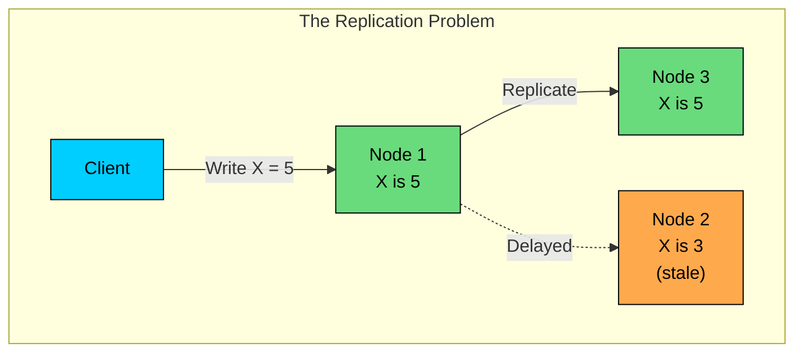

If another client reads from Node 2, should the system return `X = 3`, wait until Node 2 catches up, route the read elsewhere, or reject the read because freshness cannot be proven"

Different consistency models answer that question differently.

#### The Coordination Cost

Stronger consistency usually requires coordination. Coordination means nodes must exchange messages before acknowledging writes, serving reads, or declaring a leader healthy.

Each benefit comes with a paired cost. Later reads observe acknowledged writes, but read or write latency goes up. Stale reads become rarer, at the cost of availability during partitions.

A clearer operation order makes invariants easier to enforce, but write throughput suffers on hot keys or shards, and replication, failover, and testing all become more complex.

Weaker consistency reduces coordination, and again the benefits and costs come paired. Local or replica reads become possible, but they may return stale results. Writes can be accepted during partial failures, but the system has to detect and resolve conflicts later.

Geographic locality improves, though users may observe lag between views. Throughput for derived data goes up, but more reconciliation work moves into the application layer.

The right model is the weakest one that still protects the product's correctness requirements.

#### What Consistency Models Define

A consistency model is a contract between a storage system and its clients. Given a history of writes, it defines which values each read may return.

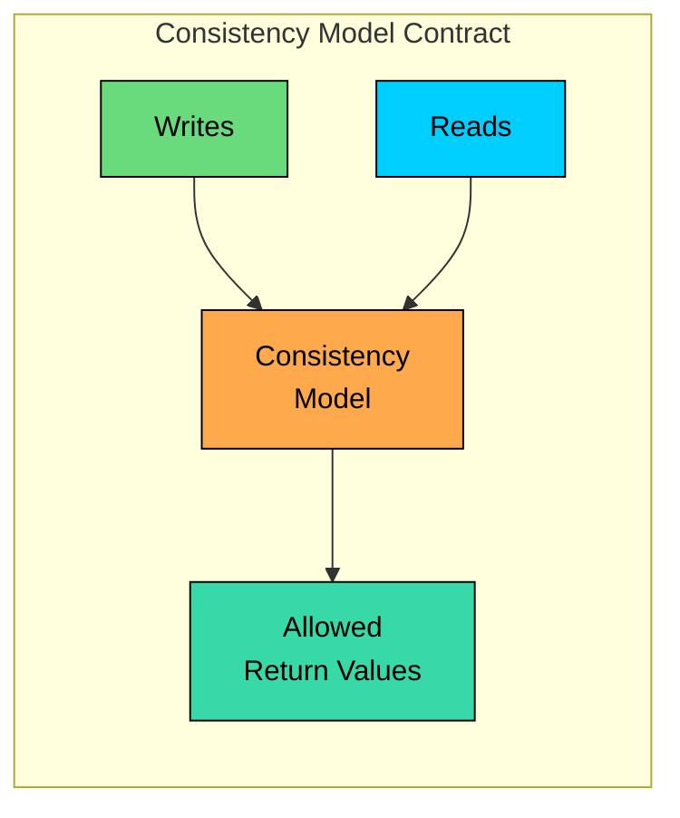

This is why vague statements like "the database is consistent" are not enough. You need to know the exact guarantee: linearizable reads, serializable transactions, causal consistency, read-your-writes, monotonic reads, eventual convergence, or something weaker.

---

# 2. The Consistency Spectrum

> [!PAYWALL] This content is for premium members only.

Consistency is a spectrum of guarantees. The stronger the guarantee, the more the system must coordinate.

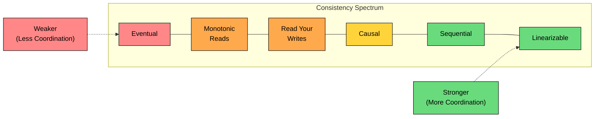

The diagram is a simplification. Some models are not strictly comparable in every detail. For example, read-your-writes and monotonic reads are client-centric session guarantees, while linearizability is a system-wide guarantee. Still, the spectrum is useful because it shows the design direction: fewer guarantees require less coordination, and stronger guarantees require more coordination.

---

# 3. Strong Consistency Models

Strong consistency models make distributed state behave more like a single authoritative copy. They reduce application ambiguity, but they are not free. The cost shows up as latency, unavailable operations during partitions, leader bottlenecks, quorum reads, transaction conflicts, and more careful operations.

### 3.1 Linearizability

Linearizability is the usual meaning of "strong consistency" for individual objects or operations.

If a write completes before a read begins, the read must return that write or a later one. The system behaves as if each operation takes effect atomically at one instant between the request and the response.

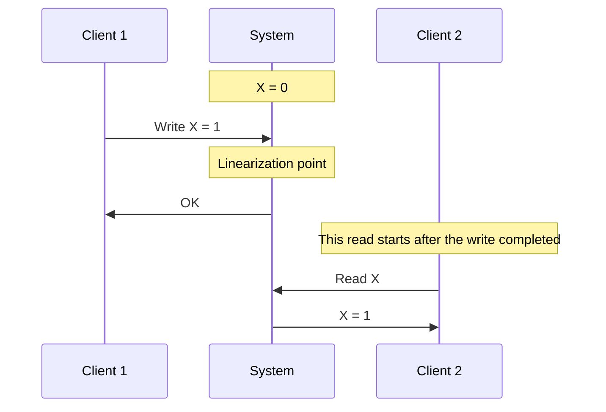

**Linearizability guarantees:**

1. **Real-time ordering:** if operation A completes before operation B starts, B must observe A or a later state.
2. **Atomic visibility:** each operation appears to take effect at one point in time.
3. **Single-object clarity:** clients can reason about a replicated object as if there is one copy.

Linearizability is commonly implemented with a leader, consensus protocol, quorum protocol, or a read path that verifies leader freshness. A follower may have stale bytes on disk; the system preserves the guarantee by not serving unsafe reads from that follower.

**Use cases:** distributed locks, leader election metadata, account balance reads, inventory reservations, quota counters, permission changes, idempotency records, and state transitions where returning stale data can cause a correctness bug.

For AI systems, linearizability often matters around billing usage, rate limits, model rollout state, access control, prompt safety policy versions, and ownership of long-running jobs. It usually does not matter for every recommendation, embedding lookup, or analytics counter.

### 3.2 Sequential Consistency

Sequential consistency is weaker than linearizability.

All operations appear to execute in some single sequential order, and each client's operations appear in that client's program order. However, the global order does not have to respect real time.

With linearizability, if your write completes before my read starts, my read must see your write. With sequential consistency, my read may not see it, as long as the result can be explained by some sequential ordering that preserves each client's local order.

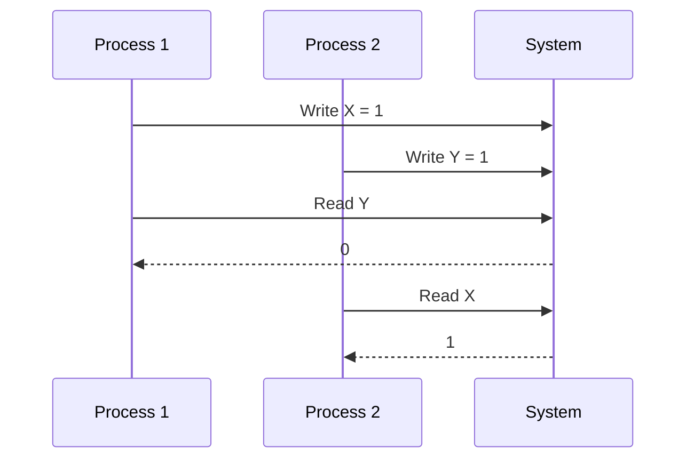

This result is sequentially consistent because it can be explained by this order:

`P1: Write X = 1` -> `P1: Read Y = 0` -> `P2: Write Y = 1` -> `P2: Read X = 1`

It is not linearizable if `P2`'s write completed before `P1`'s read began, because real-time order would require `P1` to see `Y = 1`.

**Use cases:** processor and memory models, replicated systems where preserving per-client order matters more than preserving wall-clock order.

### 3.3 Serializability and Strict Serializability

Serializability is a transaction isolation guarantee. It says the result of concurrent transactions must be equivalent to some serial execution.

Serializability alone does not necessarily respect real time. If transaction A commits before transaction B starts, a merely serializable system may still choose a serial order where B appears before A, depending on the implementation and isolation semantics.

Strict serializability adds real-time ordering. If transaction A commits before transaction B starts, A must appear before B in the serial order.

This distinction is important:

| Model | Applies To | Real-Time Order Required" |
|-------|------------|---------------------------|
| Linearizability | Single-object operations | Yes |
| Serializability | Transactions | Not necessarily |
| Strict serializability | Transactions | Yes |

**Use cases:** financial transfers, seat booking, scarce inventory, order placement, entitlement grants, billing updates, and any transaction that must preserve invariants across multiple rows or objects.

---

# 4. Weak and Intermediate Consistency Models

Weak consistency models trade some visibility guarantees for lower latency, higher availability, or simpler replication. They are useful when the application can tolerate staleness, expose pending states, reconcile conflicts, or treat the data as derived.

Weak does not mean sloppy. A weak consistency model still needs precise behavior, monitoring, and recovery rules.

### 4.1 Eventual Consistency

Eventual consistency makes one core promise: if updates stop and replication succeeds, replicas eventually converge to the same value.

It does not promise when convergence will happen. It does not promise that a read will see the latest write. It does not define how conflicts are resolved.

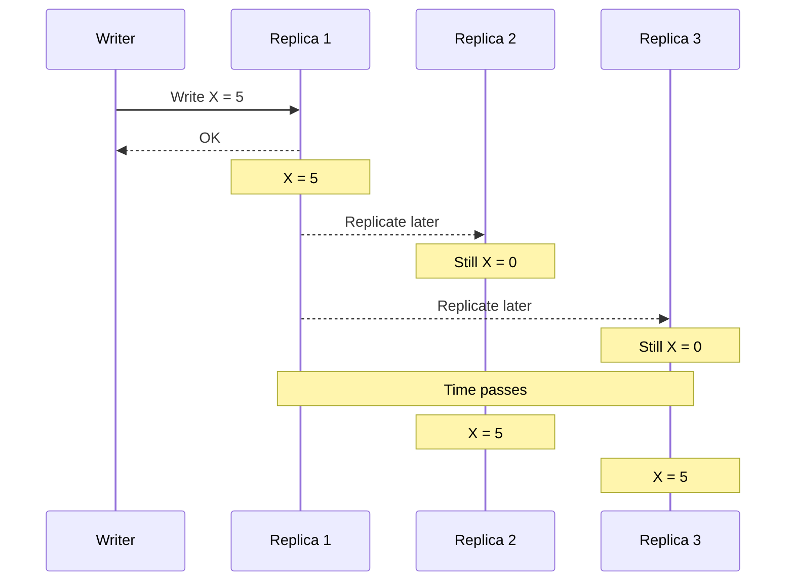

Eventual consistency provides three guarantees. Replicas eventually converge to the same value once updates stop and replication completes. Different replicas may return different values during propagation, and any individual read may miss a recently acknowledged write.

It is just as important to know what eventual consistency does not promise. There is no bounded staleness: lag may be milliseconds in normal operation and much longer during failure or backlog.

There is no read-your-writes guarantee, so a user may update data and then read the old value from another replica. There is no monotonic-reads guarantee either, so a user may see a newer value and then an older value on a later read.

Concurrent writes need a conflict-resolution policy of their own, whether that is a merge function, a winner-take-all rule, or an explicit application decision. Durability is also separate, since it depends on the storage and replication protocol rather than on eventual-consistency semantics alone.

That last point is a common source of bad designs. "Eventually consistent" does not automatically mean "durable" or "available." It only describes visibility and convergence. A system can be eventually consistent and still lose an acknowledged write if durability is poorly implemented.

#### Conflict Resolution

If two replicas accept conflicting writes, the system needs a rule for convergence.

| Strategy | How It Works | Risk |
|----------|--------------|------|
| Last-write-wins | The write with the highest timestamp or version wins | A valid write can be silently discarded |
| Version vectors or vector clocks | Track causality and detect concurrent updates | Application still needs merge logic |
| CRDTs | Use data types designed to merge without coordination | Only fits certain operations and data shapes |
| Application merge | Business logic resolves conflicts | Correct but often harder to build and test |
| Reject on conflict | Require the client to retry with a known version | More failures exposed to users |

Last-write-wins is simple, but it is often too blunt for user data. It can be acceptable for ephemeral presence state or cache refreshes. It is dangerous for profiles, documents, carts, and anything where losing one side of an update matters.

#### Where Eventual Consistency Works Well

- **CDN caches:** serving an older image or JavaScript bundle for a short time is usually acceptable.
- **DNS:** propagation delay is expected and operationally managed with TTLs.
- **Counters:** likes, views, impressions, and token usage aggregates can often lag.
- **Search indexes:** a newly created document may take a short time to appear in search.
- **Vector indexes:** newly embedded content may not be immediately retrievable through semantic search.
- **Feature stores and analytics:** derived features can update asynchronously if serving code understands freshness.
- **Activity feeds and notifications:** delivery can be asynchronous, deduplicated, and retried.

#### Where Eventual Consistency Causes Bugs

- **Inventory reservation:** stale counts can oversell scarce items.
- **Payment authorization:** stale balances can allow double spending.
- **Access control:** stale permission reads can grant access after revocation.
- **Safety policy updates:** stale policy versions can keep using a rule after it was disabled or tightened.
- **Job ownership:** two workers can process the same exclusive task if claims are not coordinated.

Eventual consistency is a good fit for derived views. It is a poor fit for the source of truth behind hard invariants.

### 4.2 Causal Consistency

Causal consistency preserves cause and effect.

If operation B depends on operation A, every process that observes B must also observe A first. Operations with no causal relationship may be observed in different orders by different replicas.

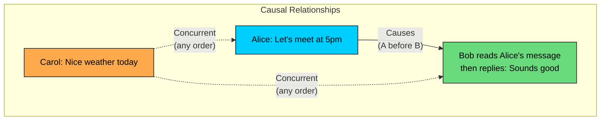

**Causality usually comes from:**

1. **Program order:** one client performs operation A before operation B.
2. **Read-from relationship:** a client reads A and then writes B based on A.
3. **Transitivity:** if A caused B and B caused C, then A caused C.

#### Causal Consistency Violation

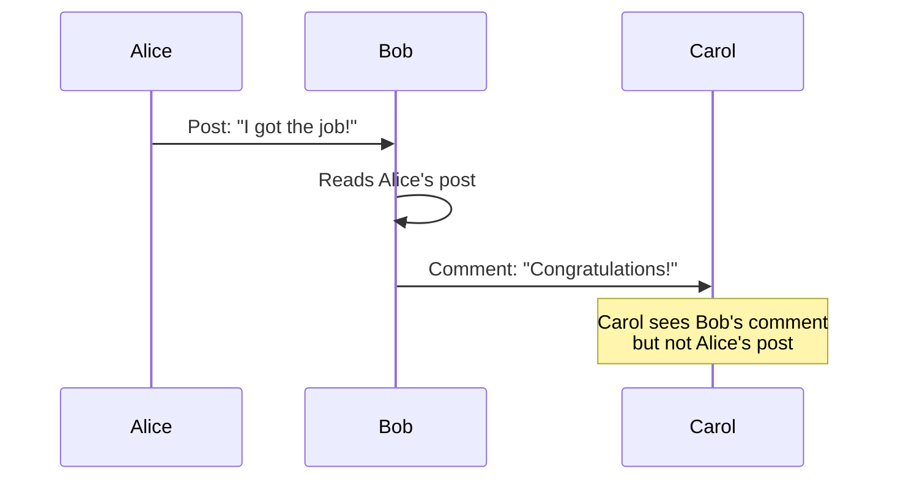

Bob's comment depends on Alice's post. Showing the comment without the post breaks causality.

**Use cases:** social feeds, comment threads, chat, collaborative documents, issue trackers, code review threads, notebook collaboration, and AI assistant threads where a generated response should not appear without the user message or tool result that caused it.

Causal consistency is often a practical middle ground: stronger than eventual consistency, weaker than linearizability, and aligned with how users understand conversations and workflows.

### 4.3 PRAM / FIFO Consistency

PRAM consistency, also called FIFO consistency, guarantees that writes from one process are observed in that process's order by every other process.

It does not order writes from different processes, and it does not capture dependencies created when one process reads another process's write.

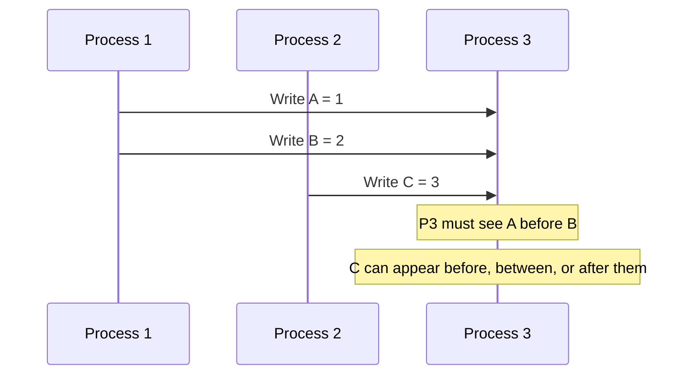

PRAM is weaker than causal consistency.

Example:

1. Process 1 writes `X = 1`.
2. Process 2 reads `X = 1`.
3. Process 2 writes `Y = 2`.

Under causal consistency, anyone who sees `Y = 2` must also be able to see `X = 1`, because `Y` depended on reading `X`.

Under PRAM consistency, that dependency is not protected. PRAM only preserves each writer's own order.

---

# 5. Client-Centric Consistency Models

Some consistency guarantees are scoped to one client or session rather than the whole system. These models are useful because many user-visible bugs are session bugs.

A user changes their profile photo, refreshes the page, and sees the old photo. Another user might not care if the update takes a second to propagate. The user who made the change does care.

### 5.1 Read-Your-Writes

Read-your-writes guarantees that after a client writes a value, that same client will see the write in later reads.

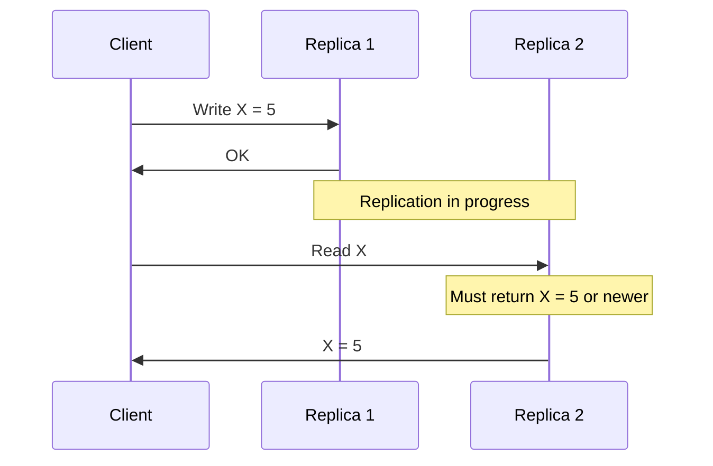

Systems commonly provide read-your-writes by routing the user's reads to the primary for a short window, using session tokens, pinning the user to a replica that has caught up, or requiring a minimum version on reads.

**Good use cases:** profile updates, account settings, uploaded files, conversation messages, prompt edits, saved agents, workspace changes, and any UI where confirmation should mean "you can now see your change."

### 5.2 Monotonic Reads

Monotonic reads guarantee that once a client has observed a value, later reads by that client will not return an older value.

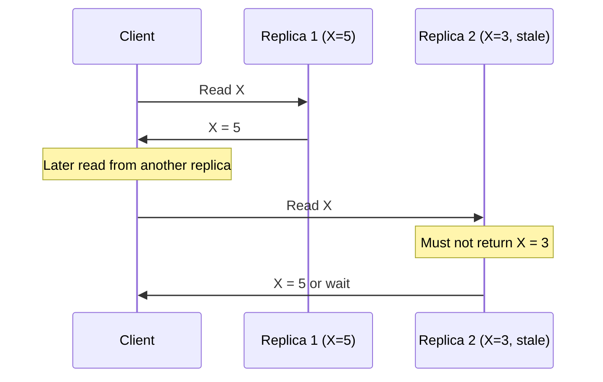

Without monotonic reads, data appears to move backward in time.

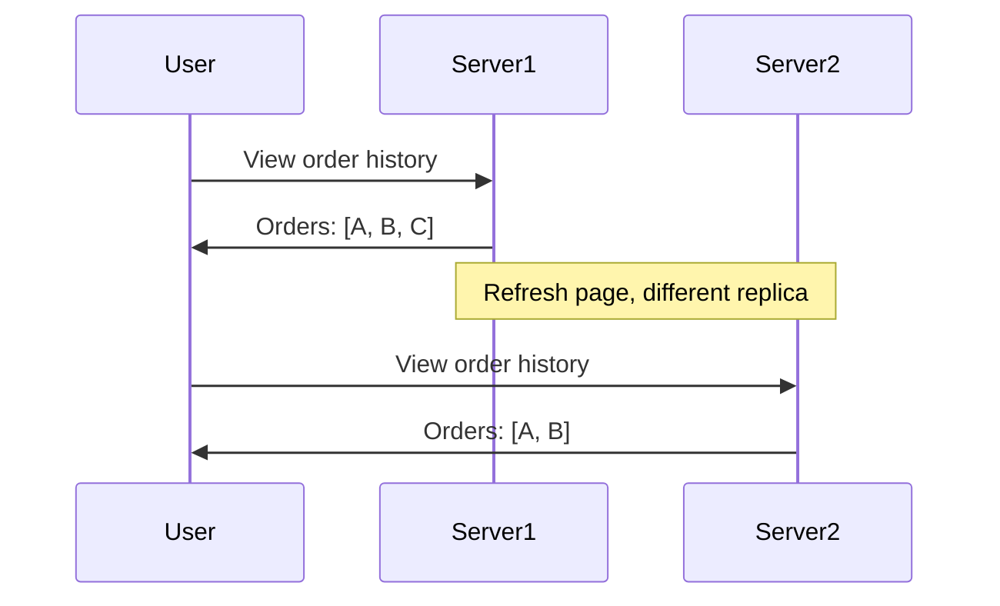

This is not just cosmetic. Users may retry operations, contact support, or lose trust because the system appears to have deleted data.

**Good use cases:** order history, message threads, audit logs, document versions, model evaluation runs, deployment history, and any timeline where observed events should not disappear.

### 5.3 Monotonic Writes

Monotonic writes guarantee that writes from one client are applied in that client's order.

If a client writes A and then writes B, replicas that observe B must not apply B before A.

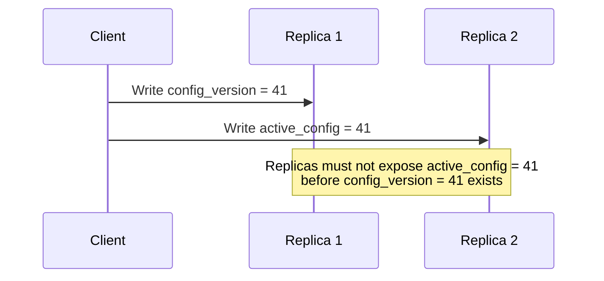

This matters when later writes depend on earlier writes. For example, publishing a model configuration before the referenced model artifact exists can break serving. Marking a migration complete before the migration has run can send readers to missing data.

### 5.4 Writes-Follow-Reads

Writes-follow-reads guarantees that if a client reads a value and then writes based on it, the write is ordered after the read.

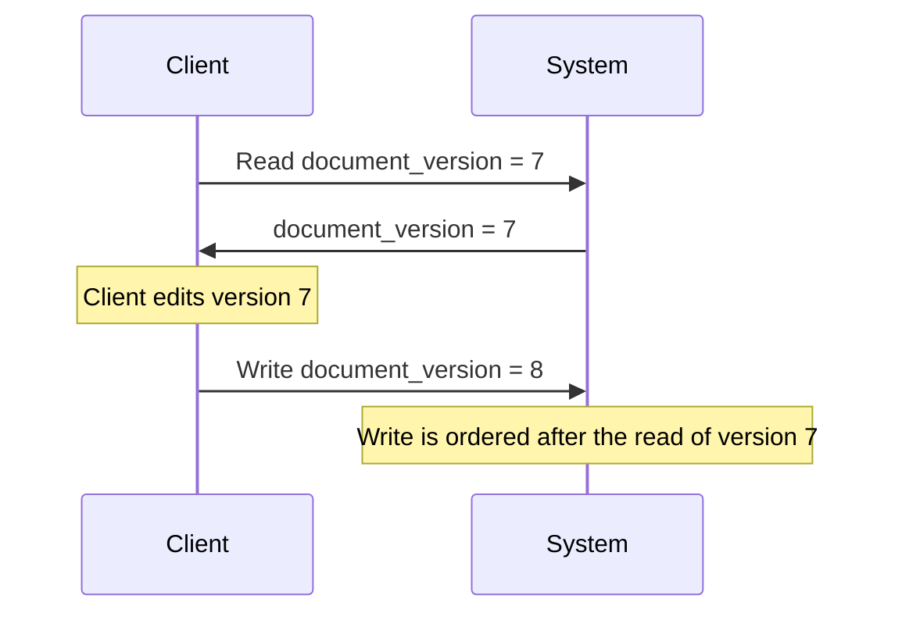

Without this guarantee, the system can accept a write that does not actually build on the state the client saw.

**Good use cases:** compare-and-swap flows, conditional updates, collaborative editing, optimistic concurrency control, workflow transitions, and AI annotation tools where reviewers update records after reading a specific version.

---

# 6. How Real Systems Expose Consistency

Production databases rarely expose a neat academic menu. They expose knobs: read concern, write concern, quorum level, transaction isolation, leader reads, follower reads, session guarantees, global table modes, and cache TTLs.

The important question is not "Is this database consistent"" The important question is:

**For this operation, after this write is acknowledged, which reads are guaranteed to observe it, from which regions, under which failures"**

### Common Implementation Patterns

| Pattern | Typical Guarantee | Notes |
|---------|-------------------|-------|
| Single leader with primary reads | Strong reads from the leader | Followers may still lag |
| Leader with async read replicas | Eventual reads from replicas | Good for scale, risky for fresh reads |
| Consensus group | Linearizable operations within the group | Often uses Raft or Paxos |
| Quorum reads and writes | Stronger visibility when quorums overlap | Depends on `R + W > N` and failure handling |
| Session tokens | Client-centric guarantees | Common for read-your-writes and monotonic reads |
| Multi-region active-active | Low local latency | Requires conflict resolution or global coordination |
| Cache with TTL/invalidation | Eventual visibility | Freshness depends on invalidation correctness and TTL |
| Event-driven projection | Eventual read model | Freshness depends on consumer lag and replay health |

Modern managed services often let you choose consistency per table, per operation, per region, or per transaction. That flexibility is useful, but it also makes architecture reviews more important. Two code paths hitting the same data store can have different guarantees.

Examples you will see in real systems:

- A key-value store may offer eventually consistent reads by default and strongly consistent reads for selected operations.
- A wide-column store may let reads and writes choose quorum levels.
- A document database may use read concern, write concern, and sessions to provide different visibility guarantees.
- A globally distributed SQL database may provide strict transactional guarantees, but cross-region writes still pay coordination latency.
- A search or vector index may be explicitly derived from the primary database and therefore lag by design.

Do not infer guarantees from a database category. Read the consistency contract for the exact product, deployment mode, index type, and operation.

---

# 7. Choosing the Right Consistency Model

Start with the failure mode, not the technology.

Ask: **What breaks if a read is stale, missing, reordered, or conflicting"**

```mermaid
flowchart TD
    Q1{"Can this operation<br/>tolerate stale data""}:::yellow
    Q1 -->|"No"| STRONG["Linearizable or<br/>Strict Serializable"]:::green
    Q1 -->|"Yes"| Q2{"Must this user<br/>see their own changes""}:::yellow

    Q2 -->|"Yes"| RYW["Read-Your-Writes or<br/>Session Consistency"]:::orange
    Q2 -->|"No"| Q3{"Must cause and effect<br/>stay ordered""}:::yellow

    Q3 -->|"Yes"| CAUSAL["Causal Consistency"]:::yellow
    Q3 -->|"No"| EVENT["Eventual Consistency"]:::orange

    classDef green fill:#69db7c,stroke:#000,color:#000
    classDef orange fill:#ffa94d,stroke:#000,color:#000
    classDef yellow fill:#ffd43b,stroke:#000,color:#000
```

#### Consistency by Use Case

| Use Case | Good Default | Why |
|----------|--------------|-----|
| Payment authorization | Strict serializability or equivalent transaction guarantee | Must preserve money invariants |
| Bank balance read after transfer | Linearizable or transactionally consistent read | Stale balances cause bad decisions |
| Scarce inventory reservation | Linearizable claim or serializable transaction | Prevents overselling |
| Distributed lock | Linearizable | Two clients must not both hold the lock |
| Permission revocation | Strong read on enforcement path | Stale access can become a security issue |
| User profile update | Read-your-writes | The editor should see the saved change |
| Chat or comments | Causal consistency | Replies should not appear before the message they reference |
| Search results | Eventual consistency with measured lag | Search is a derived index |
| Vector retrieval over uploaded documents | Eventual consistency with ingestion status | Embedding and indexing are asynchronous |
| Like or view counts | Eventual consistency or approximate counting | Exact freshness is rarely worth the cost |
| Analytics dashboards | Eventual consistency with freshness timestamps | Users need to know how old the data is |
| Model evaluation metrics | Eventual consistency with run state | Aggregates can lag behind completed events |

#### Mixed Consistency in One System

A well-designed system usually mixes consistency models.

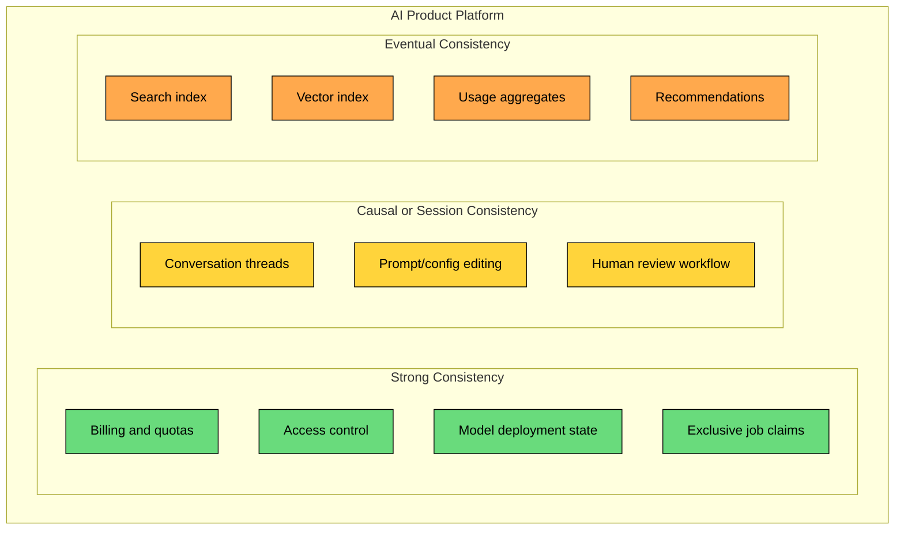

Using linearizability everywhere would make the system slower and more expensive than necessary. Using eventual consistency everywhere would push correctness bugs into application code. Good system design puts strong guarantees on the small set of state that protects invariants and uses weaker guarantees where lag is acceptable.

#### Practical Review Checklist

Before choosing or approving a consistency model, answer these questions:

1. What is the source of truth"
2. Which reads must observe an acknowledged write"
3. Is the guarantee global, regional, per partition, per session, or per object"
4. What happens during a network partition or regional outage"
5. Can two writers update the same item concurrently"
6. If conflicts happen, who resolves them and how is data loss avoided"
7. What staleness is acceptable, and how is it measured"
8. Does the UI need pending, syncing, or freshness indicators"
9. Are caches, search indexes, vector indexes, and analytics stores clearly marked as derived data"
10. Do tests cover stale reads, reordered events, retries, duplicate delivery, and failover"

---

# Summary

Consistency models define what values reads may return after writes occur.

Key takeaways:

1. **Consistency is a contract, not a feeling.** Define the exact guarantee for each operation.
2. **Linearizability protects single-object freshness.** Later reads must observe earlier completed writes.
3. **Strict serializability protects transactional invariants.** It is the right target for money, scarce inventory, and multi-row correctness.
4. **Eventual consistency only promises convergence.** It does not promise bounded lag, durability, read-your-writes, or conflict semantics.
5. **Causal consistency preserves cause and effect.** It is useful for conversations, feeds, collaboration, and threaded workflows.
6. **Session guarantees improve user experience.** Read-your-writes and monotonic reads prevent users from seeing their own data move backward.
7. **Modern systems mix models.** Strong consistency belongs on the source of truth for invariants; weaker consistency fits caches, search, vector indexes, recommendations, and analytics.
8. **Naming the model is the easy part.** The difficult work is identifying which failures the application can tolerate and which ones must be made impossible.

Choose the weakest consistency model that still protects correctness. Then measure the gaps it leaves: replication lag, consumer lag, cache age, conflict rate, stale reads, and failover behavior.

---

# Quiz
