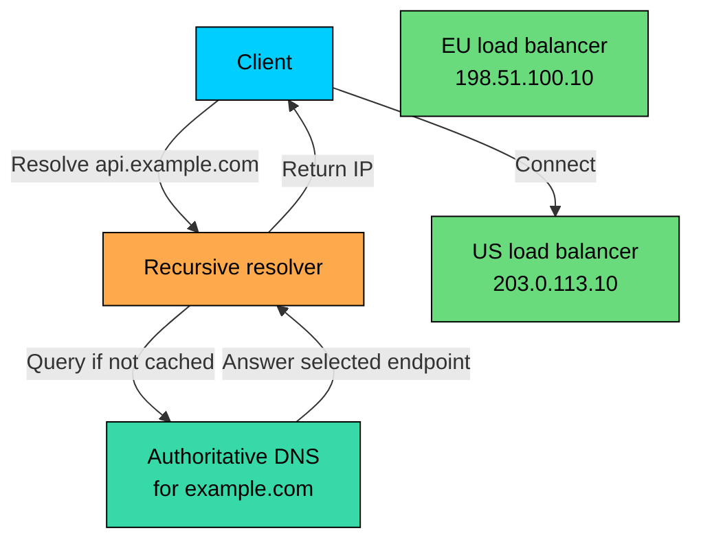
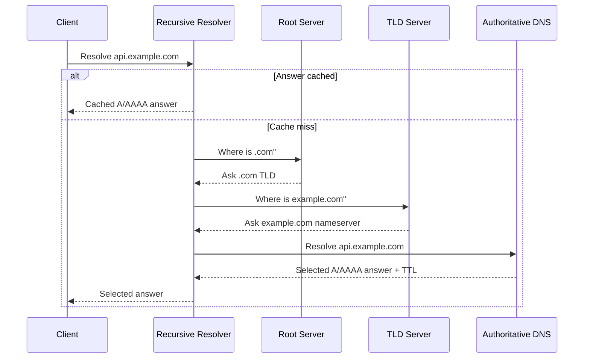
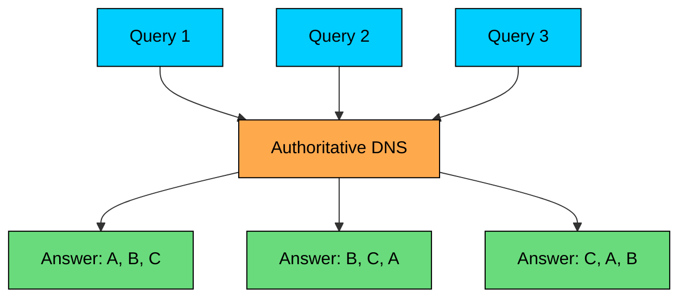
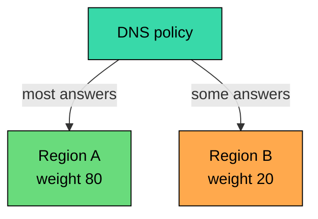
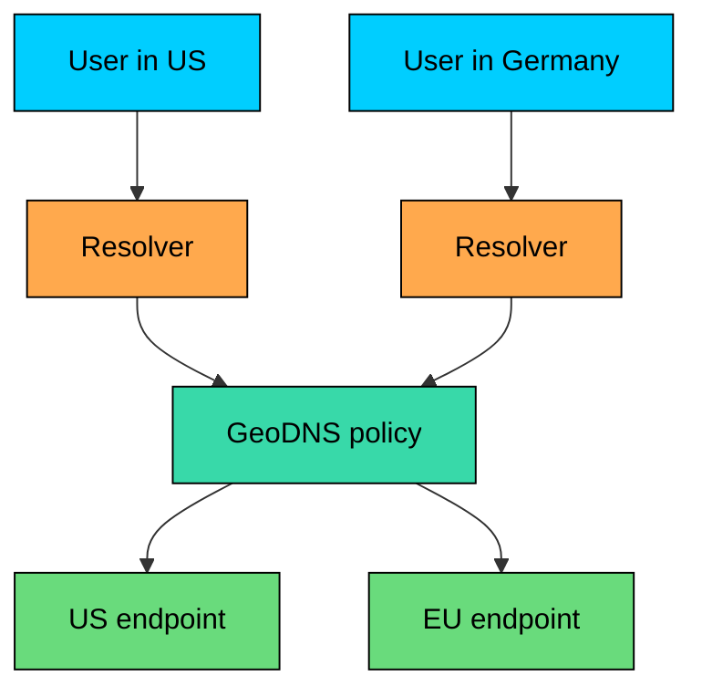
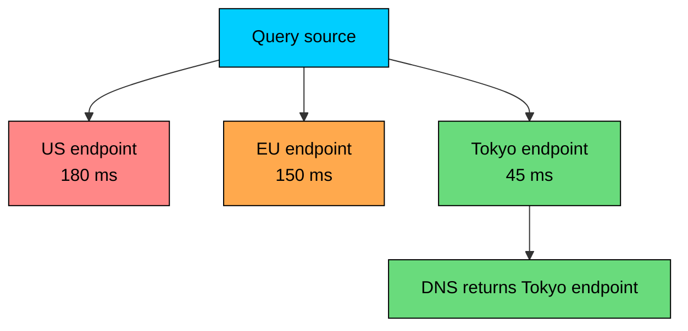
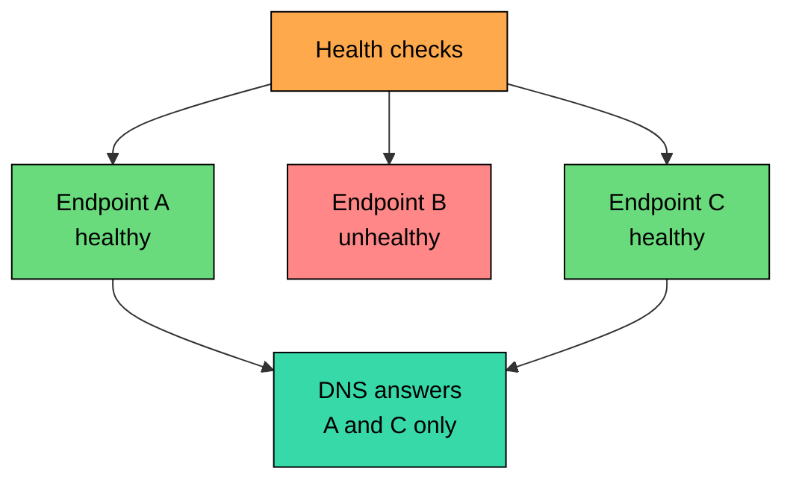
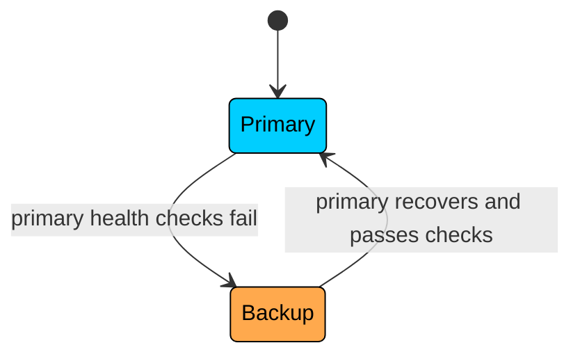
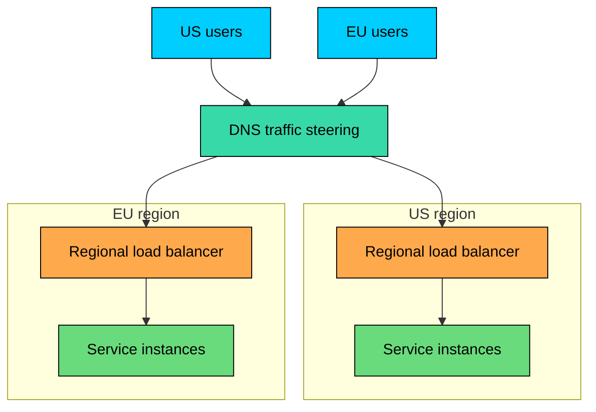
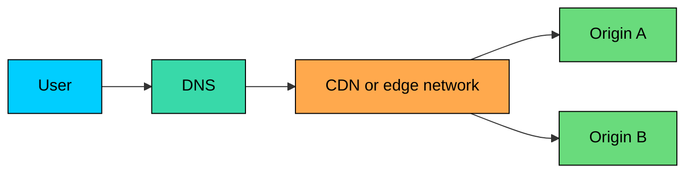

**DNS load balancing** steers clients by returning different DNS answers for the same hostname. The authoritative DNS service can pick an address based on health, weight, geography, latency, or failover state.

Because it works before any TCP, TLS, or HTTP connection opens, DNS is well suited to regional routing, gradual migrations, and disaster recovery. It is also coarse: answers get cached by resolvers and clients, and DNS has no view of per-request load on the servers it points to.

---

# 1. What DNS Load Balancing Does

> [!PAYWALL] This content is for premium members only.

A common deployment uses one hostname in front of regional infrastructure. `api.example.com` might resolve to a US load balancer for some clients and a European load balancer for others, depending on where the resolver is and what policy the DNS provider applies.

The DNS service can choose answers using several inputs:

- Static record sets
- Weights
- Health checks
- The resolver's source IP
- EDNS Client Subnet, if present
- Geographic rules
- Provider latency measurements
- Manual failover or traffic shift settings

The decision happens at DNS resolution time. After the client receives an IP address, normal networking takes over.

### 1.1 DNS Load Balancing Is Usually Regional

DNS is best used for coarse routing:

- Send North American users to a North American region.
- Send European users to a European region.
- Shift 10% of traffic to a new deployment.
- Fail over from a primary region to a standby region.
- Return only healthy regional entry points.

Inside each region, use a real load balancer, gateway, service mesh, or application router for request-level decisions.

### 1.2 DNS Does Not Route Individual Requests

DNS answers are cached by recursive resolvers, operating systems, browsers, and sometimes application runtimes. One DNS lookup can affect many later connections.

That means DNS cannot reliably make per-request decisions such as:

- Which server has the fewest active connections"
- Which instance has the warmest cache"
- Which GPU worker has capacity for this model"
- Which backend should handle this authenticated user"
- Which path should this HTTP request take"

Those decisions belong behind the returned address, usually in an application load balancer, API gateway, CDN edge, or service-level router.

---

# 2. How DNS Resolution Fits In

Before DNS load balancing makes sense, it is worth being precise about who talks to whom.

Most clients do not query your authoritative DNS server directly. They ask a **recursive resolver**, such as an ISP resolver, an enterprise resolver, Cloudflare `1.1.1.1`, Google Public DNS `8.8.8.8`, or a resolver inside a cloud VPC.

If the recursive resolver has a cached answer, it returns that answer without asking your authoritative DNS server again.

The load-balancing decision normally happens at the authoritative DNS layer, but only on cache misses.

That single detail explains most DNS load-balancing surprises.

---

# 3. DNS Records Used for Traffic Steering

DNS load balancing commonly uses these record types:

| Record Type | Use |
|-------------|-----|
| **A** | Returns one or more IPv4 addresses |
| **AAAA** | Returns one or more IPv6 addresses |
| **CNAME** | Points one hostname at another hostname |
| **ALIAS/ANAME** | Provider-specific apex-friendly aliasing to another target |
| **HTTPS/SVCB** | Newer service-binding records that can advertise endpoint and protocol hints |

Most production setups expose a hostname that resolves to one of these:

- A regional load balancer
- A CDN or edge provider hostname
- A global accelerator
- A service gateway
- A failover endpoint

Avoid returning individual application instance IPs unless the application is very simple. Instances change, fail, scale in, and move. DNS is a poor place to manage per-instance churn.

### 3.1 Multiple A Records Are Not a Full Load Balancer

The simplest configuration returns several addresses for one name:

This can spread traffic roughly over time, but it has weak guarantees.

Recursive resolvers may cache and reuse the full answer set. Clients may choose the first address, randomize addresses, race IPv4 and IPv6, or retry in their own order. A single large resolver can send many users to the same answer until the TTL expires.

Use this for simple distribution, not precise balancing.

---

# 4. TTL: The Control You Have, and the Control You Do Not

**Time To Live (TTL)** tells resolvers how long an answer may be cached.

This record has a TTL of 60 seconds. A resolver that receives the answer can serve it from cache for up to 60 seconds.

TTL is the main trade-off in DNS load balancing:

| TTL | Behavior | Trade-off |
|-----|----------|-----------|
| **30-60 seconds** | Faster traffic shifts and failover | More DNS query volume; still not instant |
| **300-600 seconds** | Lower DNS overhead | Slower failover and migrations |
| **3600+ seconds** | Very cache-friendly | Poor fit for active traffic steering |

> 💡 **Key Insight:**

> **TRADEOFF**
>
> A lower TTL gives the DNS service more chances to adjust future answers. It does not update answers that clients and resolvers already cached.

In practice, a TTL of 60 seconds is common for actively steered production traffic. Static records and stable infrastructure can use longer TTLs.

### 4.1 Low TTL Is Not Instant Failover

Consider a DNS provider that stops returning a failed endpoint at 12:00:00. Clients that already cached the failed IP may keep using it until their cache expires. Some resolvers and clients also impose minimum caching behavior. Mobile networks, enterprise resolvers, and application runtimes can add more delay.

DNS failover should be treated as **eventual traffic shift**, not immediate connection failover.

---

# 5. Traffic Steering Strategies

DNS providers expose different names for these policies, but the underlying ideas are consistent.

### 5.1 Round-Robin

Round-robin DNS returns all configured records but rotates the order on each response. The resolver typically forwards the full list, and the client usually connects to the first address it sees.

Round-robin is simple, cheap, and widely supported. It is also blind to health, geography, capacity, and cached answer reuse unless your DNS provider adds those features around it.

Use it for non-critical services, homogeneous endpoints, internal tools, and cases where rough distribution is enough.

### 5.2 Weighted Routing

Weighted routing returns answers in configured proportions.

This is useful for:

- Canary releases
- Gradual migrations
- Sending small traffic to a new region
- Compensating for different endpoint capacities
- Active-active deployments with planned traffic ratios

The observed traffic ratio will not be exact over short windows because resolvers cache answers and clients vary in request volume. A few large recursive resolvers can skew the numbers.

### 5.3 Geolocation Routing

Geolocation routing maps a DNS query to a region based on the resolver IP or EDNS Client Subnet.

Geolocation is useful for:

- Regional latency reduction
- Data residency routing
- Licensed content distribution
- Country-specific defaults
- Routing users to nearby support infrastructure

It is not exact. IP geolocation can be wrong. The DNS provider may see the resolver's location, not the user's location. EDNS Client Subnet can improve accuracy, but support is uneven and it has privacy trade-offs.

### 5.4 Latency-Based or Performance Routing

Latency-based routing chooses an endpoint using provider measurements or historical network performance data.

This is often better than pure geography. A user in one country may have a faster network path to a neighboring country's region because of peering, submarine cable paths, or ISP routing policy.

The limitation is the same: DNS chooses an address before the request. It does not measure the latency of this exact connection at this exact moment.

### 5.5 Health-Based Routing

Health-based routing removes unhealthy endpoints from future DNS answers.

Common checks include:

| Check Type | What It Proves | What It Misses |
|------------|----------------|----------------|
| **TCP** | Port accepts connections | Application may still be broken |
| **HTTP/HTTPS** | Endpoint returns an expected response | Downstream dependency may fail later |
| **Custom health endpoint** | Application-specific readiness | Only as good as the endpoint design |
| **Calculated health** | Aggregates several signals | More complex to operate correctly |

Health checks need hysteresis. Withdraw quickly for clear failure, but require enough successful checks before reintroducing an endpoint. Otherwise DNS can flap between healthy and unhealthy answers.

### 5.6 Failover Routing

Failover routing returns primary endpoints during normal operation and backup endpoints when the primary is unhealthy.

Failover routing is common for disaster recovery, but it works only if the backup can actually serve production traffic. Test it. Warm it. Keep data replication and secrets current. A DNS failover to an empty standby is not high availability.

---

# 6. Production Architectures

### 6.1 DNS Plus Regional Load Balancers

The most common pattern is layered:

1. DNS routes the user to a region or edge provider.
2. A regional load balancer distributes connections across healthy instances.
3. The application tier handles request-level routing, sessions, and retries.

DNS handles the global decision. The regional load balancer handles connection-level and instance-level decisions.

### 6.2 Active-Active Multi-Region

In active-active, multiple regions receive production traffic at the same time.

DNS can steer traffic by geography, latency, or weight. Each region must be sized for its normal share plus a planned failover share.

Active-active is useful when:

- Users are globally distributed.
- The application can run independently in multiple regions.
- Data replication and conflict handling are designed.
- Failover traffic can be absorbed without manual provisioning.

Do not choose active-active just because it sounds resilient. Multi-region writes, cache invalidation, identity, rate limits, and observability all become harder.

### 6.3 Active-Passive Disaster Recovery

In active-passive, one region serves traffic and another region waits as standby.

This works well for systems with a clear primary region and a tested recovery plan. It works poorly when the standby is cold, lacks current data, or depends on manual steps that only one person knows.

### 6.4 DNS Plus CDN or Edge Network

Many systems use DNS to point users at a CDN or edge provider. The CDN may then use anycast, its own routing system, origin selection, and health checks.

In this architecture, DNS usually selects the edge provider or edge hostname. The edge platform handles many of the later decisions.

### 6.5 AI Inference Front Doors

For AI inference platforms, DNS is well suited to one specific job: picking the right regional API endpoint based on the user's location and any data residency constraints. A European user should resolve to the European inference cluster, both for latency and for compliance.

What DNS cannot do here is choose which model server, GPU pool, or queue actually serves the request. Those decisions depend on signals that change second-to-second and belong to the inference gateway behind the resolved address.

---

# 7. Managed Provider Features

Managed DNS providers expose these ideas under different names.

### 7.1 Amazon Route 53

Route 53 supports several routing policies, including simple, weighted, latency, failover, geolocation, geoproximity, IP-based routing, and multivalue answer routing.

Multivalue answer routing can return multiple healthy records. Weighted routing supports canaries and traffic shifts. Latency routing is based on AWS latency data, so it is most accurate when the targets are in AWS Regions.

### 7.2 Cloudflare Load Balancing

Cloudflare Load Balancing combines DNS responses, pools, monitors, and steering policies. Current steering options include standard steering, geo steering, dynamic steering, proximity steering, and least outstanding requests for supported configurations.

Cloudflare can also use EDNS Client Subnet for DNS-only load balancers when configured, which matters for location-based steering.

### 7.3 Google Cloud DNS

Google Cloud DNS supports routing policies such as weighted round robin, geolocation, and failover. Health checks can be used with supported internal load balancers and external endpoints.

The exact feature set changes over time. Treat provider documentation as the source of truth before designing around a specific policy.

---

# 8. Limitations and Failure Modes

### 8.1 Cached Answers Outlive Your Decision

DNS answers persist in caches until TTL expiry. During an incident, that means some clients may continue using a failed endpoint even after your authoritative DNS stops returning it.

Applications still need retries, connection timeouts, and failover behavior.

### 8.2 Resolver Location Can Mislead Geo Routing

Without EDNS Client Subnet, your DNS provider often sees the resolver location, not the user's exact location.

A user in one country using a public resolver or enterprise resolver may be mapped differently from what you expect. Some resolvers intentionally avoid sending ECS for privacy.

Design geo rules with defaults and fallback behavior. Do not assume country-level precision for every query.

### 8.3 Health Checks Can Be Too Shallow

A `/health` endpoint that returns `200 OK` while the database is unavailable is not a useful signal.

Good health checks distinguish:

- Process is alive
- Listener is accepting requests
- Critical dependencies are reachable
- The endpoint has enough capacity to accept new traffic
- The region should remain in rotation

Health checks should be cheap and reliable, but not meaningless.

### 8.4 DNS Cannot Drain Existing Connections

Changing DNS answers affects future resolutions. It does not close or move existing connections.

For graceful maintenance, combine DNS traffic shifts with:

- Connection draining on regional load balancers
- Application shutdown hooks
- Retry-safe clients
- Idempotent writes
- Clear maintenance runbooks

### 8.5 Weighted DNS Is Not Exact Traffic Splitting

If you set weights to 90/10, do not expect exactly 10% of user requests to hit the new region.

DNS weights apply to DNS answers, not HTTP requests. A resolver can cache one answer and serve it to many clients. One enterprise customer can generate more traffic than thousands of consumer clients. Short test windows can be noisy.

Use application metrics to validate the real traffic split.

---

# 9. When to Use DNS Load Balancing

### 9.1 Good Fit

DNS load balancing is a good fit when you need coarse traffic steering across stable entry points.

| Use Case | Why DNS Load Balancing Fits |
|----------|-----------------------------|
| **Multi-region applications** | Send users to regional front doors |
| **Disaster recovery** | Move future DNS answers to standby endpoints |
| **Gradual migrations** | Shift traffic with weighted policies |
| **Regional compliance** | Keep users in approved jurisdictions when possible |
| **CDN or origin steering** | Select edge or origin pools before connection |
| **AI API front doors** | Route users to the right regional gateway before deeper scheduling |

### 9.2 Poor Fit

Use something else when decisions must happen per request, per connection, or with tight failover guarantees.

| Need | Better Tool |
|------|-------------|
| **Sub-second failover** | Regional load balancer with health checks, or client retry logic |
| **Least-connections balancing** | Application or L4/L7 load balancer |
| **Path/header-based routing** | API gateway, reverse proxy, or service mesh |
| **Session affinity** | Application load balancer or application-level session design |
| **WebSocket connection management** | L4/L7 load balancer with draining and health checks |
| **GPU/model-aware routing** | Inference gateway or scheduler |

### 9.3 Practical Rules

1. Use DNS for global or regional steering.
2. Use load balancers for connection and request distribution.
3. Keep TTLs low only where active steering is needed.
4. Put health checks on every endpoint that DNS may return.
5. Test failover under real client and resolver behavior.
6. Track DNS answers, endpoint health, and application traffic together.
7. Keep a default answer for geolocation misses.
8. Design clients to retry safely.

---

# Summary

DNS load balancing steers clients by changing DNS answers. It is valuable for global distribution, regional failover, weighted migrations, and stable front doors.

It is not precise request routing. DNS decisions are cached, resolver-centered, and made before the application sees traffic.

#### **Key takeaways:**

1. **DNS load balancing happens at resolution time.** The authoritative DNS service chooses an answer when a resolver asks for one.
2. **Recursive resolvers and clients cache answers.** TTL controls freshness, but it does not guarantee instant failover.
3. **Round-robin is rough distribution, not real load awareness.** Caching and client behavior can skew traffic.
4. **Geo routing depends on resolver location and ECS.** It needs safe defaults and realistic expectations.
5. **Latency-based routing is useful but approximate.** It uses provider measurements, not perfect live knowledge of every connection.
6. **Health checks only affect future answers.** Existing cached clients may still hit failed endpoints.
7. **Layer the design.** DNS should choose a region or front door; regional load balancers and gateways should handle connection and request-level decisions.
8. **Modern AI systems should use DNS only for the first regional decision.** Model placement, GPU capacity, queues, quotas, and data policy belong behind the gateway.

DNS load balancing is a practical control plane for distributed systems. Treat it as coarse steering, pair it with stronger runtime routing, and it becomes reliable instead of surprising.

---

# Quiz
