**Anycast routing** lets multiple locations advertise the same IP prefix. The internet routes each client toward one reachable instance based on BGP path selection, not a central decision maker.

That makes anycast a strong fit for stable global entry points: public DNS resolvers, CDN edges, DDoS scrubbing, and API front doors. BGP routing is a network-layer decision, though. It has no view of server load, and "nearest" means topologically preferred along the chosen path rather than physically closest.

---

# 1. IP Addressing Models

Before anycast makes sense, it helps to compare it with the other common IP delivery models.

### 1.1 Unicast: One Sender to One Destination

**Unicast** is the normal model for most network traffic. One destination IP address identifies one reachable endpoint, or one load balancer VIP, at a particular place in the network.

When a browser connects to an application server, it usually uses unicast.

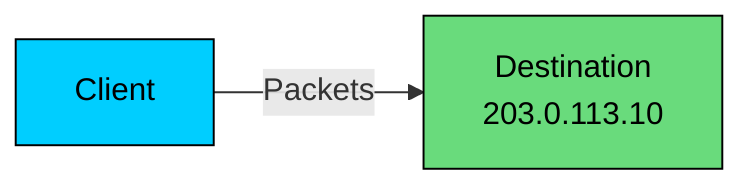

### 1.2 Broadcast: One Sender to Everyone on a Local Segment

**Broadcast** sends traffic to every host on the local network segment. It is useful for local discovery protocols such as ARP and DHCP, but routers do not forward general broadcast traffic across the internet.

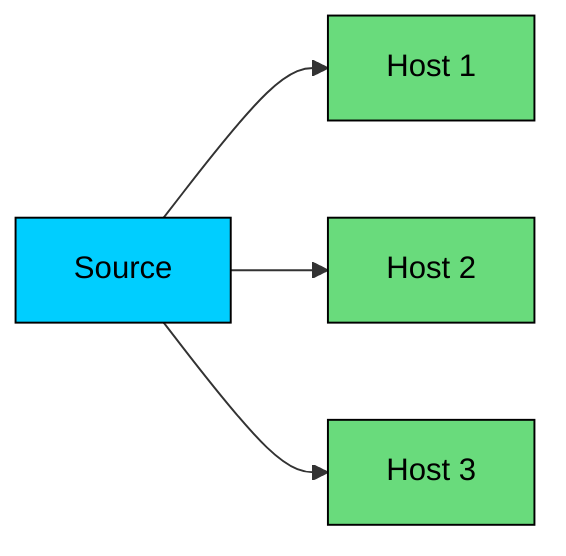

### 1.3 Multicast: One Sender to a Group

**Multicast** delivers packets to receivers that joined a multicast group. It is used in some controlled networks for media distribution, market data, and infrastructure protocols. It is not the default way public internet applications reach users.

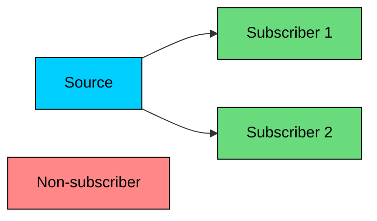

### 1.4 Anycast: One Address, Multiple Reachable Instances

With anycast, multiple locations advertise the same IP prefix, and the client's network picks one path based on BGP. From the client's point of view, it is sending packets to a single address. From the routing layer's point of view, that address has many possible origins.

Anycast is sometimes described as routing to the "nearest" server. More precisely, it routes to the **best BGP path** from that part of the internet. That often correlates with low latency, but not always.

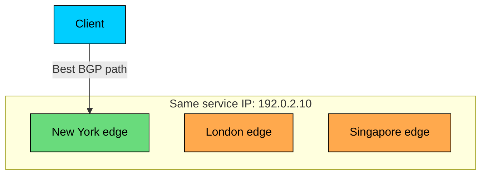

The important difference is who makes the first routing decision:

| Model | Delivery Pattern | Decision Point | Common Use |
|-------|------------------|----------------|------------|
| **Unicast** | One address to one endpoint | Normal routing to one prefix origin | Web traffic, APIs, databases |
| **Broadcast** | One sender to all local hosts | Local network segment | ARP, DHCP |
| **Multicast** | One sender to subscribed receivers | Multicast routing and group membership | Controlled media or data distribution |
| **Anycast** | One address to one of many instances | BGP route selection | DNS, CDN edges, DDoS scrubbing, global entry points |

---

# 2. How Anycast Works

> [!PAYWALL] This content is for premium members only.

Anycast usually works through **BGP**, the routing protocol used by autonomous systems on the internet.

An autonomous system, or **AS**, is a network under one administrative control: an ISP, cloud provider, CDN, large enterprise, or internet exchange participant. BGP lets these networks announce which IP prefixes they can reach.

### 2.1 BGP Announces Prefixes, Not Individual Servers

BGP does not normally advertise "server A" or "server B." It advertises IP prefixes such as `192.0.2.0/24`.

When a router receives traffic for `192.0.2.10`, it looks for the most specific matching prefix in its routing table and forwards the packet toward the selected next hop.

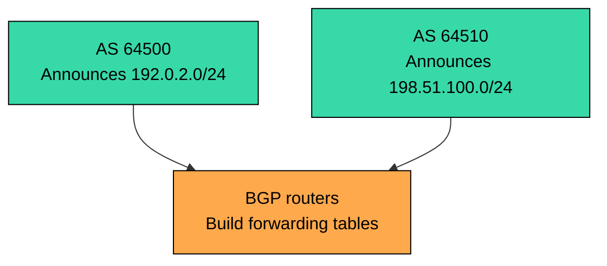

With anycast, several locations announce the same prefix.

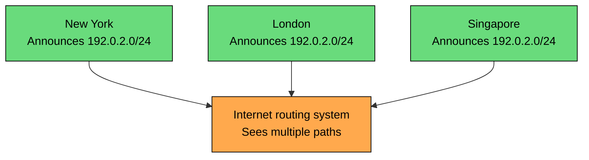

Each client-side network chooses one path. A user in Paris may reach London. A user in Tokyo may reach Singapore. A user in Brazil may reach Sao Paulo, Miami, or somewhere else depending on peering and routing policy.

### 2.2 How Routers Choose a Path

BGP path selection is policy-driven. Different vendors expose slightly different knobs, but the practical inputs include:

- Local preference set by the network operator
- AS path length
- Origin type
- Multi-Exit Discriminator, or MED
- eBGP versus iBGP
- IGP cost to the next hop
- Tie-breakers such as router ID

For application designers, the lesson is simpler:

**Anycast chooses a network path, not an application target.**

It does not look at CPU, queue depth, database lag, GPU availability, cache hit rate, or request type. If a location is announced and reachable, BGP may continue sending traffic there even when the application is unhealthy unless you withdraw or de-preference the route.

Another network may choose a different path to the same anycast prefix.

### 2.3 Health and Route Withdrawal

Production anycast depends on health-aware routing.

If an edge location is healthy, it advertises the anycast prefix. If the location cannot serve traffic, it should withdraw the route or advertise it with a less preferred policy.

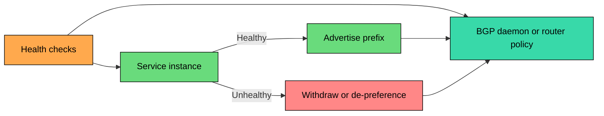

This is where many poor anycast deployments fail. A router can be alive while the service behind it is broken. Health checks must test the path that matters: listener readiness, dependency reachability, local load balancer state, and enough capacity to accept new traffic.

### 2.4 Failover Is Automatic, but Not Instant

When a location withdraws a route, nearby routers recalculate their best path. Traffic shifts to another location after BGP reconverges.

That failover is automatic, but the timing is not guaranteed. Inside a well-run provider network, detection and steering may happen in seconds. Across the public internet, convergence can take longer because many networks apply their own policies, filters, route flap damping, and timers.

BFD can detect link or neighbor failure quickly, but BFD does not make the entire internet converge instantly. Treat "seconds to minutes" as the honest operational range unless you control the full path.

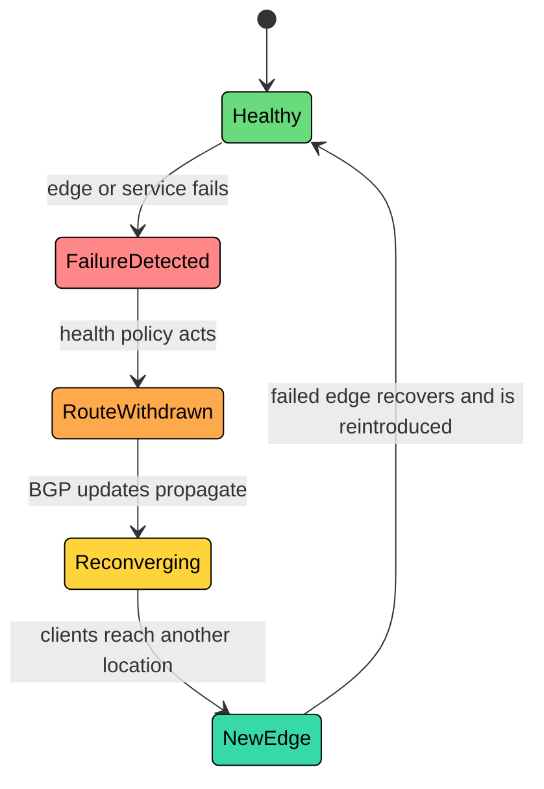

---

# 3. What Anycast Is Good At

Anycast works best when the service can tolerate being served from any healthy instance.

### 3.1 Lower Network Latency

For globally distributed users, anycast can reduce round-trip time by keeping traffic near the user at the network edge.

The exact numbers depend on peering and geography, but the architectural point is clear: a nearby network entry point avoids long-haul internet paths for latency-sensitive work.

For DNS, that matters because DNS resolution sits before the application request. For API and AI inference platforms, it matters because the edge can terminate TLS, enforce policy, absorb attacks, and route the request over a more predictable backbone to the right regional backend.

### 3.2 Resilience Without DNS TTL Dependence

DNS-based failover is limited by caching. Even with a low TTL, recursive resolvers and clients may keep stale answers longer than you expect.

Anycast failover happens at the routing layer. The client keeps using the same IP address, while the network selects a new reachable path after route withdrawal.

That makes anycast useful for fixed infrastructure addresses:

- Public DNS resolvers
- Authoritative DNS servers
- CDN edge VIPs
- DDoS scrubbing entry points
- Static global application entry points

### 3.3 DDoS Absorption

Anycast helps with DDoS because attack traffic from a distributed botnet tends to enter the provider network at many edge locations instead of concentrating on one data center.

This helps, but distribution is not perfectly even. A large source region or a badly placed peering relationship can still overload one site. Anycast buys time and surface area; scrubbing capacity, filtering, rate limiting, and operational response still matter.

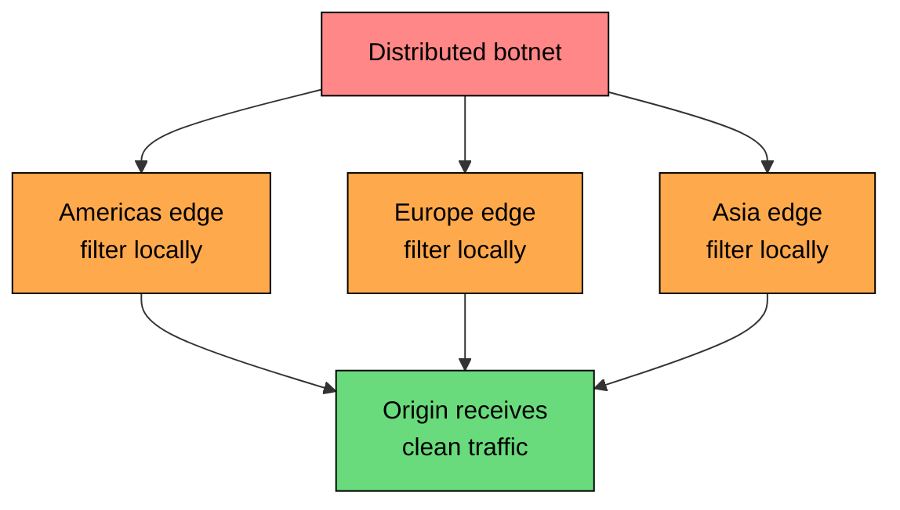

### 3.4 Simple Client Configuration

Anycast keeps client configuration stable.

For example, a user can configure a DNS resolver once:

The client does not need to know how many cities, servers, or failover paths exist behind that address.

That simplicity is valuable for infrastructure services where configuration changes are slow, risky, or impossible to force across all clients.

---

# 4. Common Use Cases

### 4.1 DNS

DNS is the classic anycast use case.

DNS queries are usually short, independent, and latency-sensitive. If one DNS instance fails, the next query can go somewhere else without preserving application session state.

The DNS root server system is built this way. There are 13 root server identities, but each identity is served from many physical instances around the world. The live count changes as operators add or remove sites; recent root-servers.org data puts the system at more than 1,900 instances operated by 12 independent root server operators.

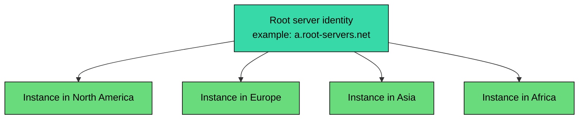

Public recursive resolvers use the same pattern. Cloudflare's `1.1.1.1` is served from Cloudflare's global anycast network, which Cloudflare currently describes as spanning 330+ cities. Google Public DNS and Quad9 also use anycast.

### 4.2 CDNs and Edge Platforms

CDNs often use anycast to get users to an edge location, then use local load balancing and application routing inside that location.

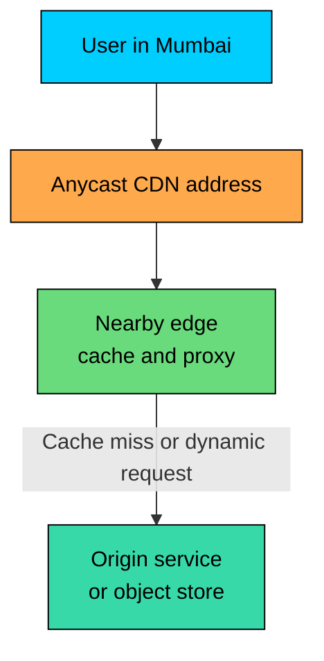

The anycast decision gets the request to an edge. The CDN still needs normal application machinery: cache keys, health checks, request routing, WAF rules, origin failover, and observability.

### 4.3 DDoS Scrubbing

DDoS providers advertise protected prefixes from many scrubbing centers. Malicious traffic is pulled into the nearest available scrubbing location, filtered, and forwarded to the origin or dropped.

The customer's origin should not be directly reachable from the internet during an attack. If attackers can bypass the scrubbing network and hit the origin IP directly, anycast protection loses much of its value.

### 4.4 Global API Entry Points

Some API platforms expose an anycast front door. The edge terminates TLS, validates requests, applies rate limits, and forwards traffic to the appropriate regional service.

This is useful when:

- Clients need stable IP allowlists.
- Users are global.
- Most connections are short-lived or retryable.
- The platform can route from the edge to healthy regional backends.

AWS Global Accelerator is a managed example. It provides static anycast IP addresses at the edge and routes traffic to configured regional endpoints such as load balancers, EC2 instances, or Elastic IPs.

### 4.5 AI Inference Gateways

Anycast is most useful for the first hop into an AI platform: getting the client onto the provider's backbone quickly, terminating TLS, and giving customers a stable IP for allowlists.

The trap is assuming "nearest edge" should also pick the GPU. The topologically nearest cluster may not have the requested model loaded, may already be saturated, or may be in a region that cannot legally process this user's data. Treat the anycast address as the entry point; let the inference gateway behind it handle backend selection.

---

# 5. Production Architectures

### 5.1 Basic Anycast Deployment

A basic anycast deployment has service instances in multiple locations and announces the same prefix from each location.

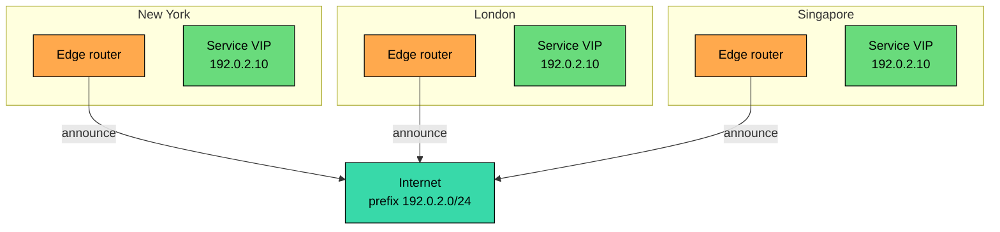

Common requirements:

- Address space that can be advertised globally
- BGP connectivity at each location
- Route filters, RPKI, and prefix origin controls
- Service instances or local load balancers bound to the anycast VIP
- Health checks that control route advertisement
- Observability from many external vantage points

Most networks will not accept IPv4 routes longer than `/24` on the public internet. For IPv6, `/48` is a common practical boundary. Provider policies vary, so this must be verified with transit and peering partners.

### 5.2 Anycast with Local Load Balancing

At real scale, a location does not send all traffic to one server. The anycast route gets packets to the site; local load balancing spreads traffic within the site.

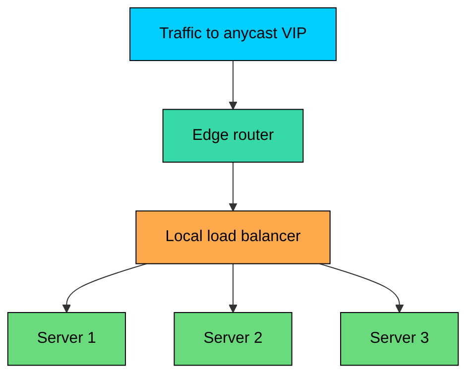

The local load balancer can make decisions that BGP cannot: active connection count, request class, cache state, server health, and overload protection.

### 5.3 Anycast Plus Unicast Handoff

For stateful or long-lived work, many systems use anycast only for discovery or connection setup, then hand the client to a stable unicast endpoint.

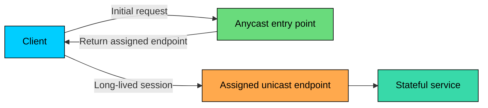

This pattern is common when the initial route should be global and simple, but the actual session needs stable affinity.

---

# 6. TCP, UDP, and QUIC

Anycast is most comfortable with stateless or short-lived traffic. Protocol behavior matters.

### 6.1 UDP

UDP works well with anycast when each request can stand alone.

DNS over UDP is the standard example. If a route changes between two DNS queries, the client usually does not care. The next query can be answered by another instance.

UDP does not automatically mean safe. If the application has multi-packet sessions, large fragmented payloads, or server-local state, it needs the same care as any other stateful protocol.

### 6.2 TCP

TCP connections are tied to connection state on both endpoints. If packets from an established TCP connection suddenly arrive at a different server, that server will not know the connection and may send a reset.

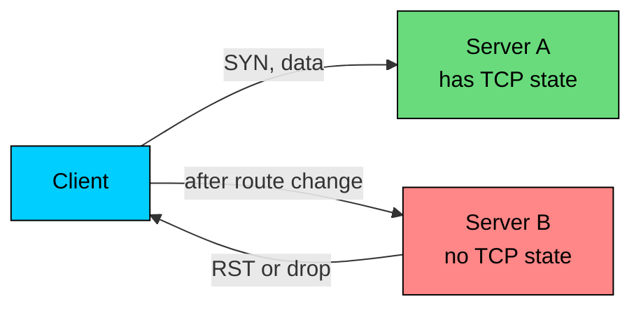

TCP over anycast still works in many production systems because routes are usually stable long enough for short requests to finish. It is common for CDN edges, HTTPS APIs, and DNS over TCP.

It is risky for:

- SSH sessions
- Long uploads
- Long downloads without resume support
- WebSocket connections
- Database connections
- Stateful internal service connections

Applications using TCP over anycast should assume occasional connection resets and implement retries, idempotency, and resumable operations where appropriate.

### 6.3 QUIC

QUIC, used by HTTP/3, identifies connections with connection IDs rather than only the four-tuple of source IP, source port, destination IP, and destination port. That helps with client network changes and connection migration.

It does not automatically make anycast state-free.

If a route change sends packets to a different edge, that edge still needs a way to handle the connection: shared state, routable connection IDs, forwarding to the original owner, or a clean retry path. Large providers design for this. A simple deployment should not assume QUIC removes all anycast session problems.

---

# 7. Operational Challenges

### 7.1 Anycast Is Hard to Debug

With unicast, a failing IP usually points to a known place. With anycast, the same IP may land in different cities for different users.

When someone reports "the API is failing from Brazil," the investigation has to cover more than the service. It has to identify the edge location, the chosen route, the client's ISP, and any recent BGP changes along the path.

Useful practices:

- Include edge identity in response headers for safe responses, such as `X-Edge-Location`.
- Log edge location, request ID, client ASN, and selected backend.
- Monitor from external probes in many regions and ASNs.
- Keep BGP update history and route visibility.
- Use traceroute, RIPE Atlas, RouteViews, or provider routing tools during incidents.

### 7.2 Load Is Often Uneven

BGP does not balance traffic evenly. A location connected to a large ISP or internet exchange may receive far more traffic than another location with the same advertised prefix.

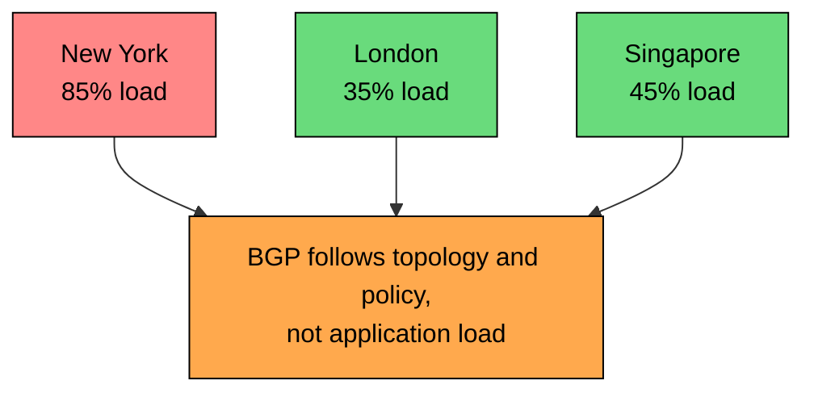

Operators can influence traffic with communities, prepending, selective advertisements, traffic engineering, and managed provider controls. They cannot precisely assign every user to a specific site through BGP alone.

### 7.3 Route Flapping Can Be Worse Than Failure

Withdrawing a bad site is good. Repeatedly withdrawing and re-announcing it is dangerous.

Route flapping causes instability, connection resets, and unpredictable client experience. Some networks may also dampen unstable routes.

Health policies need hysteresis:

- Require several successful checks before re-advertising.
- Withdraw quickly for hard failure, but reintroduce gradually.
- Separate "degraded" from "dead."
- Drain traffic before maintenance when possible.

### 7.4 Security and Route Hygiene Matter

Anycast depends on global routing. A route leak or hijack can send traffic to the wrong network.

Production deployments should use:

- RPKI Route Origin Authorizations where possible
- Strict prefix filters with transit providers
- BGP monitoring for unexpected origins
- Provider coordination for incident response
- Separate management paths that do not depend on the anycast service itself

BGP hijacks and route leaks happen regularly. Past incidents such as the 2008 YouTube hijack and the 2018 Amazon Route 53 hijack show that routing security is not theoretical. Critical services need visibility into how their prefixes are seen from the outside.

### 7.5 Running Your Own Anycast Is Expensive

Building an anycast network requires more than servers in multiple regions.

You need address space, routers or routing software, transit or peering, operations coverage, routing expertise, health integration, and external monitoring. You also need people who understand failure modes at 3 a.m.

Many teams should use a managed service instead:

- Cloudflare, Fastly, Akamai, and other edge providers for CDN and security use cases
- AWS Global Accelerator for AWS-hosted regional applications
- Cloud provider load balancing products with global front doors
- Managed DNS providers for authoritative or recursive DNS

Owning the full anycast stack makes sense when routing behavior is core to the business or the scale justifies the operational cost.

---

# 8. Anycast vs DNS Load Balancing

Anycast and DNS load balancing solve different parts of global routing.

| Factor | Anycast | DNS Load Balancing |
|--------|---------|--------------------|
| **Decision layer** | Network routing | DNS response |
| **Client-facing address** | Same IP from many places | Different IPs may be returned |
| **Failover dependency** | BGP convergence | DNS TTL and cache behavior |
| **Traffic control** | Coarse, policy-driven | More explicit by region, weight, or health |
| **Load awareness** | Not by default | Possible through DNS provider logic |
| **Stateful sessions** | Requires care | Easier to keep region affinity |
| **DDoS absorption** | Strong fit | Limited by where traffic lands after DNS |
| **Operational complexity** | High if self-managed | Lower with a managed DNS provider |

Use anycast when the entry point must be stable, global, low-latency, and resilient without relying on DNS changes.

Use DNS load balancing when you need explicit control over which regional endpoint a client receives, gradual migrations, customer-specific routing, or simpler operations.

Large systems often use both: DNS maps a hostname to a provider or service, and anycast handles the network path to the edge.

---

# 9. When to Use Anycast

### 9.1 Good Fit

Anycast is a good fit when most of these are true:

- Users are geographically distributed.
- The service is stateless, short-lived, or retry-friendly.
- Low first-hop latency matters.
- The same IP address should work globally.
- Failover should not depend on clients refreshing DNS.
- The team has routing expertise or uses a managed provider.

Common examples:

| Use Case | Why It Fits |
|----------|-------------|
| **DNS resolvers and authoritative DNS** | Small, independent requests; low latency matters |
| **CDN edges** | Edge can cache, proxy, and fail over |
| **DDoS scrubbing** | Attack traffic can be absorbed across many sites |
| **NTP and time services** | Short requests; latency-sensitive infrastructure |
| **Global API front doors** | Stable IPs, TLS termination, policy enforcement |
| **AI inference gateways** | Fast client ingress before routing to the right regional backend |

### 9.2 Poor Fit

Anycast is a poor fit when the application needs stable server affinity and cannot tolerate resets or retries.

| Use Case | Problem |
|----------|---------|
| **Database connections** | Long-lived state and transaction context |
| **SSH or admin sessions** | Route changes interrupt operators |
| **Large uploads without resume** | Mid-transfer route changes may lose progress |
| **Stateful WebSocket services** | Persistent connection tied to one server |
| **Region-bound workloads** | Compliance or data residency may override topological proximity |
| **GPU-heavy inference backends directly exposed** | Capacity and model placement matter more than nearest route |

### 9.3 Decision Checklist

Before choosing anycast, answer these questions:

1. Can any healthy location serve the request correctly"
2. If a connection resets, can the client retry safely"
3. Do you have health checks that can withdraw a bad location quickly"
4. Can each location handle the traffic it may receive during failover"
5. Do you have external visibility into routing from many ASNs"
6. Is coarse network steering enough, or do you need precise traffic control"
7. Would a managed anycast service meet the requirement with less risk"

If several answers are uncertain, start with DNS load balancing or a managed global accelerator. Anycast is infrastructure you operate, not just an IP address you configure.

---

# Summary

Anycast lets multiple locations advertise the same IP prefix. Clients use one address, and BGP routes each client-side network toward one reachable instance.

Anycast is best treated as a global network entry point. Application-level load balancing still happens further down the stack.

#### **Key takeaways:**

1. **Anycast is BGP-based routing.** Multiple locations advertise the same prefix, and networks choose paths using routing policy.
2. **"Nearest" means topologically preferred, not always geographically closest.** Peering and policy often matter more than distance.
3. **BGP does not know application health or load.** Health checks must control route advertisement.
4. **Failover is automatic but not instantaneous.** Expect seconds to minutes depending on the network path and failure mode.
5. **Anycast is strongest for stateless, short-lived, or retry-friendly services.** DNS, CDN edges, DDoS scrubbing, and global API front doors are natural fits.
6. **TCP and long-lived sessions require care.** Route changes can reset connections unless the architecture handles state migration, forwarding, or retry.
7. **DDoS mitigation still needs capacity and filtering.** Anycast spreads traffic; it does not eliminate attack traffic.
8. **Managed services often make more sense than self-hosting.** Self-managed anycast requires routing expertise, monitoring, and disciplined operations.
9. **Modern AI platforms use anycast at the edge, not as a substitute for inference routing.** The edge can accept the request quickly, but backend selection still depends on model, capacity, cost, latency, and compliance.

Anycast changes how the internet reaches a system before the application sees a request. Some of its failure modes therefore live outside the codebase, in BGP policy, peering relationships, and provider routing decisions. Production deployments need visibility into both halves.

---

# Quiz
